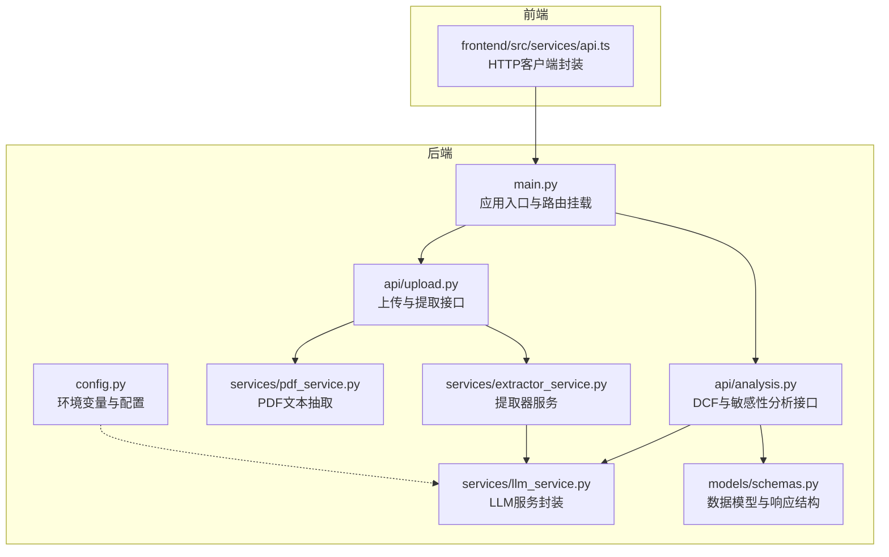
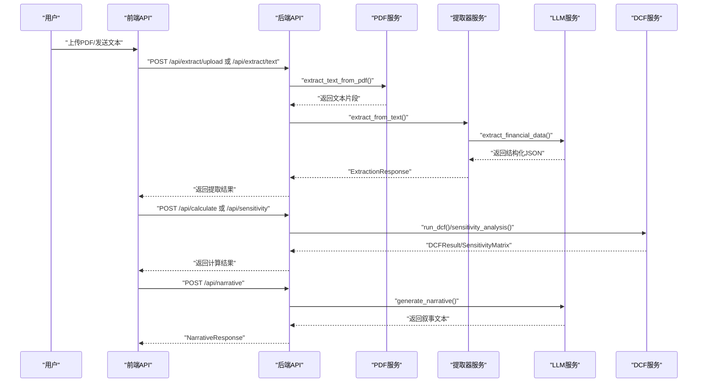
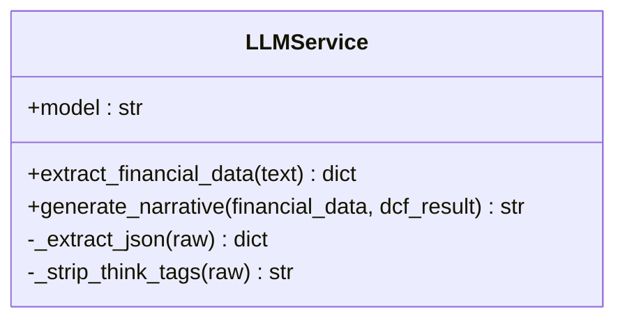
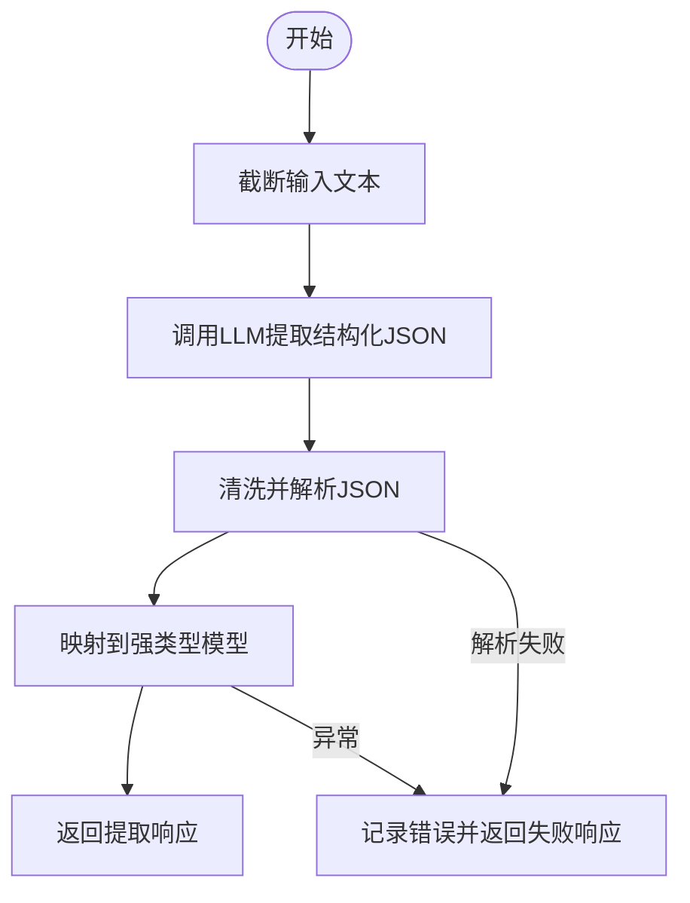
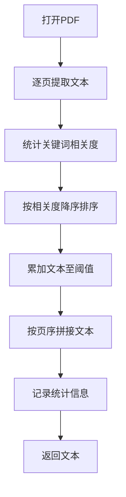
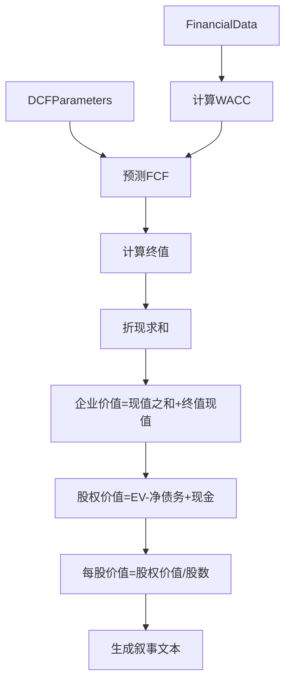
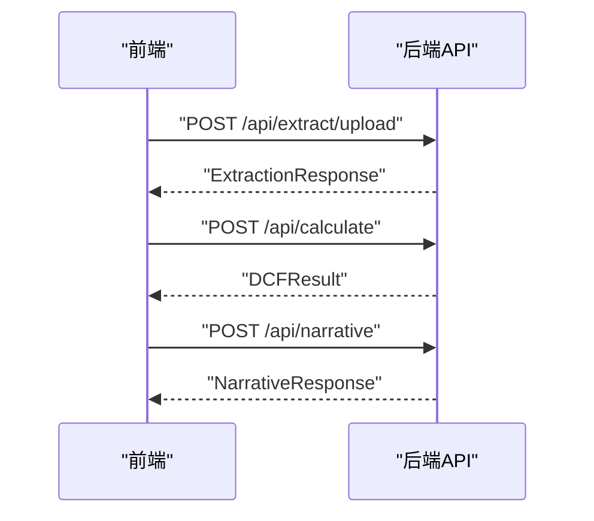
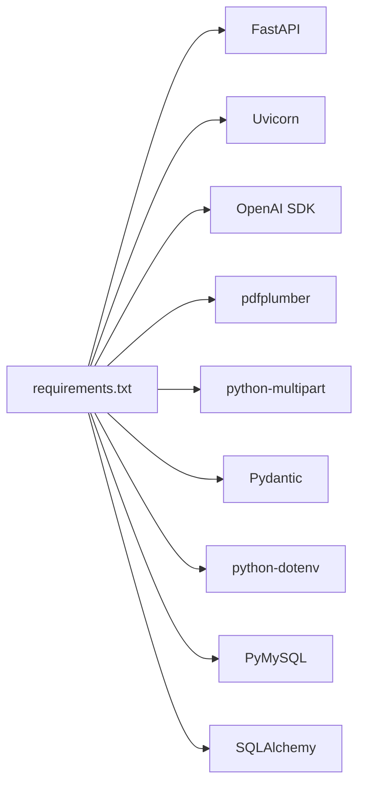

# AI集成

<cite>
**本文引用的文件**
- [backend/main.py](file://backend/main.py)
- [backend/config.py](file://backend/config.py)
- [backend/services/llm_service.py](file://backend/services/llm_service.py)
- [backend/services/extractor_service.py](file://backend/services/extractor_service.py)
- [backend/services/pdf_service.py](file://backend/services/pdf_service.py)
- [backend/models/schemas.py](file://backend/models/schemas.py)
- [backend/api/upload.py](file://backend/api/upload.py)
- [backend/api/analysis.py](file://backend/api/analysis.py)
- [backend/requirements.txt](file://backend/requirements.txt)
- [frontend/src/services/api.ts](file://frontend/src/services/api.ts)
</cite>

## 目录
1. [简介](#简介)
2. [项目结构](#项目结构)
3. [核心组件](#核心组件)
4. [架构总览](#架构总览)
5. [详细组件分析](#详细组件分析)
6. [依赖分析](#依赖分析)
7. [性能考虑](#性能考虑)
8. [故障排查指南](#故障排查指南)
9. [结论](#结论)
10. [附录](#附录)

## 简介
本文件面向DCF估值智能体的AI集成功能，系统性阐述MiniMax LLM服务的集成方案与AI数据提取服务的实现原理。内容覆盖API配置、认证机制、请求/响应处理、提示词设计、文本解析与结构化数据提取、财务数据分析场景（PDF内容理解、关键指标提取、财务比率计算）、错误处理策略、性能优化与成本控制方法，以及扩展性与替代方案建议。

## 项目结构
后端采用FastAPI框架，按功能模块组织：API路由、业务服务层（LLM、PDF文本抽取、DCF计算、数据提取）、模型定义（Pydantic）与配置。前端通过Axios封装REST接口，代理到后端。

图表来源
- [backend/main.py:18-35](file://backend/main.py#L18-L35)
- [backend/api/upload.py:13-13](file://backend/api/upload.py#L13-L13)
- [backend/api/analysis.py:15-15](file://backend/api/analysis.py#L15-L15)
- [backend/services/llm_service.py:70-77](file://backend/services/llm_service.py#L70-L77)
- [backend/services/extractor_service.py:27-67](file://backend/services/extractor_service.py#L27-L67)
- [backend/services/pdf_service.py:26-68](file://backend/services/pdf_service.py#L26-L68)
- [backend/models/schemas.py:8-101](file://backend/models/schemas.py#L8-L101)
- [backend/config.py:10-21](file://backend/config.py#L10-L21)
- [frontend/src/services/api.ts:11-15](file://frontend/src/services/api.ts#L11-L15)

章节来源
- [backend/main.py:18-35](file://backend/main.py#L18-L35)
- [backend/config.py:10-21](file://backend/config.py#L10-L21)

## 核心组件
- 配置与认证
  - 通过环境变量加载MiniMax API密钥、基础URL与模型名；同时提供MySQL配置与上传目录路径。
- LLM服务封装
  - 使用OpenAI兼容SDK连接MiniMax，封装结构化提示词、温度与token上限、JSON解析与错误处理。
- 提取器服务
  - 将LLM输出映射到强类型模型，提供安全数值转换与默认值填充。
- PDF文本抽取
  - 基于关键词匹配与页面相关度排序，选取关键财务页并限制最大字符数，提升LLM输入质量。
- API路由
  - 提供PDF上传与文本提取、DCF计算、敏感性分析、叙事生成等REST接口。
- 数据模型
  - 定义金融数据、DCF参数、投影、结果、敏感性矩阵及提取/叙事响应结构。

章节来源
- [backend/config.py:10-21](file://backend/config.py#L10-L21)
- [backend/services/llm_service.py:70-155](file://backend/services/llm_service.py#L70-L155)
- [backend/services/extractor_service.py:27-67](file://backend/services/extractor_service.py#L27-L67)
- [backend/services/pdf_service.py:26-68](file://backend/services/pdf_service.py#L26-L68)
- [backend/models/schemas.py:8-101](file://backend/models/schemas.py#L8-L101)
- [backend/api/upload.py:16-55](file://backend/api/upload.py#L16-L55)
- [backend/api/analysis.py:18-45](file://backend/api/analysis.py#L18-L45)

## 架构总览
下图展示了从用户上传PDF到生成DCF叙事的完整流程，包括PDF文本抽取、LLM结构化提取、DCF计算与叙事生成。

图表来源
- [backend/api/upload.py:16-55](file://backend/api/upload.py#L16-L55)
- [backend/services/pdf_service.py:26-68](file://backend/services/pdf_service.py#L26-L68)
- [backend/services/extractor_service.py:27-67](file://backend/services/extractor_service.py#L27-L67)
- [backend/services/llm_service.py:94-155](file://backend/services/llm_service.py#L94-L155)
- [backend/api/analysis.py:18-45](file://backend/api/analysis.py#L18-L45)
- [backend/services/dcf_service.py:85-163](file://backend/services/dcf_service.py#L85-L163)

## 详细组件分析

### MiniMax LLM集成与认证
- 认证与基础配置
  - 通过环境变量读取API密钥与基础URL，模型名固定为高吞吐版本。
- 请求与响应处理
  - 使用异步OpenAI客户端，设置较低temperature与较大max_tokens，确保结构化输出稳定。
  - 对LLM返回内容进行清洗（去除<think>标签与代码块），再尝试解析为JSON。
- 错误处理
  - 捕获JSON解析异常并记录上下文；其他异常统一记录并上抛。

图表来源
- [backend/services/llm_service.py:70-155](file://backend/services/llm_service.py#L70-L155)

章节来源
- [backend/config.py:10-12](file://backend/config.py#L10-L12)
- [backend/services/llm_service.py:70-123](file://backend/services/llm_service.py#L70-L123)

### AI数据提取服务
- 输入预处理
  - 截断超长文本，避免超出上下文长度限制。
- 结构化提示词
  - 明确要求返回JSON，统一金额单位与比率格式，缺失值提供估算指导。
- 输出解析与映射
  - 清洗LLM输出后解析为字典，再映射到强类型模型，提供安全数值转换与默认值。
- 异常处理
  - 返回标准化的提取响应，包含成功标志、提取文本片段与错误信息。

图表来源
- [backend/services/llm_service.py:94-123](file://backend/services/llm_service.py#L94-L123)
- [backend/services/extractor_service.py:27-67](file://backend/services/extractor_service.py#L27-L67)

章节来源
- [backend/services/llm_service.py:94-123](file://backend/services/llm_service.py#L94-L123)
- [backend/services/extractor_service.py:27-67](file://backend/services/extractor_service.py#L27-L67)

### PDF内容理解与文本抽取
- 关键词匹配与页面相关度
  - 定义中英文财务关键词集合，统计每页出现次数，按相关度排序。
- 文本拼接与长度控制
  - 选取高相关度页面，累计字符数不超过阈值，避免LLM输入过长。
- 日志与可观测性
  - 记录PDF总页数、选中页数与最终字符数，便于问题定位。

图表来源
- [backend/services/pdf_service.py:26-68](file://backend/services/pdf_service.py#L26-L68)

章节来源
- [backend/services/pdf_service.py:26-68](file://backend/services/pdf_service.py#L26-L68)

### 财务数据分析与应用
- DCF计算
  - 支持显式WACC或基于CAPM与资本结构计算WACC；按参数预测自由现金流，计算终值与现值，得出企业价值与股权价值，并计算每股价值与相对当前价格的上/下空间。
- 敏感性分析
  - 固定基期WACC，扫描WACC与终值增长率组合，输出股价敏感性矩阵。
- 叙事生成
  - 基于财务数据与DCF结果生成专业级估值分析文本，覆盖公司概览、趋势、假设、现金流预测、终值方法论、结论与风险。

图表来源
- [backend/services/dcf_service.py:12-163](file://backend/services/dcf_service.py#L12-L163)
- [backend/models/schemas.py:8-101](file://backend/models/schemas.py#L8-L101)

章节来源
- [backend/services/dcf_service.py:85-163](file://backend/services/dcf_service.py#L85-L163)
- [backend/models/schemas.py:58-70](file://backend/models/schemas.py#L58-L70)

### API调用模式与前端交互
- 后端路由
  - /api/extract/upload：上传PDF并返回提取结果。
  - /api/extract/text：直接传入文本并返回提取结果。
  - /api/calculate：计算DCF。
  - /api/sensitivity：敏感性分析。
  - /api/narrative：生成叙事。
- 前端封装
  - 统一设置baseURL与超时；对Axios错误进行归一化处理；导出各接口函数供页面调用。

图表来源
- [backend/api/upload.py:16-55](file://backend/api/upload.py#L16-L55)
- [backend/api/analysis.py:18-45](file://backend/api/analysis.py#L18-L45)
- [frontend/src/services/api.ts:28-81](file://frontend/src/services/api.ts#L28-L81)

章节来源
- [backend/api/upload.py:16-55](file://backend/api/upload.py#L16-L55)
- [backend/api/analysis.py:18-45](file://backend/api/analysis.py#L18-L45)
- [frontend/src/services/api.ts:28-81](file://frontend/src/services/api.ts#L28-L81)

## 依赖分析
- 运行时依赖
  - FastAPI、Uvicorn、OpenAI SDK、HTTPX、pdfplumber、python-multipart、Pydantic、python-dotenv、PyMySQL、SQLAlchemy。
- 组件耦合
  - API层仅依赖服务层与模型；服务层依赖配置与外部LLM；提取器服务依赖LLM服务与模型；PDF服务独立于LLM。
- 外部集成点
  - MiniMax LLM（OpenAI兼容）；MySQL（未在本节深入展开）。

图表来源
- [backend/requirements.txt:1-11](file://backend/requirements.txt#L1-L11)

章节来源
- [backend/requirements.txt:1-11](file://backend/requirements.txt#L1-L11)

## 性能考虑
- 上下文长度与截断
  - LLM输入文本在服务侧进行截断，避免超限；PDF抽取阶段也限制最大字符数，减少无效噪声。
- 温度与token上限
  - 提取阶段使用较低temperature与较高max_tokens，提高JSON稳定性与完整性。
- 解析健壮性
  - 去除<think>标签与代码块，增强JSON解析成功率。
- I/O与并发
  - 使用异步OpenAI客户端；PDF抽取按相关度排序，优先处理关键页面，缩短整体处理时间。
- 成本控制
  - 控制max_tokens与上下文长度；对重复请求进行缓存（可选）；选择合适模型规格（高吞吐版已用于MiniMax）。

## 故障排查指南
- 环境变量未配置
  - 确认MINIMAX_API_KEY、MINIMAX_BASE_URL、MINIMAX_MODEL等已正确写入.env并被加载。
- LLM JSON解析失败
  - 检查提示词是否强制返回JSON；查看日志中最后500字符上下文；确认模型支持JSON输出格式。
- PDF文本为空
  - 确认PDF包含财务相关内容；检查关键词匹配逻辑；查看日志中的字符统计。
- 接口超时
  - 前端与后端均设置了较长超时；若仍失败，检查网络与MiniMax可用性。
- 错误响应
  - 后端API返回标准化错误；前端对Axios错误进行统一处理，便于定位问题。

章节来源
- [backend/config.py:7-8](file://backend/config.py#L7-L8)
- [backend/services/llm_service.py:117-122](file://backend/services/llm_service.py#L117-L122)
- [backend/services/pdf_service.py:63-66](file://backend/services/pdf_service.py#L63-L66)
- [frontend/src/services/api.ts:17-26](file://frontend/src/services/api.ts#L17-L26)

## 结论
本项目通过OpenAI兼容SDK无缝接入MiniMax LLM，结合PDF文本抽取与强类型数据模型，实现了从非结构化财务报告到结构化指标与DCF分析的完整链路。提示词工程、稳健的JSON解析与完善的错误处理保障了系统的可靠性；通过上下文截断、相关度排序与合理的token配置，兼顾性能与成本。后续可在LLM之外引入多模型对比与回退策略，进一步提升鲁棒性与扩展性。

## 附录

### API定义与调用要点
- 提取接口
  - POST /api/extract/upload：上传PDF，返回ExtractionResponse。
  - POST /api/extract/text：传入文本，返回ExtractionResponse。
- 分析接口
  - POST /api/calculate：传入CalculateRequest，返回DCFResult。
  - POST /api/sensitivity：传入CalculateRequest，返回SensitivityMatrix。
  - POST /api/narrative：传入NarrativeRequest，返回NarrativeResponse。
- 前端调用
  - 使用封装好的函数进行调用，统一处理错误与超时。

章节来源
- [backend/api/upload.py:16-55](file://backend/api/upload.py#L16-L55)
- [backend/api/analysis.py:18-45](file://backend/api/analysis.py#L18-L45)
- [frontend/src/services/api.ts:28-81](file://frontend/src/services/api.ts#L28-L81)