# LLM服务配置

<cite>
**本文档引用的文件**
- [config.py](file://backend/config.py)
- [llm_service.py](file://backend/services/llm_service.py)
- [analysis.py](file://backend/api/analysis.py)
- [extractor_service.py](file://backend/services/extractor_service.py)
- [schemas.py](file://backend/models/schemas.py)
- [upload.py](file://backend/api/upload.py)
- [requirements.txt](file://backend/requirements.txt)
- [main.py](file://backend/main.py)
</cite>

## 目录
1. [简介](#简介)
2. [项目结构](#项目结构)
3. [核心组件](#核心组件)
4. [架构概览](#架构概览)
5. [详细组件分析](#详细组件分析)
6. [配置详解](#配置详解)
7. [依赖分析](#依赖分析)
8. [性能考虑](#性能考虑)
9. [故障排除指南](#故障排除指南)
10. [结论](#结论)

## 简介

本文件为DCFEstimate项目中的LLM服务配置技术文档，专注于MiniMax LLM服务的集成配置。该系统通过AsyncOpenAI客户端与MiniMax AI服务进行交互，实现了财务报告的自动解析和DCF估值分析功能。文档详细说明了API密钥管理、基础URL配置、模型选择等关键配置项，以及环境变量的使用方式和最佳实践。

## 项目结构

DCFEstimate项目采用分层架构设计，LLM服务作为核心组件位于后端服务层，通过FastAPI框架提供RESTful API接口。

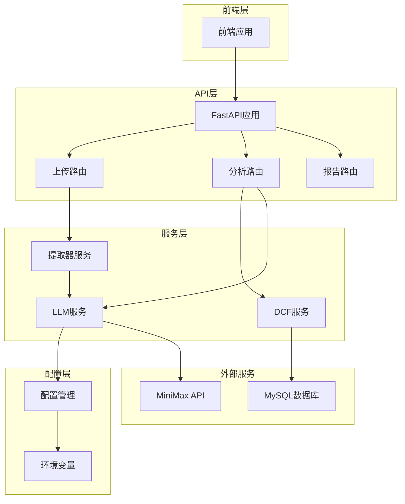

**图表来源**
- [main.py:18-35](file://backend/main.py#L18-L35)
- [analysis.py:15-44](file://backend/api/analysis.py#L15-L44)
- [upload.py:13-54](file://backend/api/upload.py#L13-L54)

**章节来源**
- [main.py:1-40](file://backend/main.py#L1-L40)
- [config.py:1-22](file://backend/config.py#L1-L22)

## 核心组件

### LLM服务架构

LLM服务采用单例模式设计，通过AsyncOpenAI客户端与MiniMax API进行异步通信。服务包含两个主要功能模块：财务数据提取和叙述性分析生成。

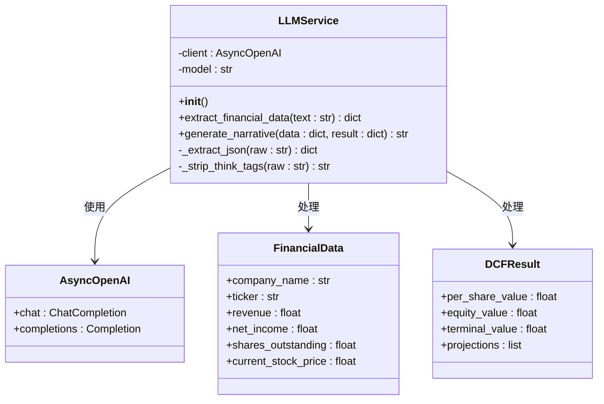

**图表来源**
- [llm_service.py:70-155](file://backend/services/llm_service.py#L70-L155)
- [schemas.py:8-101](file://backend/models/schemas.py#L8-L101)

### 配置管理系统

配置管理采用集中式设计，所有外部服务配置都通过config.py统一管理，支持环境变量覆盖和默认值设置。

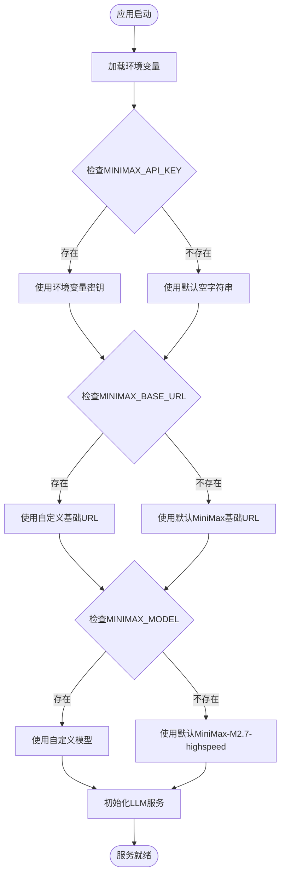

**图表来源**
- [config.py:10-12](file://backend/config.py#L10-L12)

**章节来源**
- [llm_service.py:70-155](file://backend/services/llm_service.py#L70-L155)
- [config.py:10-12](file://backend/config.py#L10-L12)

## 架构概览

系统采用微服务架构，LLM服务作为独立的服务组件，通过API网关与其他服务进行交互。

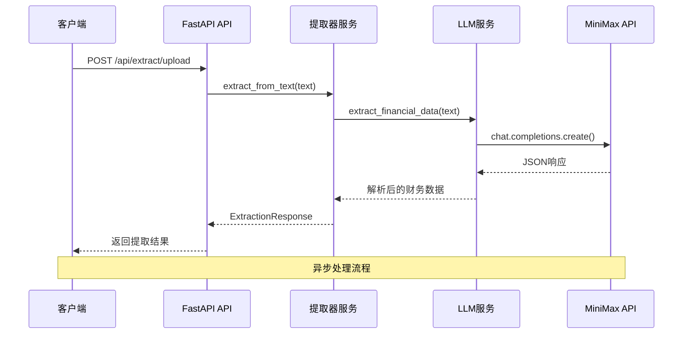

**图表来源**
- [extractor_service.py:27-66](file://backend/services/extractor_service.py#L27-L66)
- [llm_service.py:94-123](file://backend/services/llm_service.py#L94-L123)

## 详细组件分析

### LLM服务初始化过程

LLM服务的初始化过程涉及多个步骤，包括客户端创建、模型配置和错误处理。

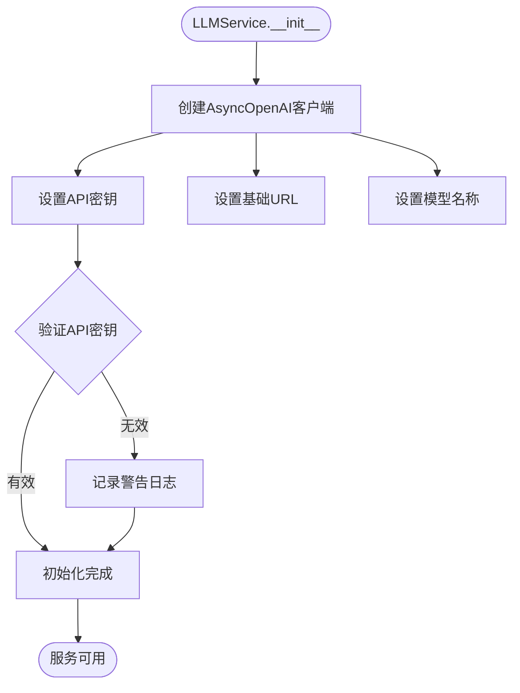

**图表来源**
- [llm_service.py:71-76](file://backend/services/llm_service.py#L71-L76)

#### 财务数据提取流程

财务数据提取是LLM服务的核心功能，通过精心设计的系统提示词指导AI准确提取财务指标。

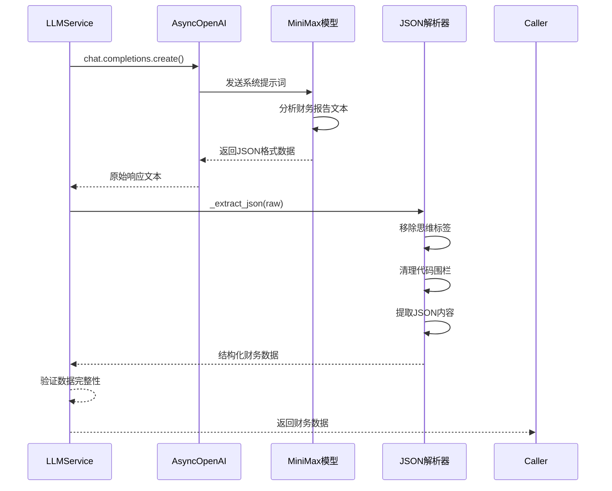

**图表来源**
- [llm_service.py:94-123](file://backend/services/llm_service.py#L94-L123)
- [llm_service.py:79-92](file://backend/services/llm_service.py#L79-L92)

#### 叙述性分析生成

叙述性分析功能将财务数据和DCF结果转换为专业的估值分析报告。

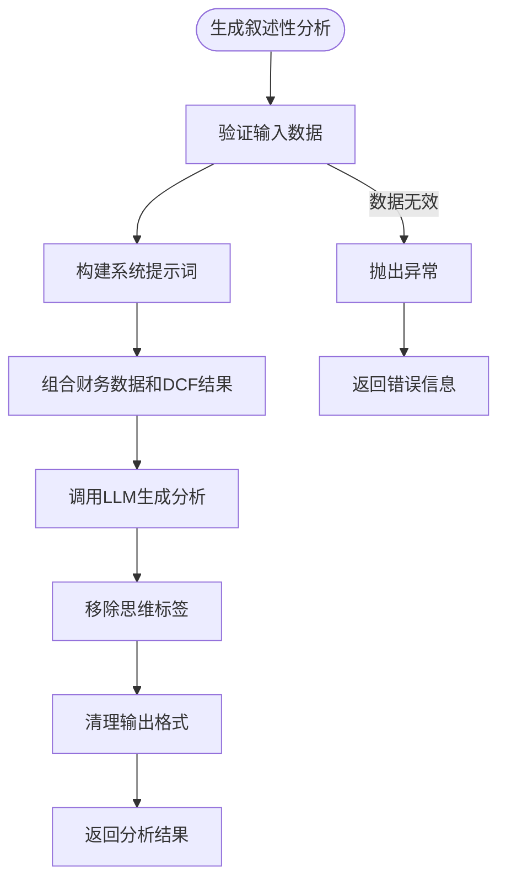

**图表来源**
- [llm_service.py:129-155](file://backend/services/llm_service.py#L129-L155)

**章节来源**
- [llm_service.py:70-155](file://backend/services/llm_service.py#L70-L155)

### API集成分析

LLM服务通过FastAPI路由与前端应用集成，提供完整的财务分析功能。

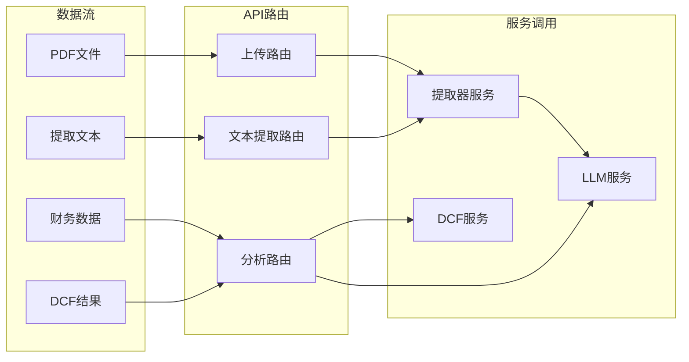

**图表来源**
- [analysis.py:18-44](file://backend/api/analysis.py#L18-L44)
- [upload.py:16-54](file://backend/api/upload.py#L16-L54)

**章节来源**
- [analysis.py:1-45](file://backend/api/analysis.py#L1-L45)
- [upload.py:1-55](file://backend/api/upload.py#L1-L55)

## 配置详解

### 环境变量配置

系统通过环境变量管理所有外部服务配置，支持灵活的部署和环境隔离。

| 配置项 | 类型 | 默认值 | 描述 | 必需 |
|--------|------|--------|------|------|
| MINIMAX_API_KEY | 字符串 | "" | MiniMax API密钥 | 是 |
| MINIMAX_BASE_URL | 字符串 | "https://api.minimaxi.com/v1" | MiniMax API基础URL | 否 |
| MINIMAX_MODEL | 字符串 | "MiniMax-M2.7-highspeed" | 使用的模型名称 | 否 |
| MYSQL_HOST | 字符串 | "localhost" | MySQL主机地址 | 否 |
| MYSQL_USER | 字符串 | "root" | MySQL用户名 | 否 |
| MYSQL_PASSWORD | 字符串 | "" | MySQL密码 | 否 |
| MYSQL_PORT | 整数 | 3306 | MySQL端口号 | 否 |
| MYSQL_DATABASE | 字符串 | "dcf_estimation" | MySQL数据库名 | 否 |

### 配置加载机制

配置系统采用分层加载策略，确保开发和生产环境的一致性。

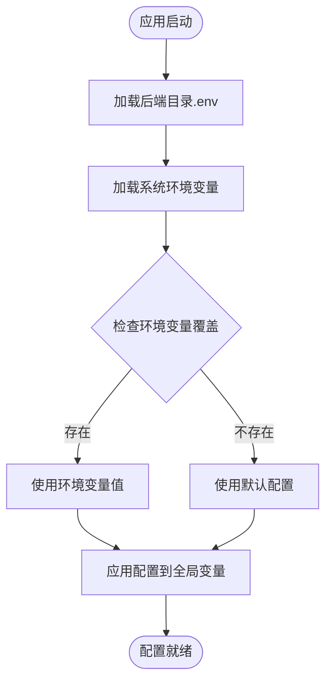

**图表来源**
- [config.py:6-8](file://backend/config.py#L6-L8)

### 安全配置最佳实践

#### API密钥管理

API密钥通过dotenv库安全加载，支持多环境配置分离。

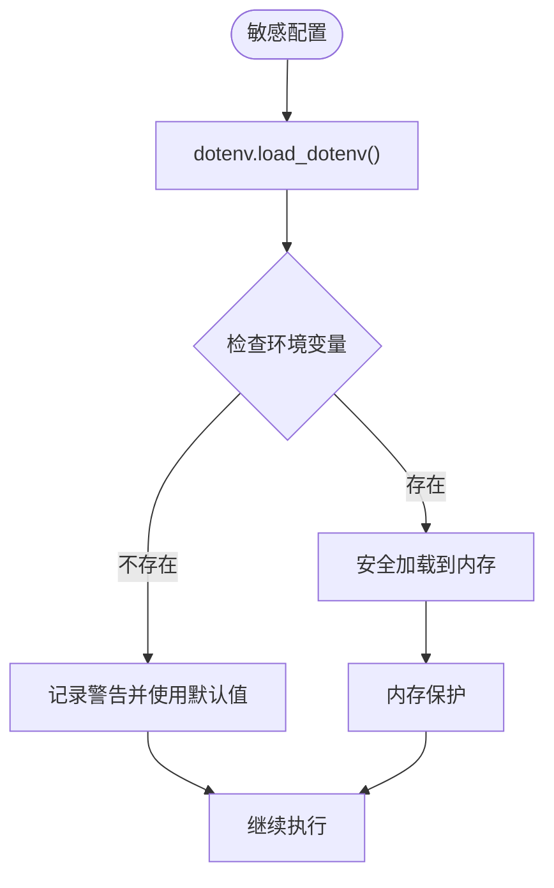

**图表来源**
- [config.py:10](file://backend/config.py#L10)

#### 认证机制

系统采用API密钥认证机制，所有请求都需要有效的认证凭据。

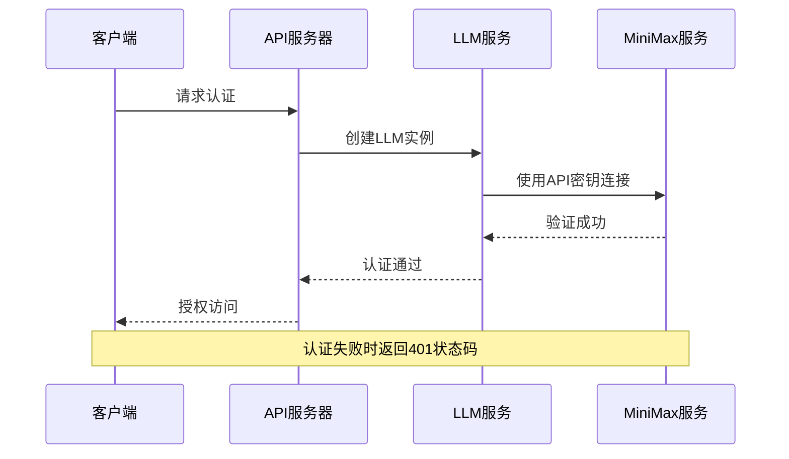

**图表来源**
- [llm_service.py:72-75](file://backend/services/llm_service.py#L72-L75)

**章节来源**
- [config.py:1-22](file://backend/config.py#L1-L22)
- [requirements.txt:1-11](file://backend/requirements.txt#L1-L11)

### 性能优化配置

#### 连接池配置

AsyncOpenAI客户端支持连接池优化，提高并发处理能力。

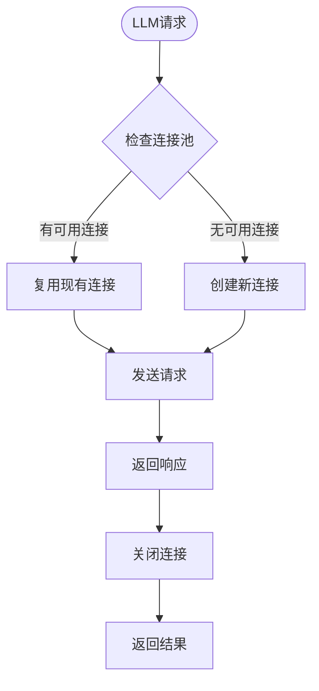

#### 超时和重试机制

系统支持超时配置和自动重试，确保服务稳定性。

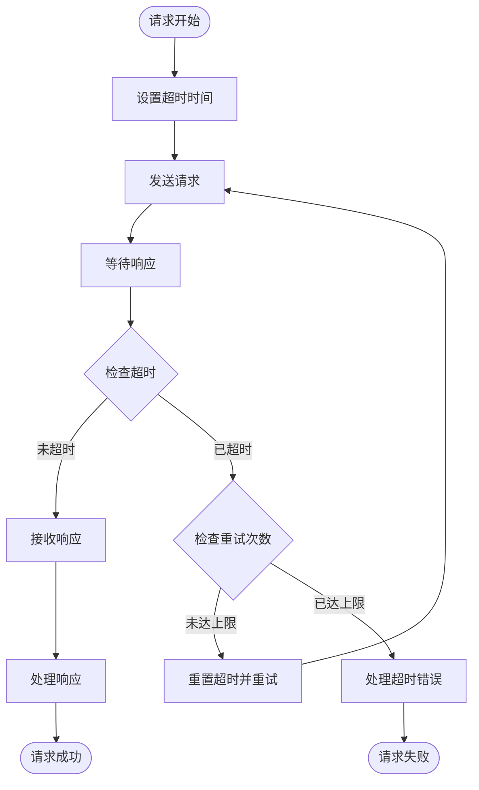

**章节来源**
- [llm_service.py:97-111](file://backend/services/llm_service.py#L97-L111)
- [llm_service.py:141-149](file://backend/services/llm_service.py#L141-L149)

## 依赖分析

### 外部依赖关系

系统依赖于多个第三方库来实现核心功能。

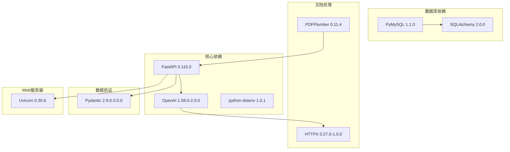

**图表来源**
- [requirements.txt:1-11](file://backend/requirements.txt#L1-L11)

### 内部模块依赖

内部模块之间存在清晰的依赖层次结构。

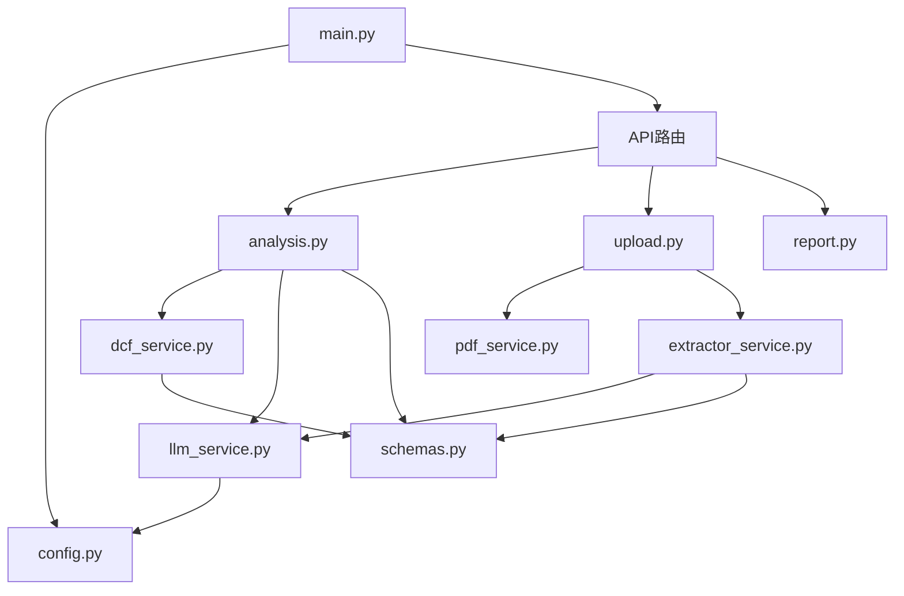

**图表来源**
- [main.py:8](file://backend/main.py#L8)
- [analysis.py:12-13](file://backend/api/analysis.py#L12-L13)

**章节来源**
- [requirements.txt:1-11](file://backend/requirements.txt#L1-L11)

## 性能考虑

### 并发处理优化

系统采用异步编程模型，支持高并发请求处理。

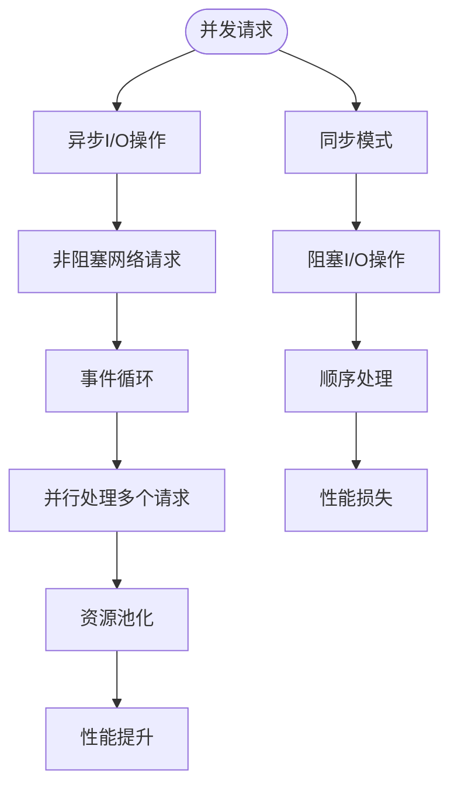

### 缓存策略

建议实现多级缓存策略以提高响应速度。

| 缓存层级 | 缓存类型 | 适用场景 | 实现建议 |
|----------|----------|----------|----------|
| 应用层缓存 | 内存缓存 | 热数据访问 | Redis或本地内存缓存 |
| 数据层缓存 | 查询结果缓存 | 频繁查询的数据 | 数据库查询缓存 |
| 网络层缓存 | API响应缓存 | LLM API调用 | CDN或代理缓存 |
| 文件层缓存 | 上传文件缓存 | PDF文件处理 | 临时文件系统缓存 |

### 资源管理

合理的资源管理对于保持系统稳定至关重要。

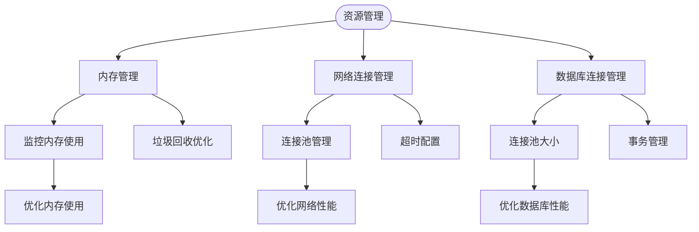

## 故障排除指南

### 常见配置问题

#### API密钥相关问题

**问题症状**：LLM调用失败，返回认证错误

**可能原因**：
1. API密钥未正确设置
2. API密钥格式不正确
3. API密钥权限不足

**解决步骤**：
1. 验证环境变量是否正确设置
2. 检查API密钥格式和有效期
3. 确认账户余额充足
4. 验证API权限范围

#### 网络连接问题

**问题症状**：请求超时或连接失败

**可能原因**：
1. 网络连接不稳定
2. 基础URL配置错误
3. 防火墙阻止连接

**解决步骤**：
1. 测试基础URL可达性
2. 检查网络连接状态
3. 验证防火墙设置
4. 尝试不同的网络环境

#### 模型配置问题

**问题症状**：模型调用失败或响应异常

**可能原因**：
1. 模型名称配置错误
2. 模型版本不兼容
3. 模型参数设置不当

**解决步骤**：
1. 验证模型名称正确性
2. 检查模型可用性
3. 调整模型参数设置
4. 查看模型文档说明

### 错误处理机制

系统实现了完善的错误处理机制，确保服务的健壮性。

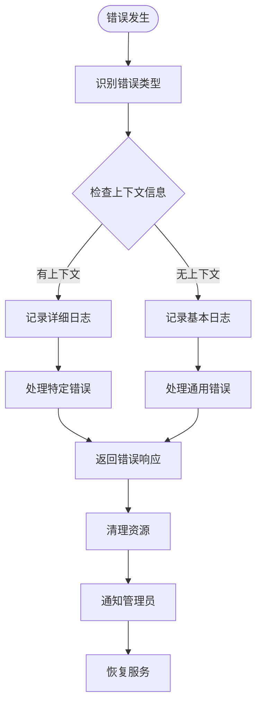

### 调试工具和技巧

#### 日志配置

系统使用Python标准logging模块进行日志记录。

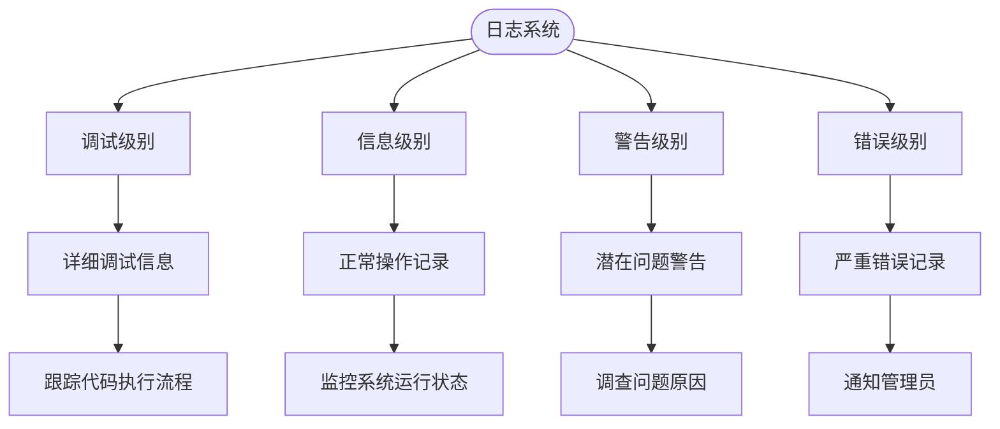

#### 性能监控

建议实施性能监控以及时发现和解决问题。

| 监控指标 | 目标阈值 | 监控频率 | 告警机制 |
|----------|----------|----------|----------|
| API响应时间 | < 2秒 | 每分钟 | 超过阈值告警 |
| 错误率 | < 1% | 每小时 | 异常波动告警 |
| 内存使用率 | < 80% | 每5分钟 | 超过阈值告警 |
| CPU使用率 | < 70% | 每5分钟 | 超过阈值告警 |
| 并发连接数 | < 100 | 每分钟 | 超过阈值告警 |

**章节来源**
- [llm_service.py:117-122](file://backend/services/llm_service.py#L117-L122)

## 结论

DCFEstimate项目中的LLM服务配置展现了现代AI应用的最佳实践。通过AsyncOpenAI客户端与MiniMax API的深度集成，系统实现了高效的财务数据分析和估值计算功能。

### 主要优势

1. **模块化设计**：清晰的组件分离使得系统易于维护和扩展
2. **异步处理**：采用异步编程模型提高了系统的并发处理能力
3. **配置灵活**：支持环境变量配置，适应不同部署环境
4. **错误处理**：完善的错误处理机制确保了服务的稳定性
5. **安全性**：通过dotenv库安全地管理敏感配置信息

### 改进建议

1. **添加配置验证**：在应用启动时验证所有必需配置项
2. **实现重试机制**：为API调用添加智能重试逻辑
3. **增加监控指标**：集成APM工具进行性能监控
4. **优化缓存策略**：实现多级缓存以提高响应速度
5. **增强日志记录**：添加结构化日志以支持更好的调试

该配置方案为类似AI应用的集成提供了良好的参考模板，通过合理的架构设计和配置管理，能够构建稳定可靠的AI服务系统。