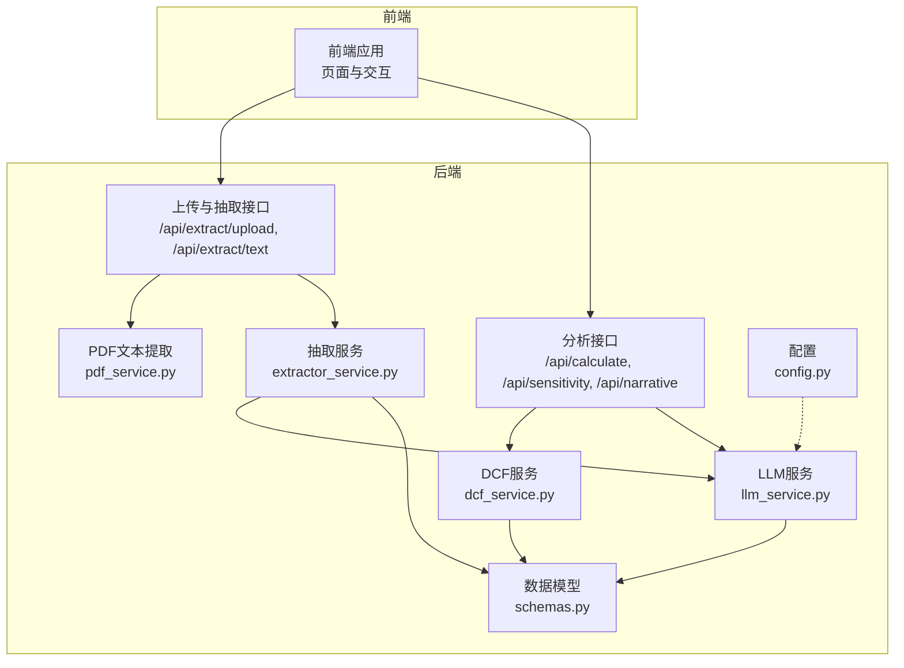
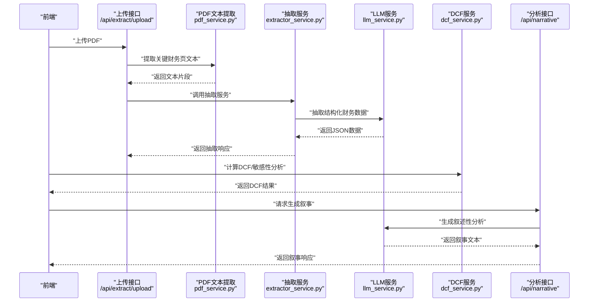
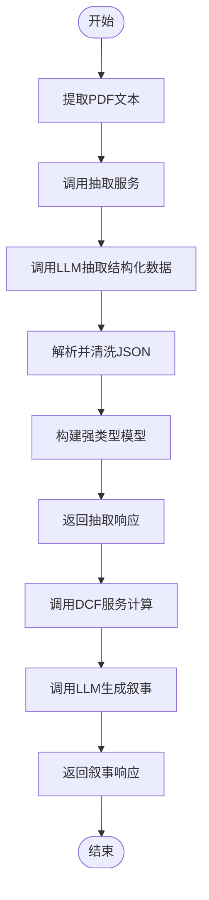
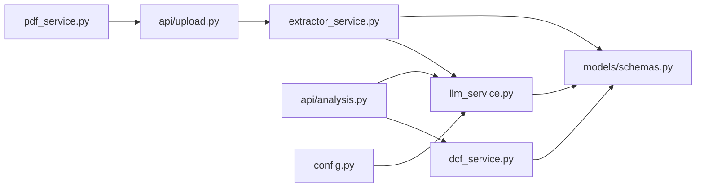

# 提示词工程

<cite>
**本文引用的文件**
- [backend/services/llm_service.py](file://backend/services/llm_service.py)
- [backend/services/extractor_service.py](file://backend/services/extractor_service.py)
- [backend/models/schemas.py](file://backend/models/schemas.py)
- [backend/api/analysis.py](file://backend/api/analysis.py)
- [backend/api/upload.py](file://backend/api/upload.py)
- [backend/services/pdf_service.py](file://backend/services/pdf_service.py)
- [backend/config.py](file://backend/config.py)
- [backend/main.py](file://backend/main.py)
</cite>

## 目录
1. [引言](#引言)
2. [项目结构](#项目结构)
3. [核心组件](#核心组件)
4. [架构总览](#架构总览)
5. [详细组件分析](#详细组件分析)
6. [依赖分析](#依赖分析)
7. [性能考量](#性能考量)
8. [故障排查指南](#故障排查指南)
9. [结论](#结论)
10. [附录](#附录)

## 引言
本文件面向提示词工程，围绕DCF估值智能体中的提示词设计与实现展开，重点解析EXTRACTION_SYSTEM_PROMPT与NARRATIVE_SYSTEM_PROMPT的设计理念、系统角色设定、任务指令与输出格式约束，并总结提示词优化原则与调试评估方法。同时给出提示词模板的使用示例与修改指南，覆盖不同财务报告类型（如年报、季报、审计报告）的适配策略；并说明温度参数与最大令牌数的配置策略及其对输出质量与成本的影响。

## 项目结构
后端采用FastAPI提供REST接口，前端通过Axios调用后端API完成上传、抽取、计算与叙事生成。提示词工程主要集中在LLM服务模块，负责将用户输入的财务文本转化为结构化数据，并生成专业的DCF估值叙述性分析。

图表来源
- [backend/main.py:18-35](file://backend/main.py#L18-L35)
- [backend/api/upload.py:13-54](file://backend/api/upload.py#L13-L54)
- [backend/api/analysis.py:15-44](file://backend/api/analysis.py#L15-L44)
- [backend/services/extractor_service.py:27-66](file://backend/services/extractor_service.py#L27-L66)
- [backend/services/llm_service.py:70-155](file://backend/services/llm_service.py#L70-L155)
- [backend/services/dcf_service.py:85-162](file://backend/services/dcf_service.py#L85-L162)
- [backend/services/pdf_service.py:26-67](file://backend/services/pdf_service.py#L26-L67)
- [backend/models/schemas.py:8-101](file://backend/models/schemas.py#L8-L101)
- [backend/config.py:10-22](file://backend/config.py#L10-L22)

章节来源
- [backend/main.py:18-35](file://backend/main.py#L18-L35)
- [backend/api/upload.py:13-54](file://backend/api/upload.py#L13-L54)
- [backend/api/analysis.py:15-44](file://backend/api/analysis.py#L15-L44)

## 核心组件
- 提示词定义与调用
  - EXTRACTION_SYSTEM_PROMPT：用于从财务报告中抽取结构化财务数据，明确字段清单、单位约定与数值格式要求。
  - NARRATIVE_SYSTEM_PROMPT：用于根据财务数据与DCF结果生成专业级估值叙述性分析。
- LLM服务
  - 封装异步客户端与模型配置，提供抽取与叙事两大能力，内置JSON提取与思维标签清理逻辑。
- 抽取服务
  - 调用LLM服务进行抽取，将原始字典安全转换为强类型模型，并返回抽取响应。
- DCF服务
  - 实现WACC计算、自由现金流预测、终值计算与敏感性分析，支撑叙事生成的数据基础。
- PDF服务
  - 基于关键词与页面相关度筛选关键财务页，限制最大字符数，提升抽取效率与准确性。
- 数据模型
  - 定义FinancialData、DCFParameters、FCFProjection、DCFResult、SensitivityMatrix、ExtractionResponse、NarrativeRequest/NarrativeResponse等，确保前后端数据契约一致。

章节来源
- [backend/services/llm_service.py:14-67](file://backend/services/llm_service.py#L14-L67)
- [backend/services/llm_service.py:70-155](file://backend/services/llm_service.py#L70-L155)
- [backend/services/extractor_service.py:27-66](file://backend/services/extractor_service.py#L27-L66)
- [backend/services/dcf_service.py:12-162](file://backend/services/dcf_service.py#L12-L162)
- [backend/services/pdf_service.py:26-67](file://backend/services/pdf_service.py#L26-L67)
- [backend/models/schemas.py:8-101](file://backend/models/schemas.py#L8-L101)

## 架构总览
下图展示了从上传PDF到生成叙事的完整链路，突出提示词在抽取与叙事阶段的关键作用。

图表来源
- [backend/api/upload.py:16-54](file://backend/api/upload.py#L16-L54)
- [backend/services/pdf_service.py:26-67](file://backend/services/pdf_service.py#L26-L67)
- [backend/services/extractor_service.py:27-66](file://backend/services/extractor_service.py#L27-L66)
- [backend/services/llm_service.py:94-155](file://backend/services/llm_service.py#L94-L155)
- [backend/services/dcf_service.py:85-162](file://backend/services/dcf_service.py#L85-L162)
- [backend/api/analysis.py:34-44](file://backend/api/analysis.py#L34-L44)

## 详细组件分析

### 提示词设计与实现策略
- EXTRACTION_SYSTEM_PROMPT
  - 系统角色：资深财务分析师AI，职责是“从财务报告文本中提取结构化财务数据”。
  - 任务指令：明确列出需提取的关键字段清单（公司名称、股票代码、货币单位、报告年度、收入、利润、现金流、杠杆、估值因子等），并给出单位与数值格式的强制规范（统一为“元”，比率使用小数）。
  - 输出格式：要求仅返回JSON对象，不包含Markdown代码块或额外文字；若缺失数据，允许基于其他数据合理估算。
  - 关键规则：单位换算（万元、亿元转元）、比率小数化、缺失值处理策略。
- NARRATIVE_SYSTEM_PROMPT
  - 系统角色：高级股权研究分析师，职责是“基于财务数据与DCF结果撰写专业级估值叙述性分析”。
  - 内容框架：公司概览与关键财务指标、收入与盈利能力趋势、WACC假设与依据、自由现金流预测摘要、终值方法论、估值结论与每股内在价值、关键风险与敏感性。
  - 语言与风格：与输入数据保持同一语言，简洁而全面，使用专业金融术语。

章节来源
- [backend/services/llm_service.py:14-67](file://backend/services/llm_service.py#L14-L67)

### 温度参数与最大令牌数配置
- 配置策略
  - 抽取阶段（extract_financial_data）：temperature=0.1，max_tokens=16000。低温度确保抽取行为稳定、可重复，避免发散；较大max_tokens满足财务文本长度需求。
  - 叙事阶段（generate_narrative）：temperature=0.4，max_tokens=16000。适度提高温度以增强创造性与流畅性，同时控制上下文长度。
- 对输出质量与成本的影响
  - 温度越低，输出越确定、越接近训练分布；温度越高，多样性增加但可能降低一致性与准确性。
  - 最大令牌数影响上下文长度与推理成本，过短可能导致截断，过长会增加延迟与费用。
- 建议
  - 在抽取阶段优先保证“可执行性”与“一致性”，在叙事阶段平衡“创造性”与“准确性”。

章节来源
- [backend/services/llm_service.py:94-155](file://backend/services/llm_service.py#L94-L155)

### 提示词优化原则
- 清晰性
  - 明确角色与任务边界，限定输出格式与约束条件，减少歧义。
- 一致性
  - 统一单位、数值表达方式与字段命名，确保抽取与后续计算环节无缝衔接。
- 可执行性
  - 提供缺失值处理策略与边界条件判断，便于程序化解析与稳健落地。
- 可维护性
  - 将提示词集中管理，便于版本迭代与A/B对比实验。

章节来源
- [backend/services/llm_service.py:14-67](file://backend/services/llm_service.py#L14-L67)

### 提示词模板使用示例与修改指南
- 使用示例
  - 抽取流程：将PDF提取后的文本片段作为用户消息主体，附加EXTRACTION_SYSTEM_PROMPT，调用抽取接口，得到结构化财务数据。
  - 叙事流程：将抽取到的财务数据与DCF结果拼接为用户消息主体，附加NARRATIVE_SYSTEM_PROMPT，调用叙事接口，得到叙述性分析。
- 修改指南
  - 不同财务报告类型（年报、季报、审计报告）的字段侧重点不同，可在提示词中增加对应字段的优先级与权重说明；例如年报更强调利润表与现金流量表，季报更关注同比增速。
  - 若目标语言为英文，建议将提示词翻译为英文并调整语言风格；当前NARRATIVE_SYSTEM_PROMPT已为英文，EXTRACTION_SYSTEM_PROMPT可按需改为英文以提升跨语言一致性。
  - 对于多币种报告，可在提示词中明确汇率转换策略与基准货币，确保统一为“元”。

章节来源
- [backend/api/upload.py:16-54](file://backend/api/upload.py#L16-L54)
- [backend/api/analysis.py:34-44](file://backend/api/analysis.py#L34-L44)
- [backend/services/llm_service.py:14-67](file://backend/services/llm_service.py#L14-L67)

### 数据流与处理逻辑
- 抽取流程
  - PDF文本提取 → 抽取服务调用LLM → 解析JSON并安全转换为强类型模型 → 返回抽取响应。
- 计算与叙事流程
  - 输入财务数据与参数 → DCF服务计算WACC、FCF、终值与估值 → 可选敏感性分析 → LLM生成叙述性分析。

图表来源
- [backend/services/pdf_service.py:26-67](file://backend/services/pdf_service.py#L26-L67)
- [backend/services/extractor_service.py:27-66](file://backend/services/extractor_service.py#L27-L66)
- [backend/services/llm_service.py:94-155](file://backend/services/llm_service.py#L94-L155)
- [backend/services/dcf_service.py:85-162](file://backend/services/dcf_service.py#L85-L162)

## 依赖分析
- 组件耦合
  - 抽取服务依赖LLM服务；LLM服务依赖配置模块；分析接口依赖DCF服务与LLM服务；PDF服务独立但被上传接口调用。
- 外部依赖
  - LLM服务封装异步客户端与模型配置，受环境变量驱动；DCF服务依赖FinancialData与参数模型；前端通过API路由访问后端能力。

图表来源
- [backend/api/upload.py:16-54](file://backend/api/upload.py#L16-L54)
- [backend/api/analysis.py:18-44](file://backend/api/analysis.py#L18-L44)
- [backend/services/pdf_service.py:26-67](file://backend/services/pdf_service.py#L26-L67)
- [backend/services/extractor_service.py:27-66](file://backend/services/extractor_service.py#L27-L66)
- [backend/services/llm_service.py:70-155](file://backend/services/llm_service.py#L70-L155)
- [backend/services/dcf_service.py:85-162](file://backend/services/dcf_service.py#L85-L162)
- [backend/models/schemas.py:8-101](file://backend/models/schemas.py#L8-L101)
- [backend/config.py:10-22](file://backend/config.py#L10-L22)

## 性能考量
- 上下文长度与截断
  - 抽取阶段对输入文本进行截断，避免超长上下文导致性能下降与成本上升；建议在上游PDF提取时就进行关键页筛选与字符数限制。
- 温度与采样策略
  - 抽取阶段使用较低温度以提升稳定性；叙事阶段适度提高温度以增强可读性。
- 并发与缓存
  - 对于重复的抽取与计算请求，可引入缓存机制（如基于哈希的键值存储）以减少重复调用。

## 故障排查指南
- JSON解析失败
  - 现象：抽取阶段抛出JSON解析异常。
  - 排查：检查提示词是否严格要求仅返回JSON对象；确认LLM输出未包含代码块或多余文字；必要时在提示词中强化“仅返回JSON”的约束。
- 抽取字段缺失
  - 现象：抽取结果缺少某些字段。
  - 排查：确认提示词字段清单与实际报告字段匹配；在抽取服务中对缺失字段设置合理的默认值与回退策略。
- 叙事生成异常
  - 现象：叙事接口返回错误。
  - 排查：检查输入的财务数据与DCF结果是否为空；确认LLM服务的温度与最大令牌数配置是否合理；验证模型可用性与网络连通性。
- PDF文本提取不足
  - 现象：抽取结果为空或质量差。
  - 排查：确认PDF中是否存在财务关键词；检查页面相关度评分与字符数上限；适当放宽字符数限制或增加关键词集合。

章节来源
- [backend/services/llm_service.py:117-122](file://backend/services/llm_service.py#L117-L122)
- [backend/services/extractor_service.py:61-66](file://backend/services/extractor_service.py#L61-L66)
- [backend/services/pdf_service.py:26-67](file://backend/services/pdf_service.py#L26-L67)

## 结论
本项目的提示词工程围绕“抽取—计算—叙事”三阶段展开：抽取阶段强调清晰性与一致性，确保结构化数据质量；叙事阶段强调专业性与可读性，结合DCF结果生成高质量分析。通过严格的提示词设计、合理的参数配置与完善的错误处理机制，系统能够在不同财务报告类型下稳定运行，并为后续的可视化与导出奠定坚实基础。

## 附录
- 提示词模板路径
  - 抽取提示词：[EXTRACTION_SYSTEM_PROMPT:14-50](file://backend/services/llm_service.py#L14-L50)
  - 叙事提示词：[NARRATIVE_SYSTEM_PROMPT:52-67](file://backend/services/llm_service.py#L52-L67)
- 关键流程入口
  - 抽取接口：[上传与文本抽取:16-54](file://backend/api/upload.py#L16-L54)
  - 分析接口：[计算、敏感性与叙事:18-44](file://backend/api/analysis.py#L18-L44)
- 数据模型参考
  - [FinancialData:8-30](file://backend/models/schemas.py#L8-L30)
  - [DCFParameters:32-43](file://backend/models/schemas.py#L32-L43)
  - [FCFProjection:45-56](file://backend/models/schemas.py#L45-L56)
  - [DCFResult:58-70](file://backend/models/schemas.py#L58-L70)
  - [SensitivityMatrix:72-76](file://backend/models/schemas.py#L72-L76)
  - [ExtractionResponse:78-83](file://backend/models/schemas.py#L78-L83)
  - [NarrativeRequest/NarrativeResponse:85-96](file://backend/models/schemas.py#L85-L96)
- 配置参考
  - [LLM模型与密钥配置:10-22](file://backend/config.py#L10-L22)