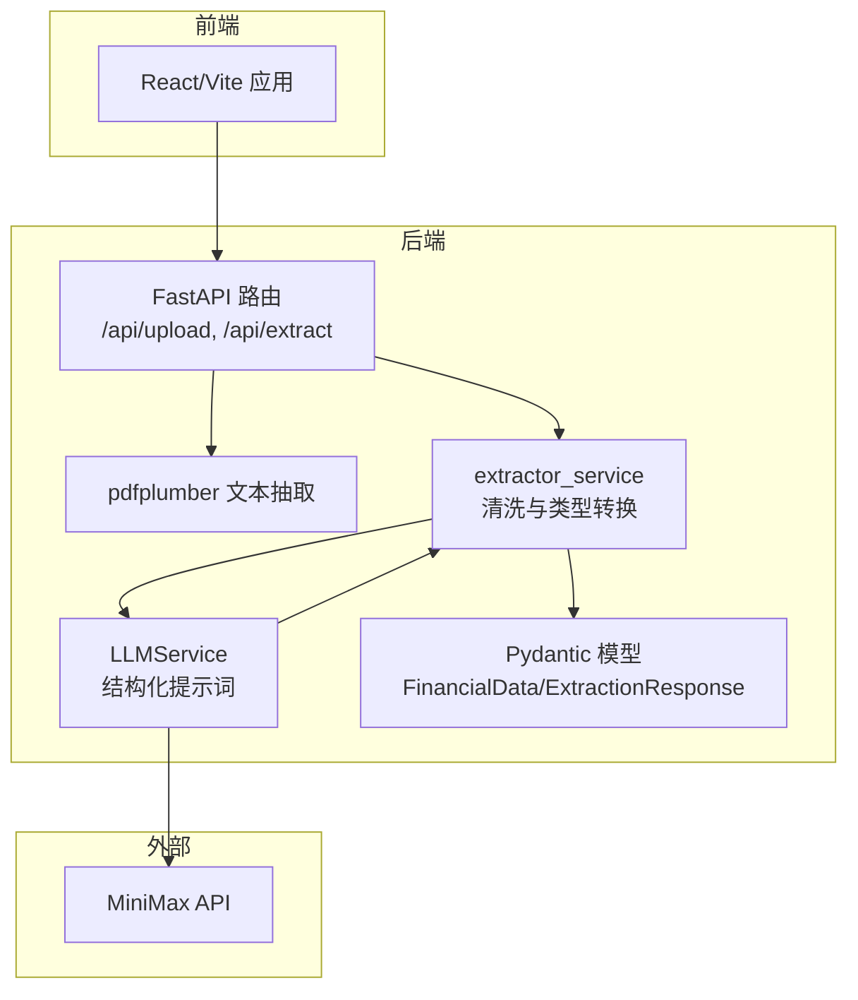
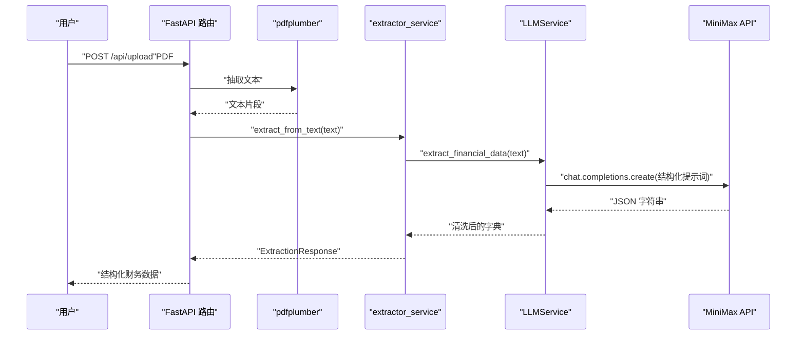
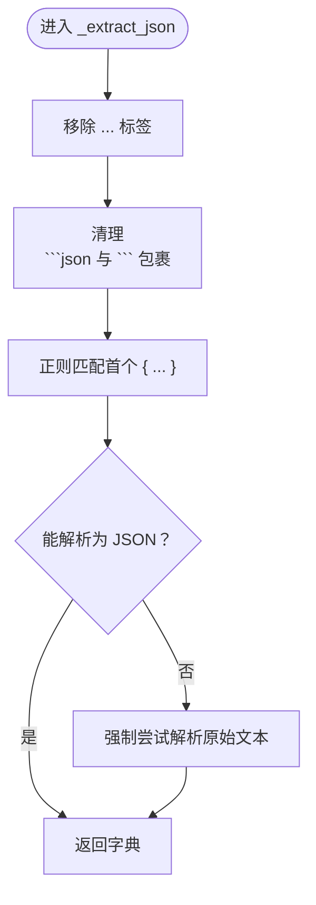
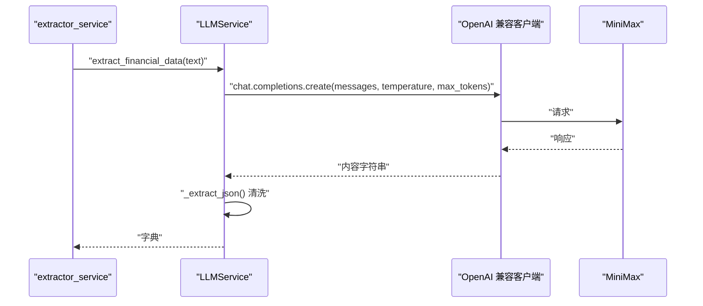
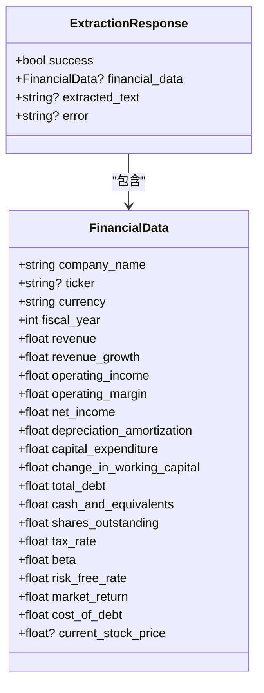
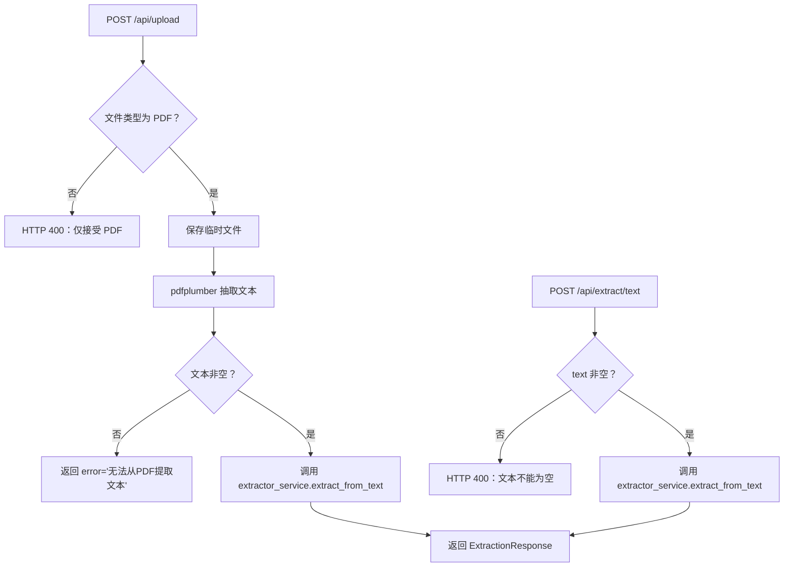
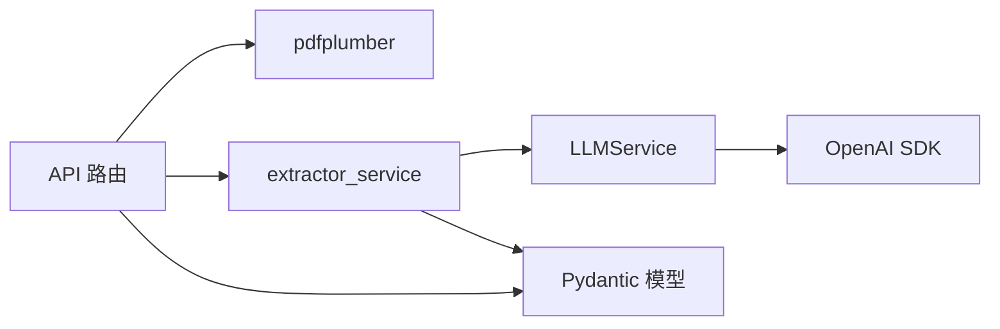

# 数据提取算法

<cite>
**本文引用的文件**
- [backend/services/extractor_service.py](file://backend/services/extractor_service.py)
- [backend/services/llm_service.py](file://backend/services/llm_service.py)
- [backend/models/schemas.py](file://backend/models/schemas.py)
- [backend/api/upload.py](file://backend/api/upload.py)
- [backend/services/pdf_service.py](file://backend/services/pdf_service.py)
- [backend/main.py](file://backend/main.py)
- [backend/config.py](file://backend/config.py)
- [backend/requirements.txt](file://backend/requirements.txt)
- [dcf_valuation_agent_7d1f15cc.plan.md](file://dcf_valuation_agent_7d1f15cc.plan.md)
- [backend/examples/integration_example.py](file://backend/examples/integration_example.py)
- [backend/examples/db_usage_example.py](file://backend/examples/db_usage_example.py)
</cite>

## 目录
1. [引言](#引言)
2. [项目结构](#项目结构)
3. [核心组件](#核心组件)
4. [架构总览](#架构总览)
5. [详细组件分析](#详细组件分析)
6. [依赖分析](#依赖分析)
7. [性能考量](#性能考量)
8. [故障排查指南](#故障排查指南)
9. [结论](#结论)
10. [附录](#附录)

## 引言
本文件面向“AI数据提取算法”的技术文档，聚焦于从财务报告中提取结构化数据的实现细节。内容涵盖：
- EXTRACTION_SYSTEM_PROMPT 的设计原则与关键字段定义
- JSON 解析与数据清洗流程（正则表达式匹配、思维标签去除、代码块清理）
- 数据格式标准化规则（单位转换、比率格式化）
- 提取流程的端到端示例（输入文本处理、LLM 调用、结果解析）
- 错误处理与异常策略

该系统采用 FastAPI + MiniMax（OpenAI 兼容）的后端架构，结合 pdfplumber 进行 PDF 文本抽取，最终通过结构化提示词驱动 LLM 输出 JSON，再由后端进行清洗与类型校验。

## 项目结构
后端采用分层组织：
- API 层：路由与对外接口
- 服务层：LLM 服务、PDF 文本抽取、金融数据提取、DCF 计算引擎
- 模型层：Pydantic 数据模型与响应结构
- 配置层：环境变量与外部服务地址



图表来源
- [backend/main.py:18-35](file://backend/main.py#L18-L35)
- [backend/api/upload.py:16-54](file://backend/api/upload.py#L16-L54)
- [backend/services/pdf_service.py:26-67](file://backend/services/pdf_service.py#L26-L67)
- [backend/services/llm_service.py:70-123](file://backend/services/llm_service.py#L70-L123)
- [backend/services/extractor_service.py:27-66](file://backend/services/extractor_service.py#L27-L66)
- [backend/models/schemas.py:8-83](file://backend/models/schemas.py#L8-L83)

章节来源
- [backend/main.py:18-35](file://backend/main.py#L18-L35)
- [backend/api/upload.py:16-54](file://backend/api/upload.py#L16-L54)
- [backend/services/pdf_service.py:26-67](file://backend/services/pdf_service.py#L26-L67)
- [backend/services/llm_service.py:70-123](file://backend/services/llm_service.py#L70-L123)
- [backend/services/extractor_service.py:27-66](file://backend/services/extractor_service.py#L27-L66)
- [backend/models/schemas.py:8-83](file://backend/models/schemas.py#L8-L83)

## 核心组件
- LLMService：封装 MiniMax（OpenAI 兼容）调用，负责结构化提示词、JSON 清洗与解析、思维标签剔除、异常记录。
- extractor_service：接收原始 JSON，进行类型安全转换与默认值填充，构造 ExtractionResponse。
- pdf_service：基于关键词相关性排序选取关键财务页，限制最大字符数，拼接文本。
- API 层：上传 PDF 并抽取文本，或直接传入文本进行提取；返回标准化结构化结果。
- Pydantic 模型：定义 FinancialData、ExtractionResponse 等数据契约，保障前后端一致性。

章节来源
- [backend/services/llm_service.py:70-123](file://backend/services/llm_service.py#L70-L123)
- [backend/services/extractor_service.py:27-66](file://backend/services/extractor_service.py#L27-L66)
- [backend/services/pdf_service.py:26-67](file://backend/services/pdf_service.py#L26-L67)
- [backend/api/upload.py:16-54](file://backend/api/upload.py#L16-L54)
- [backend/models/schemas.py:8-83](file://backend/models/schemas.py#L8-L83)

## 架构总览
下图展示了从 PDF 上传到结构化数据输出的端到端流程：



图表来源
- [backend/api/upload.py:16-54](file://backend/api/upload.py#L16-L54)
- [backend/services/pdf_service.py:26-67](file://backend/services/pdf_service.py#L26-L67)
- [backend/services/extractor_service.py:27-66](file://backend/services/extractor_service.py#L27-L66)
- [backend/services/llm_service.py:94-123](file://backend/services/llm_service.py#L94-L123)

## 详细组件分析

### EXTRACTION_SYSTEM_PROMPT 设计原理与字段定义
- 设计目标：引导 LLM 从财务报告中提取固定 JSON 结构的关键财务指标，要求单位统一为“元”，比率以小数形式返回。
- 关键字段与约束：
  - 公司与货币：公司全称、股票代码（可空）、货币（默认 CNY）
  - 财务期间：报告年度（整数）
  - 收入与盈利：营业收入、营业利润、净利润、营业利润率、营收同比增长率
  - 现金流与资产：折旧摊销、资本支出、营运资本变动、货币资金
  - 负债与股本：总债务、总股本/流通股数
  - 折现参数：有效税率、Beta、无风险利率、市场预期回报率、债务成本
  - 其他：当前股价（可空）
- 单位与格式规则：
  - 金额单位统一为“元”；若原文单位为“万元”或“亿元”，需按规则转换为“元”
  - 比率以小数表示（如 14.23% 写为 0.1423）
  - 仅返回 JSON 对象，禁止 Markdown 代码块与额外文字

章节来源
- [backend/services/llm_service.py:14-50](file://backend/services/llm_service.py#L14-L50)

### JSON 解析与数据清洗
- 思维标签去除：使用正则移除<think>...</think>块，避免影响 JSON 解析
- 代码块清理：剥离 ```json 与 ``` 包裹，保留纯 JSON
- 边界提取：从任意文本中通过正则定位首个 { ... } JSON 片段并解析
- 异常处理：捕获 JSON 解析错误并抛出明确的 ValueError，同时记录日志



图表来源
- [backend/services/llm_service.py:78-92](file://backend/services/llm_service.py#L78-L92)

章节来源
- [backend/services/llm_service.py:78-92](file://backend/services/llm_service.py#L78-L92)

### 数据格式标准化规则
- 单位转换
  - 万元 → 元：乘以 10000
  - 亿元 → 元：乘以 100000000
- 比率格式化
  - 百分比 → 小数：原值除以 100
- 类型安全与默认值
  - 数值字段使用安全转换函数，失败时回退为默认值
  - 年度、股本等整数字段提供默认年份与默认数量

章节来源
- [backend/services/llm_service.py:44-49](file://backend/services/llm_service.py#L44-L49)
- [backend/services/extractor_service.py:11-24](file://backend/services/extractor_service.py#L11-L24)

### 输入文本处理与 LLM 调用
- 文本截断：限制最大字符长度，避免上下文溢出
- 结构化提示词：系统提示词明确字段清单、单位与格式要求
- 温度与令牌上限：设置较低温度与较高 max_tokens，提升结构化输出稳定性
- 响应清洗：先清洗再解析，保证 JSON 可靠性



图表来源
- [backend/services/extractor_service.py:27-31](file://backend/services/extractor_service.py#L27-L31)
- [backend/services/llm_service.py:94-123](file://backend/services/llm_service.py#L94-L123)

章节来源
- [backend/services/extractor_service.py:27-31](file://backend/services/extractor_service.py#L27-L31)
- [backend/services/llm_service.py:94-123](file://backend/services/llm_service.py#L94-L123)

### 结果解析与类型转换
- 字典到模型：将 LLM 返回的原始字典映射到 FinancialData 模型
- 安全转换：对数值字段进行 float/int 转换，失败或空值回退默认值
- 响应封装：构造 ExtractionResponse，包含 success、financial_data、extracted_text 或 error



图表来源
- [backend/models/schemas.py:8-83](file://backend/models/schemas.py#L8-L83)

章节来源
- [backend/models/schemas.py:8-83](file://backend/models/schemas.py#L8-L83)
- [backend/services/extractor_service.py:32-54](file://backend/services/extractor_service.py#L32-L54)

### API 集成与错误处理
- PDF 上传：校验文件类型，保存临时文件，调用 pdfplumber 抽取文本，再交由提取服务
- 文本直传：校验文本非空，直接调用提取服务
- 统一错误处理：任何异常均被捕获并返回 ExtractionResponse.error，避免泄露内部错误



图表来源
- [backend/api/upload.py:16-54](file://backend/api/upload.py#L16-L54)
- [backend/services/pdf_service.py:26-67](file://backend/services/pdf_service.py#L26-L67)
- [backend/services/extractor_service.py:27-66](file://backend/services/extractor_service.py#L27-L66)

章节来源
- [backend/api/upload.py:16-54](file://backend/api/upload.py#L16-L54)
- [backend/services/pdf_service.py:26-67](file://backend/services/pdf_service.py#L26-L67)
- [backend/services/extractor_service.py:27-66](file://backend/services/extractor_service.py#L27-L66)

## 依赖分析
- 外部依赖：OpenAI SDK（MiniMax 兼容）、pdfplumber、Pydantic、FastAPI、dotenv、MySQL（可选）
- 组件耦合：
  - API 层仅依赖服务层与模型层
  - 服务层之间低耦合：LLMService 独立封装外部调用；extractor_service 仅做类型转换
  - 配置集中管理，便于替换外部服务



图表来源
- [backend/requirements.txt:1-11](file://backend/requirements.txt#L1-L11)
- [backend/api/upload.py:16-54](file://backend/api/upload.py#L16-L54)
- [backend/services/pdf_service.py:26-67](file://backend/services/pdf_service.py#L26-L67)
- [backend/services/extractor_service.py:27-66](file://backend/services/extractor_service.py#L27-L66)
- [backend/services/llm_service.py:70-123](file://backend/services/llm_service.py#L70-L123)
- [backend/models/schemas.py:8-83](file://backend/models/schemas.py#L8-L83)

章节来源
- [backend/requirements.txt:1-11](file://backend/requirements.txt#L1-L11)
- [backend/config.py:10-21](file://backend/config.py#L10-L21)

## 性能考量
- 文本截断与页面筛选：pdfplumber 基于关键词相关性排序页面，限制最大字符数，减少 LLM 上下文负担
- LLM 请求参数：较低温度与较高 max_tokens 有助于稳定结构化输出
- 类型转换与默认值：避免无效值传播，降低下游计算成本
- 建议优化：
  - 对大文本分段处理并聚合结果
  - 缓存常见字段的估算值（如税率、Beta）
  - 对重复 PDF 进行去重与缓存

## 故障排查指南
- LLM 返回无效 JSON
  - 现象：JSON 解析异常，日志记录“无法解析 LLM JSON 响应”
  - 排查：检查提示词是否严格要求仅返回 JSON；确认外部服务可用
  - 参考路径：[backend/services/llm_service.py:117-122](file://backend/services/llm_service.py#L117-L122)
- PDF 文本为空
  - 现象：上传 PDF 后返回“无法从 PDF 提取文本”
  - 排查：确认 PDF 是否含可识别文本；检查 pdfplumber 抽取逻辑
  - 参考路径：[backend/api/upload.py:31-35](file://backend/api/upload.py#L31-L35)、[backend/services/pdf_service.py:26-67](file://backend/services/pdf_service.py#L26-L67)
- 参数缺失或类型错误
  - 现象：部分字段为空或类型不符
  - 排查：检查 extractor_service 的默认值与类型转换逻辑
  - 参考路径：[backend/services/extractor_service.py:32-54](file://backend/services/extractor_service.py#L32-L54)
- 外部服务配置
  - 现象：MiniMax 调用失败
  - 排查：核对 API Key、Base URL、Model 名称
  - 参考路径：[backend/config.py:10-12](file://backend/config.py#L10-L12)

章节来源
- [backend/services/llm_service.py:117-122](file://backend/services/llm_service.py#L117-L122)
- [backend/api/upload.py:31-35](file://backend/api/upload.py#L31-L35)
- [backend/services/pdf_service.py:26-67](file://backend/services/pdf_service.py#L26-L67)
- [backend/services/extractor_service.py:32-54](file://backend/services/extractor_service.py#L32-L54)
- [backend/config.py:10-12](file://backend/config.py#L10-L12)

## 结论
本系统通过“结构化提示词 + 正则清洗 + 类型安全转换”的组合，实现了从财务报告中稳定提取结构化数据的目标。EXTRACTION_SYSTEM_PROMPT 明确了字段、单位与格式要求；LLMService 提供鲁棒的 JSON 清洗能力；extractor_service 实现默认值与类型转换；API 层统一暴露上传与直传两种入口。建议在生产环境中增加分段处理、缓存与更细粒度的错误分类，以进一步提升吞吐与稳定性。

## 附录
- 端到端流程参考
  - PDF 上传与提取：[backend/api/upload.py:16-54](file://backend/api/upload.py#L16-L54)
  - 文本直传与提取：[backend/api/upload.py:45-54](file://backend/api/upload.py#L45-L54)
  - LLM 调用与清洗：[backend/services/llm_service.py:94-123](file://backend/services/llm_service.py#L94-L123)
  - 类型转换与响应封装：[backend/services/extractor_service.py:27-66](file://backend/services/extractor_service.py#L27-L66)
- 数据模型参考
  - 结构化财务数据模型：[backend/models/schemas.py:8-30](file://backend/models/schemas.py#L8-L30)
  - 提取结果模型：[backend/models/schemas.py:78-83](file://backend/models/schemas.py#L78-L83)
- 系统架构与实现规划参考
  - 项目计划与架构概览：[dcf_valuation_agent_7d1f15cc.plan.md:52-88](file://dcf_valuation_agent_7d1f15cc.plan.md#L52-L88)
  - 关键数据流序列图：[dcf_valuation_agent_7d1f15cc.plan.md:233-257](file://dcf_valuation_agent_7d1f15cc.plan.md#L233-L257)
- 数据库集成示例（历史数据存储与检索）
  - 完整集成示例：[backend/examples/integration_example.py:16-251](file://backend/examples/integration_example.py#L16-L251)
  - 基础使用示例：[backend/examples/db_usage_example.py:15-166](file://backend/examples/db_usage_example.py#L15-L166)