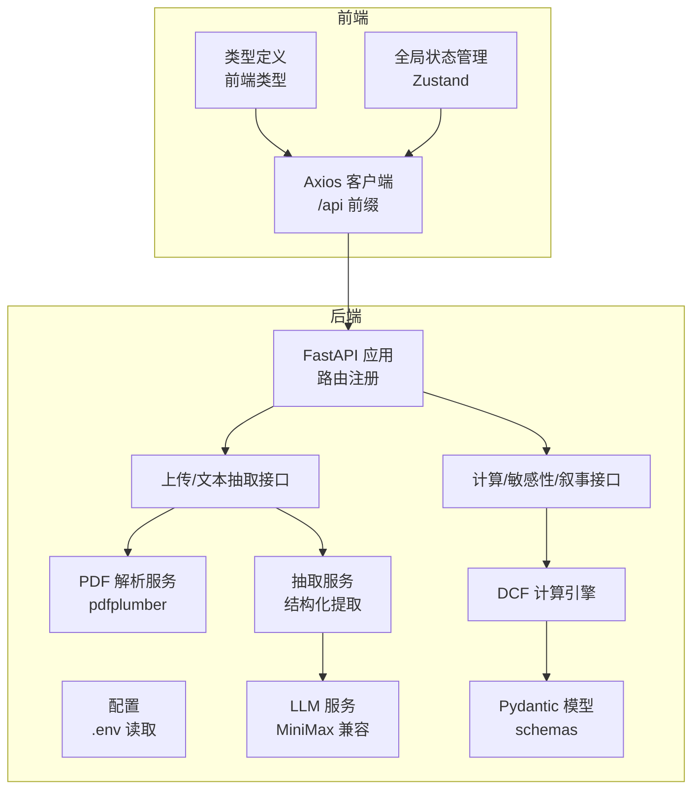
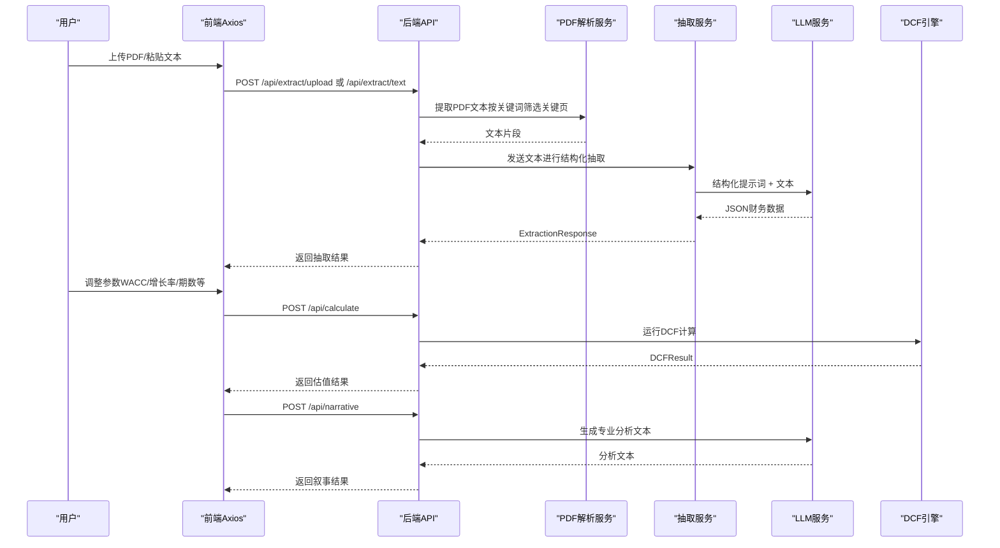
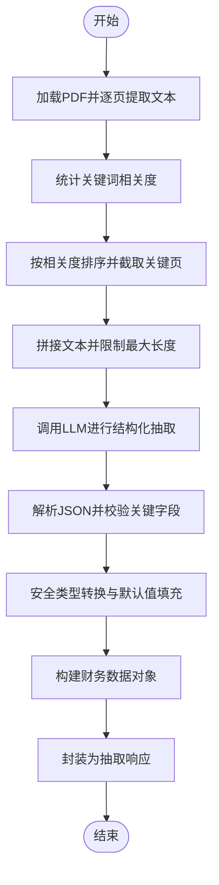
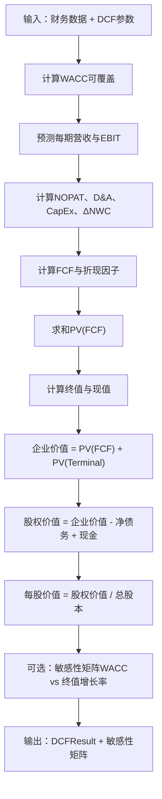
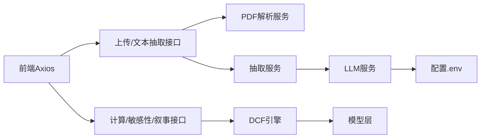

# 财务数据处理

<cite>
**本文引用的文件**
- [backend/main.py](file://backend/main.py)
- [backend/config.py](file://backend/config.py)
- [backend/models/schemas.py](file://backend/models/schemas.py)
- [backend/services/pdf_service.py](file://backend/services/pdf_service.py)
- [backend/services/llm_service.py](file://backend/services/llm_service.py)
- [backend/services/extractor_service.py](file://backend/services/extractor_service.py)
- [backend/services/dcf_service.py](file://backend/services/dcf_service.py)
- [backend/api/upload.py](file://backend/api/upload.py)
- [backend/api/analysis.py](file://backend/api/analysis.py)
- [frontend/src/services/api.ts](file://frontend/src/services/api.ts)
- [frontend/src/types/index.ts](file://frontend/src/types/index.ts)
- [frontend/src/store/useStore.ts](file://frontend/src/store/useStore.ts)
- [dcf_valuation_agent_7d1f15cc.plan.md](file://dcf_valuation_agent_7d1f15cc.plan.md)
</cite>

## 目录
1. [简介](#简介)
2. [项目结构](#项目结构)
3. [核心组件](#核心组件)
4. [架构总览](#架构总览)
5. [详细组件分析](#详细组件分析)
6. [依赖关系分析](#依赖关系分析)
7. [性能考虑](#性能考虑)
8. [故障排查指南](#故障排查指南)
9. [结论](#结论)
10. [附录](#附录)

## 简介
本文件聚焦于财务数据处理功能，系统性阐述AI服务在财务数据分析中的应用路径与实现细节。围绕从原始财务报告文本中提取关键财务指标（营业收入、净利润、资产负债等），以及后续财务比率计算与DCF估值引擎对接的完整流程进行说明。文档同时覆盖数据验证与质量控制方法、常见财务数据格式处理策略与特殊案例的解决方案，并通过可视化图示帮助读者快速把握系统架构与数据流。

## 项目结构
后端采用FastAPI作为入口，路由层负责对外暴露上传、抽取、分析与叙事生成接口；服务层包含PDF解析、LLM抽取、财务数据清洗与DCF计算引擎；模型层定义统一的数据结构；前端通过Axios调用后端API，完成用户交互与结果展示。

图表来源
- [backend/main.py:18-34](file://backend/main.py#L18-L34)
- [backend/api/upload.py:13-16](file://backend/api/upload.py#L13-L16)
- [backend/api/analysis.py:15-16](file://backend/api/analysis.py#L15-L16)
- [backend/services/pdf_service.py:26-67](file://backend/services/pdf_service.py#L26-L67)
- [backend/services/extractor_service.py:27-66](file://backend/services/extractor_service.py#L27-L66)
- [backend/services/llm_service.py:70-76](file://backend/services/llm_service.py#L70-L76)
- [backend/services/dcf_service.py:85-120](file://backend/services/dcf_service.py#L85-L120)
- [backend/models/schemas.py:8-101](file://backend/models/schemas.py#L8-L101)
- [frontend/src/services/api.ts:11-15](file://frontend/src/services/api.ts#L11-L15)

章节来源
- [backend/main.py:18-40](file://backend/main.py#L18-L40)
- [backend/config.py:10-22](file://backend/config.py#L10-L22)
- [backend/models/schemas.py:8-101](file://backend/models/schemas.py#L8-L101)
- [backend/api/upload.py:13-55](file://backend/api/upload.py#L13-L55)
- [backend/api/analysis.py:15-45](file://backend/api/analysis.py#L15-L45)
- [frontend/src/services/api.ts:11-81](file://frontend/src/services/api.ts#L11-L81)

## 核心组件
- 数据模型层：定义财务数据、DCF参数、投影、结果与响应等结构，确保前后端与服务层数据契约一致。
- PDF解析服务：基于pdfplumber提取PDF文本，按关键词相关度选择关键页面，限制最大字符数，保证抽取效率与准确性。
- LLM抽取服务：通过结构化提示词引导LLM输出JSON，包含公司名称、股票代码、货币、财年、营收、净利润、折旧摊销、资本支出、营运资本变动、总债务、货币资金、总股本、税率、贝塔、无风险利率、市场回报率、债务成本、当前股价等关键字段。
- 抽取服务：对LLM返回的原始字典进行安全类型转换与默认值填充，构造标准化的财务数据对象，并封装为抽取响应。
- DCF计算引擎：实现WACC（资本资产定价模型）计算、FCF预测、终值（Gordon增长法）计算、企业价值与股权价值推导，并支持敏感性矩阵分析。
- API层：提供上传PDF并抽取文本、直接输入文本抽取、执行DCF计算、敏感性分析、生成叙事等接口。
- 前端集成：Axios客户端封装请求，类型定义与全局状态管理支撑UI渲染与参数调整。

章节来源
- [backend/models/schemas.py:8-101](file://backend/models/schemas.py#L8-L101)
- [backend/services/pdf_service.py:26-67](file://backend/services/pdf_service.py#L26-L67)
- [backend/services/llm_service.py:14-50](file://backend/services/llm_service.py#L14-L50)
- [backend/services/extractor_service.py:27-66](file://backend/services/extractor_service.py#L27-L66)
- [backend/services/dcf_service.py:12-163](file://backend/services/dcf_service.py#L12-L163)
- [backend/api/upload.py:16-54](file://backend/api/upload.py#L16-L54)
- [backend/api/analysis.py:18-44](file://backend/api/analysis.py#L18-L44)
- [frontend/src/services/api.ts:28-80](file://frontend/src/services/api.ts#L28-L80)

## 架构总览
下图展示了从用户上传PDF到生成DCF结果与叙事的完整链路，涵盖PDF解析、LLM抽取、财务数据清洗、DCF计算与结果返回。

图表来源
- [backend/api/upload.py:16-54](file://backend/api/upload.py#L16-L54)
- [backend/api/analysis.py:18-44](file://backend/api/analysis.py#L18-L44)
- [backend/services/pdf_service.py:26-67](file://backend/services/pdf_service.py#L26-L67)
- [backend/services/extractor_service.py:27-66](file://backend/services/extractor_service.py#L27-L66)
- [backend/services/llm_service.py:94-122](file://backend/services/llm_service.py#L94-L122)
- [backend/services/dcf_service.py:85-120](file://backend/services/dcf_service.py#L85-L120)

## 详细组件分析

### 组件A：财务数据抽取与清洗
- 关键职责
  - 将PDF文本按关键词相关度排序，选取关键页面，限制最大字符数，提升抽取效率与准确性。
  - 通过LLM结构化提示词抽取JSON，包含营业收入、净利润、资产负债、折旧摊销、资本支出、营运资本变动、总债务、货币资金、总股本、税率、贝塔、无风险利率、市场回报率、债务成本、当前股价等。
  - 对LLM返回的原始字典进行安全类型转换（字符串转浮点/整数），缺失值赋予默认值，构造标准化财务数据对象，并封装为抽取响应。
- 处理流程

图表来源
- [backend/services/pdf_service.py:26-67](file://backend/services/pdf_service.py#L26-L67)
- [backend/services/llm_service.py:94-122](file://backend/services/llm_service.py#L94-L122)
- [backend/services/extractor_service.py:27-66](file://backend/services/extractor_service.py#L27-L66)

章节来源
- [backend/services/pdf_service.py:8-16](file://backend/services/pdf_service.py#L8-L16)
- [backend/services/pdf_service.py:19-24](file://backend/services/pdf_service.py#L19-L24)
- [backend/services/pdf_service.py:26-67](file://backend/services/pdf_service.py#L26-L67)
- [backend/services/llm_service.py:14-50](file://backend/services/llm_service.py#L14-L50)
- [backend/services/llm_service.py:94-122](file://backend/services/llm_service.py#L94-L122)
- [backend/services/extractor_service.py:11-25](file://backend/services/extractor_service.py#L11-L25)
- [backend/services/extractor_service.py:27-66](file://backend/services/extractor_service.py#L27-L66)

### 组件B：财务比率与辅助指标计算
- 支持机制
  - 营业利润率 = 营业利润 / 营业收入（若缺少营业利润，可由净利润/ROE等间接推导，但需谨慎）。
  - 资产负债率 = 总负债 / 总资产（若缺少任一项，需基于报表勾稽关系或默认值处理）。
  - 净资产收益率（ROE）= 净利润 / 平均净资产（若缺少净资产，可用期末数替代）。
  - 每股收益（EPS）= 净利润 / 总股本（若缺少总股本，可使用加权平均或默认值）。
  - 自由现金流（FCF）= 营业活动现金流净额 - 资本支出（若无直接数据，可用FCF公式反推或采用保守估计）。
- 实施建议
  - 在抽取阶段尽量保留原始文本片段，便于后续交叉验证与人工复核。
  - 对缺失或异常值进行标记与提示，避免误导下游计算。
  - 对单位不一致（万元/亿元）进行统一转换，确保计算精度。

章节来源
- [backend/models/schemas.py:8-30](file://backend/models/schemas.py#L8-L30)
- [backend/services/extractor_service.py:32-54](file://backend/services/extractor_service.py#L32-L54)

### 组件C：DCF计算引擎与参数传递
- 计算流程
  - WACC（若未显式传入）：使用CAPM计算权益成本，结合市值与总债务计算权重，再计算含税债务成本，最终得到WACC。
  - FCF预测：以营收为驱动，结合运营利润率、折旧摊销比率、资本支出比率、营运资本变动比率，计算每年自由现金流及其现值。
  - 终值：采用Gordon增长法，当WACC大于终端增长率时才有效，否则返回0。
  - 企业价值 = FCF现值之和 + 终值现值；股权价值 = 企业价值 - 净债务 + 现金；每股价值 = 股权价值 / 总股本。
  - 敏感性分析：在WACC与终端增长率的网格范围内重算，生成敏感性矩阵。
- 参数传递
  - 前端通过Axios客户端发送CalculateRequest，包含FinancialData与DCFParameters。
  - 后端API接收请求，调用DCF引擎，返回DCFResult；敏感性分析返回SensitivityMatrix；叙事生成返回NarrativeResponse。

图表来源
- [backend/services/dcf_service.py:12-34](file://backend/services/dcf_service.py#L12-L34)
- [backend/services/dcf_service.py:37-76](file://backend/services/dcf_service.py#L37-L76)
- [backend/services/dcf_service.py:79-82](file://backend/services/dcf_service.py#L79-L82)
- [backend/services/dcf_service.py:85-120](file://backend/services/dcf_service.py#L85-L120)
- [backend/services/dcf_service.py:123-162](file://backend/services/dcf_service.py#L123-L162)

章节来源
- [backend/services/dcf_service.py:12-163](file://backend/services/dcf_service.py#L12-L163)
- [backend/models/schemas.py:32-101](file://backend/models/schemas.py#L32-L101)
- [frontend/src/services/api.ts:51-79](file://frontend/src/services/api.ts#L51-L79)
- [frontend/src/types/index.ts:93-103](file://frontend/src/types/index.ts#L93-L103)

### 组件D：与DCF引擎的数据对接
- 数据格式转换
  - 前端类型定义与后端Pydantic模型保持一致，确保序列化/反序列化无歧义。
  - 对单位（万元/亿元）进行统一转换，避免下游计算误差。
- 参数传递
  - CalculateRequest包含FinancialData与DCFParameters，后端API直接透传至DCF引擎。
  - 敏感性分析与叙事生成分别对应独立接口，便于前端分步渲染。
- 错误处理
  - 后端对LLM JSON解析失败、PDF文本为空、计算异常等情况进行捕获与错误返回，前端统一处理并提示用户。

章节来源
- [frontend/src/types/index.ts:4-128](file://frontend/src/types/index.ts#L4-L128)
- [backend/models/schemas.py:8-101](file://backend/models/schemas.py#L8-L101)
- [backend/api/analysis.py:18-44](file://backend/api/analysis.py#L18-L44)
- [backend/api/upload.py:16-54](file://backend/api/upload.py#L16-L54)

## 依赖关系分析
- 组件耦合
  - API层仅依赖服务层接口，服务层内部解耦：PDF解析、LLM抽取、DCF计算相互独立。
  - 模型层提供强类型约束，降低前后端与服务层之间的契约偏差。
- 外部依赖
  - LLM服务依赖MiniMax兼容的OpenAI SDK端点，需正确配置API密钥与基础URL。
  - PDF解析依赖pdfplumber，注意大文件与复杂表格的解析稳定性。
- 接口契约
  - 前端Axios客户端固定baseURL为/api，后端FastAPI路由统一前缀为/api，确保跨域与路径一致。

图表来源
- [frontend/src/services/api.ts:11-15](file://frontend/src/services/api.ts#L11-L15)
- [backend/api/upload.py:16-54](file://backend/api/upload.py#L16-L54)
- [backend/api/analysis.py:18-44](file://backend/api/analysis.py#L18-L44)
- [backend/services/pdf_service.py:26-67](file://backend/services/pdf_service.py#L26-L67)
- [backend/services/extractor_service.py:27-66](file://backend/services/extractor_service.py#L27-L66)
- [backend/services/llm_service.py:70-76](file://backend/services/llm_service.py#L70-L76)
- [backend/services/dcf_service.py:85-120](file://backend/services/dcf_service.py#L85-L120)
- [backend/config.py:10-22](file://backend/config.py#L10-L22)
- [backend/models/schemas.py:8-101](file://backend/models/schemas.py#L8-L101)

章节来源
- [backend/main.py:18-34](file://backend/main.py#L18-L34)
- [backend/config.py:10-22](file://backend/config.py#L10-L22)
- [frontend/src/services/api.ts:11-15](file://frontend/src/services/api.ts#L11-L15)

## 性能考虑
- PDF解析优化
  - 关键页筛选与字符数上限可显著减少LLM输入规模，提高响应速度与成本控制。
  - 对超大PDF建议分段处理或分批上传，避免内存压力。
- LLM调用优化
  - 控制提示词长度与上下文窗口，避免超出最大tokens限制。
  - 使用较低temperature与合理的max_tokens，平衡准确性与延迟。
- DCF计算优化
  - 预先校验参数边界（如WACC > 终值增长率），减少无效计算。
  - 对敏感性矩阵采用并行或向量化计算（如后续扩展）。

## 故障排查指南
- LLM JSON解析失败
  - 现象：抽取响应包含错误信息。
  - 排查：确认提示词严格要求JSON输出；检查LLM返回是否包含多余文本或代码块；查看日志中最后500字符。
- PDF文本为空
  - 现象：上传后返回“无法从PDF提取文本”。
  - 排查：确认PDF为可复制文本版；检查页面数量与关键词匹配情况；尝试简化PDF或更换版本。
- 计算异常（如WACC/终值无效）
  - 现象：DCF结果异常或敏感性矩阵出现0值。
  - 排查：检查输入参数边界（WACC > 终值增长率且 > 0）；核对财务数据单位与数值范围。
- 前端请求失败
  - 现象：网络错误或后端抛出HTTP异常。
  - 排查：确认CORS已允许；检查后端健康检查与路由前缀；查看后端日志定位异常。

章节来源
- [backend/services/llm_service.py:117-122](file://backend/services/llm_service.py#L117-L122)
- [backend/api/upload.py:30-35](file://backend/api/upload.py#L30-L35)
- [backend/api/analysis.py:20-23](file://backend/api/analysis.py#L20-L23)
- [backend/services/dcf_service.py:80-82](file://backend/services/dcf_service.py#L80-L82)
- [frontend/src/services/api.ts:17-26](file://frontend/src/services/api.ts#L17-L26)

## 结论
该系统通过PDF解析、LLM结构化抽取与标准化财务数据模型，实现了从原始财务报告到结构化财务指标的自动化处理；随后借助DCF引擎完成估值计算与敏感性分析，并通过叙事生成提供专业解读。整体架构清晰、模块解耦、接口明确，具备良好的扩展性与可维护性。建议在生产环境中进一步完善数据校验、异常监控与缓存策略，以提升稳定性与用户体验。

## 附录
- 常见财务数据格式处理策略
  - 单位转换：万元→元（×10000）、亿元→元（×100000000）。
  - 时间维度：若仅有单年数据，可基于增长率外推多期；若无增长率，采用保守假设。
  - 缺失项：优先通过报表勾稽关系推导；若不可得，使用默认值并标注风险。
- 特殊案例解决方案
  - 负债结构复杂：优先提取总债务与短期/长期分类合计，无法细分则汇总处理。
  - 营收与利润不匹配：检查是否存在非经常性损益或会计政策变更影响。
  - EPS与总股本不一致：确认股本基数（期末/加权平均）与报告口径一致。