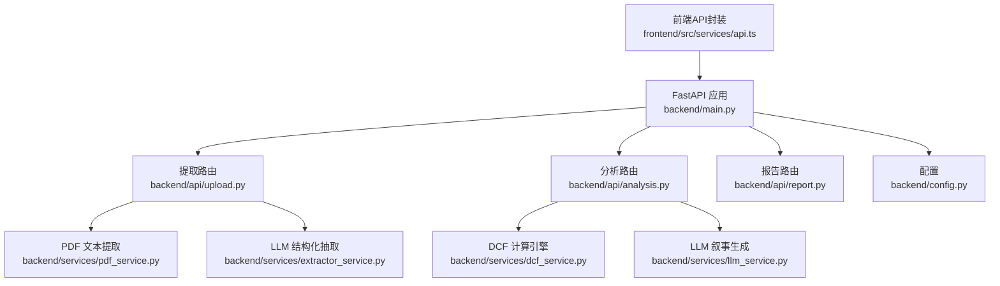
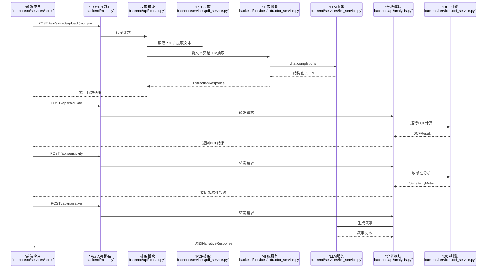
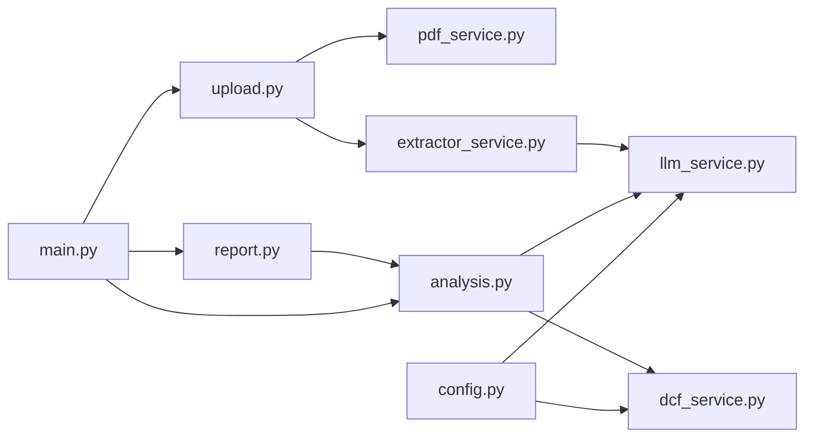

# API接口文档

<cite>
**本文档引用的文件**
- [backend/main.py](file://backend/main.py)
- [backend/api/upload.py](file://backend/api/upload.py)
- [backend/api/analysis.py](file://backend/api/analysis.py)
- [backend/api/report.py](file://backend/api/report.py)
- [backend/models/schemas.py](file://backend/models/schemas.py)
- [backend/services/dcf_service.py](file://backend/services/dcf_service.py)
- [backend/services/extractor_service.py](file://backend/services/extractor_service.py)
- [backend/services/pdf_service.py](file://backend/services/pdf_service.py)
- [backend/services/llm_service.py](file://backend/services/llm_service.py)
- [backend/config.py](file://backend/config.py)
- [frontend/src/services/api.ts](file://frontend/src/services/api.ts)
- [frontend/src/types/index.ts](file://frontend/src/types/index.ts)
- [backend/examples/integration_example.py](file://backend/examples/integration_example.py)
- [backend/services/db_service.py](file://backend/services/db_service.py)
</cite>

## 目录
1. [简介](#简介)
2. [项目结构](#项目结构)
3. [核心组件](#核心组件)
4. [架构总览](#架构总览)
5. [详细组件分析](#详细组件分析)
6. [依赖分析](#依赖分析)
7. [性能考虑](#性能考虑)
8. [故障排查指南](#故障排查指南)
9. [结论](#结论)
10. [附录](#附录)

## 简介
本API文档面向DCF估值智能体后端服务，覆盖文件上传与文本抽取、DCF计算、敏感性分析、AI叙事生成等能力。文档详细记录RESTful端点、请求/响应模型、认证方式、错误处理、以及与前端的对接方式，并提供运维与性能优化建议。

## 项目结构
后端采用FastAPI框架，按功能模块组织：
- 根路由注册：/api
- 功能模块：
  - 提取模块：/api/extract
  - 分析模块：/api（包含计算、敏感性、叙事）
  - 报告模块：/api/report（占位）

图表来源
- [backend/main.py:18-34](file://backend/main.py#L18-L34)
- [backend/api/upload.py:13](file://backend/api/upload.py#L13)
- [backend/api/analysis.py:15](file://backend/api/analysis.py#L15)
- [backend/api/report.py:5](file://backend/api/report.py#L5)
- [backend/services/pdf_service.py:26](file://backend/services/pdf_service.py#L26)
- [backend/services/extractor_service.py:27](file://backend/services/extractor_service.py#L27)
- [backend/services/dcf_service.py:85](file://backend/services/dcf_service.py#L85)
- [backend/services/llm_service.py:70](file://backend/services/llm_service.py#L70)
- [backend/config.py:10-21](file://backend/config.py#L10-L21)
- [frontend/src/services/api.ts:11-15](file://frontend/src/services/api.ts#L11-L15)

章节来源
- [backend/main.py:18-40](file://backend/main.py#L18-L40)
- [backend/api/upload.py:13](file://backend/api/upload.py#L13)
- [backend/api/analysis.py:15](file://backend/api/analysis.py#L15)
- [backend/api/report.py:5](file://backend/api/report.py#L5)

## 核心组件
- 数据模型与请求/响应：
  - FinancialData：财务基础数据
  - DCFParameters：DCF参数
  - DCFResult：DCF计算结果
  - SensitivityMatrix：敏感性矩阵
  - ExtractionResponse：抽取结果
  - NarrativeRequest/NarrativeResponse：叙事请求/响应
- 服务层：
  - pdf_service：PDF文本抽取与筛选
  - extractor_service：基于LLM的结构化抽取
  - dcf_service：DCF计算与敏感性分析
  - llm_service：抽取与叙事的LLM调用
- 配置：
  - OPENAI风格的MiniMax接入参数
  - MySQL数据库连接参数
  - 上传目录

章节来源
- [backend/models/schemas.py:8-101](file://backend/models/schemas.py#L8-L101)
- [backend/services/pdf_service.py:26](file://backend/services/pdf_service.py#L26)
- [backend/services/extractor_service.py:27](file://backend/services/extractor_service.py#L27)
- [backend/services/dcf_service.py:12-163](file://backend/services/dcf_service.py#L12-L163)
- [backend/services/llm_service.py:70](file://backend/services/llm_service.py#L70)
- [backend/config.py:10-21](file://backend/config.py#L10-L21)

## 架构总览
下图展示从客户端到后端各模块的调用链路与数据流：

图表来源
- [backend/main.py:32-34](file://backend/main.py#L32-L34)
- [backend/api/upload.py:16](file://backend/api/upload.py#L16)
- [backend/api/analysis.py:18](file://backend/api/analysis.py#L18)
- [backend/services/pdf_service.py:26](file://backend/services/pdf_service.py#L26)
- [backend/services/extractor_service.py:27](file://backend/services/extractor_service.py#L27)
- [backend/services/dcf_service.py:85](file://backend/services/dcf_service.py#L85)
- [backend/services/llm_service.py:94](file://backend/services/llm_service.py#L94)

## 详细组件分析

### 文件上传与文本抽取接口
- 端点
  - POST /api/extract/upload
    - 请求：multipart/form-data，字段 file: PDF文件
    - 响应：ExtractionResponse
    - 行为：保存PDF → 提取文本 → LLM抽取结构化财务数据 → 删除临时文件
  - POST /api/extract/text
    - 请求：JSON，字段 text: 字符串
    - 响应：ExtractionResponse
    - 行为：直接对文本进行LLM抽取

- 参数与约束
  - 仅接受PDF文件；空文本将被拒绝
  - 抽取失败时返回success=false及错误信息

- 错误处理
  - 文件类型不合法、PDF无文本、LLM解析失败、异常捕获

- 客户端调用参考
  - 前端封装了上传与文本抽取的函数，设置合适的超时与Content-Type

章节来源
- [backend/api/upload.py:16-55](file://backend/api/upload.py#L16-L55)
- [backend/services/pdf_service.py:26](file://backend/services/pdf_service.py#L26)
- [backend/services/extractor_service.py:27](file://backend/services/extractor_service.py#L27)
- [frontend/src/services/api.ts:28-49](file://frontend/src/services/api.ts#L28-L49)

### DCF计算与敏感性分析接口
- 端点
  - POST /api/calculate
    - 请求：CalculateRequest（financial_data, parameters）
    - 响应：DCFResult
  - POST /api/sensitivity
    - 请求：CalculateRequest（financial_data, parameters）
    - 响应：SensitivityMatrix

- 计算逻辑要点
  - WACC计算：支持显式覆盖或基于CAPM与资本结构计算
  - 自由现金流预测：按收入增长率与运营/比率推导NOPAT/FCF
  - 终值：基于永续增长模型，wacc>g否则返回0
  - 敏感性：围绕WACC与终值增长率扰动，生成二维矩阵

- 响应字段
  - 包含分年预测明细、终值、现值汇总、企业价值、股权价值、每股价值、相对当前股价的上/下空间等

章节来源
- [backend/api/analysis.py:18-32](file://backend/api/analysis.py#L18-L32)
- [backend/models/schemas.py:58-76](file://backend/models/schemas.py#L58-L76)
- [backend/services/dcf_service.py:12-163](file://backend/services/dcf_service.py#L12-L163)

### AI叙事生成接口
- 端点
  - POST /api/narrative
    - 请求：NarrativeRequest（financial_data, dcf_result, [sensitivity_matrix], [language]）
    - 响应：NarrativeResponse（success, narrative, error）

- 行为
  - 使用LLM根据财务数据与DCF结果生成专业级分析文本
  - 支持语言切换（通过输入数据语言自动判定）

章节来源
- [backend/api/analysis.py:34-44](file://backend/api/analysis.py#L34-L44)
- [backend/models/schemas.py:85-96](file://backend/models/schemas.py#L85-L96)
- [backend/services/llm_service.py:129](file://backend/services/llm_service.py#L129)

### 报告健康检查接口
- 端点
  - GET /api/report/health
  - 响应：模块状态与支持的导出格式（占位）

章节来源
- [backend/api/report.py:8-12](file://backend/api/report.py#L8-L12)

### 健康检查接口
- 端点
  - GET /api/health
  - 响应：{"status":"ok"}

章节来源
- [backend/main.py:37-40](file://backend/main.py#L37-L40)

## 依赖分析
- 组件耦合
  - API层仅负责路由与参数校验，业务逻辑集中在服务层
  - 提取链路：upload → pdf_service → extractor_service → llm_service
  - 分析链路：analysis → dcf_service；analysis → llm_service（叙事）
- 外部依赖
  - LLM：MiniMax（通过OPENAI兼容接口）
  - PDF解析：pdfplumber
  - 数据库存取：pymysql（可选，示例集成）

图表来源
- [backend/api/upload.py:10-11](file://backend/api/upload.py#L10-L11)
- [backend/api/analysis.py:12](file://backend/api/analysis.py#L12)
- [backend/main.py:32-34](file://backend/main.py#L32-L34)
- [backend/config.py:10-21](file://backend/config.py#L10-L21)

章节来源
- [backend/api/upload.py:10-11](file://backend/api/upload.py#L10-L11)
- [backend/api/analysis.py:12](file://backend/api/analysis.py#L12)
- [backend/main.py:32-34](file://backend/main.py#L32-L34)
- [backend/config.py:10-21](file://backend/config.py#L10-L21)

## 性能考虑
- PDF文本提取
  - 优先选择包含财务关键词的页面，限制最大字符数，避免大文件导致内存压力
- LLM调用
  - 控制输入长度与温度参数，避免过长上下文导致延迟与费用上升
  - 对抽取结果进行JSON解析与清洗，减少无效重试
- DCF计算
  - 年限与比率默认值合理设置，避免极端参数导致数值不稳定
  - 敏感性分析网格规模可控，避免大规模矩阵计算
- 前端
  - 设置合理的超时时间与错误提示，提升用户体验

[本节为通用性能建议，无需特定文件引用]

## 故障排查指南
- 常见错误与定位
  - 400：文件类型不是PDF；文本为空
  - 500：LLM解析失败、DC计算异常
  - 健康检查：/api/health用于快速判断服务可用性
- 日志与追踪
  - LLM服务与PDF提取均记录日志，便于问题定位
- 前端错误处理
  - 统一捕获Axios错误，提取服务端错误详情

章节来源
- [backend/api/upload.py:19-20](file://backend/api/upload.py#L19-L20)
- [backend/api/upload.py:49](file://backend/api/upload.py#L49)
- [backend/api/analysis.py:22](file://backend/api/analysis.py#L22)
- [backend/services/llm_service.py:117-122](file://backend/services/llm_service.py#L117-L122)
- [backend/main.py:37-40](file://backend/main.py#L37-L40)
- [frontend/src/services/api.ts:17-26](file://frontend/src/services/api.ts#L17-L26)

## 结论
本API以清晰的模块划分与稳健的服务层设计，提供了从PDF/文本抽取到DCF计算与AI叙事的完整能力。通过明确的请求/响应模型与错误处理机制，便于前后端协作与扩展。建议在生产环境中结合速率限制、鉴权与缓存策略进一步完善。

[本节为总结性内容，无需特定文件引用]

## 附录

### API端点一览
- 提取
  - POST /api/extract/upload
  - POST /api/extract/text
- 分析
  - POST /api/calculate
  - POST /api/sensitivity
  - POST /api/narrative
- 其他
  - GET /api/health
  - GET /api/report/health

章节来源
- [backend/main.py:32-34](file://backend/main.py#L32-L34)
- [backend/api/upload.py:16-55](file://backend/api/upload.py#L16-L55)
- [backend/api/analysis.py:18-44](file://backend/api/analysis.py#L18-L44)
- [backend/api/report.py:8-12](file://backend/api/report.py#L8-L12)

### 请求/响应模型速览
- ExtractionResponse
  - 字段：success, financial_data, extracted_text, error
- FinancialData
  - 字段：公司名、股票代码、货币、财年、收入、营收增长率、利润、比率、现金流、债务、现金、股本、税率、Beta、无风息率、市场回报、债务成本、当前股价等
- DCFParameters
  - 字段：预测年限、收入增长率、终值增长率、运营利润率、税率、CAPEX/收入、折旧/收入、营运资本/收入、WACC、折扣率覆盖
- DCFResult
  - 字段：分年预测明细、终值、现值终值、现值FCF合计、企业价值、股权价值、每股价值、当前股价、上/下空间、使用的WACC与终值增长率
- SensitivityMatrix
  - 字段：WACC范围、增长率范围、二维价值矩阵
- NarrativeRequest/NarrativeResponse
  - 字段：财务数据、DCF结果、敏感性矩阵、语言、成功标志、叙事文本、错误信息

章节来源
- [backend/models/schemas.py:78-101](file://backend/models/schemas.py#L78-L101)

### 客户端实现要点
- 前端已封装常用API调用，包括上传PDF、文本抽取、计算、敏感性分析与叙事生成
- 注意设置正确的Content-Type与超时时间
- 对错误进行统一处理与用户提示

章节来源
- [frontend/src/services/api.ts:28-80](file://frontend/src/services/api.ts#L28-L80)
- [frontend/src/types/index.ts:80-103](file://frontend/src/types/index.ts#L80-L103)

### 数据库集成示例
- 示例脚本展示了如何将抽取与计算得到的数据存储到MySQL，并支持历史价格与报表查询
- 适合在需要持久化分析结果或构建历史回测时使用

章节来源
- [backend/examples/integration_example.py:16-346](file://backend/examples/integration_example.py#L16-L346)
- [backend/services/db_service.py:24-345](file://backend/services/db_service.py#L24-L345)