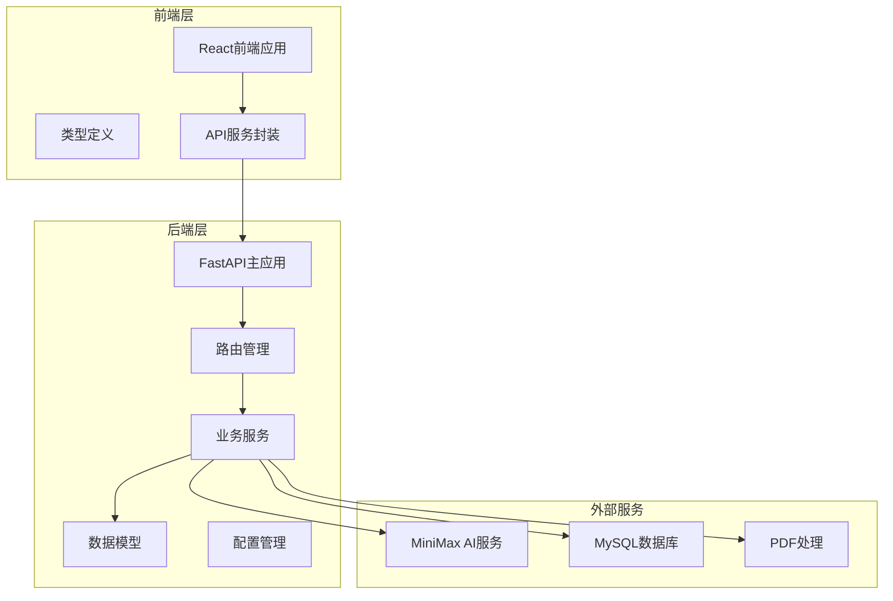
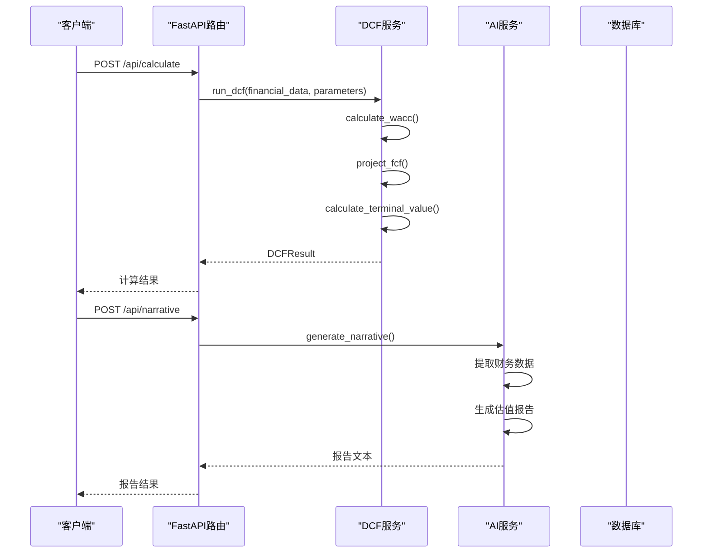
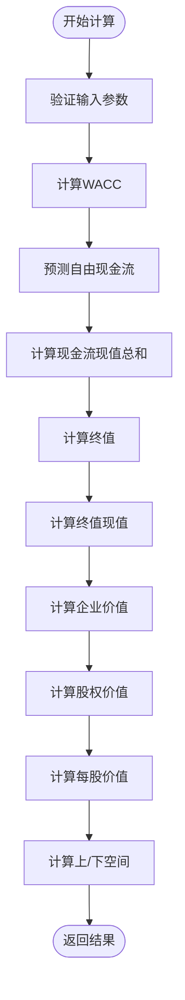
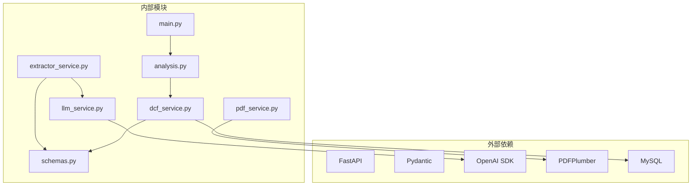

# DCF估值计算API

<cite>
**本文档引用的文件**
- [backend/main.py](file://backend/main.py)
- [backend/api/analysis.py](file://backend/api/analysis.py)
- [backend/services/dcf_service.py](file://backend/services/dcf_service.py)
- [backend/models/schemas.py](file://backend/models/schemas.py)
- [backend/config.py](file://backend/config.py)
- [backend/api/upload.py](file://backend/api/upload.py)
- [backend/services/pdf_service.py](file://backend/services/pdf_service.py)
- [backend/services/extractor_service.py](file://backend/services/extractor_service.py)
- [backend/services/llm_service.py](file://backend/services/llm_service.py)
- [backend/api/report.py](file://backend/api/report.py)
- [frontend/src/services/api.ts](file://frontend/src/services/api.ts)
- [frontend/src/types/index.ts](file://frontend/src/types/index.ts)
- [backend/examples/integration_example.py](file://backend/examples/integration_example.py)
- [backend/examples/db_usage_example.py](file://backend/examples/db_usage_example.py)
</cite>

## 目录
1. [简介](#简介)
2. [项目结构](#项目结构)
3. [核心组件](#核心组件)
4. [架构概览](#架构概览)
5. [详细组件分析](#详细组件分析)
6. [依赖分析](#依赖分析)
7. [性能考虑](#性能考虑)
8. [故障排除指南](#故障排除指南)
9. [结论](#结论)
10. [附录](#附录)

## 简介
DCF估值计算API是一个基于FastAPI构建的企业估值系统，提供完整的现金流折现估值计算功能。该系统支持从财务报表中自动提取关键财务数据，执行DCF估值计算，并生成专业的估值分析报告。

系统采用前后端分离架构，后端使用Python FastAPI框架，前端使用TypeScript React技术栈。核心功能包括：
- 自动财务数据提取（PDF/文本）
- DCF估值计算（自由现金流预测、WACC计算、终值估算）
- 敏感性分析
- AI驱动的估值报告生成

## 项目结构
系统采用模块化设计，分为后端API服务、业务逻辑层、数据模型层和前端界面层。



**图表来源**
- [backend/main.py:1-40](file://backend/main.py#L1-L40)
- [backend/api/analysis.py:1-45](file://backend/api/analysis.py#L1-L45)
- [backend/services/dcf_service.py:1-163](file://backend/services/dcf_service.py#L1-L163)

**章节来源**
- [backend/main.py:1-40](file://backend/main.py#L1-L40)
- [backend/config.py:1-22](file://backend/config.py#L1-L22)

## 核心组件
系统的核心组件包括API路由、DCF计算服务、数据模型和AI服务。

### API路由组件
- `/api/calculate` - 主要的DCF计算接口
- `/api/sensitivity` - 敏感性分析接口  
- `/api/narrative` - 估值报告生成接口
- `/api/extract/upload` - PDF财务数据提取
- `/api/extract/text` - 文本财务数据提取

### DCF计算服务
- WACC计算函数
- 自由现金流预测函数
- 终值估算函数
- 完整DCF计算流程

### 数据模型
- FinancialData - 财务数据模型
- DCFParameters - DCF参数模型
- DCFResult - 计算结果模型
- FCFProjection - 自由现金流预测模型

**章节来源**
- [backend/api/analysis.py:18-45](file://backend/api/analysis.py#L18-L45)
- [backend/services/dcf_service.py:12-163](file://backend/services/dcf_service.py#L12-L163)
- [backend/models/schemas.py:8-101](file://backend/models/schemas.py#L8-L101)

## 架构概览
系统采用分层架构设计，确保关注点分离和可维护性。



**图表来源**
- [backend/api/analysis.py:18-45](file://backend/api/analysis.py#L18-L45)
- [backend/services/dcf_service.py:85-121](file://backend/services/dcf_service.py#L85-L121)
- [backend/services/llm_service.py:129-155](file://backend/services/llm_service.py#L129-L155)

## 详细组件分析

### DCF计算接口 (/api/calculate)
这是系统的核心接口，负责执行完整的DCF估值计算。

#### 接口规范
- **方法**: POST
- **路径**: `/api/calculate`
- **请求体**: CalculateRequest
- **响应体**: DCFResult

#### 请求参数验证
系统使用Pydantic模型进行参数验证：
- FinancialData: 包含公司基本信息、财务指标、市场数据
- DCFParameters: 包含估值参数和比率假设
- 参数约束包括数值范围、默认值和必填字段

#### 计算逻辑流程


**图表来源**
- [backend/services/dcf_service.py:85-121](file://backend/services/dcf_service.py#L85-L121)

#### 关键计算步骤
1. **WACC计算**: 使用CAPM模型计算权益成本，结合债务权重计算加权平均资本成本
2. **自由现金流预测**: 基于收入增长率和各项财务比率预测未来现金流
3. **终值估算**: 使用戈登增长模型计算永续增长的终值
4. **企业价值评估**: 将预测现金流现值与终值现值相加

**章节来源**
- [backend/api/analysis.py:18-24](file://backend/api/analysis.py#L18-L24)
- [backend/services/dcf_service.py:12-121](file://backend/services/dcf_service.py#L12-L121)

### 敏感性分析接口 (/api/sensitivity)
提供多维度敏感性分析，评估关键参数变化对估值的影响。

#### 分析范围
- WACC变化范围: ±2%（步长0.5%）
- 终值增长率变化范围: ±1.5%（步长0.5%）
- 结果矩阵显示不同参数组合下的每股价值

#### 返回格式
- wacc_range: WACC变化序列
- growth_range: 终值增长率变化序列  
- values: 对应的每股价值矩阵

**章节来源**
- [backend/api/analysis.py:26-32](file://backend/api/analysis.py#L26-L32)
- [backend/services/dcf_service.py:123-163](file://backend/services/dcf_service.py#L123-L163)

### AI估值报告接口 (/api/narrative)
基于AI生成专业的DCF估值分析报告。

#### 功能特性
- 自动生成估值分析报告
- 支持多种语言输出
- 集成财务数据和计算结果
- 专业金融术语和表达

#### 报告内容
- 公司概况和关键财务指标
- 收入和盈利能力趋势分析
- WACC假设和合理性说明
- 自由现金流预测摘要
- 终值估算方法论
- 估值结论和公平价值
- 关键风险和敏感性分析

**章节来源**
- [backend/api/analysis.py:34-45](file://backend/api/analysis.py#L34-L45)
- [backend/services/llm_service.py:52-67](file://backend/services/llm_service.py#L52-L67)

### 财务数据提取接口
系统提供两种财务数据提取方式：

#### PDF上传提取
- 支持PDF文件上传
- 自动提取财务报表关键信息
- 使用AI识别和结构化提取

#### 文本提取
- 直接从文本内容提取财务数据
- 支持多语言财务报告
- 结构化JSON输出

**章节来源**
- [backend/api/upload.py:16-55](file://backend/api/upload.py#L16-L55)
- [backend/services/pdf_service.py:26-68](file://backend/services/pdf_service.py#L26-L68)
- [backend/services/extractor_service.py:27-67](file://backend/services/extractor_service.py#L27-L67)

## 依赖分析
系统依赖关系清晰，模块间耦合度低，便于维护和扩展。



**图表来源**
- [backend/main.py:8-34](file://backend/main.py#L8-L34)
- [backend/services/llm_service.py:8-10](file://backend/services/llm_service.py#L8-L10)

### 外部服务集成
- **MiniMax AI服务**: 用于财务数据提取和报告生成
- **PDF处理**: 使用pdfplumber解析财务报表
- **数据库**: MySQL存储财务数据和分析结果

**章节来源**
- [backend/config.py:10-22](file://backend/config.py#L10-L22)
- [backend/services/llm_service.py:70-77](file://backend/services/llm_service.py#L70-L77)

## 性能考虑
系统在设计时充分考虑了性能优化和资源使用效率。

### 内存使用优化
- PDF文本提取限制最大字符数（30000字符）
- LLM请求内容截断（28000字符）
- 流式处理减少内存占用
- 及时清理临时文件

### 计算复杂度
- DCF计算时间复杂度: O(n)，其中n为预测年数
- 敏感性分析: O(m×k)，其中m和k为参数变化数量
- 内存使用: 主要受预测期长度影响

### 缓存策略
- LLM响应缓存机制
- 中间结果缓存
- 数据库连接池管理

**章节来源**
- [backend/services/pdf_service.py:44-58](file://backend/services/pdf_service.py#L44-L58)
- [backend/services/llm_service.py:94-123](file://backend/services/llm_service.py#L94-L123)

## 故障排除指南

### 常见错误及解决方案

#### 1. 参数验证错误
**症状**: HTTP 422错误，参数格式不正确
**原因**: 输入数据类型或范围不符合要求
**解决**: 检查FinancialData和DCFParameters字段类型和默认值

#### 2. AI服务调用失败
**症状**: HTTP 500错误，AI服务不可用
**原因**: MiniMax API密钥配置错误或网络问题
**解决**: 检查.env文件中的API配置，确认网络连接

#### 3. PDF提取失败
**症状**: 提取结果为空或错误
**原因**: PDF格式不支持或文本无法识别
**解决**: 确保PDF包含财务报表，检查文件完整性

#### 4. 数据库连接问题
**症状**: 数据存储操作失败
**原因**: MySQL配置错误或连接超时
**解决**: 检查数据库配置参数，确认服务运行状态

### 调试建议
- 启用详细日志记录
- 使用Postman测试API端点
- 检查环境变量配置
- 验证输入数据格式

**章节来源**
- [backend/api/analysis.py:20-23](file://backend/api/analysis.py#L20-L23)
- [backend/api/upload.py:38-42](file://backend/api/upload.py#L38-L42)
- [backend/services/llm_service.py:117-122](file://backend/services/llm_service.py#L117-L122)

## 结论
DCF估值计算API提供了一个完整、可靠的现金流折现估值解决方案。系统具有以下优势：

1. **功能完整**: 支持从数据提取到估值计算再到报告生成的全流程
2. **易于使用**: 清晰的API设计和详细的文档
3. **可扩展性强**: 模块化架构便于功能扩展和定制
4. **性能优化**: 针对大数据量和复杂计算的优化设计

建议在生产环境中：
- 配置适当的监控和日志记录
- 实施缓存策略提升响应速度
- 建立数据备份和恢复机制
- 定期更新AI模型和算法

## 附录

### API请求/响应示例

#### DCF计算请求示例
```json
{
  "financial_data": {
    "company_name": "示例公司",
    "ticker": "000001",
    "currency": "CNY",
    "fiscal_year": 2025,
    "revenue": 1000000000,
    "operating_income": 200000000,
    "total_debt": 300000000,
    "cash_and_equivalents": 100000000,
    "shares_outstanding": 100000000,
    "beta": 1.2,
    "risk_free_rate": 0.03,
    "market_return": 0.09,
    "cost_of_debt": 0.05,
    "current_stock_price": 15.0
  },
  "parameters": {
    "projection_years": 5,
    "revenue_growth_rate": 0.08,
    "terminal_growth_rate": 0.025,
    "operating_margin": 0.15,
    "tax_rate": 0.25,
    "capex_ratio": 0.05,
    "da_ratio": 0.04,
    "nwc_ratio": 0.02,
    "wacc": 0.10
  }
}
```

#### DCF计算响应示例
```json
{
  "projections": [
    {
      "year": 1,
      "revenue": 1080000000.00,
      "operating_income": 162000000.00,
      "nopat": 121500000.00,
      "depreciation_amortization": 43200000.00,
      "capital_expenditure": 54000000.00,
      "change_in_nwc": 21600000.00,
      "free_cash_flow": 109500000.00,
      "discount_factor": 0.9091,
      "present_value": 99545454.55
    }
  ],
  "terminal_value": 2190000000.00,
  "pv_terminal_value": 1542045454.55,
  "pv_fcf_sum": 454545454.55,
  "enterprise_value": 2096590909.09,
  "equity_value": 1796590909.09,
  "per_share_value": 17.97,
  "current_price": 15.00,
  "upside_downside": 19.80,
  "wacc_used": 0.100000,
  "terminal_growth_used": 0.025
}
```

### 参数设置建议

#### 折现率设置
- **WACC**: 通常在8%-12%之间
- **CAPM模型**: 无风险利率 + β × (市场回报率 - 无风险利率)
- **债务成本**: 基于公司信用评级确定

#### 增长率设置
- **收入增长率**: 历史增长率的1.5-2倍
- **终值增长率**: 通常不超过GDP增长率
- **预测期**: 5-10年较为合理

#### 财务比率假设
- **运营利润率**: 行业平均水平的80%-120%
- **资本支出比率**: 通常为收入的3%-8%
- **折旧摊销比率**: 通常为收入的3%-6%
- **营运资本变动比率**: 通常为收入的1%-3%

### 计算精度说明
- **数值精度**: 保留2-4位小数
- **货币单位**: 统一使用元（人民币）
- **时间精度**: 年度预测，精确到年
- **异常处理**: 对不合理参数进行边界检查和修正