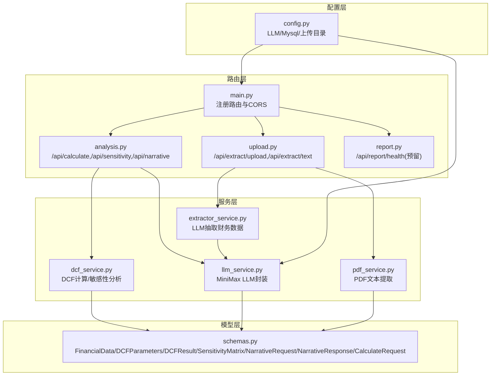
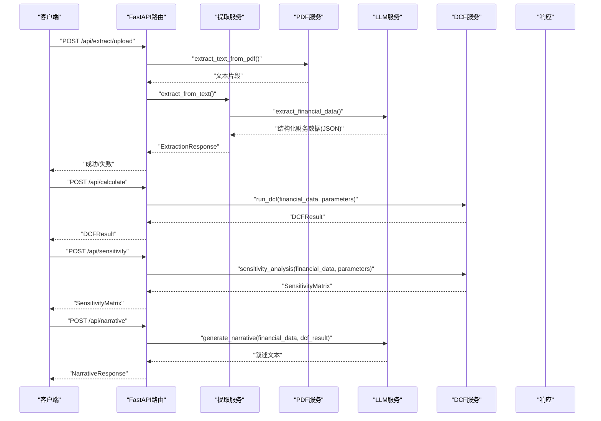
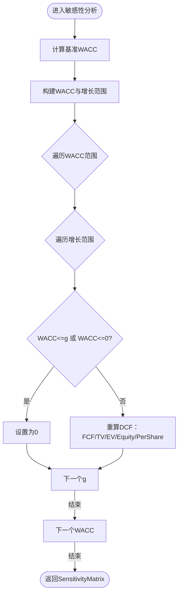
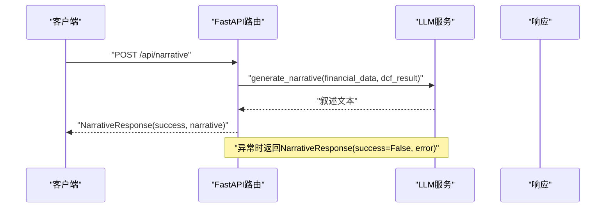
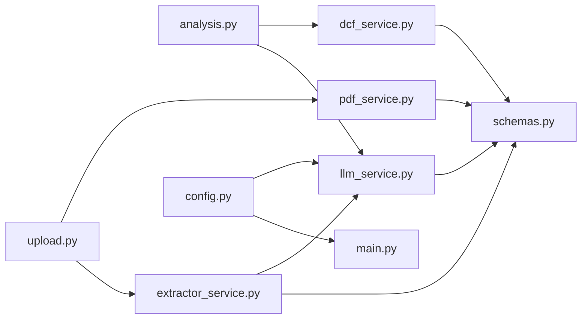

# 分析报告生成API

<cite>
**本文引用的文件列表**
- [backend/main.py](file://backend/main.py)
- [backend/api/analysis.py](file://backend/api/analysis.py)
- [backend/api/report.py](file://backend/api/report.py)
- [backend/api/upload.py](file://backend/api/upload.py)
- [backend/services/dcf_service.py](file://backend/services/dcf_service.py)
- [backend/services/llm_service.py](file://backend/services/llm_service.py)
- [backend/services/extractor_service.py](file://backend/services/extractor_service.py)
- [backend/services/pdf_service.py](file://backend/services/pdf_service.py)
- [backend/models/schemas.py](file://backend/models/schemas.py)
- [backend/config.py](file://backend/config.py)
- [README.md](file://README.md)
</cite>

## 目录
1. [简介](#简介)
2. [项目结构](#项目结构)
3. [核心组件](#核心组件)
4. [架构总览](#架构总览)
5. [详细组件分析](#详细组件分析)
6. [依赖关系分析](#依赖关系分析)
7. [性能与成本考量](#性能与成本考量)
8. [故障排查指南](#故障排查指南)
9. [结论](#结论)
10. [附录：API调用示例与参数说明](#附录api调用示例与参数说明)

## 简介
本文件面向“分析报告生成API”的使用者与维护者，聚焦两类核心能力：
- 敏感性分析接口：/api/sensitivity，用于生成WACC与永续增长率的二维敏感性矩阵，辅助评估关键假设变化对目标公司每股估值的影响。
- AI报告生成接口：/api/narrative，基于结构化财务数据与DCF结果，生成专业的估值叙述报告，支持中英双语输出。

文档同时覆盖：
- 数据结构定义与字段含义
- 敏感性分析的参数范围、计算矩阵与结果格式
- AI报告生成的提示词设计、上下文构建与多轮对话管理
- 报告内容组织结构（执行摘要、详细分析、风险评估、结论建议等）
- 完整的API调用示例、参数传递、结果解析与错误处理
- LLM服务配置、性能指标与成本考虑
- 报告定制化选项与输出格式规范

## 项目结构
后端采用FastAPI框架，按功能模块划分：
- 路由层：/api/health、/api/extract/*、/api/calculate、/api/sensitivity、/api/narrative、/api/report/*
- 服务层：DCF计算引擎、LLM封装、PDF文本提取、财务数据抽取
- 模型层：Pydantic数据模型（请求/响应/中间结果）
- 配置层：环境变量与默认参数

图表来源
- [backend/main.py:18-34](file://backend/main.py#L18-L34)
- [backend/api/analysis.py:15-44](file://backend/api/analysis.py#L15-L44)
- [backend/api/upload.py:13-54](file://backend/api/upload.py#L13-L54)
- [backend/api/report.py:5-11](file://backend/api/report.py#L5-L11)
- [backend/services/dcf_service.py:12-162](file://backend/services/dcf_service.py#L12-L162)
- [backend/services/llm_service.py:70-154](file://backend/services/llm_service.py#L70-L154)
- [backend/services/extractor_service.py:27-66](file://backend/services/extractor_service.py#L27-L66)
- [backend/services/pdf_service.py:26-67](file://backend/services/pdf_service.py#L26-L67)
- [backend/models/schemas.py:8-101](file://backend/models/schemas.py#L8-L101)
- [backend/config.py:10-21](file://backend/config.py#L10-L21)

章节来源
- [backend/main.py:18-34](file://backend/main.py#L18-L34)
- [README.md:77-127](file://README.md#L77-L127)

## 核心组件
- 路由与入口
  - 主应用注册CORS与三个路由器：/api/extract、/api/analysis、/api/report，并提供健康检查端点。
- 分析路由
  - /api/calculate：接收CalculateRequest，返回DCFResult
  - /api/sensitivity：接收CalculateRequest，返回SensitivityMatrix
  - /api/narrative：接收NarrativeRequest，返回NarrativeResponse
- 提取路由
  - /api/extract/upload：上传PDF并提取文本，再由LLM抽取结构化财务数据
  - /api/extract/text：直接从文本抽取结构化财务数据
- 服务层
  - DCF计算引擎：WACC计算、FCF预测、终端价值、企业/股权价值与每股价值
  - LLM服务：MiniMax兼容接口封装，提供财务数据抽取与叙述生成
  - PDF服务：选择与拼接最相关的财务页面文本
  - 抽取服务：将LLM输出映射到FinancialData模型
- 模型层
  - FinancialData、DCFParameters、FCFProjection、DCFResult、SensitivityMatrix、NarrativeRequest、NarrativeResponse、CalculateRequest

章节来源
- [backend/main.py:18-40](file://backend/main.py#L18-L40)
- [backend/api/analysis.py:18-44](file://backend/api/analysis.py#L18-L44)
- [backend/api/upload.py:16-54](file://backend/api/upload.py#L16-L54)
- [backend/services/dcf_service.py:12-162](file://backend/services/dcf_service.py#L12-L162)
- [backend/services/llm_service.py:70-154](file://backend/services/llm_service.py#L70-L154)
- [backend/services/extractor_service.py:27-66](file://backend/services/extractor_service.py#L27-L66)
- [backend/services/pdf_service.py:26-67](file://backend/services/pdf_service.py#L26-L67)
- [backend/models/schemas.py:8-101](file://backend/models/schemas.py#L8-L101)

## 架构总览
下图展示了从客户端到后端服务的整体调用链路，以及关键数据流。

图表来源
- [backend/api/upload.py:16-54](file://backend/api/upload.py#L16-L54)
- [backend/api/analysis.py:18-44](file://backend/api/analysis.py#L18-L44)
- [backend/services/pdf_service.py:26-67](file://backend/services/pdf_service.py#L26-L67)
- [backend/services/extractor_service.py:27-66](file://backend/services/extractor_service.py#L27-L66)
- [backend/services/llm_service.py:94-154](file://backend/services/llm_service.py#L94-L154)
- [backend/services/dcf_service.py:85-162](file://backend/services/dcf_service.py#L85-L162)

## 详细组件分析

### 敏感性分析接口 /api/sensitivity
- 请求路径与方法
  - POST /api/sensitivity
- 请求体
  - CalculateRequest：包含FinancialData与DCFParameters
- 返回体
  - SensitivityMatrix：包含两维数组（WACC范围、永续增长率范围）与二维数值矩阵
- 参数变化范围
  - WACC范围：围绕基准WACC（优先使用参数中的WACC，否则根据财务数据与市场参数计算），在±2%范围内取9个点（步长0.5%）
  - 永续增长率范围：围绕参数中的terminal_growth_rate，在±1.5%范围内取7个点（步长0.5%）
- 计算矩阵
  - 对每个(WACC, g)组合，重新计算DCF：FCF预测、终端价值、企业价值、股权价值与每股价值
  - 若WACC ≤ g 或 WACC ≤ 0，则该单元格值为0（防止分母非正导致的异常）
- 结果展示格式
  - wacc_range：一维数组，升序排列
  - growth_range：一维数组，升序排列
  - values：二维数组，values[i][j]对应第i个WACC与第j个g组合下的每股价值
- 错误处理
  - 服务内部异常通过HTTP 500返回；上层路由捕获并抛出HTTPException

图表来源
- [backend/services/dcf_service.py:123-162](file://backend/services/dcf_service.py#L123-L162)
- [backend/api/analysis.py:26-31](file://backend/api/analysis.py#L26-L31)

章节来源
- [backend/api/analysis.py:26-31](file://backend/api/analysis.py#L26-L31)
- [backend/services/dcf_service.py:123-162](file://backend/services/dcf_service.py#L123-L162)
- [backend/models/schemas.py:72-76](file://backend/models/schemas.py#L72-L76)

### AI报告生成接口 /api/narrative
- 请求路径与方法
  - POST /api/narrative
- 请求体
  - NarrativeRequest：包含FinancialData、DCFResult、可选SensitivityMatrix、可选language
- 返回体
  - NarrativeResponse：success布尔标志、生成的叙述文本或错误信息
- 提示词设计
  - 系统提示词（英文）：引导AI扮演资深股权研究分析师，基于提供的财务数据与DCF结果撰写专业叙述，涵盖公司概览、趋势、WACC假设、FCF预测摘要、终值方法论、估值结论、关键风险与敏感性等要点
  - 输出语言：与输入数据语言保持一致
- 上下文构建
  - 将FinancialData与DCFResult序列化为用户消息内容，作为LLM的上下文
  - 可选地携带SensitivityMatrix，增强风险与敏感性讨论
- 多轮对话管理
  - 本接口为单轮请求，不维护历史对话状态
- 报告内容组织结构
  - 执行摘要：简要结论与公平股价
  - 详细分析：财务指标回顾、FCF预测与终值方法论
  - 风险评估：关键假设与敏感性分析
  - 结论建议：投资评级与安全边际
- 错误处理
  - LLM生成异常时，返回NarrativeResponse(success=False, error=...)；上层路由捕获并返回

图表来源
- [backend/api/analysis.py:34-44](file://backend/api/analysis.py#L34-L44)
- [backend/services/llm_service.py:129-154](file://backend/services/llm_service.py#L129-L154)
- [backend/models/schemas.py:85-95](file://backend/models/schemas.py#L85-L95)

章节来源
- [backend/api/analysis.py:34-44](file://backend/api/analysis.py#L34-L44)
- [backend/services/llm_service.py:52-67](file://backend/services/llm_service.py#L52-L67)
- [backend/services/llm_service.py:129-154](file://backend/services/llm_service.py#L129-L154)
- [backend/models/schemas.py:85-95](file://backend/models/schemas.py#L85-L95)

### 数据模型与结构
- FinancialData：公司与财务基础信息，含货币、报表年份、收入、利润、折旧摊销、资本支出、营运资本变动、总债务、现金、股本、税率、Beta、无风险利率、市场回报、债务成本、当前股价等
- DCFParameters：预测期、营收增长率、永续增长率、运营利润率、税率、CapEx比率、DA比率、NWC比率、WACC、折扣率覆盖
- FCFProjection：每年的收入、运营利润、NOPAT、折旧摊销、资本支出、NWC变动、FCF、折现因子、现值
- DCFResult：FCF现值和、终值、终值现值、企业价值、股权价值、每股价值、当前股价、上/下空间、使用的WACC与终值增长率
- SensitivityMatrix：WACC范围、增长范围与二维矩阵值
- NarrativeRequest/NarrativeResponse：叙述请求/响应模型
- CalculateRequest：计算请求模型

章节来源
- [backend/models/schemas.py:8-101](file://backend/models/schemas.py#L8-L101)

### 提取与PDF处理
- PDF上传与提取
  - /api/extract/upload：校验PDF、保存临时文件、提取文本、调用抽取服务
  - /api/extract/text：直接从文本抽取
- PDF文本提取策略
  - 基于关键词匹配计算页面相关度，选取相关度最高的若干页，限制最大字符数，拼接顺序按页码排序
- 财务数据抽取
  - 使用LLM抽取结构化JSON，再映射到FinancialData模型，缺失字段采用默认值或合理估计

章节来源
- [backend/api/upload.py:16-54](file://backend/api/upload.py#L16-L54)
- [backend/services/pdf_service.py:26-67](file://backend/services/pdf_service.py#L26-L67)
- [backend/services/extractor_service.py:27-66](file://backend/services/extractor_service.py#L27-L66)
- [backend/services/llm_service.py:94-123](file://backend/services/llm_service.py#L94-L123)

## 依赖关系分析
- 组件耦合
  - 路由层仅负责参数绑定与异常包装，业务逻辑集中在服务层
  - DCF服务与LLM服务相互独立，但共同依赖模型层的数据结构
- 外部依赖
  - LLM：MiniMax兼容接口（OpenAI SDK风格），需配置API Key与Base URL
  - PDF解析：pdfplumber
  - 数据模型：Pydantic
- 循环依赖
  - 未发现循环导入

图表来源
- [backend/api/analysis.py:12-13](file://backend/api/analysis.py#L12-L13)
- [backend/api/upload.py:10-11](file://backend/api/upload.py#L10-L11)
- [backend/services/dcf_service.py:3-9](file://backend/services/dcf_service.py#L3-L9)
- [backend/services/llm_service.py:8-10](file://backend/services/llm_service.py#L8-L10)
- [backend/services/extractor_service.py:5-6](file://backend/services/extractor_service.py#L5-L6)
- [backend/services/pdf_service.py:4](file://backend/services/pdf_service.py#L4)
- [backend/models/schemas.py:5](file://backend/models/schemas.py#L5)
- [backend/config.py:10-12](file://backend/config.py#L10-L12)
- [backend/main.py:8](file://backend/main.py#L8)

章节来源
- [backend/api/analysis.py:12-13](file://backend/api/analysis.py#L12-L13)
- [backend/api/upload.py:10-11](file://backend/api/upload.py#L10-L11)
- [backend/services/dcf_service.py:3-9](file://backend/services/dcf_service.py#L3-L9)
- [backend/services/llm_service.py:8-10](file://backend/services/llm_service.py#L8-L10)
- [backend/services/extractor_service.py:5-6](file://backend/services/extractor_service.py#L5-L6)
- [backend/services/pdf_service.py:4](file://backend/services/pdf_service.py#L4)
- [backend/models/schemas.py:5](file://backend/models/schemas.py#L5)
- [backend/config.py:10-12](file://backend/config.py#L10-L12)
- [backend/main.py:8](file://backend/main.py#L8)

## 性能与成本考量
- LLM调用
  - MiniMax兼容接口，使用OpenAI SDK风格；温度与最大token已设定
  - 财务数据抽取与叙述生成均可能触发多次LLM调用，需关注并发与限流
- PDF解析
  - 选择相关页面并限制最大字符数，避免超长文本导致LLM截断或超时
- DCF计算
  - 敏感性分析为O(W×G)次重算，W与G分别为WACC与增长范围长度；建议控制范围大小与并发
- 存储与I/O
  - 上传文件临时保存在本地目录，完成后清理；注意磁盘空间与权限
- 成本控制建议
  - 合理设置temperature与max_tokens
  - 控制PDF最大字符数与敏感性范围
  - 对外暴露速率限制与配额

[本节为通用性能指导，无需特定文件引用]

## 故障排查指南
- 健康检查
  - GET /api/health：确认服务可用
- LLM相关
  - API Key或Base URL配置错误：检查环境变量与网络连通性
  - JSON解析失败：检查LLM输出是否符合期望格式
- DCF计算
  - 输入参数非法（如WACC≤g或WACC≤0）：敏感性矩阵会返回0；请调整参数范围
- PDF提取
  - PDF为空或无法解析：确认文件格式与内容
- 常见错误码
  - 400：参数无效（如非PDF上传、空文本）
  - 500：服务内部异常（LLM调用失败、计算异常）

章节来源
- [backend/main.py:37-39](file://backend/main.py#L37-L39)
- [backend/api/upload.py:19-20](file://backend/api/upload.py#L19-L20)
- [backend/api/upload.py:49-50](file://backend/api/upload.py#L49-L50)
- [backend/services/llm_service.py:117-122](file://backend/services/llm_service.py#L117-L122)
- [backend/services/dcf_service.py:142-144](file://backend/services/dcf_service.py#L142-L144)

## 结论
本API通过清晰的路由与服务分层，实现了从财务数据抽取、DCF估值计算、敏感性分析到AI叙述生成的完整闭环。敏感性分析提供了稳健的参数扫描与矩阵输出，AI叙述生成则将技术结果转化为可读性强的专业报告。建议在生产环境中结合速率限制、日志监控与成本控制策略，确保稳定性与可扩展性。

[本节为总结性内容，无需特定文件引用]

## 附录：API调用示例与参数说明

### 通用说明
- 基础URL：http://localhost:8000（开发环境）
- Content-Type：application/json
- CORS已允许任意来源，便于前端跨域调用

### 健康检查
- GET /api/health
- 返回：{"status":"ok"}

章节来源
- [backend/main.py:37-39](file://backend/main.py#L37-L39)

### 提取财务数据
- POST /api/extract/upload
  - 表单字段：file（PDF）
  - 成功返回：ExtractionResponse（success=true, financial_data, extracted_text）
  - 失败返回：ExtractionResponse（success=false, error）
- POST /api/extract/text
  - 请求体：{"text":"..."}
  - 成功返回：ExtractionResponse（success=true, financial_data）
  - 失败返回：ExtractionResponse（success=false, error）

章节来源
- [backend/api/upload.py:16-54](file://backend/api/upload.py#L16-L54)
- [backend/models/schemas.py:78-82](file://backend/models/schemas.py#L78-L82)

### DCF估值计算
- POST /api/calculate
  - 请求体：CalculateRequest（financial_data, parameters）
  - 返回：DCFResult（包含每期FCF、现值、终值、企业价值、股权价值、每股价值、WACC与终值增长率等）
- 示例字段参考
  - FinancialData：公司名称、货币、报表年份、收入、利润、折旧摊销、资本支出、营运资本变动、总债务、现金、股本、税率、Beta、无风险利率、市场回报、债务成本、当前股价
  - DCFParameters：预测期、营收增长率、永续增长率、运营利润率、税率、CapEx比率、DA比率、NWC比率、WACC、折扣率覆盖

章节来源
- [backend/api/analysis.py:18-23](file://backend/api/analysis.py#L18-L23)
- [backend/models/schemas.py:98-101](file://backend/models/schemas.py#L98-L101)
- [backend/models/schemas.py:8-43](file://backend/models/schemas.py#L8-L43)
- [backend/models/schemas.py:32-43](file://backend/models/schemas.py#L32-L43)

### 敏感性分析
- POST /api/sensitivity
  - 请求体：同CalculateRequest
  - 返回：SensitivityMatrix（wacc_range、growth_range、values二维矩阵）
- 结果解读
  - values[i][j]为第i个WACC与第j个g组合下的每股价值
  - 若WACC≤g或WACC≤0，对应位置为0

章节来源
- [backend/api/analysis.py:26-31](file://backend/api/analysis.py#L26-L31)
- [backend/models/schemas.py:72-76](file://backend/models/schemas.py#L72-L76)
- [backend/services/dcf_service.py:123-162](file://backend/services/dcf_service.py#L123-L162)

### AI报告生成
- POST /api/narrative
  - 请求体：NarrativeRequest（financial_data, dcf_result[, sensitivity_matrix, language]）
  - 返回：NarrativeResponse（success, narrative或error）
- 报告内容组织结构
  - 执行摘要：简要结论与公平股价
  - 详细分析：财务指标回顾、FCF预测与终值方法论
  - 风险评估：关键假设与敏感性分析
  - 结论建议：投资评级与安全边际
- 输出语言
  - 与输入数据语言一致

章节来源
- [backend/api/analysis.py:34-44](file://backend/api/analysis.py#L34-L44)
- [backend/models/schemas.py:85-95](file://backend/models/schemas.py#L85-L95)
- [backend/services/llm_service.py:52-67](file://backend/services/llm_service.py#L52-L67)
- [backend/services/llm_service.py:129-154](file://backend/services/llm_service.py#L129-L154)

### LLM服务配置
- 环境变量
  - MINIMAX_API_KEY：MiniMax API Key
  - MINIMAX_BASE_URL：MiniMax Base URL（默认高并发模型）
  - MINIMAX_MODEL：模型名称
- 配置加载
  - 从.env与项目根.env加载，未设置时使用默认值

章节来源
- [backend/config.py:10-12](file://backend/config.py#L10-L12)
- [backend/services/llm_service.py:70-76](file://backend/services/llm_service.py#L70-L76)

### 报告导出（预留）
- GET /api/report/health
  - 返回：{"status":"report module ready","export_formats":["pdf","xlsx"]}

章节来源
- [backend/api/report.py:8-11](file://backend/api/report.py#L8-L11)