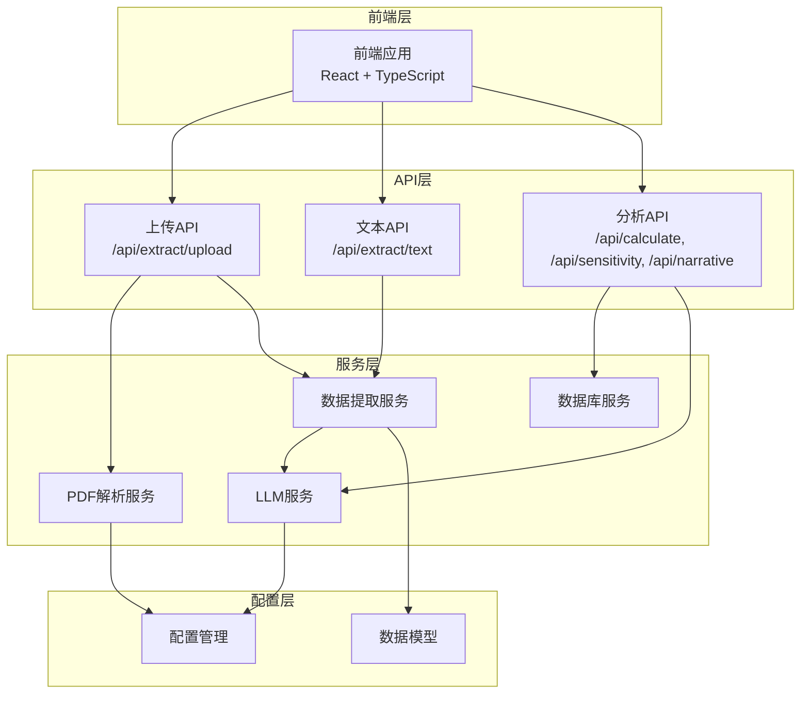
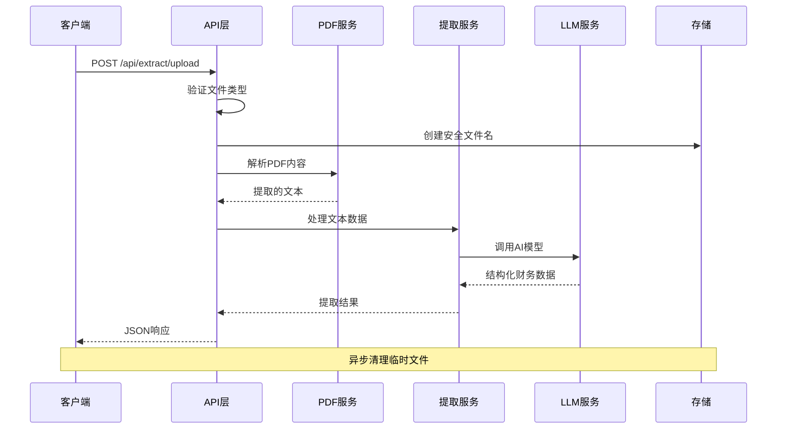
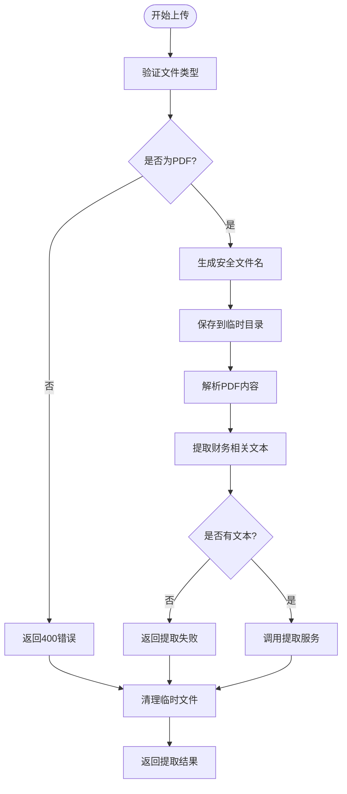
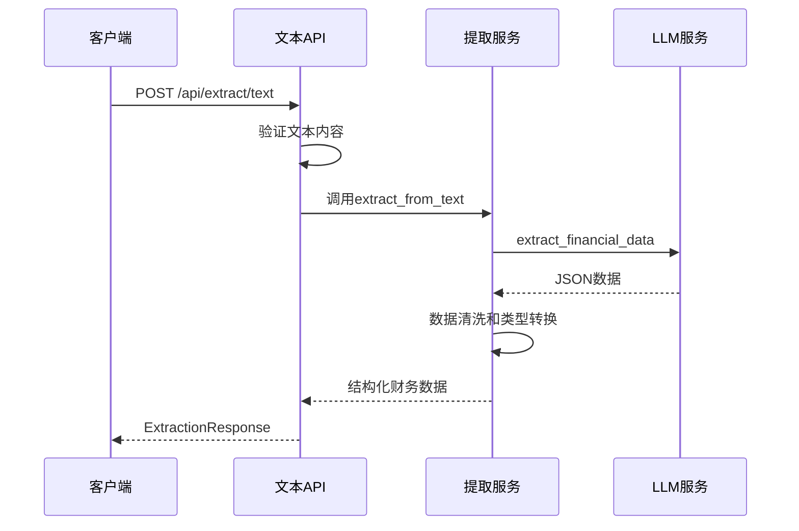
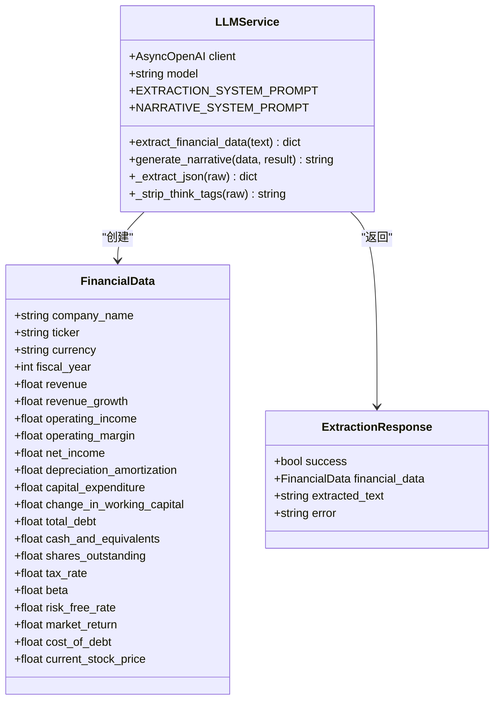
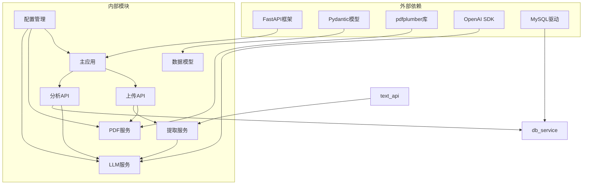

# 文件上传与数据提取API

<cite>
**本文档引用的文件**
- [main.py](file://backend/main.py)
- [upload.py](file://backend/api/upload.py)
- [analysis.py](file://backend/api/analysis.py)
- [pdf_service.py](file://backend/services/pdf_service.py)
- [extractor_service.py](file://backend/services/extractor_service.py)
- [llm_service.py](file://backend/services/llm_service.py)
- [schemas.py](file://backend/models/schemas.py)
- [config.py](file://backend/config.py)
- [api.ts](file://frontend/src/services/api.ts)
- [index.ts](file://frontend/src/types/index.ts)
- [integration_example.py](file://backend/examples/integration_example.py)
</cite>

## 目录
1. [简介](#简介)
2. [项目结构](#项目结构)
3. [核心组件](#核心组件)
4. [架构概览](#架构概览)
5. [详细组件分析](#详细组件分析)
6. [依赖关系分析](#依赖关系分析)
7. [性能考量](#性能考量)
8. [故障排除指南](#故障排除指南)
9. [结论](#结论)
10. [附录](#附录)

## 简介
本文件上传与数据提取API为DCF估值分析系统提供核心功能，支持两种数据提取模式：
- PDF文件上传提取：通过PDF解析提取文本内容，再进行结构化数据抽取
- 文本直接提取：对已有的财务文本进行结构化数据抽取

系统采用FastAPI框架构建，结合PDF解析、大语言模型(LLM)和财务数据分析能力，为用户提供完整的财务数据提取与分析服务。

## 项目结构
后端采用分层架构设计，主要分为API层、服务层和模型层：



**图表来源**
- [main.py:18-34](file://backend/main.py#L18-L34)
- [upload.py:13](file://backend/api/upload.py#L13)
- [analysis.py:15](file://backend/api/analysis.py#L15)

**章节来源**
- [main.py:1-40](file://backend/main.py#L1-L40)
- [config.py:1-22](file://backend/config.py#L1-L22)

## 核心组件
系统的核心组件包括API路由、PDF解析服务、数据提取服务和LLM服务：

### API路由组件
- **上传路由**：处理PDF文件上传和自动提取流程
- **文本路由**：处理直接文本输入的数据提取
- **分析路由**：提供DCF计算、敏感性分析和叙述生成

### 服务组件
- **PDF解析服务**：提取PDF中的财务相关内容
- **数据提取服务**：将非结构化文本转换为结构化财务数据
- **LLM服务**：调用外部AI模型进行数据抽取和文本生成

### 数据模型
- **FinancialData**：结构化财务数据模型
- **ExtractionResponse**：提取结果响应模型
- **DCF相关模型**：DCF计算参数和结果模型

**章节来源**
- [upload.py:16-54](file://backend/api/upload.py#L16-L54)
- [analysis.py:18-44](file://backend/api/analysis.py#L18-L44)
- [schemas.py:8-101](file://backend/models/schemas.py#L8-L101)

## 架构概览
系统采用模块化设计，各组件职责清晰分离：



**图表来源**
- [upload.py:16-43](file://backend/api/upload.py#L16-L43)
- [pdf_service.py:26-67](file://backend/services/pdf_service.py#L26-L67)
- [extractor_service.py:27-66](file://backend/services/extractor_service.py#L27-L66)
- [llm_service.py:94-122](file://backend/services/llm_service.py#L94-L122)

## 详细组件分析

### PDF文件上传接口 (/api/extract/upload)
该接口实现了完整的PDF文件处理流程：

#### 文件验证机制
- **类型检查**：严格验证文件扩展名为.pdf
- **空值检查**：确保文件名存在且不为空
- **异常处理**：对无效文件类型抛出HTTP 400错误

#### 安全命名策略
- **UUID生成**：使用随机UUID作为文件名前缀
- **原文件名保留**：保留原始文件扩展名但去除潜在危险字符
- **路径安全**：确保文件存储在指定的安全目录中

#### 临时存储机制
- **目录创建**：启动时自动创建临时上传目录
- **异步清理**：无论处理成功与否，都会删除临时文件
- **资源释放**：使用with语句确保文件句柄正确关闭

#### PDF文本提取流程
- **页面选择**：基于财务关键词相关性选择最相关的页面
- **字符限制**：限制最大提取字符数(30000字符)
- **文本合并**：按页面顺序合并提取的文本内容



**图表来源**
- [upload.py:17-42](file://backend/api/upload.py#L17-L42)
- [pdf_service.py:26-67](file://backend/services/pdf_service.py#L26-L67)

**章节来源**
- [upload.py:16-43](file://backend/api/upload.py#L16-L43)
- [config.py:21](file://backend/config.py#L21)

### 文本提取接口 (/api/extract/text)
该接口提供直接文本输入的数据提取功能：

#### 输入验证
- **空文本检查**：确保传入的文本不为空
- **格式验证**：使用Pydantic模型验证请求格式

#### 提取流程
- **LLM调用**：调用AI模型进行结构化数据抽取
- **数据清洗**：对提取的数据进行类型转换和默认值处理
- **响应封装**：将结果封装为标准响应格式



**图表来源**
- [upload.py:45-54](file://backend/api/upload.py#L45-L54)
- [extractor_service.py:27-66](file://backend/services/extractor_service.py#L27-L66)
- [llm_service.py:94-122](file://backend/services/llm_service.py#L94-L122)

**章节来源**
- [upload.py:45-54](file://backend/api/upload.py#L45-L54)
- [extractor_service.py:27-66](file://backend/services/extractor_service.py#L27-L66)

### PDF文本提取服务 (pdf_service.py)
该服务专门负责从PDF文件中提取财务相关内容：

#### 关键特性
- **财务关键词识别**：内置中英文财务术语列表
- **页面相关性排序**：根据财务关键词数量排序页面
- **字符数控制**：限制最大提取字符数防止过载
- **智能截断**：在达到字符限制时进行智能截断

#### 提取算法
1. **页面遍历**：逐页提取文本内容
2. **相关性评分**：计算每页财务关键词数量
3. **页面选择**：选择相关性最高的页面
4. **文本合并**：按原始顺序合并选中页面的文本

**章节来源**
- [pdf_service.py:26-67](file://backend/services/pdf_service.py#L26-L67)

### 数据提取服务 (extractor_service.py)
该服务负责将非结构化文本转换为结构化的财务数据：

#### 数据清洗策略
- **类型安全转换**：将字符串转换为数字时进行异常处理
- **默认值处理**：为缺失字段提供合理的默认值
- **字段映射**：将LLM输出映射到标准财务数据模型

#### 错误处理机制
- **异常捕获**：捕获所有提取过程中的异常
- **日志记录**：记录详细的错误信息用于调试
- **优雅降级**：在提取失败时返回结构化的错误响应

**章节来源**
- [extractor_service.py:11-66](file://backend/services/extractor_service.py#L11-L66)

### LLM服务 (llm_service.py)
该服务封装了与外部AI模型的交互：

#### 提示词工程
- **系统提示词**：详细的指令和约束条件
- **数据格式要求**：明确要求返回JSON格式
- **单位转换规则**：处理不同货币单位的转换

#### 输出解析
- **JSON提取**：从AI输出中提取有效的JSON内容
- **格式清理**：移除思维过程标记和代码块
- **错误处理**：处理JSON解析失败的情况



**图表来源**
- [llm_service.py:70-155](file://backend/services/llm_service.py#L70-L155)
- [schemas.py:8-82](file://backend/models/schemas.py#L8-L82)

**章节来源**
- [llm_service.py:14-50](file://backend/services/llm_service.py#L14-L50)
- [llm_service.py:94-122](file://backend/services/llm_service.py#L94-L122)

## 依赖关系分析



**图表来源**
- [main.py:8-34](file://backend/main.py#L8-L34)
- [config.py:10-21](file://backend/config.py#L10-L21)

**章节来源**
- [main.py:1-40](file://backend/main.py#L1-L40)
- [config.py:1-22](file://backend/config.py#L1-L22)

## 性能考量

### 优化策略
1. **内存管理**
   - PDF解析限制最大字符数(30000字符)
   - 使用流式文件处理避免内存溢出
   - 及时清理临时文件释放磁盘空间

2. **并发处理**
   - 使用异步API提高并发性能
   - LLM调用采用异步模式
   - 数据库操作使用连接池

3. **缓存策略**
   - 可考虑添加LLM响应缓存
   - PDF内容可添加本地缓存
   - 结果数据可添加Redis缓存

4. **网络优化**
   - 设置合理的超时时间(120-180秒)
   - 实现重试机制处理网络波动
   - 监控API响应时间

### 安全考虑
1. **文件安全**
   - 严格的文件类型验证
   - UUID文件名防止路径遍历攻击
   - 临时文件自动清理机制

2. **输入验证**
   - Pydantic模型验证所有输入
   - SQL注入防护(使用参数化查询)
   - XSS防护(HTML转义)

3. **API安全**
   - CORS配置允许跨域访问
   - 速率限制防止滥用
   - 日志记录审计追踪

## 故障排除指南

### 常见错误类型

#### 文件格式错误
- **症状**：返回HTTP 400错误，提示仅接受PDF文件
- **原因**：文件扩展名不是.pdf或文件头不匹配
- **解决方案**：确认文件格式正确，重新上传

#### 提取失败
- **症状**：返回提取失败，error字段包含具体错误
- **可能原因**：
  - PDF中没有可提取的文本内容
  - LLM服务不可用或响应超时
  - 网络连接异常
- **解决方案**：检查PDF质量，确认网络连接，重试操作

#### LLM解析错误
- **症状**：JSON解析失败，提示LLM返回无效JSON
- **原因**：AI模型输出格式不符合要求
- **解决方案**：检查API密钥配置，调整提示词参数

#### 网络异常
- **症状**：超时错误或连接被拒绝
- **解决方案**：检查网络连接，增加超时时间，检查防火墙设置

### 调试方法
1. **启用详细日志**：查看服务器端日志了解具体错误
2. **检查环境变量**：确认MINIMAX_API_KEY等配置正确
3. **测试独立功能**：分别测试PDF解析和LLM服务
4. **监控资源使用**：观察CPU和内存使用情况

**章节来源**
- [upload.py:38-39](file://backend/api/upload.py#L38-L39)
- [extractor_service.py:61-66](file://backend/services/extractor_service.py#L61-L66)
- [llm_service.py:117-122](file://backend/services/llm_service.py#L117-L122)

## 结论
本文件上传与数据提取API提供了完整的财务数据自动化处理能力。系统具有以下优势：

1. **模块化设计**：各组件职责清晰，易于维护和扩展
2. **安全性强**：多重验证和清理机制确保系统安全
3. **性能优化**：内存管理和异步处理提升系统性能
4. **错误处理**：完善的异常处理和日志记录机制

建议后续改进方向：
- 添加文件大小限制和批量处理支持
- 实现结果缓存机制提升性能
- 增加更多的PDF格式兼容性
- 提供更详细的错误诊断信息

## 附录

### 请求/响应示例

#### 成功响应示例
```json
{
  "success": true,
  "financial_data": {
    "company_name": "示例公司",
    "ticker": "000001.SZ",
    "currency": "CNY",
    "fiscal_year": 2024,
    "revenue": 1000000000.0,
    "net_income": 100000000.0,
    "shares_outstanding": 100000000.0
  },
  "extracted_text": "提取的文本内容摘要..."
}
```

#### 失败响应示例
```json
{
  "success": false,
  "error": "PDF解析失败：文件损坏或格式不支持"
}
```

### API使用示例

#### 前端调用示例
```typescript
// PDF文件上传
const formData = new FormData();
formData.append('file', file);
const response = await api.post('/extract/upload', formData, {
  headers: { 'Content-Type': 'multipart/form-data' }
});

// 文本提取
const response = await api.post('/extract/text', { text: extractedText });
```

**章节来源**
- [api.ts:28-49](file://frontend/src/services/api.ts#L28-L49)
- [index.ts:80-85](file://frontend/src/types/index.ts#L80-L85)