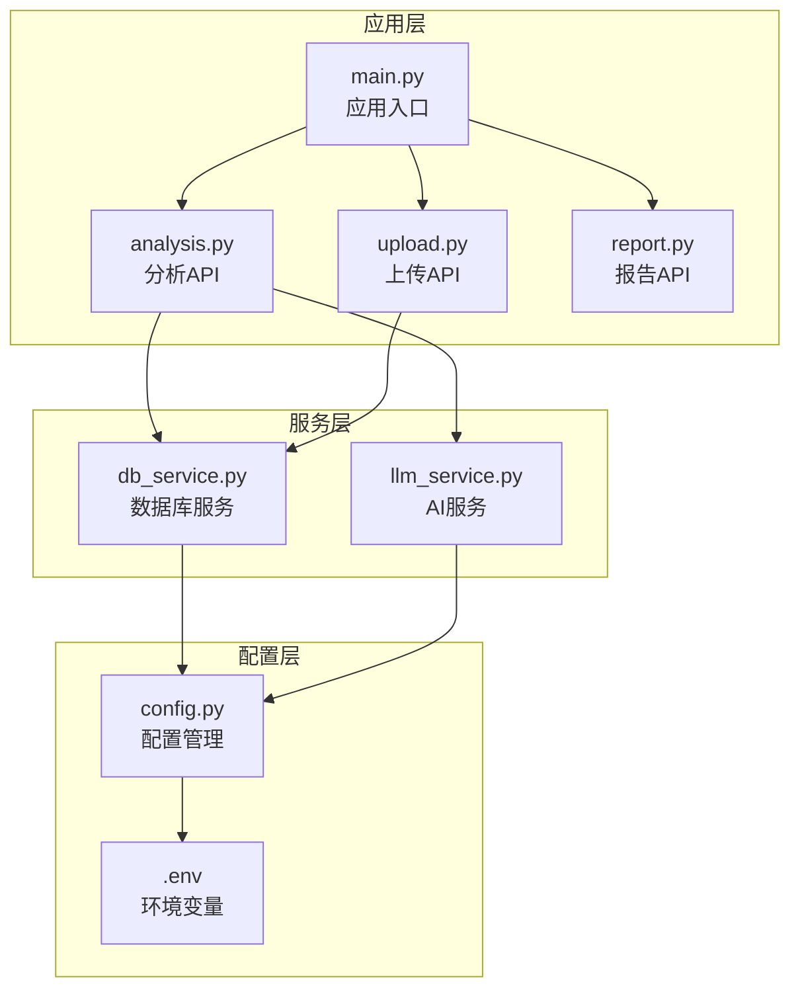
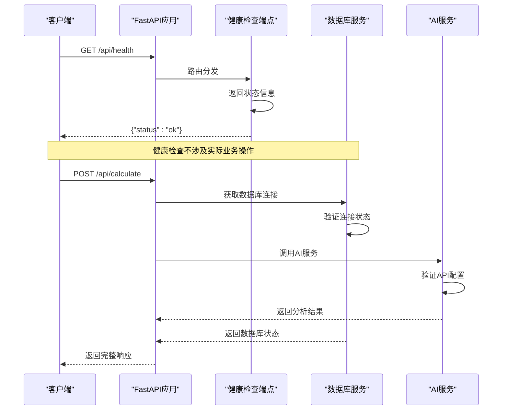
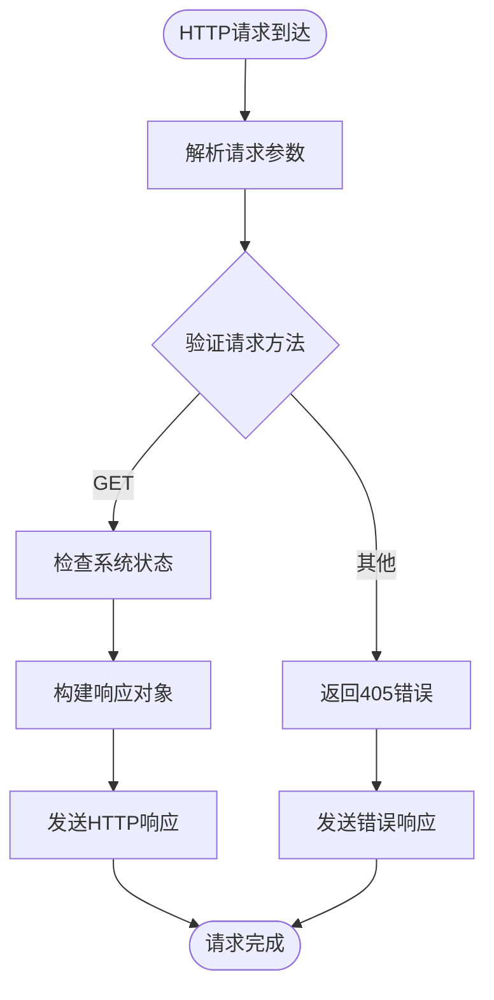
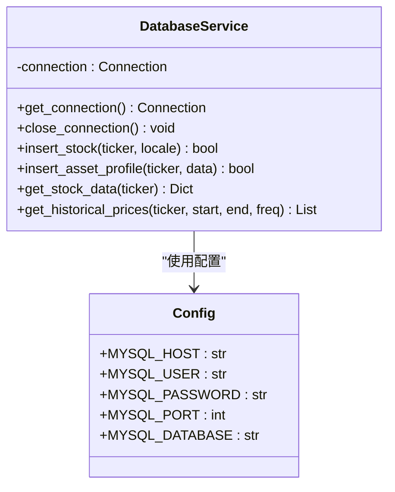
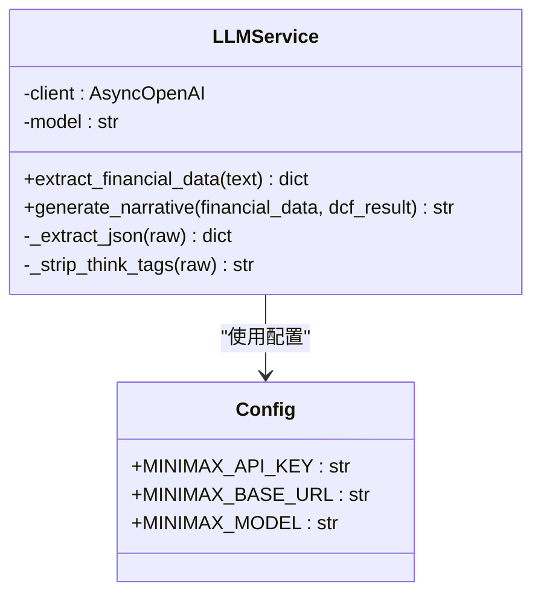
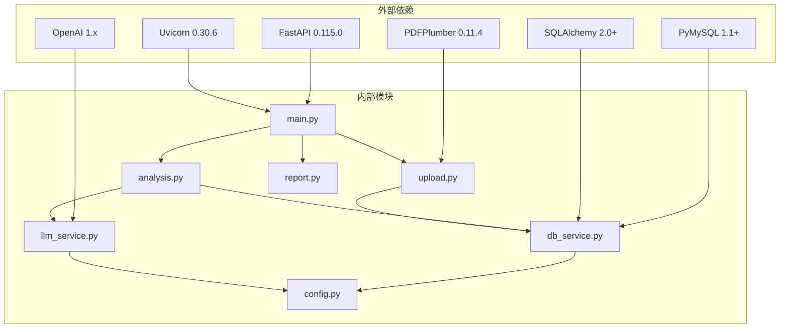

# 系统健康检查API

<cite>
**本文档引用的文件**
- [backend/main.py](file://backend/main.py)
- [backend/api/analysis.py](file://backend/api/analysis.py)
- [backend/api/upload.py](file://backend/api/upload.py)
- [backend/api/report.py](file://backend/api/report.py)
- [backend/services/db_service.py](file://backend/services/db_service.py)
- [backend/services/llm_service.py](file://backend/services/llm_service.py)
- [backend/config.py](file://backend/config.py)
- [backend/test_db_connection.py](file://backend/test_db_connection.py)
- [backend/requirements.txt](file://backend/requirements.txt)
</cite>

## 目录
1. [简介](#简介)
2. [项目结构](#项目结构)
3. [核心组件](#核心组件)
4. [架构概览](#架构概览)
5. [详细组件分析](#详细组件分析)
6. [依赖分析](#依赖分析)
7. [性能考虑](#性能考虑)
8. [故障排除指南](#故障排除指南)
9. [结论](#结论)
10. [附录](#附录)

## 简介
本文件为系统健康检查API提供简洁的接口文档。当前系统在根路径下提供一个简化的健康检查端点 `/api/health`，该端点返回基本的运行状态信息。本文档将详细说明该端点的设计目的、实现机制，并扩展讨论如何构建更全面的健康检查体系，包括数据库连接状态、AI服务可用性、文件系统权限、内存使用情况等多维度检查。

## 项目结构
后端采用FastAPI框架，主要由以下模块组成：
- 应用入口：定义FastAPI应用实例、中间件和路由注册
- API层：处理业务请求，包括分析、上传、报告等功能
- 服务层：封装数据库操作、AI服务调用、PDF解析等业务逻辑
- 配置管理：读取环境变量，配置数据库连接参数和AI服务参数
- 工具脚本：数据库连接测试工具



**图表来源**
- [backend/main.py:18-39](file://backend/main.py#L18-L39)
- [backend/api/analysis.py:15](file://backend/api/analysis.py#L15)
- [backend/api/upload.py:13](file://backend/api/upload.py#L13)
- [backend/api/report.py:5](file://backend/api/report.py#L5)
- [backend/services/db_service.py:24](file://backend/services/db_service.py#L24)
- [backend/services/llm_service.py:70](file://backend/services/llm_service.py#L70)
- [backend/config.py:1](file://backend/config.py#L1)

**章节来源**
- [backend/main.py:18-39](file://backend/main.py#L18-L39)
- [backend/api/analysis.py:15](file://backend/api/analysis.py#L15)
- [backend/api/upload.py:13](file://backend/api/upload.py#L13)
- [backend/api/report.py:5](file://backend/api/report.py#L5)

## 核心组件
系统健康检查API的核心组件包括：

### 健康检查端点
- **端点路径**：`GET /api/health`
- **功能描述**：返回系统基本运行状态
- **响应格式**：简单的JSON对象，包含状态信息
- **实现位置**：应用入口文件中的路由定义

### 数据库服务
- **职责**：管理MySQL数据库连接和事务
- **连接管理**：自动重连机制，连接池优化
- **错误处理**：详细的异常捕获和日志记录
- **数据操作**：支持多种财务报表数据的增删改查

### AI服务
- **集成平台**：MiniMax AI平台（通过OpenAI兼容接口）
- **功能特性**：财务数据分析提取、叙述生成
- **配置管理**：API密钥、基础URL、模型名称
- **错误处理**：JSON解析错误、网络异常等

**章节来源**
- [backend/main.py:37-39](file://backend/main.py#L37-L39)
- [backend/services/db_service.py:24-46](file://backend/services/db_service.py#L24-L46)
- [backend/services/llm_service.py:70-77](file://backend/services/llm_service.py#L70-L77)
- [backend/config.py:10-19](file://backend/config.py#L10-L19)

## 架构概览
系统采用分层架构设计，健康检查API位于应用层，通过服务层访问底层资源。



**图表来源**
- [backend/main.py:37-39](file://backend/main.py#L37-L39)
- [backend/api/analysis.py:18-23](file://backend/api/analysis.py#L18-L23)
- [backend/services/db_service.py:30-46](file://backend/services/db_service.py#L30-L46)
- [backend/services/llm_service.py:70-77](file://backend/services/llm_service.py#L70-L77)

## 详细组件分析

### 健康检查端点实现
当前的健康检查端点是一个简化的状态检查，仅返回基本的运行状态信息。



**图表来源**
- [backend/main.py:37-39](file://backend/main.py#L37-L39)

**章节来源**
- [backend/main.py:37-39](file://backend/main.py#L37-L39)

### 数据库连接健康检查
虽然当前健康检查端点不直接检查数据库，但数据库服务提供了完整的连接管理机制。



**图表来源**
- [backend/services/db_service.py:24-345](file://backend/services/db_service.py#L24-L345)
- [backend/config.py:14-19](file://backend/config.py#L14-L19)

**章节来源**
- [backend/services/db_service.py:24-46](file://backend/services/db_service.py#L24-L46)
- [backend/config.py:14-19](file://backend/config.py#L14-L19)

### AI服务健康检查
AI服务通过OpenAI兼容接口与外部平台通信，提供财务数据分析能力。



**图表来源**
- [backend/services/llm_service.py:70-155](file://backend/services/llm_service.py#L70-L155)
- [backend/config.py:10-12](file://backend/config.py#L10-L12)

**章节来源**
- [backend/services/llm_service.py:70-77](file://backend/services/llm_service.py#L70-L77)
- [backend/config.py:10-12](file://backend/config.py#L10-L12)

## 依赖分析
系统依赖关系清晰，各组件职责明确，便于维护和扩展。



**图表来源**
- [backend/requirements.txt:1-11](file://backend/requirements.txt#L1-L11)
- [backend/main.py:5-34](file://backend/main.py#L5-L34)

**章节来源**
- [backend/requirements.txt:1-11](file://backend/requirements.txt#L1-L11)
- [backend/main.py:5-34](file://backend/main.py#L5-L34)

## 性能考虑
当前健康检查端点性能开销极小，主要考虑因素包括：

### 响应时间优化
- **端点简单性**：无数据库查询，无外部服务调用
- **内存占用**：仅返回静态状态信息
- **并发处理**：支持异步处理，适合高并发场景

### 扩展性能监控
建议在现有基础上增加以下监控维度：
- **数据库连接池状态**：活跃连接数、等待队列长度
- **AI服务响应时间**：平均响应时间、95分位延迟
- **文件系统I/O**：上传目录空间使用情况
- **内存使用统计**：进程内存占用、垃圾回收频率

## 故障排除指南

### 健康检查失败原因分析

#### 数据库连接问题
- **症状**：数据库操作失败，但健康检查仍可正常返回
- **常见原因**：
  - MySQL服务器未启动
  - 网络连接异常
  - 用户权限不足
  - 密码错误
- **诊断工具**：提供专门的数据库连接测试脚本

#### AI服务不可用
- **症状**：AI相关API调用失败
- **常见原因**：
  - API密钥配置错误
  - 网络连接超时
  - 平台服务中断
  - 请求配额限制

#### 文件系统权限问题
- **症状**：文件上传失败，临时目录无法写入
- **常见原因**：
  - 上传目录权限不足
  - 磁盘空间不足
  - 目录不存在

**章节来源**
- [backend/test_db_connection.py:22-71](file://backend/test_db_connection.py#L22-L71)
- [backend/services/db_service.py:43-45](file://backend/services/db_service.py#L43-L45)
- [backend/services/llm_service.py:117-122](file://backend/services/llm_service.py#L117-L122)

## 结论
当前系统的健康检查API虽然简化，但为后续扩展提供了良好的基础。建议在保持现有端点的基础上，逐步增加对数据库连接、AI服务可用性、文件系统权限等关键组件的深度健康检查。通过合理的监控指标和告警机制，可以显著提升系统的可观测性和可靠性。

## 附录

### 健康检查响应格式
当前响应格式非常简单，建议扩展为包含更多维度的状态信息：

```json
{
  "status": "ok",
  "timestamp": "2024-01-01T00:00:00Z",
  "checks": {
    "database": {
      "status": "healthy",
      "latency_ms": 15
    },
    "ai_service": {
      "status": "healthy",
      "latency_ms": 120
    },
    "filesystem": {
      "status": "healthy",
      "available_space_mb": 102400
    }
  }
}
```

### 监控集成示例

#### Kubernetes集成
```yaml
livenessProbe:
  httpGet:
    path: /api/health
    port: 8000
  initialDelaySeconds: 30
  periodSeconds: 10

readinessProbe:
  httpGet:
    path: /api/health
    port: 8000
  initialDelaySeconds: 5
  periodSeconds: 5
```

#### Docker Compose集成
```yaml
healthcheck:
  test: ["CMD", "curl", "-f", "http://localhost:8000/api/health"]
  interval: 30s
  timeout: 10s
  retries: 3
```

### 告警阈值建议
- **数据库连接**：可用性低于99.9%触发告警
- **AI服务响应**：平均响应时间超过5秒
- **文件系统空间**：可用空间低于10%
- **内存使用**：连续5分钟内存使用率超过80%

### 自定义健康检查扩展
建议实现以下扩展点：
- **数据库连接检查**：执行简单查询验证连接
- **AI服务可用性检查**：调用平台健康检查接口
- **文件系统权限检查**：尝试创建临时文件验证权限
- **内存使用监控**：获取进程内存使用统计
- **磁盘空间监控**：检查上传目录剩余空间