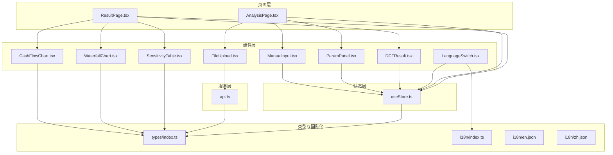
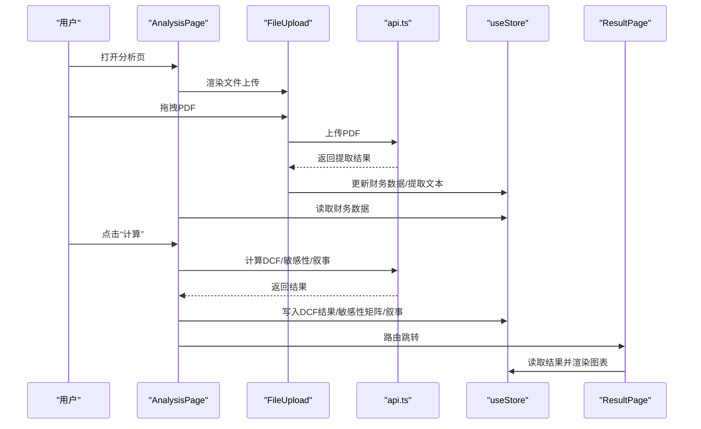
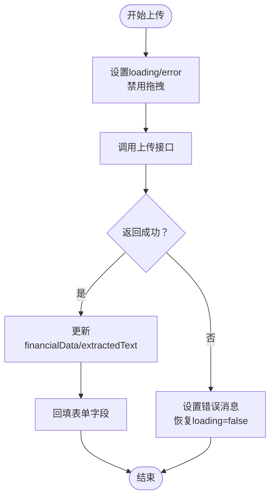
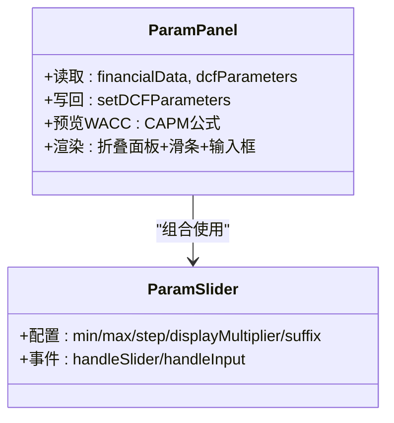
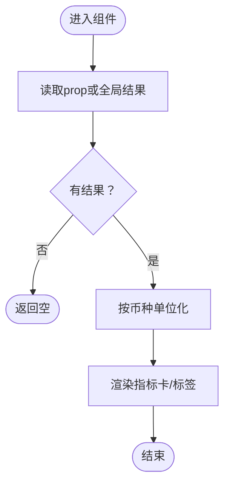
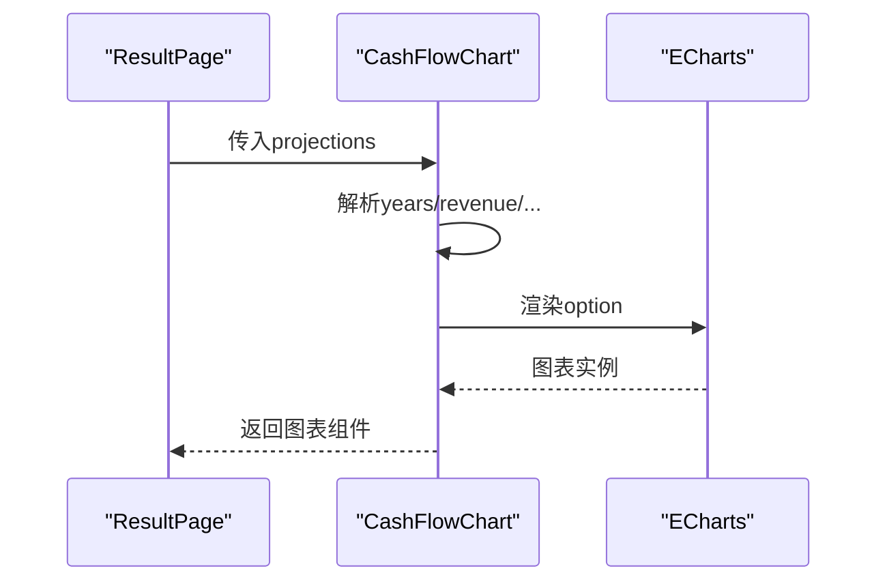
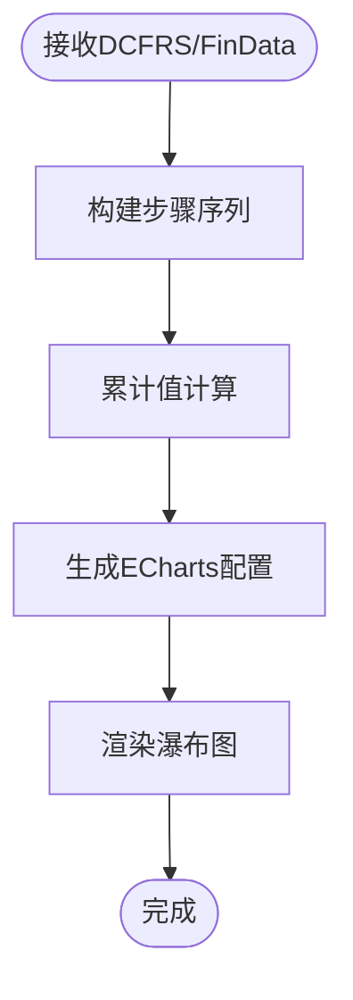
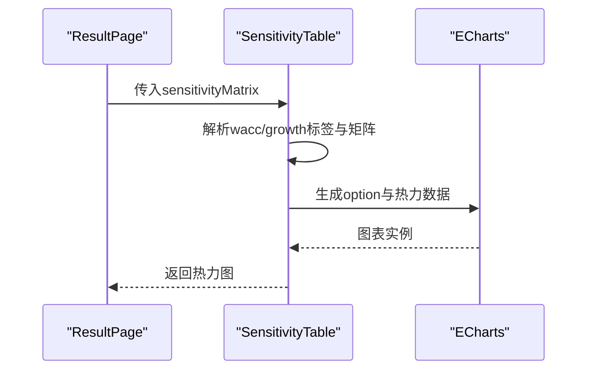
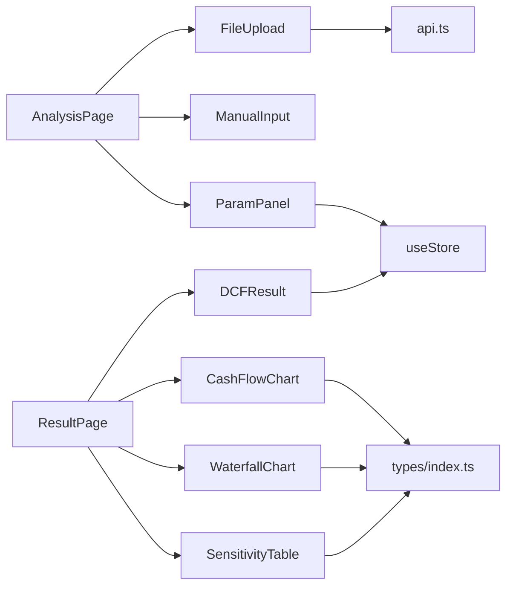

# UI组件

<cite>
**本文引用的文件**
- [FileUpload.tsx](file://frontend/src/components/FileUpload.tsx)
- [DCFResult.tsx](file://frontend/src/components/DCFResult.tsx)
- [ParamPanel.tsx](file://frontend/src/components/ParamPanel.tsx)
- [CashFlowChart.tsx](file://frontend/src/components/CashFlowChart.tsx)
- [WaterfallChart.tsx](file://frontend/src/components/WaterfallChart.tsx)
- [SensitivityTable.tsx](file://frontend/src/components/SensitivityTable.tsx)
- [ManualInput.tsx](file://frontend/src/components/ManualInput.tsx)
- [LanguageSwitch.tsx](file://frontend/src/components/LanguageSwitch.tsx)
- [AnalysisPage.tsx](file://frontend/src/pages/AnalysisPage.tsx)
- [ResultPage.tsx](file://frontend/src/pages/ResultPage.tsx)
- [api.ts](file://frontend/src/services/api.ts)
- [useStore.ts](file://frontend/src/store/useStore.ts)
- [index.ts（类型定义）](file://frontend/src/types/index.ts)
- [index.ts（国际化）](file://frontend/src/i18n/index.ts)
- [en.json](file://frontend/src/i18n/en.json)
- [zh.json](file://frontend/src/i18n/zh.json)
</cite>

## 目录
1. [简介](#简介)
2. [项目结构](#项目结构)
3. [核心组件](#核心组件)
4. [架构总览](#架构总览)
5. [详细组件分析](#详细组件分析)
6. [依赖关系分析](#依赖关系分析)
7. [性能考量](#性能考量)
8. [故障排查指南](#故障排查指南)
9. [结论](#结论)
10. [附录](#附录)

## 简介
本文件为DCF估值智能体UI组件系统的全面技术文档，覆盖文件上传、参数面板、DCF结果显示、现金流与瀑布图、敏感性热力图等核心组件的设计与实现。文档重点说明各组件的props接口、事件处理、状态管理、样式定制与响应式布局，并提供组件间通信机制、数据流与错误处理方案，以及使用示例、集成模式与复用策略。

## 项目结构
前端采用按功能分层的组织方式：页面层负责业务流程编排，组件层封装可复用UI与可视化，服务层对接后端API，状态层集中管理全局状态，类型定义统一数据契约，国际化提供多语言支持。

**图表来源**
- [AnalysisPage.tsx:1-217](file://frontend/src/pages/AnalysisPage.tsx#L1-L217)
- [ResultPage.tsx:1-216](file://frontend/src/pages/ResultPage.tsx#L1-L216)
- [FileUpload.tsx:1-159](file://frontend/src/components/FileUpload.tsx#L1-L159)
- [ManualInput.tsx:1-178](file://frontend/src/components/ManualInput.tsx#L1-L178)
- [ParamPanel.tsx:1-210](file://frontend/src/components/ParamPanel.tsx#L1-L210)
- [DCFResult.tsx:1-137](file://frontend/src/components/DCFResult.tsx#L1-L137)
- [CashFlowChart.tsx:1-110](file://frontend/src/components/CashFlowChart.tsx#L1-L110)
- [WaterfallChart.tsx:1-124](file://frontend/src/components/WaterfallChart.tsx#L1-L124)
- [SensitivityTable.tsx:1-98](file://frontend/src/components/SensitivityTable.tsx#L1-L98)
- [api.ts:1-81](file://frontend/src/services/api.ts#L1-L81)
- [useStore.ts:1-74](file://frontend/src/store/useStore.ts#L1-L74)
- [index.ts（类型定义）:1-128](file://frontend/src/types/index.ts#L1-L128)
- [index.ts（国际化）:1-27](file://frontend/src/i18n/index.ts#L1-L27)

**章节来源**
- [AnalysisPage.tsx:1-217](file://frontend/src/pages/AnalysisPage.tsx#L1-L217)
- [ResultPage.tsx:1-216](file://frontend/src/pages/ResultPage.tsx#L1-L216)
- [useStore.ts:1-74](file://frontend/src/store/useStore.ts#L1-L74)
- [api.ts:1-81](file://frontend/src/services/api.ts#L1-L81)
- [index.ts（类型定义）:1-128](file://frontend/src/types/index.ts#L1-L128)
- [index.ts（国际化）:1-27](file://frontend/src/i18n/index.ts#L1-L27)

## 核心组件
- 文件上传组件（FileUpload）
  - 功能：支持PDF拖拽上传，调用后端提取接口，回填表单字段，更新全局财务数据状态。
  - 关键点：上传前禁用拖拽区域，上传中显示加载；成功后渲染财务字段表单并联动全局状态。
- 参数面板（ParamPanel）
  - 功能：滑条+数值输入组合控件，分组折叠展示，实时预览WACC CAPM估算。
  - 关键点：参数配置集中定义，滑条与输入框双向同步，支持整数/百分比显示。
- DCF结果显示（DCFResult）
  - 功能：企业价值、股权价值、每股价值指标卡片展示，含当前股价与上/下行空间标签。
  - 关键点：根据币种进行金额单位化；正负值颜色区分；响应式栅格布局。
- 现金流图表（CashFlowChart）
  - 功能：柱状（营收/利润/FCF）+折线（现值）复合图，轴标签与提示格式化。
  - 关键点：按金额量级自动单位化；ECharts配置化；支持多系列对比。
- 瀑布图（WaterfallChart）
  - 功能：企业价值桥图，从永续现金流现值到终端价值再到EV，再扣债加现金融解EQV。
  - 关键点：正负堆叠与透明占位，累计值驱动；标签格式化。
- 敏感性热力图（SensitivityTable）
  - 功能：WACC×终期增长率二维敏感性矩阵，热力色阶与标签提示。
  - 关键点：行列标签百分比化；热力值标签强提示；强调态阴影效果。
- 手动输入（ManualInput）
  - 功能：分段表单录入财务数据，支持默认值、校验与重置。
  - 关键点：字段分组与网格布局；必填规则；与全局状态联动。
- 语言切换（LanguageSwitch）
  - 功能：中英语言切换，写入全局状态并应用至i18n。
  - 关键点：Segmented控件；与i18n检测器协同。

**章节来源**
- [FileUpload.tsx:1-159](file://frontend/src/components/FileUpload.tsx#L1-L159)
- [ParamPanel.tsx:1-210](file://frontend/src/components/ParamPanel.tsx#L1-L210)
- [DCFResult.tsx:1-137](file://frontend/src/components/DCFResult.tsx#L1-L137)
- [CashFlowChart.tsx:1-110](file://frontend/src/components/CashFlowChart.tsx#L1-L110)
- [WaterfallChart.tsx:1-124](file://frontend/src/components/WaterfallChart.tsx#L1-L124)
- [SensitivityTable.tsx:1-98](file://frontend/src/components/SensitivityTable.tsx#L1-L98)
- [ManualInput.tsx:1-178](file://frontend/src/components/ManualInput.tsx#L1-L178)
- [LanguageSwitch.tsx:1-30](file://frontend/src/components/LanguageSwitch.tsx#L1-L30)

## 架构总览
组件间通过全局状态与API服务进行数据与控制流交互，页面负责编排与路由跳转，组件负责UI与可视化，类型定义确保前后端契约一致，国际化贯穿全链路。

**图表来源**
- [AnalysisPage.tsx:58-99](file://frontend/src/pages/AnalysisPage.tsx#L58-L99)
- [FileUpload.tsx:21-48](file://frontend/src/components/FileUpload.tsx#L21-L48)
- [api.ts:28-80](file://frontend/src/services/api.ts#L28-L80)
- [useStore.ts:35-53](file://frontend/src/store/useStore.ts#L35-L53)
- [ResultPage.tsx:35-44](file://frontend/src/pages/ResultPage.tsx#L35-L44)

## 详细组件分析

### 文件上传组件（FileUpload）
- props接口
  - 无外部props，内部通过全局状态注入setter与getter。
- 事件与状态
  - 上传前设置loading与error清空；上传后根据返回更新financialData、extractedText；失败时设置错误消息。
  - 表单联动：字段分组渲染，字符串/数值输入差异化；表单变更即时写入全局状态。
- 样式与响应式
  - Ant Design Drag容器，成功后显示对勾图标；卡片动画入场；表单网格自适应列数。
- 错误处理
  - try/catch捕获异常；Axios错误解析；统一message反馈。
- 使用示例
  - 在分析页的“上传”标签页直接嵌入；也可在其他页面按需引入。
- 复用策略
  - 可抽取为通用上传组件，通过回调函数扩展业务字段映射。

**图表来源**
- [FileUpload.tsx:21-48](file://frontend/src/components/FileUpload.tsx#L21-L48)

**章节来源**
- [FileUpload.tsx:1-159](file://frontend/src/components/FileUpload.tsx#L1-L159)
- [api.ts:28-40](file://frontend/src/services/api.ts#L28-L40)
- [useStore.ts:35-53](file://frontend/src/store/useStore.ts#L35-L53)

### 参数面板（ParamPanel）
- props接口
  - 无外部props，内部读取全局financialData与dcfParameters，通过setDCFParameters写回。
- 事件与状态
  - 分类折叠：比率/税率/年限等分组；滑条与输入框联动；CAPM预览WACC动态计算。
- 样式与响应式
  - Ant Design Collapse + Sticky定位；标签徽章显示当前值；滑条tooltip百分比后缀。
- 错误处理
  - 输入范围与步进约束；非法值不触发写入。
- 使用示例
  - 分析页右侧固定栏；可在其他页面复用。
- 复用策略
  - 将参数配置抽离为可注入配置项，支持不同模型参数集。

**图表来源**
- [ParamPanel.tsx:88-210](file://frontend/src/components/ParamPanel.tsx#L88-L210)

**章节来源**
- [ParamPanel.tsx:1-210](file://frontend/src/components/ParamPanel.tsx#L1-L210)
- [useStore.ts:37-40](file://frontend/src/store/useStore.ts#L37-L40)

### DCF结果显示（DCFResult）
- props接口
  - 接收可选的result对象；若未传则从全局状态读取。
- 数据展示
  - 三张指标卡：EV、EQV、PSV；可选当前股价与上/下行空间；按币种自动单位化。
- 响应式与样式
  - Ant Design Statistic + Card；栅格布局自适应；边框色带突出。
- 使用示例
  - 结果页顶部摘要区；亦可独立用于仪表板。
- 复用策略
  - 支持传入外部结果对象，便于嵌入其他页面或弹窗。

**图表来源**
- [DCFResult.tsx:30-137](file://frontend/src/components/DCFResult.tsx#L30-L137)

**章节来源**
- [DCFResult.tsx:1-137](file://frontend/src/components/DCFResult.tsx#L1-L137)
- [useStore.ts:32-33](file://frontend/src/store/useStore.ts#L32-L33)

### 现金流图表（CashFlowChart）
- props接口
  - projections: FCFProjection[]
- 数据可视化
  - 柱状：营收/利润/FCF；折线：现值；图例底部；tooltip格式化。
- 性能与体验
  - ECharts Canvas渲染；按量级自动单位化；标签旋转避免遮挡。
- 使用示例
  - 结果页第一张图表；可配合投影数据源使用。
- 复用策略
  - 支持传入任意投影序列；可扩展为多子图或交互钻取。

**图表来源**
- [CashFlowChart.tsx:16-110](file://frontend/src/components/CashFlowChart.tsx#L16-L110)
- [index.ts（类型定义）:41-52](file://frontend/src/types/index.ts#L41-L52)

**章节来源**
- [CashFlowChart.tsx:1-110](file://frontend/src/components/CashFlowChart.tsx#L1-L110)
- [index.ts（类型定义）:41-52](file://frontend/src/types/index.ts#L41-L52)

### 瀑布图（WaterfallChart）
- props接口
  - dcfResult: DCFResult, financialData: FinancialData
- 数据构建
  - 步骤序列：永续FCF现值→终端价值现值→EV→扣债→加现金→EQV；累计值驱动堆叠。
- 视觉设计
  - 透明占位、正负堆叠、标签显式数值；轴标签旋转。
- 使用示例
  - 结果页第二列图表；与DCF结果强关联。
- 复用策略
  - 可抽象为通用价值桥图组件，支持自定义步骤与颜色。

**图表来源**
- [WaterfallChart.tsx:17-124](file://frontend/src/components/WaterfallChart.tsx#L17-L124)
- [index.ts（类型定义）:54-66](file://frontend/src/types/index.ts#L54-L66)
- [index.ts（类型定义）:4-26](file://frontend/src/types/index.ts#L4-L26)

**章节来源**
- [WaterfallChart.tsx:1-124](file://frontend/src/components/WaterfallChart.tsx#L1-L124)
- [index.ts（类型定义）:54-66](file://frontend/src/types/index.ts#L54-L66)
- [index.ts（类型定义）:4-26](file://frontend/src/types/index.ts#L4-L26)

### 敏感性热力图（SensitivityTable）
- props接口
  - sensitivityMatrix: SensitivityMatrix
- 数据处理
  - 展平二维矩阵为热力坐标；最小/最大值驱动视觉映射；行列标签百分比化。
- 交互体验
  - tooltip强提示；标签数字显式；强调态阴影增强可读性。
- 使用示例
  - 结果页第二列左半图表；与DCF结果共同呈现。
- 复用策略
  - 可扩展为通用二维敏感性组件，支持自定义颜色与标签。

**图表来源**
- [SensitivityTable.tsx:9-98](file://frontend/src/components/SensitivityTable.tsx#L9-L98)
- [index.ts（类型定义）:74-78](file://frontend/src/types/index.ts#L74-L78)

**章节来源**
- [SensitivityTable.tsx:1-98](file://frontend/src/components/SensitivityTable.tsx#L1-L98)
- [index.ts（类型定义）:74-78](file://frontend/src/types/index.ts#L74-L78)

### 手动输入（ManualInput）
- props接口
  - 无外部props，内部通过全局状态读写financialData。
- 表单组织
  - 分段标题+网格布局；字段类型与范围约束；默认值与重置。
- 事件与状态
  - 表单变更即时写入全局；提交校验通过后写入；重置恢复默认。
- 使用示例
  - 分析页“手动输入”标签页；亦可独立作为配置面板。
- 复用策略
  - 字段定义可配置化，适配不同财务数据模板。

**章节来源**
- [ManualInput.tsx:1-178](file://frontend/src/components/ManualInput.tsx#L1-L178)
- [useStore.ts:35-53](file://frontend/src/store/useStore.ts#L35-L53)

### 语言切换（LanguageSwitch）
- props接口
  - 无外部props，内部通过全局状态与i18n库协作。
- 事件与状态
  - 切换语言并写入全局状态；同时调用i18n.changeLanguage。
- 使用示例
  - 页面右上角；亦可嵌入设置面板。
- 复用策略
  - 可扩展为多语言选择器，支持更多语言。

**章节来源**
- [LanguageSwitch.tsx:1-30](file://frontend/src/components/LanguageSwitch.tsx#L1-L30)
- [index.ts（国际化）:1-27](file://frontend/src/i18n/index.ts#L1-L27)

## 依赖关系分析
- 组件依赖
  - AnalysisPage/ResultPage作为编排者，依赖各组件与全局状态。
  - FileUpload/ManualInput依赖API与全局状态；ParamPanel依赖全局参数与CAPM计算。
  - 可视化组件依赖类型定义中的投影/结果结构。
- 外部依赖
  - Ant Design UI库、ECharts-for-React、Axios、i18next。
- 状态耦合
  - 全局状态集中管理财务数据、参数、结果、敏感性矩阵、叙事与加载/错误状态，降低组件间耦合。

**图表来源**
- [AnalysisPage.tsx:1-217](file://frontend/src/pages/AnalysisPage.tsx#L1-L217)
- [ResultPage.tsx:1-216](file://frontend/src/pages/ResultPage.tsx#L1-L216)
- [FileUpload.tsx:1-159](file://frontend/src/components/FileUpload.tsx#L1-L159)
- [ParamPanel.tsx:1-210](file://frontend/src/components/ParamPanel.tsx#L1-L210)
- [DCFResult.tsx:1-137](file://frontend/src/components/DCFResult.tsx#L1-L137)
- [CashFlowChart.tsx:1-110](file://frontend/src/components/CashFlowChart.tsx#L1-L110)
- [WaterfallChart.tsx:1-124](file://frontend/src/components/WaterfallChart.tsx#L1-L124)
- [SensitivityTable.tsx:1-98](file://frontend/src/components/SensitivityTable.tsx#L1-L98)
- [api.ts:1-81](file://frontend/src/services/api.ts#L1-L81)
- [useStore.ts:1-74](file://frontend/src/store/useStore.ts#L1-L74)
- [index.ts（类型定义）:1-128](file://frontend/src/types/index.ts#L1-L128)

**章节来源**
- [AnalysisPage.tsx:1-217](file://frontend/src/pages/AnalysisPage.tsx#L1-L217)
- [ResultPage.tsx:1-216](file://frontend/src/pages/ResultPage.tsx#L1-L216)
- [useStore.ts:1-74](file://frontend/src/store/useStore.ts#L1-L74)

## 性能考量
- 图表渲染
  - ECharts Canvas渲染，适合大数据量；建议在结果页按需渲染，避免频繁重建。
- 状态更新
  - 全局状态写入粒度适中，避免过度拆分导致重复渲染；必要时使用memo化组件。
- 网络请求
  - 上传PDF超时延长；计算/敏感性/叙事接口设置合理超时与重试策略。
- 国际化
  - 语言切换仅影响文案与格式化，避免重复计算；建议缓存常用格式化结果。

## 故障排查指南
- 上传失败
  - 检查后端接口可用性与网络超时；查看错误消息；确认文件格式与大小限制。
- 计算异常
  - 确认财务数据完整性与合理性；检查参数边界；查看后端返回的错误详情。
- 图表空白
  - 确认传入数据非空且结构正确；检查ECharts初始化与容器尺寸。
- 语言切换无效
  - 检查i18n初始化与本地存储检测；确认切换回调已执行。

**章节来源**
- [FileUpload.tsx:40-47](file://frontend/src/components/FileUpload.tsx#L40-L47)
- [AnalysisPage.tsx:91-98](file://frontend/src/pages/AnalysisPage.tsx#L91-L98)
- [api.ts:17-26](file://frontend/src/services/api.ts#L17-L26)
- [LanguageSwitch.tsx:15-19](file://frontend/src/components/LanguageSwitch.tsx#L15-L19)

## 结论
该UI组件系统围绕DCF估值流程形成闭环：从PDF数据提取与手动录入，到参数调节与计算，再到结果可视化与叙事生成。组件职责清晰、状态集中、接口稳定，具备良好的可维护性与扩展性。通过统一的类型定义与国际化支持，系统在多语言与多场景下保持一致性与可用性。

## 附录
- 组件使用清单
  - 分析页：FileUpload、ManualInput、ParamPanel、DCFResult（摘要）、CashFlowChart、WaterfallChart、SensitivityTable
  - 结果页：DCFResult（完整）、CashFlowChart、WaterfallChart、SensitivityTable、AI叙事折叠面板
- 集成模式
  - 页面级组合：AnalysisPage/ResultPage作为编排容器，按需引入组件。
  - 独立复用：组件通过props与全局状态解耦，可在其他页面按需引入。
- 最佳实践
  - 严格遵循类型定义；对图表数据进行空值与边界检查；统一错误处理与提示；保持状态更新幂等。