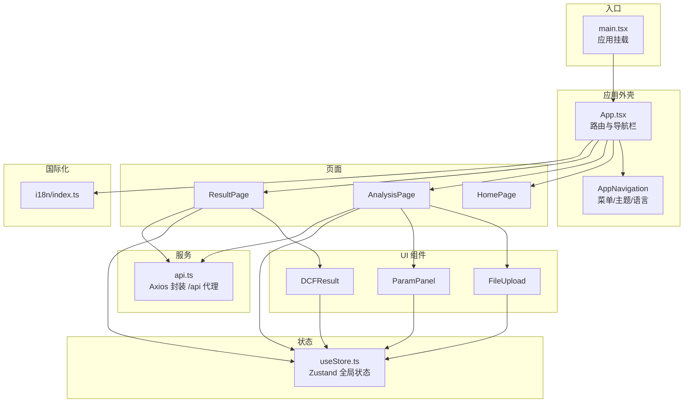
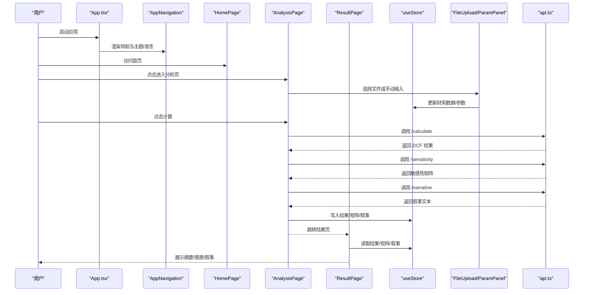
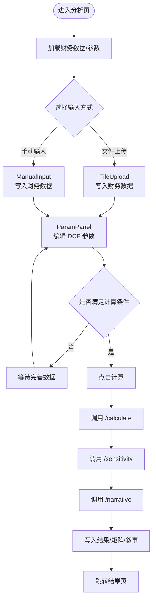
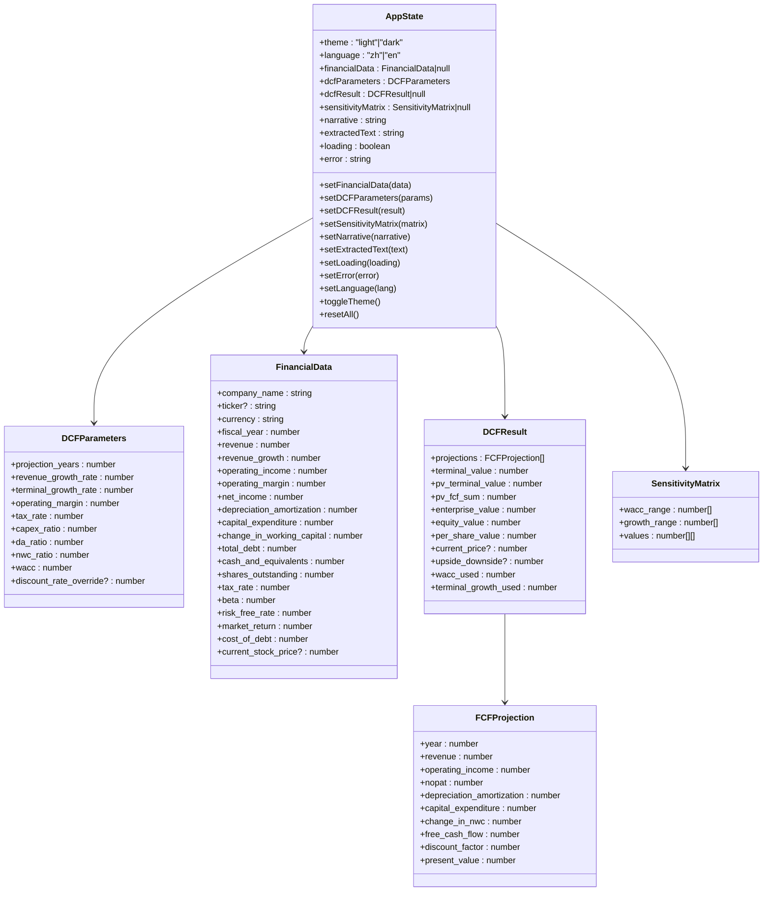
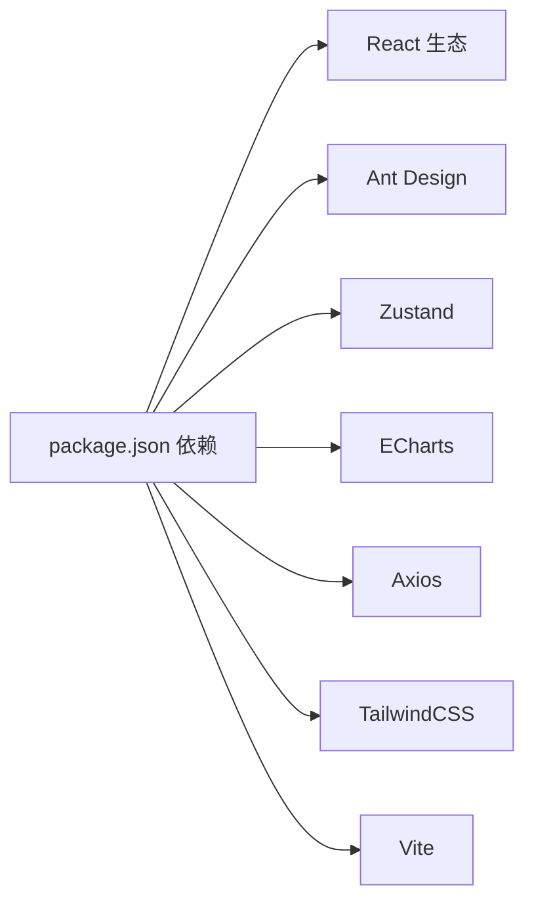

# 前端组件

<cite>
**本文引用的文件**
- [frontend/src/App.tsx](file://frontend/src/App.tsx)
- [frontend/src/main.tsx](file://frontend/src/main.tsx)
- [frontend/package.json](file://frontend/package.json)
- [frontend/vite.config.ts](file://frontend/vite.config.ts)
- [frontend/tailwind.config.js](file://frontend/tailwind.config.js)
- [frontend/src/store/useStore.ts](file://frontend/src/store/useStore.ts)
- [frontend/src/pages/HomePage.tsx](file://frontend/src/pages/HomePage.tsx)
- [frontend/src/pages/AnalysisPage.tsx](file://frontend/src/pages/AnalysisPage.tsx)
- [frontend/src/pages/ResultPage.tsx](file://frontend/src/pages/ResultPage.tsx)
- [frontend/src/services/api.ts](file://frontend/src/services/api.ts)
- [frontend/src/components/FileUpload.tsx](file://frontend/src/components/FileUpload.tsx)
- [frontend/src/components/ParamPanel.tsx](file://frontend/src/components/ParamPanel.tsx)
- [frontend/src/components/DCFResult.tsx](file://frontend/src/components/DCFResult.tsx)
- [frontend/src/types/index.ts](file://frontend/src/types/index.ts)
- [frontend/src/i18n/index.ts](file://frontend/src/i18n/index.ts)
</cite>

## 目录
1. [简介](#简介)
2. [项目结构](#项目结构)
3. [核心组件](#核心组件)
4. [架构总览](#架构总览)
5. [详细组件分析](#详细组件分析)
6. [依赖分析](#依赖分析)
7. [性能考虑](#性能考虑)
8. [故障排查指南](#故障排查指南)
9. [结论](#结论)
10. [附录](#附录)

## 简介
本项目是一个基于 React 的 DCF 估值智能体前端应用，采用 TypeScript、Vite 构建，Ant Design 提供 UI 组件库，Zustand 进行全局状态管理，ECharts 实现可视化图表，i18n 支持中英文切换。系统通过路由组织页面组件（首页、分析页、结果页），并通过状态管理在页面与 UI 组件之间传递数据与控制流。

## 项目结构
前端代码位于 frontend/src 目录，按功能分层组织：
- 页面组件：pages 下的 HomePage、AnalysisPage、ResultPage
- UI 组件：components 下的 FileUpload、ParamPanel、DCFResult 等
- 全局状态：store/useStore.ts 使用 Zustand 管理主题、语言、财务数据、DCF 参数、结果、敏感性矩阵、叙事文本、加载与错误状态
- 类型定义：types/index.ts 定义了金融数据、DCF 参数、结果、敏感性矩阵、请求/响应接口与全局状态契约
- 服务层：services/api.ts 封装后端 /api 代理调用
- 国际化：i18n/index.ts 配置 i18n 与语言检测
- 样式与主题：tailwind.config.js 定义颜色、字体、阴影等；App.tsx 中通过 Ant Design ConfigProvider 应用主题算法与 Token

**图示来源**
- [frontend/src/main.tsx:1-12](file://frontend/src/main.tsx#L1-L12)
- [frontend/src/App.tsx:105-147](file://frontend/src/App.tsx#L105-L147)
- [frontend/src/store/useStore.ts:23-73](file://frontend/src/store/useStore.ts#L23-L73)
- [frontend/src/services/api.ts:11-80](file://frontend/src/services/api.ts#L11-L80)
- [frontend/src/components/FileUpload.tsx:12-158](file://frontend/src/components/FileUpload.tsx#L12-L158)
- [frontend/src/components/ParamPanel.tsx:88-209](file://frontend/src/components/ParamPanel.tsx#L88-L209)
- [frontend/src/components/DCFResult.tsx:30-136](file://frontend/src/components/DCFResult.tsx#L30-L136)
- [frontend/src/i18n/index.ts:7-24](file://frontend/src/i18n/index.ts#L7-L24)

**章节来源**
- [frontend/src/main.tsx:1-12](file://frontend/src/main.tsx#L1-L12)
- [frontend/src/App.tsx:105-147](file://frontend/src/App.tsx#L105-L147)
- [frontend/vite.config.ts:5-21](file://frontend/vite.config.ts#L5-L21)
- [frontend/tailwind.config.js:1-39](file://frontend/tailwind.config.js#L1-L39)

## 核心组件
- 应用外壳与导航
  - App.tsx 负责路由配置、Ant Design 主题注入、布局容器、页头导航与页脚
  - AppNavigation 提供菜单项、语言切换下拉、主题切换按钮，并与 Zustand 状态联动
- 全局状态
  - useStore.ts 定义主题、语言、财务数据、DCF 参数、结果、敏感性矩阵、叙事文本、加载与错误状态，以及对应的 setter 与重置函数
- 页面组件
  - HomePage：展示产品特性与引导进入分析页
  - AnalysisPage：文件上传/手动输入财务数据、编辑 DCF 参数、执行计算与生成敏感性分析与叙事
  - ResultPage：展示估值摘要卡片、现金流趋势图、敏感性表格、价值桥瀑布图与 AI 叙事
- UI 组件
  - FileUpload：PDF 上传与字段提取、表单编辑、保存到全局状态
  - ParamPanel：参数滑块面板，支持 WACC 预览（CAPM）、分组折叠
  - DCFResult：结果指标卡片展示（企业价值、股权价值、每股价值、上/下价值空间等）
- 服务层
  - api.ts：封装 /api 前缀的后端接口调用，统一错误处理
- 国际化
  - i18n/index.ts：资源加载、回退语言、浏览器语言检测、本地缓存策略

**章节来源**
- [frontend/src/App.tsx:21-103](file://frontend/src/App.tsx#L21-L103)
- [frontend/src/store/useStore.ts:23-73](file://frontend/src/store/useStore.ts#L23-L73)
- [frontend/src/pages/HomePage.tsx:23-116](file://frontend/src/pages/HomePage.tsx#L23-L116)
- [frontend/src/pages/AnalysisPage.tsx:29-216](file://frontend/src/pages/AnalysisPage.tsx#L29-L216)
- [frontend/src/pages/ResultPage.tsx:35-215](file://frontend/src/pages/ResultPage.tsx#L35-L215)
- [frontend/src/components/FileUpload.tsx:12-158](file://frontend/src/components/FileUpload.tsx#L12-L158)
- [frontend/src/components/ParamPanel.tsx:88-209](file://frontend/src/components/ParamPanel.tsx#L88-L209)
- [frontend/src/components/DCFResult.tsx:30-136](file://frontend/src/components/DCFResult.tsx#L30-L136)
- [frontend/src/services/api.ts:11-80](file://frontend/src/services/api.ts#L11-L80)
- [frontend/src/i18n/index.ts:7-24](file://frontend/src/i18n/index.ts#L7-L24)

## 架构总览
系统采用“页面组件 + UI 组件 + 全局状态 + 服务层”的分层架构。页面组件负责用户交互与流程编排，UI 组件负责可复用的交互与展示，Zustand 管理跨页面共享状态，服务层统一处理网络请求与错误。

**图示来源**
- [frontend/src/App.tsx:105-147](file://frontend/src/App.tsx#L105-L147)
- [frontend/src/pages/AnalysisPage.tsx:58-99](file://frontend/src/pages/AnalysisPage.tsx#L58-L99)
- [frontend/src/pages/ResultPage.tsx:40-42](file://frontend/src/pages/ResultPage.tsx#L40-L42)
- [frontend/src/services/api.ts:51-80](file://frontend/src/services/api.ts#L51-L80)
- [frontend/src/store/useStore.ts:35-53](file://frontend/src/store/useStore.ts#L35-L53)

## 详细组件分析

### 页面组件

#### 首页 HomePage
- 职责：产品介绍、特性卡片展示、引导进入分析页
- 关键点：响应式布局、渐变背景动画、特征图标与文案来自 i18n

**章节来源**
- [frontend/src/pages/HomePage.tsx:23-116](file://frontend/src/pages/HomePage.tsx#L23-L116)

#### 分析页 AnalysisPage
- 职责：文件上传与手动输入财务数据、编辑 DCF 参数、触发计算、生成敏感性分析与叙事、跳转结果页
- 数据流：
  - 文件上传：FileUpload 写入财务数据到全局状态
  - 手动输入：ManualInput（未在当前上下文中）写入财务数据
  - 参数编辑：ParamPanel 写入 DCF 参数到全局状态
  - 计算流程：依次调用 /calculate、/sensitivity、/narrative，成功后写入结果与矩阵，最后跳转结果页
- 交互细节：根据财务数据完整性启用计算按钮；加载态显示当前步骤；错误统一提示

**图示来源**
- [frontend/src/pages/AnalysisPage.tsx:29-99](file://frontend/src/pages/AnalysisPage.tsx#L29-L99)
- [frontend/src/services/api.ts:51-80](file://frontend/src/services/api.ts#L51-L80)
- [frontend/src/store/useStore.ts:35-53](file://frontend/src/store/useStore.ts#L35-L53)

**章节来源**
- [frontend/src/pages/AnalysisPage.tsx:29-216](file://frontend/src/pages/AnalysisPage.tsx#L29-L216)

#### 结果页 ResultPage
- 职责：展示估值摘要卡片、现金流趋势图、敏感性表格、价值桥瀑布图与 AI 叙事
- 保护逻辑：若无结果则返回分析页
- 展示格式：金额与百分比格式化、当前股价与上/下价值空间标签

**章节来源**
- [frontend/src/pages/ResultPage.tsx:35-215](file://frontend/src/pages/ResultPage.tsx#L35-L215)

### UI 组件

#### 文件上传组件 FileUpload
- 功能：拖拽上传 PDF、调用 /extract/upload 获取提取的财务数据、渲染字段分组表单、保存到全局状态
- 行为：上传中禁用拖拽、移除文件时清空状态、统一错误提示
- 字段分组：公司信息、收入与利润、折旧摊销与资本支出、债务与现金、贝塔与贴现参数

**章节来源**
- [frontend/src/components/FileUpload.tsx:12-158](file://frontend/src/components/FileUpload.tsx#L12-L158)

#### 参数面板 ParamPanel
- 功能：滑块与数值输入联动编辑 DCF 参数；按类别折叠；实时预览 CAPM 计算的 WACC
- 设计：每项参数配置包含最小值、最大值、步长、显示倍数与单位；整数参数标记 integer
- 交互：滑块与输入框双向同步，tooltip 显示当前值

**章节来源**
- [frontend/src/components/ParamPanel.tsx:88-209](file://frontend/src/components/ParamPanel.tsx#L88-L209)

#### DCF 结果组件 DCFResult
- 功能：展示企业价值、股权价值、每股价值与当前股价、上/下价值空间、WACC 与终值增长率
- 格式化：大额数字按货币类型进行单位缩放显示（如 亿、万、B、M）

**章节来源**
- [frontend/src/components/DCFResult.tsx:30-136](file://frontend/src/components/DCFResult.tsx#L30-L136)

### 状态管理与数据流

#### Zustand 全局状态 useStore
- 状态键：theme、language、financialData、dcfParameters、dcfResult、sensitivityMatrix、narrative、extractedText、loading、error
- 操作：
  - setFinancialData、setDCFParameters、setDCFResult、setSensitivityMatrix、setNarrative、setExtractedText、setLoading、setError
  - setLanguage、toggleTheme、resetAll
- 默认参数：初始化 DCF 参数为合理默认值

**图示来源**
- [frontend/src/store/useStore.ts:23-73](file://frontend/src/store/useStore.ts#L23-L73)
- [frontend/src/types/index.ts:105-127](file://frontend/src/types/index.ts#L105-L127)

**章节来源**
- [frontend/src/store/useStore.ts:23-73](file://frontend/src/store/useStore.ts#L23-L73)
- [frontend/src/types/index.ts:4-127](file://frontend/src/types/index.ts#L4-L127)

### 服务层与后端集成

#### API 封装 api.ts
- 基础配置：baseURL 为 /api，超时时间较长，JSON 头部
- 接口：
  - 上传 PDF：/extract/upload（multipart/form-data）
  - 文本提取：/extract/text
  - 计算 DCF：/calculate
  - 敏感性分析：/sensitivity
  - 生成叙事：/narrative
- 错误处理：统一捕获 AxiosError 并抛出可读错误消息

**章节来源**
- [frontend/src/services/api.ts:11-80](file://frontend/src/services/api.ts#L11-L80)
- [frontend/vite.config.ts:14-19](file://frontend/vite.config.ts#L14-L19)

## 依赖分析
- 构建与工具
  - Vite：开发服务器与代理配置，@alias 别名指向 src
  - TailwindCSS：原子化样式与暗色模式 class
- 运行时依赖
  - React 生态：react、react-router-dom、react-i18next、i18next
  - UI 组件：antd、@ant-design/icons、@ant-design/cssinjs
  - 状态：zustand
  - 图表：echarts、echarts-for-react
  - 网络：axios
- 开发依赖
  - TypeScript、@vitejs/plugin-react、autoprefixer、postcss

**图示来源**
- [frontend/package.json:11-25](file://frontend/package.json#L11-L25)
- [frontend/vite.config.ts:5-21](file://frontend/vite.config.ts#L5-L21)
- [frontend/tailwind.config.js:1-39](file://frontend/tailwind.config.js#L1-L39)

**章节来源**
- [frontend/package.json:11-25](file://frontend/package.json#L11-L25)
- [frontend/vite.config.ts:5-21](file://frontend/vite.config.ts#L5-L21)
- [frontend/tailwind.config.js:1-39](file://frontend/tailwind.config.js#L1-L39)

## 性能考虑
- 状态粒度：Zustand 将主题、语言、财务数据、参数、结果、矩阵、叙事等聚合在一个 store 中，便于跨页面共享，但需注意避免不必要的重渲染。建议：
  - 在页面组件中仅订阅需要的状态片段（例如使用选择器函数）
  - 对于复杂计算（如 CAPM 预览），使用 useMemo 缓存
- 网络请求：
  - 合理设置超时与错误提示，避免长时间阻塞 UI
  - 对大文件上传增加进度反馈与取消能力（可选）
- 图表渲染：
  - ECharts 组件按需渲染，避免在无数据时渲染
  - 对大数据量图表使用采样或虚拟化策略（可选）

## 故障排查指南
- 无法连接后端
  - 检查 Vite 代理配置是否正确指向后端地址
  - 确认 /api 前缀是否匹配后端路由
- 上传失败或解析异常
  - 查看上传组件的错误提示与全局错误状态
  - 确认文件类型与大小限制
- 计算无结果
  - 确认财务数据与 DCF 参数已完整填写
  - 检查网络请求日志与后端返回
- 主题与语言不生效
  - 确认 App.tsx 中的主题切换逻辑与类名绑定
  - 检查 i18n 初始化与语言检测配置

**章节来源**
- [frontend/vite.config.ts:14-19](file://frontend/vite.config.ts#L14-L19)
- [frontend/src/App.tsx:109-111](file://frontend/src/App.tsx#L109-L111)
- [frontend/src/i18n/index.ts:20-23](file://frontend/src/i18n/index.ts#L20-L23)

## 结论
该前端组件系统通过清晰的分层与职责划分，实现了从数据采集、参数编辑、计算分析到结果可视化的完整闭环。Zustand 提供轻量级全局状态管理，Ant Design 与 TailwindCSS 提供一致的视觉与交互体验，i18n 保障国际化扩展。后续可在状态切片、图表性能优化与网络请求增强方面进一步提升。

## 附录

### 组件复用模式与最佳实践
- 页面组件只负责编排与流程控制，具体交互下沉至 UI 组件
- UI 组件尽量无副作用，通过 props 传入数据与回调
- 使用 Zustand 选择器订阅最小状态集合，减少重渲染
- 对外部依赖（API、图表）进行封装与错误兜底
- 保持类型安全：所有状态与请求/响应均在 types/index.ts 中定义

### 响应式设计与主题定制
- 响应式：页面与卡片使用 flex/grid 与断点类，确保在移动端与桌面端良好显示
- 主题：通过 Ant Design ConfigProvider 注入算法与 Token，App.tsx 动态切换 html 的 dark 类
- 颜色体系：Tailwind 配置了 primary、accent、finance 等颜色与字体族，用于卡片阴影与渐变背景

**章节来源**
- [frontend/src/App.tsx:114-123](file://frontend/src/App.tsx#L114-L123)
- [frontend/tailwind.config.js:7-35](file://frontend/tailwind.config.js#L7-L35)