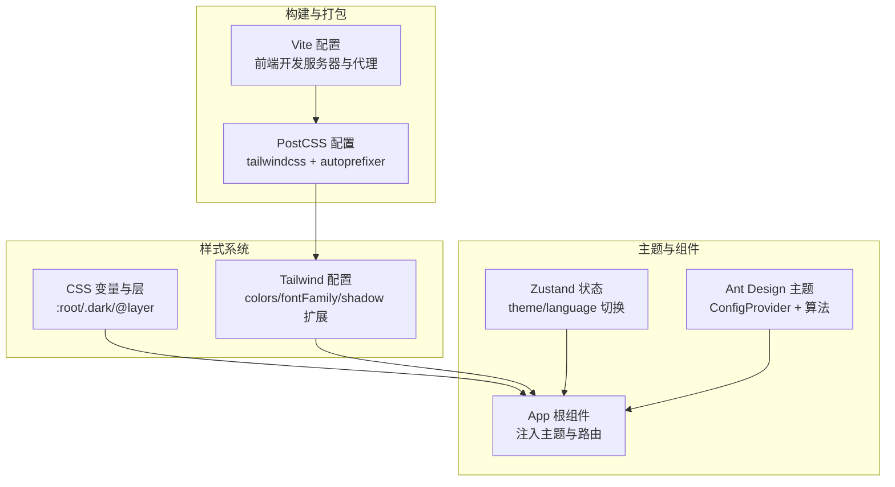
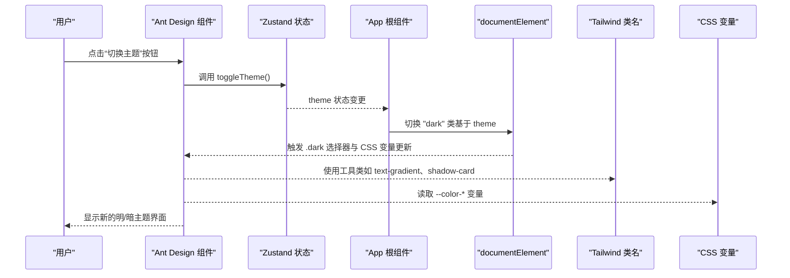
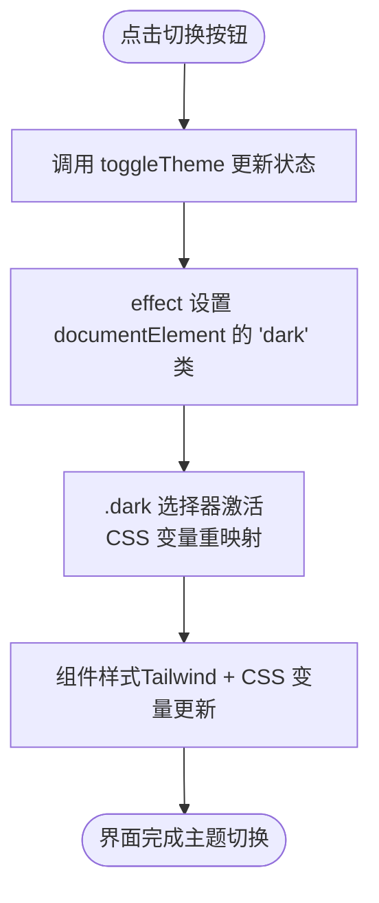
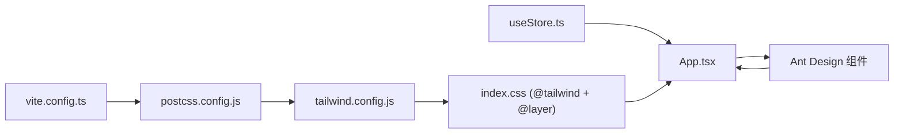

# 样式与主题

<cite>
**本文引用的文件**
- [tailwind.config.js](file://frontend/tailwind.config.js)
- [postcss.config.js](file://frontend/postcss.config.js)
- [index.css](file://frontend/src/index.css)
- [package.json](file://frontend/package.json)
- [vite.config.ts](file://frontend/vite.config.ts)
- [App.tsx](file://frontend/src/App.tsx)
- [useStore.ts](file://frontend/src/store/useStore.ts)
- [HomePage.tsx](file://frontend/src/pages/HomePage.tsx)
- [ParamPanel.tsx](file://frontend/src/components/ParamPanel.tsx)
- [LanguageSwitch.tsx](file://frontend/src/components/LanguageSwitch.tsx)
- [index.ts](file://frontend/src/types/index.ts)
</cite>

## 目录
1. [引言](#引言)
2. [项目结构](#项目结构)
3. [核心组件](#核心组件)
4. [架构总览](#架构总览)
5. [详细组件分析](#详细组件分析)
6. [依赖关系分析](#依赖关系分析)
7. [性能考量](#性能考量)
8. [故障排查指南](#故障排查指南)
9. [结论](#结论)
10. [附录](#附录)

## 引言
本文件面向DCF估值智能体的前端样式与主题系统，系统性阐述Tailwind CSS与Ant Design在本项目中的配置与集成方式，涵盖自定义主题变量、暗色模式切换、颜色与字体体系、CSS变量与层叠规则、样式覆盖策略、响应式断点与移动端适配、无障碍支持以及性能与可维护性最佳实践。读者无需深入源码即可理解整体架构与落地实现。

## 项目结构
前端采用Vite + React + TypeScript构建，样式系统由PostCSS驱动的Tailwind CSS生成原子化样式，Ant Design提供UI组件库与主题算法；全局样式通过CSS变量统一管理明暗主题状态与过渡动画；应用通过Zustand集中管理主题与语言状态，并在根组件中注入Ant Design主题配置。

图表来源
- [vite.config.ts:1-22](file://frontend/vite.config.ts#L1-L22)
- [postcss.config.js:1-7](file://frontend/postcss.config.js#L1-L7)
- [tailwind.config.js:1-40](file://frontend/tailwind.config.js#L1-L40)
- [index.css:1-137](file://frontend/src/index.css#L1-L137)
- [App.tsx:105-147](file://frontend/src/App.tsx#L105-L147)
- [useStore.ts:23-60](file://frontend/src/store/useStore.ts#L23-L60)

章节来源
- [package.json:1-37](file://frontend/package.json#L1-L37)
- [vite.config.ts:1-22](file://frontend/vite.config.ts#L1-L22)
- [postcss.config.js:1-7](file://frontend/postcss.config.js#L1-L7)
- [tailwind.config.js:1-40](file://frontend/tailwind.config.js#L1-L40)
- [index.css:1-137](file://frontend/src/index.css#L1-L137)

## 核心组件
- Tailwind CSS配置：扩展颜色、字体族、阴影等，启用基于类名的暗色模式。
- CSS变量与层：在:root与.dark下定义主题变量，使用@layer组织组件与工具类层，确保样式优先级与可维护性。
- Ant Design主题：通过ConfigProvider注入算法与token，实现明暗主题与品牌色的一致性。
- Zustand状态：集中管理theme与language，提供toggleTheme与setLanguage等动作。
- 根组件App：根据当前主题动态切换html元素的dark类，注入Ant Design主题配置。
- 页面与组件：在页面与卡片等组件中直接使用Tailwind工具类与CSS变量，形成一致的视觉风格。

章节来源
- [tailwind.config.js:5-37](file://frontend/tailwind.config.js#L5-L37)
- [index.css:5-137](file://frontend/src/index.css#L5-L137)
- [App.tsx:105-147](file://frontend/src/App.tsx#L105-L147)
- [useStore.ts:23-60](file://frontend/src/store/useStore.ts#L23-L60)

## 架构总览
样式与主题系统的关键交互流程如下：

图表来源
- [App.tsx:95-111](file://frontend/src/App.tsx#L95-L111)
- [useStore.ts:57-60](file://frontend/src/store/useStore.ts#L57-L60)
- [index.css:21-31](file://frontend/src/index.css#L21-L31)
- [index.css:127-136](file://frontend/src/index.css#L127-L136)
- [HomePage.tsx:31](file://frontend/src/pages/HomePage.tsx#L31)

## 详细组件分析

### Tailwind CSS 配置与使用
- 内容扫描范围：index.html与src目录下的TypeScript/TSX文件，确保按需生成类名。
- 暗色模式：启用基于类名的暗色模式，便于与Ant Design暗色算法协同。
- 主题扩展：
  - 颜色：定义primary、accent、finance三组语义化颜色，覆盖深浅不同层级。
  - 字体：sans与mono两套字体族，满足正文与代码场景。
  - 阴影：为卡片定义标准与悬停阴影，提升层次感。
- 插件：当前未启用额外插件，保持构建简洁。

章节来源
- [tailwind.config.js:3](file://frontend/tailwind.config.js#L3)
- [tailwind.config.js:4](file://frontend/tailwind.config.js#L4)
- [tailwind.config.js:5-37](file://frontend/tailwind.config.js#L5-L37)

### CSS 变量与层（:root/.dark/@layer）
- 全局变量：在:root中定义背景、卡片、文本、边框、主色、渐变与过渡时长等变量。
- 暗色映射：.dark类下重定义上述变量，实现一键主题切换。
- 层级组织：
  - components层：定义可复用的组件样式（如渐变背景、过渡、毛玻璃卡片、正负值颜色、指标卡片等）。
  - utilities层：定义可复用的工具样式（如文字渐变）。
- 过渡与滚动条：统一使用变量控制过渡时长；为暗色模式提供滚动条样式差异化。

章节来源
- [index.css:5-19](file://frontend/src/index.css#L5-L19)
- [index.css:21-31](file://frontend/src/index.css#L21-L31)
- [index.css:83-125](file://frontend/src/index.css#L83-L125)
- [index.css:127-136](file://frontend/src/index.css#L127-L136)

### Ant Design 主题集成
- 算法选择：根据当前主题选择默认或暗色算法，保证组件在不同模式下具备合适的对比度与层级。
- Token配置：设置主色、圆角半径与字体族，使组件风格与全局品牌一致。
- 根组件注入：在App中通过ConfigProvider注入主题配置，影响所有子树内的Ant Design组件。

章节来源
- [App.tsx:107-122](file://frontend/src/App.tsx#L107-L122)
- [App.tsx:114-123](file://frontend/src/App.tsx#L114-L123)

### 主题切换机制与样式优先级
- 切换触发：导航栏按钮点击后调用toggleTheme，更新Zustand状态。
- DOM同步：effect监听theme变化，向documentElement添加/移除“dark”类，从而激活CSS变量与类名选择器。
- 优先级策略：
  - Ant Design组件优先使用其内置算法与token，避免与全局样式冲突。
  - Tailwind类名与CSS变量在同一层级下工作，CSS变量优先于默认值生效。
  - @layer确保components与utilities的稳定叠加，避免意外覆盖。

图表来源
- [App.tsx:95-111](file://frontend/src/App.tsx#L95-L111)
- [useStore.ts:57-60](file://frontend/src/store/useStore.ts#L57-L60)
- [index.css:21-31](file://frontend/src/index.css#L21-L31)

### 响应式设计与移动端适配
- 断点与工具类：广泛使用sm、md等Tailwind断点前缀，配合flex、grid、gap等布局工具实现自适应。
- 字体缩放：首页标题使用clamp实现流式字体大小，兼顾小屏与大屏阅读体验。
- 移动端细节：导航栏在小屏下仍保持紧凑布局；卡片与按钮尺寸在小屏上保持可点击性与可读性。

章节来源
- [HomePage.tsx:35-78](file://frontend/src/pages/HomePage.tsx#L35-L78)
- [HomePage.tsx:82-104](file://frontend/src/pages/HomePage.tsx#L82-L104)
- [ParamPanel.tsx:186-207](file://frontend/src/components/ParamPanel.tsx#L186-L207)

### 样式覆盖与组件定制
- Ant Design覆盖：通过ConfigProvider的token与算法进行全局覆盖；局部可通过内联style补充特定视觉需求。
- Tailwind覆盖：在组件内部使用工具类组合，必要时通过@apply引入自定义@layer样式。
- CSS变量覆盖：通过在父容器或根节点调整变量值，实现局部主题覆盖。

章节来源
- [App.tsx:114-123](file://frontend/src/App.tsx#L114-L123)
- [index.css:83-125](file://frontend/src/index.css#L83-L125)

### 无障碍访问支持
- 对比度：暗色模式下文本与边框变量提升对比度，降低视觉疲劳。
- 字体平滑：开启Webkit与Firefox字体平滑渲染，提升可读性。
- 交互反馈：Hover态与过渡动画增强可感知性；按钮与卡片提供明确的悬停效果。

章节来源
- [index.css:40-43](file://frontend/src/index.css#L40-L43)
- [index.css:21-31](file://frontend/src/index.css#L21-L31)
- [HomePage.tsx:86-102](file://frontend/src/pages/HomePage.tsx#L86-L102)

## 依赖关系分析
- 构建链路：Vite加载React插件与路径别名；PostCSS加载tailwindcss与autoprefixer；Tailwind从配置中读取扩展项并生成类名。
- 运行时链路：App根据状态切换dark类；Ant Design根据算法与token渲染组件；CSS变量在:root与.dark间切换。

图表来源
- [vite.config.ts:1-22](file://frontend/vite.config.ts#L1-L22)
- [postcss.config.js:1-7](file://frontend/postcss.config.js#L1-L7)
- [tailwind.config.js:1-40](file://frontend/tailwind.config.js#L1-L40)
- [index.css:1-3](file://frontend/src/index.css#L1-L3)
- [useStore.ts:23-60](file://frontend/src/store/useStore.ts#L23-L60)
- [App.tsx:105-147](file://frontend/src/App.tsx#L105-L147)

章节来源
- [package.json:11-25](file://frontend/package.json#L11-L25)
- [vite.config.ts:1-22](file://frontend/vite.config.ts#L1-L22)
- [postcss.config.js:1-7](file://frontend/postcss.config.js#L1-L7)
- [tailwind.config.js:1-40](file://frontend/tailwind.config.js#L1-L40)
- [index.css:1-3](file://frontend/src/index.css#L1-L3)
- [useStore.ts:23-60](file://frontend/src/store/useStore.ts#L23-L60)
- [App.tsx:105-147](file://frontend/src/App.tsx#L105-L147)

## 性能考量
- 按需生成：Tailwind仅生成被扫描到的类名，减少初始包体积。
- 变量驱动：CSS变量集中管理主题，避免重复样式与多处硬编码。
- 组合优先：通过工具类组合实现样式，减少自定义样式的数量与复杂度。
- 动画与过渡：统一使用变量控制过渡时长，避免频繁重排与重绘。
- 代理与热更新：Vite开发服务器提供快速热更新与API代理，提升开发效率。

章节来源
- [tailwind.config.js:3](file://frontend/tailwind.config.js#L3)
- [index.css:18](file://frontend/src/index.css#L18)
- [vite.config.ts:12-20](file://frontend/vite.config.ts#L12-L20)

## 故障排查指南
- 暗色模式不生效
  - 检查App是否正确在documentElement上切换“dark”类。
  - 确认CSS变量在.dark下已重新定义。
- Ant Design主题未生效
  - 确认ConfigProvider包裹了根组件且传入了正确的算法与token。
  - 检查主题状态是否被正确更新。
- Tailwind类名无效
  - 确认类名存在于内容扫描范围内。
  - 检查@tailwind base/components/utilities是否正确引入。
- 字体显示异常
  - 检查字体族配置与网络可用性；确认CSS变量字体与配置一致。
- 国际化与主题切换
  - 语言切换与主题切换相互独立，分别通过i18n与Zustand状态管理。

章节来源
- [App.tsx:109-111](file://frontend/src/App.tsx#L109-L111)
- [index.css:21-31](file://frontend/src/index.css#L21-L31)
- [App.tsx:114-123](file://frontend/src/App.tsx#L114-L123)
- [tailwind.config.js:3](file://frontend/tailwind.config.js#L3)
- [LanguageSwitch.tsx:12-19](file://frontend/src/components/LanguageSwitch.tsx#L12-L19)

## 结论
本项目以Tailwind CSS与Ant Design为核心，结合CSS变量与@layer组织，实现了高一致性、低耦合的主题系统。通过Zustand集中管理主题与语言状态，并在根组件中注入Ant Design主题配置，确保明暗模式切换流畅、组件风格统一。响应式设计与无障碍支持贯穿页面与组件，兼顾可用性与可维护性。建议后续持续关注Tailwind按需生成与CSS变量覆盖策略，保持样式系统的轻量化与可演进性。

## 附录
- 关键类型与状态
  - 主题与语言类型：ThemeMode与Language。
  - 应用状态接口：AppState，包含主题、语言、参数、结果、加载与错误等字段与动作。

章节来源
- [index.ts:105-127](file://frontend/src/types/index.ts#L105-L127)