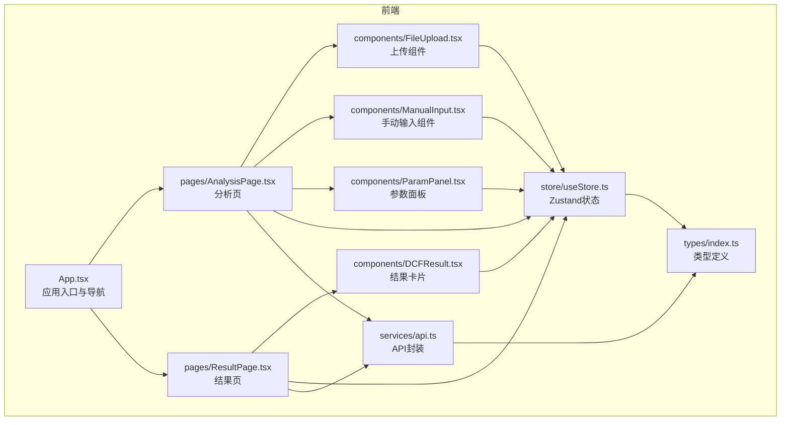
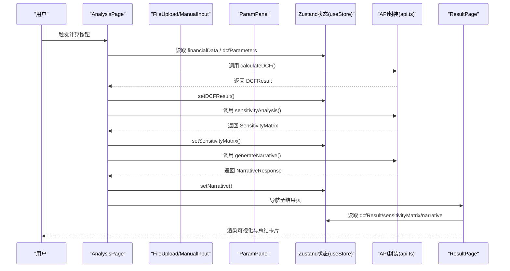
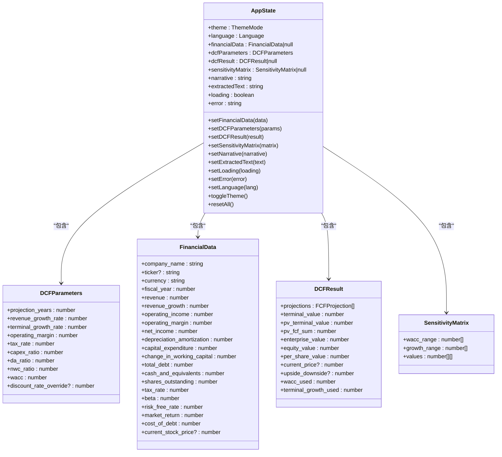
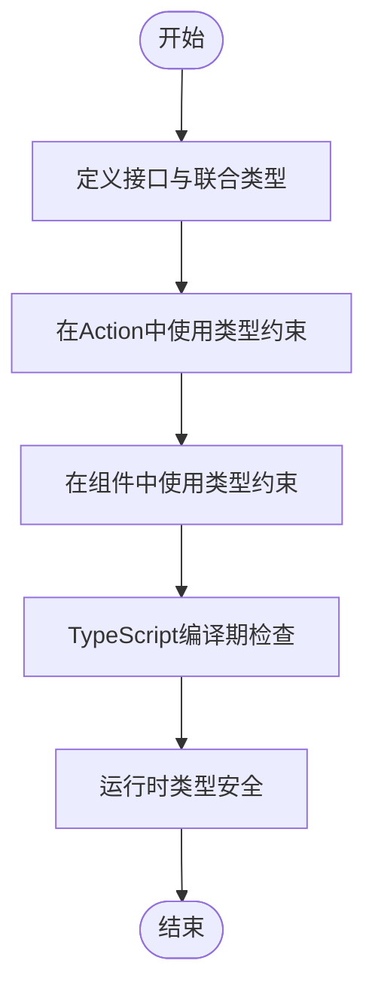
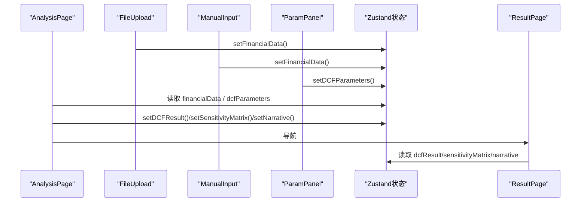
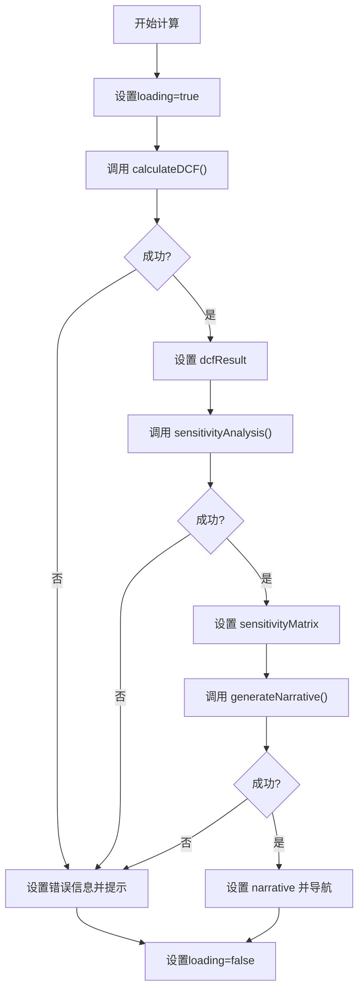
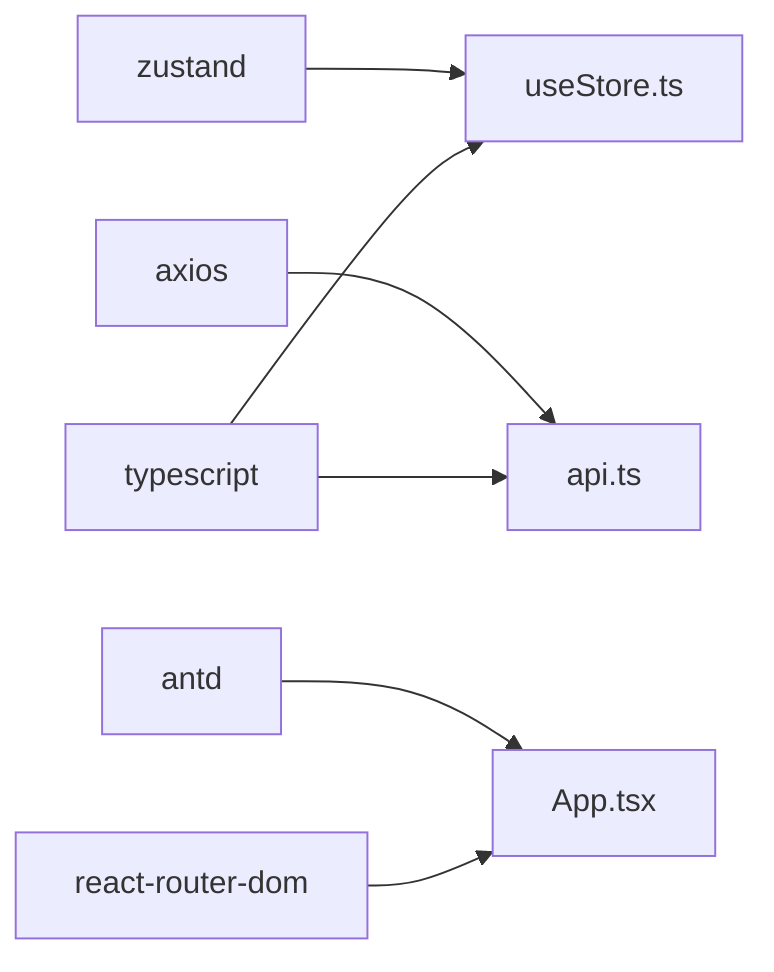

# 状态管理

<cite>
**本文引用的文件**
- [frontend/src/store/useStore.ts](file://frontend/src/store/useStore.ts)
- [frontend/src/types/index.ts](file://frontend/src/types/index.ts)
- [frontend/src/services/api.ts](file://frontend/src/services/api.ts)
- [frontend/src/App.tsx](file://frontend/src/App.tsx)
- [frontend/src/pages/AnalysisPage.tsx](file://frontend/src/pages/AnalysisPage.tsx)
- [frontend/src/pages/ResultPage.tsx](file://frontend/src/pages/ResultPage.tsx)
- [frontend/src/components/FileUpload.tsx](file://frontend/src/components/FileUpload.tsx)
- [frontend/src/components/ManualInput.tsx](file://frontend/src/components/ManualInput.tsx)
- [frontend/src/components/ParamPanel.tsx](file://frontend/src/components/ParamPanel.tsx)
- [frontend/src/components/DCFResult.tsx](file://frontend/src/components/DCFResult.tsx)
- [frontend/package.json](file://frontend/package.json)
- [frontend/tsconfig.json](file://frontend/tsconfig.json)
</cite>

## 目录
1. [简介](#简介)
2. [项目结构](#项目结构)
3. [核心组件](#核心组件)
4. [架构总览](#架构总览)
5. [详细组件分析](#详细组件分析)
6. [依赖分析](#依赖分析)
7. [性能考虑](#性能考虑)
8. [故障排查指南](#故障排查指南)
9. [结论](#结论)
10. [附录](#附录)

## 简介
本文件围绕DCF估值智能体的状态管理系统进行技术文档梳理，重点覆盖前端Zustand全局状态的设计与实现，包括状态结构定义、Action函数设计、状态更新机制、类型安全与编译期检查、组件间传递与订阅模式、性能优化策略、最佳实践以及与API服务和UI组件的集成模式与数据流控制。当前仓库未发现持久化存储（如localStorage/sessionStorage）的直接实现，因此本文不包含持久化策略的具体实现细节。

## 项目结构
前端采用React + TypeScript + Vite构建，状态管理基于Zustand；类型定义集中在统一的类型模块中；页面与组件按功能拆分，API调用通过Axios封装；国际化与主题切换由Ant Design与应用层逻辑共同完成。

图表来源
- [frontend/src/App.tsx:105-147](file://frontend/src/App.tsx#L105-L147)
- [frontend/src/pages/AnalysisPage.tsx:29-216](file://frontend/src/pages/AnalysisPage.tsx#L29-L216)
- [frontend/src/pages/ResultPage.tsx:35-215](file://frontend/src/pages/ResultPage.tsx#L35-L215)
- [frontend/src/components/FileUpload.tsx:12-158](file://frontend/src/components/FileUpload.tsx#L12-L158)
- [frontend/src/components/ManualInput.tsx:98-177](file://frontend/src/components/ManualInput.tsx#L98-L177)
- [frontend/src/components/ParamPanel.tsx:88-209](file://frontend/src/components/ParamPanel.tsx#L88-L209)
- [frontend/src/components/DCFResult.tsx:30-136](file://frontend/src/components/DCFResult.tsx#L30-L136)
- [frontend/src/store/useStore.ts:23-73](file://frontend/src/store/useStore.ts#L23-L73)
- [frontend/src/types/index.ts:105-127](file://frontend/src/types/index.ts#L105-L127)
- [frontend/src/services/api.ts:11-80](file://frontend/src/services/api.ts#L11-L80)

章节来源
- [frontend/src/App.tsx:105-147](file://frontend/src/App.tsx#L105-L147)
- [frontend/src/store/useStore.ts:23-73](file://frontend/src/store/useStore.ts#L23-L73)
- [frontend/src/types/index.ts:105-127](file://frontend/src/types/index.ts#L105-L127)
- [frontend/src/services/api.ts:11-80](file://frontend/src/services/api.ts#L11-L80)

## 核心组件
- Zustand状态容器：集中管理主题、语言、财务数据、DCF参数、DCF结果、敏感性矩阵、叙事文本、加载与错误状态，并提供对应的Action函数。
- 类型系统：通过TypeScript接口与联合类型确保状态结构与API请求/响应的数据一致性，支持编译期检查与IDE智能提示。
- 组件集成：页面与组件通过useStore订阅状态，使用Action更新状态，形成“视图-动作-状态”的单向数据流。
- API封装：以Axios为基础封装上传、提取、计算DCF、敏感性分析与叙事生成等接口，统一错误处理。

章节来源
- [frontend/src/store/useStore.ts:23-73](file://frontend/src/store/useStore.ts#L23-L73)
- [frontend/src/types/index.ts:105-127](file://frontend/src/types/index.ts#L105-L127)
- [frontend/src/services/api.ts:28-80](file://frontend/src/services/api.ts#L28-L80)

## 架构总览
下图展示了从用户交互到状态更新与UI渲染的整体流程，以及与后端API的调用关系。

图表来源
- [frontend/src/pages/AnalysisPage.tsx:58-99](file://frontend/src/pages/AnalysisPage.tsx#L58-L99)
- [frontend/src/services/api.ts:51-80](file://frontend/src/services/api.ts#L51-L80)
- [frontend/src/pages/ResultPage.tsx:35-215](file://frontend/src/pages/ResultPage.tsx#L35-L215)
- [frontend/src/store/useStore.ts:35-53](file://frontend/src/store/useStore.ts#L35-L53)

## 详细组件分析

### Zustand全局状态设计与实现
- 状态结构：AppState接口定义了主题、语言、财务数据、DCF参数、DCF结果、敏感性矩阵、叙事文本、提取文本、加载与错误等字段，并内嵌Action签名，保证类型安全。
- 默认参数：DCF参数提供默认值，便于快速开始与重置。
- Action函数：
  - setFinancialData/setDCFResult/setSensitivityMatrix/setNarrative/setExtractedText/setLoading/setError：直接赋值式更新。
  - setDCFParameters：使用部分参数合并，避免全量替换。
  - setLanguage/toggleTheme/resetAll：语言切换与主题切换、全量重置。
- 更新机制：所有更新均通过set触发，支持函数式更新以读取最新state，确保并发更新的一致性。

图表来源
- [frontend/src/types/index.ts:105-127](file://frontend/src/types/index.ts#L105-L127)
- [frontend/src/types/index.ts:28-39](file://frontend/src/types/index.ts#L28-L39)
- [frontend/src/types/index.ts:4-26](file://frontend/src/types/index.ts#L4-L26)
- [frontend/src/types/index.ts:54-66](file://frontend/src/types/index.ts#L54-L66)
- [frontend/src/types/index.ts:74-78](file://frontend/src/types/index.ts#L74-L78)

章节来源
- [frontend/src/store/useStore.ts:23-73](file://frontend/src/store/useStore.ts#L23-L73)
- [frontend/src/types/index.ts:105-127](file://frontend/src/types/index.ts#L105-L127)

### 类型安全与编译时检查
- 接口与联合类型：ThemeMode/Language/FinancialData/DCFParameters/DCFResult/SensitivityMatrix等接口定义清晰，确保状态与API请求/响应一致。
- 泛型与Partial：setDCFParameters使用Partial以允许部分字段更新，减少冗余赋值。
- 编译配置：严格模式开启，未使用但报错、未使用参数、switch穷举等规则启用，提升类型安全性。

图表来源
- [frontend/src/types/index.ts:105-127](file://frontend/src/types/index.ts#L105-L127)
- [frontend/tsconfig.json:14-17](file://frontend/tsconfig.json#L14-L17)

章节来源
- [frontend/src/types/index.ts:105-127](file://frontend/src/types/index.ts#L105-L127)
- [frontend/tsconfig.json:14-17](file://frontend/tsconfig.json#L14-L17)

### 状态在组件间的传递与订阅
- 订阅方式：各页面与组件通过useStore读取状态，支持选择器订阅以减少无关重渲染。
- 传递路径：AnalysisPage与ResultPage分别读取与写入状态；FileUpload与ManualInput负责编辑财务数据；ParamPanel负责编辑DCF参数；DCFResult组件可从store或props读取结果。
- 导航联动：App.tsx根据主题切换动态设置根节点样式，菜单与语言切换通过状态驱动。

图表来源
- [frontend/src/pages/AnalysisPage.tsx:29-216](file://frontend/src/pages/AnalysisPage.tsx#L29-L216)
- [frontend/src/components/FileUpload.tsx:12-158](file://frontend/src/components/FileUpload.tsx#L12-L158)
- [frontend/src/components/ManualInput.tsx:98-177](file://frontend/src/components/ManualInput.tsx#L98-L177)
- [frontend/src/components/ParamPanel.tsx:88-209](file://frontend/src/components/ParamPanel.tsx#L88-L209)
- [frontend/src/pages/ResultPage.tsx:35-215](file://frontend/src/pages/ResultPage.tsx#L35-L215)
- [frontend/src/App.tsx:21-103](file://frontend/src/App.tsx#L21-L103)

章节来源
- [frontend/src/pages/AnalysisPage.tsx:29-216](file://frontend/src/pages/AnalysisPage.tsx#L29-L216)
- [frontend/src/components/FileUpload.tsx:12-158](file://frontend/src/components/FileUpload.tsx#L12-L158)
- [frontend/src/components/ManualInput.tsx:98-177](file://frontend/src/components/ManualInput.tsx#L98-L177)
- [frontend/src/components/ParamPanel.tsx:88-209](file://frontend/src/components/ParamPanel.tsx#L88-L209)
- [frontend/src/pages/ResultPage.tsx:35-215](file://frontend/src/pages/ResultPage.tsx#L35-L215)
- [frontend/src/App.tsx:21-103](file://frontend/src/App.tsx#L21-L103)

### 数据持久化策略
- 当前仓库未发现本地持久化实现（如localStorage/sessionStorage）。若需持久化，建议在应用启动时从持久化存储读取初始状态，在关键状态变更时写回，同时注意序列化/反序列化与版本兼容。

（本节为概念性说明，不直接分析具体文件）

### 异步操作管理与错误处理
- API封装：统一基地址、超时与请求头；错误处理集中于handleError，优先解析后端返回的detail信息，兜底为错误消息或网络错误。
- 页面流程：AnalysisPage在计算过程中设置loading与步骤提示，捕获异常并设置错误信息与消息提示，最终统一清理loading状态。
- 组件协作：FileUpload与ManualInput在上传/保存时同步更新状态并反馈消息。

图表来源
- [frontend/src/pages/AnalysisPage.tsx:58-99](file://frontend/src/pages/AnalysisPage.tsx#L58-L99)
- [frontend/src/services/api.ts:17-26](file://frontend/src/services/api.ts#L17-L26)

章节来源
- [frontend/src/pages/AnalysisPage.tsx:58-99](file://frontend/src/pages/AnalysisPage.tsx#L58-L99)
- [frontend/src/services/api.ts:17-26](file://frontend/src/services/api.ts#L17-L26)

### 性能优化策略
- 选择器订阅：ResultPage中的DCFResult组件使用选择器读取状态，避免因全局状态变化导致的非必要重渲染。
- useMemo预览：ParamPanel基于财务数据计算WACC预览，利用memo化减少重复计算。
- 按需渲染：AnalysisPage在计算过程中使用Spin与步骤提示，避免无意义的UI闪烁。
- 组件拆分：将大组件拆分为独立模块，按需引入，降低首屏压力。

章节来源
- [frontend/src/components/DCFResult.tsx:30-36](file://frontend/src/components/DCFResult.tsx#L30-L36)
- [frontend/src/components/ParamPanel.tsx:92-98](file://frontend/src/components/ParamPanel.tsx#L92-L98)
- [frontend/src/pages/AnalysisPage.tsx:154-155](file://frontend/src/pages/AnalysisPage.tsx#L154-L155)

### 最佳实践
- 状态分割：将UI状态与业务状态分离，避免将组件内部状态混入全局状态。
- 副作用隔离：将网络请求与副作用集中在页面或服务模块，保持Action简洁。
- 类型驱动：以类型定义先行，确保Action与组件调用的参数与返回值一致。
- 可测试性：将纯计算逻辑（如WACC预览）抽离为可测试函数，便于单元测试。
- 国际化与主题：通过状态驱动UI主题与语言切换，保持一致性。

（本节为通用指导，不直接分析具体文件）

## 依赖分析
- Zustand：全局状态容器，提供轻量级状态管理能力。
- Axios：HTTP客户端，封装后端API。
- Ant Design：UI库，提供主题、布局与组件。
- React Router：路由导航，配合状态驱动页面跳转。
- TypeScript：类型系统保障，严格配置提升质量。

图表来源
- [frontend/package.json:11-24](file://frontend/package.json#L11-L24)
- [frontend/src/store/useStore.ts:1](file://frontend/src/store/useStore.ts#L1)
- [frontend/src/services/api.ts:1](file://frontend/src/services/api.ts#L1)
- [frontend/src/App.tsx:3-12](file://frontend/src/App.tsx#L3-L12)

章节来源
- [frontend/package.json:11-24](file://frontend/package.json#L11-L24)
- [frontend/src/store/useStore.ts:1](file://frontend/src/store/useStore.ts#L1)
- [frontend/src/services/api.ts:1](file://frontend/src/services/api.ts#L1)
- [frontend/src/App.tsx:3-12](file://frontend/src/App.tsx#L3-L12)

## 性能考虑
- 使用选择器订阅：仅订阅所需字段，减少重渲染范围。
- 合理拆分组件：避免单个组件承担过多职责。
- 避免不必要的全局刷新：通过局部状态与选择器订阅结合使用。
- 图表与复杂渲染：在ResultPage中对图表组件进行懒加载与条件渲染，降低首屏负担。

（本节为通用指导，不直接分析具体文件）

## 故障排查指南
- 网络错误：API封装统一处理AxiosError，优先显示后端返回的detail，其次为message，最后兜底为“网络错误”。页面在异常时设置错误状态并提示。
- 参数校验：ManualInput与ParamPanel对数值范围与必填项进行限制，避免非法输入进入状态。
- 状态一致性：使用函数式set确保并发更新时读取最新state，避免竞态条件。

章节来源
- [frontend/src/services/api.ts:17-26](file://frontend/src/services/api.ts#L17-L26)
- [frontend/src/components/ManualInput.tsx:146-150](file://frontend/src/components/ManualInput.tsx#L146-L150)
- [frontend/src/components/ParamPanel.tsx:100-102](file://frontend/src/components/ParamPanel.tsx#L100-L102)
- [frontend/src/store/useStore.ts:57-60](file://frontend/src/store/useStore.ts#L57-L60)

## 结论
本状态管理系统以Zustand为核心，结合严格的TypeScript类型定义与Axios封装，实现了从数据采集、参数编辑、DCF计算、敏感性分析到叙事生成与结果可视化的完整闭环。通过选择器订阅、组件拆分与错误处理机制，系统在可维护性与性能之间取得平衡。未来可在现有基础上补充持久化策略与更完善的调试工具链，进一步提升用户体验与开发效率。

## 附录
- 关键文件索引
  - 状态定义与Action：[frontend/src/store/useStore.ts:23-73](file://frontend/src/store/useStore.ts#L23-L73)
  - 类型定义：[frontend/src/types/index.ts:105-127](file://frontend/src/types/index.ts#L105-L127)
  - API封装：[frontend/src/services/api.ts:11-80](file://frontend/src/services/api.ts#L11-L80)
  - 应用入口与导航：[frontend/src/App.tsx:105-147](file://frontend/src/App.tsx#L105-L147)
  - 分析页流程：[frontend/src/pages/AnalysisPage.tsx:58-99](file://frontend/src/pages/AnalysisPage.tsx#L58-L99)
  - 结果页渲染：[frontend/src/pages/ResultPage.tsx:35-215](file://frontend/src/pages/ResultPage.tsx#L35-L215)
  - 上传组件：[frontend/src/components/FileUpload.tsx:12-158](file://frontend/src/components/FileUpload.tsx#L12-L158)
  - 手动输入组件：[frontend/src/components/ManualInput.tsx:98-177](file://frontend/src/components/ManualInput.tsx#L98-L177)
  - 参数面板：[frontend/src/components/ParamPanel.tsx:88-209](file://frontend/src/components/ParamPanel.tsx#L88-L209)
  - 结果卡片组件：[frontend/src/components/DCFResult.tsx:30-136](file://frontend/src/components/DCFResult.tsx#L30-L136)
  - 依赖与脚手架：[frontend/package.json:11-24](file://frontend/package.json#L11-L24)
  - 编译配置：[frontend/tsconfig.json:14-17](file://frontend/tsconfig.json#L14-L17)