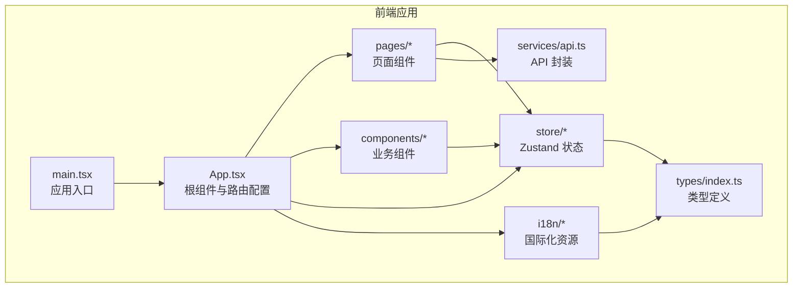
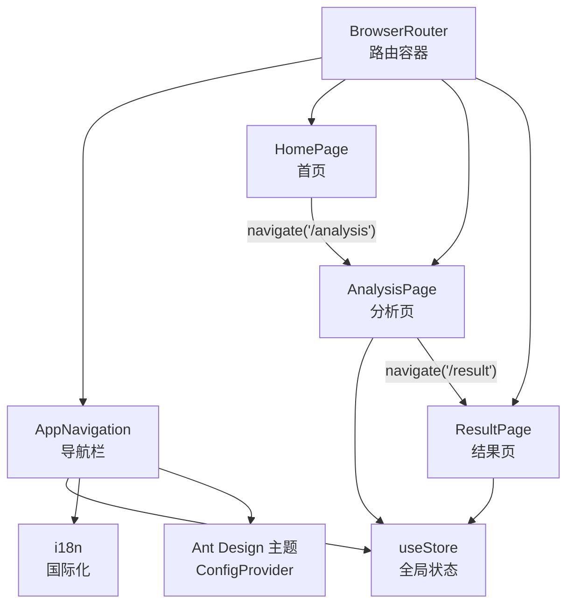
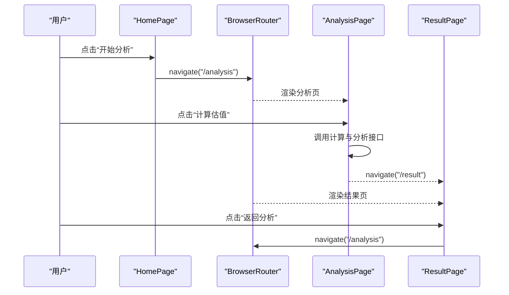
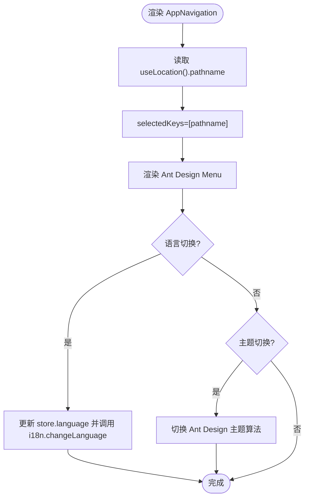
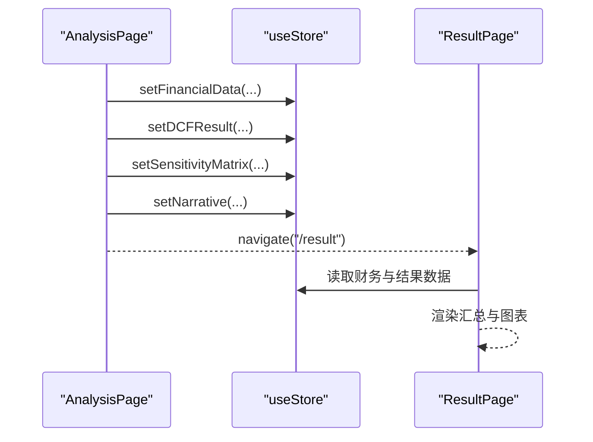
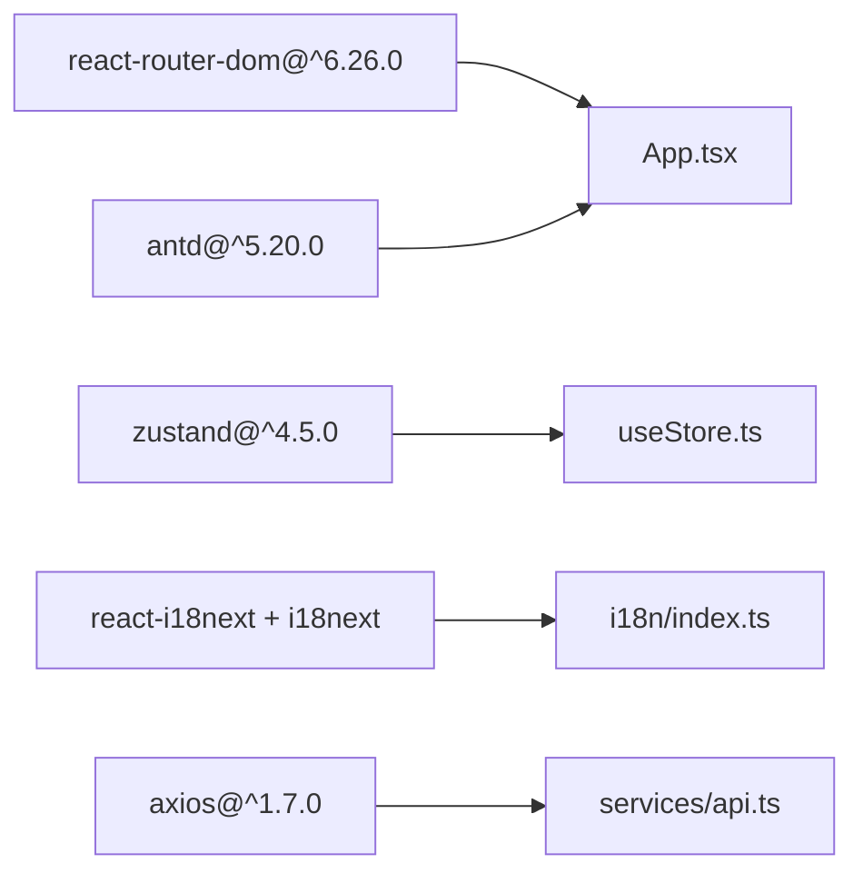

# 路由导航

<cite>
**本文引用的文件**
- [frontend/src/App.tsx](file://frontend/src/App.tsx)
- [frontend/src/main.tsx](file://frontend/src/main.tsx)
- [frontend/src/pages/HomePage.tsx](file://frontend/src/pages/HomePage.tsx)
- [frontend/src/pages/AnalysisPage.tsx](file://frontend/src/pages/AnalysisPage.tsx)
- [frontend/src/pages/ResultPage.tsx](file://frontend/src/pages/ResultPage.tsx)
- [frontend/src/store/useStore.ts](file://frontend/src/store/useStore.ts)
- [frontend/src/i18n/index.ts](file://frontend/src/i18n/index.ts)
- [frontend/src/i18n/en.json](file://frontend/src/i18n/en.json)
- [frontend/src/i18n/zh.json](file://frontend/src/i18n/zh.json)
- [frontend/src/services/api.ts](file://frontend/src/services/api.ts)
- [frontend/src/components/ParamPanel.tsx](file://frontend/src/components/ParamPanel.tsx)
- [frontend/package.json](file://frontend/package.json)
- [frontend/vite.config.ts](file://frontend/vite.config.ts)
- [frontend/src/types/index.ts](file://frontend/src/types/index.ts)
</cite>

## 目录
1. [简介](#简介)
2. [项目结构](#项目结构)
3. [核心组件](#核心组件)
4. [架构总览](#架构总览)
5. [详细组件分析](#详细组件分析)
6. [依赖关系分析](#依赖关系分析)
7. [性能考量](#性能考量)
8. [故障排查指南](#故障排查指南)
9. [结论](#结论)
10. [附录](#附录)

## 简介
本文件围绕 DCF 估值智能体的前端路由导航系统进行系统化文档化，重点覆盖以下方面：
- React Router 的配置与实现：路由定义、嵌套路由、动态路由与路由守卫机制
- 导航栏 AppNavigation 的设计与实现：菜单项配置、活动状态管理、响应式布局与主题适配
- 页面间导航逻辑、路由参数传递、查询字符串处理与历史记录管理
- 导航组件的国际化支持、权限控制与用户体验优化策略
- 路由与状态管理的集成方式、导航动画效果与 SEO 优化考虑

## 项目结构
前端采用 Vite + React + TypeScript 构建，使用 Ant Design 作为 UI 基础库，Zustand 进行全局状态管理，i18n 实现国际化，Axios 封装 API 请求。

图表来源
- [frontend/src/main.tsx:1-12](file://frontend/src/main.tsx#L1-L12)
- [frontend/src/App.tsx:105-147](file://frontend/src/App.tsx#L105-L147)
- [frontend/src/pages/HomePage.tsx:1-117](file://frontend/src/pages/HomePage.tsx#L1-L117)
- [frontend/src/pages/AnalysisPage.tsx:1-217](file://frontend/src/pages/AnalysisPage.tsx#L1-L217)
- [frontend/src/pages/ResultPage.tsx:1-216](file://frontend/src/pages/ResultPage.tsx#L1-L216)
- [frontend/src/store/useStore.ts:1-74](file://frontend/src/store/useStore.ts#L1-L74)
- [frontend/src/i18n/index.ts:1-27](file://frontend/src/i18n/index.ts#L1-L27)
- [frontend/src/services/api.ts:1-81](file://frontend/src/services/api.ts#L1-L81)
- [frontend/src/types/index.ts:1-128](file://frontend/src/types/index.ts#L1-L128)

章节来源
- [frontend/src/main.tsx:1-12](file://frontend/src/main.tsx#L1-L12)
- [frontend/src/App.tsx:105-147](file://frontend/src/App.tsx#L105-L147)
- [frontend/package.json:1-37](file://frontend/package.json#L1-L37)
- [frontend/vite.config.ts:1-22](file://frontend/vite.config.ts#L1-L22)

## 核心组件
- 根组件与路由配置：在根组件中配置 BrowserRouter、Ant Design 主题与国际化 Provider，并在 Routes 中声明三类静态路由（首页、分析页、结果页）。
- 导航栏 AppNavigation：负责顶部导航菜单、语言切换、主题切换与响应式布局。
- 页面组件：HomePage、AnalysisPage、ResultPage 分别承担引导、分析与结果展示职责；AnalysisPage 内部包含标签页与参数面板等子组件。
- 状态管理：useStore 提供主题、语言、财务数据、DCF 参数、结果、敏感性矩阵、叙事文本、加载与错误状态的集中管理。
- 国际化：i18n 初始化与资源文件，支持中文与英文；语言切换通过 Dropdown 触发并更新 i18n 实例。
- API 封装：以 Axios 创建带基础路径的客户端，统一错误处理，暴露上传、提取、计算、敏感性分析与叙事生成等方法。

章节来源
- [frontend/src/App.tsx:21-103](file://frontend/src/App.tsx#L21-L103)
- [frontend/src/App.tsx:124-133](file://frontend/src/App.tsx#L124-L133)
- [frontend/src/store/useStore.ts:23-73](file://frontend/src/store/useStore.ts#L23-L73)
- [frontend/src/i18n/index.ts:7-24](file://frontend/src/i18n/index.ts#L7-L24)
- [frontend/src/services/api.ts:11-26](file://frontend/src/services/api.ts#L11-L26)

## 架构总览
下图展示了路由、导航栏、页面与状态管理之间的交互关系：

图表来源
- [frontend/src/App.tsx:124-133](file://frontend/src/App.tsx#L124-L133)
- [frontend/src/App.tsx:21-103](file://frontend/src/App.tsx#L21-L103)
- [frontend/src/pages/HomePage.tsx:23-78](file://frontend/src/pages/HomePage.tsx#L23-L78)
- [frontend/src/pages/AnalysisPage.tsx:58-99](file://frontend/src/pages/AnalysisPage.tsx#L58-L99)
- [frontend/src/store/useStore.ts:23-73](file://frontend/src/store/useStore.ts#L23-L73)
- [frontend/src/i18n/index.ts:7-24](file://frontend/src/i18n/index.ts#L7-L24)

## 详细组件分析

### 路由配置与导航流程
- 路由定义：在根组件内声明三条静态路由，分别指向首页、分析页与结果页。
- 导航触发：首页按钮与各页面中的返回/下一步按钮通过 useNavigate 进行编程式导航。
- 活动状态：导航菜单通过 selectedKeys 与 useLocation 的 pathname 同步，实现活动状态管理。
- 守卫机制：结果页通过 useEffect 在无结果时重定向至分析页，形成简单路由守卫。

图表来源
- [frontend/src/pages/HomePage.tsx:66-78](file://frontend/src/pages/HomePage.tsx#L66-L78)
- [frontend/src/pages/AnalysisPage.tsx:58-99](file://frontend/src/pages/AnalysisPage.tsx#L58-L99)
- [frontend/src/pages/ResultPage.tsx:110-121](file://frontend/src/pages/ResultPage.tsx#L110-L121)
- [frontend/src/App.tsx:124-133](file://frontend/src/App.tsx#L124-L133)

章节来源
- [frontend/src/App.tsx:124-133](file://frontend/src/App.tsx#L124-L133)
- [frontend/src/pages/HomePage.tsx:23-78](file://frontend/src/pages/HomePage.tsx#L23-L78)
- [frontend/src/pages/AnalysisPage.tsx:29-99](file://frontend/src/pages/AnalysisPage.tsx#L29-L99)
- [frontend/src/pages/ResultPage.tsx:35-42](file://frontend/src/pages/ResultPage.tsx#L35-L42)

### 导航栏 AppNavigation 设计与实现
- 菜单项配置：通过 menuItems 数组定义首页、分析、结果三个菜单项，使用 Ant Design Menu 组件渲染。
- 活动状态管理：selectedKeys 与 useLocation().pathname 同步，确保当前路由高亮。
- 响应式布局：使用 TailwindCSS 类实现移动端与桌面端的布局差异。
- 主题适配：根据 useStore 中的主题状态动态切换 Ant Design 主题算法与样式变量。
- 国际化与语言切换：Dropdown 切换语言并调用 i18n.changeLanguage 更新界面文案。

图表来源
- [frontend/src/App.tsx:21-103](file://frontend/src/App.tsx#L21-L103)
- [frontend/src/i18n/index.ts:7-24](file://frontend/src/i18n/index.ts#L7-L24)
- [frontend/src/store/useStore.ts:55-60](file://frontend/src/store/useStore.ts#L55-L60)

章节来源
- [frontend/src/App.tsx:21-103](file://frontend/src/App.tsx#L21-L103)
- [frontend/src/i18n/index.ts:7-24](file://frontend/src/i18n/index.ts#L7-L24)
- [frontend/src/store/useStore.ts:23-73](file://frontend/src/store/useStore.ts#L23-L73)

### 页面间导航逻辑与状态管理集成
- 分析页到结果页：分析页在完成 DCF 计算、敏感性分析与叙事生成后，将结果写入 Zustand，并跳转至结果页。
- 结果页回退：若无结果数据，结果页 useEffect 将强制重定向至分析页，避免空渲染。
- 参数面板联动：参数面板根据财务数据实时预估 WACC，提升用户体验。

图表来源
- [frontend/src/pages/AnalysisPage.tsx:58-99](file://frontend/src/pages/AnalysisPage.tsx#L58-L99)
- [frontend/src/pages/ResultPage.tsx:35-42](file://frontend/src/pages/ResultPage.tsx#L35-L42)
- [frontend/src/components/ParamPanel.tsx:88-209](file://frontend/src/components/ParamPanel.tsx#L88-L209)

章节来源
- [frontend/src/pages/AnalysisPage.tsx:29-99](file://frontend/src/pages/AnalysisPage.tsx#L29-L99)
- [frontend/src/pages/ResultPage.tsx:35-42](file://frontend/src/pages/ResultPage.tsx#L35-L42)
- [frontend/src/components/ParamPanel.tsx:88-209](file://frontend/src/components/ParamPanel.tsx#L88-L209)

### 动态路由与查询字符串处理
- 当前实现：项目未使用动态路由参数与查询字符串处理逻辑。
- 建议扩展：如需支持分享链接、参数回填或跨页面携带参数，可在现有路由基础上引入 useParams、useSearchParams，并在状态管理中同步参数状态。

[本节为概念性说明，不直接分析具体文件，故无章节来源]

### 权限控制与用户体验优化
- 权限控制：当前路由未实现登录态校验或角色权限判断，可结合路由守卫在进入受保护路由前检查认证状态。
- 用户体验：导航栏响应式布局、主题切换即时生效、语言切换即刻更新文案；分析页提供加载提示与步骤提示，增强可感知性。

[本节为概念性说明，不直接分析具体文件，故无章节来源]

### 国际化支持与 SEO 考虑
- 国际化：i18n 使用浏览器语言探测器与本地存储缓存，支持中文与英文；导航栏语言切换通过 Dropdown 触发。
- SEO：当前未见专门的 SEO 优化实现（如 meta 标签、结构化数据）。可在页面组件中按需添加标题与描述，或在构建阶段注入默认 meta。

章节来源
- [frontend/src/i18n/index.ts:7-24](file://frontend/src/i18n/index.ts#L7-L24)
- [frontend/src/i18n/en.json:1-163](file://frontend/src/i18n/en.json#L1-L163)
- [frontend/src/i18n/zh.json:1-163](file://frontend/src/i18n/zh.json#L1-L163)

## 依赖关系分析
- React Router：版本 ^6.26.0，提供路由容器、路由声明与编程式导航能力。
- Ant Design：版本 ^5.20.0，提供导航、菜单、按钮、下拉、主题与布局组件。
- Zustand：版本 ^4.5.0，提供轻量级全局状态管理。
- i18n 生态：react-i18next 与 i18next 及浏览器语言探测器，提供多语言支持。
- Axios：版本 ^1.7.0，封装后端 API 接口。

图表来源
- [frontend/package.json:11-25](file://frontend/package.json#L11-L25)
- [frontend/src/App.tsx:105-147](file://frontend/src/App.tsx#L105-L147)
- [frontend/src/store/useStore.ts:1-10](file://frontend/src/store/useStore.ts#L1-L10)
- [frontend/src/i18n/index.ts:1-6](file://frontend/src/i18n/index.ts#L1-L6)
- [frontend/src/services/api.ts:1-10](file://frontend/src/services/api.ts#L1-L10)

章节来源
- [frontend/package.json:11-25](file://frontend/package.json#L11-L25)

## 性能考量
- 路由切换：当前为静态路由，切换开销低；如引入懒加载组件，可进一步减少首屏体积。
- 状态管理：Zustand 无样板代码，状态粒度合理；建议避免在路由层频繁写入大型对象，保持状态最小化。
- 图表与计算：分析页涉及大量数值计算与图表渲染，建议在计算密集场景使用防抖与分步渲染，避免阻塞主线程。
- 国际化：语言切换即时生效，建议缓存翻译资源，减少重复请求。

[本节为通用指导，不直接分析具体文件，故无章节来源]

## 故障排查指南
- 路由无法跳转
  - 检查 BrowserRouter 是否包裹根组件
  - 确认 navigate 调用位置是否在路由上下文中
- 结果页空白
  - 确认分析页已正确写入 DCF 结果与敏感性矩阵
  - 检查结果页 useEffect 的重定向逻辑
- 语言切换无效
  - 确认 i18n 初始化与 changeLanguage 调用
  - 检查 Dropdown 的 onClick 事件绑定
- 主题切换异常
  - 确认 ConfigProvider 的主题算法与根元素类名切换逻辑

章节来源
- [frontend/src/App.tsx:124-133](file://frontend/src/App.tsx#L124-L133)
- [frontend/src/pages/ResultPage.tsx:35-42](file://frontend/src/pages/ResultPage.tsx#L35-L42)
- [frontend/src/i18n/index.ts:7-24](file://frontend/src/i18n/index.ts#L7-L24)
- [frontend/src/store/useStore.ts:55-60](file://frontend/src/store/useStore.ts#L55-L60)

## 结论
本路由导航系统以简洁清晰的方式实现了首页、分析与结果三页的静态路由与导航。通过 Zustand 集成状态管理，AppNavigation 提供了响应式布局与主题/语言切换能力。当前未实现动态路由与复杂守卫，但具备良好的扩展性。建议后续引入动态路由、查询参数处理、权限守卫与 SEO 优化，以满足更复杂的业务需求。

## 附录
- 类型定义：涵盖财务数据、DCF 参数、结果、敏感性矩阵与应用状态等核心类型，确保路由与页面间的数据一致性。
- 构建与代理：Vite 配置提供开发服务器与后端代理，便于前后端联调。

章节来源
- [frontend/src/types/index.ts:105-128](file://frontend/src/types/index.ts#L105-L128)
- [frontend/vite.config.ts:12-21](file://frontend/vite.config.ts#L12-L21)