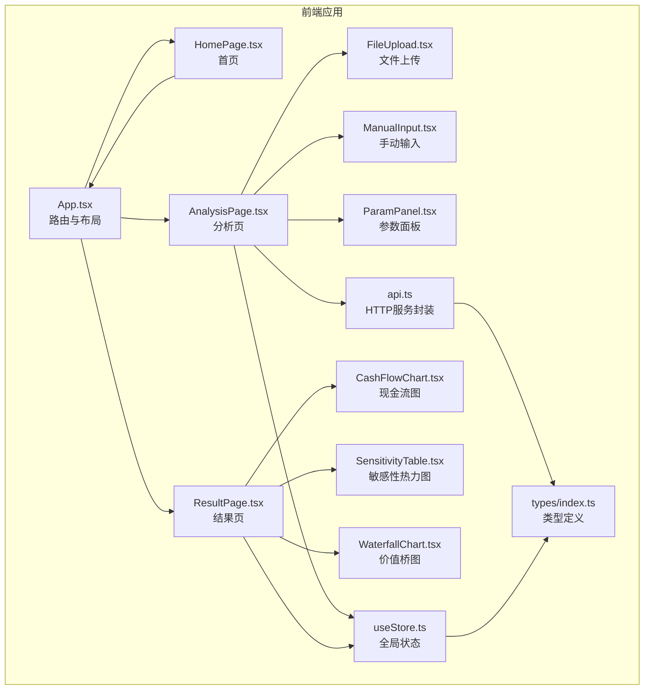
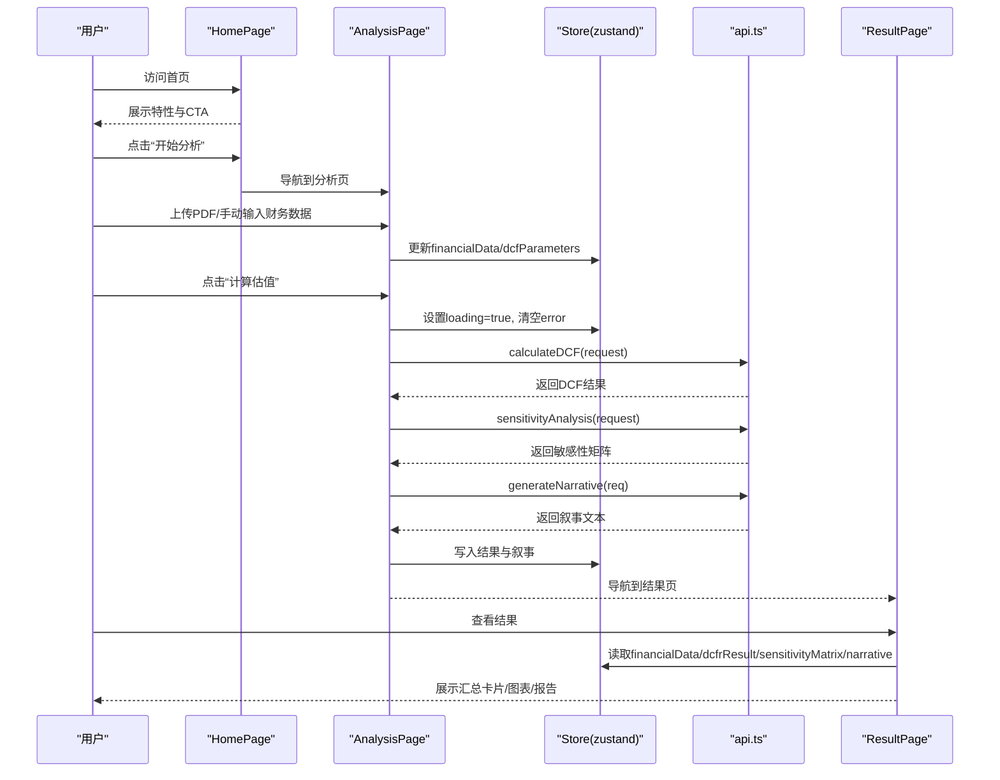
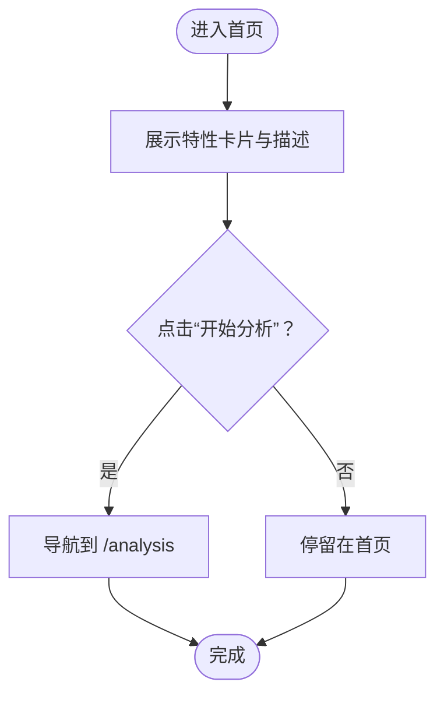
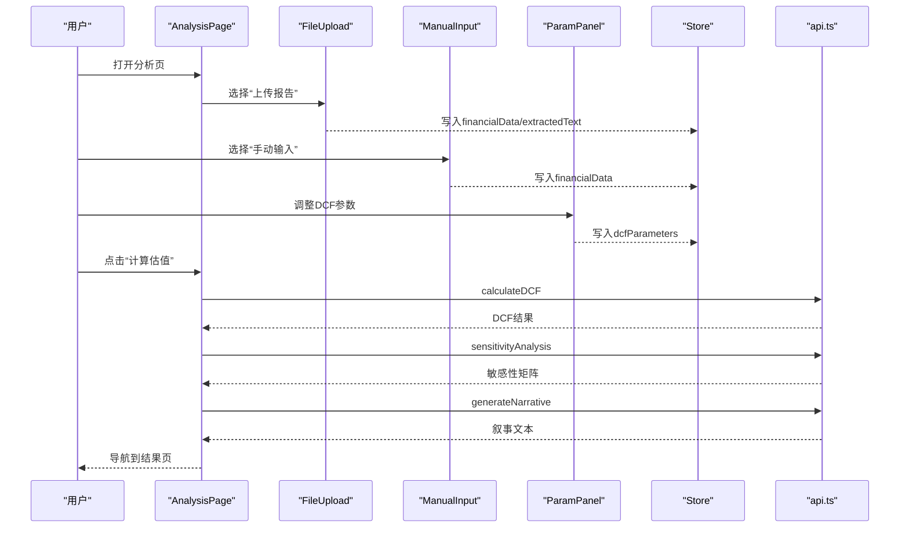
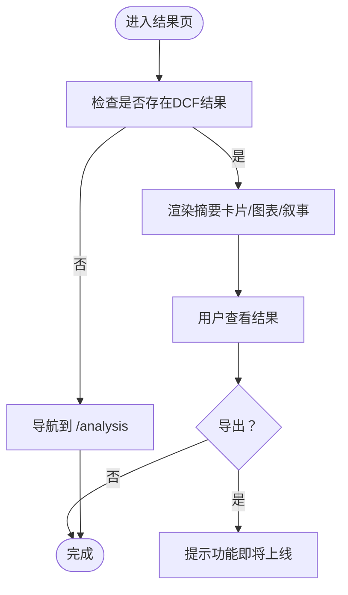
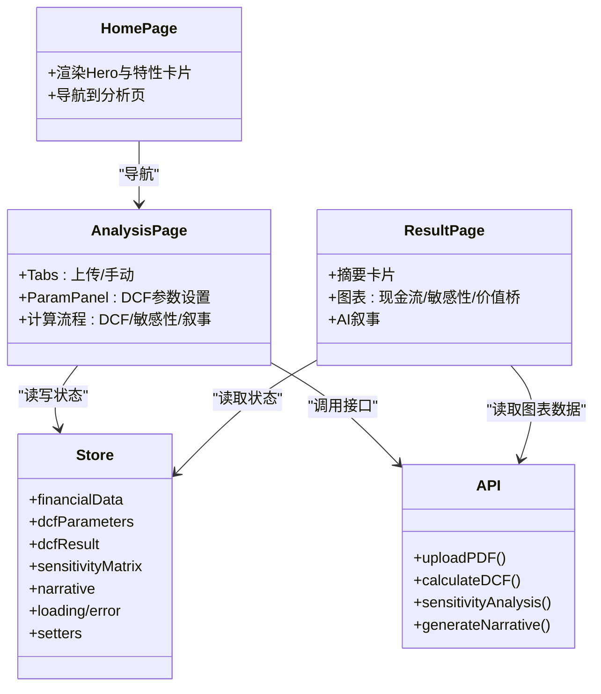
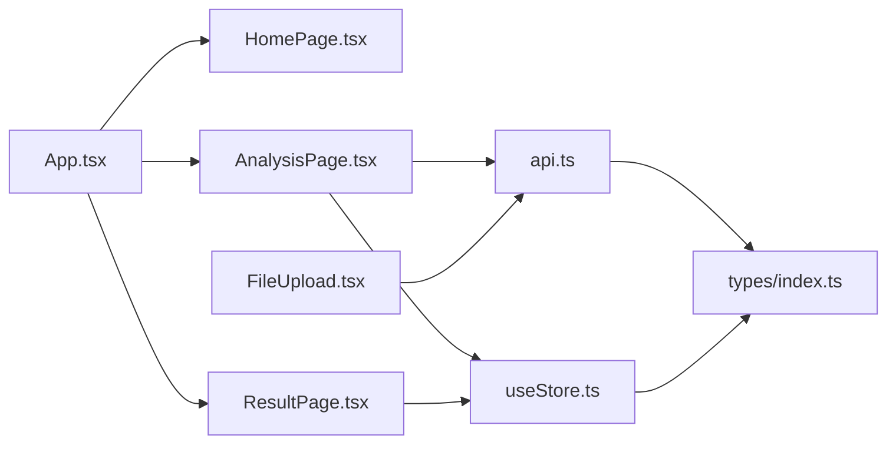

# 页面组件

<cite>
**本文引用的文件**
- [frontend/src/pages/HomePage.tsx](file://frontend/src/pages/HomePage.tsx)
- [frontend/src/pages/AnalysisPage.tsx](file://frontend/src/pages/AnalysisPage.tsx)
- [frontend/src/pages/ResultPage.tsx](file://frontend/src/pages/ResultPage.tsx)
- [frontend/src/App.tsx](file://frontend/src/App.tsx)
- [frontend/src/store/useStore.ts](file://frontend/src/store/useStore.ts)
- [frontend/src/services/api.ts](file://frontend/src/services/api.ts)
- [frontend/src/types/index.ts](file://frontend/src/types/index.ts)
- [frontend/src/components/FileUpload.tsx](file://frontend/src/components/FileUpload.tsx)
- [frontend/src/components/ManualInput.tsx](file://frontend/src/components/ManualInput.tsx)
- [frontend/src/components/ParamPanel.tsx](file://frontend/src/components/ParamPanel.tsx)
- [frontend/src/components/CashFlowChart.tsx](file://frontend/src/components/CashFlowChart.tsx)
- [frontend/src/components/SensitivityTable.tsx](file://frontend/src/components/SensitivityTable.tsx)
- [frontend/src/components/WaterfallChart.tsx](file://frontend/src/components/WaterfallChart.tsx)
- [frontend/src/i18n/zh.json](file://frontend/src/i18n/zh.json)
- [frontend/src/i18n/en.json](file://frontend/src/i18n/en.json)
</cite>

## 目录
1. [简介](#简介)
2. [项目结构](#项目结构)
3. [核心组件](#核心组件)
4. [架构总览](#架构总览)
5. [详细组件分析](#详细组件分析)
6. [依赖关系分析](#依赖关系分析)
7. [性能考虑](#性能考虑)
8. [故障排查指南](#故障排查指南)
9. [结论](#结论)
10. [附录](#附录)

## 简介
本文件面向DCF估值智能体的前端页面组件，围绕三大页面组件进行系统化文档化说明：首页（HomePage）用于项目介绍与快速开始；分析页面（AnalysisPage）负责数据输入与参数设置；结果页面（ResultPage）用于展示估值结果与生成报告。文档涵盖组件结构、状态管理、用户交互流程、路由配置、页面间导航与数据传递、生命周期管理、错误处理与性能优化策略，以及与系统其他组件的集成方式与最佳实践。

## 项目结构
前端采用Vite + React + Ant Design + Zustand + ECharts的组合，页面组件位于frontend/src/pages，全局状态由Zustand集中管理，业务API封装在services/api.ts中，类型定义集中在types/index.ts，可视化图表组件位于components目录。

**图表来源**
- [frontend/src/App.tsx:128-132](file://frontend/src/App.tsx#L128-L132)
- [frontend/src/pages/HomePage.tsx:23-116](file://frontend/src/pages/HomePage.tsx#L23-L116)
- [frontend/src/pages/AnalysisPage.tsx:29-216](file://frontend/src/pages/AnalysisPage.tsx#L29-L216)
- [frontend/src/pages/ResultPage.tsx:35-215](file://frontend/src/pages/ResultPage.tsx#L35-L215)
- [frontend/src/store/useStore.ts:23-73](file://frontend/src/store/useStore.ts#L23-L73)
- [frontend/src/services/api.ts:11-80](file://frontend/src/services/api.ts#L11-L80)
- [frontend/src/types/index.ts:105-127](file://frontend/src/types/index.ts#L105-L127)
- [frontend/src/components/FileUpload.tsx:12-158](file://frontend/src/components/FileUpload.tsx#L12-L158)
- [frontend/src/components/ManualInput.tsx:98-177](file://frontend/src/components/ManualInput.tsx#L98-L177)
- [frontend/src/components/ParamPanel.tsx:88-209](file://frontend/src/components/ParamPanel.tsx#L88-L209)
- [frontend/src/components/CashFlowChart.tsx:16-109](file://frontend/src/components/CashFlowChart.tsx#L16-L109)
- [frontend/src/components/SensitivityTable.tsx:9-97](file://frontend/src/components/SensitivityTable.tsx#L9-L97)
- [frontend/src/components/WaterfallChart.tsx:17-123](file://frontend/src/components/WaterfallChart.tsx#L17-L123)

**章节来源**
- [frontend/src/App.tsx:128-132](file://frontend/src/App.tsx#L128-L132)
- [frontend/src/pages/HomePage.tsx:23-116](file://frontend/src/pages/HomePage.tsx#L23-L116)
- [frontend/src/pages/AnalysisPage.tsx:29-216](file://frontend/src/pages/AnalysisPage.tsx#L29-L216)
- [frontend/src/pages/ResultPage.tsx:35-215](file://frontend/src/pages/ResultPage.tsx#L35-L215)

## 核心组件
- 全局状态中心：Zustand存储，统一管理财务数据、DCF参数、计算结果、敏感性矩阵、叙事文本、加载与错误状态、主题与语言等。
- API服务层：封装HTTP请求，统一错误处理，暴露上传、提取、计算DCF、敏感性分析、生成叙事等方法。
- 页面组件：首页负责引导与跳转；分析页负责数据输入与参数设置，并触发计算；结果页负责展示汇总卡片、图表与AI叙事。
- 可视化组件：基于ECharts的现金流趋势、敏感性热力图、价值桥瀑布图等。

**章节来源**
- [frontend/src/store/useStore.ts:23-73](file://frontend/src/store/useStore.ts#L23-L73)
- [frontend/src/services/api.ts:11-80](file://frontend/src/services/api.ts#L11-L80)
- [frontend/src/types/index.ts:105-127](file://frontend/src/types/index.ts#L105-L127)

## 架构总览
页面组件通过路由组织，首页作为入口，分析页收集数据与参数，结果页展示分析成果。状态在全局Store中集中管理，页面通过Store读写状态，调用API服务发起后端计算，最终在结果页渲染可视化图表与报告。

**图表来源**
- [frontend/src/App.tsx:128-132](file://frontend/src/App.tsx#L128-L132)
- [frontend/src/pages/AnalysisPage.tsx:58-99](file://frontend/src/pages/AnalysisPage.tsx#L58-L99)
- [frontend/src/services/api.ts:51-80](file://frontend/src/services/api.ts#L51-L80)
- [frontend/src/store/useStore.ts:35-47](file://frontend/src/store/useStore.ts#L35-L47)
- [frontend/src/pages/ResultPage.tsx:35-42](file://frontend/src/pages/ResultPage.tsx#L35-L42)

## 详细组件分析

### 首页（HomePage）
- 组件职责
  - 展示产品特性与价值主张，提供“开始分析”按钮，引导用户进入分析流程。
  - 使用动画背景与特性卡片增强视觉体验，支持国际化文案。
- 用户交互
  - 点击“开始分析”按钮，使用路由导航至分析页。
- 国际化与主题
  - 通过i18n提供中英文文案；主题切换影响全局样式。
- 设计要点
  - 响应式布局，Hero标题与副标题使用可缩放字体；特性卡片悬停效果提升交互感。

**图表来源**
- [frontend/src/pages/HomePage.tsx:23-116](file://frontend/src/pages/HomePage.tsx#L23-L116)
- [frontend/src/App.tsx:26-38](file://frontend/src/App.tsx#L26-L38)

**章节来源**
- [frontend/src/pages/HomePage.tsx:23-116](file://frontend/src/pages/HomePage.tsx#L23-L116)
- [frontend/src/i18n/zh.json:8-31](file://frontend/src/i18n/zh.json#L8-L31)
- [frontend/src/i18n/en.json:8-31](file://frontend/src/i18n/en.json#L8-L31)

### 分析页面（AnalysisPage）
- 组件职责
  - 提供两种数据输入方式：文件上传（PDF）与手动输入。
  - 参数设置面板（ParamPanel），支持滑块与数值输入联动，实时预览WACC估算。
  - 触发计算流程：DCF计算 → 敏感性分析 → AI叙事生成 → 导航到结果页。
- 数据流与状态
  - 从Store读取financialData与dcfParameters，通过回调更新Store。
  - 计算过程中设置loading与中间提示，捕获错误并显示消息。
- 用户交互
  - 切换上传/手动标签页；填写表单字段；点击“计算估值”按钮。
- 错误处理
  - 对API异常进行统一错误处理，向用户反馈错误信息。
- 性能与可用性
  - 使用Spin指示器与禁用按钮避免重复提交；百分比字段格式化/解析确保输入一致性。

**图表来源**
- [frontend/src/pages/AnalysisPage.tsx:29-216](file://frontend/src/pages/AnalysisPage.tsx#L29-L216)
- [frontend/src/components/FileUpload.tsx:12-158](file://frontend/src/components/FileUpload.tsx#L12-L158)
- [frontend/src/components/ManualInput.tsx:98-177](file://frontend/src/components/ManualInput.tsx#L98-L177)
- [frontend/src/components/ParamPanel.tsx:88-209](file://frontend/src/components/ParamPanel.tsx#L88-L209)
- [frontend/src/services/api.ts:51-80](file://frontend/src/services/api.ts#L51-L80)
- [frontend/src/store/useStore.ts:35-47](file://frontend/src/store/useStore.ts#L35-L47)

**章节来源**
- [frontend/src/pages/AnalysisPage.tsx:29-216](file://frontend/src/pages/AnalysisPage.tsx#L29-L216)
- [frontend/src/components/FileUpload.tsx:12-158](file://frontend/src/components/FileUpload.tsx#L12-L158)
- [frontend/src/components/ManualInput.tsx:98-177](file://frontend/src/components/ManualInput.tsx#L98-L177)
- [frontend/src/components/ParamPanel.tsx:88-209](file://frontend/src/components/ParamPanel.tsx#L88-L209)
- [frontend/src/services/api.ts:17-26](file://frontend/src/services/api.ts#L17-L26)

### 结果页面（ResultPage）
- 组件职责
  - 展示估值摘要卡片（企业价值、股权价值、每股价值、相对股价与上/下行空间）。
  - 可视化展示：现金流趋势图、敏感性热力图、价值桥瀑布图。
  - AI叙事折叠面板，支持展开查看。
- 数据校验与导航
  - 若Store中无DCF结果，则强制导航回分析页。
- 用户交互
  - 返回分析页；导出按钮预留（当前提示“即将推出”）。
- 数字格式化
  - 金额按“亿/万/元”自动格式化；百分比保留两位小数。

**图表来源**
- [frontend/src/pages/ResultPage.tsx:35-42](file://frontend/src/pages/ResultPage.tsx#L35-L42)
- [frontend/src/pages/ResultPage.tsx:91-214](file://frontend/src/pages/ResultPage.tsx#L91-L214)

**章节来源**
- [frontend/src/pages/ResultPage.tsx:35-215](file://frontend/src/pages/ResultPage.tsx#L35-L215)
- [frontend/src/components/CashFlowChart.tsx:16-109](file://frontend/src/components/CashFlowChart.tsx#L16-L109)
- [frontend/src/components/SensitivityTable.tsx:9-97](file://frontend/src/components/SensitivityTable.tsx#L9-L97)
- [frontend/src/components/WaterfallChart.tsx:17-123](file://frontend/src/components/WaterfallChart.tsx#L17-L123)

### 组件关系与类图

**图表来源**
- [frontend/src/pages/HomePage.tsx:23-116](file://frontend/src/pages/HomePage.tsx#L23-L116)
- [frontend/src/pages/AnalysisPage.tsx:29-216](file://frontend/src/pages/AnalysisPage.tsx#L29-L216)
- [frontend/src/pages/ResultPage.tsx:35-215](file://frontend/src/pages/ResultPage.tsx#L35-L215)
- [frontend/src/store/useStore.ts:23-73](file://frontend/src/store/useStore.ts#L23-L73)
- [frontend/src/services/api.ts:28-80](file://frontend/src/services/api.ts#L28-L80)

## 依赖关系分析
- 路由与导航
  - App组件定义三页面路由，首页提供导航菜单项，支持语言切换与主题切换。
- 状态依赖
  - AnalysisPage与ResultPage均依赖Store中的financialData、dcfParameters、dcfResult、sensitivityMatrix、narrative等状态。
- API依赖
  - AnalysisPage调用calculateDCF、sensitivityAnalysis、generateNarrative；FileUpload调用uploadPDF。
- 类型依赖
  - 所有组件共享types/index.ts中的FinancialData、DCFParameters、DCFResult、SensitivityMatrix、NarrativeRequest/NarrativeResponse等类型。

**图表来源**
- [frontend/src/App.tsx:128-132](file://frontend/src/App.tsx#L128-L132)
- [frontend/src/pages/AnalysisPage.tsx:11-13](file://frontend/src/pages/AnalysisPage.tsx#L11-L13)
- [frontend/src/store/useStore.ts:10-9](file://frontend/src/store/useStore.ts#L10-L9)
- [frontend/src/services/api.ts:11-15](file://frontend/src/services/api.ts#L11-L15)
- [frontend/src/types/index.ts:105-127](file://frontend/src/types/index.ts#L105-L127)

**章节来源**
- [frontend/src/App.tsx:128-132](file://frontend/src/App.tsx#L128-L132)
- [frontend/src/store/useStore.ts:10-9](file://frontend/src/store/useStore.ts#L10-L9)
- [frontend/src/services/api.ts:11-15](file://frontend/src/services/api.ts#L11-L15)
- [frontend/src/types/index.ts:105-127](file://frontend/src/types/index.ts#L105-L127)

## 性能考虑
- 状态粒度与更新
  - 将financialData与dcfParameters拆分为独立setter，减少无关组件重渲染。
  - 在AnalysisPage中使用useCallback稳定回调，避免不必要的重渲染。
- 图表渲染
  - ECharts组件按需渲染，ResultPage在无数据时直接返回，避免无效渲染。
- 请求与并发
  - 计算流程串行执行，避免同时多次请求；loading状态与中间提示提升用户体验。
- 输入格式化
  - 百分比字段formatter/parser统一处理，减少用户输入误差与重复计算。

**章节来源**
- [frontend/src/pages/AnalysisPage.tsx:48-54](file://frontend/src/pages/AnalysisPage.tsx#L48-L54)
- [frontend/src/pages/AnalysisPage.tsx:137-144](file://frontend/src/pages/AnalysisPage.tsx#L137-L144)
- [frontend/src/pages/ResultPage.tsx:40-42](file://frontend/src/pages/ResultPage.tsx#L40-L42)

## 故障排查指南
- 常见问题
  - 无数据无法计算：检查financialData是否完整，尤其是公司名与营收字段。
  - API错误：查看错误消息，确认后端服务可达与请求参数正确。
  - 文件上传失败：确认文件格式为PDF，网络稳定，后端上传接口正常。
- 错误处理策略
  - API层对AxiosError进行统一处理，优先使用响应中的detail信息。
  - 页面层捕获异常并调用消息组件提示用户，同时设置Store中的error状态。
- 建议排查步骤
  - 检查Store中financialData与dcfParameters是否已写入。
  - 在Network面板确认请求URL、请求体与响应体。
  - 在控制台查看抛出的Error对象与堆栈信息。

**章节来源**
- [frontend/src/services/api.ts:17-26](file://frontend/src/services/api.ts#L17-L26)
- [frontend/src/pages/AnalysisPage.tsx:91-98](file://frontend/src/pages/AnalysisPage.tsx#L91-L98)
- [frontend/src/components/FileUpload.tsx:40-47](file://frontend/src/components/FileUpload.tsx#L40-L47)

## 结论
该页面组件体系以清晰的路由与状态管理为核心，结合直观的数据输入与参数设置，实现了从数据采集到结果可视化的完整闭环。通过Zustand集中状态、Ant Design与ECharts的组件化设计，以及完善的国际化与错误处理机制，提升了用户体验与开发效率。后续可在导出功能完善、图表交互增强与移动端适配方面持续优化。

## 附录
- 路由配置
  - /：首页
  - /analysis：分析页
  - /result：结果页
- 关键类型
  - FinancialData、DCFParameters、DCFResult、SensitivityMatrix、NarrativeRequest/NarrativeResponse
- 国际化
  - 支持中文与英文，文案覆盖导航、首页、分析页、结果页与通用提示。

**章节来源**
- [frontend/src/App.tsx:128-132](file://frontend/src/App.tsx#L128-L132)
- [frontend/src/types/index.ts:4-127](file://frontend/src/types/index.ts#L4-L127)
- [frontend/src/i18n/zh.json:1-163](file://frontend/src/i18n/zh.json#L1-L163)
- [frontend/src/i18n/en.json:1-163](file://frontend/src/i18n/en.json#L1-L163)