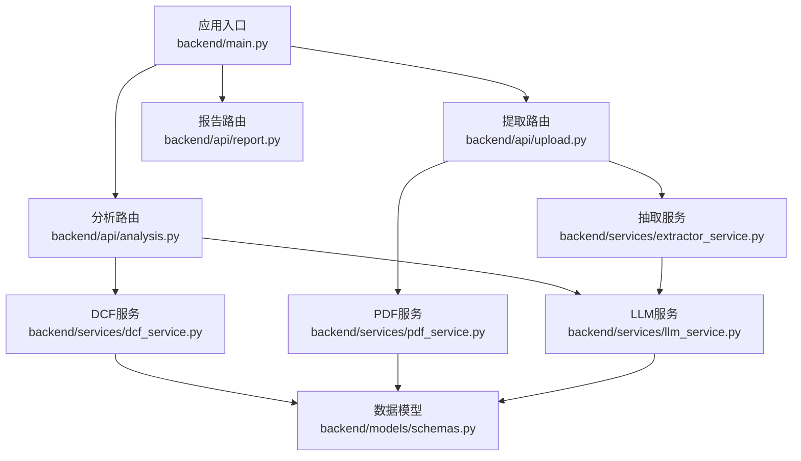
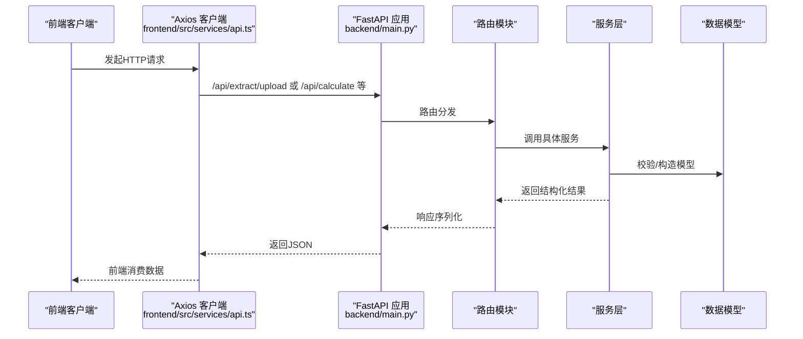
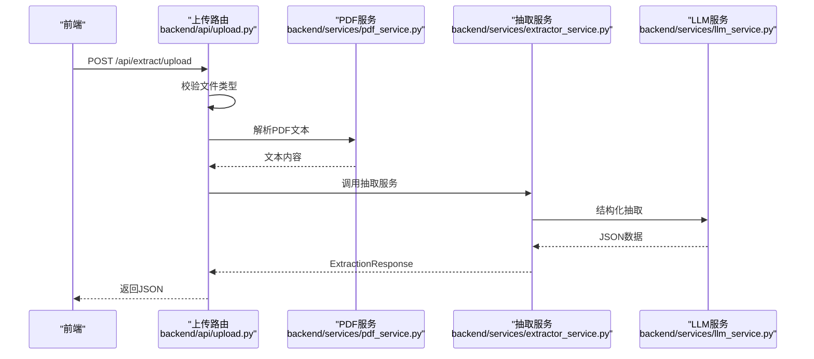
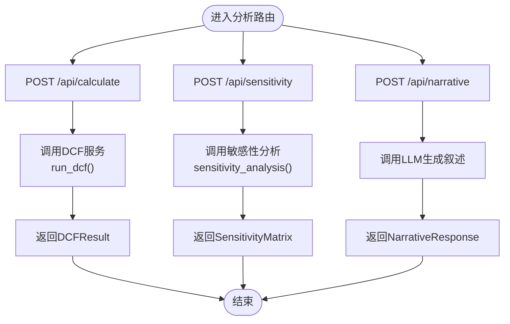
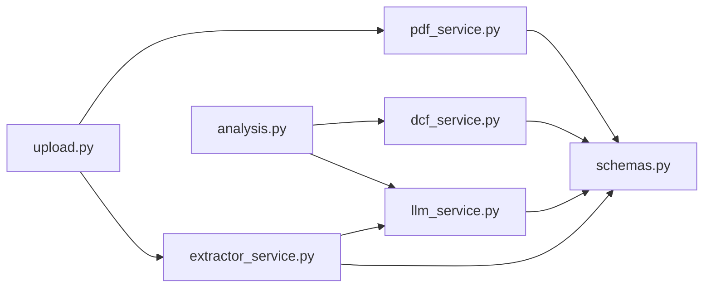
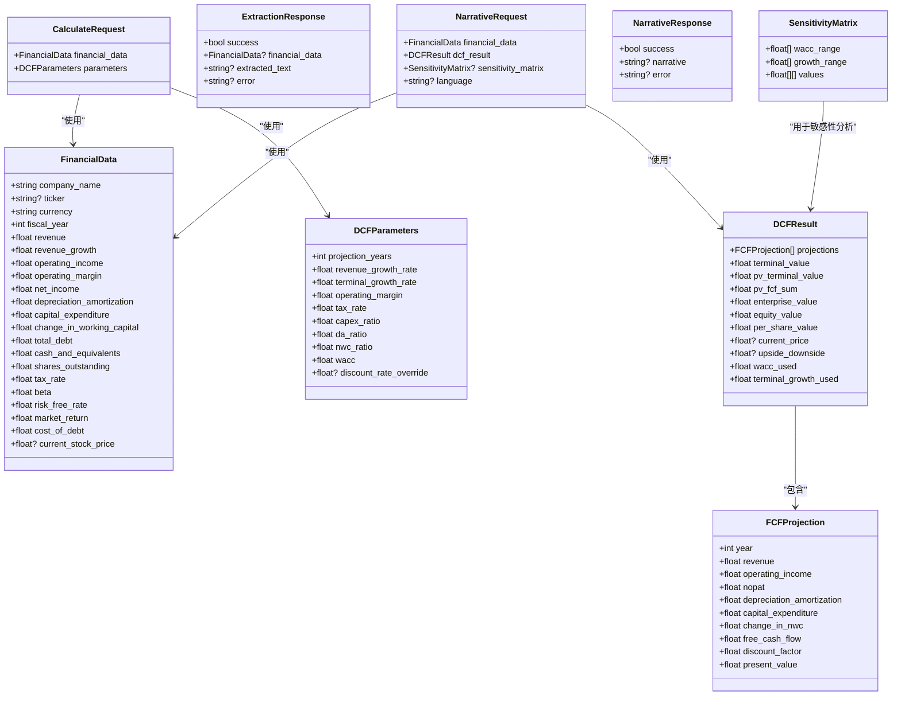

# API路由服务

<cite>
**本文引用的文件列表**
- [main.py](file://backend/main.py)
- [upload.py](file://backend/api/upload.py)
- [analysis.py](file://backend/api/analysis.py)
- [report.py](file://backend/api/report.py)
- [schemas.py](file://backend/models/schemas.py)
- [dcf_service.py](file://backend/services/dcf_service.py)
- [extractor_service.py](file://backend/services/extractor_service.py)
- [pdf_service.py](file://backend/services/pdf_service.py)
- [llm_service.py](file://backend/services/llm_service.py)
- [config.py](file://backend/config.py)
- [api.ts](file://frontend/src/services/api.ts)
- [index.ts](file://frontend/src/types/index.ts)
</cite>

## 目录
1. [简介](#简介)
2. [项目结构](#项目结构)
3. [核心组件](#核心组件)
4. [架构总览](#架构总览)
5. [详细组件分析](#详细组件分析)
6. [依赖关系分析](#依赖关系分析)
7. [性能考量](#性能考量)
8. [故障排查指南](#故障排查指南)
9. [结论](#结论)
10. [附录](#附录)

## 简介
本文件为DCF估值智能体的API路由服务技术文档，聚焦于三个核心API模块：
- 文件上传与数据提取服务：支持PDF上传解析与文本直接提取，输出结构化的财务数据。
- DCF分析计算服务：执行DCF估值、敏感性分析，并可生成专业叙述性报告。
- 报告生成服务：当前提供健康检查占位接口，后续将扩展导出能力。

文档涵盖路由HTTP方法、URL模式、请求参数与响应格式；详述数据验证与错误处理策略；给出认证、权限与安全建议；并说明API版本管理与向后兼容策略。

## 项目结构
后端采用FastAPI框架，通过路由前缀统一挂载到/api路径下，分别由三个模块提供功能：
- 提取模块：/api/extract
- 分析模块：/api（包含计算、敏感性、叙述）
- 报告模块：/api/report

图表来源
- [main.py:32-34](file://backend/main.py#L32-L34)
- [upload.py:13](file://backend/api/upload.py#L13)
- [analysis.py:15](file://backend/api/analysis.py#L15)
- [report.py:5](file://backend/api/report.py#L5)

章节来源
- [main.py:18-39](file://backend/main.py#L18-L39)
- [upload.py:13](file://backend/api/upload.py#L13)
- [analysis.py:15](file://backend/api/analysis.py#L15)
- [report.py:5](file://backend/api/report.py#L5)

## 核心组件
- 应用与中间件
  - FastAPI实例配置了标题、版本号与生命周期钩子；启用CORS允许跨域访问。
  - 路由统一挂载前缀/api，便于前端代理转发。
- 数据模型
  - 使用Pydantic模型定义输入输出结构，确保类型安全与自动校验。
- 服务层
  - PDF解析：按关键词相关度选择关键页面，限制最大字符数，提升抽取效率。
  - LLM抽取：系统提示词引导结构化JSON输出，具备容错与日志记录。
  - DCF计算：WACC计算、自由现金流预测、终值与现值汇总，支持敏感性矩阵。
  - 叙述生成：基于财务数据与DCF结果生成专业分析文本。

章节来源
- [main.py:18-30](file://backend/main.py#L18-L30)
- [schemas.py:8-101](file://backend/models/schemas.py#L8-L101)
- [pdf_service.py:26-67](file://backend/services/pdf_service.py#L26-L67)
- [llm_service.py:94-122](file://backend/services/llm_service.py#L94-L122)
- [dcf_service.py:85-121](file://backend/services/dcf_service.py#L85-L121)
- [extractor_service.py:27-66](file://backend/services/extractor_service.py#L27-L66)

## 架构总览
整体交互流程如下：前端通过Axios调用后端/api路由，后端根据路由分发到对应模块，模块调用服务层完成业务逻辑，最终返回结构化响应。

图表来源
- [main.py:32-34](file://backend/main.py#L32-L34)
- [api.ts:11-15](file://frontend/src/services/api.ts#L11-L15)
- [upload.py:16-43](file://backend/api/upload.py#L16-L43)
- [analysis.py:18-44](file://backend/api/analysis.py#L18-L44)

## 详细组件分析

### 文件上传与数据提取服务
- 路由与方法
  - POST /api/extract/upload：接收multipart/form-data，上传PDF并提取文本与财务数据。
  - POST /api/extract/text：接收纯文本，直接进行财务数据抽取。
- 请求参数
  - /extract/upload
    - 表单字段：file（二进制PDF）
  - /extract/text
    - JSON体：{ text: string }（必填且非空）
- 响应格式
  - 统一为ExtractionResponse模型，包含success、financial_data、extracted_text、error。
- 数据验证与错误处理
  - 文件类型校验：仅接受PDF；否则返回400。
  - 文本校验：/extract/text要求text非空；否则返回400。
  - PDF解析：若无法提取文本，返回success=false并携带错误信息。
  - LLM抽取：异常捕获并返回错误字符串；日志记录失败原因。
  - 临时文件清理：无论成功与否，均删除上传的临时文件。
- 安全与性能
  - 上传目录存在性保障与UUID命名避免冲突。
  - PDF解析限制最大字符数与页面数量，防止超大文件导致内存压力。
- 典型调用示例
  - 上传PDF：使用FormData，Content-Type设为multipart/form-data。
  - 直接传入文本：发送JSON { text: "...长文本..." }。
- 返回数据结构
  - 成功时：包含financial_data（结构化财务数据）与extracted_text（部分原文）。
  - 失败时：success=false，error包含错误描述。

图表来源
- [upload.py:16-43](file://backend/api/upload.py#L16-L43)
- [pdf_service.py:26-67](file://backend/services/pdf_service.py#L26-L67)
- [extractor_service.py:27-66](file://backend/services/extractor_service.py#L27-L66)
- [llm_service.py:94-122](file://backend/services/llm_service.py#L94-L122)

章节来源
- [upload.py:16-55](file://backend/api/upload.py#L16-L55)
- [pdf_service.py:26-67](file://backend/services/pdf_service.py#L26-L67)
- [extractor_service.py:27-66](file://backend/services/extractor_service.py#L27-L66)
- [schemas.py:78-83](file://backend/models/schemas.py#L78-L83)

### DCF分析计算服务
- 路由与方法
  - POST /api/calculate：执行DCF估值，返回DCFResult。
  - POST /api/sensitivity：执行敏感性分析，返回SensitivityMatrix。
  - POST /api/narrative：基于财务数据与DCF结果生成叙述性报告，返回NarrativeResponse。
- 请求参数
  - /api/calculate
    - JSON体：CalculateRequest，包含financial_data与parameters。
  - /api/sensitivity
    - JSON体：同上，用于敏感性分析。
  - /api/narrative
    - JSON体：NarrativeRequest，包含financial_data、dcf_result、可选sensitivity_matrix与language。
- 响应格式
  - /api/calculate：DCFResult
  - /api/sensitivity：SensitivityMatrix
  - /api/narrative：NarrativeResponse
- 数据验证与错误处理
  - 计算与敏感性分析：内部异常统一包装为HTTP 500。
  - 叙述生成：异常返回NarrativeResponse(success=false, error=...)。
- 关键算法要点
  - WACC计算：支持显式覆盖或基于CAPM与资本结构计算。
  - 自由现金流预测：按收入增长率与运营/比率推导NOPAT、DA、CAPEX、NWC变化。
  - 终值与现值：使用永续增长模型，注意wacc>g条件。
  - 敏感性矩阵：对WACC与终端增长率网格搜索，过滤不合法组合。
- 典型调用示例
  - 计算DCF：发送CalculateRequest。
  - 敏感性分析：发送同上请求。
  - 生成叙述：发送NarrativeRequest，可附带敏感性矩阵与语言偏好。

图表来源
- [analysis.py:18-44](file://backend/api/analysis.py#L18-L44)
- [dcf_service.py:85-121](file://backend/services/dcf_service.py#L85-L121)
- [dcf_service.py:123-162](file://backend/services/dcf_service.py#L123-L162)
- [llm_service.py:129-154](file://backend/services/llm_service.py#L129-L154)

章节来源
- [analysis.py:18-44](file://backend/api/analysis.py#L18-L44)
- [dcf_service.py:12-34](file://backend/services/dcf_service.py#L12-L34)
- [dcf_service.py:37-76](file://backend/services/dcf_service.py#L37-L76)
- [dcf_service.py:79-82](file://backend/services/dcf_service.py#L79-L82)
- [dcf_service.py:85-121](file://backend/services/dcf_service.py#L85-L121)
- [dcf_service.py:123-162](file://backend/services/dcf_service.py#L123-L162)
- [schemas.py:58-76](file://backend/models/schemas.py#L58-L76)
- [schemas.py:98-101](file://backend/models/schemas.py#L98-L101)

### 报告生成服务
- 路由与方法
  - GET /api/report/health：健康检查占位接口，返回模块状态与支持的导出格式。
- 当前状态
  - 导出功能尚未实现，接口返回占位信息。
- 后续扩展建议
  - 支持PDF/XLSX导出，结合前端图表数据与叙述文本生成报告。

章节来源
- [report.py:8-11](file://backend/api/report.py#L8-L11)

## 依赖关系分析
- 模块耦合
  - 路由层仅负责参数接收与响应封装，业务逻辑集中在服务层，保持高内聚低耦合。
  - 服务层依赖数据模型，确保输入输出一致性。
- 外部依赖
  - LLM服务：通过异步客户端调用外部模型，具备JSON解析与错误处理。
  - PDF解析：依赖pdfplumber库，按关键词相关度筛选页面。
- 数据流
  - 提取链路：上传/文本 -> PDF解析 -> LLM抽取 -> 结构化模型 -> 响应。
  - 计算链路：请求模型 -> DCF服务 -> 结果模型 -> 响应。

图表来源
- [upload.py:10-11](file://backend/api/upload.py#L10-L11)
- [extractor_service.py:5-6](file://backend/services/extractor_service.py#L5-L6)
- [analysis.py:12-13](file://backend/api/analysis.py#L12-L13)
- [dcf_service.py:3-9](file://backend/services/dcf_service.py#L3-L9)
- [schemas.py:8-101](file://backend/models/schemas.py#L8-L101)

## 性能考量
- PDF解析优化
  - 按关键词相关度排序页面，优先抽取高价值内容，限制最大字符数，降低内存占用。
- LLM调用
  - 控制输入长度与温度参数，减少Token消耗与响应时间。
- 临时文件管理
  - 成功/失败均清理上传文件，避免磁盘膨胀。
- 并发与限流
  - 建议在网关层增加速率限制与队列缓冲，避免LLM与数据库成为瓶颈。

## 故障排查指南
- 常见错误与定位
  - 400错误：文件类型不符或文本为空；检查请求头与参数。
  - 500错误：DCF计算或敏感性分析异常；查看服务日志。
  - LLM解析失败：检查模型返回是否为合法JSON；查看日志中的原始响应片段。
- 日志与监控
  - LLM服务与抽取服务均记录错误日志，便于快速定位问题。
  - 建议接入统一日志与指标采集，追踪QPS、延迟与错误率。
- 前端错误处理
  - Axios拦截器统一处理错误消息，前端显示友好提示。

章节来源
- [upload.py:19-20](file://backend/api/upload.py#L19-L20)
- [upload.py:49-50](file://backend/api/upload.py#L49-L50)
- [analysis.py:22-23](file://backend/api/analysis.py#L22-L23)
- [analysis.py:30-31](file://backend/api/analysis.py#L30-L31)
- [llm_service.py:117-122](file://backend/services/llm_service.py#L117-L122)
- [api.ts:17-26](file://frontend/src/services/api.ts#L17-L26)

## 结论
该API路由服务以清晰的模块划分与强类型模型为基础，实现了从PDF/文本抽取到DCF计算与叙述生成的完整闭环。通过合理的数据验证、错误处理与日志记录，提升了系统的稳定性与可观测性。建议后续完善报告导出、增强认证与权限控制，并在生产环境引入速率限制与缓存策略以提升性能与安全性。

## 附录

### API清单与示例

- 提取模块
  - POST /api/extract/upload
    - 请求：multipart/form-data，字段file为PDF二进制
    - 响应：ExtractionResponse
    - 示例：前端使用FormData上传文件
  - POST /api/extract/text
    - 请求：JSON { text: string }
    - 响应：ExtractionResponse
    - 示例：发送一段财务文本

- 分析模块
  - POST /api/calculate
    - 请求：CalculateRequest（包含financial_data与parameters）
    - 响应：DCFResult
    - 示例：发送结构化财务数据与参数
  - POST /api/sensitivity
    - 请求：CalculateRequest
    - 响应：SensitivityMatrix
    - 示例：用于评估WACC与终端增长率的敏感性
  - POST /api/narrative
    - 请求：NarrativeRequest（包含financial_data、dcf_result、可选sensitivity_matrix与language）
    - 响应：NarrativeResponse
    - 示例：生成专业叙述性报告

- 报告模块
  - GET /api/report/health
    - 响应：模块状态与支持导出格式占位

章节来源
- [upload.py:16-55](file://backend/api/upload.py#L16-L55)
- [analysis.py:18-44](file://backend/api/analysis.py#L18-L44)
- [report.py:8-11](file://backend/api/report.py#L8-L11)
- [api.ts:28-80](file://frontend/src/services/api.ts#L28-L80)

### 数据模型概览

图表来源
- [schemas.py:8-101](file://backend/models/schemas.py#L8-L101)

### 认证、权限与安全
- 认证机制
  - 当前未实现认证中间件；建议在路由层增加鉴权装饰器或全局中间件。
- 权限控制
  - 可基于用户角色与资源访问策略进行细化。
- 安全考虑
  - 限制文件大小与类型，避免恶意文件。
  - 对LLM输入进行长度与内容约束，防止提示注入。
  - 生产环境开启HTTPS与CORS白名单，避免跨域风险。
  - 上传目录权限最小化，定期清理临时文件。

章节来源
- [main.py:24-30](file://backend/main.py#L24-L30)
- [upload.py:19-20](file://backend/api/upload.py#L19-L20)
- [pdf_service.py:26-67](file://backend/services/pdf_service.py#L26-L67)
- [llm_service.py:94-122](file://backend/services/llm_service.py#L94-L122)

### API版本管理与向后兼容
- 版本标识
  - 应用已设置version="1.0.0"，建议在路由前缀中体现版本，如/api/v1。
- 向后兼容策略
  - 新增字段使用可选属性，避免破坏现有调用。
  - 保留旧字段并在新版本中逐步弃用，提供迁移指引。
  - 在响应中包含版本信息，便于客户端适配。

章节来源
- [main.py:19-21](file://backend/main.py#L19-L21)
- [schemas.py:78-83](file://backend/models/schemas.py#L78-L83)