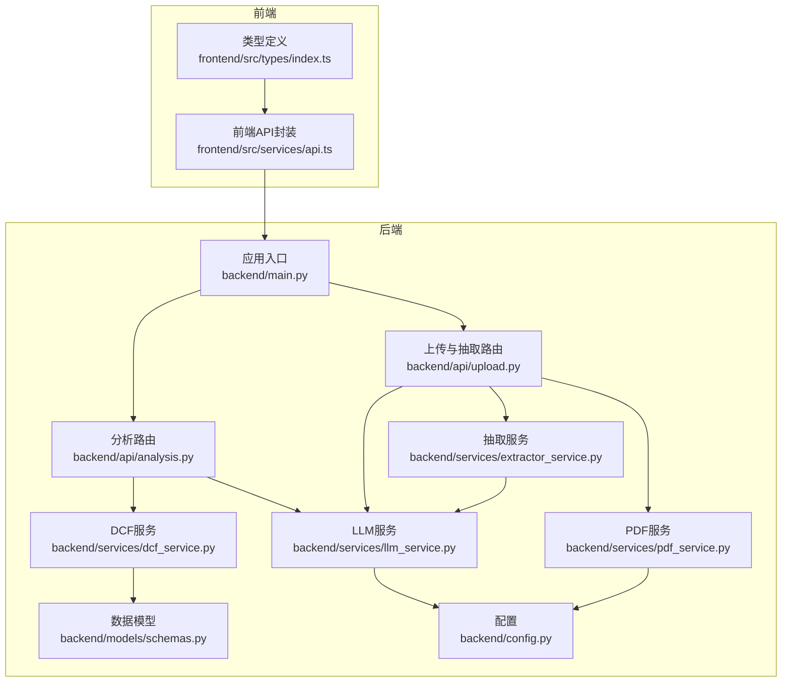
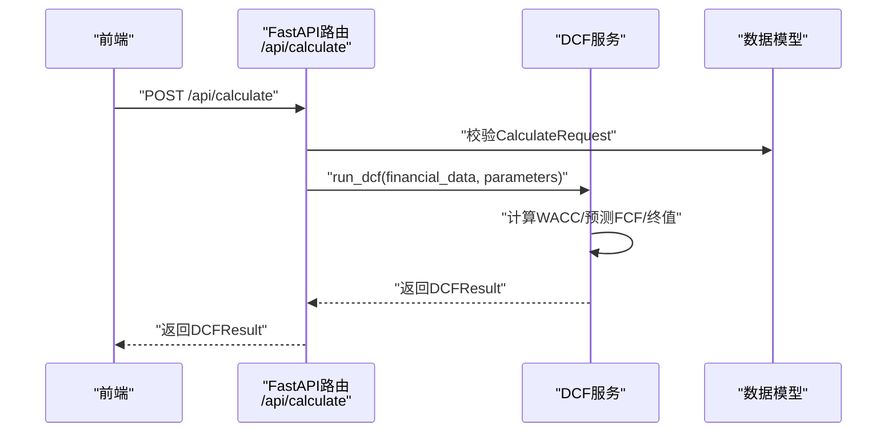
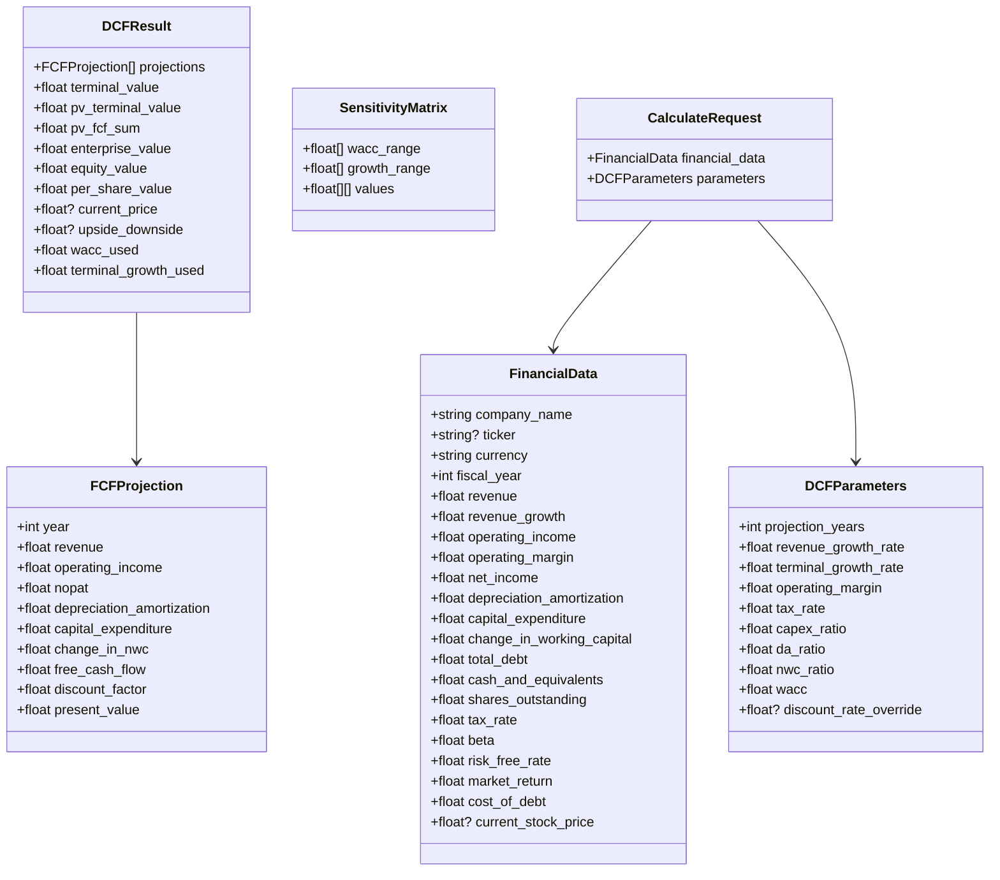
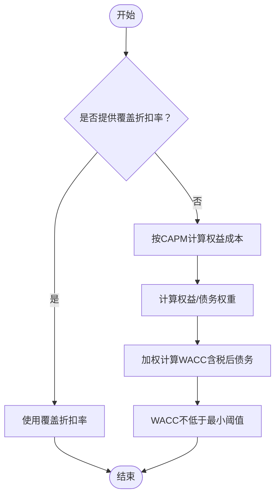
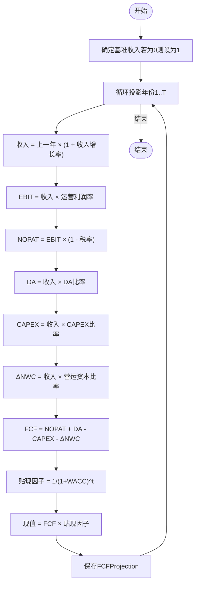
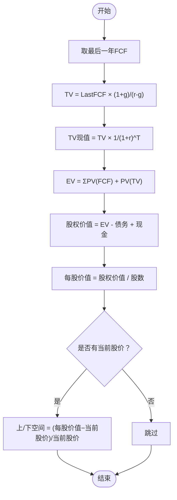
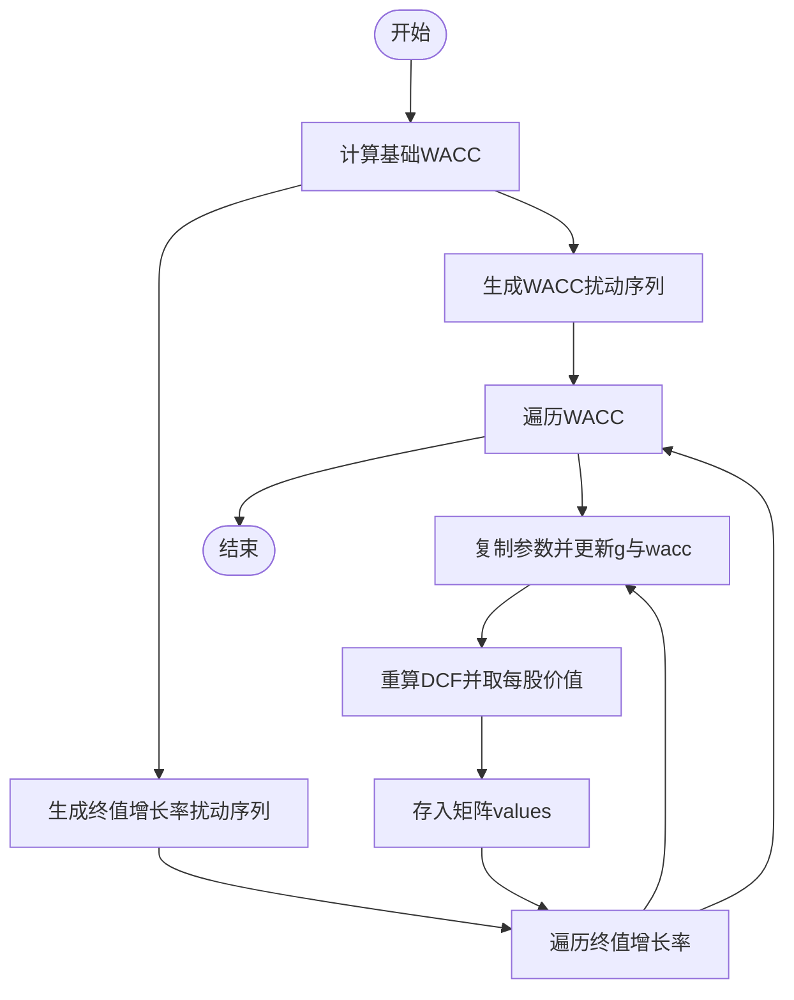
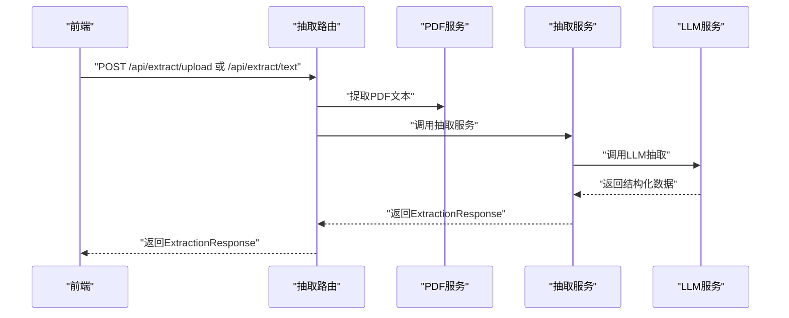
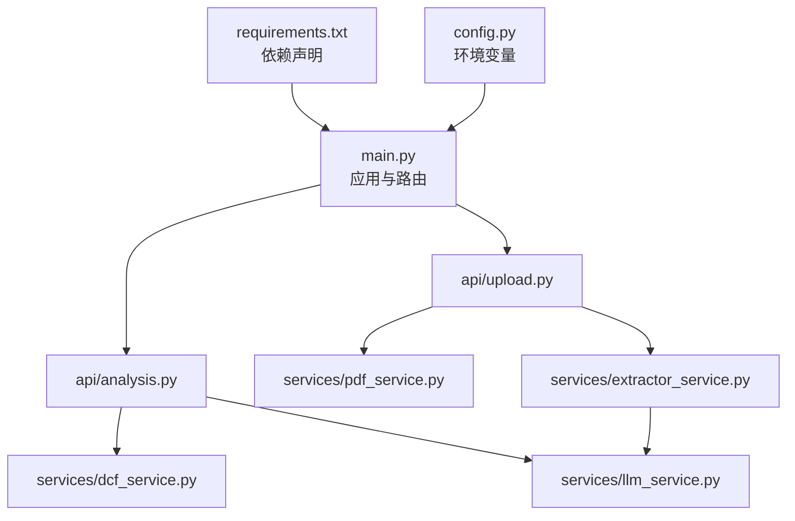

# 分析计算API

<cite>
**本文引用的文件**
- [backend/main.py](file://backend/main.py)
- [backend/api/analysis.py](file://backend/api/analysis.py)
- [backend/models/schemas.py](file://backend/models/schemas.py)
- [backend/services/dcf_service.py](file://backend/services/dcf_service.py)
- [backend/services/llm_service.py](file://backend/services/llm_service.py)
- [backend/api/upload.py](file://backend/api/upload.py)
- [backend/services/pdf_service.py](file://backend/services/pdf_service.py)
- [backend/services/extractor_service.py](file://backend/services/extractor_service.py)
- [backend/config.py](file://backend/config.py)
- [frontend/src/services/api.ts](file://frontend/src/services/api.ts)
- [frontend/src/types/index.ts](file://frontend/src/types/index.ts)
</cite>

## 目录
1. [简介](#简介)
2. [项目结构](#项目结构)
3. [核心组件](#核心组件)
4. [架构总览](#架构总览)
5. [详细组件分析](#详细组件分析)
6. [依赖分析](#依赖分析)
7. [性能考虑](#性能考虑)
8. [故障排查指南](#故障排查指南)
9. [结论](#结论)
10. [附录](#附录)

## 简介
本文件面向DCF估值智能体的“分析计算API”，系统性阐述后端FastAPI服务的计算接口设计与实现，覆盖以下要点：
- 核心接口：POST /api/calculate 的参数结构与计算流程
- 关键算法：WACC计算、自由现金流（FCF）预测、终值（TV）计算
- 敏感性分析：多场景参数扰动与矩阵输出
- 数据模型：请求/响应的完整字段定义与约束
- 计算精度与性能：舍入策略、数值稳定性与优化建议
- 错误处理：异常捕获、HTTP状态码与前端错误提示
- 实际示例与验证：如何构造输入、解读输出、进行结果校验

## 项目结构
后端采用FastAPI框架，按功能模块划分：
- 应用入口与路由挂载：backend/main.py
- 接口层：backend/api/analysis.py（计算）、backend/api/upload.py（提取）
- 业务服务层：backend/services/dcf_service.py（DCF主计算）、backend/services/llm_service.py（大模型抽取与叙事生成）、backend/services/pdf_service.py（PDF文本提取）、backend/services/extractor_service.py（LLM抽取编排）
- 数据模型：backend/models/schemas.py（Pydantic模型）
- 配置：backend/config.py（环境变量与路径）

**图表来源**
- [backend/main.py:18-35](file://backend/main.py#L18-L35)
- [backend/api/analysis.py:15-45](file://backend/api/analysis.py#L15-L45)
- [backend/api/upload.py:13-55](file://backend/api/upload.py#L13-L55)
- [backend/services/dcf_service.py:1-163](file://backend/services/dcf_service.py#L1-L163)
- [backend/services/llm_service.py:70-155](file://backend/services/llm_service.py#L70-L155)
- [backend/services/pdf_service.py:26-68](file://backend/services/pdf_service.py#L26-L68)
- [backend/services/extractor_service.py:27-67](file://backend/services/extractor_service.py#L27-L67)
- [backend/models/schemas.py:8-101](file://backend/models/schemas.py#L8-L101)
- [backend/config.py:10-22](file://backend/config.py#L10-L22)

**章节来源**
- [backend/main.py:18-40](file://backend/main.py#L18-L40)
- [backend/api/analysis.py:15-45](file://backend/api/analysis.py#L15-L45)
- [backend/api/upload.py:13-55](file://backend/api/upload.py#L13-L55)

## 核心组件
- 数据模型（Pydantic）：定义请求/响应的字段、默认值、可选字段与校验规则
- DCF服务：实现WACC、FCF预测、终值、企业价值与股权价值计算
- LLM服务：抽取结构化财务数据、生成专业叙事
- 路由与控制器：暴露REST接口，调用服务层并返回标准化响应

**章节来源**
- [backend/models/schemas.py:8-101](file://backend/models/schemas.py#L8-L101)
- [backend/services/dcf_service.py:12-163](file://backend/services/dcf_service.py#L12-L163)
- [backend/services/llm_service.py:70-155](file://backend/services/llm_service.py#L70-L155)
- [backend/api/analysis.py:18-44](file://backend/api/analysis.py#L18-L44)

## 架构总览
下图展示了“计算”和“敏感性分析”的端到端调用链路。

**图表来源**
- [backend/api/analysis.py:18-23](file://backend/api/analysis.py#L18-L23)
- [backend/services/dcf_service.py:85-121](file://backend/services/dcf_service.py#L85-L121)
- [backend/models/schemas.py:98-101](file://backend/models/schemas.py#L98-L101)

## 详细组件分析

### 数据模型与请求/响应规范
- 请求模型 CalculateRequest：包含 FinancialData 与 DCFParameters
- FinancialData：公司基本信息、财务指标、市场参数等
- DCFParameters：预测期、增长率、税率、比率、WACC与折扣率覆盖
- FCFProjection：每年的收入、EBIT、NOPAT、折旧摊销、CAPEX、营运资本变动、FCF、贴现因子与现值
- DCFResult：终值、TV现值、FCF现值之和、企业价值、股权价值、每股价值、相对当前股价的上/下空间、使用的WACC与终值增长率
- SensitivityMatrix：WACC与终值增长率的网格范围及对应的每股价值矩阵

字段与默认值、取值范围与约束详见下方表格。

**图表来源**
- [backend/models/schemas.py:8-101](file://backend/models/schemas.py#L8-L101)

**章节来源**
- [backend/models/schemas.py:8-101](file://backend/models/schemas.py#L8-L101)

### POST /api/calculate 接口详解
- 路由：/api/calculate
- 方法：POST
- 请求体：CalculateRequest（包含 FinancialData 与 DCFParameters）
- 响应体：DCFResult
- 处理流程：
  1) 校验请求体（Pydantic自动完成）
  2) 调用 DCF服务.run_dcf 计算
  3) 返回 DCFResult

计算逻辑要点（见下节“DCF服务算法”）。

**章节来源**
- [backend/api/analysis.py:18-23](file://backend/api/analysis.py#L18-L23)
- [backend/models/schemas.py:98-101](file://backend/models/schemas.py#L98-L101)

### 敏感性分析API
- 路由：/api/sensitivity
- 方法：POST
- 请求体：CalculateRequest
- 响应体：SensitivityMatrix
- 计算策略：
  1) 在给定WACC与终值增长率范围内进行网格化扰动
  2) 对每个组合重新运行DCF，得到对应每股价值
  3) 输出二维矩阵（WACC行×终值增长率列）

注意：当WACC不小于终值增长率或WACC非正时，该单元格值为0，避免不合理结果。

**章节来源**
- [backend/api/analysis.py:26-31](file://backend/api/analysis.py#L26-L31)
- [backend/services/dcf_service.py:123-163](file://backend/services/dcf_service.py#L123-L163)

### 叙述生成API（可选）
- 路由：/api/narrative
- 方法：POST
- 请求体：NarrativeRequest（包含 FinancialData、DCFResult、可选敏感性矩阵与语言）
- 响应体：NarrativeResponse（成功/失败与文本或错误信息）
- 实现：通过LLM服务生成专业分析文本

**章节来源**
- [backend/api/analysis.py:34-44](file://backend/api/analysis.py#L34-L44)
- [backend/services/llm_service.py:129-155](file://backend/services/llm_service.py#L129-L155)

### 提取财务数据（前置能力）
- 路由：/api/extract/upload（PDF）与 /api/extract/text（纯文本）
- 功能：上传PDF → 文本提取 → LLM抽取结构化财务数据
- 响应体：ExtractionResponse（成功/失败、抽取数据、原始片段）

**章节来源**
- [backend/api/upload.py:16-55](file://backend/api/upload.py#L16-L55)
- [backend/services/pdf_service.py:26-68](file://backend/services/pdf_service.py#L26-L68)
- [backend/services/extractor_service.py:27-67](file://backend/services/extractor_service.py#L27-L67)

### DCF服务算法详解

#### WACC计算
- 若显式提供 discount_rate_override，则直接使用
- 否则按CAPM计算权益成本，并结合市值与总资本权重计算加权平均
- 税后债务成本 = 成本 × (1 - 税率)
- 最终WACC不低于最小阈值

**图表来源**
- [backend/services/dcf_service.py:12-34](file://backend/services/dcf_service.py#L12-L34)

**章节来源**
- [backend/services/dcf_service.py:12-34](file://backend/services/dcf_service.py#L12-L34)

#### 自由现金流（FCF）预测
- 基于收入复合增长，推导EBIT、NOPAT、折旧摊销、CAPEX、营运资本变动
- 年度FCF = NOPAT + DA - CAPEX - ΔNWC
- 每年贴现因子 = 1/(1+WACC)^t，现值 = FCF × 贴现因子
- 保留两位小数用于金额类字段，贴现因子保留六位小数

**图表来源**
- [backend/services/dcf_service.py:37-77](file://backend/services/dcf_service.py#L37-L77)

**章节来源**
- [backend/services/dcf_service.py:37-77](file://backend/services/dcf_service.py#L37-L77)

#### 终值（TV）与企业/股权价值
- 终值 = 最后期FCF × (1 + 终值增长率) / (WACC - 终值增长率)
- TV现值 = 终值 × 1/(1+WACC)^T
- 企业价值 = FCF现值之和 + TV现值
- 股权价值 = 企业价值 − 总债务 + 现金及等价物
- 每股价值 = 股权价值 / 总股本
- 若提供当前股价，则计算相对空间（上/下）

**图表来源**
- [backend/services/dcf_service.py:79-121](file://backend/services/dcf_service.py#L79-L121)

**章节来源**
- [backend/services/dcf_service.py:79-121](file://backend/services/dcf_service.py#L79-L121)

#### 敏感性分析算法
- 固定WACC与终值增长率的扰动范围，形成网格
- 对每个组合复制参数并重算DCF，记录每格的每股价值
- 不满足 r>g 且 r>0 的组合记为0

**图表来源**
- [backend/services/dcf_service.py:123-163](file://backend/services/dcf_service.py#L123-L163)

**章节来源**
- [backend/services/dcf_service.py:123-163](file://backend/services/dcf_service.py#L123-L163)

### LLM抽取与叙事生成
- 抽取：从PDF文本或纯文本中提取结构化财务数据，返回 ExtractionResponse
- 叙事：根据财务数据与DCF结果生成专业分析文本，返回 NarrativeResponse

**图表来源**
- [backend/api/upload.py:16-55](file://backend/api/upload.py#L16-L55)
- [backend/services/pdf_service.py:26-68](file://backend/services/pdf_service.py#L26-L68)
- [backend/services/extractor_service.py:27-67](file://backend/services/extractor_service.py#L27-L67)
- [backend/services/llm_service.py:94-123](file://backend/services/llm_service.py#L94-L123)

**章节来源**
- [backend/services/llm_service.py:94-155](file://backend/services/llm_service.py#L94-L155)

## 依赖分析
- 后端依赖：FastAPI、Uvicorn、OpenAI SDK、pdfplumber、python-multipart、Pydantic、dotenv、SQLAlchemy与PyMySQL
- 配置：通过dotenv加载Minimax API密钥、基础URL、模型名以及MySQL连接参数
- 路由挂载：/api/extract、/api/analysis、/api/report

**图表来源**
- [backend/requirements.txt:1-11](file://backend/requirements.txt#L1-L11)
- [backend/config.py:10-22](file://backend/config.py#L10-L22)
- [backend/main.py:18-35](file://backend/main.py#L18-L35)

**章节来源**
- [backend/requirements.txt:1-11](file://backend/requirements.txt#L1-L11)
- [backend/config.py:10-22](file://backend/config.py#L10-L22)

## 性能考虑
- 计算复杂度
  - FCF预测：O(T)，T为投影年数
  - 敏感性分析：O(W×G×T)，W为WACC扰动点数，G为终值增长率扰动点数
- 数值稳定性
  - WACC与终值增长率比较，避免 r≤g 导致TV发散
  - 金额类字段保留有限小数，降低前端渲染与对比误差
- I/O与并发
  - PDF文本提取限制最大字符数与页面数量，避免超长文本导致内存压力
  - LLM调用设置合理超时与温度参数，平衡质量与速度
- 前端交互
  - 计算接口超时时间较长，适合大数据量敏感性分析
  - 建议在UI层显示进度与分步结果，提升用户体验

[本节为通用性能讨论，无需特定文件引用]

## 故障排查指南
- 常见错误与处理
  - PDF提取为空：检查文件是否为PDF、页内容是否可解析；查看日志中的字符计数
  - LLM JSON解析失败：确认返回内容包含JSON对象，必要时清理思维标签与代码块
  - 计算异常：捕获异常并返回HTTP 500，前端显示错误详情
  - 参数非法：Pydantic自动校验，前端需根据字段提示修正
- 日志与可观测性
  - LLM抽取与叙事生成记录响应长度与公司名称，便于定位问题
  - PDF服务记录页数、关键词匹配与最终字符数
- 前端错误提示
  - 统一通过Axios拦截器提取后端错误消息，避免网络错误被忽略

**章节来源**
- [backend/api/upload.py:38-42](file://backend/api/upload.py#L38-L42)
- [backend/services/llm_service.py:117-122](file://backend/services/llm_service.py#L117-L122)
- [backend/api/analysis.py:22-23](file://backend/api/analysis.py#L22-L23)
- [frontend/src/services/api.ts:17-26](file://frontend/src/services/api.ts#L17-L26)

## 结论
本API以清晰的数据模型与稳健的DCF算法为核心，提供从财务数据抽取、DCF估值计算、敏感性分析到专业叙事生成的完整能力。通过严格的参数校验、数值稳定策略与完善的错误处理，确保在不同输入与场景下的可靠性与可解释性。建议在生产环境中配合缓存、异步任务与限流策略进一步提升吞吐与稳定性。

[本节为总结，无需特定文件引用]

## 附录

### API定义与示例

- POST /api/calculate
  - 请求体：CalculateRequest
    - financial_data：FinancialData
    - parameters：DCFParameters
  - 响应体：DCFResult
  - 示例流程
    - 准备 FinancialData（至少提供收入、股本、税率、β、无风险利率、市场回报、债务成本等）
    - 准备 DCFParameters（如投影年数、收入增长率、终值增长率、比率等）
    - 发送请求并接收 DCFResult，核对企业价值、股权价值与每股价值
  - 注意事项
    - 若未提供 wacc，将自动计算；也可通过 discount_rate_override 直接指定
    - 终值增长率不得高于WACC，否则TV为0

- POST /api/sensitivity
  - 请求体：CalculateRequest
  - 响应体：SensitivityMatrix
  - 使用建议
    - 观察WACC与终值增长率对每股价值的影响面，识别最敏感区域
    - 将边界条件（r≤g或r≤0）标记为不可行

- POST /api/narrative
  - 请求体：NarrativeRequest（包含 FinancialData、DCFResult、可选敏感性矩阵与语言）
  - 响应体：NarrativeResponse
  - 使用建议
    - 作为报告生成的补充，帮助用户理解计算假设与结论

- POST /api/extract/upload 与 /api/extract/text
  - 功能：从PDF或文本中抽取结构化财务数据
  - 响应体：ExtractionResponse
  - 使用建议
    - 先抽取再计算，减少手工录入误差

**章节来源**
- [backend/api/analysis.py:18-44](file://backend/api/analysis.py#L18-L44)
- [backend/api/upload.py:16-55](file://backend/api/upload.py#L16-L55)
- [backend/models/schemas.py:98-101](file://backend/models/schemas.py#L98-L101)

### 字段对照与默认值（摘要）
- FinancialData
  - currency 默认 CNY
  - operating_margin 默认 0.15
  - tax_rate 默认 0.25
  - beta 默认 1.0
  - risk_free_rate 默认 0.03
  - market_return 默认 0.09
  - cost_of_debt 默认 0.05
- DCFParameters
  - projection_years 默认 5
  - revenue_growth_rate 默认 0.08
  - terminal_growth_rate 默认 0.025
  - operating_margin 默认 0.15
  - tax_rate 默认 0.25
  - capex_ratio 默认 0.05
  - da_ratio 默认 0.04
  - nwc_ratio 默认 0.02
  - wacc 默认 0.1
- DCFResult
  - 包含每项金额与比率字段，均保留有限小数
- SensitivityMatrix
  - WACC与终值增长率扰动序列与二维矩阵

**章节来源**
- [backend/models/schemas.py:8-101](file://backend/models/schemas.py#L8-L101)

### 前端集成要点
- 类型定义：frontend/src/types/index.ts
- API封装：frontend/src/services/api.ts
- 建议
  - 在提交计算前校验必填字段
  - 对敏感性分析设置合理的超时与分页加载
  - 将LLM抽取结果与手动输入进行交叉验证

**章节来源**
- [frontend/src/types/index.ts:4-128](file://frontend/src/types/index.ts#L4-L128)
- [frontend/src/services/api.ts:51-81](file://frontend/src/services/api.ts#L51-L81)