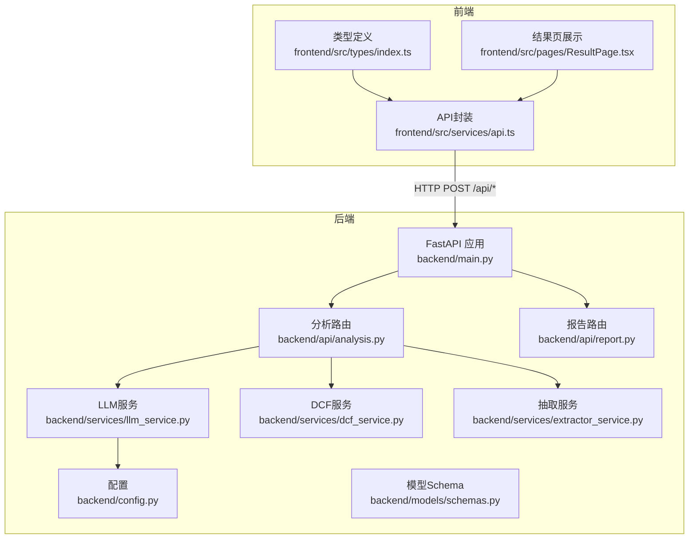
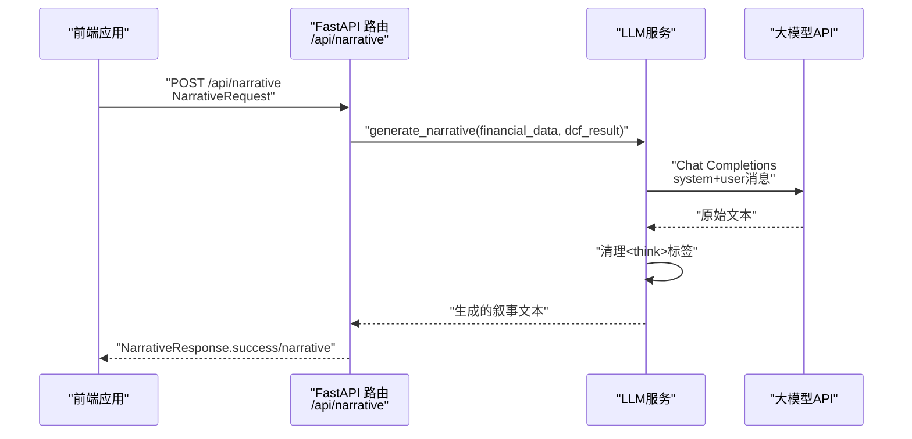
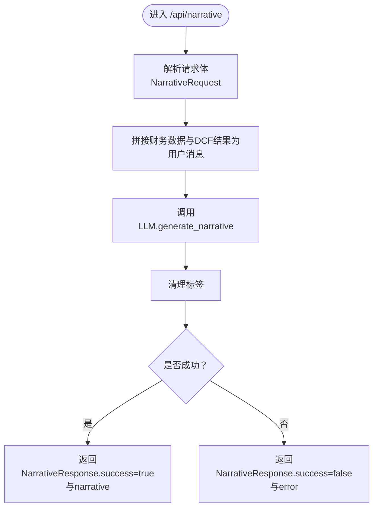
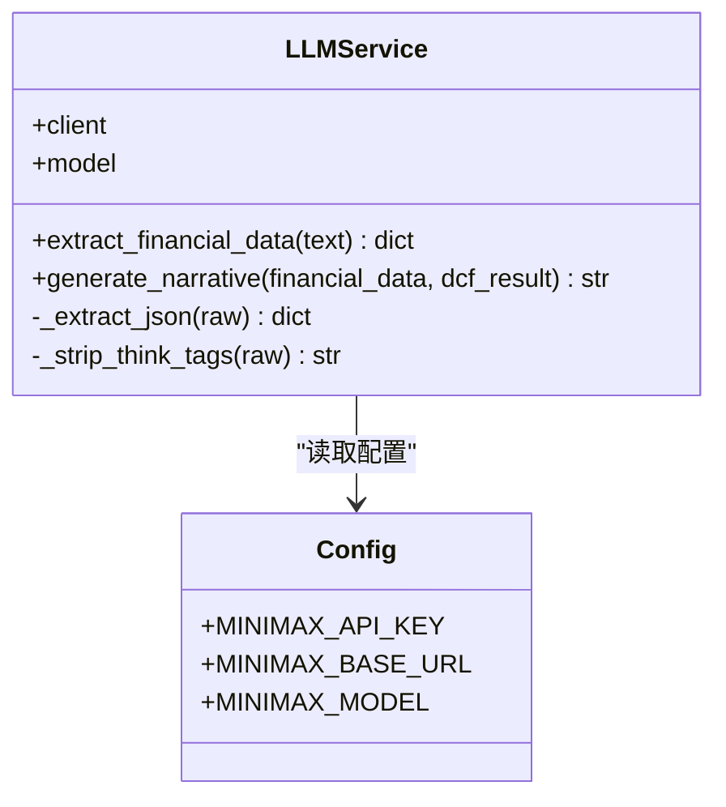
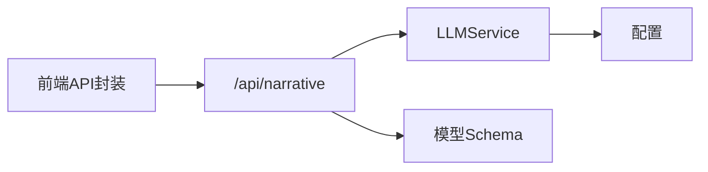

# 报告生成API

<cite>
**本文引用的文件**
- [backend/main.py](file://backend/main.py)
- [backend/api/report.py](file://backend/api/report.py)
- [backend/api/analysis.py](file://backend/api/analysis.py)
- [backend/services/llm_service.py](file://backend/services/llm_service.py)
- [backend/models/schemas.py](file://backend/models/schemas.py)
- [backend/config.py](file://backend/config.py)
- [backend/services/dcf_service.py](file://backend/services/dcf_service.py)
- [backend/services/extractor_service.py](file://backend/services/extractor_service.py)
- [frontend/src/services/api.ts](file://frontend/src/services/api.ts)
- [frontend/src/types/index.ts](file://frontend/src/types/index.ts)
- [frontend/src/pages/ResultPage.tsx](file://frontend/src/pages/ResultPage.tsx)
</cite>

## 目录
1. [简介](#简介)
2. [项目结构](#项目结构)
3. [核心组件](#核心组件)
4. [架构总览](#架构总览)
5. [详细组件分析](#详细组件分析)
6. [依赖分析](#依赖分析)
7. [性能考虑](#性能考虑)
8. [故障排查指南](#故障排查指南)
9. [结论](#结论)
10. [附录](#附录)

## 简介
本文件面向DCF估值智能体的“报告生成API”，聚焦于AI驱动的专业报告生成功能，覆盖自然语言生成、格式化输出与多语言支持。文档围绕POST /api/narrative接口展开，详解提示词模板使用、大模型调用流程与结果后处理；同时说明报告内容的结构化组织与个性化定制选项，并提供完整的API调用示例、响应格式与错误处理方案，以及报告质量控制、输出格式规范与性能监控策略。

## 项目结构
后端采用FastAPI框架，路由按功能模块划分：上传与解析、分析计算、报告导出占位。LLM服务封装了抽取与叙事生成两大能力；模型层定义了请求/响应的数据结构；前端通过Axios封装统一调用后端API。

图表来源
- [backend/main.py:18-34](file://backend/main.py#L18-L34)
- [backend/api/analysis.py:15-44](file://backend/api/analysis.py#L15-L44)
- [backend/api/report.py:5-11](file://backend/api/report.py#L5-L11)
- [backend/services/llm_service.py:70-155](file://backend/services/llm_service.py#L70-L155)
- [backend/services/dcf_service.py:85-120](file://backend/services/dcf_service.py#L85-L120)
- [backend/services/extractor_service.py:27-66](file://backend/services/extractor_service.py#L27-L66)
- [backend/config.py:10-22](file://backend/config.py#L10-L22)
- [frontend/src/services/api.ts:11-80](file://frontend/src/services/api.ts#L11-L80)
- [frontend/src/types/index.ts:98-103](file://frontend/src/types/index.ts#L98-L103)
- [frontend/src/pages/ResultPage.tsx:190-215](file://frontend/src/pages/ResultPage.tsx#L190-L215)

章节来源
- [backend/main.py:18-34](file://backend/main.py#L18-L34)
- [backend/api/analysis.py:15-44](file://backend/api/analysis.py#L15-L44)
- [backend/api/report.py:5-11](file://backend/api/report.py#L5-L11)
- [frontend/src/services/api.ts:11-80](file://frontend/src/services/api.ts#L11-L80)

## 核心组件
- LLM服务：负责抽取结构化财务数据与生成专业叙事报告。内置系统提示词模板，支持JSON提取与<think>标签清理。
- 分析路由：提供POST /api/narrative接口，接收NarrativeRequest，调用LLM生成叙事文本并返回NarrativeResponse。
- 数据模型：定义FinancialData、DCFResult、SensitivityMatrix、NarrativeRequest/NarrativeResponse等结构，确保前后端契约一致。
- 配置：集中管理大模型API密钥、基础URL、模型名与数据库连接参数。
- 前端集成：通过Axios封装统一调用，支持错误处理与超时设置；结果页展示生成的叙事文本。

章节来源
- [backend/services/llm_service.py:70-155](file://backend/services/llm_service.py#L70-L155)
- [backend/api/analysis.py:34-44](file://backend/api/analysis.py#L34-L44)
- [backend/models/schemas.py:85-96](file://backend/models/schemas.py#L85-L96)
- [backend/config.py:10-22](file://backend/config.py#L10-L22)
- [frontend/src/services/api.ts:71-80](file://frontend/src/services/api.ts#L71-L80)

## 架构总览
POST /api/narrative的端到端流程如下：

图表来源
- [backend/api/analysis.py:34-44](file://backend/api/analysis.py#L34-L44)
- [backend/services/llm_service.py:129-154](file://backend/services/llm_service.py#L129-L154)

## 详细组件分析

### POST /api/narrative 接口实现
- 请求体：NarrativeRequest，包含financial_data、dcf_result、可选sensitivity_matrix与language。
- 处理流程：
  1) 路由层接收请求并实例化LLMService。
  2) 调用generate_narrative，拼接财务数据与DCF结果为用户消息。
  3) 发送system提示词与用户消息给大模型，得到原始文本。
  4) 清理<think>思维标签，返回纯文本。
- 响应体：NarrativeResponse，success为布尔值，成功时包含narrative，失败时包含error。

图表来源
- [backend/api/analysis.py:34-44](file://backend/api/analysis.py#L34-L44)
- [backend/services/llm_service.py:129-154](file://backend/services/llm_service.py#L129-L154)

章节来源
- [backend/api/analysis.py:34-44](file://backend/api/analysis.py#L34-L44)
- [backend/models/schemas.py:85-96](file://backend/models/schemas.py#L85-L96)

### 提示词模板与系统指令
- 抽取模板：用于从财务报告中提取结构化数据，要求统一货币单位、正确转换单位、比率以小数形式返回、缺失值合理估算。
- 叙事模板：要求覆盖公司概览、收入与盈利趋势、WACC假设与理由、自由现金流预测摘要、终值方法论、估值结论与每股内在价值、关键风险与敏感性。
- 语言：模板明确要求使用与输入数据相同的语言进行写作，从而天然支持多语言输出。

章节来源
- [backend/services/llm_service.py:14-50](file://backend/services/llm_service.py#L14-L50)
- [backend/services/llm_service.py:52-67](file://backend/services/llm_service.py#L52-L67)

### LLM调用流程与结果后处理
- 客户端初始化：使用配置中的API密钥与基础URL，指定模型名。
- 调用参数：temperature与max_tokens用于控制创造性与输出长度。
- JSON提取：从LLM输出中剥离<think>块与代码围栏，定位首个JSON对象并解析。
- 文本清理：移除<think>思维过程，保留纯文本。
- 错误处理：捕获JSON解析异常与通用异常，记录日志并向上抛出或返回错误响应。

图表来源
- [backend/services/llm_service.py:70-155](file://backend/services/llm_service.py#L70-L155)
- [backend/config.py:10-22](file://backend/config.py#L10-L22)

章节来源
- [backend/services/llm_service.py:70-155](file://backend/services/llm_service.py#L70-L155)
- [backend/config.py:10-22](file://backend/config.py#L10-L22)

### 报告内容结构化组织与个性化定制
- 结构化组织：NarrativeRequest包含financial_data与dcf_result，确保叙事围绕具体财务指标与DCF结果展开；可选sensitivity_matrix用于补充敏感性分析维度。
- 个性化定制：language字段允许指定输出语言（当前模板已要求与输入同语），前端类型定义支持zh/en切换，便于国际化展示。
- 输出格式：NarrativeResponse返回纯文本，前端ResultPage直接渲染为预格式化文本，适合嵌入式展示与复制粘贴。

章节来源
- [backend/models/schemas.py:85-96](file://backend/models/schemas.py#L85-L96)
- [frontend/src/types/index.ts:98-103](file://frontend/src/types/index.ts#L98-L103)
- [frontend/src/pages/ResultPage.tsx:190-215](file://frontend/src/pages/ResultPage.tsx#L190-L215)

### 前后端API契约与调用示例
- 后端路由：POST /api/narrative，请求体为NarrativeRequest，响应体为NarrativeResponse。
- 前端封装：generateNarrative函数负责发送POST请求并处理错误。
- 示例调用路径：
  - 后端：[backend/api/analysis.py:34-44](file://backend/api/analysis.py#L34-L44)
  - 前端：[frontend/src/services/api.ts:71-80](file://frontend/src/services/api.ts#L71-L80)
  - 类型定义：[frontend/src/types/index.ts:98-103](file://frontend/src/types/index.ts#L98-L103)

章节来源
- [backend/api/analysis.py:34-44](file://backend/api/analysis.py#L34-L44)
- [frontend/src/services/api.ts:71-80](file://frontend/src/services/api.ts#L71-L80)
- [frontend/src/types/index.ts:98-103](file://frontend/src/types/index.ts#L98-L103)

## 依赖分析
- 组件耦合：
  - /api/narrative依赖LLMService与模型Schema。
  - LLMService依赖配置与外部大模型API。
  - 前端通过Axios与后端解耦，统一错误处理。
- 外部依赖：
  - OpenAI异步客户端（通过配置的MINIMAX_BASE_URL与MINIMAX_API_KEY）。
  - FastAPI路由与Pydantic模型校验。

图表来源
- [backend/api/analysis.py:34-44](file://backend/api/analysis.py#L34-L44)
- [backend/services/llm_service.py:70-76](file://backend/services/llm_service.py#L70-L76)
- [backend/config.py:10-22](file://backend/config.py#L10-L22)
- [frontend/src/services/api.ts:11-15](file://frontend/src/services/api.ts#L11-L15)

章节来源
- [backend/api/analysis.py:34-44](file://backend/api/analysis.py#L34-L44)
- [backend/services/llm_service.py:70-76](file://backend/services/llm_service.py#L70-L76)
- [backend/config.py:10-22](file://backend/config.py#L10-L22)
- [frontend/src/services/api.ts:11-15](file://frontend/src/services/api.ts#L11-L15)

## 性能考虑
- 超时与并发：
  - 前端Axios设置较长超时时间，适配大模型响应延迟。
  - FastAPI路由未显式限流，建议结合业务量增加速率限制与队列。
- 输出长度控制：
  - LLMService对用户消息进行截断与分段，避免上下文溢出。
  - 控制temperature与max_tokens平衡质量与速度。
- 缓存与复用：
  - 对重复的财务数据与DCF结果可考虑本地缓存，减少LLM调用次数。
- 日志与监控：
  - 记录LLM响应长度与异常堆栈，便于定位问题与评估质量。

[本节为通用指导，不直接分析具体文件]

## 故障排查指南
- 常见错误与处理：
  - LLM返回无效JSON：触发JSON解析异常，需检查提示词与输出格式一致性。
  - LLM调用失败：网络或鉴权问题，检查API密钥与基础URL配置。
  - 前端错误：Axios拦截器统一处理，优先读取后端返回的detail信息。
- 建议排查步骤：
  1) 确认环境变量与配置文件加载成功。
  2) 检查/health健康检查与路由注册状态。
  3) 查看后端日志中的错误堆栈与响应长度。
  4) 在前端控制台观察请求与响应详情。

章节来源
- [backend/services/llm_service.py:117-122](file://backend/services/llm_service.py#L117-L122)
- [backend/api/analysis.py:43-44](file://backend/api/analysis.py#L43-L44)
- [frontend/src/services/api.ts:17-26](file://frontend/src/services/api.ts#L17-L26)

## 结论
POST /api/narrative接口通过清晰的请求/响应契约与严谨的提示词模板，实现了从财务数据与DCF结果到专业叙事报告的自动化生成。LLMService承担了抽取与生成的核心职责，配合FastAPI路由与前端Axios封装，形成高内聚、低耦合的体系。建议在生产环境中强化速率限制、输出缓存与可观测性，以提升稳定性与用户体验。

[本节为总结性内容，不直接分析具体文件]

## 附录

### API定义与调用示例
- 端点：POST /api/narrative
- 请求体：NarrativeRequest
  - financial_data: FinancialData
  - dcf_result: DCFResult
  - sensitivity_matrix: SensitivityMatrix（可选）
  - language: Language（可选）
- 响应体：NarrativeResponse
  - success: boolean
  - narrative: string（可选）
  - error: string（可选）

调用示例路径：
- 后端路由：[backend/api/analysis.py:34-44](file://backend/api/analysis.py#L34-L44)
- 前端封装：[frontend/src/services/api.ts:71-80](file://frontend/src/services/api.ts#L71-L80)
- 类型定义：[frontend/src/types/index.ts:98-103](file://frontend/src/types/index.ts#L98-L103)

章节来源
- [backend/api/analysis.py:34-44](file://backend/api/analysis.py#L34-L44)
- [frontend/src/services/api.ts:71-80](file://frontend/src/services/api.ts#L71-L80)
- [frontend/src/types/index.ts:98-103](file://frontend/src/types/index.ts#L98-L103)

### 输出格式规范
- 文本格式：纯文本，适合在网页中以pre-wrap方式渲染。
- 展示位置：结果页折叠面板中，支持空态提示与占位符。
- 多语言：模板要求与输入数据同语，前端类型支持zh/en切换。

章节来源
- [frontend/src/pages/ResultPage.tsx:190-215](file://frontend/src/pages/ResultPage.tsx#L190-L215)
- [frontend/src/types/index.ts:1-2](file://frontend/src/types/index.ts#L1-L2)