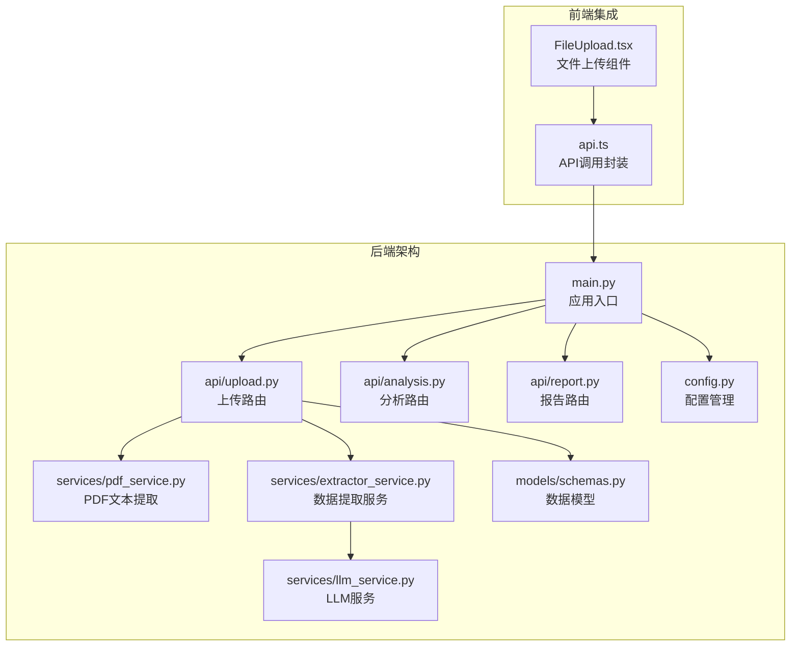
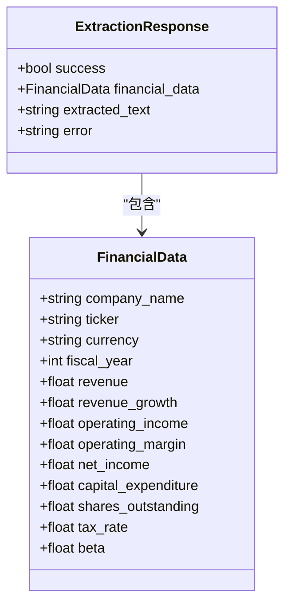
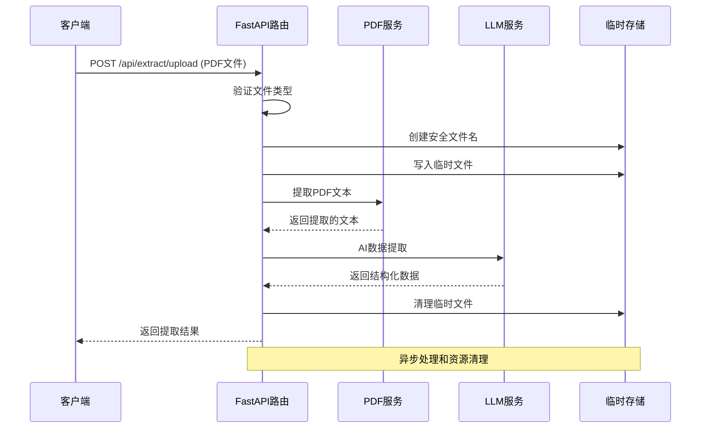
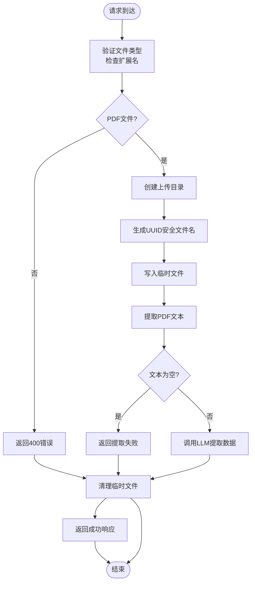
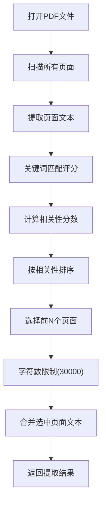
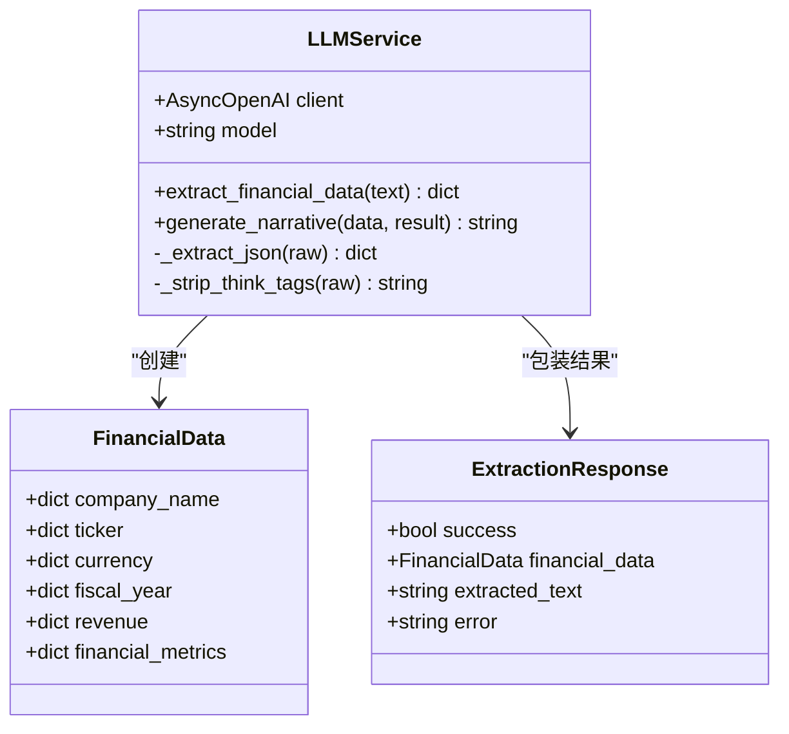
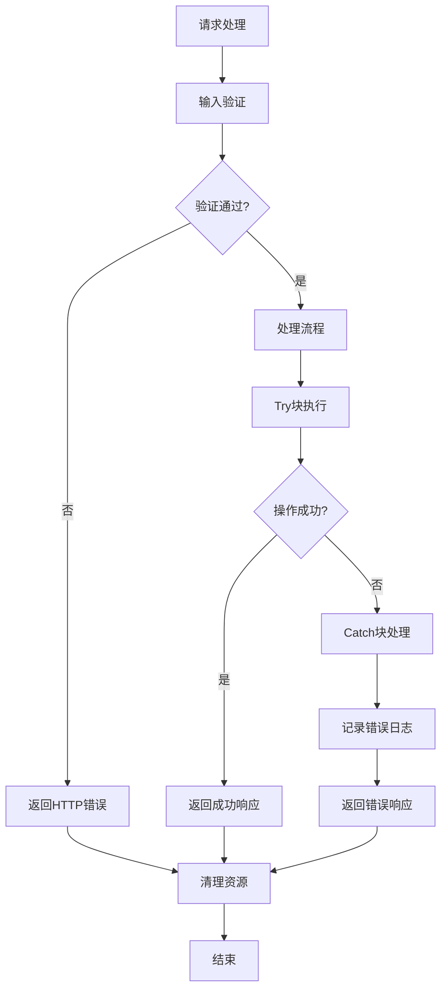
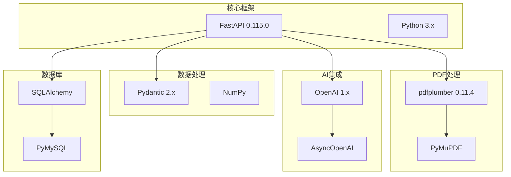
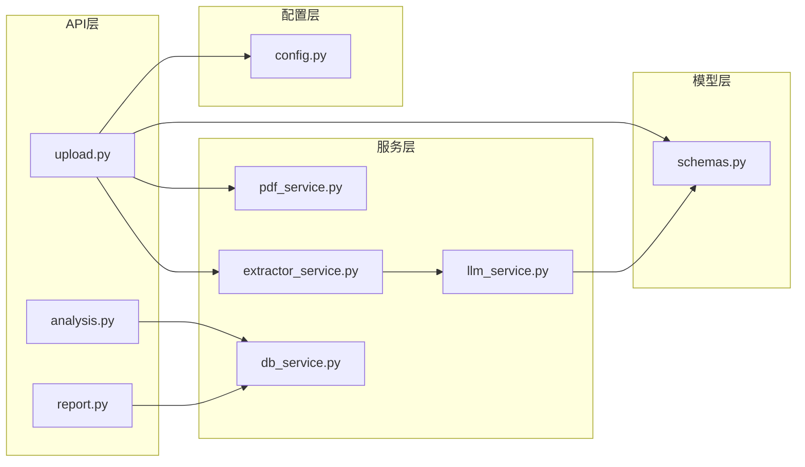
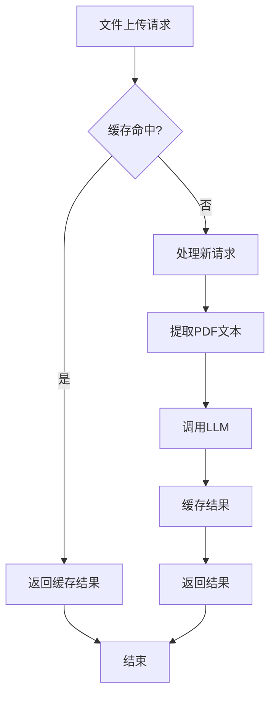

# 文件上传API

<cite>
**本文档引用的文件**
- [backend/api/upload.py](file://backend/api/upload.py)
- [backend/services/pdf_service.py](file://backend/services/pdf_service.py)
- [backend/services/extractor_service.py](file://backend/services/extractor_service.py)
- [backend/services/llm_service.py](file://backend/services/llm_service.py)
- [backend/models/schemas.py](file://backend/models/schemas.py)
- [backend/main.py](file://backend/main.py)
- [backend/config.py](file://backend/config.py)
- [backend/requirements.txt](file://backend/requirements.txt)
</cite>

## 目录
1. [简介](#简介)
2. [项目结构](#项目结构)
3. [核心组件](#核心组件)
4. [架构概览](#架构概览)
5. [详细组件分析](#详细组件分析)
6. [依赖关系分析](#依赖关系分析)
7. [性能考虑](#性能考虑)
8. [故障排除指南](#故障排除指南)
9. [结论](#结论)

## 简介

本文档详细介绍了DCF估值智能体的文件上传API，重点解释了PDF文件上传和自动数据提取的完整流程。该系统实现了从文件验证、安全存储到异步处理的完整工作流，支持PDF文本提取和AI数据提取的深度集成。

该API提供了两个核心端点：
- `POST /api/extract/upload` - 处理PDF文件上传和自动数据提取
- `POST /api/extract/text` - 直接从文本提取财务数据

## 项目结构

DCF估值智能体采用模块化的FastAPI架构设计，核心文件组织如下：

**图表来源**
- [backend/main.py:18-35](file://backend/main.py#L18-L35)
- [backend/api/upload.py:13-16](file://backend/api/upload.py#L13-L16)

**章节来源**
- [backend/main.py:1-40](file://backend/main.py#L1-L40)
- [backend/api/upload.py:1-55](file://backend/api/upload.py#L1-L55)

## 核心组件

### API路由器配置

上传API通过FastAPI路由器实现，位于`/api/extract`路径下，包含两个主要端点：

- **POST /api/extract/upload** - 处理PDF文件上传和自动提取
- **POST /api/extract/text** - 处理直接文本提取

### 数据模型定义

系统使用Pydantic模型确保数据结构的一致性和验证：

**图表来源**
- [backend/models/schemas.py:78-83](file://backend/models/schemas.py#L78-L83)
- [backend/models/schemas.py:8-30](file://backend/models/schemas.py#L8-L30)

**章节来源**
- [backend/models/schemas.py:1-101](file://backend/models/schemas.py#L1-L101)

## 架构概览

DCF文件上传API采用分层架构设计，实现了清晰的关注点分离：

**图表来源**
- [backend/api/upload.py:16-43](file://backend/api/upload.py#L16-L43)
- [backend/services/pdf_service.py:26-67](file://backend/services/pdf_service.py#L26-L67)
- [backend/services/extractor_service.py:27-66](file://backend/services/extractor_service.py#L27-L66)

## 详细组件分析

### 上传路由实现

#### POST /api/extract/upload 端点

该端点实现了完整的PDF文件处理流程：

**图表来源**
- [backend/api/upload.py:17-43](file://backend/api/upload.py#L17-L43)

#### 文件验证机制

系统实施了多层文件验证策略：

1. **扩展名验证**：严格检查`.pdf`扩展名
2. **文件名存在性**：确保文件名不为空
3. **内容类型验证**：通过文件扩展名间接验证

#### 安全存储策略

采用UUID命名策略确保文件安全性：

- **UUID生成**：使用`uuid.uuid4().hex`生成唯一标识符
- **原文件名保留**：在UUID基础上保留原始文件名
- **路径隔离**：使用独立的`temp_uploads`目录
- **自动清理**：无论成功与否都会删除临时文件

**章节来源**
- [backend/api/upload.py:16-43](file://backend/api/upload.py#L16-L43)
- [backend/config.py:21](file://backend/config.py#L21)

### PDF文本提取服务

#### 关键页面选择算法

PDF服务实现了智能的关键页面选择机制：

**图表来源**
- [backend/services/pdf_service.py:26-67](file://backend/services/pdf_service.py#L26-L67)

#### 文本提取优化

- **关键词识别**：支持中英文财务关键词
- **相关性评分**：基于关键词匹配度评分
- **字符数限制**：防止超大文档影响性能
- **页面排序**：优先提取最相关的页面

**章节来源**
- [backend/services/pdf_service.py:1-68](file://backend/services/pdf_service.py#L1-L68)

### AI数据提取服务

#### LLM集成架构

AI数据提取通过LLM服务实现：

**图表来源**
- [backend/services/llm_service.py:70-155](file://backend/services/llm_service.py#L70-L155)
- [backend/models/schemas.py:78-83](file://backend/models/schemas.py#L78-L83)

#### 数据提取流程

1. **提示词工程**：精心设计的系统提示词
2. **JSON输出解析**：自动提取和验证JSON格式
3. **数据类型转换**：安全的数值类型转换
4. **默认值处理**：缺失数据的合理填充

**章节来源**
- [backend/services/extractor_service.py:1-67](file://backend/services/extractor_service.py#L1-L67)
- [backend/services/llm_service.py:14-50](file://backend/services/llm_service.py#L14-L50)

### 错误处理机制

系统实现了多层次的错误处理：

**图表来源**
- [backend/api/upload.py:38-39](file://backend/api/upload.py#L38-L39)
- [backend/services/extractor_service.py:61-66](file://backend/services/extractor_service.py#L61-L66)

**章节来源**
- [backend/api/upload.py:38-43](file://backend/api/upload.py#L38-L43)
- [backend/services/extractor_service.py:61-66](file://backend/services/extractor_service.py#L61-L66)

## 依赖关系分析

### 外部依赖

系统依赖于以下关键库：

**图表来源**
- [backend/requirements.txt:1-11](file://backend/requirements.txt#L1-L11)

### 内部模块依赖

**图表来源**
- [backend/api/upload.py:8-11](file://backend/api/upload.py#L8-L11)
- [backend/services/extractor_service.py:5-6](file://backend/services/extractor_service.py#L5-L6)

**章节来源**
- [backend/requirements.txt:1-11](file://backend/requirements.txt#L1-L11)

## 性能考虑

### 并发处理能力

系统采用异步架构设计，具备良好的并发处理能力：

- **异步I/O**：PDF读取和LLM调用均为异步操作
- **内存管理**：及时清理临时文件，避免内存泄漏
- **字符限制**：PDF文本提取设置30000字符上限，防止内存溢出

### 缓存策略

### 性能优化建议

1. **批量处理**：对于大量文件，考虑实现批量处理队列
2. **预加载模型**：在应用启动时预加载LLM模型
3. **连接池**：使用数据库连接池减少连接开销
4. **压缩传输**：考虑对大文件进行压缩传输

## 故障排除指南

### 常见错误及解决方案

| 错误类型 | 错误码 | 可能原因 | 解决方案 |
|---------|--------|----------|----------|
| 文件类型错误 | 400 | 非PDF文件上传 | 确保上传PDF格式文件 |
| 文件过大 | 500 | 超过字符限制 | 分割PDF或优化文本提取 |
| LLM调用失败 | 500 | API密钥或网络问题 | 检查环境变量配置 |
| 存储空间不足 | 500 | 临时目录空间不足 | 清理临时文件或增加磁盘空间 |

### 日志监控

系统实现了全面的日志记录：

- **PDF处理日志**：记录PDF页数、提取字符数
- **LLM调用日志**：记录响应长度和处理时间
- **错误日志**：捕获并记录所有异常信息

**章节来源**
- [backend/services/pdf_service.py:63-67](file://backend/services/pdf_service.py#L63-L67)
- [backend/services/llm_service.py:113-122](file://backend/services/llm_service.py#L113-L122)

## 结论

DCF估值智能体的文件上传API展现了现代AI驱动应用的最佳实践。通过模块化设计、异步处理和完善的错误管理，该系统能够高效地处理PDF文件并提取关键财务数据。

### 主要优势

1. **安全性**：UUID命名策略和临时文件管理确保文件安全
2. **可扩展性**：模块化架构便于功能扩展和维护
3. **可靠性**：完善的错误处理和日志记录机制
4. **性能**：异步处理和字符限制优化系统性能

### 改进建议

1. **文件大小限制**：添加明确的文件大小限制配置
2. **进度反馈**：为长时间处理提供进度反馈机制
3. **重试机制**：实现失败重试和断点续传功能
4. **监控仪表板**：添加系统性能和使用情况监控

该API为DCF估值提供了坚实的技术基础，能够支持企业级的财务数据分析需求。