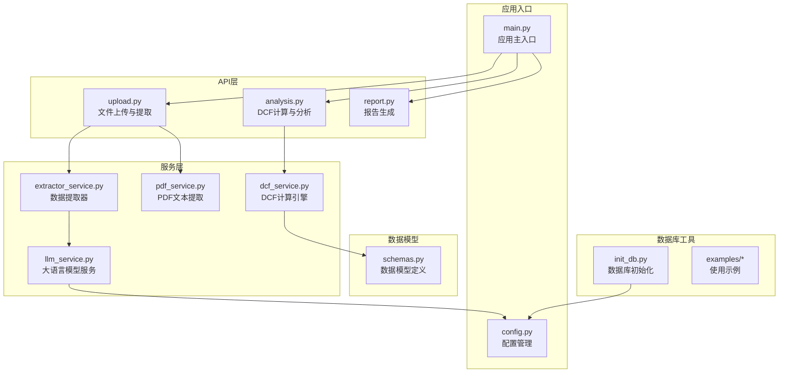
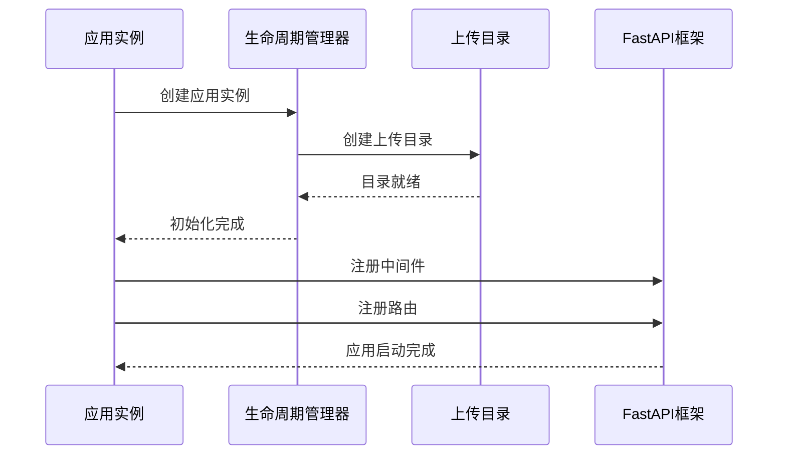
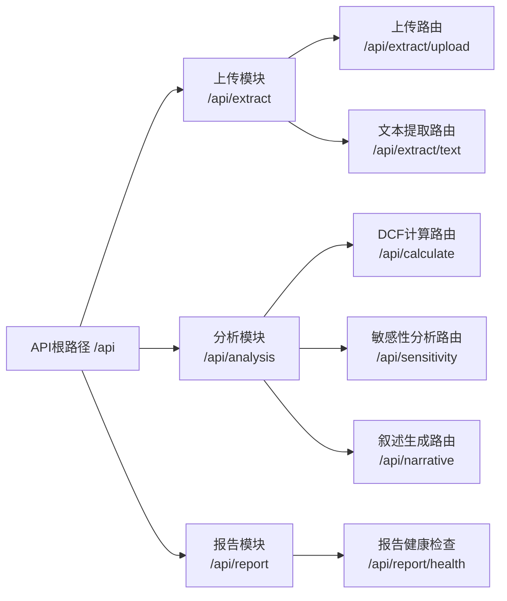
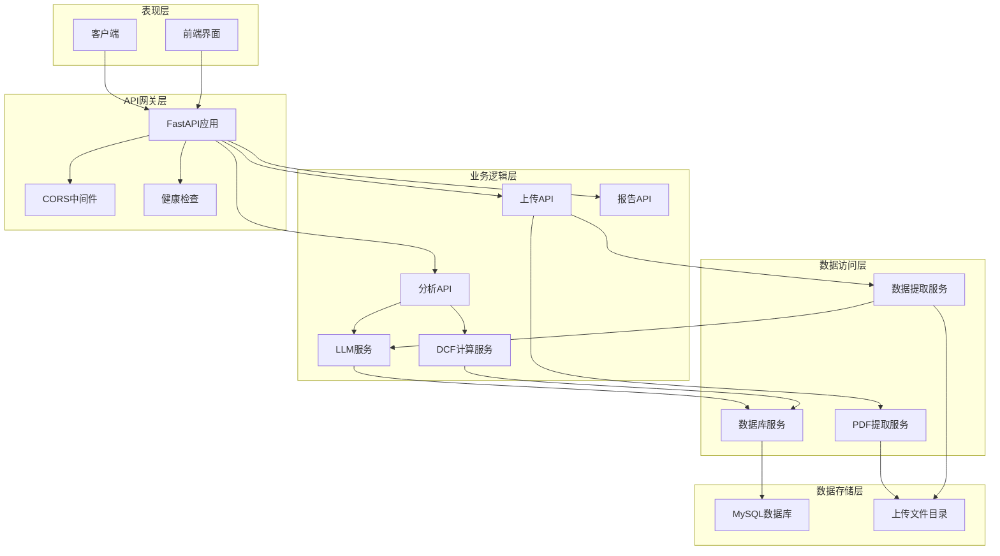
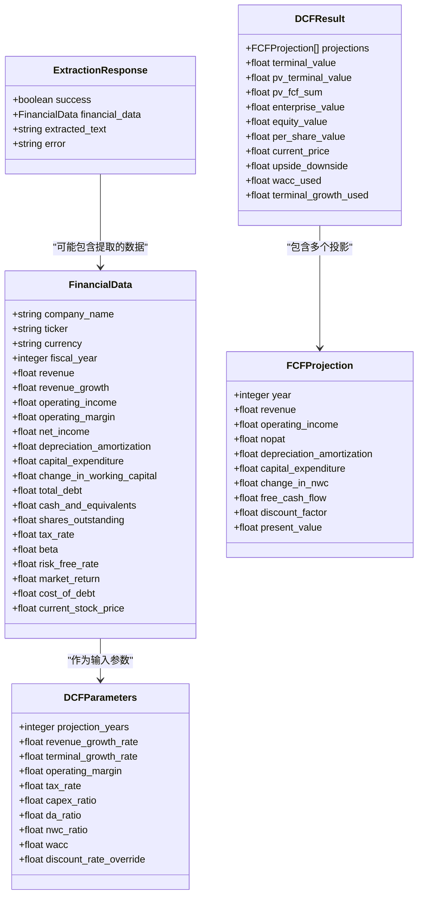
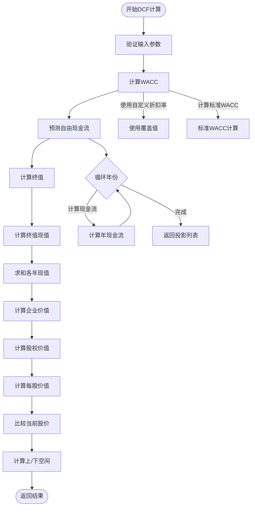
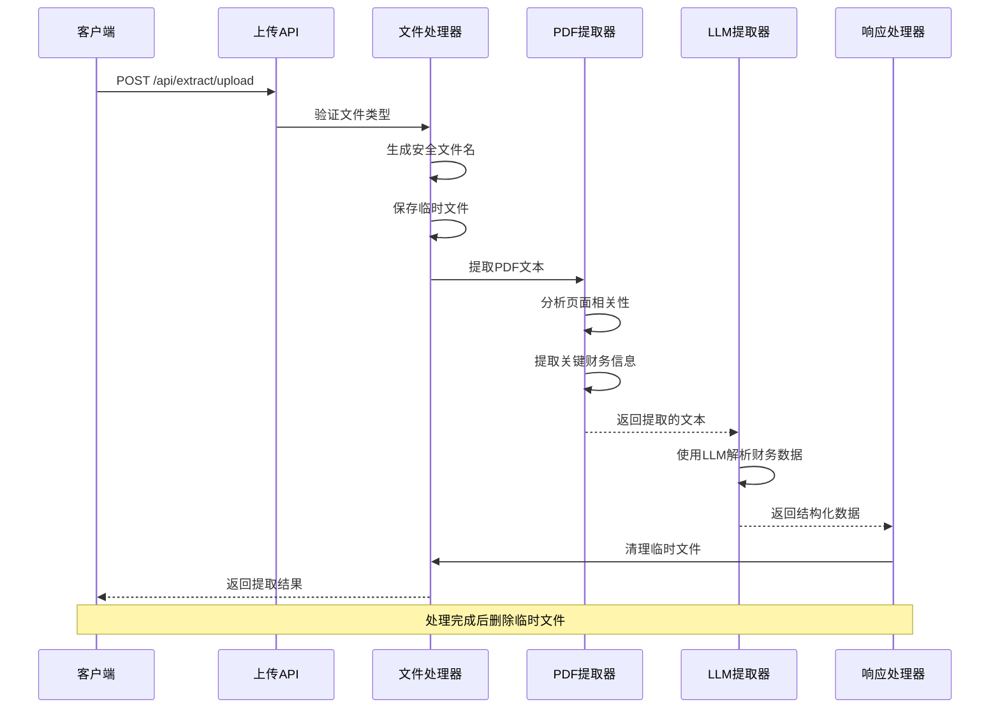
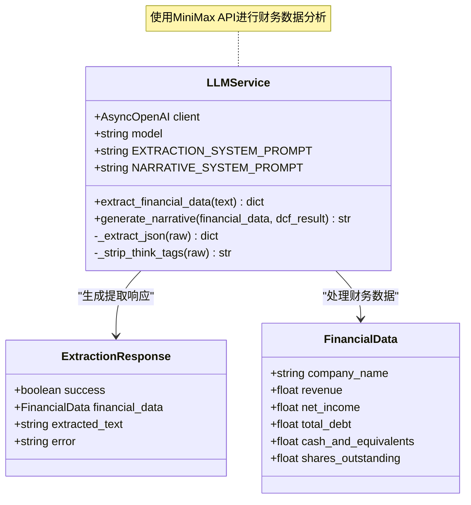
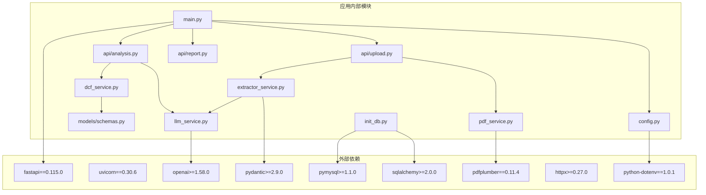
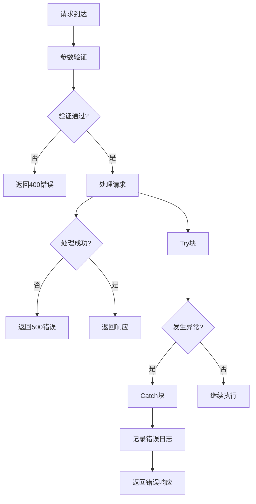

# FastAPI应用架构

<cite>
**本文档引用的文件**
- [backend/main.py](file://backend/main.py)
- [backend/config.py](file://backend/config.py)
- [backend/api/upload.py](file://backend/api/upload.py)
- [backend/api/analysis.py](file://backend/api/analysis.py)
- [backend/api/report.py](file://backend/api/report.py)
- [backend/models/schemas.py](file://backend/models/schemas.py)
- [backend/services/dcf_service.py](file://backend/services/dcf_service.py)
- [backend/services/llm_service.py](file://backend/services/llm_service.py)
- [backend/services/pdf_service.py](file://backend/services/pdf_service.py)
- [backend/services/extractor_service.py](file://backend/services/extractor_service.py)
- [backend/init_db.py](file://backend/init_db.py)
- [backend/examples/db_usage_example.py](file://backend/examples/db_usage_example.py)
- [backend/examples/integration_example.py](file://backend/examples/integration_example.py)
- [backend/requirements.txt](file://backend/requirements.txt)
</cite>

## 目录
1. [简介](#简介)
2. [项目结构](#项目结构)
3. [核心组件](#核心组件)
4. [架构概览](#架构概览)
5. [详细组件分析](#详细组件分析)
6. [依赖分析](#依赖分析)
7. [性能考虑](#性能考虑)
8. [故障排除指南](#故障排除指南)
9. [结论](#结论)
10. [附录](#附录)

## 简介

DCF估值智能体是一个基于FastAPI构建的企业估值分析平台，专注于通过现金流贴现模型为企业提供价值评估。该应用集成了PDF文本提取、大语言模型分析、财务数据处理和数据库存储等功能模块，为用户提供完整的DCF估值解决方案。

应用采用现代化的微服务架构设计，通过清晰的分层结构实现了业务逻辑的模块化管理。系统支持多语言接口、灵活的配置管理和可扩展的服务架构，能够适应不同规模和需求的企业估值场景。

## 项目结构

后端项目采用功能驱动的目录组织方式，将相关功能模块按职责进行分离：

**图表来源**
- [backend/main.py:1-40](file://backend/main.py#L1-L40)
- [backend/config.py:1-22](file://backend/config.py#L1-L22)

**章节来源**
- [backend/main.py:1-40](file://backend/main.py#L1-L40)
- [backend/config.py:1-22](file://backend/config.py#L1-L22)

## 核心组件

### 应用初始化与生命周期管理

应用通过异步上下文管理器实现生命周期管理，确保资源的正确初始化和清理：

**图表来源**
- [backend/main.py:12-22](file://backend/main.py#L12-L22)

应用的核心配置包括：
- **标题**: "DCF Valuation Agent API"
- **版本**: "1.0.0"
- **生命周期**: 异步上下文管理器负责上传目录的创建和清理
- **CORS策略**: 允许所有源、方法和头部，支持凭据传递

### 路由组织与URL前缀管理

应用采用统一的URL前缀策略，所有API路由都使用"/api"前缀：

**图表来源**
- [backend/main.py:32-34](file://backend/main.py#L32-L34)
- [backend/api/upload.py:13](file://backend/api/upload.py#L13)
- [backend/api/analysis.py:15](file://backend/api/analysis.py#L15)
- [backend/api/report.py:5](file://backend/api/report.py#L5)

**章节来源**
- [backend/main.py:18-39](file://backend/main.py#L18-L39)
- [backend/api/upload.py:13](file://backend/api/upload.py#L13)
- [backend/api/analysis.py:15](file://backend/api/analysis.py#L15)
- [backend/api/report.py:5](file://backend/api/report.py#L5)

## 架构概览

应用采用分层架构设计，各层之间职责明确，耦合度低：

**图表来源**
- [backend/main.py:18-39](file://backend/main.py#L18-L39)
- [backend/api/upload.py:16-54](file://backend/api/upload.py#L16-L54)
- [backend/api/analysis.py:18-44](file://backend/api/analysis.py#L18-L44)

## 详细组件分析

### 数据模型层

数据模型采用Pydantic定义，提供了类型安全的数据结构和验证机制：

**图表来源**
- [backend/models/schemas.py:8-101](file://backend/models/schemas.py#L8-L101)

**章节来源**
- [backend/models/schemas.py:1-101](file://backend/models/schemas.py#L1-L101)

### DCF计算引擎

DCF计算引擎实现了完整的现金流贴现估值算法：

**图表来源**
- [backend/services/dcf_service.py:85-121](file://backend/services/dcf_service.py#L85-L121)
- [backend/services/dcf_service.py:123-163](file://backend/services/dcf_service.py#L123-L163)

**章节来源**
- [backend/services/dcf_service.py:1-163](file://backend/services/dcf_service.py#L1-L163)

### 文件上传与PDF提取

文件处理流程支持PDF上传和文本提取两种模式：

**图表来源**
- [backend/api/upload.py:16-43](file://backend/api/upload.py#L16-L43)
- [backend/services/pdf_service.py:26-67](file://backend/services/pdf_service.py#L26-L67)
- [backend/services/extractor_service.py:27-66](file://backend/services/extractor_service.py#L27-L66)

**章节来源**
- [backend/api/upload.py:1-55](file://backend/api/upload.py#L1-L55)
- [backend/services/pdf_service.py:1-68](file://backend/services/pdf_service.py#L1-L68)
- [backend/services/extractor_service.py:1-67](file://backend/services/extractor_service.py#L1-L67)

### 大语言模型集成

LLM服务集成了多种提示词模板和错误处理机制：

**图表来源**
- [backend/services/llm_service.py:70-155](file://backend/services/llm_service.py#L70-L155)

**章节来源**
- [backend/services/llm_service.py:1-155](file://backend/services/llm_service.py#L1-L155)

## 依赖分析

应用的依赖关系体现了清晰的分层架构和模块化设计：

**图表来源**
- [backend/requirements.txt:1-11](file://backend/requirements.txt#L1-L11)
- [backend/main.py:5-6](file://backend/main.py#L5-L6)

**章节来源**
- [backend/requirements.txt:1-11](file://backend/requirements.txt#L1-L11)

## 性能考虑

### 并发处理与异步编程

应用充分利用了Python的异步特性，特别是在I/O密集型操作中：

- **异步文件处理**: PDF提取和文本处理采用异步模式
- **异步LLM调用**: 大语言模型请求使用异步客户端
- **异步数据库操作**: 数据库连接和查询支持异步执行

### 缓存策略

建议实施以下缓存策略以提升性能：

- **LLM响应缓存**: 对重复的财务数据提取请求进行缓存
- **计算结果缓存**: 缓存DCF计算结果，避免重复计算
- **文件内容缓存**: 对已处理的PDF文件内容进行缓存

### 资源管理

- **连接池管理**: 数据库连接使用连接池减少连接开销
- **文件清理**: 自动清理临时上传文件，防止磁盘空间占用
- **内存优化**: 对大型PDF文件进行分页处理，避免内存溢出

## 故障排除指南

### 常见问题诊断

**数据库连接问题**:
- 检查MySQL服务器状态和网络连通性
- 验证数据库凭据和连接参数
- 确认数据库用户权限设置

**LLM服务异常**:
- 验证API密钥配置
- 检查网络连接和防火墙设置
- 确认API端点可达性

**文件处理失败**:
- 检查上传目录权限和磁盘空间
- 验证PDF文件格式和完整性
- 确认PDFPlumber依赖安装正确

### 错误处理机制

应用实现了多层次的错误处理：

**章节来源**
- [backend/api/upload.py:19-20](file://backend/api/upload.py#L19-L20)
- [backend/api/analysis.py:22-23](file://backend/api/analysis.py#L22-L23)

## 结论

DCF估值智能体应用展现了现代FastAPI应用的最佳实践，通过清晰的架构设计、完善的错误处理机制和灵活的配置管理，为用户提供了一个功能完整的企业估值平台。

应用的主要优势包括：
- **模块化设计**: 清晰的功能分层和职责分离
- **类型安全**: 基于Pydantic的数据验证和序列化
- **异步处理**: 高效的并发处理能力
- **可扩展性**: 易于添加新功能和服务
- **生产就绪**: 完善的配置管理和错误处理

未来可以考虑的改进方向：
- 实施更细粒度的权限控制
- 添加API限流和防滥用机制
- 集成监控和日志分析系统
- 实现更丰富的报告生成功能

## 附录

### 配置选项说明

应用支持多种配置选项，可通过环境变量进行定制：

**数据库配置**:
- `MYSQL_HOST`: MySQL服务器地址，默认"localhost"
- `MYSQL_USER`: 数据库用户名，默认"root"
- `MYSQL_PASSWORD`: 数据库密码
- `MYSQL_PORT`: 数据库端口，默认3306
- `MYSQL_DATABASE`: 数据库名称，默认"dcf_estimation"

**LLM配置**:
- `MINIMAX_API_KEY`: MiniMax API密钥
- `MINIMAX_BASE_URL`: API基础URL，默认"https://api.minimaxi.com/v1"
- `MINIMAX_MODEL`: 使用的模型，默认"MiniMax-M2.7-highspeed"

**文件配置**:
- `UPLOAD_DIR`: 上传文件目录，默认"backend/temp_uploads"

### 启动和部署指南

**开发环境启动**:
1. 安装依赖: `pip install -r backend/requirements.txt`
2. 设置环境变量: 创建`.env`文件配置数据库和API密钥
3. 初始化数据库: 运行`python backend/init_db.py`
4. 启动应用: `uvicorn backend.main:app --reload`

**生产环境部署**:
1. 配置生产数据库连接
2. 设置适当的日志级别和监控
3. 配置反向代理和SSL证书
4. 实施负载均衡和自动扩缩容
5. 设置备份和灾难恢复策略