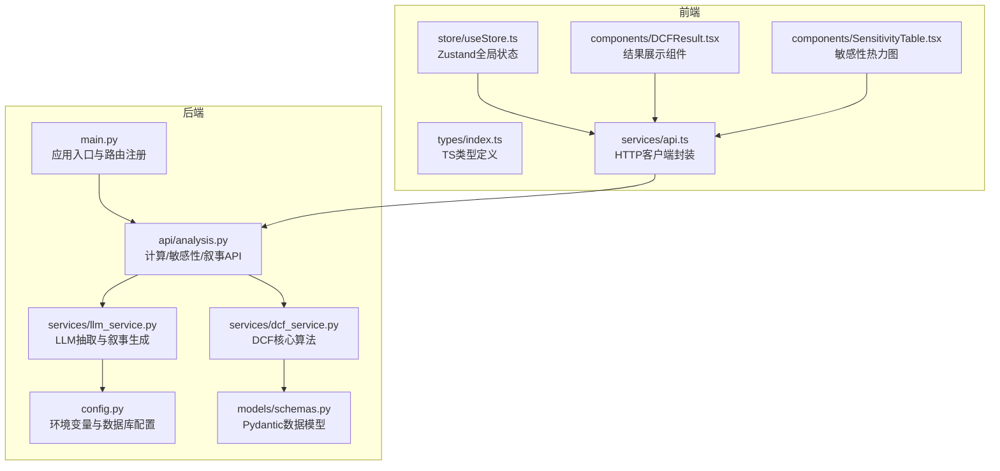
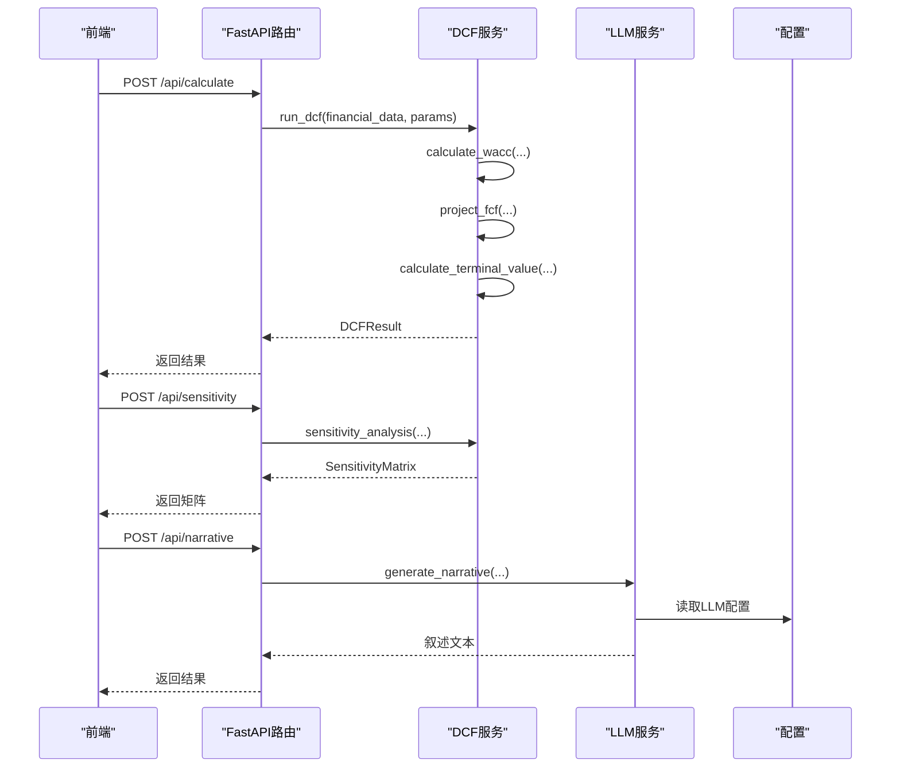
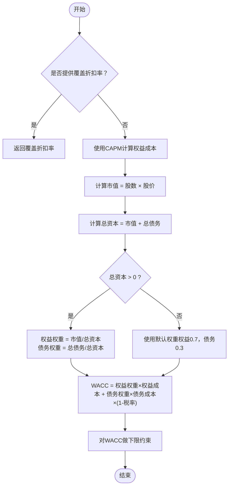
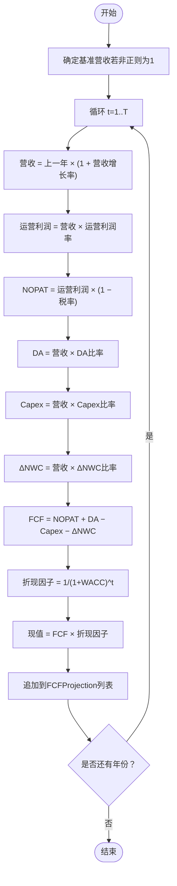
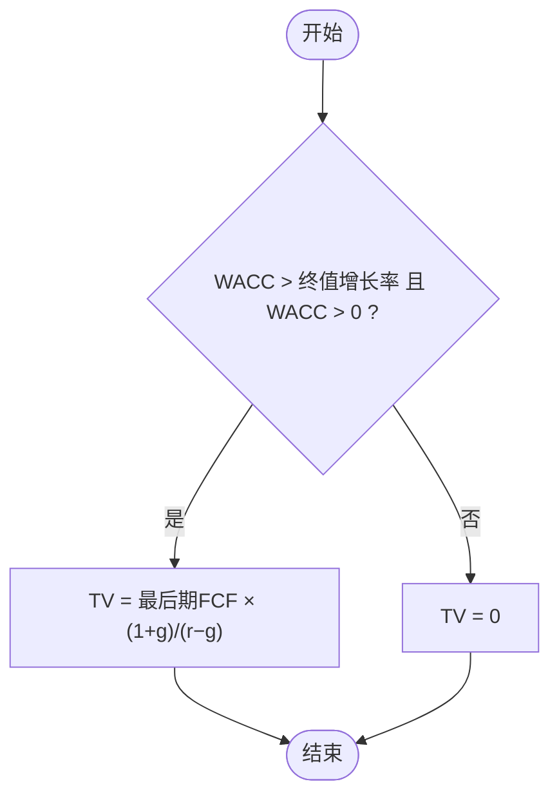
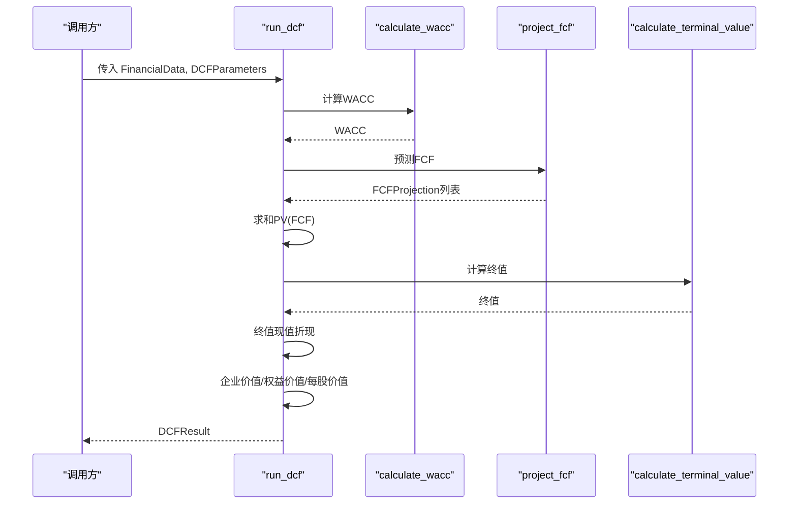
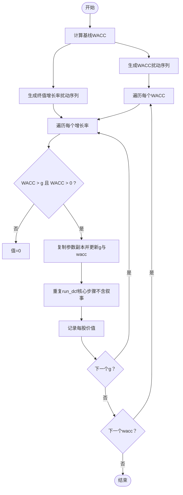
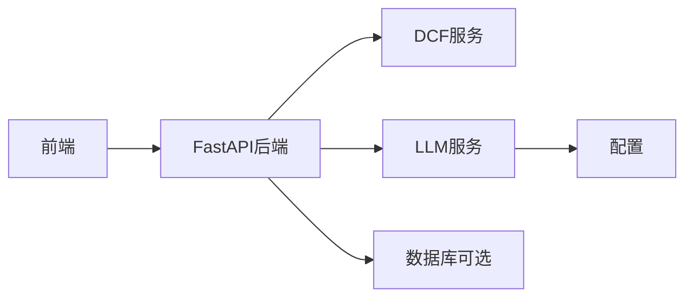

# DCF计算引擎

<cite>
**本文引用的文件列表**
- [backend/services/dcf_service.py](file://backend/services/dcf_service.py)
- [backend/models/schemas.py](file://backend/models/schemas.py)
- [backend/api/analysis.py](file://backend/api/analysis.py)
- [backend/main.py](file://backend/main.py)
- [backend/config.py](file://backend/config.py)
- [backend/services/llm_service.py](file://backend/services/llm_service.py)
- [frontend/src/types/index.ts](file://frontend/src/types/index.ts)
- [frontend/src/store/useStore.ts](file://frontend/src/store/useStore.ts)
- [frontend/src/components/DCFResult.tsx](file://frontend/src/components/DCFResult.tsx)
- [frontend/src/components/SensitivityTable.tsx](file://frontend/src/components/SensitivityTable.tsx)
- [frontend/src/services/api.ts](file://frontend/src/services/api.ts)
- [backend/requirements.txt](file://backend/requirements.txt)
</cite>

## 目录
1. [简介](#简介)
2. [项目结构](#项目结构)
3. [核心组件](#核心组件)
4. [架构总览](#架构总览)
5. [详细组件分析](#详细组件分析)
6. [依赖关系分析](#依赖关系分析)
7. [性能考量](#性能考量)
8. [故障排查指南](#故障排查指南)
9. [结论](#结论)
10. [附录](#附录)

## 简介
本技术文档面向DCF估值计算引擎，系统性阐述后端服务的算法实现与前后端集成方式，重点覆盖以下内容：
- WACC加权平均资本成本计算逻辑与资本结构权重来源
- 自由现金流（FCF）预测模型与折现处理
- 终值（Terminal Value）计算与永续增长模型
- 主流程 run_dcf 的完整计算步骤与数据结构转换
- 敏感性分析（sensitivity_analysis）的实现原理与参数调整策略
- 数学公式推导、算法复杂度分析与性能优化建议
- 如何扩展新的估值参数与调整计算精度

## 项目结构
后端采用FastAPI框架，按功能模块划分：API路由、业务服务、数据模型与配置；前端采用React + TypeScript + Zustand状态管理，通过Axios调用后端接口。

图表来源
- [backend/main.py:18-35](file://backend/main.py#L18-L35)
- [backend/api/analysis.py:18-44](file://backend/api/analysis.py#L18-L44)
- [backend/services/dcf_service.py:12-163](file://backend/services/dcf_service.py#L12-L163)
- [backend/services/llm_service.py:70-155](file://backend/services/llm_service.py#L70-L155)
- [backend/models/schemas.py:8-101](file://backend/models/schemas.py#L8-L101)
- [frontend/src/types/index.ts:4-128](file://frontend/src/types/index.ts#L4-L128)
- [frontend/src/store/useStore.ts:23-74](file://frontend/src/store/useStore.ts#L23-L74)
- [frontend/src/components/DCFResult.tsx:30-137](file://frontend/src/components/DCFResult.tsx#L30-L137)
- [frontend/src/components/SensitivityTable.tsx:9-98](file://frontend/src/components/SensitivityTable.tsx#L9-L98)
- [frontend/src/services/api.ts:11-81](file://frontend/src/services/api.ts#L11-L81)

章节来源
- [backend/main.py:18-35](file://backend/main.py#L18-L35)
- [backend/api/analysis.py:18-44](file://backend/api/analysis.py#L18-L44)
- [backend/services/dcf_service.py:12-163](file://backend/services/dcf_service.py#L12-L163)
- [backend/models/schemas.py:8-101](file://backend/models/schemas.py#L8-L101)
- [frontend/src/types/index.ts:4-128](file://frontend/src/types/index.ts#L4-L128)
- [frontend/src/store/useStore.ts:23-74](file://frontend/src/store/useStore.ts#L23-L74)
- [frontend/src/components/DCFResult.tsx:30-137](file://frontend/src/components/DCFResult.tsx#L30-L137)
- [frontend/src/components/SensitivityTable.tsx:9-98](file://frontend/src/components/SensitivityTable.tsx#L9-L98)
- [frontend/src/services/api.ts:11-81](file://frontend/src/services/api.ts#L11-L81)

## 核心组件
- 数据模型层：定义金融数据、DCF参数、FCF投影、结果与敏感性矩阵等结构，确保前后端一致的数据契约。
- 业务服务层：实现DCF核心算法（WACC、FCF预测、终值、主流程）、敏感性分析与LLM辅助抽取/叙事。
- API层：暴露计算、敏感性分析、叙事生成等REST接口。
- 前端层：类型定义、状态管理、可视化组件与HTTP客户端。

章节来源
- [backend/models/schemas.py:8-101](file://backend/models/schemas.py#L8-L101)
- [backend/services/dcf_service.py:12-163](file://backend/services/dcf_service.py#L12-L163)
- [backend/api/analysis.py:18-44](file://backend/api/analysis.py#L18-L44)
- [frontend/src/types/index.ts:4-128](file://frontend/src/types/index.ts#L4-L128)
- [frontend/src/store/useStore.ts:23-74](file://frontend/src/store/useStore.ts#L23-L74)

## 架构总览
后端通过FastAPI提供REST接口，前端通过Axios调用，LLM服务用于抽取与生成叙述。核心计算集中在DCF服务模块。

图表来源
- [backend/api/analysis.py:18-44](file://backend/api/analysis.py#L18-L44)
- [backend/services/dcf_service.py:85-121](file://backend/services/dcf_service.py#L85-L121)
- [backend/services/dcf_service.py:123-163](file://backend/services/dcf_service.py#L123-L163)
- [backend/services/llm_service.py:129-155](file://backend/services/llm_service.py#L129-L155)
- [backend/config.py:10-22](file://backend/config.py#L10-L22)

## 详细组件分析

### WACC加权平均资本成本计算（calculate_wacc）
- 输入：FinancialData（含β、市场风险溢价、无风险利率、债务成本、税率、总债务、流通股数、当前股价等），DCFParameters（含覆盖折扣率字段）。
- 计算步骤：
  1) 若显式提供覆盖折扣率，则直接返回该值。
  2) 使用CAPM计算权益成本：权益成本 = 无风险利率 + β × (市场回报率 − 无风险利率)。
  3) 计算市值与总资本，并据此得到权益权重与债务权重（若总资本为0则使用默认权重）。
  4) 加权计算WACC：WACC = 权益权重 × 权益成本 + 债务权重 × 债务成本 × (1 − 税率)。
  5) 对WACC进行下限约束（避免过低导致数值不稳定）。
- 关键点：
  - 资本结构权重来自市值与总债务，未考虑优先股与少数股东权益。
  - 若未提供当前股价或总股本，市值可能为0，此时使用默认权重。
- 复杂度：O(1)。

图表来源
- [backend/services/dcf_service.py:12-34](file://backend/services/dcf_service.py#L12-L34)

章节来源
- [backend/services/dcf_service.py:12-34](file://backend/services/dcf_service.py#L12-L34)
- [backend/models/schemas.py:8-30](file://backend/models/schemas.py#L8-L30)
- [backend/models/schemas.py:32-43](file://backend/models/schemas.py#L32-L43)

### 自由现金流预测（project_fcf）
- 输入：FinancialData、DCFParameters、WACC。
- 预测逻辑：
  1) 以历史营收为基准（若为非正数则设为1），按年增长率逐期增长。
  2) 计算各期运营利润、NOPAT、折旧摊销、资本支出、营运资本变动。
  3) FCF = NOPAT + 折旧摊销 − 资本支出 − 营运资本变动。
  4) 按 WACC 计算折现因子与现值，累积得到预测期内FCF现值之和。
- 输出：FCFProjection 列表，包含每一年的收入、利润、FCF、折现因子与现值。
- 复杂度：O(T)，T为预测年数。

图表来源
- [backend/services/dcf_service.py:37-76](file://backend/services/dcf_service.py#L37-L76)

章节来源
- [backend/services/dcf_service.py:37-76](file://backend/services/dcf_service.py#L37-L76)
- [backend/models/schemas.py:45-56](file://backend/models/schemas.py#L45-L56)
- [backend/models/schemas.py:32-43](file://backend/models/schemas.py#L32-L43)

### 终值计算（calculate_terminal_value）
- 模型：永续增长模型（戈顿增长模型）。
- 公式：TV = 最后期FCF × (1 + 终值增长率) / (WACC − 终值增长率)
- 边界条件：当 WACC ≤ 终值增长率 或 WACC ≤ 0 时，返回0，避免数值异常。
- 复杂度：O(1)。

图表来源
- [backend/services/dcf_service.py:79-82](file://backend/services/dcf_service.py#L79-L82)

章节来源
- [backend/services/dcf_service.py:79-82](file://backend/services/dcf_service.py#L79-L82)

### 主流程 run_dcf
- 步骤：
  1) 若参数中显式提供WACC则直接使用，否则调用 calculate_wacc 计算。
  2) 调用 project_fcf 得到预测期内FCF及其现值。
  3) 计算终值与终值现值（按第T年的折现因子折现）。
  4) 企业价值 = 预测期内FCF现值之和 + 终值现值。
  5) 权益价值 = 企业价值 − 总债务 + 现金及等价物。
  6) 每股价值 = 权益价值 / 流通股数（若为0则取1）。
  7) 若存在当前股价，计算相对偏差（上/下）。
  8) 封装为 DCFResult 返回。
- 复杂度：O(T)。

图表来源
- [backend/services/dcf_service.py:85-121](file://backend/services/dcf_service.py#L85-L121)

章节来源
- [backend/services/dcf_service.py:85-121](file://backend/services/dcf_service.py#L85-L121)
- [backend/models/schemas.py:58-70](file://backend/models/schemas.py#L58-L70)

### 敏感性分析（sensitivity_analysis）
- 目标：评估WACC与终值增长率变化对每股价值的影响，形成二维矩阵。
- 方法：
  1) 固定基线WACC与终值增长率，分别在一定范围内扰动。
  2) 对每个组合构造临时参数副本，重复执行 run_dcf 的核心步骤（不包含叙事）。
  3) 将结果映射为每行（WACC扰动序列）× 每列（终值增长率扰动序列）的矩阵。
  4) 返回 SensitivityMatrix 结构，包含两轴范围与二维数值矩阵。
- 参数扰动范围：
  - WACC：±2%，步长0.5%
  - 终值增长率：±1.5%，步长0.5%
- 复杂度：O(M×N×T)，M为WACC扰动点数，N为增长率扰动点数，T为预测年数。

图表来源
- [backend/services/dcf_service.py:123-163](file://backend/services/dcf_service.py#L123-L163)

章节来源
- [backend/services/dcf_service.py:123-163](file://backend/services/dcf_service.py#L123-L163)
- [backend/models/schemas.py:72-76](file://backend/models/schemas.py#L72-L76)

### 数据模型与类型映射
- 后端Pydantic模型与前端TS类型一一对应，确保跨语言一致性。
- 关键字段：
  - FinancialData：公司名称、货币、财务指标、Beta、无风险利率、市场回报、债务成本、当前股价等。
  - DCFParameters：预测年数、营收增长率、终值增长率、运营利润率、税率、Capex/DA/NWC比率、WACC、覆盖折扣率。
  - FCFProjection：年份、收入、运营利润、NOPAT、DA、Capex、ΔNWC、FCF、折现因子、现值。
  - DCFResult：FCF现值和、终值、终值现值、企业价值、权益价值、每股价值、当前股价、上/下空间、使用的WACC与终值增长率。
  - SensitivityMatrix：WACC范围、终值增长率范围、二维数值矩阵。

章节来源
- [backend/models/schemas.py:8-101](file://backend/models/schemas.py#L8-L101)
- [frontend/src/types/index.ts:4-128](file://frontend/src/types/index.ts#L4-L128)

### 前后端集成与UI展示
- 前端状态管理：使用Zustand存储金融数据、参数、结果、敏感性矩阵与叙事文本。
- 接口调用：Axios封装请求，错误统一处理。
- 结果展示：DCFResult组件以卡片形式展示企业价值、权益价值、每股价值、当前股价与上/下空间；SensitivityTable组件以热力图展示敏感性矩阵。
- 类型定义：前后端类型保持一致，避免运行时类型不匹配。

章节来源
- [frontend/src/store/useStore.ts:23-74](file://frontend/src/store/useStore.ts#L23-L74)
- [frontend/src/services/api.ts:11-81](file://frontend/src/services/api.ts#L11-L81)
- [frontend/src/components/DCFResult.tsx:30-137](file://frontend/src/components/DCFResult.tsx#L30-L137)
- [frontend/src/components/SensitivityTable.tsx:9-98](file://frontend/src/components/SensitivityTable.tsx#L9-L98)
- [frontend/src/types/index.ts:4-128](file://frontend/src/types/index.ts#L4-L128)

## 依赖关系分析
- 后端依赖：FastAPI、Uvicorn、OpenAI SDK、httpx、pdfplumber、python-multipart、Pydantic、dotenv、PyMySQL、SQLAlchemy。
- LLM服务：通过配置读取API Key与基础URL，调用MiniMax模型进行抽取与叙事生成。
- 前端依赖：React、Ant Design、ECharts-for-React、Axios、Zustand、i18n等。

图表来源
- [backend/requirements.txt:1-11](file://backend/requirements.txt#L1-L11)
- [backend/services/llm_service.py:70-77](file://backend/services/llm_service.py#L70-L77)
- [backend/config.py:10-22](file://backend/config.py#L10-L22)

章节来源
- [backend/requirements.txt:1-11](file://backend/requirements.txt#L1-L11)
- [backend/services/llm_service.py:70-77](file://backend/services/llm_service.py#L70-L77)
- [backend/config.py:10-22](file://backend/config.py#L10-L22)

## 性能考量
- 时间复杂度
  - 单次DCF：O(T)，T为预测年数。
  - 敏感性分析：O(M×N×T)，M、N分别为WACC与增长率扰动点数。
- 内存与精度
  - 使用Pydantic模型自动序列化/反序列化，减少手动转换开销。
  - 对WACC设置下限，避免极端低值导致终值爆炸。
- 优化建议
  - 并行化：在支持多核的环境中，可将敏感性矩阵的行列遍历并行化（注意线程安全与共享状态）。
  - 缓存：对相同输入的WACC与FCF预测结果进行缓存，避免重复计算。
  - 精度控制：在高通胀或高波动环境下，适当收紧终值增长率与WACC的扰动范围，提升稳定性。
  - I/O优化：LLM调用耗时较长，可在前端增加加载态与重试机制，必要时引入队列与异步处理。

## 故障排查指南
- 常见问题
  - 终值为0：检查WACC是否小于等于终值增长率或WACC≤0。
  - 每股价值异常：确认总股本是否为0，必要时设置默认值。
  - 当前股价为空：上/下空间显示为None属正常。
  - LLM抽取失败：检查配置中的API Key与基础URL，确认网络连通性。
- 错误处理
  - 后端API捕获异常并返回HTTP 500。
  - 前端Axios统一处理错误消息，提示用户。

章节来源
- [backend/services/dcf_service.py:79-82](file://backend/services/dcf_service.py#L79-L82)
- [backend/services/dcf_service.py:100-106](file://backend/services/dcf_service.py#L100-L106)
- [backend/api/analysis.py:20-31](file://backend/api/analysis.py#L20-L31)
- [frontend/src/services/api.ts:17-26](file://frontend/src/services/api.ts#L17-L26)
- [backend/services/llm_service.py:117-122](file://backend/services/llm_service.py#L117-L122)

## 结论
本DCF引擎以清晰的模块化设计实现了从WACC计算、FCF预测、终值评估到主流程整合与敏感性分析的完整闭环。通过前后端一致的数据模型与直观的可视化组件，用户可以便捷地完成企业估值与参数敏感性分析。建议在生产环境中结合缓存与并行化策略进一步提升性能，并持续完善边界条件与错误处理。

## 附录

### 数学公式与推导
- 权益成本（CAPM）：$ r_E = r_f + \beta (r_m - r_f) $
- WACC：$ r_{WACC} = w_e r_E + w_d r_D (1 - T_c) $
- FCF：$ FCF_t = NOPAT_t + DA_t - Capex_t - \Delta NWC_t $
- 终值（永续增长）：$ TV = \frac{FCF_T (1 + g)}{r_{WACC} - g} $，当 $ r_{WACC} > g $ 且 $ r_{WACC} > 0 $

### 扩展新估值参数与精度调整
- 新增参数
  - 在 DCFParameters 中添加字段（如新的比率或假设），并在 run_dcf 与 project_fcf 中使用。
  - 在前端 types 与 store 中同步新增字段，保证UI与状态一致。
- 精度控制
  - 调整数值舍入位数（如现值、FCF、终值等）以平衡精度与可读性。
  - 对WACC与终值增长率的扰动范围进行精细化调整，满足不同行业与场景需求。