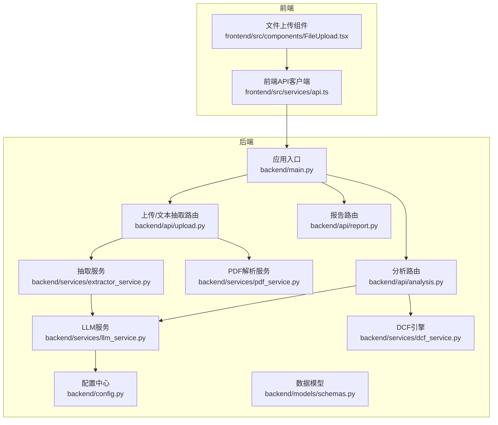
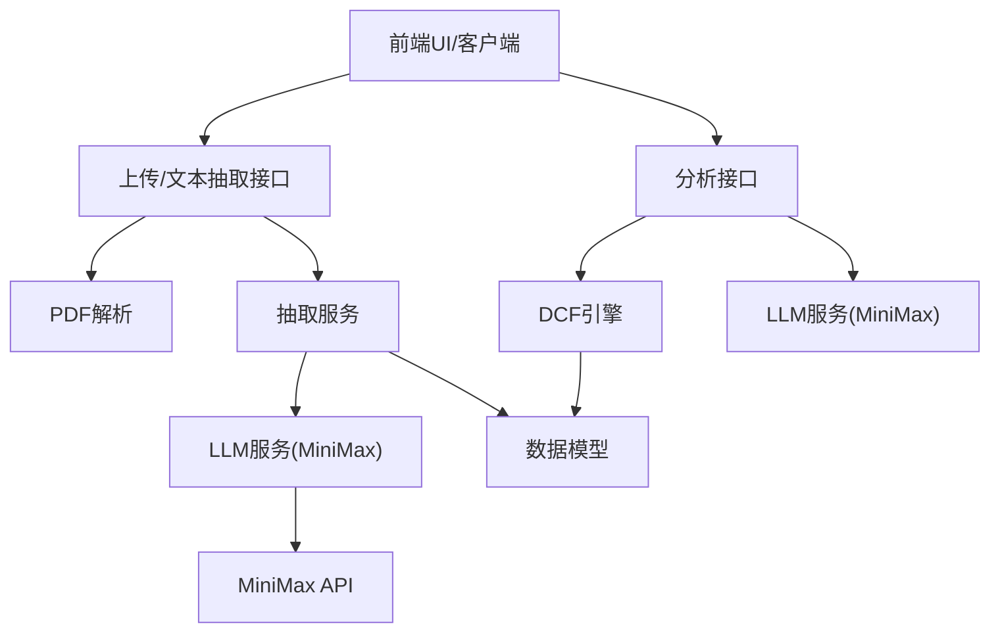
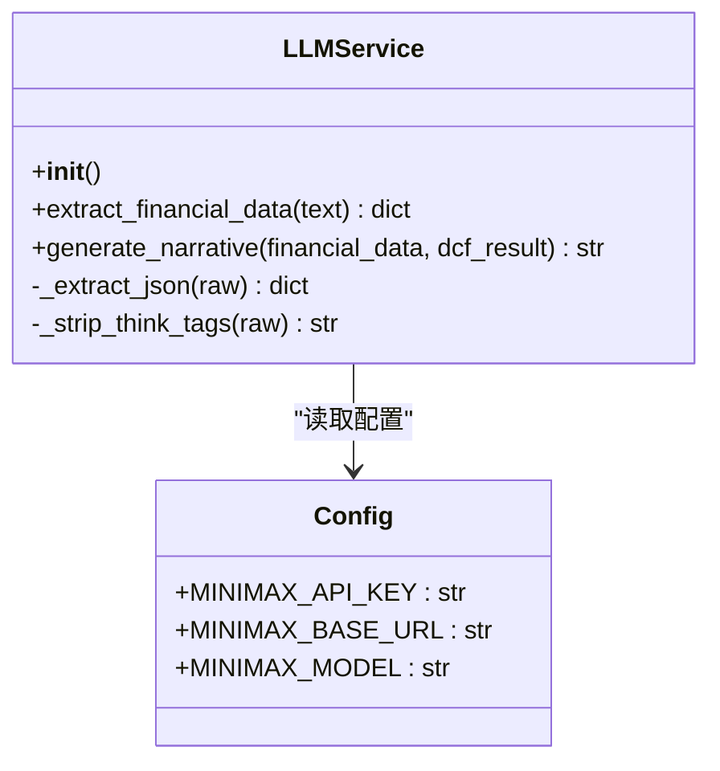
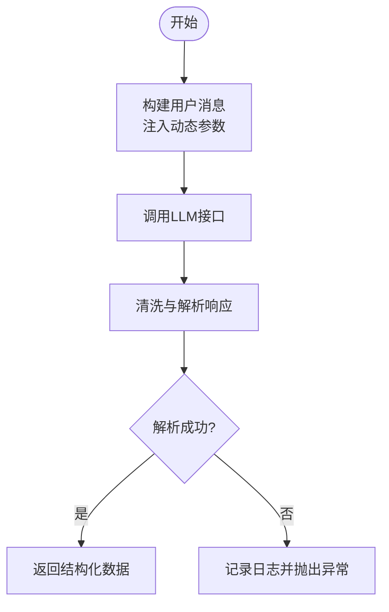
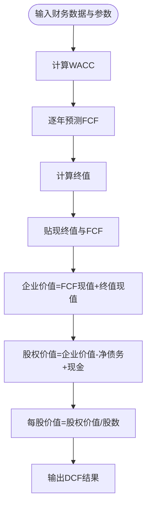
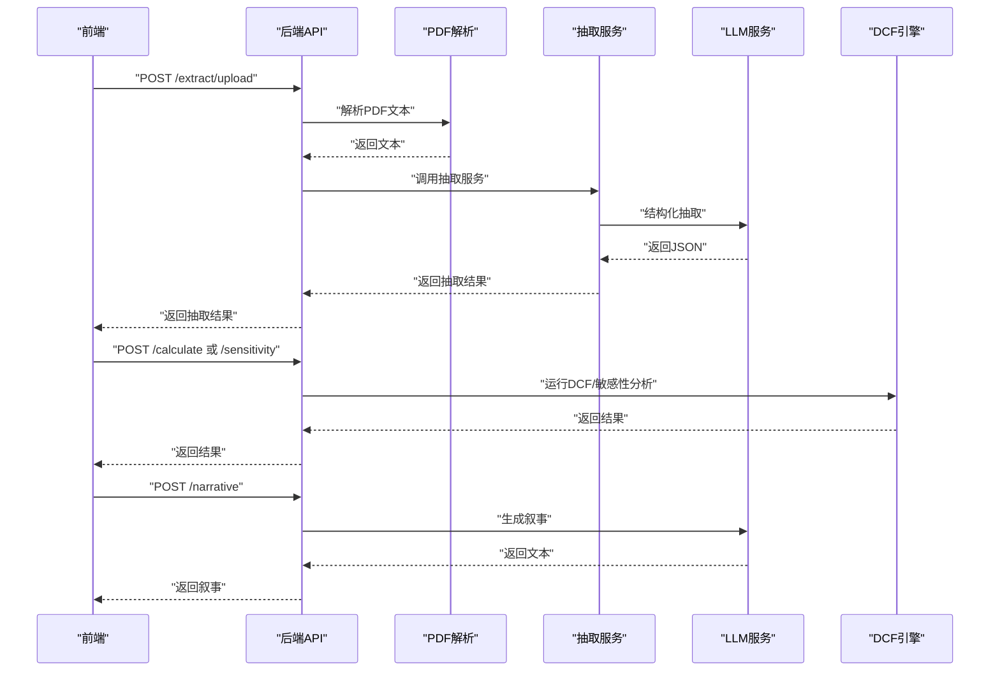
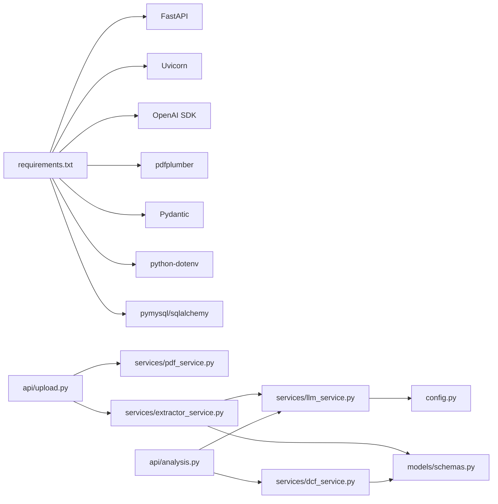

# LLM服务集成

<cite>
**本文引用的文件**
- [backend/services/llm_service.py](file://backend/services/llm_service.py)
- [backend/config.py](file://backend/config.py)
- [backend/main.py](file://backend/main.py)
- [backend/models/schemas.py](file://backend/models/schemas.py)
- [backend/api/analysis.py](file://backend/api/analysis.py)
- [backend/api/upload.py](file://backend/api/upload.py)
- [backend/api/report.py](file://backend/api/report.py)
- [backend/services/dcf_service.py](file://backend/services/dcf_service.py)
- [backend/services/extractor_service.py](file://backend/services/extractor_service.py)
- [backend/services/pdf_service.py](file://backend/services/pdf_service.py)
- [backend/examples/integration_example.py](file://backend/examples/integration_example.py)
- [backend/requirements.txt](file://backend/requirements.txt)
- [frontend/src/services/api.ts](file://frontend/src/services/api.ts)
- [frontend/src/components/FileUpload.tsx](file://frontend/src/components/FileUpload.tsx)
- [dcf_valuation_agent_7d1f15cc.plan.md](file://dcf_valuation_agent_7d1f15cc.plan.md)
</cite>

## 目录
1. [简介](#简介)
2. [项目结构](#项目结构)
3. [核心组件](#核心组件)
4. [架构总览](#架构总览)
5. [详细组件分析](#详细组件分析)
6. [依赖分析](#依赖分析)
7. [性能考虑](#性能考虑)
8. [故障排查指南](#故障排查指南)
9. [结论](#结论)
10. [附录](#附录)

## 简介
本文件面向“LLM服务集成模块”的技术文档，聚焦于AI服务封装的设计模式与外部API集成策略，系统阐述MiniMax LLM服务的配置管理、请求处理与响应解析；解释提示词模板的组织结构与动态参数注入机制；说明异步请求处理、错误重试与超时控制策略；给出API密钥管理、配额监控与成本控制的最佳实践；并提供服务可用性监控、性能指标收集与故障诊断方法。最后展示如何扩展支持其他AI服务提供商与自定义提示词模板。

## 项目结构
后端采用FastAPI框架，按功能分层组织：API路由层负责接口暴露与请求校验；服务层封装业务逻辑（DCF计算、LLM调用、PDF解析、数据抽取）；模型层使用Pydantic定义数据结构；配置层集中管理环境变量与默认参数；前端通过HTTP客户端调用后端接口。

**图表来源**
- [backend/main.py:18-40](file://backend/main.py#L18-L40)
- [backend/api/upload.py:13-55](file://backend/api/upload.py#L13-L55)
- [backend/api/analysis.py:15-45](file://backend/api/analysis.py#L15-L45)
- [backend/api/report.py:5-12](file://backend/api/report.py#L5-L12)
- [backend/config.py:10-22](file://backend/config.py#L10-L22)
- [backend/services/pdf_service.py:26-46](file://backend/services/pdf_service.py#L26-L46)
- [backend/services/extractor_service.py:27-67](file://backend/services/extractor_service.py#L27-L67)
- [backend/services/llm_service.py:70-155](file://backend/services/llm_service.py#L70-L155)
- [backend/services/dcf_service.py:85-163](file://backend/services/dcf_service.py#L85-L163)

**章节来源**
- [backend/main.py:18-40](file://backend/main.py#L18-L40)
- [backend/api/upload.py:13-55](file://backend/api/upload.py#L13-L55)
- [backend/api/analysis.py:15-45](file://backend/api/analysis.py#L15-L45)
- [backend/api/report.py:5-12](file://backend/api/report.py#L5-L12)
- [backend/config.py:10-22](file://backend/config.py#L10-L22)

## 核心组件
- LLM服务封装：基于OpenAI兼容SDK封装MiniMax服务，提供结构化抽取与叙事生成两大能力，内置响应清洗与异常处理。
- 配置管理：集中读取环境变量，提供MiniMax API密钥、基础URL、模型名与MySQL配置。
- 数据模型：使用Pydantic定义财务数据、DCF参数、投影明细、结果与敏感性矩阵等结构。
- 抽取与解析：PDF解析服务筛选关键财务页面，抽取文本；抽取服务将LLM输出映射到强类型模型。
- DCF引擎：根据财务数据与参数计算WACC、自由现金流预测、终值与企业/股权价值。
- API路由：对外暴露上传、文本抽取、DCF计算、敏感性分析与叙事生成接口。

**章节来源**
- [backend/services/llm_service.py:70-155](file://backend/services/llm_service.py#L70-L155)
- [backend/config.py:10-22](file://backend/config.py#L10-L22)
- [backend/models/schemas.py:8-101](file://backend/models/schemas.py#L8-L101)
- [backend/services/extractor_service.py:27-67](file://backend/services/extractor_service.py#L27-L67)
- [backend/services/pdf_service.py:26-46](file://backend/services/pdf_service.py#L26-L46)
- [backend/services/dcf_service.py:85-163](file://backend/services/dcf_service.py#L85-L163)
- [backend/api/analysis.py:18-45](file://backend/api/analysis.py#L18-L45)
- [backend/api/upload.py:16-55](file://backend/api/upload.py#L16-L55)

## 架构总览
系统围绕“PDF/文本 → 结构化抽取 → DCF计算 → 叙事生成”的主流程展开，MiniMax作为外部LLM服务通过OpenAI兼容SDK接入，前端通过HTTP与后端交互。

**图表来源**
- [dcf_valuation_agent_7d1f15cc.plan.md:54-88](file://dcf_valuation_agent_7d1f15cc.plan.md#L54-L88)
- [backend/api/upload.py:16-55](file://backend/api/upload.py#L16-L55)
- [backend/api/analysis.py:18-45](file://backend/api/analysis.py#L18-L45)
- [backend/services/llm_service.py:70-155](file://backend/services/llm_service.py#L70-L155)
- [backend/services/pdf_service.py:26-46](file://backend/services/pdf_service.py#L26-L46)
- [backend/services/extractor_service.py:27-67](file://backend/services/extractor_service.py#L27-L67)
- [backend/services/dcf_service.py:85-163](file://backend/services/dcf_service.py#L85-L163)

## 详细组件分析

### LLM服务封装（MiniMax）
- 设计模式
  - 单例式客户端：在构造函数中初始化异步OpenAI客户端，绑定MiniMax API密钥、基础URL与模型名。
  - 工具方法：提供JSON提取与思考标签清理，确保输出可解析且干净。
- 请求处理
  - 结构化抽取：发送系统提示词与用户内容，设置较低温度与较大token上限，限制输入长度避免超限。
  - 叙事生成：将财务数据与DCF结果拼接为用户消息，生成专业级估值分析文本。
- 响应解析
  - 清洗与回退：去除<think>块与代码围栏，尝试多种匹配策略提取JSON，失败抛出明确异常。
  - 日志记录：记录响应长度与关键字段，便于可观测性与排障。
- 错误处理
  - JSON解析失败：记录原始尾部片段，抛出语义化异常。
  - 其他异常：统一记录并上抛，由上层路由捕获并返回标准化错误。

**图表来源**
- [backend/services/llm_service.py:70-155](file://backend/services/llm_service.py#L70-L155)
- [backend/config.py:10-12](file://backend/config.py#L10-L12)

**章节来源**
- [backend/services/llm_service.py:70-155](file://backend/services/llm_service.py#L70-L155)
- [backend/config.py:10-12](file://backend/config.py#L10-L12)

### 提示词模板与参数注入
- 组织结构
  - 结构化抽取系统提示词：定义目标字段清单与单位转换规则，确保LLM输出符合JSON Schema。
  - 叙事生成系统提示词：指导LLM输出专业、简洁、多要点的估值分析。
- 动态参数注入
  - 抽取阶段：将PDF/文本截断后的片段注入用户消息，限制上下文长度。
  - 叙事阶段：将财务数据与DCF结果序列化为字符串注入用户消息，保持语言一致性。
- 扩展建议
  - 将提示词拆分为独立文件或模板字典，支持按语言切换与版本管理。
  - 引入Jinja2等模板引擎，实现更灵活的参数注入与条件分支。

**图表来源**
- [backend/services/llm_service.py:94-123](file://backend/services/llm_service.py#L94-L123)
- [backend/services/llm_service.py:129-155](file://backend/services/llm_service.py#L129-L155)

**章节来源**
- [backend/services/llm_service.py:14-67](file://backend/services/llm_service.py#L14-L67)
- [backend/services/llm_service.py:94-155](file://backend/services/llm_service.py#L94-L155)

### 异步请求、重试与超时
- 异步处理
  - 使用异步OpenAI客户端进行并发调用，提升吞吐。
- 超时控制
  - 当前实现未显式设置连接/读取超时，建议在客户端初始化时配置超时参数。
- 重试机制
  - 当前未实现自动重试，建议针对网络瞬时错误引入指数退避重试。
- 建议
  - 在配置中增加超时与重试参数，结合熔断与降级策略提升鲁棒性。

**章节来源**
- [backend/services/llm_service.py:72-76](file://backend/services/llm_service.py#L72-L76)
- [backend/requirements.txt:3](file://backend/requirements.txt#L3)

### 配置管理与密钥安全
- 配置来源
  - 通过dotenv加载环境变量，集中管理MiniMax密钥、基础URL、模型名与数据库参数。
- 密钥管理
  - 建议使用只读权限的环境变量，配合密钥轮换与审计日志。
  - 在生产环境使用KMS或托管密钥服务。
- 配额与成本控制
  - 建议在网关层或代理层统计请求次数与token用量，设置阈值告警。
  - 对不同模型与温度参数进行成本评估与预算控制。

**章节来源**
- [backend/config.py:7-22](file://backend/config.py#L7-L22)

### 数据模型与类型安全
- 财务数据、DCF参数、投影明细、结果与敏感性矩阵均使用Pydantic定义，确保输入输出一致与可验证。
- 抽取服务将LLM返回的原始字典安全映射到强类型模型，提供默认值与类型转换保护。

**章节来源**
- [backend/models/schemas.py:8-101](file://backend/models/schemas.py#L8-L101)
- [backend/services/extractor_service.py:32-54](file://backend/services/extractor_service.py#L32-L54)

### PDF解析与文本抽取
- 关键页筛选：基于关键词匹配计算页面相关度，选取高相关度页面拼接文本。
- 上下文长度控制：限制最大字符数，避免LLM输入过长导致截断或超限。
- 错误处理：解析失败时返回标准化错误响应。

**章节来源**
- [backend/services/pdf_service.py:26-46](file://backend/services/pdf_service.py#L26-L46)
- [backend/api/upload.py:16-43](file://backend/api/upload.py#L16-L43)

### DCF计算引擎
- WACC计算：支持覆盖与基于CAPM的自动计算，考虑权益与债务权重及税盾。
- 自由现金流预测：按年份推进，依据收入增长率与各项比率计算NOPAT、D&A、CapEx与NWC变化。
- 终值与贴现：计算终值并贴现至现值，汇总得到企业价值与股权价值，进一步得出每股价值与上下空间。

**图表来源**
- [backend/services/dcf_service.py:12-34](file://backend/services/dcf_service.py#L12-L34)
- [backend/services/dcf_service.py:37-77](file://backend/services/dcf_service.py#L37-L77)
- [backend/services/dcf_service.py:79-121](file://backend/services/dcf_service.py#L79-L121)

**章节来源**
- [backend/services/dcf_service.py:85-163](file://backend/services/dcf_service.py#L85-L163)

### API路由与前端交互
- 路由设计
  - 上传/文本抽取：支持PDF上传与纯文本输入，返回抽取结果。
  - 分析：提供DCF计算与敏感性分析接口。
  - 叙事：将财务数据与DCF结果交由LLM生成专业分析文本。
- 前端对接
  - 前端通过API客户端发起请求，文件上传组件触发后端抽取流程，结果回填到表单与可视化组件。

**图表来源**
- [backend/api/upload.py:16-55](file://backend/api/upload.py#L16-L55)
- [backend/api/analysis.py:18-45](file://backend/api/analysis.py#L18-L45)
- [backend/services/extractor_service.py:27-67](file://backend/services/extractor_service.py#L27-L67)
- [backend/services/llm_service.py:94-155](file://backend/services/llm_service.py#L94-L155)
- [backend/services/dcf_service.py:85-163](file://backend/services/dcf_service.py#L85-L163)

**章节来源**
- [backend/api/upload.py:16-55](file://backend/api/upload.py#L16-L55)
- [backend/api/analysis.py:18-45](file://backend/api/analysis.py#L18-L45)
- [frontend/src/services/api.ts:60-80](file://frontend/src/services/api.ts#L60-L80)
- [frontend/src/components/FileUpload.tsx:21-48](file://frontend/src/components/FileUpload.tsx#L21-L48)

## 依赖分析
- 外部依赖
  - FastAPI/Uvicorn：Web框架与ASGI服务器。
  - OpenAI SDK：MiniMax兼容的异步客户端。
  - pdfplumber：PDF文本抽取。
  - Pydantic：数据模型与校验。
  - python-dotenv：环境变量加载。
  - pymysql/sqlalchemy：数据库访问。
- 内部耦合
  - API层依赖服务层；服务层依赖配置与模型；LLM服务依赖配置；抽取服务依赖LLM服务与模型。

**图表来源**
- [backend/requirements.txt:1-11](file://backend/requirements.txt#L1-L11)
- [backend/api/upload.py:10-11](file://backend/api/upload.py#L10-L11)
- [backend/api/analysis.py:12-13](file://backend/api/analysis.py#L12-L13)
- [backend/services/extractor_service.py:5-6](file://backend/services/extractor_service.py#L5-L6)
- [backend/services/llm_service.py:10](file://backend/services/llm_service.py#L10)
- [backend/services/dcf_service.py:3-9](file://backend/services/dcf_service.py#L3-L9)

**章节来源**
- [backend/requirements.txt:1-11](file://backend/requirements.txt#L1-L11)

## 性能考虑
- 输入裁剪：抽取阶段对输入文本进行长度限制，减少LLM负担与延迟。
- 温度与Token：抽取使用低温度与大token上限，兼顾准确性与完整性。
- 并发与超时：建议启用异步与连接池，配置合理的超时与重试，避免阻塞。
- 缓存与去重：对重复的PDF/文本可做缓存，降低重复调用成本。
- 监控与告警：埋点请求耗时、错误率、Token用量，建立SLA与成本预警。

## 故障排查指南
- LLM JSON解析失败
  - 现象：解析异常，日志包含原始响应尾部片段。
  - 排查：检查系统提示词是否强制JSON格式；确认模型支持结构化输出；核对输入长度与单位转换。
- LLM调用异常
  - 现象：网络或服务端错误。
  - 排查：检查API密钥、基础URL与模型名；确认网络连通性；查看服务端日志。
- 抽取结果为空或不完整
  - 现象：PDF文本抽取为空或LLM未识别关键字段。
  - 排查：确认PDF关键页存在；调整关键词集合；优化提示词与参数。
- DCF计算异常
  - 现象：WACC为0或终值为0。
  - 排查：检查输入财务数据与参数边界；确认WACC覆盖与CAPM计算逻辑。

**章节来源**
- [backend/services/llm_service.py:117-122](file://backend/services/llm_service.py#L117-L122)
- [backend/services/pdf_service.py:30-46](file://backend/services/pdf_service.py#L30-L46)
- [backend/services/dcf_service.py:12-34](file://backend/services/dcf_service.py#L12-L34)

## 结论
该LLM服务集成模块以OpenAI兼容SDK对接MiniMax，形成“PDF/文本 → 结构化抽取 → DCF计算 → 叙事生成”的闭环。通过清晰的分层设计、强类型模型与日志监控，具备良好的可维护性与扩展性。建议后续完善超时与重试、成本监控与密钥安全策略，并引入模板化提示词与多供应商适配，以支撑更复杂的业务场景。

## 附录

### 扩展支持其他AI服务提供商
- 适配策略
  - 定义统一的LLM抽象接口，屏蔽具体SDK差异。
  - 通过配置切换基础URL与认证方式，保持调用签名一致。
  - 为不同模型定制提示词模板与参数范围。
- 提示词模板管理
  - 将提示词存储为独立文件或配置字典，支持按语言与领域切换。
  - 引入版本控制与A/B测试能力，持续优化提示词质量。

### 最佳实践清单
- 密钥管理：最小权限、定期轮换、审计日志。
- 成本控制：限额与告警、Token统计、模型选择优化。
- 可观测性：埋点请求耗时与错误、日志分级、链路追踪。
- 容错与弹性：超时与重试、熔断与降级、灰度发布。
- 文档与规范：接口契约、提示词规范、错误码标准。