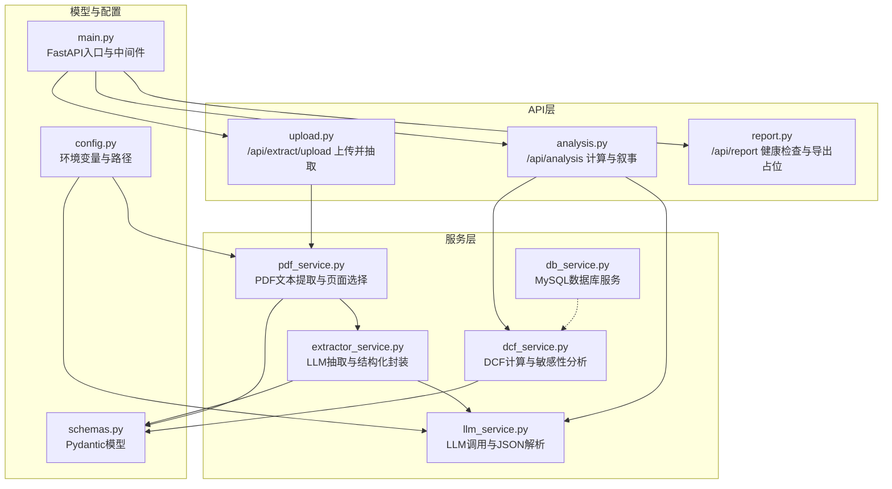
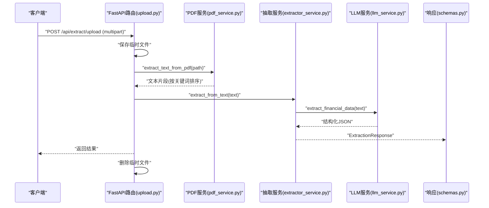
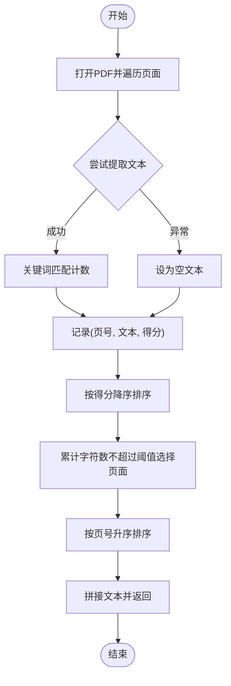
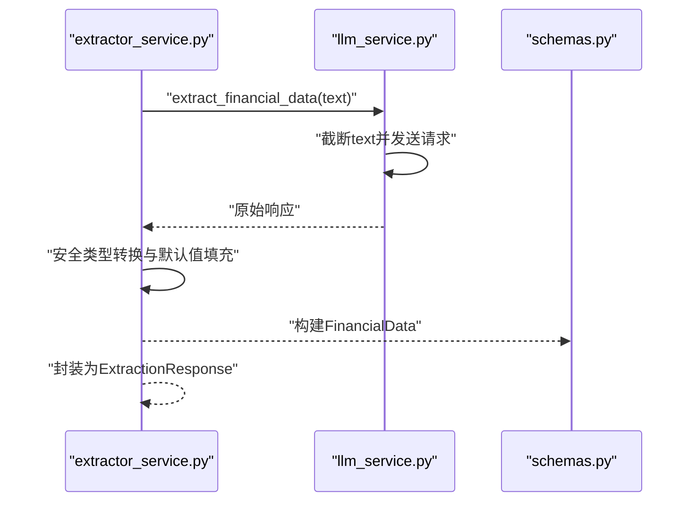
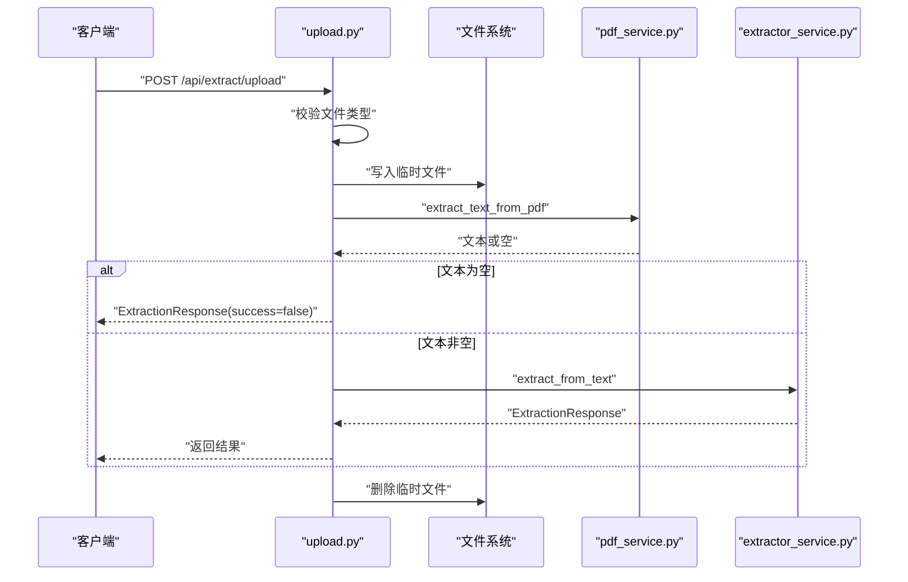
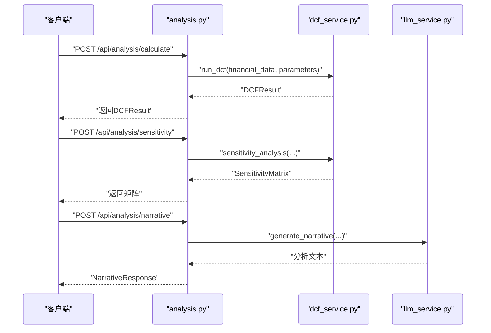
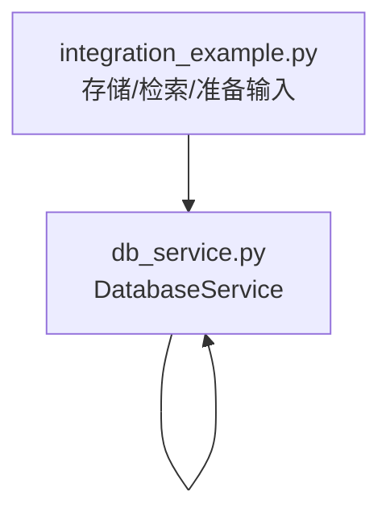
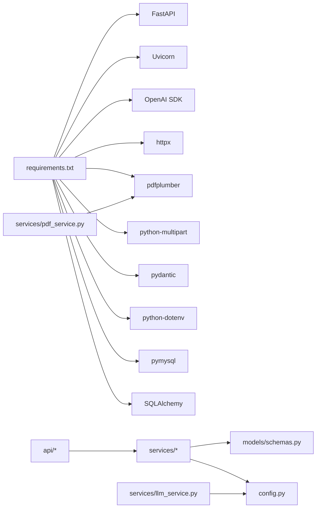

# PDF处理服务

<cite>
**本文引用的文件**
- [backend/services/pdf_service.py](file://backend/services/pdf_service.py)
- [backend/services/extractor_service.py](file://backend/services/extractor_service.py)
- [backend/services/llm_service.py](file://backend/services/llm_service.py)
- [backend/api/upload.py](file://backend/api/upload.py)
- [backend/models/schemas.py](file://backend/models/schemas.py)
- [backend/config.py](file://backend/config.py)
- [backend/main.py](file://backend/main.py)
- [backend/requirements.txt](file://backend/requirements.txt)
- [backend/api/report.py](file://backend/api/report.py)
- [backend/api/analysis.py](file://backend/api/analysis.py)
- [backend/services/db_service.py](file://backend/services/db_service.py)
- [backend/services/dcf_service.py](file://backend/services/dcf_service.py)
- [backend/examples/integration_example.py](file://backend/examples/integration_example.py)
</cite>

## 目录
1. [简介](#简介)
2. [项目结构](#项目结构)
3. [核心组件](#核心组件)
4. [架构总览](#架构总览)
5. [详细组件分析](#详细组件分析)
6. [依赖分析](#依赖分析)
7. [性能考虑](#性能考虑)
8. [故障排查指南](#故障排查指南)
9. [结论](#结论)
10. [附录](#附录)

## 简介
本文件面向“PDF处理服务”模块，系统性阐述PDF文本提取、关键词匹配、页面选择、文本预处理、LLM结构化抽取、财务参数校验与默认值、以及与后端分析链路（DCF）的衔接方式。文档重点覆盖：
- pdfplumber库的使用与文本解析逻辑
- 关键词匹配策略与页面排序
- 文本预处理流程（字符编码、格式标准化、噪声过滤思路）
- 错误处理、异常恢复与性能优化
- 如何扩展支持不同格式的财务报告与自定义解析规则

## 项目结构
后端采用FastAPI应用，API路由负责接收上传与文本抽取请求，服务层完成PDF文本提取与LLM抽取，模型层定义响应结构，配置层管理外部服务与上传目录。

图表来源
- [backend/api/upload.py:16-43](file://backend/api/upload.py#L16-L43)
- [backend/api/analysis.py:18-44](file://backend/api/analysis.py#L18-L44)
- [backend/api/report.py:8-11](file://backend/api/report.py#L8-L11)
- [backend/services/pdf_service.py:26-67](file://backend/services/pdf_service.py#L26-L67)
- [backend/services/extractor_service.py:27-66](file://backend/services/extractor_service.py#L27-L66)
- [backend/services/llm_service.py:94-122](file://backend/services/llm_service.py#L94-L122)
- [backend/services/dcf_service.py:85-120](file://backend/services/dcf_service.py#L85-L120)
- [backend/services/db_service.py:24-52](file://backend/services/db_service.py#L24-L52)
- [backend/models/schemas.py:78-101](file://backend/models/schemas.py#L78-L101)
- [backend/config.py:10-21](file://backend/config.py#L10-L21)
- [backend/main.py:32-39](file://backend/main.py#L32-L39)

章节来源
- [backend/main.py:18-39](file://backend/main.py#L18-L39)
- [backend/api/upload.py:16-43](file://backend/api/upload.py#L16-L43)
- [backend/api/analysis.py:18-44](file://backend/api/analysis.py#L18-L44)
- [backend/api/report.py:8-11](file://backend/api/report.py#L8-L11)

## 核心组件
- PDF文本提取与页面选择：通过pdfplumber读取每页文本，按关键词匹配打分排序，限制最大字符数并拼接输出。
- LLM抽取与结构化：调用外部大模型，解析JSON并封装为结构化财务数据。
- API编排：上传接口负责保存临时文件、调用提取与抽取，并清理临时文件；分析接口负责DCF与叙事生成。
- 数据模型：统一的响应模型、财务数据模型、DCF参数与结果模型。
- 配置与运行：环境变量驱动的外部服务地址与密钥，上传目录初始化。

章节来源
- [backend/services/pdf_service.py:26-67](file://backend/services/pdf_service.py#L26-L67)
- [backend/services/extractor_service.py:27-66](file://backend/services/extractor_service.py#L27-L66)
- [backend/services/llm_service.py:94-122](file://backend/services/llm_service.py#L94-L122)
- [backend/api/upload.py:16-43](file://backend/api/upload.py#L16-L43)
- [backend/models/schemas.py:78-101](file://backend/models/schemas.py#L78-L101)
- [backend/config.py:10-21](file://backend/config.py#L10-L21)

## 架构总览
下图展示了从上传到抽取再到分析的整体流程。

图表来源
- [backend/api/upload.py:16-43](file://backend/api/upload.py#L16-L43)
- [backend/services/pdf_service.py:26-67](file://backend/services/pdf_service.py#L26-L67)
- [backend/services/extractor_service.py:27-66](file://backend/services/extractor_service.py#L27-L66)
- [backend/services/llm_service.py:94-122](file://backend/services/llm_service.py#L94-L122)
- [backend/models/schemas.py:78-83](file://backend/models/schemas.py#L78-L83)

## 详细组件分析

### PDF文本提取与页面选择（pdfplumber）
- 关键词匹配策略：维护中英文财务关键词列表，对页面文本进行大小写不敏感匹配计数，作为页面相关性得分。
- 页面排序与截断：按相关性降序排列，累计字符数不超过阈值（例如30000），避免超长输入导致LLM处理失败。
- 异常容错：单页文本提取异常时回退为空字符串，保证整体流程稳定。
- 输出：按原始页序拼接选中页面文本，记录提取统计信息。

图表来源
- [backend/services/pdf_service.py:26-67](file://backend/services/pdf_service.py#L26-L67)

章节来源
- [backend/services/pdf_service.py:8-23](file://backend/services/pdf_service.py#L8-L23)
- [backend/services/pdf_service.py:26-67](file://backend/services/pdf_service.py#L26-L67)

### LLM抽取与结构化封装（llm_service + extractor_service）
- LLM抽取：构造系统提示词与用户提示词，截断输入长度，调用异步客户端获取JSON响应，清洗<think>标签与代码块，解析为字典。
- 结构化封装：将LLM输出映射到FinancialData模型，提供安全类型转换与默认值，确保字段完整性与类型正确性。
- 错误处理：捕获JSON解析异常与通用异常，记录日志并向上抛出，由上层API路由统一返回错误响应。

图表来源
- [backend/services/extractor_service.py:27-66](file://backend/services/extractor_service.py#L27-L66)
- [backend/services/llm_service.py:94-122](file://backend/services/llm_service.py#L94-L122)
- [backend/models/schemas.py:8-30](file://backend/models/schemas.py#L8-L30)

章节来源
- [backend/services/llm_service.py:14-50](file://backend/services/llm_service.py#L14-L50)
- [backend/services/llm_service.py:94-122](file://backend/services/llm_service.py#L94-L122)
- [backend/services/extractor_service.py:11-25](file://backend/services/extractor_service.py#L11-L25)
- [backend/services/extractor_service.py:27-66](file://backend/services/extractor_service.py#L27-L66)
- [backend/models/schemas.py:78-83](file://backend/models/schemas.py#L78-L83)

### API编排与错误处理（upload.py）
- 文件校验：仅接受PDF文件，否则返回400。
- 临时文件：生成唯一文件名，写入上传目录，完成后删除。
- 流程控制：若PDF未提取到文本，直接返回错误；否则进入LLM抽取阶段。
- 统一错误返回：任何异常均封装为ExtractionResponse并返回给客户端。

图表来源
- [backend/api/upload.py:16-43](file://backend/api/upload.py#L16-L43)
- [backend/services/pdf_service.py:26-67](file://backend/services/pdf_service.py#L26-L67)
- [backend/services/extractor_service.py:27-66](file://backend/services/extractor_service.py#L27-L66)

章节来源
- [backend/api/upload.py:16-43](file://backend/api/upload.py#L16-L43)

### DCF分析与敏感性分析（analysis.py + dcf_service.py）
- 计算接口：接收FinancialData与DCFParameters，调用dcf_service执行DCF计算，返回DCFResult。
- 敏感性分析：在固定WACC/WACC扰动范围内，计算目标公司合理股价矩阵。
- 叙事生成：调用LLM生成专业级估值分析文本，返回NarrativeResponse。

图表来源
- [backend/api/analysis.py:18-44](file://backend/api/analysis.py#L18-L44)
- [backend/services/dcf_service.py:85-120](file://backend/services/dcf_service.py#L85-L120)
- [backend/services/dcf_service.py:123-162](file://backend/services/dcf_service.py#L123-L162)
- [backend/services/llm_service.py:129-154](file://backend/services/llm_service.py#L129-L154)

章节来源
- [backend/api/analysis.py:18-44](file://backend/api/analysis.py#L18-L44)
- [backend/services/dcf_service.py:12-34](file://backend/services/dcf_service.py#L12-L34)
- [backend/services/dcf_service.py:37-76](file://backend/services/dcf_service.py#L37-L76)
- [backend/services/dcf_service.py:79-82](file://backend/services/dcf_service.py#L79-L82)
- [backend/services/dcf_service.py:85-120](file://backend/services/dcf_service.py#L85-L120)
- [backend/services/dcf_service.py:123-162](file://backend/services/dcf_service.py#L123-L162)
- [backend/services/llm_service.py:129-154](file://backend/services/llm_service.py#L129-L154)

### 数据库服务与集成示例（db_service.py + integration_example.py）
- 数据库服务：提供连接管理、股票与档案、财务报表、历史价格等插入与查询能力。
- 集成示例：演示如何将数据库数据用于准备DCF输入，包括历史收入增长计算、最新报表字段提取等。

图表来源
- [backend/services/db_service.py:24-52](file://backend/services/db_service.py#L24-L52)
- [backend/examples/integration_example.py:16-86](file://backend/examples/integration_example.py#L16-L86)
- [backend/examples/integration_example.py:89-191](file://backend/examples/integration_example.py#L89-L191)
- [backend/examples/integration_example.py:194-251](file://backend/examples/integration_example.py#L194-L251)

章节来源
- [backend/services/db_service.py:24-52](file://backend/services/db_service.py#L24-L52)
- [backend/examples/integration_example.py:16-86](file://backend/examples/integration_example.py#L16-L86)
- [backend/examples/integration_example.py:89-191](file://backend/examples/integration_example.py#L89-L191)
- [backend/examples/integration_example.py:194-251](file://backend/examples/integration_example.py#L194-L251)

## 依赖分析
- 外部库依赖：FastAPI、Uvicorn、OpenAI SDK、httpx、pdfplumber、python-multipart、pydantic、python-dotenv、pymysql、SQLAlchemy。
- 内部模块耦合：API层依赖服务层；服务层依赖模型层与配置层；LLM服务依赖配置层提供的密钥与模型；数据库服务独立于分析链路但可被集成示例使用。

图表来源
- [backend/requirements.txt:1-11](file://backend/requirements.txt#L1-L11)
- [backend/api/upload.py:8-11](file://backend/api/upload.py#L8-L11)
- [backend/services/llm_service.py:10-12](file://backend/services/llm_service.py#L10-L12)
- [backend/services/pdf_service.py:4-4](file://backend/services/pdf_service.py#L4-L4)

章节来源
- [backend/requirements.txt:1-11](file://backend/requirements.txt#L1-L11)
- [backend/config.py:10-21](file://backend/config.py#L10-L21)

## 性能考虑
- 输入长度控制：PDF提取阶段限制最大字符数，LLM阶段也对输入进行截断，避免超长上下文带来的延迟与成本上升。
- 页面选择策略：基于关键词的相关性排序优先抽取高价值页面，减少无关内容对LLM的干扰。
- 异常短路：单页提取异常不阻塞整体流程，降低端到端耗时。
- 并发与限流：建议在部署层引入并发限制与队列，避免LLM与数据库成为瓶颈。
- 缓存策略：对高频查询的财务报表与历史价格可引入缓存，减少重复数据库访问。

## 故障排查指南
- PDF无法提取文本
  - 检查pdfplumber版本与PDF加密状态；确认临时文件存在且可读。
  - 查看日志中“PDF has X pages”与“Extracted Y chars”统计信息。
- LLM返回无效JSON
  - 检查系统提示词是否清晰；确认返回内容被正确清洗<think>标签与代码块。
  - 查看日志中的“Failed to parse LLM JSON response”定位问题。
- API返回错误
  - 检查上传文件类型是否为PDF；确认上传目录权限与磁盘空间。
  - 查看统一错误响应中的error字段，结合日志定位具体异常。
- 数据库操作失败
  - 检查MySQL连接参数与网络连通性；查看错误堆栈并确认事务回滚是否生效。

章节来源
- [backend/services/pdf_service.py:30-40](file://backend/services/pdf_service.py#L30-L40)
- [backend/services/llm_service.py:117-122](file://backend/services/llm_service.py#L117-L122)
- [backend/api/upload.py:19-20](file://backend/api/upload.py#L19-L20)
- [backend/services/db_service.py:34-46](file://backend/services/db_service.py#L34-L46)

## 结论
PDF处理服务通过pdfplumber实现高效的财务类PDF文本提取，结合关键词相关性排序与字符数限制，显著提升后续LLM抽取的准确性与稳定性。LLM抽取与结构化封装提供了稳健的数据模型映射与默认值策略，API层统一了错误处理与资源清理。配合DCF分析与数据库服务，形成从PDF到估值分析的完整链路。未来可在关键词库扩展、OCR集成、表格解析与布局分析方面进一步增强，以支持更多格式的财务报告与更复杂的解析规则。

## 附录
- 配置项说明
  - 外部LLM：MINIMAX_API_KEY、MINIMAX_BASE_URL、MINIMAX_MODEL
  - 数据库：MYSQL_HOST、MYSQL_USER、MYSQL_PASSWORD、MYSQL_PORT、MYSQL_DATABASE
  - 上传目录：UPLOAD_DIR
- 健康检查与导出占位
  - /api/health 返回服务状态
  - /api/report/health 返回报告模块状态与导出格式占位

章节来源
- [backend/config.py:10-21](file://backend/config.py#L10-L21)
- [backend/main.py:37-39](file://backend/main.py#L37-L39)
- [backend/api/report.py:8-11](file://backend/api/report.py#L8-L11)