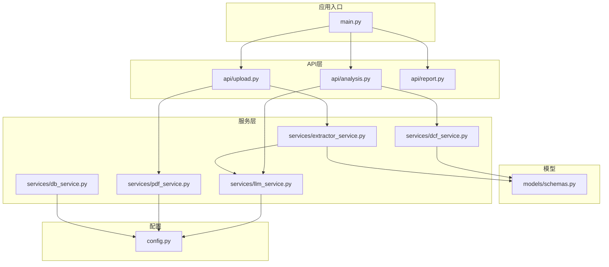
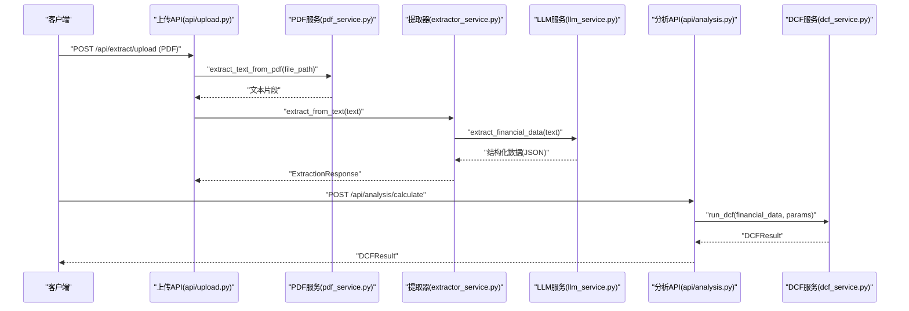
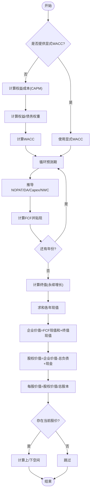
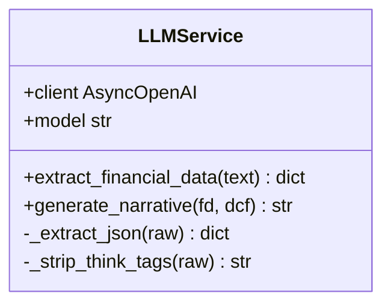
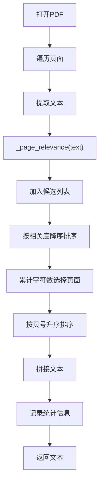
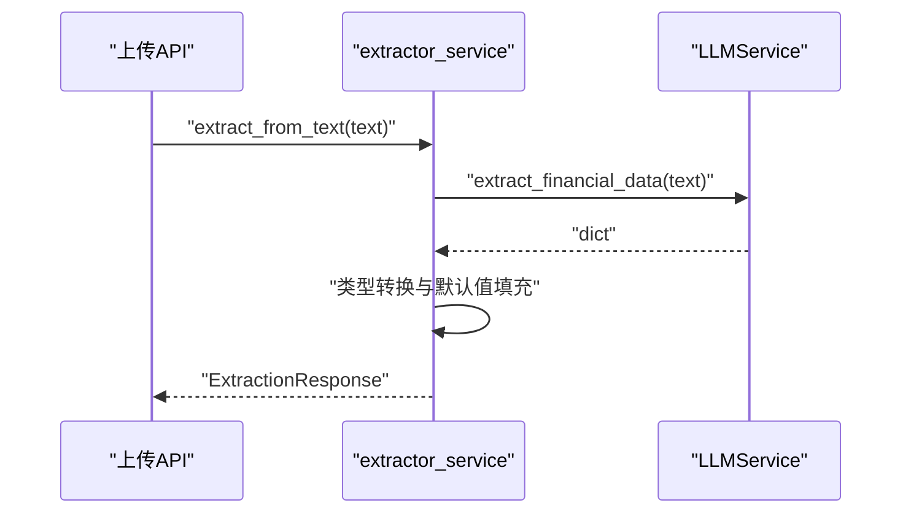
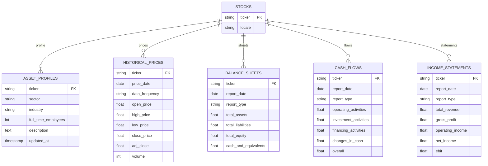
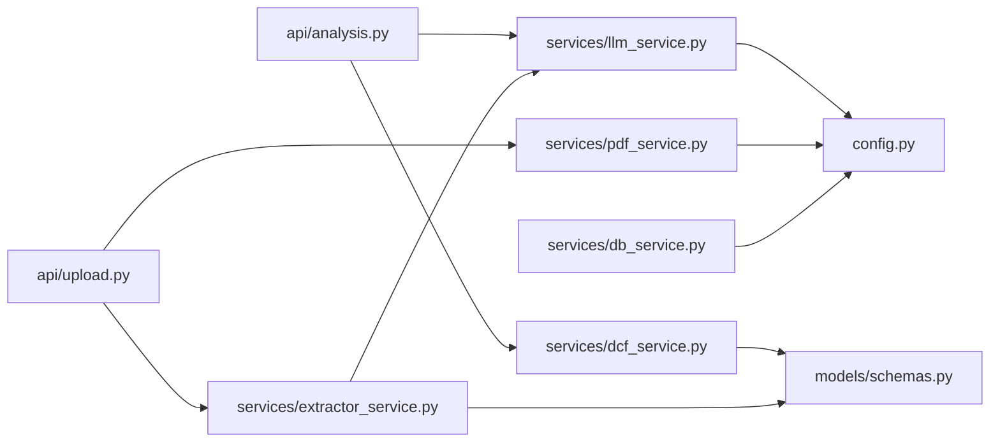

# 业务服务层

<cite>
**本文引用的文件列表**
- [main.py](file://backend/main.py)
- [config.py](file://backend/config.py)
- [models/schemas.py](file://backend/models/schemas.py)
- [services/dcf_service.py](file://backend/services/dcf_service.py)
- [services/llm_service.py](file://backend/services/llm_service.py)
- [services/pdf_service.py](file://backend/services/pdf_service.py)
- [services/extractor_service.py](file://backend/services/extractor_service.py)
- [services/db_service.py](file://backend/services/db_service.py)
- [api/analysis.py](file://backend/api/analysis.py)
- [api/upload.py](file://backend/api/upload.py)
- [api/report.py](file://backend/api/report.py)
- [examples/integration_example.py](file://backend/examples/integration_example.py)
- [requirements.txt](file://backend/requirements.txt)
</cite>

## 目录
1. [简介](#简介)
2. [项目结构](#项目结构)
3. [核心组件](#核心组件)
4. [架构总览](#架构总览)
5. [详细组件分析](#详细组件分析)
6. [依赖关系分析](#依赖关系分析)
7. [性能考虑](#性能考虑)
8. [故障排查指南](#故障排查指南)
9. [结论](#结论)
10. [附录](#附录)

## 简介
本文件面向DCF估值智能体的业务服务层，系统性梳理后端服务模块的职责边界、数据结构、算法实现与外部集成策略。重点覆盖：
- DCF计算引擎的数据结构、算法实现与参数配置
- LLM服务封装的设计模式与外部API集成策略
- PDF处理服务的文本提取算法与数据解析逻辑
- 服务间依赖关系与调用流程
- 错误处理机制、性能优化策略与监控指标
- 如何扩展新的业务服务与集成第三方服务

## 项目结构
后端采用FastAPI框架，按“API路由—服务层—模型定义”的分层组织。核心目录与文件如下：
- backend/main.py：应用入口与路由挂载
- backend/config.py：环境变量与外部服务配置
- backend/models/schemas.py：Pydantic数据模型
- backend/api/*：REST接口定义
- backend/services/*：业务服务实现
- backend/examples/integration_example.py：数据库服务集成示例

图表来源
- [main.py:18-35](file://backend/main.py#L18-L35)
- [api/analysis.py:15-44](file://backend/api/analysis.py#L15-L44)
- [api/upload.py:13-55](file://backend/api/upload.py#L13-L55)
- [api/report.py:5-12](file://backend/api/report.py#L5-L12)
- [services/dcf_service.py:1-163](file://backend/services/dcf_service.py#L1-L163)
- [services/llm_service.py:1-155](file://backend/services/llm_service.py#L1-L155)
- [services/pdf_service.py:1-68](file://backend/services/pdf_service.py#L1-L68)
- [services/extractor_service.py:1-67](file://backend/services/extractor_service.py#L1-L67)
- [services/db_service.py:24-345](file://backend/services/db_service.py#L24-L345)
- [models/schemas.py:8-101](file://backend/models/schemas.py#L8-L101)
- [config.py:10-22](file://backend/config.py#L10-L22)

章节来源
- [main.py:18-35](file://backend/main.py#L18-L35)
- [config.py:10-22](file://backend/config.py#L10-L22)

## 核心组件
- 数据模型层：通过Pydantic定义金融数据、DCF参数、投影、结果与敏感度矩阵等结构，确保输入输出一致性与类型安全。
- DCF服务：实现WACC计算、FCF预测、终值计算与敏感度分析，支持参数覆盖与数值稳定性处理。
- LLM服务：封装MiniMax（OpenAI兼容）外部API，负责结构化抽取与叙事生成，内置JSON解析与错误处理。
- PDF服务：基于pdfplumber提取关键财务页文本，按关键词相关度排序并限制最大字符数。
- 提取器服务：将LLM抽取结果映射到标准化模型，提供默认值与容错。
- 数据库服务：提供MySQL连接、事务管理与多类财务报表的插入/查询能力，支持历史价格与财务报表的检索。

章节来源
- [models/schemas.py:8-101](file://backend/models/schemas.py#L8-L101)
- [services/dcf_service.py:12-163](file://backend/services/dcf_service.py#L12-L163)
- [services/llm_service.py:70-155](file://backend/services/llm_service.py#L70-L155)
- [services/pdf_service.py:26-68](file://backend/services/pdf_service.py#L26-L68)
- [services/extractor_service.py:27-67](file://backend/services/extractor_service.py#L27-L67)
- [services/db_service.py:24-345](file://backend/services/db_service.py#L24-L345)

## 架构总览
业务服务层围绕“上传与提取—LLM抽取—DCF计算—LLM叙事—结果返回”闭环展开。API层作为入口，服务层承担具体业务逻辑，模型层保障数据契约，配置层提供外部服务参数。

图表来源
- [api/upload.py:16-43](file://backend/api/upload.py#L16-L43)
- [services/pdf_service.py:26-68](file://backend/services/pdf_service.py#L26-L68)
- [services/extractor_service.py:27-67](file://backend/services/extractor_service.py#L27-L67)
- [services/llm_service.py:94-123](file://backend/services/llm_service.py#L94-L123)
- [api/analysis.py:18-24](file://backend/api/analysis.py#L18-L24)
- [services/dcf_service.py:85-121](file://backend/services/dcf_service.py#L85-L121)

## 详细组件分析

### DCF计算引擎
- 数据结构
  - 输入：FinancialData（财务指标）、DCFParameters（预测期、增长率、比率、WACC等）
  - 输出：FCFProjection（逐年投影）、DCFResult（终值、现值、企业价值、股权价值、每股价值、上/下空间）、SensitivityMatrix（敏感度矩阵）
- 算法实现
  - WACC计算：支持显式覆盖；否则基于CAPM与目标资本结构计算加权平均成本，保证最小值约束
  - FCF预测：按年复合增长推导收入，结合运营利润率、税率、折旧摊销、资本支出、营运资本变化计算自由现金流，再按贴现因子折现
  - 终值计算：采用永续增长模型，当WACC不小于终值增长率时返回0
  - 敏感度分析：对WACC与终值增长率进行网格扫描，剔除不合理组合（如WACC≤终值增长率或非正），输出每格对应的内在价值/股
- 参数配置
  - 支持显式WACC覆盖；否则自动计算
  - 预测期、收入增长率、终端增长率、运营利润率、税率、各项比率（DA、CAPEX、NWC）均可配置
- 数值稳定性
  - 对权重与WACC设置下限，避免极端情况导致结果异常

图表来源
- [services/dcf_service.py:12-121](file://backend/services/dcf_service.py#L12-L121)
- [models/schemas.py:32-76](file://backend/models/schemas.py#L32-L76)

章节来源
- [services/dcf_service.py:12-163](file://backend/services/dcf_service.py#L12-L163)
- [models/schemas.py:32-76](file://backend/models/schemas.py#L32-L76)

### LLM服务封装（MiniMax/OpenAI兼容）
- 设计模式
  - 单例式异步客户端封装，集中管理模型与基础URL
  - 工具方法：JSON提取（去除思维/代码块标记）、叙事生成（系统提示词+用户内容）
- 外部API集成
  - 使用AsyncOpenAI客户端，通过配置项MINIMAX_API_KEY、MINIMAX_BASE_URL、MINIMAX_MODEL
  - 结构化抽取：系统提示词明确字段与单位转换规则，限制最大token
  - 叙事生成：将财务数据与DCF结果拼接为用户消息，控制温度与token上限
- 错误处理
  - JSON解析失败抛出明确异常
  - 其他异常记录日志并向上抛出，便于上层捕获

图表来源
- [services/llm_service.py:70-155](file://backend/services/llm_service.py#L70-L155)
- [config.py:10-12](file://backend/config.py#L10-L12)

章节来源
- [services/llm_service.py:70-155](file://backend/services/llm_service.py#L70-L155)
- [config.py:10-12](file://backend/config.py#L10-L12)

### PDF处理服务
- 文本提取算法
  - 遍历PDF页面，提取文本并统计关键词相关度（中文/英文财务关键词）
  - 按相关度降序排序，累计字符数不超过阈值（约3万字符），截断剩余文本
  - 最终按原始页序拼接，限制最大长度并记录提取统计
- 关键词策略
  - 覆盖中文与英文财务术语，提升关键页面识别准确率
- 性能与鲁棒性
  - 异常页文本为空处理，避免崩溃
  - 日志记录页数与字符数，便于监控

图表来源
- [services/pdf_service.py:26-68](file://backend/services/pdf_service.py#L26-L68)

章节来源
- [services/pdf_service.py:26-68](file://backend/services/pdf_service.py#L26-L68)

### 提取器服务
- 功能职责
  - 调用LLMService执行结构化抽取，将原始字典映射到FinancialData模型
  - 提供安全类型转换（字符串→整数/浮点），缺失值使用默认值
  - 返回ExtractionResponse，包含成功标志、抽取文本与错误信息
- 容错策略
  - 捕获异常并返回失败响应，避免中断流程
  - 记录错误日志，便于定位问题

图表来源
- [services/extractor_service.py:27-67](file://backend/services/extractor_service.py#L27-L67)
- [services/llm_service.py:94-123](file://backend/services/llm_service.py#L94-L123)

章节来源
- [services/extractor_service.py:27-67](file://backend/services/extractor_service.py#L27-L67)

### 数据库服务
- 能力范围
  - 连接管理与关闭、事务回滚
  - 股票信息、资产档案、历史价格、三大报表的插入与更新（ON DUPLICATE KEY UPDATE）
  - 查询：按股票获取最新财务报表、历史价格区间查询、按类型批量获取报表
- 数据模型
  - 表：stocks、asset_profiles、historical_prices、balance_sheets、cash_flows、income_statements
- 实践示例
  - 提供完整的存储与读取示例，包括历史趋势计算与30日均价计算

图表来源
- [services/db_service.py:54-341](file://backend/services/db_service.py#L54-L341)

章节来源
- [services/db_service.py:24-345](file://backend/services/db_service.py#L24-L345)
- [examples/integration_example.py:16-191](file://backend/examples/integration_example.py#L16-L191)

## 依赖关系分析
- 内部依赖
  - API层依赖服务层；服务层依赖模型层；数据库服务依赖配置层
  - 提取器服务依赖LLM服务；分析API依赖DCF服务与LLM服务
- 外部依赖
  - LLM服务依赖OpenAI SDK与外部MiniMax（OpenAI兼容）API
  - PDF服务依赖pdfplumber
  - 数据库服务依赖pymysql与SQLAlchemy
- 配置依赖
  - API密钥、基础URL、模型名、MySQL连接参数均来自环境变量

图表来源
- [api/analysis.py:12-13](file://backend/api/analysis.py#L12-L13)
- [api/upload.py:10-11](file://backend/api/upload.py#L10-L11)
- [services/extractor_service.py:6](file://backend/services/extractor_service.py#L6)
- [services/dcf_service.py:3-9](file://backend/services/dcf_service.py#L3-L9)
- [services/llm_service.py:10](file://backend/services/llm_service.py#L10)
- [services/pdf_service.py:4](file://backend/services/pdf_service.py#L4)
- [services/db_service.py:15-21](file://backend/services/db_service.py#L15-L21)
- [config.py:10-22](file://backend/config.py#L10-L22)

章节来源
- [requirements.txt:1-11](file://backend/requirements.txt#L1-L11)

## 性能考虑
- 文本提取
  - PDF服务限制最大字符数与页面数量，避免大文档导致内存与LLM输入超限
  - 关键词相关度排序优先提取高价值页面
- LLM调用
  - 控制temperature与max_tokens，减少上下文长度与生成时间
  - 对LLM输出进行JSON提取与清洗，降低解析失败概率
- DCF计算
  - 预测期线性循环，复杂度O(T)；敏感度分析为网格搜索，复杂度O(T×W×G)
  - 对权重与WACC设置下限，避免极端数值引发溢出
- 数据库访问
  - 使用事务与回滚，批量插入使用ON DUPLICATE KEY UPDATE减少冲突
  - 查询按日期范围与频率过滤，避免全表扫描

[本节为通用性能建议，无需特定文件引用]

## 故障排查指南
- LLM抽取失败
  - 现象：JSON解析错误或外部API异常
  - 排查：检查MINIMAX_API_KEY与MINIMAX_BASE_URL配置；查看日志中的原始响应片段；确认提示词字段完整性
  - 参考路径：[services/llm_service.py:117-122](file://backend/services/llm_service.py#L117-L122)
- PDF文本为空
  - 现象：上传后无法提取有效文本
  - 排查：确认PDF页码与文本可提取；检查关键词匹配；查看日志统计
  - 参考路径：[services/pdf_service.py:30-40](file://backend/services/pdf_service.py#L30-L40)
- DCF计算异常
  - 现象：终值为0或结果异常
  - 排查：检查WACC与终值增长率关系；确认输入参数合理性；核对财务数据单位与口径
  - 参考路径：[services/dcf_service.py:80](file://backend/services/dcf_service.py#L80)
- 数据库操作失败
  - 现象：插入/查询异常或事务回滚
  - 排查：检查MySQL连接参数与网络；查看错误日志；确认表结构与字段类型
  - 参考路径：[services/db_service.py:43](file://backend/services/db_service.py#L43)

章节来源
- [services/llm_service.py:117-122](file://backend/services/llm_service.py#L117-L122)
- [services/pdf_service.py:30-40](file://backend/services/pdf_service.py#L30-L40)
- [services/dcf_service.py:80](file://backend/services/dcf_service.py#L80)
- [services/db_service.py:43](file://backend/services/db_service.py#L43)

## 结论
业务服务层通过清晰的分层设计与稳健的错误处理，实现了从PDF文本提取、LLM结构化抽取、DCF计算到LLM叙事的完整闭环。模型层确保数据一致性，配置层统一外部依赖，数据库服务支撑历史数据与报表管理。建议后续扩展方向包括：引入缓存与队列、完善监控指标（延迟、错误率、Token用量）、增强多语言支持与合规校验。

[本节为总结性内容，无需特定文件引用]

## 附录

### API定义概览
- 分析接口
  - POST /api/analysis/calculate：传入FinancialData与DCFParameters，返回DCFRresult
  - POST /api/analysis/sensitivity：返回敏感度矩阵
  - POST /api/analysis/narrative：根据财务数据与DCF结果生成专业叙述
- 提取接口
  - POST /api/extract/upload：上传PDF并提取文本，再进行结构化抽取
  - POST /api/extract/text：直接对文本进行结构化抽取
- 报告接口
  - GET /api/report/report/health：占位接口，声明支持导出格式

章节来源
- [api/analysis.py:18-44](file://backend/api/analysis.py#L18-L44)
- [api/upload.py:16-55](file://backend/api/upload.py#L16-L55)
- [api/report.py:8-12](file://backend/api/report.py#L8-L12)

### 扩展新业务服务指南
- 新增服务步骤
  - 在services目录新增模块，定义输入输出模型（继承BaseModel）
  - 在api目录新增路由，注册到FastAPI应用
  - 在config.py中添加必要配置项（如API密钥、URL、模型名）
  - 在依赖注入处注入新服务实例或通过构造函数传入
- 集成第三方服务
  - 封装异步客户端，统一错误处理与日志记录
  - 明确请求/响应结构，必要时增加重试与熔断策略
  - 在API层暴露轻量包装接口，保持业务层职责单一

章节来源
- [main.py:32-34](file://backend/main.py#L32-L34)
- [config.py:10-22](file://backend/config.py#L10-L22)