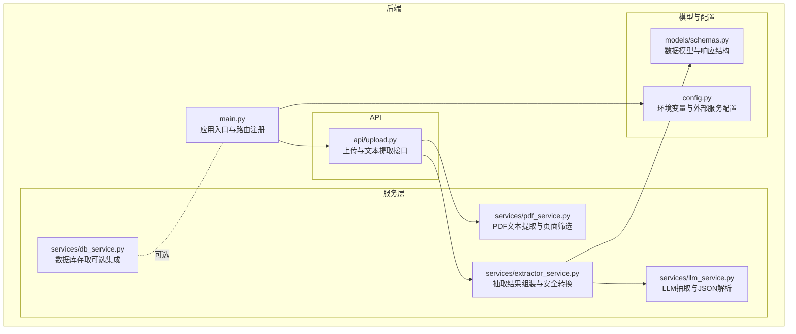
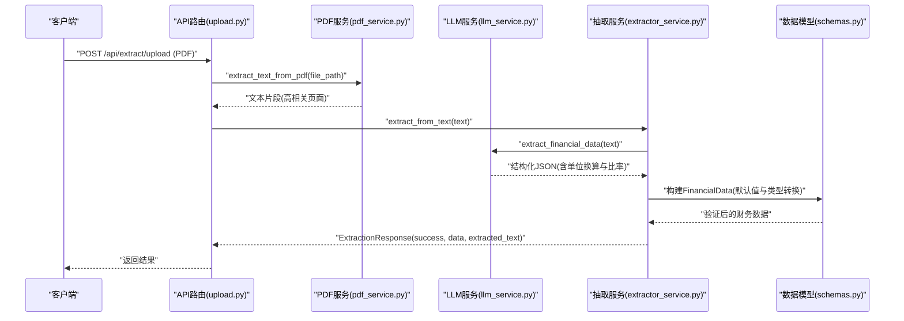
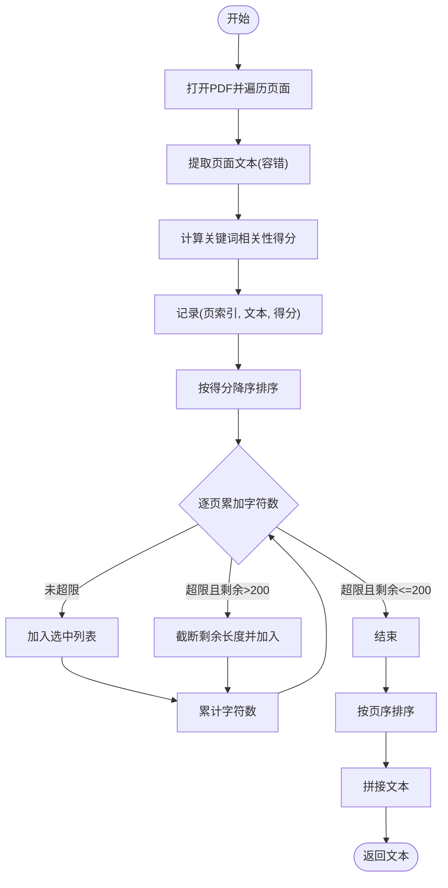
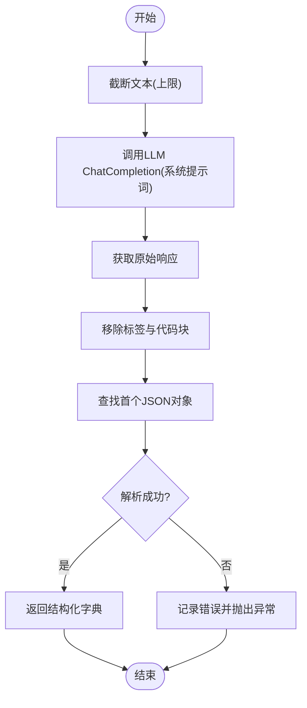
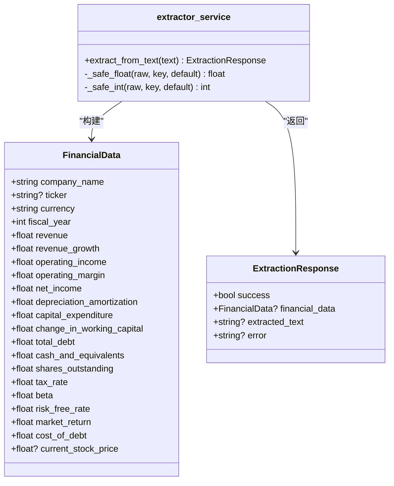
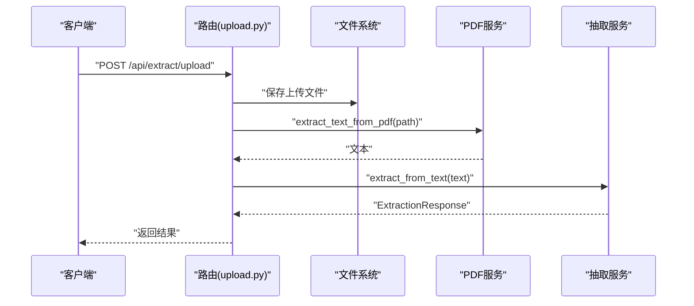
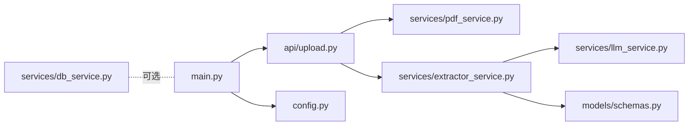

# 数据提取服务

<cite>
**本文引用的文件**
- [backend/main.py](file://backend/main.py)
- [backend/api/upload.py](file://backend/api/upload.py)
- [backend/services/pdf_service.py](file://backend/services/pdf_service.py)
- [backend/services/llm_service.py](file://backend/services/llm_service.py)
- [backend/services/extractor_service.py](file://backend/services/extractor_service.py)
- [backend/models/schemas.py](file://backend/models/schemas.py)
- [backend/config.py](file://backend/config.py)
- [backend/services/db_service.py](file://backend/services/db_service.py)
- [backend/DATABASE_README.md](file://backend/DATABASE_README.md)
- [backend/MYSQL_SETUP_GUIDE.md](file://backend/MYSQL_SETUP_GUIDE.md)
- [README.md](file://README.md)
</cite>

## 目录
1. [简介](#简介)
2. [项目结构](#项目结构)
3. [核心组件](#核心组件)
4. [架构总览](#架构总览)
5. [详细组件分析](#详细组件分析)
6. [依赖分析](#依赖分析)
7. [性能考量](#性能考量)
8. [故障排查指南](#故障排查指南)
9. [结论](#结论)
10. [附录](#附录)

## 简介
本技术文档聚焦“数据提取服务”模块，系统性阐述从PDF与文本中提取关键财务指标的算法实现与工程实践。内容涵盖：
- 财务数据识别规则与数值提取逻辑
- 格式转换与单位换算机制
- 正则表达式匹配策略、上下文分析与数据验证流程
- 多语言支持与货币汇率处理现状
- 数据清洗、异常值检测与缺失值填充策略
- 提取准确率评估、错误日志记录与人工校验接口
- 如何扩展支持新的财务指标与自定义提取规则

该模块基于FastAPI后端、pdfplumber解析PDF、MiniMax（OpenAI兼容）大模型进行结构化抽取，并通过Pydantic模型进行数据建模与验证。

## 项目结构
后端采用分层设计：API路由负责请求入口与参数校验；服务层封装PDF解析、LLM抽取与数据转换；模型层定义数据结构；配置层集中管理环境变量与外部服务地址。

图表来源
- [backend/main.py:18-35](file://backend/main.py#L18-L35)
- [backend/api/upload.py:16-54](file://backend/api/upload.py#L16-L54)
- [backend/services/pdf_service.py:26-67](file://backend/services/pdf_service.py#L26-L67)
- [backend/services/llm_service.py:70-155](file://backend/services/llm_service.py#L70-L155)
- [backend/services/extractor_service.py:27-66](file://backend/services/extractor_service.py#L27-L66)
- [backend/models/schemas.py:8-101](file://backend/models/schemas.py#L8-L101)
- [backend/config.py:10-22](file://backend/config.py#L10-L22)

章节来源
- [backend/main.py:18-35](file://backend/main.py#L18-L35)
- [README.md:77-107](file://README.md#L77-L107)

## 核心组件
- PDF文本提取与页面筛选：根据关键词权重对页面进行相关性排序，限制最大字符数，拼接高相关页面文本。
- LLM抽取：通过系统提示词引导模型按固定JSON结构输出，包含单位换算与比率标准化规则。
- 结果组装与安全转换：将LLM输出映射到Pydantic模型，提供默认值与类型安全转换。
- 数据模型：统一定义财务指标字段、默认值与序列化结构。
- 配置管理：集中管理MiniMax API密钥、基础URL、模型名与上传目录等。

章节来源
- [backend/services/pdf_service.py:8-16](file://backend/services/pdf_service.py#L8-L16)
- [backend/services/pdf_service.py:26-67](file://backend/services/pdf_service.py#L26-L67)
- [backend/services/llm_service.py:14-50](file://backend/services/llm_service.py#L14-L50)
- [backend/services/extractor_service.py:27-66](file://backend/services/extractor_service.py#L27-L66)
- [backend/models/schemas.py:8-30](file://backend/models/schemas.py#L8-L30)
- [backend/config.py:10-22](file://backend/config.py#L10-L22)

## 架构总览
下图展示了从PDF上传到结构化财务数据返回的端到端流程。

图表来源
- [backend/api/upload.py:16-54](file://backend/api/upload.py#L16-L54)
- [backend/services/pdf_service.py:26-67](file://backend/services/pdf_service.py#L26-L67)
- [backend/services/llm_service.py:94-123](file://backend/services/llm_service.py#L94-L123)
- [backend/services/extractor_service.py:27-66](file://backend/services/extractor_service.py#L27-L66)
- [backend/models/schemas.py:8-30](file://backend/models/schemas.py#L8-L30)

## 详细组件分析

### PDF文本提取与页面筛选
- 关键词集合：覆盖中文与英文的关键财务术语，用于页面相关性评分。
- 页面排序：将每页文本转为小写，统计关键词出现次数，按降序排列。
- 字符限制与截断：累计字符数超过阈值时，仅截取剩余部分并终止。
- 输出：按原始页序拼接高相关页面文本，便于后续LLM抽取。

图表来源
- [backend/services/pdf_service.py:26-67](file://backend/services/pdf_service.py#L26-L67)

章节来源
- [backend/services/pdf_service.py:8-16](file://backend/services/pdf_service.py#L8-L16)
- [backend/services/pdf_service.py:19-23](file://backend/services/pdf_service.py#L19-L23)
- [backend/services/pdf_service.py:26-67](file://backend/services/pdf_service.py#L26-L67)

### LLM抽取与JSON解析
- 系统提示词：明确要求返回JSON结构，强制单位统一为“元”，比率使用小数，缺失值进行合理估算。
- 输入截断：对过长文本进行截断，避免超出上下文长度限制。
- JSON解析：去除思考标签与代码块标记，提取首个JSON对象并解析。
- 错误处理：捕获JSON解析异常与通用异常，记录日志并抛出。

图表来源
- [backend/services/llm_service.py:94-123](file://backend/services/llm_service.py#L94-L123)
- [backend/services/llm_service.py:79-92](file://backend/services/llm_service.py#L79-L92)

章节来源
- [backend/services/llm_service.py:14-50](file://backend/services/llm_service.py#L14-L50)
- [backend/services/llm_service.py:79-92](file://backend/services/llm_service.py#L79-L92)
- [backend/services/llm_service.py:94-123](file://backend/services/llm_service.py#L94-L123)

### 结果组装与安全转换
- 映射字段：将LLM输出的关键字段映射到FinancialData模型，未提供的字段使用默认值。
- 类型安全转换：提供安全的浮点与整型转换函数，异常时回退为默认值。
- 成功/失败响应：统一包装为ExtractionResponse，包含成功标志、数据与错误信息。

图表来源
- [backend/models/schemas.py:8-30](file://backend/models/schemas.py#L8-L30)
- [backend/models/schemas.py:78-83](file://backend/models/schemas.py#L78-L83)
- [backend/services/extractor_service.py:11-25](file://backend/services/extractor_service.py#L11-L25)
- [backend/services/extractor_service.py:27-66](file://backend/services/extractor_service.py#L27-L66)

章节来源
- [backend/services/extractor_service.py:11-25](file://backend/services/extractor_service.py#L11-L25)
- [backend/services/extractor_service.py:27-66](file://backend/services/extractor_service.py#L27-L66)
- [backend/models/schemas.py:8-30](file://backend/models/schemas.py#L8-L30)
- [backend/models/schemas.py:78-83](file://backend/models/schemas.py#L78-L83)

### API入口与路由
- 上传接口：校验文件类型为PDF，保存至临时目录，调用PDF服务提取文本，再调用抽取服务。
- 文本接口：校验文本非空，直接调用抽取服务。
- 健康检查：提供服务可用性检测。

图表来源
- [backend/api/upload.py:16-54](file://backend/api/upload.py#L16-L54)

章节来源
- [backend/api/upload.py:16-54](file://backend/api/upload.py#L16-L54)
- [backend/main.py:37-39](file://backend/main.py#L37-L39)

### 数据模型与默认值
- 财务指标字段：覆盖收入、利润、现金流、资产负债、股本、税率、贝塔等常用指标。
- 默认值策略：对缺失或异常值提供合理默认，保证下游计算可用性。
- 序列化与校验：Pydantic自动进行字段类型与必填校验。

章节来源
- [backend/models/schemas.py:8-30](file://backend/models/schemas.py#L8-L30)

### 配置与外部服务
- MiniMax配置：API Key、基础URL、模型名集中管理。
- 上传目录：临时文件存放路径，应用生命周期内自动创建。

章节来源
- [backend/config.py:10-22](file://backend/config.py#L10-L22)

### 数据库服务（可选集成）
- 表结构：支持股票、公司档案、历史价格、三大报表等。
- 写入策略：使用“存在即更新”的策略，避免重复与一致性问题。
- 查询能力：支持按时间范围检索历史价格与财务报表。

章节来源
- [backend/services/db_service.py:54-232](file://backend/services/db_service.py#L54-L232)
- [backend/services/db_service.py:234-341](file://backend/services/db_service.py#L234-L341)
- [backend/DATABASE_README.md:60-121](file://backend/DATABASE_README.md#L60-L121)

## 依赖分析
- 组件耦合：API层仅依赖服务层；服务层内部职责清晰，低耦合。
- 外部依赖：pdfplumber用于PDF解析；MiniMax（OpenAI兼容）用于抽取；Pydantic用于数据建模。
- 配置依赖：config.py集中管理外部服务配置，便于替换与扩展。

图表来源
- [backend/api/upload.py:16-54](file://backend/api/upload.py#L16-L54)
- [backend/services/pdf_service.py:26-67](file://backend/services/pdf_service.py#L26-L67)
- [backend/services/extractor_service.py:27-66](file://backend/services/extractor_service.py#L27-L66)
- [backend/services/llm_service.py:70-155](file://backend/services/llm_service.py#L70-L155)
- [backend/models/schemas.py:8-101](file://backend/models/schemas.py#L8-L101)
- [backend/main.py:18-35](file://backend/main.py#L18-L35)
- [backend/config.py:10-22](file://backend/config.py#L10-L22)
- [backend/services/db_service.py:24-53](file://backend/services/db_service.py#L24-L53)

章节来源
- [backend/main.py:18-35](file://backend/main.py#L18-L35)
- [backend/api/upload.py:16-54](file://backend/api/upload.py#L16-L54)
- [backend/services/pdf_service.py:26-67](file://backend/services/pdf_service.py#L26-L67)
- [backend/services/llm_service.py:70-155](file://backend/services/llm_service.py#L70-L155)
- [backend/services/extractor_service.py:27-66](file://backend/services/extractor_service.py#L27-L66)
- [backend/models/schemas.py:8-101](file://backend/models/schemas.py#L8-L101)
- [backend/config.py:10-22](file://backend/config.py#L10-L22)
- [backend/services/db_service.py:24-53](file://backend/services/db_service.py#L24-L53)

## 性能考量
- PDF解析：页面相关性排序与字符数限制有助于减少LLM输入规模，提升吞吐与成本控制。
- LLM调用：温度与最大token已设定，建议结合业务场景调整；对超长文本进行截断可避免超限。
- 类型转换：安全转换函数避免异常传播，提高稳定性但可能掩盖潜在数据质量问题，建议配合日志与校验。
- 数据库存取：批量写入与事务回滚可降低失败率；注意唯一约束与外键依赖，避免重复与脏数据。

## 故障排查指南
- PDF无法提取文本
  - 检查页面是否为空或解析异常；确认文件为PDF类型。
  - 参考：[backend/services/pdf_service.py:34-40](file://backend/services/pdf_service.py#L34-L40)
- LLM返回无效JSON
  - 检查系统提示词是否严格；确认输出被正确剥离标记并解析。
  - 参考：[backend/services/llm_service.py:82-92](file://backend/services/llm_service.py#L82-L92)
- 抽取失败或字段缺失
  - 查看错误日志；确认默认值策略是否合理；必要时人工校验。
  - 参考：[backend/services/extractor_service.py:61-66](file://backend/services/extractor_service.py#L61-L66)
- 数据库连接问题
  - 检查MySQL服务状态、端口与凭据；参考数据库设置指南。
  - 参考：[backend/MYSQL_SETUP_GUIDE.md:13-83](file://backend/MYSQL_SETUP_GUIDE.md#L13-L83)

章节来源
- [backend/services/pdf_service.py:34-40](file://backend/services/pdf_service.py#L34-L40)
- [backend/services/llm_service.py:82-92](file://backend/services/llm_service.py#L82-L92)
- [backend/services/extractor_service.py:61-66](file://backend/services/extractor_service.py#L61-L66)
- [backend/MYSQL_SETUP_GUIDE.md:13-83](file://backend/MYSQL_SETUP_GUIDE.md#L13-L83)

## 结论
数据提取服务通过“PDF页面筛选 + LLM结构化抽取 + 安全转换”的组合，实现了从非结构化财务文本到结构化财务数据的自动化流程。系统具备良好的扩展性与可维护性，可通过完善提示词、增强数据校验与引入数据库持久化进一步提升准确性与可靠性。

## 附录

### 财务指标字段与默认值
- 字段清单与默认值参见数据模型定义。
- 参考：[backend/models/schemas.py:8-30](file://backend/models/schemas.py#L8-L30)

### 单位转换与比率规范
- LLM提示词要求统一为“元”，并以小数形式表示比率。
- 参考：[backend/services/llm_service.py:43-49](file://backend/services/llm_service.py#L43-L49)

### 多语言支持现状
- 前端提供中英双语界面；后端抽取与提示词目前以中文为主。
- 参考：[README.md:11](file://README.md#L11)

### 货币汇率处理
- 当前抽取流程未包含汇率转换逻辑；若需支持多币种，可在抽取后增加汇率映射与换算。
- 参考：[backend/services/llm_service.py:43-49](file://backend/services/llm_service.py#L43-L49)

### 数据清洗与异常值检测
- 异常值检测：建议在抽取后基于历史趋势与行业均值进行合理性校验。
- 缺失值填充：优先使用模型估算，其次使用默认值，最后提示人工干预。
- 参考：[backend/services/extractor_service.py:11-25](file://backend/services/extractor_service.py#L11-L25)

### 人工校验接口
- 当前未提供专用的人工校验接口；可在API层新增校验路由与状态管理。
- 参考：[backend/api/upload.py:16-54](file://backend/api/upload.py#L16-L54)

### 扩展新指标与自定义规则
- 新增指标：在数据模型中添加字段并在抽取服务中映射；更新提示词与默认值策略。
- 自定义规则：通过调整关键词集合与提示词模板实现领域适配。
- 参考：[backend/models/schemas.py:8-30](file://backend/models/schemas.py#L8-L30)
- 参考：[backend/services/pdf_service.py:8-16](file://backend/services/pdf_service.py#L8-L16)
- 参考：[backend/services/llm_service.py:14-50](file://backend/services/llm_service.py#L14-L50)