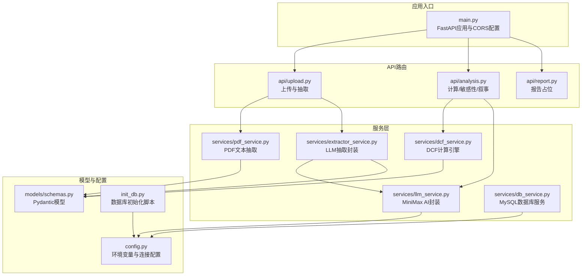
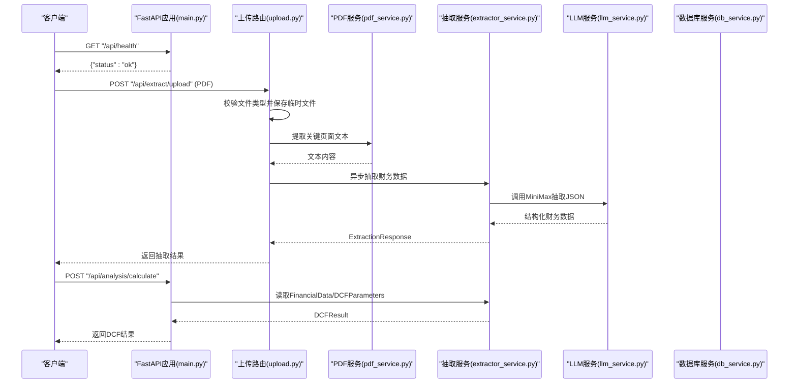
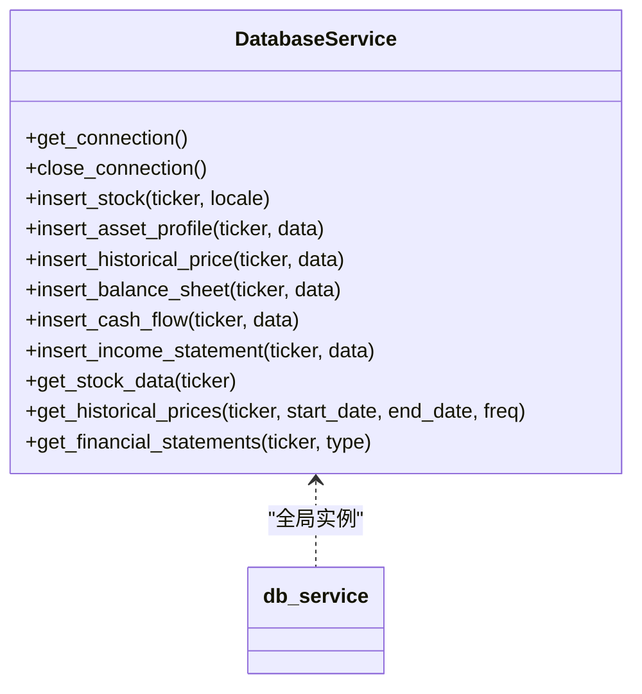
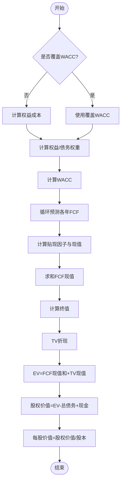
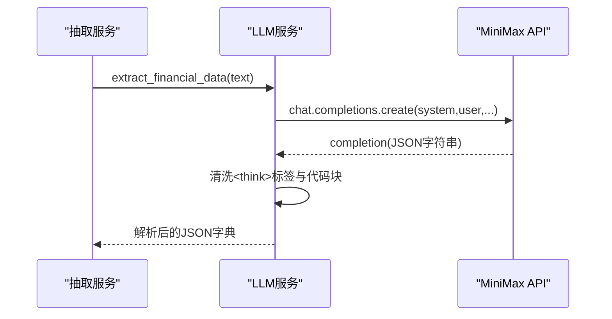
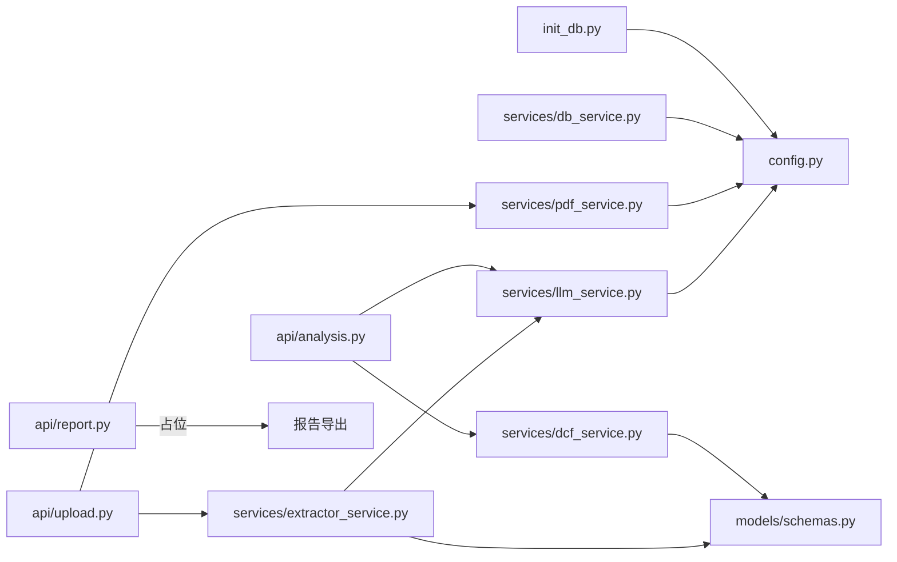

# 后端服务

<cite>
**本文引用的文件**
- [main.py](file://backend/main.py)
- [config.py](file://backend/config.py)
- [init_db.py](file://backend/init_db.py)
- [schemas.py](file://backend/models/schemas.py)
- [db_service.py](file://backend/services/db_service.py)
- [dcf_service.py](file://backend/services/dcf_service.py)
- [extractor_service.py](file://backend/services/extractor_service.py)
- [llm_service.py](file://backend/services/llm_service.py)
- [pdf_service.py](file://backend/services/pdf_service.py)
- [upload.py](file://backend/api/upload.py)
- [analysis.py](file://backend/api/analysis.py)
- [report.py](file://backend/api/report.py)
- [db_usage_example.py](file://backend/examples/db_usage_example.py)
- [integration_example.py](file://backend/examples/integration_example.py)
</cite>

## 目录
1. [简介](#简介)
2. [项目结构](#项目结构)
3. [核心组件](#核心组件)
4. [架构总览](#架构总览)
5. [详细组件分析](#详细组件分析)
6. [依赖分析](#依赖分析)
7. [性能考虑](#性能考虑)
8. [故障排查指南](#故障排查指南)
9. [结论](#结论)
10. [附录](#附录)

## 简介
本项目为DCF估值智能体后端服务，采用FastAPI构建REST API，提供PDF/文本财务数据抽取、DCF计算引擎、AI服务封装以及PDF处理能力，并通过MySQL存储历史财务数据。系统通过异步生命周期管理、CORS跨域支持、模块化服务与路由组织，形成清晰的数据流与调用链路。

## 项目结构
后端目录采用“API层-服务层-模型层-工具脚本”的分层组织方式：
- API层：按功能划分路由模块，分别处理上传与抽取、分析计算、报告占位等。
- 服务层：封装数据库、DCF计算、AI抽取、PDF解析等核心业务逻辑。
- 模型层：定义Pydantic数据模型，用于请求/响应校验与序列化。
- 工具脚本：数据库初始化与使用示例，演示数据入库与检索流程。

图表来源
- [main.py:18-34](file://backend/main.py#L18-L34)
- [upload.py:13-54](file://backend/api/upload.py#L13-L54)
- [analysis.py:15-44](file://backend/api/analysis.py#L15-L44)
- [report.py:5-11](file://backend/api/report.py#L5-L11)
- [pdf_service.py:26-67](file://backend/services/pdf_service.py#L26-L67)
- [extractor_service.py:27-66](file://backend/services/extractor_service.py#L27-L66)
- [dcf_service.py:85-162](file://backend/services/dcf_service.py#L85-L162)
- [llm_service.py:70-154](file://backend/services/llm_service.py#L70-L154)
- [db_service.py:24-344](file://backend/services/db_service.py#L24-L344)
- [schemas.py:8-101](file://backend/models/schemas.py#L8-L101)
- [config.py:10-21](file://backend/config.py#L10-L21)
- [init_db.py:13-19](file://backend/init_db.py#L13-L19)

章节来源
- [main.py:18-40](file://backend/main.py#L18-L40)
- [config.py:10-21](file://backend/config.py#L10-L21)

## 核心组件
- 应用生命周期与CORS
  - 使用异步生命周期钩子确保上传目录存在；启用CORS允许任意源访问。
- 数据模型
  - 定义财务数据、DCF参数、现金流预测、结果、敏感性矩阵、抽取与叙事请求/响应等模型。
- 服务模块
  - 数据库服务：提供股票、资产档案、历史价格、三大报表的增删改查与组合查询。
  - DCF计算引擎：实现WACC计算、自由现金流预测、终值与现值计算、敏感性分析。
  - AI服务封装：封装MiniMax（OpenAI兼容）调用，支持财务数据抽取与专业叙事生成。
  - PDF处理服务：按关键词相关度选择关键页面，限制最大字符数并拼接输出。
  - 数据抽取服务：对LLM输出进行安全解析与类型转换，包装为统一响应模型。
- API路由
  - 上传与抽取：支持PDF上传与文本直传，返回抽取结果。
  - 分析计算：提供DCF计算、敏感性分析、叙事生成。
  - 报告占位：预留导出能力。

章节来源
- [main.py:12-40](file://backend/main.py#L12-L40)
- [schemas.py:8-101](file://backend/models/schemas.py#L8-L101)
- [db_service.py:24-344](file://backend/services/db_service.py#L24-L344)
- [dcf_service.py:12-162](file://backend/services/dcf_service.py#L12-L162)
- [llm_service.py:70-154](file://backend/services/llm_service.py#L70-L154)
- [pdf_service.py:26-67](file://backend/services/pdf_service.py#L26-L67)
- [extractor_service.py:27-66](file://backend/services/extractor_service.py#L27-L66)
- [upload.py:16-54](file://backend/api/upload.py#L16-L54)
- [analysis.py:18-44](file://backend/api/analysis.py#L18-L44)
- [report.py:8-11](file://backend/api/report.py#L8-L11)

## 架构总览
系统采用“API网关式”路由组织，服务间通过明确的输入/输出模型解耦，数据库服务作为持久化层被多处读取与写入。

图表来源
- [main.py:37-39](file://backend/main.py#L37-L39)
- [upload.py:16-43](file://backend/api/upload.py#L16-L43)
- [pdf_service.py:26-67](file://backend/services/pdf_service.py#L26-L67)
- [extractor_service.py:27-66](file://backend/services/extractor_service.py#L27-L66)
- [llm_service.py:94-122](file://backend/services/llm_service.py#L94-L122)
- [analysis.py:18-23](file://backend/api/analysis.py#L18-L23)

## 详细组件分析

### FastAPI应用与生命周期
- 生命周期管理：通过异步上下文管理器在启动时确保上传目录存在，避免运行期异常。
- CORS配置：允许任意源、方法与头，便于前端跨域访问。
- 路由注册：统一挂载三个模块路由，前缀均为“/api”。

章节来源
- [main.py:12-22](file://backend/main.py#L12-L22)
- [main.py:24-34](file://backend/main.py#L24-L34)
- [main.py:37-39](file://backend/main.py#L37-L39)

### 配置与环境变量
- MiniMax接入：包含API Key、Base URL、模型名等。
- MySQL配置：主机、用户、密码、端口、数据库名。
- 上传目录：后端工作目录下的临时上传路径。

章节来源
- [config.py:10-21](file://backend/config.py#L10-L21)

### 数据模型与校验
- FinancialData：财务基础字段集合，含公司名称、股票代码、货币、财年、收入、增长率、利润、折旧摊销、资本支出、营运资本变动、债务、现金、股本、税率、贝塔、无风收益率、市场回报、债务成本、当前股价等。
- DCFParameters：投影年数、营收增长率、终值增长率、运营利润率、税率、CAPEX/DA/NWC比率、WACC、折扣率覆盖。
- FCFProjection：每年预测的收入、运营利润、NOPAT、折旧摊销、CAPEX、NWC变动、FCF、贴现因子、现值。
- DCFResult：终值、TV现值、FCF现值合计、企业价值、股权价值、每股价值、当前股价、上/下空间、使用的WACC与终值增长率。
- SensitivityMatrix：WACC与终值增长率的二维敏感性矩阵。
- ExtractionResponse/NarrativeRequest/NarrativeResponse：抽取与叙事的请求/响应模型。
- CalculateRequest：计算请求，包含FinancialData与DCFParameters。

章节来源
- [schemas.py:8-101](file://backend/models/schemas.py#L8-L101)

### 数据库服务（db_service）
- 连接管理：延迟建立连接，自动重连；提供关闭连接方法。
- 写入操作：插入股票、资产档案、历史价格、资产负债表、现金流量表、利润表；均使用“若存在则更新”的策略保证幂等。
- 读取操作：按股票代码聚合基本信息与最新报表；按条件查询历史价格；批量查询三大报表。
- 全局实例：提供db_service单例，便于导入使用。

图表来源
- [db_service.py:24-344](file://backend/services/db_service.py#L24-L344)

章节来源
- [db_service.py:24-344](file://backend/services/db_service.py#L24-L344)

### DCF计算引擎（dcf_service）
- WACC计算：支持显式覆盖；否则基于CAPM与目标资本结构计算加权平均成本。
- 自由现金流预测：按营收增长率与运营利润率推导NOPAT，再加折旧摊销减去CAPEX与NWC变动得到FCF，按WACC贴现求现值。
- 终值与现值：当WACC大于终值增长率时计算终值，再折现至现值并加总得到企业价值，再调整债务与现金得到股权价值，除以股本得到每股价值。
- 敏感性分析：围绕WACC与终值增长率生成二维矩阵，计算不同组合下的目标股价。

图表来源
- [dcf_service.py:12-121](file://backend/services/dcf_service.py#L12-L121)

章节来源
- [dcf_service.py:12-162](file://backend/services/dcf_service.py#L12-L162)

### AI服务封装（llm_service）
- MiniMax接入：使用AsyncOpenAI客户端，配置Base URL与模型名。
- 财务数据抽取：系统提示词引导从财务报告中抽取结构化JSON，包含金额单位换算规则与缺失值估算策略；对输出进行正则清洗与JSON解析。
- 叙事生成：根据财务数据与DCF结果生成专业的英文/中文叙述分析。
- 错误处理：捕获JSON解析失败与通用异常，记录日志并抛出。

图表来源
- [llm_service.py:94-122](file://backend/services/llm_service.py#L94-L122)
- [llm_service.py:14-50](file://backend/services/llm_service.py#L14-L50)

章节来源
- [llm_service.py:70-154](file://backend/services/llm_service.py#L70-L154)

### PDF处理服务（pdf_service）
- 关键词相关度评分：统计文本中财务关键词出现次数，按相关度排序。
- 页面选择与拼接：限制最大字符数，优先选取高相关度页面，最终按页码顺序拼接。
- 日志记录：输出提取字符数、选中页数与总页数信息。

章节来源
- [pdf_service.py:8-67](file://backend/services/pdf_service.py#L8-L67)

### 数据抽取服务（extractor_service）
- 类型安全转换：对数值字段进行安全转换，防止异常导致流程中断。
- 统一响应：将LLM抽取结果映射到FinancialData模型，并截断原始文本长度，返回ExtractionResponse。

章节来源
- [extractor_service.py:11-66](file://backend/services/extractor_service.py#L11-L66)

### API路由
- 上传与抽取
  - 支持PDF上传与文本直传两种入口；PDF上传后先解析文本，再交由抽取服务；均返回统一的ExtractionResponse。
- 分析计算
  - 计算：接收CalculateRequest，返回DCFResult。
  - 敏感性：接收CalculateRequest，返回SensitivityMatrix。
  - 叙事：接收NarrativeRequest，返回NarrativeResponse。
- 报告占位
  - 提供健康检查与导出格式占位。

章节来源
- [upload.py:16-54](file://backend/api/upload.py#L16-L54)
- [analysis.py:18-44](file://backend/api/analysis.py#L18-L44)
- [report.py:8-11](file://backend/api/report.py#L8-L11)

## 依赖分析
- 外部依赖
  - FastAPI：应用框架与路由。
  - OpenAI SDK（兼容MiniMax）：调用大模型完成抽取与叙事。
  - pdfplumber：解析PDF并提取文本。
  - PyMySQL：MySQL连接与事务控制。
  - python-dotenv：加载.env环境变量。
- 内部依赖
  - API层依赖服务层；服务层依赖模型层与配置；数据库服务与LLM服务依赖配置。
  - 上传路由依赖PDF服务与抽取服务；分析路由依赖DCF服务与LLM服务。

图表来源
- [upload.py:10-11](file://backend/api/upload.py#L10-L11)
- [analysis.py:12-13](file://backend/api/analysis.py#L12-L13)
- [extractor_service.py:5-6](file://backend/services/extractor_service.py#L5-L6)
- [llm_service.py:10](file://backend/services/llm_service.py#L10)
- [pdf_service.py:4](file://backend/services/pdf_service.py#L4)
- [db_service.py:15-21](file://backend/services/db_service.py#L15-L21)
- [init_db.py:13-19](file://backend/init_db.py#L13-L19)
- [schemas.py:5](file://backend/models/schemas.py#L5)

## 性能考虑
- I/O与并发
  - PDF解析与LLM调用为IO密集型，建议在生产环境使用异步并发与连接池；当前实现已采用异步函数与异步客户端。
- 数据库连接
  - 采用延迟连接与手动关闭，避免长连接占用资源；建议在高并发场景引入连接池或复用连接。
- 文本截断与过滤
  - LLM输入文本与PDF抽取均有限制字符数，避免超长输入导致延迟与费用增加。
- 缓存与幂等
  - 历史价格与财务报表写入使用“ON DUPLICATE KEY UPDATE”，减少重复写入开销。
- 监控指标建议
  - 请求耗时、错误率、LLM调用次数与Token用量、PDF解析耗时、数据库查询耗时与慢查询。

[本节为通用性能指导，不直接分析具体文件，故无章节来源]

## 故障排查指南
- 健康检查
  - 访问“/api/health”确认服务可用。
- CORS问题
  - 若前端跨域失败，检查CORS配置项是否符合预期。
- 文件上传
  - 确认上传文件为PDF且大小适中；查看临时目录权限与磁盘空间。
- LLM抽取失败
  - 检查MiniMax配置（Key/Base URL/Model），查看日志中的JSON解析错误与异常堆栈。
- 数据库连接失败
  - 检查MySQL主机、端口、账号、密码与数据库名；确认网络可达与防火墙放行。
- 数据库初始化
  - 使用初始化脚本创建数据库与表；关注错误输出与回滚日志。

章节来源
- [main.py:37-39](file://backend/main.py#L37-L39)
- [upload.py:19-20](file://backend/api/upload.py#L19-L20)
- [llm_service.py:117-122](file://backend/services/llm_service.py#L117-L122)
- [init_db.py:22-36](file://backend/init_db.py#L22-L36)

## 结论
本后端服务以FastAPI为核心，结合MiniMax大模型与MySQL数据库，提供了从PDF/文本抽取到DCF估值与敏感性分析的完整链路。通过清晰的分层设计与模型驱动的输入输出，系统具备良好的可维护性与扩展性。建议在生产环境中完善连接池、缓存与监控体系，并持续优化LLM提示词与解析健壮性。

[本节为总结性内容，不直接分析具体文件，故无章节来源]

## 附录

### 数据库初始化与使用示例
- 初始化脚本：创建数据库与表结构，包含股票、资产档案、历史价格、资产负债表、现金流量表、利润表。
- 使用示例：演示插入与查询股票、财务报表与历史价格，以及从数据库准备DCF输入参数的流程。

章节来源
- [init_db.py:172-211](file://backend/init_db.py#L172-L211)
- [db_usage_example.py:15-170](file://backend/examples/db_usage_example.py#L15-L170)
- [integration_example.py:16-346](file://backend/examples/integration_example.py#L16-L346)