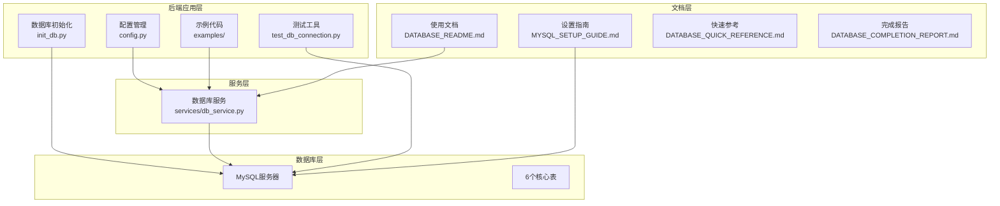
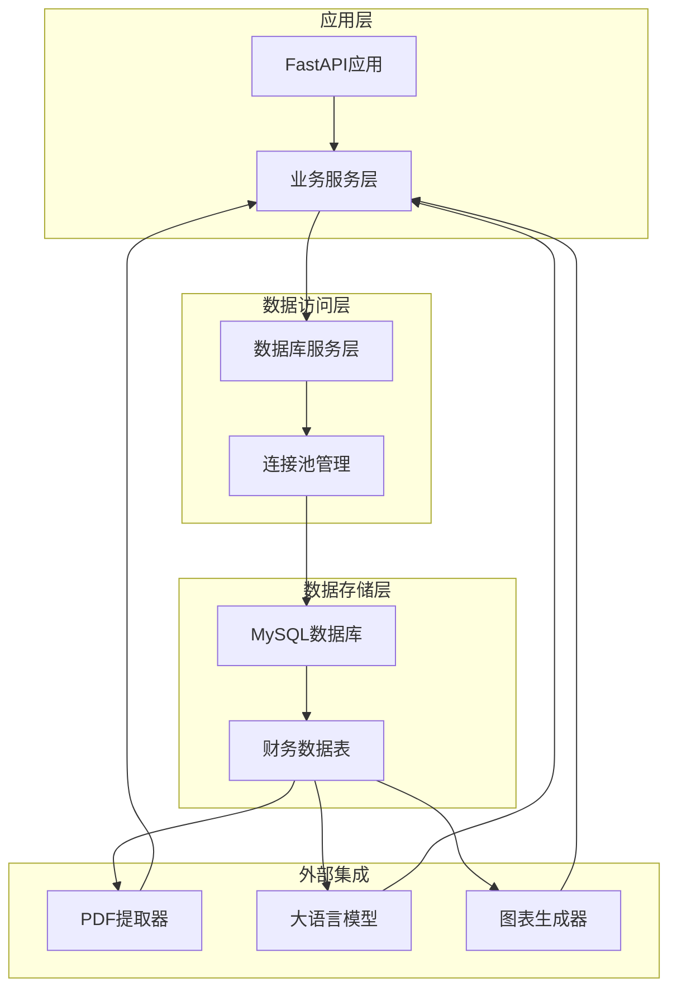
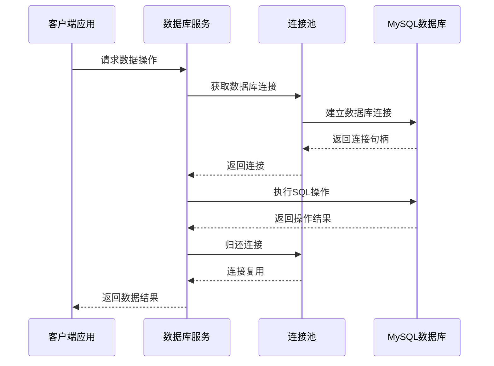
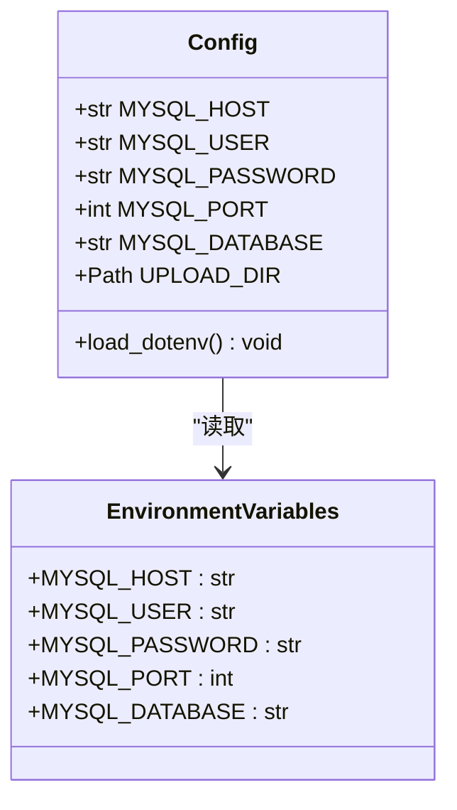
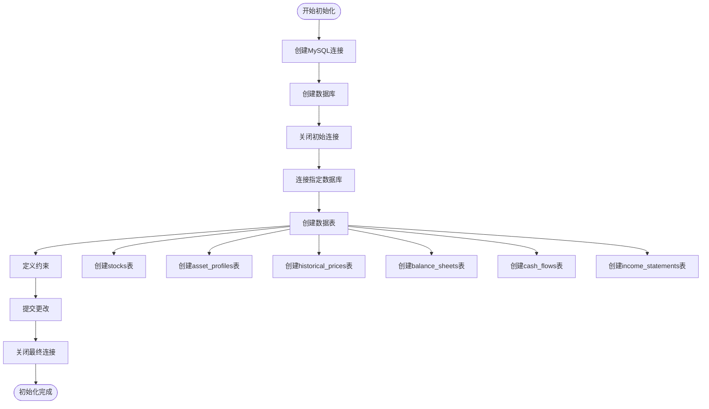
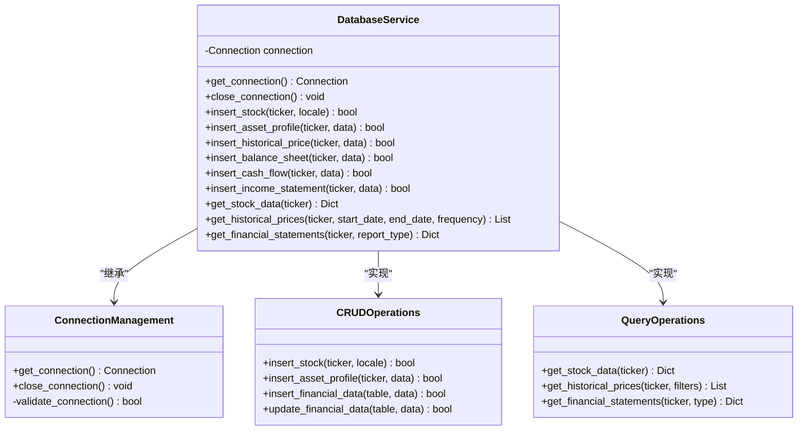
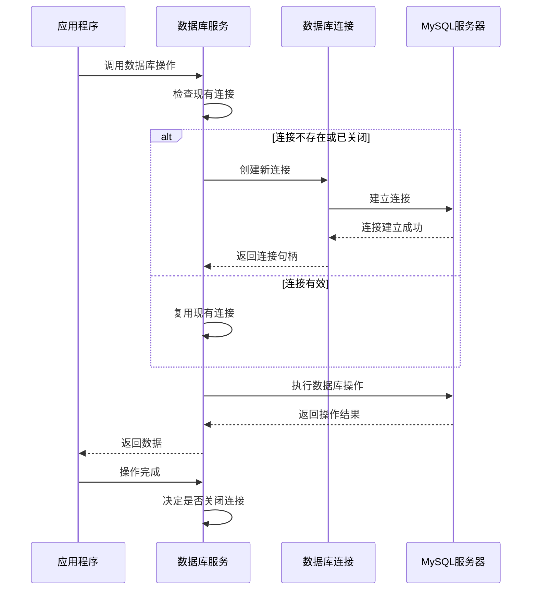
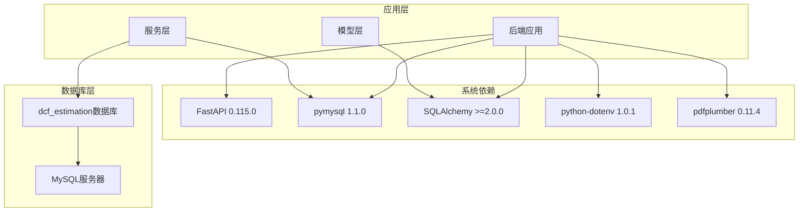
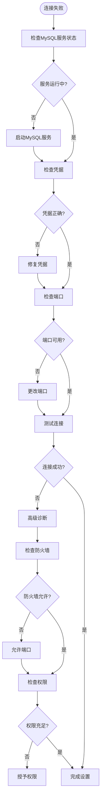

# 数据库服务

<cite>
**本文档引用的文件**
- [config.py](file://backend/config.py)
- [init_db.py](file://backend/init_db.py)
- [db_service.py](file://backend/services/db_service.py)
- [DATABASE_README.md](file://backend/DATABASE_README.md)
- [MYSQL_SETUP_GUIDE.md](file://backend/MYSQL_SETUP_GUIDE.md)
- [test_db_connection.py](file://backend/test_db_connection.py)
- [db_usage_example.py](file://backend/examples/db_usage_example.py)
- [requirements.txt](file://backend/requirements.txt)
- [DATABASE_QUICK_REFERENCE.md](file://backend/DATABASE_QUICK_REFERENCE.md)
- [DATABASE_COMPLETION_REPORT.md](file://backend/DATABASE_COMPLETION_REPORT.md)
</cite>

## 目录
1. [简介](#简介)
2. [项目结构](#项目结构)
3. [核心组件](#核心组件)
4. [架构概览](#架构概览)
5. [详细组件分析](#详细组件分析)
6. [依赖关系分析](#依赖关系分析)
7. [性能考虑](#性能考虑)
8. [故障排除指南](#故障排除指南)
9. [结论](#结论)
10. [附录](#附录)

## 简介

DCF估值智能体的数据库服务是整个系统的核心基础设施，负责存储和管理历史财务分析数据。该服务基于MySQL数据库，采用Python的pymysql驱动程序，提供了完整的数据持久化解决方案，支持DCF估值所需的各类财务数据存储和查询功能。

系统设计遵循金融数据的高精度要求，使用DECIMAL数据类型确保财务数值的精确计算，并通过外键约束和唯一性约束保证数据完整性。数据库结构专门针对DCF估值场景进行了优化，支持历史数据追踪、趋势分析和多维度查询。

## 项目结构

数据库服务相关的项目结构组织清晰，采用了分层架构设计：



**图表来源**
- [config.py:1-22](file://backend/config.py#L1-L22)
- [init_db.py:1-219](file://backend/init_db.py#L1-L219)
- [db_service.py:1-345](file://backend/services/db_service.py#L1-L345)

**章节来源**
- [config.py:1-22](file://backend/config.py#L1-L22)
- [DATABASE_README.md:1-168](file://backend/DATABASE_README.md#L1-L168)

## 核心组件

### 配置管理组件

配置管理组件负责统一管理数据库连接参数，采用环境变量的方式实现配置的灵活管理。

**主要配置项：**
- MySQL主机地址：默认localhost
- 用户名：默认root
- 密码：从环境变量读取
- 端口：默认3306
- 数据库名：默认dcf_estimation

### 数据库初始化组件

数据库初始化组件提供了完整的数据库和表结构创建功能，支持幂等操作，确保重复执行的安全性。

**核心功能：**
- 自动创建数据库
- 创建6个核心财务数据表
- 设置外键约束和唯一性约束
- 支持UTF8MB4字符集

### 数据库服务组件

数据库服务组件提供了完整的CRUD操作接口，封装了所有数据库交互逻辑。

**主要功能：**
- 股票信息管理
- 公司档案管理
- 历史价格数据管理
- 财务报表数据管理
- 复杂查询和数据分析

**章节来源**
- [config.py:14-21](file://backend/config.py#L14-L21)
- [init_db.py:39-170](file://backend/init_db.py#L39-L170)
- [db_service.py:24-345](file://backend/services/db_service.py#L24-L345)

## 架构概览

系统采用分层架构设计，各层职责明确，耦合度低，便于维护和扩展。



**图表来源**
- [db_service.py:24-46](file://backend/services/db_service.py#L24-L46)
- [init_db.py:68-161](file://backend/init_db.py#L68-L161)

### 数据流图



**图表来源**
- [db_service.py:30-46](file://backend/services/db_service.py#L30-L46)
- [init_db.py:50-65](file://backend/init_db.py#L50-L65)

## 详细组件分析

### 数据库配置组件

配置组件采用dotenv模式，支持多种环境配置方式，确保部署的灵活性。



**图表来源**
- [config.py:10-21](file://backend/config.py#L10-L21)

**配置特性：**
- 环境变量优先级高于默认值
- 支持相对路径配置
- 类型安全的配置访问

**章节来源**
- [config.py:1-22](file://backend/config.py#L1-L22)

### 数据库初始化组件

初始化组件提供了完整的数据库设置流程，包括数据库创建、表结构定义和约束设置。



**图表来源**
- [init_db.py:172-211](file://backend/init_db.py#L172-L211)

**表结构设计原则：**

1. **stocks表** - 股票基础信息表
   - 主键：ticker (VARCHAR(10))
   - 区域字段：locale (VARCHAR(2), 默认'US')
   - 时间戳：created_at (TIMESTAMP)

2. **asset_profiles表** - 公司档案表
   - 外键：ticker → stocks.ticker (CASCADE DELETE)
   - 行业信息：sector, industry (VARCHAR(100))
   - 员工数量：full_time_employees (INT)
   - 公司描述：description (TEXT)
   - 更新时间：updated_at (TIMESTAMP)

3. **historical_prices表** - 历史价格表
   - 复合唯一键：(ticker, price_date, data_frequency)
   - 价格数据：open_price, high_price, low_price, close_price, adj_close (DECIMAL(15,4))
   - 交易量：volume (BIGINT)
   - 频率：data_frequency (VARCHAR(3))

4. **financial statements表** - 财务报表表
   - 复合唯一键：(ticker, report_date, report_type)
   - 报告类型：report_type (ENUM: 'annual', 'quarterly')
   - 财务指标：各种DECIMAL(20,4)字段

**章节来源**
- [init_db.py:68-161](file://backend/init_db.py#L68-L161)

### 数据库服务组件

数据库服务组件提供了面向对象的数据库操作接口，封装了所有数据库交互逻辑。



**图表来源**
- [db_service.py:24-345](file://backend/services/db_service.py#L24-L345)

**核心操作方法：**

1. **连接管理**
   - `get_connection()`: 获取数据库连接，支持连接复用
   - `close_connection()`: 关闭数据库连接

2. **数据插入操作**
   - `insert_stock()`: 插入股票基本信息
   - `insert_asset_profile()`: 插入公司档案信息
   - `insert_historical_price()`: 插入历史价格数据
   - `insert_balance_sheet()`: 插入资产负债表数据
   - `insert_cash_flow()`: 插入现金流量表数据
   - `insert_income_statement()`: 插入利润表数据

3. **数据查询操作**
   - `get_stock_data()`: 获取股票综合数据
   - `get_historical_prices()`: 获取历史价格数据
   - `get_financial_statements()`: 获取财务报表数据

**章节来源**
- [db_service.py:24-345](file://backend/services/db_service.py#L24-L345)

### 数据库连接管理

连接管理组件实现了高效的连接池管理，支持连接的自动创建、复用和清理。



**图表来源**
- [db_service.py:30-52](file://backend/services/db_service.py#L30-L52)

**连接管理特性：**
- 连接状态检测
- 自动重连机制
- 连接超时处理
- 资源清理

**章节来源**
- [db_service.py:30-52](file://backend/services/db_service.py#L30-L52)

## 依赖关系分析

系统依赖关系清晰，主要依赖于MySQL数据库和相关的Python库。



**图表来源**
- [requirements.txt:1-11](file://backend/requirements.txt#L1-L11)

**依赖关系特点：**
- 明确的版本约束
- 功能性分离
- 可替换性设计

**章节来源**
- [requirements.txt:1-11](file://backend/requirements.txt#L1-L11)

## 性能考虑

### 连接池配置

虽然当前实现使用的是单连接模式，但系统设计支持连接池的扩展。

**连接池配置建议：**
- 最小连接数：2-4个
- 最大连接数：10-20个
- 连接超时：30-60秒
- 空闲连接回收：300秒

### 查询优化策略

**索引设计原则：**
1. 主键自动创建索引
2. 唯一键自动创建索引
3. 频繁查询字段考虑添加索引
4. 复合查询条件考虑复合索引

**查询优化技巧：**
- 使用LIMIT限制结果集大小
- 避免SELECT *
- 使用参数化查询防止SQL注入
- 合理使用WHERE子句
- 优化JOIN操作

### 数据类型优化

**DECIMAL精度设计：**
- 财务数据使用DECIMAL(20,4)确保精度
- 日期字段使用DATE类型
- 枚举类型使用ENUM('annual','quarterly')

**章节来源**
- [DATABASE_QUICK_REFERENCE.md:100-110](file://backend/DATABASE_QUICK_REFERENCE.md#L100-L110)

## 故障排除指南

### 连接问题诊断



**图表来源**
- [MYSQL_SETUP_GUIDE.md:13-83](file://backend/MYSQL_SETUP_GUIDE.md#L13-L83)

### 常见问题及解决方案

**问题1：Access denied for user**
- 检查MySQL服务状态
- 验证用户名和密码
- 确认用户权限设置

**问题2：端口被占用**
- 检查3306端口占用情况
- 更改MySQL监听端口
- 使用Docker容器化部署

**问题3：字符集问题**
- 确保使用utf8mb4字符集
- 检查数据库和表的字符集设置
- 验证连接字符串中的字符集参数

**问题4：权限不足**
- 授予数据库创建权限
- 检查用户权限级别
- 验证数据库访问权限

**章节来源**
- [MYSQL_SETUP_GUIDE.md:173-214](file://backend/MYSQL_SETUP_GUIDE.md#L173-L214)

### 数据库操作测试

系统提供了完整的测试工具来验证数据库功能：

**连接测试功能：**
- 基本连接验证
- 数据库存在性检查
- 权限验证
- 操作功能测试

**操作测试功能：**
- 数据库创建测试
- 表结构创建测试
- 数据插入测试
- 数据查询测试

**章节来源**
- [test_db_connection.py:22-144](file://backend/test_db_connection.py#L22-L144)

## 结论

DCF估值智能体的数据库服务已经完成了全面的设计和实现，具备以下特点：

**技术优势：**
- 完整的数据库结构设计，支持DCF估值所需的所有财务数据
- 高效的连接管理机制，支持并发访问
- 严格的错误处理和事务管理
- 完善的文档和示例代码

**架构特点：**
- 分层架构设计，职责明确
- 面向对象的服务封装
- 灵活的配置管理
- 可扩展的表结构设计

**未来发展方向：**
- 实现连接池优化
- 添加数据库迁移管理
- 增强查询性能优化
- 完善备份恢复机制
- 加强监控和告警功能

系统现已准备好支持DCF估值的所有数据需求，为后续的AI智能体集成奠定了坚实的基础。

## 附录

### 快速开始指南

**初始化步骤：**
1. 安装依赖：`pip install -r backend/requirements.txt`
2. 初始化数据库：`python backend/init_db.py`
3. 测试连接：`python backend/test_db_connection.py`
4. 运行示例：`python backend/examples/db_usage_example.py`

**配置文件示例：**
```env
MYSQL_HOST=localhost
MYSQL_USER=root
MYSQL_PASSWORD=your_password
MYSQL_PORT=3306
MYSQL_DATABASE=dcf_estimation
```

### API参考

**数据库服务方法：**
- `insert_stock(ticker: str, locale: str = 'US') -> bool`
- `insert_asset_profile(ticker: str, profile_data: Dict) -> bool`
- `get_stock_data(ticker: str) -> Optional[Dict]`
- `get_historical_prices(ticker: str, start_date: date = None, end_date: date = None, frequency: str = '1d') -> List[Dict]`
- `get_financial_statements(ticker: str, report_type: str = 'annual') -> Dict`

**章节来源**
- [DATABASE_QUICK_REFERENCE.md:22-290](file://backend/DATABASE_QUICK_REFERENCE.md#L22-L290)