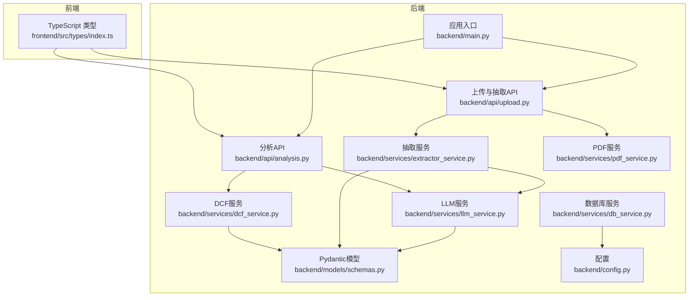
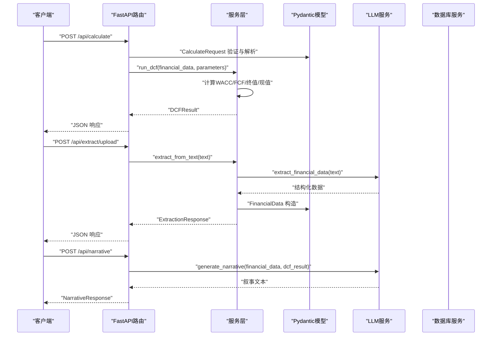
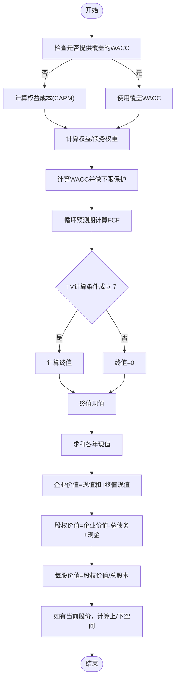
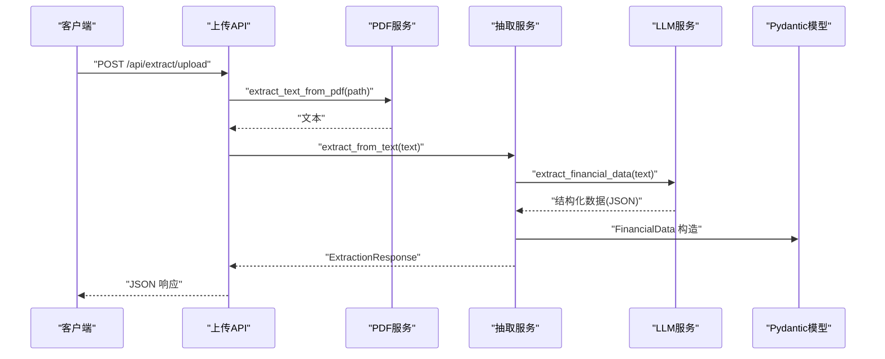
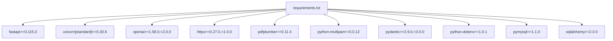
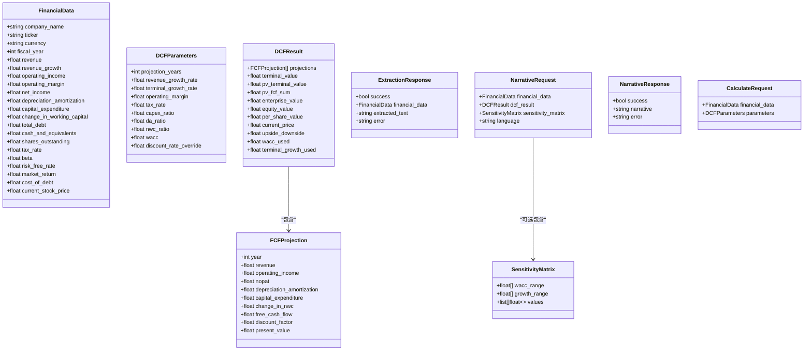

# 数据模型与验证

<cite>
**本文引用的文件**
- [schemas.py](file://backend/models/schemas.py)
- [dcf_service.py](file://backend/services/dcf_service.py)
- [analysis.py](file://backend/api/analysis.py)
- [extractor_service.py](file://backend/services/extractor_service.py)
- [upload.py](file://backend/api/upload.py)
- [pdf_service.py](file://backend/services/pdf_service.py)
- [llm_service.py](file://backend/services/llm_service.py)
- [config.py](file://backend/config.py)
- [main.py](file://backend/main.py)
- [db_service.py](file://backend/services/db_service.py)
- [init_db.py](file://backend/init_db.py)
- [requirements.txt](file://backend/requirements.txt)
- [index.ts](file://frontend/src/types/index.ts)
- [integration_example.py](file://backend/examples/integration_example.py)
</cite>

## 目录
1. [引言](#引言)
2. [项目结构](#项目结构)
3. [核心组件](#核心组件)
4. [架构总览](#架构总览)
5. [详细组件分析](#详细组件分析)
6. [依赖分析](#依赖分析)
7. [性能考虑](#性能考虑)
8. [故障排查指南](#故障排查指南)
9. [结论](#结论)
10. [附录](#附录)

## 引言
本技术文档围绕DCF估值智能体的数据模型与验证系统展开，系统采用Pydantic v2作为数据模型核心，结合FastAPI进行API编排，并通过大语言模型（LLM）完成财务数据抽取与叙事生成。文档将从设计理念、字段定义、类型约束、验证规则、模型继承与复用、序列化与反序列化、扩展与自定义验证器、复杂结构与嵌套模型处理、以及数据迁移与版本兼容性等方面进行全面阐述。

## 项目结构
后端采用分层架构：API层负责路由与响应模型绑定；服务层封装业务逻辑（DCF计算、LLM交互、PDF文本提取、数据库操作）；模型层使用Pydantic定义数据契约；前端TypeScript类型与后端模型保持一致，确保跨端一致性。

图表来源
- [main.py:18-35](file://backend/main.py#L18-L35)
- [analysis.py:15-45](file://backend/api/analysis.py#L15-L45)
- [upload.py:13-55](file://backend/api/upload.py#L13-L55)
- [dcf_service.py:12-163](file://backend/services/dcf_service.py#L12-L163)
- [extractor_service.py:27-67](file://backend/services/extractor_service.py#L27-L67)
- [pdf_service.py:26-68](file://backend/services/pdf_service.py#L26-L68)
- [llm_service.py:70-155](file://backend/services/llm_service.py#L70-L155)
- [db_service.py:24-345](file://backend/services/db_service.py#L24-L345)
- [schemas.py:8-101](file://backend/models/schemas.py#L8-L101)
- [config.py:10-22](file://backend/config.py#L10-L22)

章节来源
- [main.py:18-35](file://backend/main.py#L18-L35)
- [analysis.py:15-45](file://backend/api/analysis.py#L15-L45)
- [upload.py:13-55](file://backend/api/upload.py#L13-L55)

## 核心组件
本节聚焦Pydantic数据模型的设计理念与实现细节，涵盖字段定义、类型约束、默认值、可空性与验证规则，并说明模型间的继承与复用策略。

- FinancialData：财务基础数据模型，覆盖公司名称、股票代码、货币、财年、收入、增长率、利润、折旧摊销、资本支出、营运资本变动、总债务、现金及等价物、总股本、税率、Beta、无风险利率、市场回报、债务成本、当前股价等。多数数值字段提供默认值，便于快速填充与稳健计算。
- DCFParameters：DCF参数模型，包含预测期、营收增长率、终值增长率、运营利润率、税率、CAPEX/收入比率、折旧摊销/收入比率、营运资本变动/收入比率、WACC、折扣率覆盖等。部分字段使用Field进行显式声明，便于FastAPI响应模型绑定与校验。
- FCFProjection：自由现金流投影明细模型，包含年份、收入、运营利润、NOPAT、折旧摊销、CAPEX、营运资本变动、自由现金流、贴现因子、现值等，用于逐年的现金流折现计算。
- DCFResult：DCF结果聚合模型，包含各年投影列表、终值、终值现值、FCF现值之和、企业价值、股权价值、每股价值、当前股价、上/下空间、使用的WACC与终值增长率。
- SensitivityMatrix：敏感性分析矩阵，包含WACC范围、终值增长率范围与二维价值矩阵。
- ExtractionResponse：抽取结果模型，包含抽取是否成功、抽取到的财务数据、原始文本片段、错误信息。
- NarrativeRequest/NarrativeResponse：叙事请求/响应模型，前者包含财务数据、DCF结果与可选敏感性矩阵与语言；后者包含叙事生成是否成功与生成内容或错误信息。
- CalculateRequest：计算请求模型，包含FinancialData与DCFParameters。

章节来源
- [schemas.py:8-101](file://backend/models/schemas.py#L8-L101)

## 架构总览
系统通过FastAPI路由接收请求，绑定Pydantic请求模型，调用服务层执行业务逻辑，再将Pydantic响应模型返回给客户端。LLM服务负责抽取与叙事生成，PDF服务负责文本提取，数据库服务负责历史财务数据存取。

图表来源
- [analysis.py:18-44](file://backend/api/analysis.py#L18-L44)
- [upload.py:16-54](file://backend/api/upload.py#L16-L54)
- [dcf_service.py:85-121](file://backend/services/dcf_service.py#L85-L121)
- [extractor_service.py:27-67](file://backend/services/extractor_service.py#L27-L67)
- [llm_service.py:94-155](file://backend/services/llm_service.py#L94-L155)

## 详细组件分析

### Pydantic模型设计与验证规则
- 字段类型与默认值：多数数值字段提供默认值，避免空值导致的计算异常；字符串与枚举字段设置合理默认值，保证序列化输出稳定。
- 可空性：Optional类型字段允许None，适用于可选输入（如股票代码、当前股价），在服务层进行判空与回退处理。
- 快速失败与边界保护：服务层对WACC、终值计算进行边界检查（如wacc<=terminal_growth时终值为0），并在必要时对极小值进行保护（如WACC最小阈值）。
- 响应模型绑定：FastAPI通过response_model直接使用Pydantic模型，自动进行序列化与Schema校验，减少手写JSON转换的出错概率。

章节来源
- [schemas.py:8-101](file://backend/models/schemas.py#L8-L101)
- [dcf_service.py:12-34](file://backend/services/dcf_service.py#L12-L34)
- [dcf_service.py:79-82](file://backend/services/dcf_service.py#L79-L82)
- [analysis.py:18-44](file://backend/api/analysis.py#L18-L44)

### DCF服务与模型使用
- WACC计算：支持参数覆盖优先，否则基于CAPM公式计算权益成本，结合市值与债务权重计算加权平均资本成本，并进行下限保护。
- 自由现金流投影：根据收入增长率与各项比率推导NOPAT、折旧摊销、CAPEX与营运资本变动，计算自由现金流与贴现因子。
- 终值与现值：当WACC大于终值增长率且WACC>0时计算终值，否则返回0；终值现值按最后一期贴现因子折现。
- 结果聚合：汇总现值、计算企业价值与股权价值，按总股本计算每股价值，并在存在当前股价时计算上/下空间。

图表来源
- [dcf_service.py:12-34](file://backend/services/dcf_service.py#L12-L34)
- [dcf_service.py:37-76](file://backend/services/dcf_service.py#L37-L76)
- [dcf_service.py:79-82](file://backend/services/dcf_service.py#L79-L82)
- [dcf_service.py:85-121](file://backend/services/dcf_service.py#L85-L121)

章节来源
- [dcf_service.py:12-163](file://backend/services/dcf_service.py#L12-L163)

### 抽取服务与LLM集成
- 文本抽取：PDF服务从关键财务页面提取文本，按关键词相关度排序并限制最大字符数，提升LLM输入质量。
- LLM抽取：LLM服务发送结构化提示词，要求返回JSON，内部提供JSON提取与清洗逻辑，确保输出可解析。
- 安全转换：抽取服务对原始字典中的数值字段进行安全转换（_safe_float/_safe_int），遇到异常时回退到默认值，保证FinancialData构造成功。
- 输出模型：抽取完成后返回ExtractionResponse，包含成功标志、抽取到的FinancialData、原始文本片段与错误信息。

图表来源
- [upload.py:16-54](file://backend/api/upload.py#L16-L54)
- [pdf_service.py:26-68](file://backend/services/pdf_service.py#L26-L68)
- [extractor_service.py:27-67](file://backend/services/extractor_service.py#L27-L67)
- [llm_service.py:94-122](file://backend/services/llm_service.py#L94-L122)

章节来源
- [upload.py:16-54](file://backend/api/upload.py#L16-L54)
- [pdf_service.py:26-68](file://backend/services/pdf_service.py#L26-L68)
- [extractor_service.py:11-25](file://backend/services/extractor_service.py#L11-L25)
- [extractor_service.py:27-67](file://backend/services/extractor_service.py#L27-L67)
- [llm_service.py:94-122](file://backend/services/llm_service.py#L94-L122)

### 敏感性分析与矩阵
- 敏感性矩阵：以WACC与终值增长率为双维度，遍历预设范围，计算对应每股价值矩阵；对不合法组合（如wacc<=g或wacc<=0）返回0。
- 参数复制：使用model_copy(update=...)在不影响原参数的前提下调整特定字段，确保分析的独立性与可重复性。

章节来源
- [dcf_service.py:123-163](file://backend/services/dcf_service.py#L123-L163)

### API层与模型绑定
- 计算接口：/api/calculate 使用CalculateRequest作为请求体，返回DCFRresult；/api/sensitivity 返回SensitivityMatrix；/api/narrative 返回NarrativeResponse。
- 上传接口：/api/extract/upload与/text分别处理PDF上传与纯文本抽取，返回ExtractionResponse。

章节来源
- [analysis.py:18-44](file://backend/api/analysis.py#L18-L44)
- [upload.py:16-54](file://backend/api/upload.py#L16-L54)

### 数据库服务与历史数据
- 表结构：包含stocks、asset_profiles、historical_prices、balance_sheets、cash_flows、income_statements等，支持唯一键约束与外键级联删除。
- 存储与检索：提供插入与更新（ON DUPLICATE KEY UPDATE）逻辑，支持获取最新财务报表与历史价格，便于后续DCF输入准备。

章节来源
- [db_service.py:68-341](file://backend/services/db_service.py#L68-L341)
- [init_db.py:68-161](file://backend/init_db.py#L68-L161)

### 前端类型与跨端一致性
- 前端TypeScript类型与后端Pydantic模型字段一一对应，确保请求/响应在前后端保持一致，降低对接成本与错误率。

章节来源
- [index.ts:4-127](file://frontend/src/types/index.ts#L4-L127)
- [schemas.py:8-101](file://backend/models/schemas.py#L8-L101)

## 依赖分析
- 运行时依赖：FastAPI、Uvicorn、OpenAI SDK、httpx、pdfplumber、python-multipart、Pydantic v2、python-dotenv、PyMySQL、SQLAlchemy。
- 版本约束：Pydantic v2.x，确保使用新版特性（如model_dump、Field等）与向后兼容策略。

图表来源
- [requirements.txt:1-11](file://backend/requirements.txt#L1-L11)

章节来源
- [requirements.txt:1-11](file://backend/requirements.txt#L1-L11)

## 性能考虑
- 输入预处理：PDF服务按关键词相关度选择页面，限制最大字符数，减少LLM输入规模，提高响应速度与准确性。
- 数值安全转换：抽取服务对原始数据进行安全转换，避免异常导致的失败重试与回滚开销。
- 服务层边界保护：WACC与终值计算加入下限与条件判断，避免无效计算与NaN传播。
- 序列化优化：Pydantic v2的model_dump默认启用，减少手动序列化成本；FastAPI自动Schema校验与响应生成，降低出错率。

## 故障排查指南
- LLM JSON解析失败：检查系统提示词是否严格要求返回JSON，确认服务端JSON提取与清洗逻辑是否生效。
- 抽取失败：检查PDF文本提取是否为空，确认上传文件类型与大小限制，查看错误响应中的错误信息。
- DCF计算异常：核对输入参数（如WACC覆盖、增长率、CAPM权重）是否合理；关注终值计算条件与WACC下限保护。
- 数据库连接问题：检查环境变量与数据库配置，确认初始化脚本已执行，表结构完整。

章节来源
- [llm_service.py:117-122](file://backend/services/llm_service.py#L117-L122)
- [upload.py:32-38](file://backend/api/upload.py#L32-L38)
- [dcf_service.py:79-82](file://backend/services/dcf_service.py#L79-L82)
- [db_service.py:30-52](file://backend/services/db_service.py#L30-L52)

## 结论
本系统通过Pydantic v2构建了清晰、可维护的数据契约，配合FastAPI的自动校验与序列化能力，实现了从PDF文本抽取到DCF估值与叙事生成的完整链路。服务层对边界条件与异常路径进行了充分保护，前端类型与后端模型保持一致，提升了跨端协作效率。未来可在模型层面引入更细粒度的验证器与版本化策略，进一步增强可扩展性与稳定性。

## 附录

### 数据模型类图（Pydantic）

图表来源
- [schemas.py:8-101](file://backend/models/schemas.py#L8-L101)

### 序列化与反序列化最佳实践
- 请求体解析：FastAPI自动将JSON请求体解析为Pydantic模型，利用内置校验与类型转换，避免手工解析带来的错误。
- 响应体生成：Pydantic模型的model_dump默认启用，FastAPI自动序列化为JSON；可结合response_model实现Schema校验与文档生成。
- 前后端一致性：前端TypeScript类型与后端Pydantic模型字段保持一致，减少映射与转换成本。

章节来源
- [analysis.py:18-44](file://backend/api/analysis.py#L18-L44)
- [index.ts:4-127](file://frontend/src/types/index.ts#L4-L127)
- [schemas.py:8-101](file://backend/models/schemas.py#L8-L101)

### 模型扩展与自定义验证器
- 字段级约束：通过Field定义默认值、别名与描述，便于API文档生成与客户端理解。
- 自定义验证器：可在模型上添加根级或字段级验证器，实现跨字段一致性校验（如WACC>终值增长率的条件）。
- 版本化策略：为模型引入version字段或命名空间，逐步替换旧字段，保留兼容读取逻辑，实现平滑迁移。

[本节为概念性建议，无需具体文件引用]

### 复杂数据结构与嵌套模型
- 嵌套列表：DCFResult.projections为FCFProjection列表，服务层逐项计算并聚合，前端以数组形式渲染。
- 可选嵌套：NarrativeRequest.sensitivity_matrix为可选嵌套模型，仅在存在时传入LLM生成叙事。
- 矩阵结构：SensitivityMatrix.values为二维数组，服务层按行列遍历生成，前端可渲染为热力图或表格。

章节来源
- [schemas.py:58-76](file://backend/models/schemas.py#L58-L76)
- [dcf_service.py:123-163](file://backend/services/dcf_service.py#L123-L163)

### 数据迁移与版本兼容
- 向后兼容：新增字段采用可选与默认值策略，旧客户端仍可正常工作；弃用字段保留读取但不再写入。
- Schema演进：通过版本号或命名空间区分不同版本的模型，服务层在解析时根据版本选择对应的字段映射。
- 数据库迁移：结合数据库初始化脚本与迁移工具，确保表结构与索引随模型变更同步更新。

章节来源
- [init_db.py:68-161](file://backend/init_db.py#L68-L161)
- [integration_example.py:16-86](file://backend/examples/integration_example.py#L16-L86)