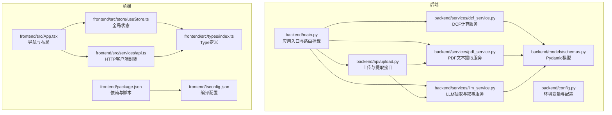
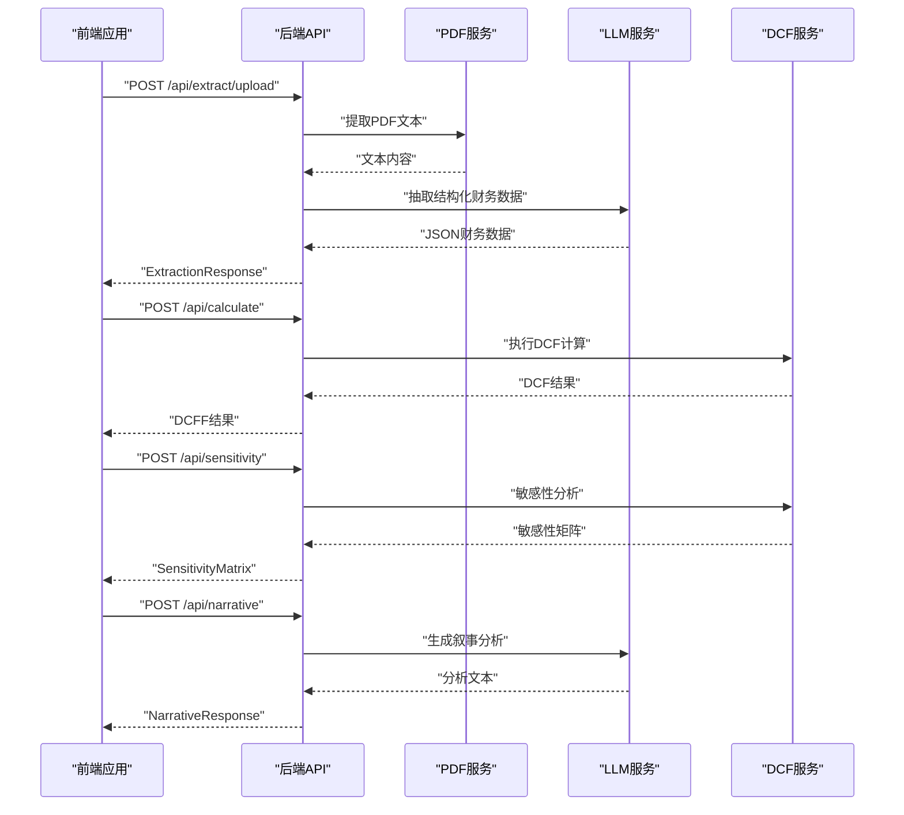
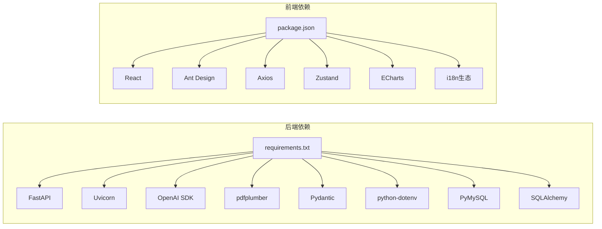

# 代码规范与最佳实践

<cite>
**本文引用的文件**
- [backend/main.py](file://backend/main.py)
- [backend/config.py](file://backend/config.py)
- [backend/requirements.txt](file://backend/requirements.txt)
- [backend/models/schemas.py](file://backend/models/schemas.py)
- [backend/services/dcf_service.py](file://backend/services/dcf_service.py)
- [backend/services/pdf_service.py](file://backend/services/pdf_service.py)
- [backend/services/llm_service.py](file://backend/services/llm_service.py)
- [backend/api/upload.py](file://backend/api/upload.py)
- [frontend/src/App.tsx](file://frontend/src/App.tsx)
- [frontend/package.json](file://frontend/package.json)
- [frontend/tsconfig.json](file://frontend/tsconfig.json)
- [frontend/src/types/index.ts](file://frontend/src/types/index.ts)
- [frontend/src/store/useStore.ts](file://frontend/src/store/useStore.ts)
- [frontend/src/services/api.ts](file://frontend/src/services/api.ts)
</cite>

## 目录
1. [引言](#引言)
2. [项目结构](#项目结构)
3. [核心组件](#核心组件)
4. [架构总览](#架构总览)
5. [详细组件分析](#详细组件分析)
6. [依赖分析](#依赖分析)
7. [性能考虑](#性能考虑)
8. [故障排查指南](#故障排查指南)
9. [结论](#结论)
10. [附录](#附录)

## 引言
本指南面向DCF估值智能体项目的开发团队，旨在建立统一的代码规范与最佳实践，覆盖后端Python与前端TypeScript两部分，同时涵盖Git工作流、代码审查流程、错误处理与日志记录、性能优化等开发最佳实践。目标是提升代码一致性、可维护性与协作效率。

## 项目结构
项目采用前后端分离架构：
- 后端：FastAPI应用，提供上传、提取、计算、敏感性分析与叙事生成功能；通过Pydantic模型进行数据校验与序列化。
- 前端：React + TypeScript应用，使用Ant Design组件库、Zustand状态管理、Axios进行API调用，支持多语言与主题切换。

图表来源
- [backend/main.py:1-40](file://backend/main.py#L1-L40)
- [backend/config.py:1-22](file://backend/config.py#L1-L22)
- [backend/services/dcf_service.py:1-163](file://backend/services/dcf_service.py#L1-L163)
- [backend/services/pdf_service.py:1-68](file://backend/services/pdf_service.py#L1-L68)
- [backend/services/llm_service.py:1-155](file://backend/services/llm_service.py#L1-L155)
- [backend/api/upload.py:1-55](file://backend/api/upload.py#L1-L55)
- [backend/models/schemas.py:1-101](file://backend/models/schemas.py#L1-L101)
- [frontend/src/App.tsx:1-148](file://frontend/src/App.tsx#L1-L148)
- [frontend/src/types/index.ts:1-128](file://frontend/src/types/index.ts#L1-L128)
- [frontend/src/store/useStore.ts:1-74](file://frontend/src/store/useStore.ts#L1-L74)
- [frontend/src/services/api.ts:1-81](file://frontend/src/services/api.ts#L1-L81)
- [frontend/package.json:1-37](file://frontend/package.json#L1-L37)
- [frontend/tsconfig.json:1-26](file://frontend/tsconfig.json#L1-L26)

章节来源
- [backend/main.py:1-40](file://backend/main.py#L1-L40)
- [frontend/src/App.tsx:1-148](file://frontend/src/App.tsx#L1-L148)

## 核心组件
- 后端应用入口与路由：集中注册上传、分析、报告相关路由，启用CORS中间件，健康检查端点。
- 配置模块：加载环境变量，提供API密钥、数据库连接参数与上传目录路径。
- 数据模型：使用Pydantic定义金融数据、DCF参数、投影、结果与敏感性矩阵等结构，确保请求/响应一致性。
- 业务服务：
  - DCF服务：计算WACC、自由现金流预测、终值与企业/股权价值，支持敏感性分析。
  - PDF服务：按关键词相关度选择关键页面，限制最大提取字符数，输出结构化文本。
  - LLM服务：抽取结构化财务数据与生成专业叙事分析。
- 前端应用：路由导航、主题与语言切换、状态管理与API封装。

章节来源
- [backend/main.py:18-40](file://backend/main.py#L18-L40)
- [backend/config.py:10-22](file://backend/config.py#L10-L22)
- [backend/models/schemas.py:8-101](file://backend/models/schemas.py#L8-L101)
- [backend/services/dcf_service.py:12-163](file://backend/services/dcf_service.py#L12-L163)
- [backend/services/pdf_service.py:26-68](file://backend/services/pdf_service.py#L26-L68)
- [backend/services/llm_service.py:70-155](file://backend/services/llm_service.py#L70-L155)
- [frontend/src/App.tsx:105-148](file://frontend/src/App.tsx#L105-L148)

## 架构总览
后端通过FastAPI暴露REST接口，前端通过Axios调用后端API，LLM服务负责抽取与叙事生成，数据库未在当前代码中直接使用，但配置已预留。

图表来源
- [backend/api/upload.py:16-55](file://backend/api/upload.py#L16-L55)
- [backend/services/pdf_service.py:26-68](file://backend/services/pdf_service.py#L26-L68)
- [backend/services/llm_service.py:94-155](file://backend/services/llm_service.py#L94-L155)
- [backend/services/dcf_service.py:85-163](file://backend/services/dcf_service.py#L85-L163)
- [frontend/src/services/api.ts:28-81](file://frontend/src/services/api.ts#L28-L81)

## 详细组件分析

### Python编码规范与最佳实践
- PEP8与风格
  - 导入分组：标准库、第三方库、本地包，每组内部按字母序排列，空行分隔。
  - 行宽：建议不超过100字符，函数签名与长字符串分行时保持缩进一致。
  - 函数与类：使用驼峰命名法；方法与函数名使用下划线命名；常量使用大写。
  - 注释：模块级文档字符串描述用途；函数/方法注释说明输入、输出与异常；复杂逻辑添加简要说明。
  - 空行：模块级函数/类之间空一行；方法之间空一空行；逻辑段落间空一行。
- 类型提示
  - 使用内置泛型与Optional/Union；对公共接口明确标注参数与返回类型。
  - Pydantic模型字段默认值与类型声明清晰，避免隐式None。
- 错误处理
  - 明确捕获特定异常并返回结构化错误响应；记录关键日志以便追踪。
  - 文件操作与外部服务调用需在finally中清理临时资源。
- 日志记录
  - 使用标准库logging模块；记录关键事件与错误上下文，避免泄露敏感信息。
- 性能优化
  - 对大文件处理设置上限与截断；缓存热点数据；避免重复计算（如WACC权重）。
- 依赖管理
  - 使用requirements.txt锁定版本；定期更新安全补丁；避免循环依赖。

章节来源
- [backend/main.py:1-40](file://backend/main.py#L1-L40)
- [backend/config.py:1-22](file://backend/config.py#L1-L22)
- [backend/models/schemas.py:1-101](file://backend/models/schemas.py#L1-L101)
- [backend/services/dcf_service.py:1-163](file://backend/services/dcf_service.py#L1-L163)
- [backend/services/pdf_service.py:1-68](file://backend/services/pdf_service.py#L1-L68)
- [backend/services/llm_service.py:1-155](file://backend/services/llm_service.py#L1-L155)
- [backend/requirements.txt:1-11](file://backend/requirements.txt#L1-L11)

### TypeScript开发规范与最佳实践
- 类型定义
  - 使用interface与type定义数据结构，尽量使用只读与严格模式；可选属性显式标注。
  - 与后端模型保持字段一致性，避免隐式any。
- 组件命名与文件组织
  - 组件文件使用帕斯卡命名；页面组件置于pages目录；通用组件置于components目录；类型定义置于types目录。
  - 路由与菜单项保持一致的命名与路径映射。
- 状态管理
  - 使用Zustand创建轻量状态；动作函数职责单一；避免在状态中存储可派生数据。
- 文件组织
  - 使用路径别名简化导入；tsconfig配置baseUrl与paths；严格模式开启未使用变量检测。
- API封装
  - Axios实例统一配置baseURL、超时与头部；错误处理集中到单点；区分业务错误与网络错误。
- 国际化与主题
  - 使用i18next与语言检测器；主题切换通过CSS变量与Ant Design主题算法组合实现。

章节来源
- [frontend/src/types/index.ts:1-128](file://frontend/src/types/index.ts#L1-L128)
- [frontend/src/App.tsx:1-148](file://frontend/src/App.tsx#L1-L148)
- [frontend/src/store/useStore.ts:1-74](file://frontend/src/store/useStore.ts#L1-L74)
- [frontend/src/services/api.ts:1-81](file://frontend/src/services/api.ts#L1-L81)
- [frontend/tsconfig.json:1-26](file://frontend/tsconfig.json#L1-L26)
- [frontend/package.json:1-37](file://frontend/package.json#L1-L37)

### Git工作流程规范
- 分支管理
  - 主分支：main（受保护），仅允许通过PR合并。
  - 开发分支：develop（每日构建），日常功能开发在此分支进行。
  - 功能分支：feature/<issue-id>-短描述，完成后合并回develop。
  - 修复分支：fix/<issue-id>-短描述，从main切出，修复后同时合并回main与develop。
  - 发布分支：release/<版本号>，用于预发布测试与小修。
- 提交信息格式
  - 类型: 摘要（不超过50字符）
  - 正文: 背景、变更点、影响范围（可选）
  - 底部: 关联Issue或PR（可选）
  - 示例：feat(api): 添加PDF提取接口与LLM抽取流程
- 合并策略
  - PR必须通过CI与代码审查；优先使用squash合并以保持提交历史整洁；禁止fast-forward。
- 标签与版本
  - 使用语义化版本打标签；每次发布同步更新CHANGELOG。

[本节为通用流程规范，不直接分析具体文件，故无“章节来源”]

### 代码审查标准与流程
- 审查清单
  - 代码是否符合PEP8与TS规范；类型定义是否完整且严格；错误处理是否完善；日志是否充分。
  - 前端是否使用统一的Axios封装；状态管理是否清晰；组件职责是否单一。
  - 是否存在硬编码字符串与敏感信息；是否遵循CORS与安全最佳实践。
- 质量门禁
  - 必须通过静态检查与单元测试；关键路径需有注释说明；对外接口需有文档片段。
- PR模板
  - 概述、变更内容、影响范围、测试要点、风险与回滚预案。

[本节为通用流程规范，不直接分析具体文件，故无“章节来源”]

### 错误处理规范与日志记录标准
- 后端
  - 使用HTTPException返回明确错误码与消息；对文件上传与PDF解析失败返回结构化错误；在finally中清理临时文件。
  - 使用logging记录关键事件与异常上下文，避免记录敏感信息。
- 前端
  - Axios拦截器统一处理错误，区分网络错误与业务错误；UI层显示友好提示并记录错误摘要。
- 典型场景
  - PDF为空或无法解析：返回ExtractionResponse.success=false与错误信息。
  - LLM返回无效JSON：记录原始响应尾部并抛出明确异常。
  - 计算WACC或终值不合理：进行边界检查并返回安全默认值。

章节来源
- [backend/api/upload.py:16-55](file://backend/api/upload.py#L16-L55)
- [backend/services/pdf_service.py:26-68](file://backend/services/pdf_service.py#L26-L68)
- [backend/services/llm_service.py:94-155](file://backend/services/llm_service.py#L94-L155)
- [frontend/src/services/api.ts:17-26](file://frontend/src/services/api.ts#L17-L26)

### 性能优化原则
- 后端
  - PDF文本提取限制最大字符数与页面数量；对WACC与终值计算进行边界约束；避免重复I/O与计算。
- 前端
  - 按需加载国际化模块；组件懒加载与虚拟滚动（如表格较大时）；减少不必要的重渲染。
- 通用
  - 缓存热点数据；异步处理耗时任务；合理设置超时与重试策略。

[本节提供通用指导，不直接分析具体文件，故无“章节来源”]

## 依赖分析
- 后端依赖
  - FastAPI与Uvicorn：Web框架与ASGI服务器。
  - OpenAI SDK：调用LLM服务。
  - pdfplumber：PDF文本提取。
  - Pydantic：数据模型与校验。
  - python-dotenv：环境变量加载。
  - PyMySQL与SQLAlchemy：数据库访问（当前未在核心逻辑中直接使用）。
- 前端依赖
  - React与Ant Design：UI组件与主题系统。
  - Axios：HTTP客户端。
  - Zustand：轻量状态管理。
  - ECharts：可视化图表。
  - i18n生态：国际化与语言检测。

图表来源
- [backend/requirements.txt:1-11](file://backend/requirements.txt#L1-L11)
- [frontend/package.json:11-35](file://frontend/package.json#L11-L35)

章节来源
- [backend/requirements.txt:1-11](file://backend/requirements.txt#L1-L11)
- [frontend/package.json:1-37](file://frontend/package.json#L1-L37)

## 性能考虑
- 大文件与长文本
  - 后端对PDF提取设置最大字符上限，避免内存溢出；前端对上传文件大小与超时进行控制。
- 计算密集型
  - DCF计算采用向量化思维（列表推导与聚合），注意年份数量增长带来的复杂度；必要时引入缓存或分页。
- 网络与外部服务
  - 设置合理的超时与重试；对LLM调用进行限流与熔断；对响应进行最小化处理。
- 前端渲染
  - 大表格与图表使用虚拟化或懒加载；主题切换与国际化按需加载模块。

[本节提供通用指导，不直接分析具体文件，故无“章节来源”]

## 故障排查指南
- 健康检查
  - 访问后端健康端点确认服务可用。
- 上传与提取
  - 确认上传目录存在且可写；检查PDF是否包含可识别文本；查看日志中的字符数统计。
- LLM抽取
  - 检查API密钥与基础URL配置；关注JSON解析错误日志；尝试缩短输入文本长度。
- DCF计算
  - 核对输入参数边界（如WACC不得小于等于终值增长率）；检查投影年数与比率设定。
- 前端调用
  - 检查Axios baseURL与跨域设置；确认路由与组件渲染；查看浏览器控制台错误。

章节来源
- [backend/main.py:37-40](file://backend/main.py#L37-L40)
- [backend/config.py:10-22](file://backend/config.py#L10-L22)
- [backend/api/upload.py:16-55](file://backend/api/upload.py#L16-L55)
- [backend/services/pdf_service.py:26-68](file://backend/services/pdf_service.py#L26-L68)
- [backend/services/llm_service.py:94-155](file://backend/services/llm_service.py#L94-L155)
- [frontend/src/services/api.ts:11-26](file://frontend/src/services/api.ts#L11-L26)

## 结论
本指南总结了DCF估值智能体项目的Python与TypeScript编码规范、前后端交互流程、错误处理与日志记录、性能优化与Git工作流。建议团队在日常开发中严格执行上述规范，并结合代码审查与持续集成确保质量与一致性。

[本节为总结性内容，不直接分析具体文件，故无“章节来源”]

## 附录
- 关键流程图与类图已在相应章节中给出，便于理解组件关系与调用链路。
- 建议在后续迭代中补充单元测试与端到端测试，完善自动化质量门禁。

[本节为补充说明，不直接分析具体文件，故无“章节来源”]