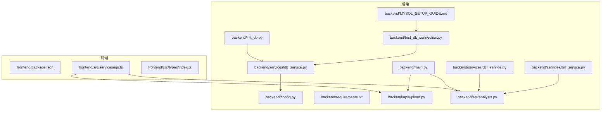
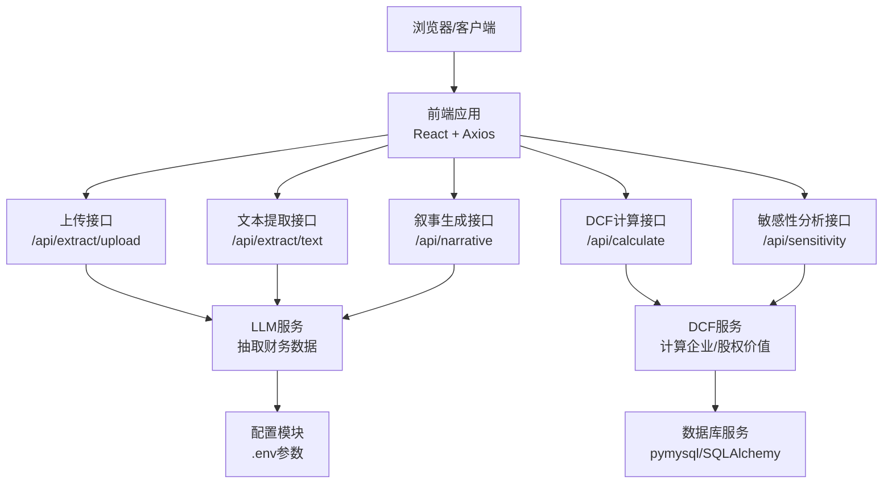
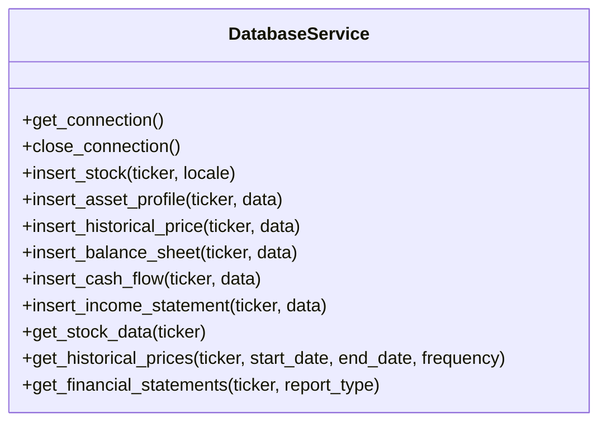
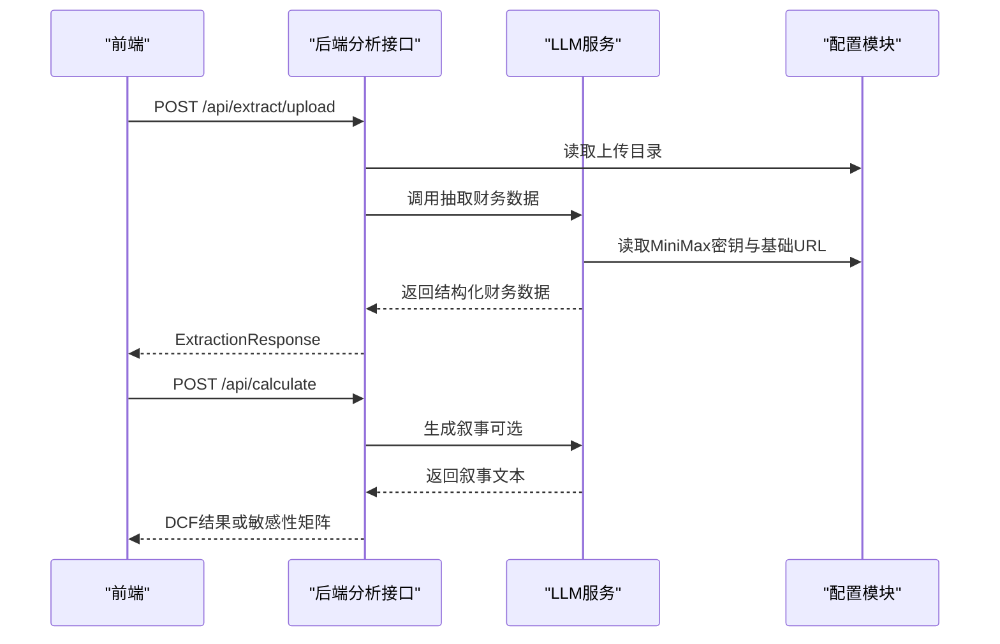
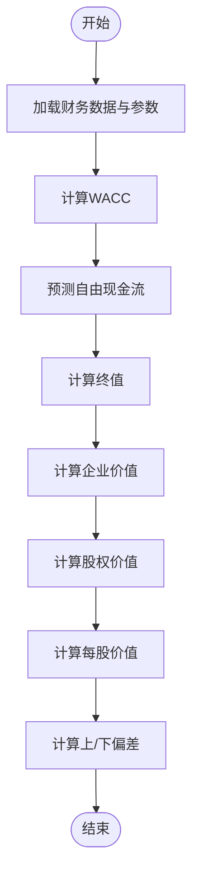
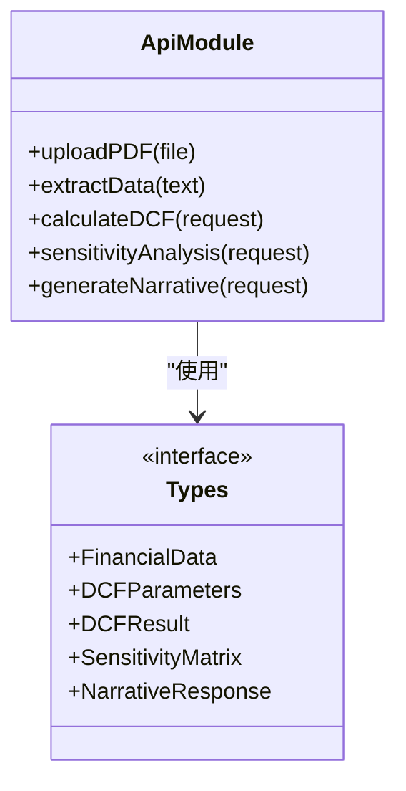
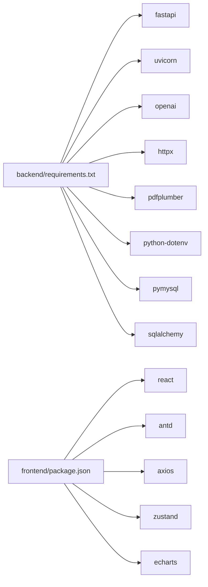

# 常见问题排查

<cite>
**本文引用的文件**
- [backend/main.py](file://backend/main.py)
- [backend/config.py](file://backend/config.py)
- [backend/requirements.txt](file://backend/requirements.txt)
- [backend/services/db_service.py](file://backend/services/db_service.py)
- [backend/test_db_connection.py](file://backend/test_db_connection.py)
- [backend/init_db.py](file://backend/init_db.py)
- [backend/MYSQL_SETUP_GUIDE.md](file://backend/MYSQL_SETUP_GUIDE.md)
- [backend/api/upload.py](file://backend/api/upload.py)
- [backend/api/analysis.py](file://backend/api/analysis.py)
- [backend/services/dcf_service.py](file://backend/services/dcf_service.py)
- [backend/services/llm_service.py](file://backend/services/llm_service.py)
- [backend/models/schemas.py](file://backend/models/schemas.py)
- [frontend/package.json](file://frontend/package.json)
- [frontend/src/services/api.ts](file://frontend/src/services/api.ts)
- [frontend/src/types/index.ts](file://frontend/src/types/index.ts)
</cite>

## 目录
1. [简介](#简介)
2. [项目结构](#项目结构)
3. [核心组件](#核心组件)
4. [架构总览](#架构总览)
5. [详细组件分析](#详细组件分析)
6. [依赖关系分析](#依赖关系分析)
7. [性能考虑](#性能考虑)
8. [故障排查指南](#故障排查指南)
9. [结论](#结论)
10. [附录](#附录)

## 简介
本指南面向DCF估值智能体项目的开发者与运维人员，聚焦于开发环境、运行时错误、性能问题与配置问题的系统性排查方法。内容覆盖依赖安装失败、端口占用、权限问题、API调用失败、数据库连接异常、前端组件渲染错误、内存/CPU/响应时间异常、环境变量与API密钥配置错误等常见问题，并提供日志分析、错误信息解读与调试技巧。

## 项目结构
项目采用前后端分离架构：后端使用FastAPI提供REST接口，前端使用React + TypeScript + Vite构建。后端通过服务层封装数据库、LLM与DCF计算逻辑；前端通过Axios调用后端接口并管理状态。

**图表来源**
- [backend/main.py:18-34](file://backend/main.py#L18-L34)
- [backend/api/upload.py:13-43](file://backend/api/upload.py#L13-L43)
- [backend/api/analysis.py:15-44](file://backend/api/analysis.py#L15-L44)
- [backend/services/db_service.py:24-46](file://backend/services/db_service.py#L24-L46)
- [backend/services/dcf_service.py:85-120](file://backend/services/dcf_service.py#L85-L120)
- [backend/services/llm_service.py:70-76](file://backend/services/llm_service.py#L70-L76)
- [backend/config.py:10-21](file://backend/config.py#L10-L21)
- [backend/init_db.py:22-65](file://backend/init_db.py#L22-L65)
- [backend/test_db_connection.py:22-71](file://backend/test_db_connection.py#L22-L71)
- [backend/MYSQL_SETUP_GUIDE.md:13-82](file://backend/MYSQL_SETUP_GUIDE.md#L13-L82)
- [frontend/src/services/api.ts:11-15](file://frontend/src/services/api.ts#L11-L15)
- [frontend/package.json:1-37](file://frontend/package.json#L1-L37)

**章节来源**
- [backend/main.py:18-34](file://backend/main.py#L18-L34)
- [frontend/package.json:1-37](file://frontend/package.json#L1-L37)

## 核心组件
- 后端入口与路由：FastAPI应用注册跨域中间件与API路由，提供健康检查接口。
- 配置模块：加载环境变量，定义MySQL与LLM相关参数。
- 数据库服务：封装pymysql连接、事务与多张财务表的增删改查。
- LLM服务：封装MiniMax（OpenAI兼容）调用，负责财务数据抽取与叙事生成。
- DCF服务：实现WACC计算、自由现金流预测、终值与企业/股权价值计算。
- 前端API封装：Axios封装请求、超时与错误处理，统一返回类型定义。

**章节来源**
- [backend/main.py:18-40](file://backend/main.py#L18-L40)
- [backend/config.py:10-21](file://backend/config.py#L10-L21)
- [backend/services/db_service.py:24-345](file://backend/services/db_service.py#L24-L345)
- [backend/services/llm_service.py:70-155](file://backend/services/llm_service.py#L70-L155)
- [backend/services/dcf_service.py:85-163](file://backend/services/dcf_service.py#L85-L163)
- [frontend/src/services/api.ts:11-81](file://frontend/src/services/api.ts#L11-L81)

## 架构总览
后端通过API路由暴露上传、提取、计算、敏感性分析与叙事生成功能；前端通过Axios调用后端接口并展示结果。数据库初始化脚本与连接测试脚本辅助快速定位MySQL问题。

**图表来源**
- [backend/api/upload.py:16-54](file://backend/api/upload.py#L16-L54)
- [backend/api/analysis.py:18-44](file://backend/api/analysis.py#L18-L44)
- [backend/services/llm_service.py:70-76](file://backend/services/llm_service.py#L70-L76)
- [backend/services/dcf_service.py:85-120](file://backend/services/dcf_service.py#L85-L120)
- [backend/services/db_service.py:24-46](file://backend/services/db_service.py#L24-L46)
- [backend/config.py:10-21](file://backend/config.py#L10-L21)

## 详细组件分析

### 组件A：数据库服务与初始化
- 连接管理：按需建立连接，异常时打印错误并抛出；提供关闭连接方法。
- 表结构：包含股票、资产画像、历史价格、资产负债表、现金流量表、利润表等。
- 初始化：自动创建数据库与表；连接测试脚本可验证连通性与权限。
- 常见问题：连接失败、权限不足、字符集不匹配、端口占用。

**图表来源**
- [backend/services/db_service.py:24-345](file://backend/services/db_service.py#L24-L345)

**章节来源**
- [backend/services/db_service.py:24-345](file://backend/services/db_service.py#L24-L345)
- [backend/init_db.py:68-161](file://backend/init_db.py#L68-L161)
- [backend/test_db_connection.py:22-143](file://backend/test_db_connection.py#L22-L143)

### 组件B：LLM服务与API调用序列
- LLM服务：封装MiniMax（OpenAI兼容）客户端，负责抽取与叙事生成。
- 错误处理：对JSON解析失败、网络异常进行日志记录与异常抛出。
- 前端调用：Axios统一拦截器处理超时与错误消息。

**图表来源**
- [backend/api/upload.py:16-54](file://backend/api/upload.py#L16-L54)
- [backend/api/analysis.py:18-44](file://backend/api/analysis.py#L18-L44)
- [backend/services/llm_service.py:70-155](file://backend/services/llm_service.py#L70-L155)
- [backend/config.py:10-21](file://backend/config.py#L10-L21)
- [frontend/src/services/api.ts:28-80](file://frontend/src/services/api.ts#L28-L80)

**章节来源**
- [backend/services/llm_service.py:70-155](file://backend/services/llm_service.py#L70-L155)
- [frontend/src/services/api.ts:11-81](file://frontend/src/services/api.ts#L11-L81)

### 组件C：DCF计算流程
- 输入：FinancialData与DCFParameters。
- 计算：WACC、FCF预测、终值、企业价值、股权价值、每股价值与上/下偏差。
- 输出：DCFResult与敏感性矩阵。

**图表来源**
- [backend/services/dcf_service.py:85-120](file://backend/services/dcf_service.py#L85-L120)
- [backend/models/schemas.py:58-70](file://backend/models/schemas.py#L58-L70)

**章节来源**
- [backend/services/dcf_service.py:85-163](file://backend/services/dcf_service.py#L85-L163)
- [backend/models/schemas.py:8-101](file://backend/models/schemas.py#L8-L101)

### 组件D：前端API封装与类型定义
- Axios封装：统一baseURL、超时、错误处理。
- 类型定义：与后端Pydantic模型对应，保证前后端数据契约一致。

**图表来源**
- [frontend/src/services/api.ts:28-80](file://frontend/src/services/api.ts#L28-L80)
- [frontend/src/types/index.ts:4-127](file://frontend/src/types/index.ts#L4-L127)

**章节来源**
- [frontend/src/services/api.ts:11-81](file://frontend/src/services/api.ts#L11-L81)
- [frontend/src/types/index.ts:4-127](file://frontend/src/types/index.ts#L4-L127)

## 依赖关系分析
- 后端依赖：FastAPI、Uvicorn、OpenAI SDK、HTTPX、pdfplumber、pymysql、SQLAlchemy、python-dotenv。
- 前端依赖：React、Ant Design、Axios、Zustand、ECharts、i18n等。

**图表来源**
- [backend/requirements.txt:1-11](file://backend/requirements.txt#L1-L11)
- [frontend/package.json:11-35](file://frontend/package.json#L11-L35)

**章节来源**
- [backend/requirements.txt:1-11](file://backend/requirements.txt#L1-L11)
- [frontend/package.json:11-35](file://frontend/package.json#L11-L35)

## 性能考虑
- 数据库连接池与复用：避免频繁创建/销毁连接，减少握手开销。
- LLM调用：限制输入长度、降低temperature与max_tokens，避免大文本重复传输。
- 前端渲染：分页/虚拟列表展示敏感性矩阵与投影明细，避免一次性渲染大量节点。
- 超时与重试：前端Axios设置合理timeout，后端接口对慢查询增加超时保护。
- 日志级别：生产环境降低LLM服务日志级别，避免高频IO影响性能。

[本节为通用指导，无需列出具体文件来源]

## 故障排查指南

### 开发环境问题
- 依赖安装失败
  - 症状：pip安装报错、版本冲突。
  - 排查：核对Python版本与依赖范围；优先使用虚拟环境隔离；升级pip与setuptools；必要时清理缓存重装。
  - 参考文件：[backend/requirements.txt:1-11](file://backend/requirements.txt#L1-L11)、[frontend/package.json:1-37](file://frontend/package.json#L1-L37)

- 端口占用
  - 症状：启动后端或MySQL报端口冲突。
  - 排查：检查3306（MySQL）与后端默认端口；更换端口或释放占用进程。
  - 参考文件：[backend/MYSQL_SETUP_GUIDE.md:175-181](file://backend/MYSQL_SETUP_GUIDE.md#L175-L181)

- 权限问题
  - 症状：数据库连接拒绝、无法创建/写入。
  - 排查：授予数据库用户相应权限；确认字符集为utf8mb4；使用连接测试脚本验证。
  - 参考文件：[backend/MYSQL_SETUP_GUIDE.md:187-192](file://backend/MYSQL_SETUP_GUIDE.md#L187-L192)、[backend/test_db_connection.py:62-71](file://backend/test_db_connection.py#L62-L71)

**章节来源**
- [backend/requirements.txt:1-11](file://backend/requirements.txt#L1-L11)
- [frontend/package.json:11-35](file://frontend/package.json#L11-L35)
- [backend/MYSQL_SETUP_GUIDE.md:175-192](file://backend/MYSQL_SETUP_GUIDE.md#L175-L192)
- [backend/test_db_connection.py:62-71](file://backend/test_db_connection.py#L62-L71)

### 运行时错误排查

- API调用失败
  - 症状：前端报“Network error”或后端HTTP 500。
  - 排查：检查CORS配置、路由前缀、请求头与超时；查看后端日志；确认LLM密钥与基础URL正确。
  - 参考文件：[backend/main.py:24-30](file://backend/main.py#L24-L30)、[frontend/src/services/api.ts:17-26](file://frontend/src/services/api.ts#L17-L26)、[backend/services/llm_service.py:70-76](file://backend/services/llm_service.py#L70-L76)

- 数据库连接异常
  - 症状：连接失败、权限不足、字符集不匹配。
  - 排查：使用连接测试脚本逐项验证；初始化数据库；确认.env中主机、端口、用户、密码、数据库名。
  - 参考文件：[backend/test_db_connection.py:22-71](file://backend/test_db_connection.py#L22-L71)、[backend/init_db.py:22-65](file://backend/init_db.py#L22-L65)、[backend/config.py:14-21](file://backend/config.py#L14-L21)

- 前端组件渲染错误
  - 症状：页面空白、图表不显示、类型断言失败。
  - 排查：核对类型定义一致性；检查状态初始化与异步数据加载；确认Axios响应结构与前端类型匹配。
  - 参考文件：[frontend/src/types/index.ts:4-127](file://frontend/src/types/index.ts#L4-L127)、[frontend/src/services/api.ts:28-80](file://frontend/src/services/api.ts#L28-L80)

**章节来源**
- [backend/main.py:24-30](file://backend/main.py#L24-L30)
- [frontend/src/services/api.ts:17-26](file://frontend/src/services/api.ts#L17-L26)
- [backend/services/llm_service.py:70-76](file://backend/services/llm_service.py#L70-L76)
- [backend/test_db_connection.py:22-71](file://backend/test_db_connection.py#L22-L71)
- [backend/init_db.py:22-65](file://backend/init_db.py#L22-L65)
- [backend/config.py:14-21](file://backend/config.py#L14-L21)
- [frontend/src/types/index.ts:4-127](file://frontend/src/types/index.ts#L4-L127)

### 性能问题诊断
- 内存泄漏检测
  - 方法：使用内存分析工具监控后端进程；检查数据库连接是否正确关闭；避免在循环中累积对象。
  - 参考文件：[backend/services/db_service.py:48-52](file://backend/services/db_service.py#L48-L52)

- CPU使用率过高
  - 方法：定位大文本处理与LLM调用；限制输入长度；启用分页与缓存；评估并发与线程池大小。
  - 参考文件：[backend/services/llm_service.py:94-122](file://backend/services/llm_service.py#L94-L122)、[backend/services/dcf_service.py:37-76](file://backend/services/dcf_service.py#L37-L76)

- 响应时间过长
  - 方法：前端设置合理超时；后端接口增加超时保护；数据库添加索引与查询优化；CDN或静态资源优化。
  - 参考文件：[frontend/src/services/api.ts:12-14](file://frontend/src/services/api.ts#L12-L14)、[backend/services/db_service.py:275-299](file://backend/services/db_service.py#L275-L299)

**章节来源**
- [backend/services/db_service.py:48-52](file://backend/services/db_service.py#L48-L52)
- [backend/services/llm_service.py:94-122](file://backend/services/llm_service.py#L94-L122)
- [backend/services/dcf_service.py:37-76](file://backend/services/dcf_service.py#L37-L76)
- [frontend/src/services/api.ts:12-14](file://frontend/src/services/api.ts#L12-L14)

### 配置问题排查
- 环境变量设置错误
  - 症状：空密钥、错误主机或端口。
  - 排查：核对.env文件；确认加载顺序；在代码中打印关键配置值进行验证。
  - 参考文件：[backend/config.py:6-21](file://backend/config.py#L6-L21)

- API密钥配置问题
  - 症状：LLM调用失败、返回鉴权错误。
  - 排查：检查MiniMax密钥与基础URL；确认网络可达；查看日志中的错误堆栈。
  - 参考文件：[backend/services/llm_service.py:70-76](file://backend/services/llm_service.py#L70-L76)

- 数据库连接字符串错误
  - 症状：连接超时、认证失败、字符集错误。
  - 排查：使用连接测试脚本；初始化数据库；核对字符集与外键约束。
  - 参考文件：[backend/test_db_connection.py:22-71](file://backend/test_db_connection.py#L22-L71)、[backend/init_db.py:68-161](file://backend/init_db.py#L68-L161)

**章节来源**
- [backend/config.py:6-21](file://backend/config.py#L6-L21)
- [backend/services/llm_service.py:70-76](file://backend/services/llm_service.py#L70-L76)
- [backend/test_db_connection.py:22-71](file://backend/test_db_connection.py#L22-L71)
- [backend/init_db.py:68-161](file://backend/init_db.py#L68-L161)

### 日志分析与调试技巧
- 后端日志
  - 关注数据库连接与事务回滚日志；LLM JSON解析失败与异常堆栈；WACC与FCF计算边界条件。
  - 参考文件：[backend/services/db_service.py:43-45](file://backend/services/db_service.py#L43-L45)、[backend/services/llm_service.py:117-122](file://backend/services/llm_service.py#L117-L122)

- 前端日志
  - 使用Axios拦截器统一捕获错误消息；在组件中打印关键状态变化；利用浏览器开发者工具Network面板观察请求/响应。
  - 参考文件：[frontend/src/services/api.ts:17-26](file://frontend/src/services/api.ts#L17-L26)

- 调试技巧
  - 分层验证：先验证数据库连通性，再验证LLM可用性，最后验证业务流程。
  - 最小化复现：构造最小输入样本，逐步扩大范围定位问题。
  - 端到端测试：结合连接测试脚本与初始化脚本，确保环境就绪后再进行功能测试。

**章节来源**
- [backend/services/db_service.py:43-45](file://backend/services/db_service.py#L43-L45)
- [backend/services/llm_service.py:117-122](file://backend/services/llm_service.py#L117-L122)
- [frontend/src/services/api.ts:17-26](file://frontend/src/services/api.ts#L17-L26)

## 结论
本指南提供了从开发环境到运行时、从配置到性能的全链路排查路径。建议在团队内形成标准化的“最小化复现场景”与“分层验证清单”，配合日志与超时策略，快速定位并修复问题，保障DCF估值智能体的稳定性与可靠性。

## 附录
- 快速检查清单
  - 环境变量已正确加载且非空
  - MySQL服务运行且端口未被占用
  - 数据库存在且具备写权限
  - LLM密钥与基础URL可访问
  - 前端Axios超时与错误处理正常
  - 后端路由前缀与CORS配置正确

[本节为通用指导，无需列出具体文件来源]