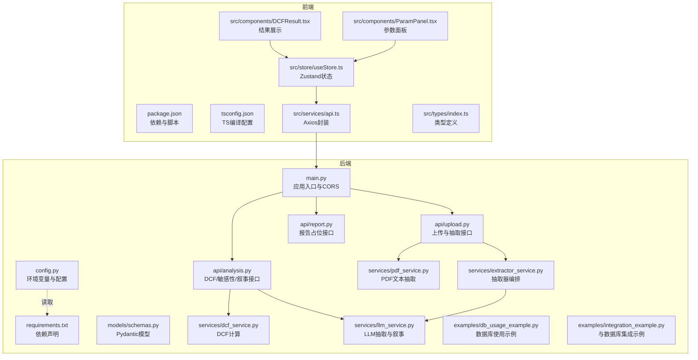
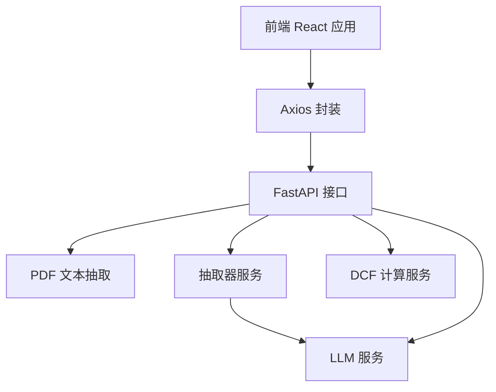
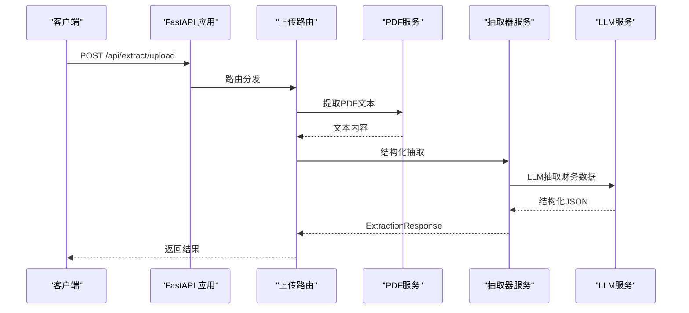
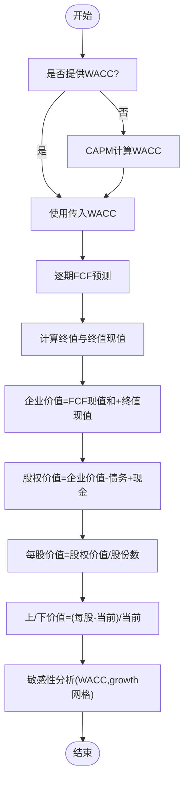
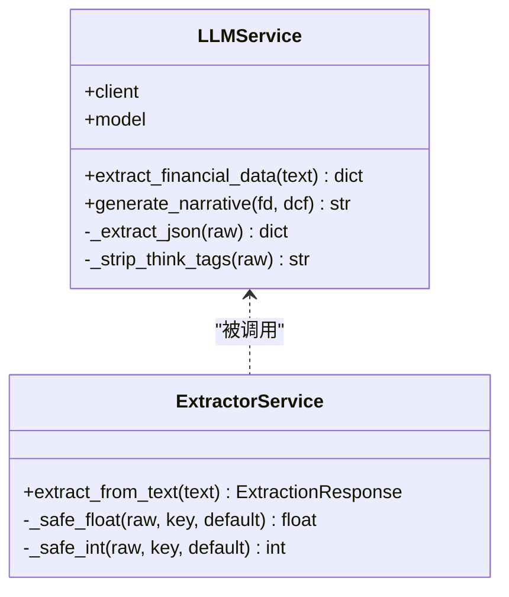
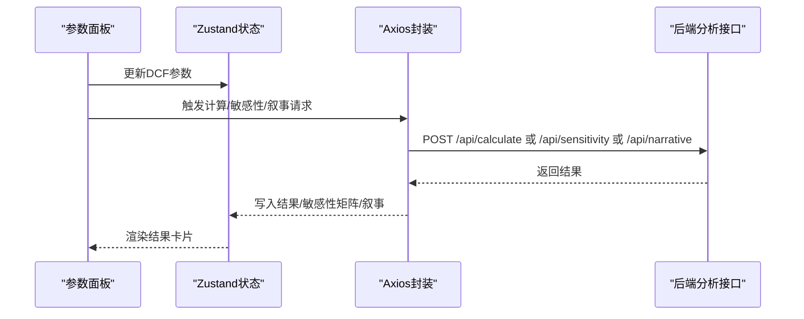
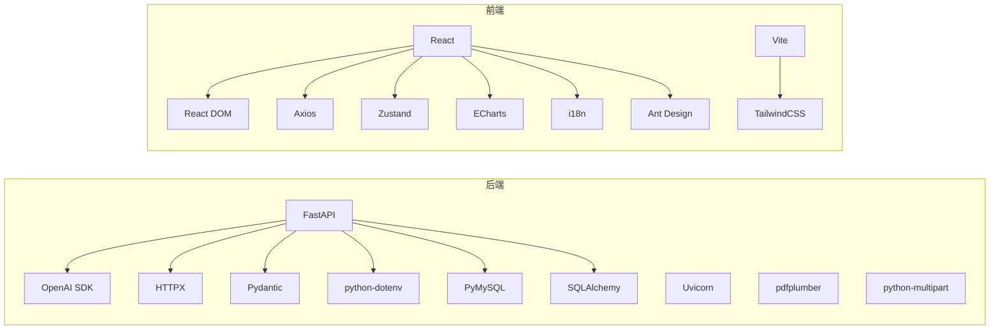

# 开发指南

<cite>
**本文引用的文件**
- [backend/main.py](file://backend/main.py)
- [backend/config.py](file://backend/config.py)
- [backend/requirements.txt](file://backend/requirements.txt)
- [backend/api/upload.py](file://backend/api/upload.py)
- [backend/api/analysis.py](file://backend/api/analysis.py)
- [backend/api/report.py](file://backend/api/report.py)
- [backend/models/schemas.py](file://backend/models/schemas.py)
- [backend/services/dcf_service.py](file://backend/services/dcf_service.py)
- [backend/services/llm_service.py](file://backend/services/llm_service.py)
- [backend/services/pdf_service.py](file://backend/services/pdf_service.py)
- [backend/services/extractor_service.py](file://backend/services/extractor_service.py)
- [backend/examples/db_usage_example.py](file://backend/examples/db_usage_example.py)
- [backend/examples/integration_example.py](file://backend/examples/integration_example.py)
- [frontend/package.json](file://frontend/package.json)
- [frontend/tsconfig.json](file://frontend/tsconfig.json)
- [frontend/src/services/api.ts](file://frontend/src/services/api.ts)
- [frontend/src/store/useStore.ts](file://frontend/src/store/useStore.ts)
- [frontend/src/types/index.ts](file://frontend/src/types/index.ts)
- [frontend/src/components/ParamPanel.tsx](file://frontend/src/components/ParamPanel.tsx)
- [frontend/src/components/DCFResult.tsx](file://frontend/src/components/DCFResult.tsx)
</cite>

## 目录
1. [简介](#简介)
2. [项目结构](#项目结构)
3. [核心组件](#核心组件)
4. [架构总览](#架构总览)
5. [详细组件分析](#详细组件分析)
6. [依赖分析](#依赖分析)
7. [性能考虑](#性能考虑)
8. [调试与工具](#调试与工具)
9. [测试策略](#测试策略)
10. [扩展开发指南](#扩展开发指南)
11. [常见问题排查](#常见问题排查)
12. [贡献指南](#贡献指南)
13. [结论](#结论)

## 简介
本指南面向DCF估值智能体项目的开发者，提供从代码规范、开发工具、调试技巧、测试策略到扩展与贡献的全流程指导。项目采用前后端分离架构：后端基于FastAPI提供REST API，前端基于React + TypeScript构建交互界面；核心业务逻辑包括PDF文本抽取、财务数据结构化、DCF估值计算、敏感性分析与叙事生成。

## 项目结构
- 后端（Python/FastAPI）：API路由、模型定义、服务层（LLM、PDF解析、DCF计算、抽取器）、数据库示例脚本
- 前端（React + TypeScript）：Axios封装的API调用、Zustand状态管理、类型定义、可视化组件
- 配置与环境：后端dotenv加载MySQL与大模型配置；前端Vite + TailwindCSS + Ant Design

图表来源
- [backend/main.py:18-35](file://backend/main.py#L18-L35)
- [backend/api/upload.py:13-44](file://backend/api/upload.py#L13-L44)
- [backend/api/analysis.py:15-44](file://backend/api/analysis.py#L15-L44)
- [backend/api/report.py:5-12](file://backend/api/report.py#L5-L12)
- [backend/models/schemas.py:8-101](file://backend/models/schemas.py#L8-L101)
- [backend/services/dcf_service.py:12-163](file://backend/services/dcf_service.py#L12-L163)
- [backend/services/llm_service.py:70-155](file://backend/services/llm_service.py#L70-L155)
- [backend/services/pdf_service.py:26-68](file://backend/services/pdf_service.py#L26-L68)
- [backend/services/extractor_service.py:27-67](file://backend/services/extractor_service.py#L27-L67)
- [backend/examples/db_usage_example.py:15-170](file://backend/examples/db_usage_example.py#L15-L170)
- [backend/examples/integration_example.py:16-346](file://backend/examples/integration_example.py#L16-L346)
- [frontend/package.json:1-37](file://frontend/package.json#L1-L37)
- [frontend/tsconfig.json:1-26](file://frontend/tsconfig.json#L1-L26)
- [frontend/src/services/api.ts:1-81](file://frontend/src/services/api.ts#L1-L81)
- [frontend/src/store/useStore.ts:23-74](file://frontend/src/store/useStore.ts#L23-L74)
- [frontend/src/types/index.ts:1-128](file://frontend/src/types/index.ts#L1-L128)
- [frontend/src/components/ParamPanel.tsx:88-210](file://frontend/src/components/ParamPanel.tsx#L88-L210)
- [frontend/src/components/DCFResult.tsx:30-137](file://frontend/src/components/DCFResult.tsx#L30-L137)

章节来源
- [backend/main.py:18-40](file://backend/main.py#L18-L40)
- [backend/config.py:1-22](file://backend/config.py#L1-L22)
- [backend/requirements.txt:1-11](file://backend/requirements.txt#L1-L11)
- [frontend/package.json:1-37](file://frontend/package.json#L1-L37)
- [frontend/tsconfig.json:1-26](file://frontend/tsconfig.json#L1-L26)

## 核心组件
- 应用入口与中间件：FastAPI应用初始化、生命周期钩子、CORS跨域、路由挂载
- 配置系统：dotenv加载、MySQL与大模型服务地址/密钥
- 数据模型：Pydantic模型定义财务数据、DCF参数、投影、结果与敏感性矩阵
- 服务层：
  - LLM服务：抽取财务数据、生成叙事
  - PDF服务：按关键词筛选高相关页面并拼接文本
  - 抽取器服务：编排LLM抽取与字段清洗
  - DCF服务：WACC计算、FCF预测、终值与现值、企业/股权价值与每股价值、上/下价值评估、敏感性矩阵
- 前端：
  - API封装：Axios实例、错误处理、超时设置
  - 状态管理：Zustand存储财务数据、参数、结果、敏感性矩阵、叙事、主题与语言
  - 类型系统：统一前后端数据契约
  - 组件：参数面板（滑条/输入联动、WACC预估）、DCF结果卡片（格式化数值、涨跌标签）

章节来源
- [backend/main.py:12-40](file://backend/main.py#L12-L40)
- [backend/config.py:10-22](file://backend/config.py#L10-L22)
- [backend/models/schemas.py:8-101](file://backend/models/schemas.py#L8-L101)
- [backend/services/llm_service.py:70-155](file://backend/services/llm_service.py#L70-L155)
- [backend/services/pdf_service.py:26-68](file://backend/services/pdf_service.py#L26-L68)
- [backend/services/extractor_service.py:27-67](file://backend/services/extractor_service.py#L27-L67)
- [backend/services/dcf_service.py:12-163](file://backend/services/dcf_service.py#L12-L163)
- [frontend/src/services/api.ts:11-81](file://frontend/src/services/api.ts#L11-L81)
- [frontend/src/store/useStore.ts:23-74](file://frontend/src/store/useStore.ts#L23-L74)
- [frontend/src/types/index.ts:4-128](file://frontend/src/types/index.ts#L4-L128)
- [frontend/src/components/ParamPanel.tsx:88-210](file://frontend/src/components/ParamPanel.tsx#L88-L210)
- [frontend/src/components/DCFResult.tsx:30-137](file://frontend/src/components/DCFResult.tsx#L30-L137)

## 架构总览
后端通过FastAPI提供统一API，前端通过Axios调用后端接口，LLM服务负责抽取与叙事，PDF服务负责文本提取，DCF服务完成估值计算与敏感性分析。

图表来源
- [backend/main.py:32-34](file://backend/main.py#L32-L34)
- [backend/api/upload.py:16-44](file://backend/api/upload.py#L16-L44)
- [backend/api/analysis.py:18-44](file://backend/api/analysis.py#L18-L44)
- [backend/services/pdf_service.py:26-68](file://backend/services/pdf_service.py#L26-L68)
- [backend/services/extractor_service.py:27-67](file://backend/services/extractor_service.py#L27-L67)
- [backend/services/llm_service.py:70-155](file://backend/services/llm_service.py#L70-L155)
- [backend/services/dcf_service.py:85-121](file://backend/services/dcf_service.py#L85-L121)
- [frontend/src/services/api.ts:11-81](file://frontend/src/services/api.ts#L11-L81)

## 详细组件分析

### 后端应用与路由
- 应用生命周期：启动时确保上传目录存在
- CORS：允许任意源访问
- 路由：/api/extract（上传PDF与文本抽取）、/api/calculate（DCF计算）、/api/sensitivity（敏感性分析）、/api/narrative（叙事生成）、/api/report/health（报告模块占位）

图表来源
- [backend/main.py:32-34](file://backend/main.py#L32-L34)
- [backend/api/upload.py:16-44](file://backend/api/upload.py#L16-L44)
- [backend/services/pdf_service.py:26-68](file://backend/services/pdf_service.py#L26-L68)
- [backend/services/extractor_service.py:27-67](file://backend/services/extractor_service.py#L27-L67)
- [backend/services/llm_service.py:94-123](file://backend/services/llm_service.py#L94-L123)

章节来源
- [backend/main.py:12-40](file://backend/main.py#L12-L40)
- [backend/api/upload.py:16-55](file://backend/api/upload.py#L16-L55)

### DCF计算服务
- WACC计算：支持显式覆盖或基于CAPM计算
- FCF预测：按年份循环计算收入、息税前利润、NOPAT、折旧摊销、资本支出、营运资本变动、自由现金流与贴现值
- 终值与现值：终值 = 最后期FCF*(1+g)/(WACC-g)，终值现值 = 终值 / (1+WACC)^n
- 企业价值 = FCF现值之和 + 终值现值
- 股权价值 = 企业价值 - 债务 + 现金
- 每股价值 = 股权价值 / 股份数
- 上/下价值 = (每股价值 - 当前股价)/当前股价
- 敏感性分析：对WACC与终端增长率进行网格扫描，输出二维矩阵

图表来源
- [backend/services/dcf_service.py:12-121](file://backend/services/dcf_service.py#L12-L121)
- [backend/services/dcf_service.py:123-163](file://backend/services/dcf_service.py#L123-L163)

章节来源
- [backend/services/dcf_service.py:12-163](file://backend/services/dcf_service.py#L12-L163)

### LLM服务与抽取器
- 抽取提示词：中文系统提示，要求返回JSON，包含公司名、股票代码、货币、报告期、收入、利润、折旧摊销、资本支出、营运资本变动、总债务、现金、股本、税率、Beta、无风险利率、市场回报、债务成本、当前股价等
- 叙事提示词：英文系统提示，要求生成专业DCF分析报告
- JSON提取：去除思考标签与代码围栏，正则匹配最内层JSON对象
- 错误处理：捕获JSON解析异常与通用异常，记录日志并抛出

图表来源
- [backend/services/llm_service.py:70-155](file://backend/services/llm_service.py#L70-L155)
- [backend/services/extractor_service.py:27-67](file://backend/services/extractor_service.py#L27-L67)

章节来源
- [backend/services/llm_service.py:70-155](file://backend/services/llm_service.py#L70-L155)
- [backend/services/extractor_service.py:27-67](file://backend/services/extractor_service.py#L27-L67)

### 前端组件与状态
- 参数面板：滑条与输入框联动，支持百分比显示与整数步进，展示CAPM预估WACC
- 结果展示：企业价值、股权价值、每股价值、当前股价、上/下价值、WACC与终值增长率
- 状态管理：默认参数、财务数据、DCF结果、敏感性矩阵、叙事文本、加载与错误状态、主题与语言切换
- API封装：统一baseURL、超时、错误处理与多部分表单上传

图表来源
- [frontend/src/components/ParamPanel.tsx:88-210](file://frontend/src/components/ParamPanel.tsx#L88-L210)
- [frontend/src/components/DCFResult.tsx:30-137](file://frontend/src/components/DCFResult.tsx#L30-L137)
- [frontend/src/store/useStore.ts:23-74](file://frontend/src/store/useStore.ts#L23-L74)
- [frontend/src/services/api.ts:51-81](file://frontend/src/services/api.ts#L51-L81)
- [backend/api/analysis.py:18-44](file://backend/api/analysis.py#L18-L44)

章节来源
- [frontend/src/components/ParamPanel.tsx:88-210](file://frontend/src/components/ParamPanel.tsx#L88-L210)
- [frontend/src/components/DCFResult.tsx:30-137](file://frontend/src/components/DCFResult.tsx#L30-L137)
- [frontend/src/store/useStore.ts:23-74](file://frontend/src/store/useStore.ts#L23-L74)
- [frontend/src/services/api.ts:11-81](file://frontend/src/services/api.ts#L11-L81)

## 依赖分析
- 后端依赖：FastAPI、Uvicorn、OpenAI SDK、HTTPX、pdfplumber、python-multipart、Pydantic、python-dotenv、PyMySQL、SQLAlchemy
- 前端依赖：React、React DOM、Ant Design、Axios、Zustand、ECharts、i18n、Vite、TailwindCSS

图表来源
- [backend/requirements.txt:1-11](file://backend/requirements.txt#L1-L11)
- [frontend/package.json:11-35](file://frontend/package.json#L11-L35)

章节来源
- [backend/requirements.txt:1-11](file://backend/requirements.txt#L1-L11)
- [frontend/package.json:11-35](file://frontend/package.json#L11-L35)

## 性能考虑
- PDF文本抽取：按关键词相关度排序页面，限制最大字符数，避免一次性加载过多无关内容
- LLM调用：控制输入长度、温度与token上限，避免超长文本导致延迟与费用增加
- DCF计算：向量化与缓存中间结果（如贴现因子），减少重复计算
- 前端渲染：组件拆分与memo化，避免不必要的重渲染
- 网络请求：设置合理超时与重试策略，区分不同接口的超时时间

## 调试与工具
- IDE配置建议
  - Python：启用Pylance、flake8或ruff检查，使用black/isort格式化，开启类型检查
  - TypeScript：严格模式、未使用变量/参数检查，路径映射与模块检测
- 断点调试
  - 后端：在FastAPI路由与服务函数中设置断点，观察请求体、响应体与异常栈
  - 前端：在组件事件回调、Axios拦截器与Zustand订阅处设置断点
- 日志与追踪
  - 后端：在LLM服务与PDF服务中记录关键步骤与耗时
  - 前端：在API封装中记录请求与错误详情
- 性能分析
  - 后端：使用cProfile或py-spy定位热点函数
  - 前端：使用React DevTools与性能面板分析渲染开销

## 测试策略
- 单元测试
  - 后端：针对DCF计算函数（WACC、FCF、终值、敏感性）编写参数化用例，覆盖边界条件与异常路径
  - 前端：针对组件渲染、状态更新与API调用进行快照与行为测试
- 集成测试
  - 后端：端到端测试上传PDF到抽取再到DCF计算的完整链路，验证错误处理与响应格式
  - 前端：模拟用户操作序列，验证状态流转与UI一致性
- 端到端测试
  - 使用Playwright/Cypress录制真实用户场景，覆盖登录/鉴权（如有）、文件上传、参数调整、结果查看与导出（待实现）

## 扩展开发指南
- 新增API
  - 在对应API模块新增路由，定义请求/响应模型，实现业务逻辑，注册到主应用
- 修改现有功能
  - 保持Pydantic模型不变或向后兼容，更新类型定义与前端契约
- 第三方服务集成
  - 遵循现有服务抽象（如LLMService），新增适配器并注入到调用方
- 数据库集成
  - 参考示例脚本的插入/查询模式，确保事务与连接池正确管理

## 常见问题排查
- PDF无法抽取文本
  - 检查PDF页码与文本提取是否成功，确认关键词列表覆盖目标语言
- LLM返回无效JSON
  - 检查提示词与输出清理逻辑，确保最内层JSON可被正则匹配
- DCF结果异常
  - 核对WACC是否小于终端增长率，检查参数范围与单位换算
- 前端请求失败
  - 查看Axios错误消息与状态码，确认CORS与代理配置

## 贡献指南
- 代码提交规范
  - 分支命名：feature/xxx、fix/xxx、docs/xxx
  - 提交信息：类型(scope): 描述（参考Angular风格）
- Pull Request流程
  - 关联Issue，描述变更内容与影响范围，等待代码审查
- 代码审查标准
  - 代码质量：可读性、健壮性、性能
  - 安全性：输入校验、异常处理、敏感信息脱敏
  - 兼容性：前后端契约一致、向后兼容

## 结论
本指南提供了从架构理解、组件剖析到开发与运维全流程的实践建议。遵循本文档的规范与流程，可高效推进DCF估值智能体的功能迭代与稳定性提升。