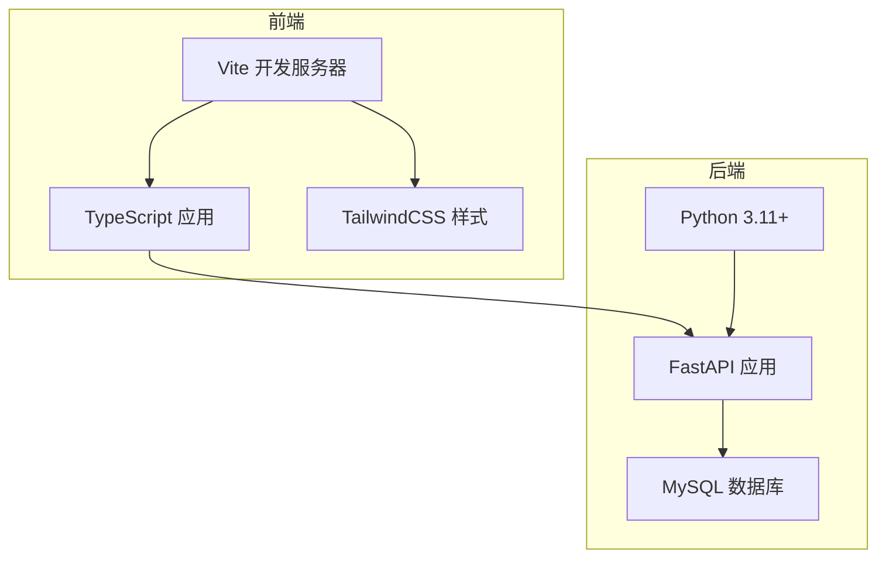
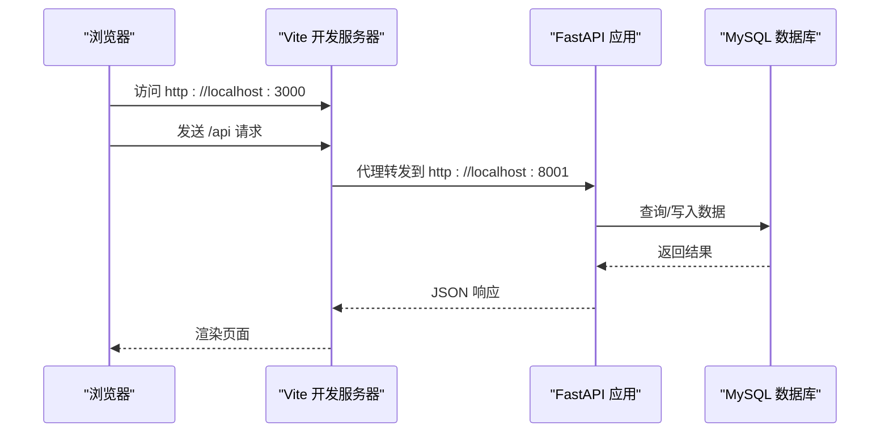
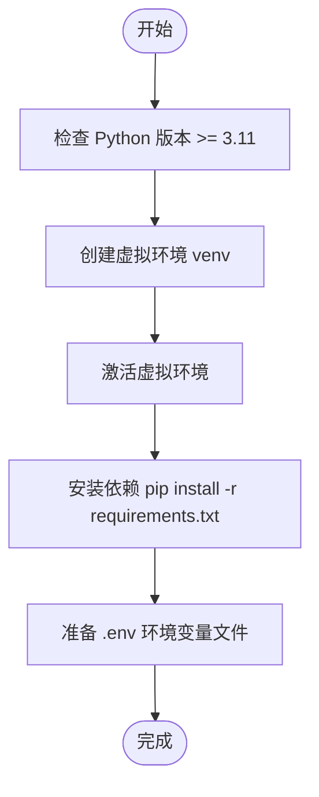
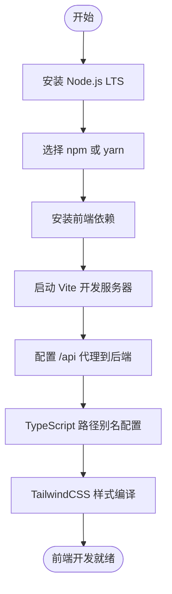
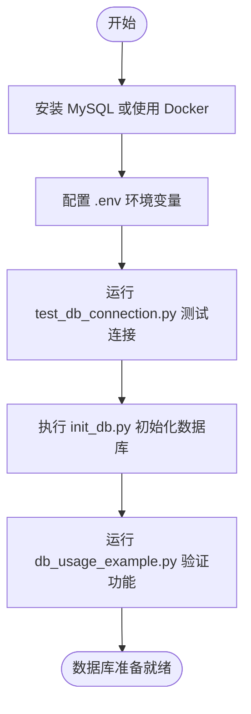
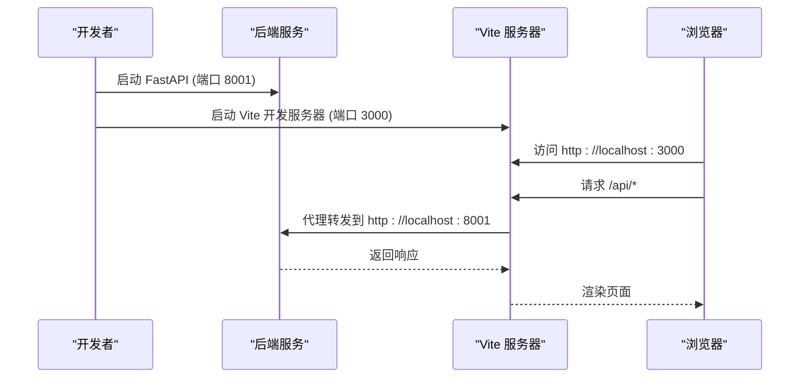
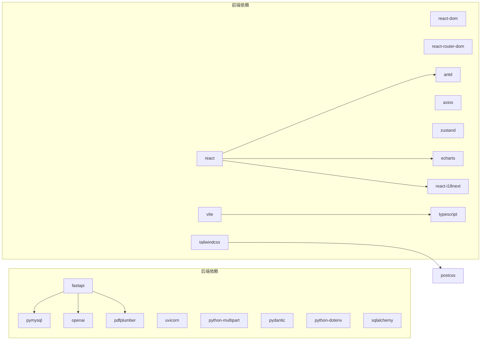
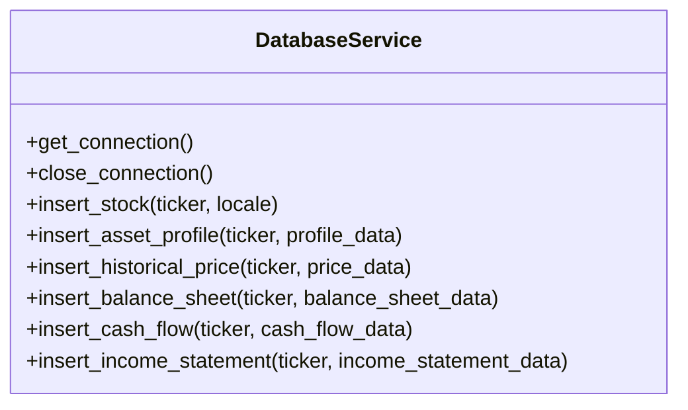

# 开发环境配置

<cite>
**本文档引用的文件**
- [backend/requirements.txt](file://backend/requirements.txt)
- [frontend/package.json](file://frontend/package.json)
- [backend/config.py](file://backend/config.py)
- [backend/main.py](file://backend/main.py)
- [frontend/vite.config.ts](file://frontend/vite.config.ts)
- [backend/MYSQL_SETUP_GUIDE.md](file://backend/MYSQL_SETUP_GUIDE.md)
- [backend/test_db_connection.py](file://backend/test_db_connection.py)
- [backend/init_db.py](file://backend/init_db.py)
- [frontend/tsconfig.json](file://frontend/tsconfig.json)
- [frontend/tailwind.config.js](file://frontend/tailwind.config.js)
- [backend/DATABASE_README.md](file://backend/DATABASE_README.md)
- [backend/services/db_service.py](file://backend/services/db_service.py)
- [frontend/postcss.config.js](file://frontend/postcss.config.js)
- [frontend/tsconfig.node.json](file://frontend/tsconfig.node.json)
</cite>

## 目录
1. [简介](#简介)
2. [项目结构](#项目结构)
3. [核心组件](#核心组件)
4. [架构概览](#架构概览)
5. [详细组件分析](#详细组件分析)
6. [依赖关系分析](#依赖关系分析)
7. [性能考虑](#性能考虑)
8. [故障排除指南](#故障排除指南)
9. [结论](#结论)
10. [附录](#附录)

## 简介
本指南面向DCF估值智能体项目的开发者，提供从零开始的完整开发环境配置方案。内容涵盖Python 3.11+环境搭建、虚拟环境创建、依赖包安装、环境变量配置；Node.js与npm/yarn的安装配置以及Vite构建工具设置；IDE推荐配置（VS Code插件、Python与TypeScript配置、调试环境）；数据库环境配置（MySQL安装、连接配置、初始化脚本执行）；以及开发服务器启动步骤、热重载配置、跨域处理等开发工具配置。

## 项目结构
该项目采用前后端分离架构：
- 后端：基于FastAPI的Python API服务，负责数据处理、PDF解析、DCF计算与数据库交互
- 前端：基于React + TypeScript的单页应用，使用Vite进行开发与构建，TailwindCSS进行样式管理
- 数据库：MySQL（默认），支持Docker快速部署与SQLite替代方案

**图表来源**
- [backend/main.py:18-35](file://backend/main.py#L18-L35)
- [frontend/vite.config.ts:12-21](file://frontend/vite.config.ts#L12-L21)

**章节来源**
- [backend/main.py:1-40](file://backend/main.py#L1-L40)
- [frontend/vite.config.ts:1-22](file://frontend/vite.config.ts#L1-L22)

## 核心组件
本节概述开发环境所需的核心组件及其作用：
- Python 3.11+：后端运行时环境
- pip/虚拟环境：隔离依赖，避免冲突
- Node.js 16+：前端构建与开发工具链
- npm/yarn：包管理器
- Vite：前端开发服务器与构建工具
- FastAPI：后端Web框架
- MySQL：主数据库存储
- TailwindCSS：前端样式框架
- VS Code：推荐IDE及插件生态

**章节来源**
- [backend/requirements.txt:1-11](file://backend/requirements.txt#L1-L11)
- [frontend/package.json:1-37](file://frontend/package.json#L1-L37)

## 架构概览
下图展示了开发环境中的典型请求流：浏览器通过Vite代理访问后端API，后端通过数据库服务层与MySQL交互。

**图表来源**
- [frontend/vite.config.ts:14-19](file://frontend/vite.config.ts#L14-L19)
- [backend/main.py:32-34](file://backend/main.py#L32-L34)

**章节来源**
- [frontend/vite.config.ts:1-22](file://frontend/vite.config.ts#L1-L22)
- [backend/main.py:1-40](file://backend/main.py#L1-L40)

## 详细组件分析

### Python 环境与依赖配置
- 版本要求：Python 3.11+（建议使用3.11.x）
- 虚拟环境：强烈建议使用venv创建独立环境，避免全局污染
- 依赖安装：在backend目录执行安装命令，自动拉取requirements.txt中的所有依赖
- 环境变量：后端通过dotenv加载.env文件，支持API密钥与数据库连接参数

**图表来源**
- [backend/requirements.txt:1-11](file://backend/requirements.txt#L1-L11)
- [backend/config.py:1-22](file://backend/config.py#L1-L22)

**章节来源**
- [backend/requirements.txt:1-11](file://backend/requirements.txt#L1-L11)
- [backend/config.py:1-22](file://backend/config.py#L1-L22)

### Node.js 与前端工具链配置
- Node.js：建议使用LTS版本（16+），确保与Vite兼容
- 包管理器：可使用npm或yarn，二者功能等价
- Vite：开发服务器默认端口3000，配置了API代理到后端8001端口
- TypeScript：严格类型检查，路径别名@指向src目录
- 样式框架：TailwindCSS + PostCSS自动前缀

**图表来源**
- [frontend/package.json:6-10](file://frontend/package.json#L6-L10)
- [frontend/vite.config.ts:12-21](file://frontend/vite.config.ts#L12-L21)
- [frontend/tsconfig.json:19-21](file://frontend/tsconfig.json#L19-L21)
- [frontend/tailwind.config.js:1-40](file://frontend/tailwind.config.js#L1-L40)

**章节来源**
- [frontend/package.json:1-37](file://frontend/package.json#L1-L37)
- [frontend/vite.config.ts:1-22](file://frontend/vite.config.ts#L1-L22)
- [frontend/tsconfig.json:1-26](file://frontend/tsconfig.json#L1-L26)
- [frontend/tailwind.config.js:1-40](file://frontend/tailwind.config.js#L1-L40)

### IDE 推荐配置（VS Code）
- 插件推荐：
  - Python：Microsoft官方扩展，提供智能感知、调试、格式化
  - Pylance：类型检查与智能提示
  - Python Docstring Generator：自动生成文档字符串
  - ES7+ React/Redux/ReactNative/TypeScript snippets：React/TS代码片段
  - Tailwind CSS IntelliSense：TailwindCSS智能提示
  - ESLint：JavaScript/TypeScript代码质量
  - Prettier：代码格式化
- Python配置：
  - 解释器选择：指向虚拟环境中Python
  - 断点调试：配置launch.json，分别调试后端FastAPI与前端Vite
- TypeScript配置：
  - 路径映射：确保@别名解析正确
  - 严格模式：启用noUnusedLocals/noUnusedParameters等

**章节来源**
- [frontend/tsconfig.json:1-26](file://frontend/tsconfig.json#L1-L26)
- [frontend/tsconfig.node.json:1-19](file://frontend/tsconfig.node.json#L1-L19)

### 数据库环境配置（MySQL）
- 安装方式：
  - 官方MySQL Community Server（默认端口3306，用户root）
  - Docker（推荐）：一键运行MySQL 8.0容器
  - XAMPP/WAMP：集成Apache/MySQL环境
  - SQLite（替代方案）：无需安装，适合轻量开发
- 连接配置：
  - 主机、端口、用户名、密码、数据库名均来自.env文件
  - 后端通过config.py读取环境变量
- 初始化脚本：
  - test_db_connection.py：连接与基本操作测试
  - init_db.py：创建数据库与所有表结构
  - examples/db_usage_example.py：演示数据插入与查询

**图表来源**
- [backend/MYSQL_SETUP_GUIDE.md:134-156](file://backend/MYSQL_SETUP_GUIDE.md#L134-L156)
- [backend/test_db_connection.py:22-72](file://backend/test_db_connection.py#L22-L72)
- [backend/init_db.py:172-211](file://backend/init_db.py#L172-L211)
- [backend/config.py:14-21](file://backend/config.py#L14-L21)

**章节来源**
- [backend/MYSQL_SETUP_GUIDE.md:1-214](file://backend/MYSQL_SETUP_GUIDE.md#L1-L214)
- [backend/test_db_connection.py:1-183](file://backend/test_db_connection.py#L1-L183)
- [backend/init_db.py:1-219](file://backend/init_db.py#L1-L219)
- [backend/config.py:1-22](file://backend/config.py#L1-L22)

### 开发服务器启动步骤
- 后端FastAPI：
  - 在backend目录激活虚拟环境
  - 安装依赖后，使用uvicorn启动服务（端口8001）
  - 健康检查接口：GET /api/health
- 前端Vite：
  - 在frontend目录安装依赖
  - 启动开发服务器，默认端口3000
  - 通过代理访问后端API（/api → http://localhost:8001）

**图表来源**
- [backend/main.py:37-40](file://backend/main.py#L37-L40)
- [frontend/vite.config.ts:12-21](file://frontend/vite.config.ts#L12-L21)

**章节来源**
- [backend/main.py:1-40](file://backend/main.py#L1-L40)
- [frontend/vite.config.ts:1-22](file://frontend/vite.config.ts#L1-L22)

### 跨域处理与CORS配置
- 后端已启用CORS中间件，允许任意源、方法与头
- 生产环境建议限制具体域名与方法，提升安全性
- 前端代理解决开发阶段的跨域问题

**章节来源**
- [backend/main.py:24-30](file://backend/main.py#L24-L30)
- [frontend/vite.config.ts:14-19](file://frontend/vite.config.ts#L14-L19)

### 热重载与构建配置
- Vite：开发时自动热重载，监听src目录变化
- TypeScript：严格类型检查，构建时生成声明文件
- TailwindCSS：PostCSS自动处理，按需生成样式
- 构建产物：dist目录，包含静态资源与入口HTML

**章节来源**
- [frontend/vite.config.ts:1-22](file://frontend/vite.config.ts#L1-L22)
- [frontend/tsconfig.json:1-26](file://frontend/tsconfig.json#L1-L26)
- [frontend/postcss.config.js:1-7](file://frontend/postcss.config.js#L1-L7)

## 依赖关系分析
后端与前端的关键依赖关系如下：

**图表来源**
- [backend/requirements.txt:1-11](file://backend/requirements.txt#L1-L11)
- [frontend/package.json:11-35](file://frontend/package.json#L11-L35)

**章节来源**
- [backend/requirements.txt:1-11](file://backend/requirements.txt#L1-L11)
- [frontend/package.json:1-37](file://frontend/package.json#L1-L37)

## 性能考虑
- 数据库连接：建议实现连接池与事务管理，减少频繁连接开销
- 前端构建：生产构建开启代码分割与懒加载，减小首屏体积
- 缓存策略：对高频查询结果进行缓存，降低数据库压力
- 并发处理：后端API合理使用异步I/O，避免阻塞

## 故障排除指南
- MySQL连接失败：
  - 检查服务状态与端口占用
  - 验证.env中的主机、端口、用户名、密码
  - 使用test_db_connection.py进行诊断
- 数据库初始化失败：
  - 确认用户具备CREATE DATABASE权限
  - 运行init_db.py重新初始化
- 前端代理无效：
  - 确认后端服务已在8001端口运行
  - 检查vite.config.ts中的proxy配置
- 环境变量未生效：
  - 确认dotenv已正确加载
  - 检查.env文件编码与格式

**章节来源**
- [backend/MYSQL_SETUP_GUIDE.md:173-214](file://backend/MYSQL_SETUP_GUIDE.md#L173-L214)
- [backend/test_db_connection.py:62-71](file://backend/test_db_connection.py#L62-L71)
- [frontend/vite.config.ts:14-19](file://frontend/vite.config.ts#L14-L19)

## 结论
通过本指南，您可以在本地快速搭建DCF估值智能体的完整开发环境。建议优先使用Docker部署MySQL以简化配置，同时利用Vite的热重载与TypeScript的严格类型检查提升开发效率。遵循跨域与CORS配置的最佳实践，确保前后端协作顺畅。

## 附录
- 数据库服务类图（简化版）：

**图表来源**
- [backend/services/db_service.py:24-200](file://backend/services/db_service.py#L24-L200)