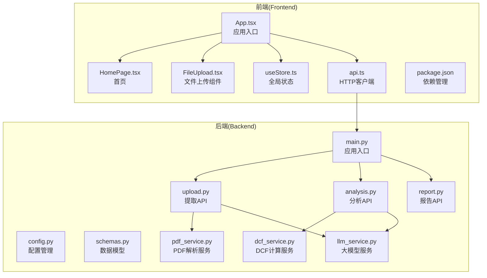
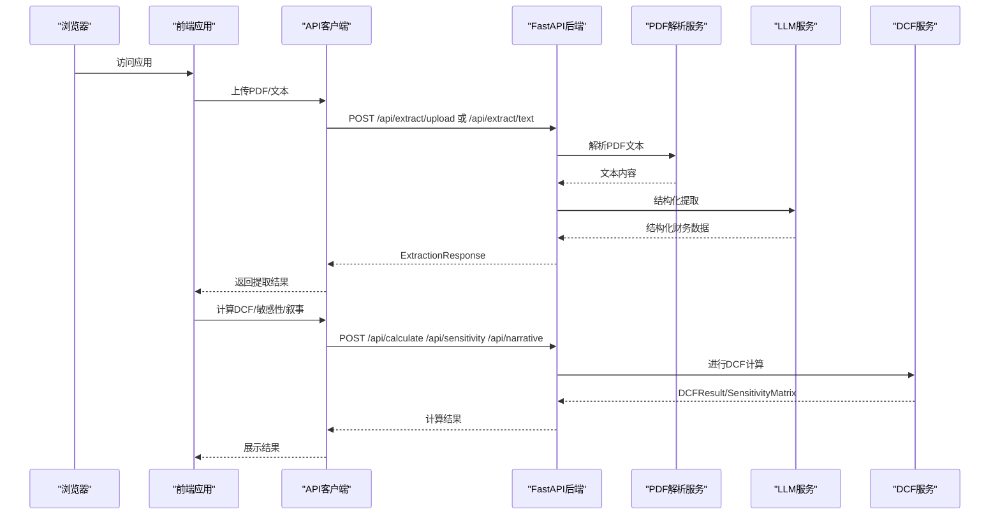
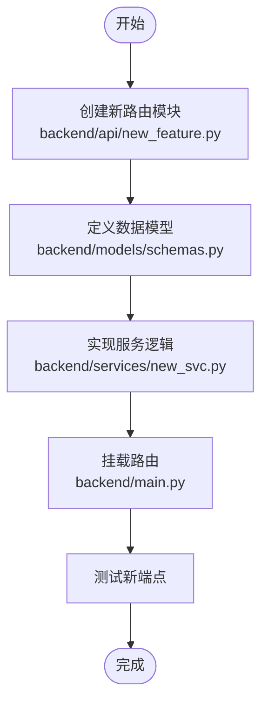
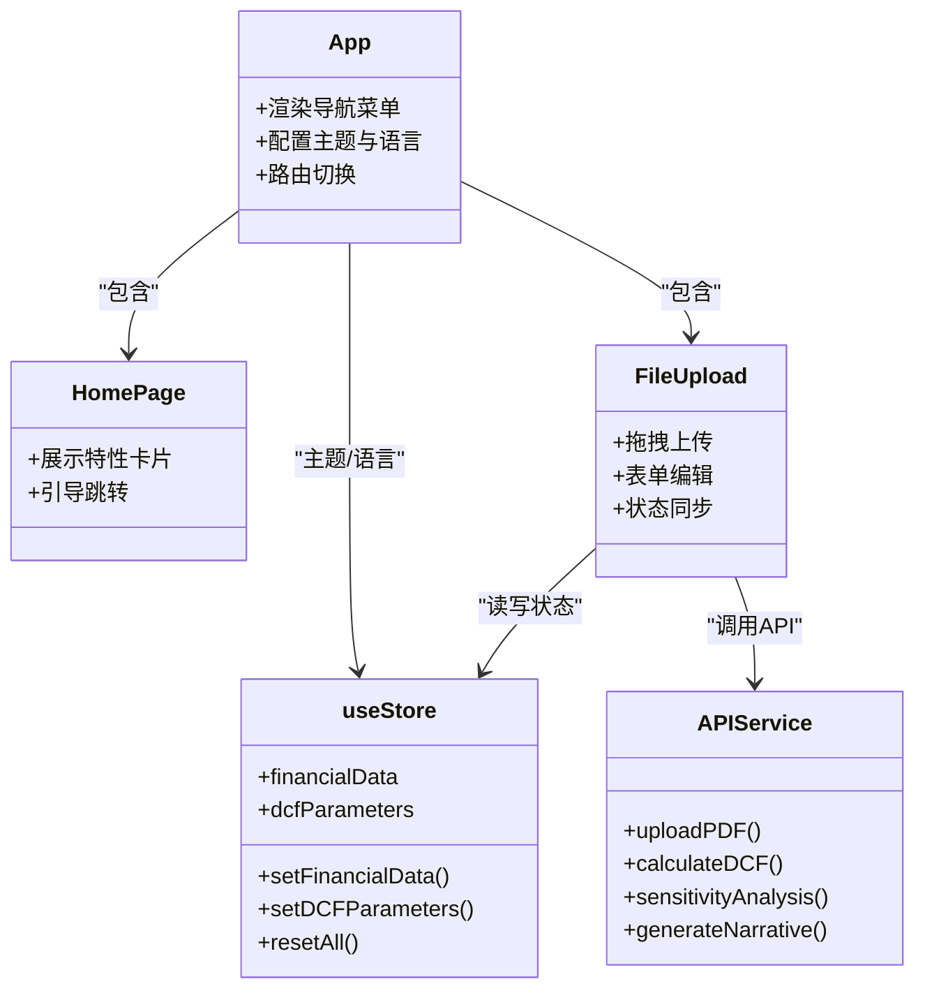
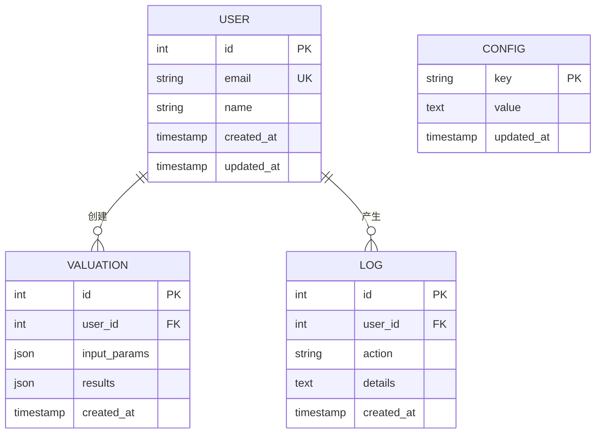
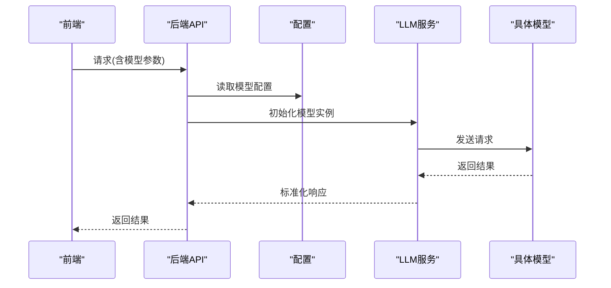
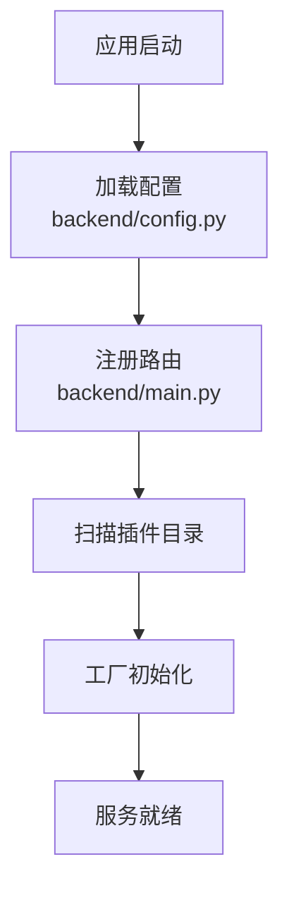
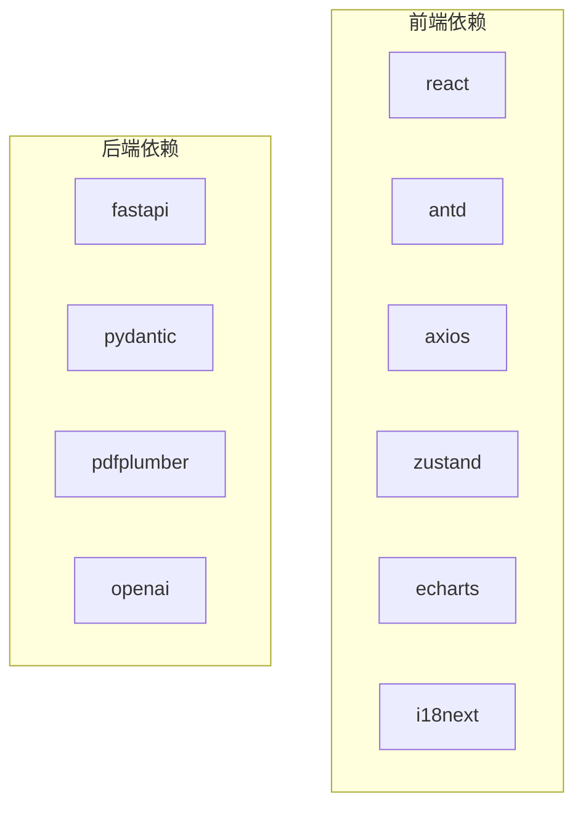

# 扩展开发指南

<cite>
**本文档引用的文件**
- [backend/main.py](file://backend/main.py)
- [backend/config.py](file://backend/config.py)
- [backend/models/schemas.py](file://backend/models/schemas.py)
- [backend/api/upload.py](file://backend/api/upload.py)
- [backend/api/analysis.py](file://backend/api/analysis.py)
- [backend/api/report.py](file://backend/api/report.py)
- [backend/services/dcf_service.py](file://backend/services/dcf_service.py)
- [backend/services/pdf_service.py](file://backend/services/pdf_service.py)
- [backend/services/llm_service.py](file://backend/services/llm_service.py)
- [frontend/src/App.tsx](file://frontend/src/App.tsx)
- [frontend/src/pages/HomePage.tsx](file://frontend/src/pages/HomePage.tsx)
- [frontend/src/components/FileUpload.tsx](file://frontend/src/components/FileUpload.tsx)
- [frontend/src/store/useStore.ts](file://frontend/src/store/useStore.ts)
- [frontend/src/services/api.ts](file://frontend/src/services/api.ts)
- [frontend/package.json](file://frontend/package.json)
</cite>

## 目录
1. [简介](#简介)
2. [项目结构](#项目结构)
3. [核心组件](#核心组件)
4. [架构概览](#架构概览)
5. [详细组件分析](#详细组件分析)
6. [依赖分析](#依赖分析)
7. [性能考虑](#性能考虑)
8. [故障排除指南](#故障排除指南)
9. [结论](#结论)
10. [附录](#附录)

## 简介
本指南面向DCF估值智能体项目的扩展开发者，提供后端API接口扩展、前端组件开发、数据库表结构设计、第三方服务集成以及插件系统设计的完整方法论。文档同时涵盖现有功能修改（参数调整、算法优化、界面定制）的最佳实践，并给出向后兼容性保证、版本管理策略与发布流程建议。

## 项目结构
项目采用前后端分离架构，后端基于FastAPI提供REST API，前端基于React + TypeScript构建用户界面，状态管理采用Zustand，图表可视化使用ECharts。

**图表来源**
- [backend/main.py:18-34](file://backend/main.py#L18-L34)
- [frontend/src/App.tsx:105-147](file://frontend/src/App.tsx#L105-L147)

**章节来源**
- [backend/main.py:18-34](file://backend/main.py#L18-L34)
- [frontend/src/App.tsx:105-147](file://frontend/src/App.tsx#L105-L147)

## 核心组件
- 后端应用入口与路由：定义FastAPI实例、CORS中间件、健康检查端点及API路由挂载。
- 数据模型：定义金融数据、DCF参数、投影结果、敏感性矩阵等Pydantic模型。
- 提取服务：PDF文本抽取与LLM结构化提取。
- 分析服务：DCF计算、敏感性分析、叙事生成。
- 前端应用：路由导航、页面组件、状态管理、API调用封装。

**章节来源**
- [backend/main.py:18-40](file://backend/main.py#L18-L40)
- [backend/models/schemas.py:8-101](file://backend/models/schemas.py#L8-L101)
- [backend/api/upload.py:16-55](file://backend/api/upload.py#L16-L55)
- [backend/api/analysis.py:18-45](file://backend/api/analysis.py#L18-L45)
- [backend/services/dcf_service.py:85-163](file://backend/services/dcf_service.py#L85-L163)
- [backend/services/pdf_service.py:26-68](file://backend/services/pdf_service.py#L26-L68)
- [backend/services/llm_service.py:70-155](file://backend/services/llm_service.py#L70-L155)
- [frontend/src/App.tsx:21-103](file://frontend/src/App.tsx#L21-L103)
- [frontend/src/components/FileUpload.tsx:12-159](file://frontend/src/components/FileUpload.tsx#L12-L159)
- [frontend/src/store/useStore.ts:23-74](file://frontend/src/store/useStore.ts#L23-L74)
- [frontend/src/services/api.ts:28-81](file://frontend/src/services/api.ts#L28-L81)

## 架构概览
系统采用分层架构：表现层（React前端）、API层（FastAPI路由）、服务层（业务逻辑与外部服务集成）、数据层（配置与未来数据库）。前后端通过REST API通信，前端通过Axios发起请求，后端通过异步服务处理计算与外部调用。

**图表来源**
- [frontend/src/services/api.ts:28-81](file://frontend/src/services/api.ts#L28-L81)
- [backend/api/upload.py:16-55](file://backend/api/upload.py#L16-L55)
- [backend/api/analysis.py:18-45](file://backend/api/analysis.py#L18-L45)
- [backend/services/pdf_service.py:26-68](file://backend/services/pdf_service.py#L26-L68)
- [backend/services/llm_service.py:94-123](file://backend/services/llm_service.py#L94-L123)
- [backend/services/dcf_service.py:85-163](file://backend/services/dcf_service.py#L85-L163)

## 详细组件分析

### 后端API扩展（新增端点与路由）
- 新增路由模块：在backend/api目录下创建新模块（如new_feature.py），定义APIRouter并添加路由函数。
- 数据模型：在backend/models/schemas.py中新增Pydantic模型，确保序列化/反序列化与校验。
- 服务实现：在backend/services中新增对应服务类或函数，遵循现有命名规范。
- 路由挂载：在backend/main.py中include_router并设置prefix。

**图表来源**
- [backend/main.py:32-34](file://backend/main.py#L32-L34)
- [backend/models/schemas.py:8-101](file://backend/models/schemas.py#L8-L101)

**章节来源**
- [backend/main.py:32-34](file://backend/main.py#L32-L34)
- [backend/models/schemas.py:8-101](file://backend/models/schemas.py#L8-L101)

### 前端组件开发（新增页面与交互）
- 页面组件：在frontend/src/pages中新增页面组件（如NewFeaturePage.tsx），使用Ant Design组件与图标。
- 组件复用：在frontend/src/components中新增可复用组件（如NewFeaturePanel.tsx）。
- 状态管理：在frontend/src/store/useStore.ts中扩展AppState类型与动作。
- API调用：在frontend/src/services/api.ts中新增对应函数，保持错误处理一致。
- 路由配置：在frontend/src/App.tsx中添加路由项与导航菜单。

**图表来源**
- [frontend/src/App.tsx:21-103](file://frontend/src/App.tsx#L21-L103)
- [frontend/src/pages/HomePage.tsx:23-117](file://frontend/src/pages/HomePage.tsx#L23-L117)
- [frontend/src/components/FileUpload.tsx:12-159](file://frontend/src/components/FileUpload.tsx#L12-L159)
- [frontend/src/store/useStore.ts:23-74](file://frontend/src/store/useStore.ts#L23-L74)
- [frontend/src/services/api.ts:28-81](file://frontend/src/services/api.ts#L28-L81)

**章节来源**
- [frontend/src/App.tsx:21-103](file://frontend/src/App.tsx#L21-L103)
- [frontend/src/pages/HomePage.tsx:23-117](file://frontend/src/pages/HomePage.tsx#L23-L117)
- [frontend/src/components/FileUpload.tsx:12-159](file://frontend/src/components/FileUpload.tsx#L12-L159)
- [frontend/src/store/useStore.ts:23-74](file://frontend/src/store/useStore.ts#L23-L74)
- [frontend/src/services/api.ts:28-81](file://frontend/src/services/api.ts#L28-L81)

### 数据库表结构设计（扩展建议）
- 设计原则：遵循ACID与范式，优先满足查询性能与扩展性。
- 表结构建议：
  - 用户表：用户标识、认证信息、偏好设置
  - 估值记录表：输入参数、计算结果、时间戳、关联用户
  - 日志表：操作日志、错误日志、性能指标
  - 配置表：系统参数、模型配置、阈值
- 关系图（概念示意）

[此图为概念示意，不直接映射具体源码文件]

### 现有功能修改方法

#### 参数调整
- 后端：在backend/models/schemas.py中调整默认参数或新增字段；在backend/services/dcf_service.py中更新计算逻辑。
- 前端：在frontend/src/store/useStore.ts中更新默认DCF参数；在frontend/src/components/ParamPanel.tsx中添加参数面板控件。

**章节来源**
- [backend/models/schemas.py:32-43](file://backend/models/schemas.py#L32-L43)
- [backend/services/dcf_service.py:12-35](file://backend/services/dcf_service.py#L12-L35)
- [frontend/src/store/useStore.ts:11-21](file://frontend/src/store/useStore.ts#L11-L21)

#### 算法优化
- DCF算法：在backend/services/dcf_service.py中优化循环与数值稳定性，增加边界条件判断。
- PDF解析：在backend/services/pdf_service.py中改进关键词匹配与截断策略，提升抽取质量。
- LLM提示词：在backend/services/llm_service.py中调整system prompt与温度参数，提高结构化输出稳定性。

**章节来源**
- [backend/services/dcf_service.py:85-163](file://backend/services/dcf_service.py#L85-L163)
- [backend/services/pdf_service.py:26-68](file://backend/services/pdf_service.py#L26-L68)
- [backend/services/llm_service.py:70-155](file://backend/services/llm_service.py#L70-L155)

#### 界面定制
- 主题与布局：在frontend/src/App.tsx中调整Ant Design主题与颜色变量。
- 多语言：在frontend/src/i18n中新增翻译键值，前端自动切换。
- 图表扩展：在frontend/src/components/CashFlowChart.tsx与WaterfallChart.tsx中引入ECharts进行可视化增强。

**章节来源**
- [frontend/src/App.tsx:105-147](file://frontend/src/App.tsx#L105-L147)
- [frontend/src/components/FileUpload.tsx:12-159](file://frontend/src/components/FileUpload.tsx#L12-L159)

### 第三方服务集成指南

#### 新的AI模型接入
- 接入步骤：
  1) 在backend/config.py中新增环境变量（如API密钥、基础URL、模型名）。
  2) 在backend/services/llm_service.py中新增适配器类或工厂方法，支持多模型切换。
  3) 在前端frontend/src/services/api.ts中暴露模型选择参数，后端根据参数路由到不同实现。
- 兼容性：保留默认模型作为回退，确保向后兼容。

**图表来源**
- [backend/config.py:10-21](file://backend/config.py#L10-L21)
- [backend/services/llm_service.py:70-155](file://backend/services/llm_service.py#L70-L155)

**章节来源**
- [backend/config.py:10-21](file://backend/config.py#L10-L21)
- [backend/services/llm_service.py:70-155](file://backend/services/llm_service.py#L70-L155)

#### PDF解析器替换
- 替换策略：在backend/services/pdf_service.py中抽象出PDF解析接口，提供多种实现（如pdfplumber、pymupdf、OCR）。
- 性能优化：缓存解析结果、限制最大字符数、并行处理多页。
- 错误处理：捕获解析异常并返回标准化错误信息。

**章节来源**
- [backend/services/pdf_service.py:26-68](file://backend/services/pdf_service.py#L26-L68)

#### 图表库扩展
- ECharts集成：在frontend/src/components/CashFlowChart.tsx与WaterfallChart.tsx中封装ECharts组件，支持主题切换与响应式布局。
- 自定义样式：通过Ant Design主题变量与CSS变量统一视觉风格。

**章节来源**
- [frontend/src/components/FileUpload.tsx:12-159](file://frontend/src/components/FileUpload.tsx#L12-L159)
- [frontend/package.json:19-20](file://frontend/package.json#L19-L20)

### 插件系统设计
- 服务注册机制：通过backend/main.py中的include_router集中注册，新增模块时只需添加include_router调用。
- 配置管理：在backend/config.py中集中管理环境变量与默认值，支持运行时热更新（需谨慎）。
- 动态加载：建议通过工厂模式与依赖注入框架（如injector）实现模块化加载，避免硬编码路径。

**图表来源**
- [backend/main.py:32-34](file://backend/main.py#L32-L34)
- [backend/config.py:10-21](file://backend/config.py#L10-L21)

**章节来源**
- [backend/main.py:32-34](file://backend/main.py#L32-L34)
- [backend/config.py:10-21](file://backend/config.py#L10-L21)

## 依赖分析
- 前端依赖：React、Ant Design、Axios、Zustand、ECharts、i18n等。
- 后端依赖：FastAPI、pdfplumber、OpenAI异步客户端、Pydantic等。

**图表来源**
- [frontend/package.json:11-25](file://frontend/package.json#L11-L25)
- [backend/requirements.txt](file://backend/requirements.txt)

**章节来源**
- [frontend/package.json:11-25](file://frontend/package.json#L11-L25)

## 性能考虑
- 异步处理：后端使用async/await减少阻塞，前端使用并发请求与防抖。
- 缓存策略：对LLM输出与解析结果进行缓存，降低重复计算成本。
- 资源限制：控制PDF最大字符数与页面数量，避免内存溢出。
- 并发控制：限制同时进行的计算任务数量，保障系统稳定性。

[本节为通用指导，无需特定文件引用]

## 故障排除指南
- 健康检查：后端提供/health端点用于快速诊断服务状态。
- 错误处理：前端API封装统一错误处理，后端路由捕获异常并返回标准错误信息。
- 日志记录：后端服务使用logging模块记录关键事件与异常堆栈。

**章节来源**
- [backend/main.py:37-40](file://backend/main.py#L37-L40)
- [frontend/src/services/api.ts:17-26](file://frontend/src/services/api.ts#L17-L26)
- [backend/services/pdf_service.py:6](file://backend/services/pdf_service.py#L6)

## 结论
本指南提供了DCF估值智能体项目的扩展开发蓝图，涵盖后端API扩展、前端组件开发、第三方服务集成与插件系统设计。通过遵循本文档的架构原则与最佳实践，开发者可以安全地迭代功能、优化性能并保持向后兼容性。

## 附录

### 版本管理与发布流程建议
- 版本号：语义化版本（主.次.补丁），变更记录在CHANGELOG中维护。
- 分支策略：主分支保护，功能开发在feature分支，修复hotfix分支。
- CI/CD：自动化测试、打包与部署，发布前进行健康检查与回归测试。
- 兼容性：严格遵守向后兼容，必要时提供迁移脚本与配置升级指引。

[本节为通用指导，无需特定文件引用]