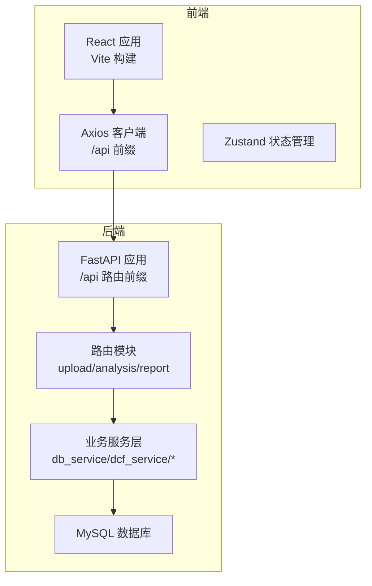
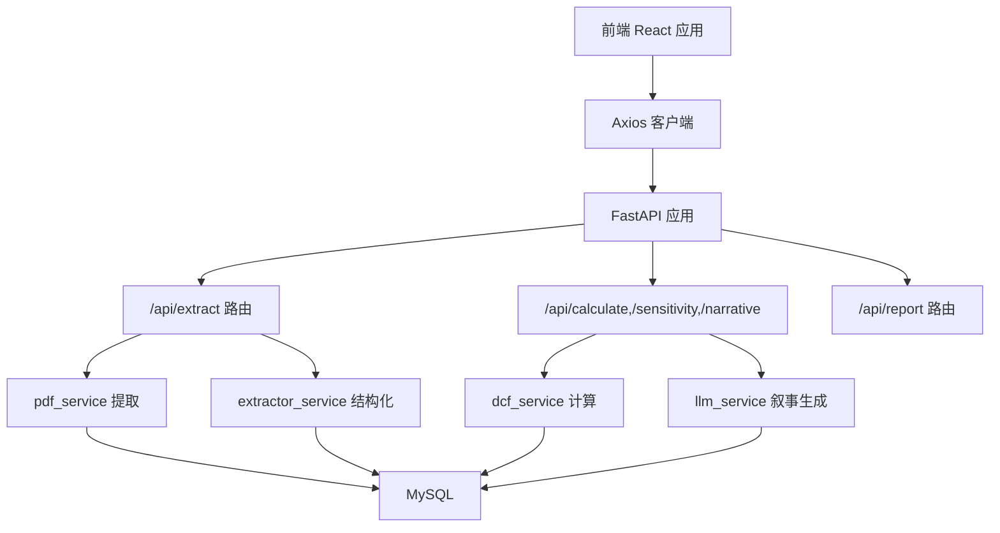
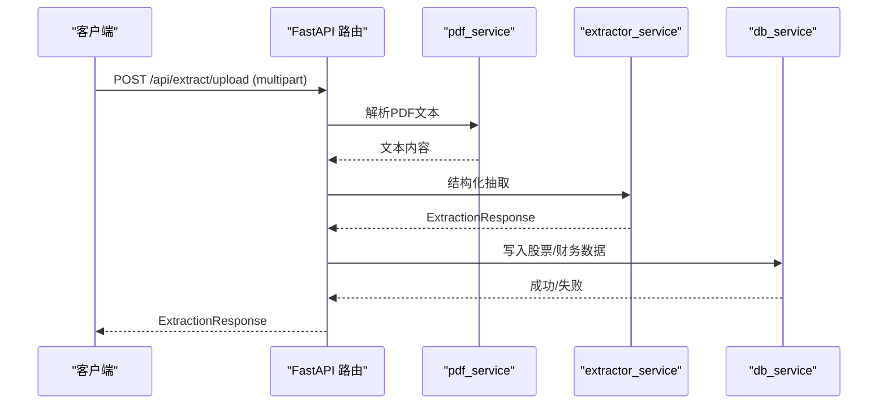
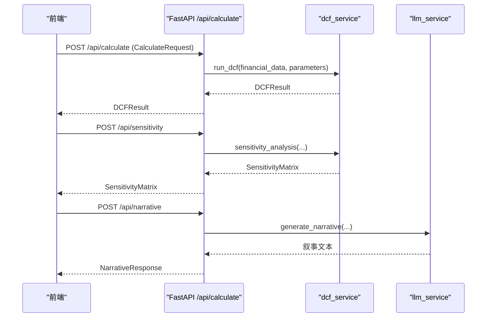
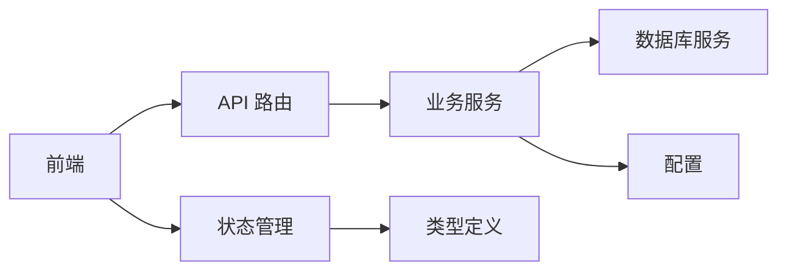

# 测试策略与实施

<cite>
**本文引用的文件**
- [backend/main.py](file://backend/main.py)
- [backend/config.py](file://backend/config.py)
- [backend/services/db_service.py](file://backend/services/db_service.py)
- [backend/services/dcf_service.py](file://backend/services/dcf_service.py)
- [backend/models/schemas.py](file://backend/models/schemas.py)
- [backend/api/upload.py](file://backend/api/upload.py)
- [backend/api/analysis.py](file://backend/api/analysis.py)
- [backend/api/report.py](file://backend/api/report.py)
- [backend/test_db_connection.py](file://backend/test_db_connection.py)
- [frontend/src/services/api.ts](file://frontend/src/services/api.ts)
- [frontend/src/store/useStore.ts](file://frontend/src/store/useStore.ts)
- [frontend/src/types/index.ts](file://frontend/src/types/index.ts)
- [frontend/package.json](file://frontend/package.json)
</cite>

## 目录
1. [引言](#引言)
2. [项目结构](#项目结构)
3. [核心组件](#核心组件)
4. [架构总览](#架构总览)
5. [详细组件分析](#详细组件分析)
6. [依赖分析](#依赖分析)
7. [性能考虑](#性能考虑)
8. [故障排查指南](#故障排查指南)
9. [结论](#结论)
10. [附录](#附录)

## 引言
本文件为DCF估值智能体项目制定系统化的测试策略与实施方案，覆盖单元测试、集成测试、端到端测试与持续集成。针对后端Python/FastAPI、前端React/Vite以及数据库交互，明确测试目标、方法、工具与流程，确保功能正确性、稳定性与可维护性。

## 项目结构
项目采用前后端分离架构：后端基于FastAPI提供REST API；前端基于React+Vite构建单页应用；数据库通过pymysql访问MySQL；类型定义统一使用Pydantic模型（后端）与TypeScript接口（前端）。

图表来源
- [backend/main.py:18-35](file://backend/main.py#L18-L35)
- [backend/api/upload.py:13](file://backend/api/upload.py#L13)
- [backend/api/analysis.py:15](file://backend/api/analysis.py#L15)
- [backend/api/report.py:5](file://backend/api/report.py#L5)
- [frontend/src/services/api.ts:11-15](file://frontend/src/services/api.ts#L11-L15)

章节来源
- [backend/main.py:18-40](file://backend/main.py#L18-L40)
- [frontend/package.json:6-10](file://frontend/package.json#L6-L10)

## 核心组件
- 后端主程序与路由：负责启动应用、注册CORS中间件、挂载上传/分析/报表路由。
- 配置模块：加载环境变量，提供数据库与API密钥配置。
- 数据库服务：封装pymysql连接、事务与多表写入/查询。
- DCF计算服务：WACC计算、FCF预测、终值计算与敏感性分析。
- API层：上传PDF提取、文本提取、DCF计算、敏感性分析、叙事生成。
- 前端服务：Axios封装HTTP请求、错误处理、超时控制。
- 状态管理：Zustand集中管理财务数据、参数、结果、加载与错误状态。
- 类型定义：Pydantic模型与TypeScript接口保证数据一致性。

章节来源
- [backend/main.py:18-40](file://backend/main.py#L18-L40)
- [backend/config.py:10-22](file://backend/config.py#L10-L22)
- [backend/services/db_service.py:24-345](file://backend/services/db_service.py#L24-L345)
- [backend/services/dcf_service.py:12-163](file://backend/services/dcf_service.py#L12-L163)
- [backend/api/upload.py:16-55](file://backend/api/upload.py#L16-L55)
- [backend/api/analysis.py:18-45](file://backend/api/analysis.py#L18-L45)
- [backend/api/report.py:8-12](file://backend/api/report.py#L8-L12)
- [frontend/src/services/api.ts:11-81](file://frontend/src/services/api.ts#L11-L81)
- [frontend/src/store/useStore.ts:23-74](file://frontend/src/store/useStore.ts#L23-L74)
- [frontend/src/types/index.ts:4-128](file://frontend/src/types/index.ts#L4-L128)
- [backend/models/schemas.py:8-101](file://backend/models/schemas.py#L8-L101)

## 架构总览
后端以FastAPI为核心，通过路由模块组织功能；业务逻辑集中在服务层；前端通过Axios调用后端API，状态通过Zustand集中管理。数据库服务负责持久化与查询。

图表来源
- [backend/main.py:32-34](file://backend/main.py#L32-L34)
- [backend/api/upload.py:16-55](file://backend/api/upload.py#L16-L55)
- [backend/api/analysis.py:18-45](file://backend/api/analysis.py#L18-L45)
- [backend/api/report.py:8-12](file://backend/api/report.py#L8-L12)
- [backend/services/db_service.py:30-46](file://backend/services/db_service.py#L30-L46)

## 详细组件分析

### 单元测试策略（Python/pytest）
- 测试范围
  - 业务函数：DCF计算服务中的WACC、FCF预测、终值与敏感性分析。
  - 数据模型：Pydantic模型字段校验与默认值。
  - 工具函数：数据库服务的连接、插入与查询。
- 测试要点
  - 输入边界：零值、负值、空值、None。
  - 数值精度：保留位数、浮点误差。
  - 错误路径：异常抛出、回滚、返回False。
- 推荐目录结构
  - backend/tests/
    - test_dcf_service.py
    - test_models_schemas.py
    - test_db_service.py
    - conftest.py（fixture）
- 编写规范
  - 每个函数至少一个成功路径与一个失败路径测试。
  - 使用pytest.mark.parametrize进行参数化测试。
  - 使用monkeypatch/os.getenv模拟环境变量。
  - 使用pytest.raises验证异常。
- 示例路径参考
  - [backend/services/dcf_service.py:12-163](file://backend/services/dcf_service.py#L12-L163)
  - [backend/models/schemas.py:8-101](file://backend/models/schemas.py#L8-L101)
  - [backend/services/db_service.py:30-345](file://backend/services/db_service.py#L30-L345)

章节来源
- [backend/services/dcf_service.py:12-163](file://backend/services/dcf_service.py#L12-L163)
- [backend/models/schemas.py:8-101](file://backend/models/schemas.py#L8-L101)
- [backend/services/db_service.py:30-345](file://backend/services/db_service.py#L30-L345)

### 前端单元测试策略（Jest/React Testing Library）
- 测试范围
  - 组件：FileUpload、ManualInput、ParamPanel、DCFResult、CashFlowChart、WaterfallChart、SensitivityTable。
  - 服务：api.ts的HTTP封装与错误处理。
  - 状态：useStore的状态更新与重置。
  - 类型：TypeScript接口与Zustand Store类型一致性。
- 测试要点
  - 行为驱动：用户交互触发状态变化与渲染差异。
  - 异步：等待Promise完成、模拟网络请求。
  - 国际化：切换语言后的文案渲染。
  - 主题：明暗主题切换对组件的影响。
- 推荐目录结构
  - frontend/src/__tests__/
    - components/*.test.tsx
    - services/api.test.ts
    - store/useStore.test.ts
    - types/index.test.ts
- 编写规范
  - 使用render、screen、fireEvent等RTL API。
  - 使用jest.mock模拟axios与第三方库。
  - 使用act包裹异步更新。
  - 使用describe/it分组测试用例。
- 示例路径参考
  - [frontend/src/services/api.ts:28-81](file://frontend/src/services/api.ts#L28-L81)
  - [frontend/src/store/useStore.ts:23-74](file://frontend/src/store/useStore.ts#L23-L74)
  - [frontend/src/types/index.ts:4-128](file://frontend/src/types/index.ts#L4-L128)

章节来源
- [frontend/src/services/api.ts:28-81](file://frontend/src/services/api.ts#L28-L81)
- [frontend/src/store/useStore.ts:23-74](file://frontend/src/store/useStore.ts#L23-L74)
- [frontend/src/types/index.ts:4-128](file://frontend/src/types/index.ts#L4-L128)

### 集成测试策略
- 目标
  - API接口：/api/extract/upload、/api/extract/text、/api/calculate、/api/sensitivity、/api/narrative。
  - 数据库：写入/读取金融数据与历史价格。
  - 服务间通信：PDF解析、LLM抽取与叙事生成。
- 方法
  - 使用FastAPI TestClient发起HTTP请求。
  - 使用pytest fixture创建临时数据库表或使用测试数据库实例。
  - Mock外部服务（如Minimax LLM）以稳定测试。
  - 验证响应模型与状态码。
- 关键流程图（上传与提取）

图表来源
- [backend/api/upload.py:16-55](file://backend/api/upload.py#L16-L55)
- [backend/services/db_service.py:54-232](file://backend/services/db_service.py#L54-L232)

- 关键流程图（DCF计算）

图表来源
- [backend/api/analysis.py:18-45](file://backend/api/analysis.py#L18-L45)
- [backend/services/dcf_service.py:85-163](file://backend/services/dcf_service.py#L85-L163)

- 数据库连接测试
  - 使用现有脚本作为参考，验证连接参数与可用性。
  - 在CI中使用临时数据库实例或容器化MySQL。
- 示例路径参考
  - [backend/test_db_connection.py](file://backend/test_db_connection.py)
  - [backend/config.py:14-22](file://backend/config.py#L14-L22)
  - [backend/services/db_service.py:30-46](file://backend/services/db_service.py#L30-L46)

章节来源
- [backend/api/upload.py:16-55](file://backend/api/upload.py#L16-L55)
- [backend/api/analysis.py:18-45](file://backend/api/analysis.py#L18-L45)
- [backend/services/db_service.py:30-345](file://backend/services/db_service.py#L30-L345)
- [backend/test_db_connection.py](file://backend/test_db_connection.py)
- [backend/config.py:14-22](file://backend/config.py#L14-L22)

### 端到端测试方案
- 用户流程
  - 上传PDF → 文本提取 → 参数调整 → DCF计算 → 敏感性分析 → 叙事生成 → 结果展示。
  - 手动输入 → 参数调整 → DCF计算 → 敏感性分析 → 叙事生成 → 结果展示。
- 工具建议
  - Playwright/Cypress：跨浏览器兼容性与响应式设计验证。
  - 使用真实后端与最小化数据库（或内存数据库）。
- 覆盖场景
  - 不同浏览器（Chrome/Firefox/Safari）与设备尺寸。
  - 失败路径：空文件、无效文本、网络超时、LLM不可用。
- 示例路径参考
  - [frontend/src/services/api.ts:11-15](file://frontend/src/services/api.ts#L11-L15)
  - [frontend/src/store/useStore.ts:23-74](file://frontend/src/store/useStore.ts#L23-L74)

章节来源
- [frontend/src/services/api.ts:11-81](file://frontend/src/services/api.ts#L11-L81)
- [frontend/src/store/useStore.ts:23-74](file://frontend/src/store/useStore.ts#L23-L74)

### 测试数据管理
- 准备策略
  - 使用Pydantic模型/TypeScript接口定义测试数据结构。
  - 通过工厂模式或faker生成多样化测试数据。
- Mock服务
  - 使用unittest.mock或pytest-mock模拟外部API（Minimax）。
  - 使用httpx/requests-mock拦截HTTP请求。
- 环境隔离
  - 使用独立的TEST_ENV与TEST_DB。
  - Docker Compose运行MySQL与后端测试实例。
- 示例路径参考
  - [backend/models/schemas.py:8-101](file://backend/models/schemas.py#L8-L101)
  - [frontend/src/types/index.ts:4-128](file://frontend/src/types/index.ts#L4-L128)

章节来源
- [backend/models/schemas.py:8-101](file://backend/models/schemas.py#L8-L101)
- [frontend/src/types/index.ts:4-128](file://frontend/src/types/index.ts#L4-L128)

### 持续集成测试配置
- GitHub Actions工作流建议
  - Python测试：安装依赖、运行pytest（含覆盖率）、数据库连接检查。
  - 前端测试：安装依赖、运行jest、构建产物检查。
  - E2E测试：Playwright/Cypress在容器化环境中执行。
- 自动化流水线
  - 触发条件：push/pr到主分支。
  - 并行阶段：Python单元测试、前端单元测试、E2E测试。
  - 覆盖率报告：pytest-html或coverage结合codecov。
- 示例路径参考
  - [backend/main.py:18-40](file://backend/main.py#L18-L40)
  - [frontend/package.json:6-10](file://frontend/package.json#L6-L10)

章节来源
- [backend/main.py:18-40](file://backend/main.py#L18-L40)
- [frontend/package.json:6-10](file://frontend/package.json#L6-L10)

## 依赖分析
- 组件耦合
  - API层仅依赖服务层与模型，低耦合高内聚。
  - 服务层依赖配置与数据库，需注意环境变量注入。
  - 前端通过Axios与后端解耦，便于Mock与测试。
- 外部依赖
  - FastAPI、Pydantic、pymysql、axios、react、zustand、echarts。
- 循环依赖
  - 当前未发现循环导入；建议保持模块化避免引入。

图表来源
- [backend/api/upload.py:13](file://backend/api/upload.py#L13)
- [backend/api/analysis.py:15](file://backend/api/analysis.py#L15)
- [backend/services/db_service.py:15-21](file://backend/services/db_service.py#L15-L21)
- [frontend/src/services/api.ts:11-15](file://frontend/src/services/api.ts#L11-L15)
- [frontend/src/store/useStore.ts:23-74](file://frontend/src/store/useStore.ts#L23-L74)

## 性能考虑
- 单元测试
  - 尽量使用小数据集与Mock外部依赖，缩短测试时间。
  - 对数值计算使用断言容差（approx）。
- 集成测试
  - 使用内存数据库或Docker容器快速初始化/销毁。
  - 控制并发与超时，避免阻塞。
- 前端测试
  - 使用轻量级虚拟DOM与最小化渲染。
  - 避免不必要的重渲染与副作用。
- E2E测试
  - 并行执行不同浏览器/设备组合。
  - 使用缓存与预热减少冷启动。

## 故障排查指南
- 常见问题
  - 数据库连接失败：检查环境变量与容器连通性。
  - PDF提取为空：确认PDF内容可读与编码。
  - LLM调用失败：检查API Key与网络代理。
  - 前端请求超时：调整Axios超时与重试策略。
- 排查步骤
  - 启用详细日志与异常堆栈。
  - 使用最小复现用例定位问题模块。
  - 对比本地与CI环境差异（Python版本、依赖版本）。
- 示例路径参考
  - [backend/config.py:10-22](file://backend/config.py#L10-L22)
  - [backend/test_db_connection.py](file://backend/test_db_connection.py)
  - [frontend/src/services/api.ts:17-26](file://frontend/src/services/api.ts#L17-L26)

章节来源
- [backend/config.py:10-22](file://backend/config.py#L10-L22)
- [backend/test_db_connection.py](file://backend/test_db_connection.py)
- [frontend/src/services/api.ts:17-26](file://frontend/src/services/api.ts#L17-L26)

## 结论
通过分层测试策略（单元/集成/E2E）与CI流水线，可有效保障DCF估值智能体的功能正确性与用户体验。建议优先完善单元测试覆盖，再扩展集成与端到端测试，并持续优化测试数据与Mock策略，确保在多环境下稳定运行。

## 附录
- 快速开始（示例）
  - 后端：pytest tests/ --cov=backend
  - 前端：npm test 或 yarn test
  - E2E：playwright test 或 cypress run
- 参考文件
  - [backend/main.py](file://backend/main.py)
  - [backend/config.py](file://backend/config.py)
  - [backend/services/db_service.py](file://backend/services/db_service.py)
  - [backend/services/dcf_service.py](file://backend/services/dcf_service.py)
  - [backend/models/schemas.py](file://backend/models/schemas.py)
  - [backend/api/upload.py](file://backend/api/upload.py)
  - [backend/api/analysis.py](file://backend/api/analysis.py)
  - [backend/api/report.py](file://backend/api/report.py)
  - [frontend/src/services/api.ts](file://frontend/src/services/api.ts)
  - [frontend/src/store/useStore.ts](file://frontend/src/store/useStore.ts)
  - [frontend/src/types/index.ts](file://frontend/src/types/index.ts)
  - [frontend/package.json](file://frontend/package.json)