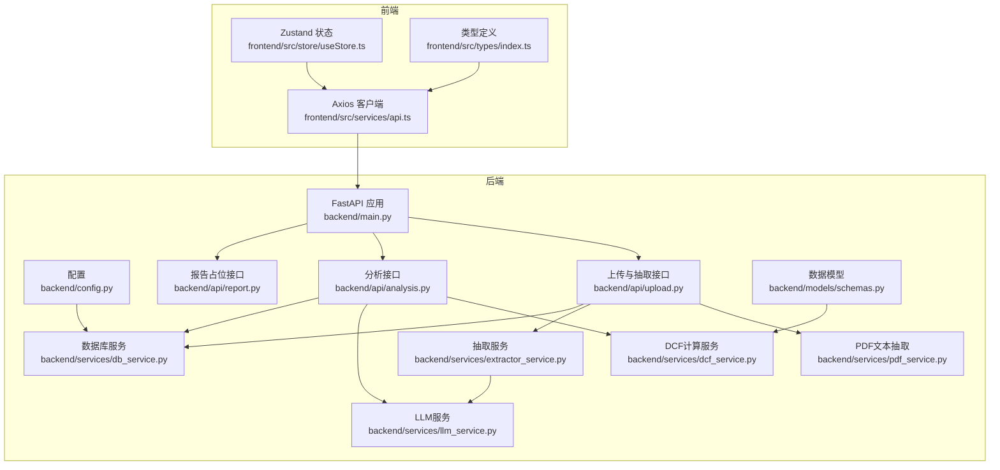
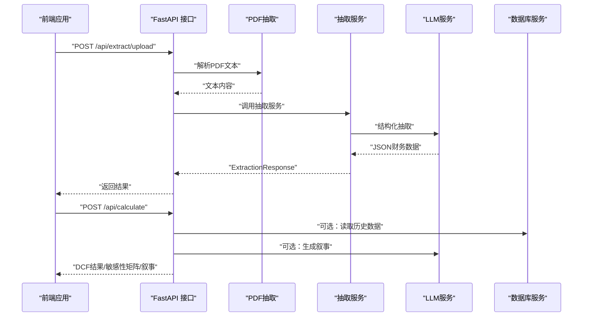
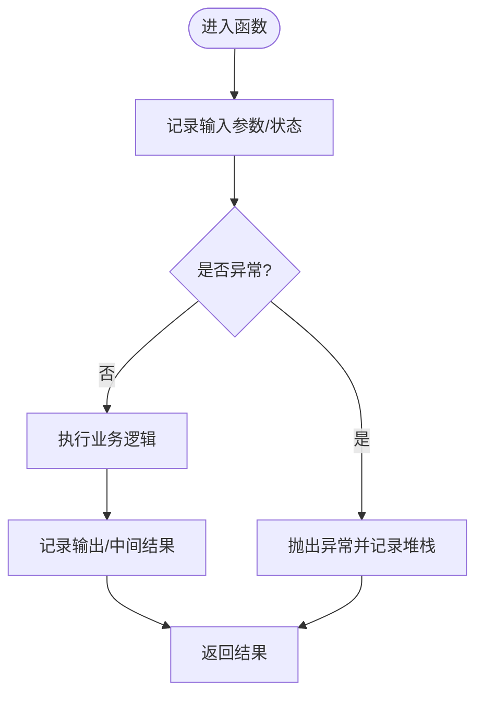
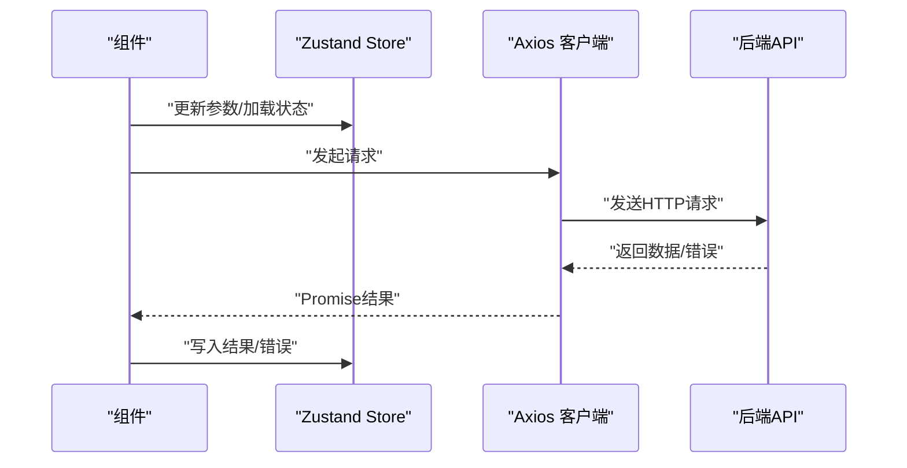
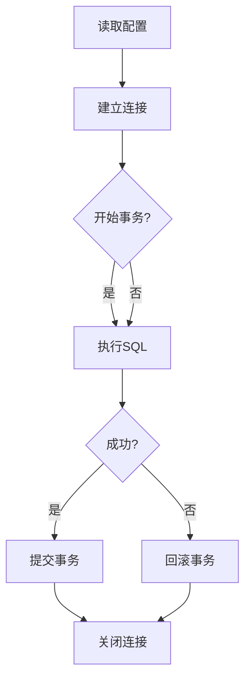
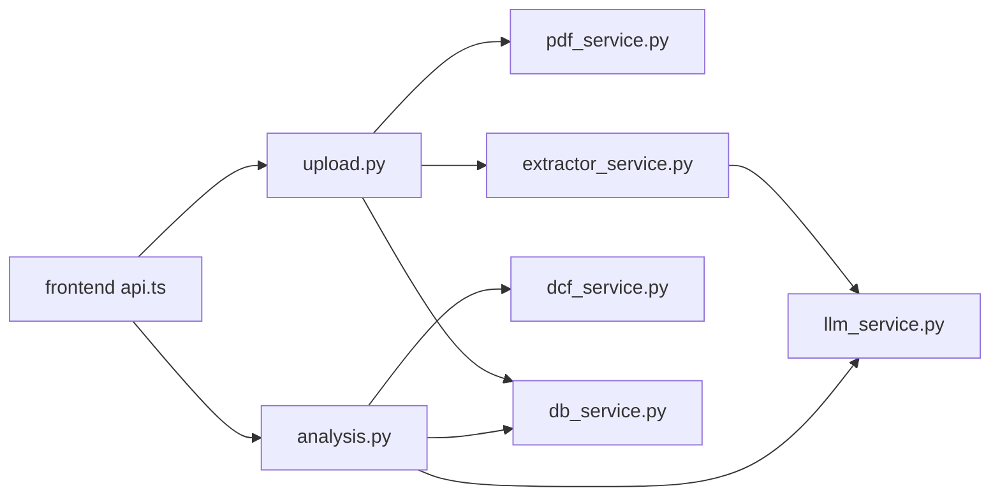

# 调试工具与技巧

<cite>
**本文引用的文件**
- [backend/main.py](file://backend/main.py)
- [backend/config.py](file://backend/config.py)
- [backend/services/db_service.py](file://backend/services/db_service.py)
- [backend/services/dcf_service.py](file://backend/services/dcf_service.py)
- [backend/models/schemas.py](file://backend/models/schemas.py)
- [backend/api/analysis.py](file://backend/api/analysis.py)
- [backend/api/report.py](file://backend/api/report.py)
- [backend/api/upload.py](file://backend/api/upload.py)
- [backend/services/pdf_service.py](file://backend/services/pdf_service.py)
- [backend/services/llm_service.py](file://backend/services/llm_service.py)
- [backend/services/extractor_service.py](file://backend/services/extractor_service.py)
- [backend/init_db.py](file://backend/init_db.py)
- [backend/test_db_connection.py](file://backend/test_db_connection.py)
- [frontend/src/services/api.ts](file://frontend/src/services/api.ts)
- [frontend/src/store/useStore.ts](file://frontend/src/store/useStore.ts)
- [frontend/src/types/index.ts](file://frontend/src/types/index.ts)
</cite>

## 目录
1. [简介](#简介)
2. [项目结构](#项目结构)
3. [核心组件](#核心组件)
4. [架构总览](#架构总览)
5. [详细组件分析](#详细组件分析)
6. [依赖分析](#依赖分析)
7. [性能考虑](#性能考虑)
8. [故障排查指南](#故障排查指南)
9. [结论](#结论)
10. [附录](#附录)

## 简介
本指南面向DCF估值智能体项目的开发与运维人员，系统性介绍后端Python与前端TypeScript的调试方法与技巧，涵盖：
- Python调试：pdb断点调试、IDE断点调试、日志调试、性能分析工具
- TypeScript前端调试：浏览器开发者工具、React DevTools（Zustand）、网络请求监控、状态管理调试
- API接口调试：Postman、curl、Swagger（FastAPI自动生成）测试
- 数据库调试：SQL语句优化、慢查询分析、连接池与事务控制
- 常见问题：内存泄漏检测、并发问题排查、性能瓶颈定位

## 项目结构
项目采用前后端分离架构：
- 后端：FastAPI应用，路由按功能模块拆分，服务层封装业务逻辑，模型层定义Pydantic数据结构
- 前端：Vite + React + TypeScript，使用Zustand进行全局状态管理，Axios封装API调用

图表来源
- [backend/main.py:18-40](file://backend/main.py#L18-L40)
- [backend/api/upload.py:13-55](file://backend/api/upload.py#L13-L55)
- [backend/api/analysis.py:15-45](file://backend/api/analysis.py#L15-L45)
- [backend/services/db_service.py:24-345](file://backend/services/db_service.py#L24-L345)
- [backend/services/dcf_service.py:12-163](file://backend/services/dcf_service.py#L12-L163)
- [backend/services/llm_service.py:70-155](file://backend/services/llm_service.py#L70-L155)
- [backend/services/pdf_service.py:26-68](file://backend/services/pdf_service.py#L26-L68)
- [backend/services/extractor_service.py:27-67](file://backend/services/extractor_service.py#L27-L67)
- [backend/models/schemas.py:8-101](file://backend/models/schemas.py#L8-L101)
- [backend/config.py:10-22](file://backend/config.py#L10-L22)
- [frontend/src/services/api.ts:11-81](file://frontend/src/services/api.ts#L11-L81)
- [frontend/src/store/useStore.ts:23-74](file://frontend/src/store/useStore.ts#L23-L74)
- [frontend/src/types/index.ts:4-128](file://frontend/src/types/index.ts#L4-L128)

章节来源
- [backend/main.py:18-40](file://backend/main.py#L18-L40)
- [frontend/src/services/api.ts:11-81](file://frontend/src/services/api.ts#L11-L81)

## 核心组件
- FastAPI应用与中间件：CORS跨域、健康检查端点
- 配置模块：读取环境变量，提供数据库与LLM服务所需参数
- 数据库服务：连接管理、事务回滚、多张财务报表写入与查询
- DCF服务：WACC计算、FCF预测、终值计算、敏感性分析
- 抽取链路：PDF文本抽取 → LLM抽取 → 结构化解析 → 返回前端
- 前端API封装：Axios拦截错误、统一超时、REST调用
- 全局状态：Zustand Store集中管理参数、结果、加载与错误

章节来源
- [backend/config.py:10-22](file://backend/config.py#L10-L22)
- [backend/services/db_service.py:24-345](file://backend/services/db_service.py#L24-L345)
- [backend/services/dcf_service.py:12-163](file://backend/services/dcf_service.py#L12-L163)
- [backend/services/llm_service.py:70-155](file://backend/services/llm_service.py#L70-L155)
- [backend/services/pdf_service.py:26-68](file://backend/services/pdf_service.py#L26-L68)
- [backend/services/extractor_service.py:27-67](file://backend/services/extractor_service.py#L27-L67)
- [frontend/src/services/api.ts:11-81](file://frontend/src/services/api.ts#L11-L81)
- [frontend/src/store/useStore.ts:23-74](file://frontend/src/store/useStore.ts#L23-L74)

## 架构总览
后端通过FastAPI暴露REST接口，前端通过Axios发起请求；LLM服务负责抽取与叙事生成；数据库服务负责持久化财务数据。

图表来源
- [backend/api/upload.py:16-55](file://backend/api/upload.py#L16-L55)
- [backend/services/pdf_service.py:26-68](file://backend/services/pdf_service.py#L26-L68)
- [backend/services/extractor_service.py:27-67](file://backend/services/extractor_service.py#L27-L67)
- [backend/services/llm_service.py:94-123](file://backend/services/llm_service.py#L94-L123)
- [backend/api/analysis.py:18-45](file://backend/api/analysis.py#L18-L45)
- [backend/services/db_service.py:234-341](file://backend/services/db_service.py#L234-L341)
- [frontend/src/services/api.ts:28-80](file://frontend/src/services/api.ts#L28-L80)

## 详细组件分析

### 后端调试要点（Python）
- pdb断点调试
  - 在关键函数入口添加断点，逐步执行，观察变量变化
  - 示例路径：[backend/services/dcf_service.py:85](file://backend/services/dcf_service.py#L85-L121)、[backend/services/llm_service.py:94](file://backend/services/llm_service.py#L94-L123)
- IDE断点调试
  - 使用PyCharm/VSCode在FastAPI路由与服务函数设置断点，配合HTTP客户端验证
  - 关注异常处理分支，确保HTTP 500错误被正确包装
  - 示例路径：[backend/api/analysis.py:18-45](file://backend/api/analysis.py#L18-L45)
- 日志调试
  - 利用标准库logging输出关键事件与耗时，便于定位问题
  - 示例路径：[backend/services/pdf_service.py:6](file://backend/services/pdf_service.py#L6-L68)、[backend/services/llm_service.py:12](file://backend/services/llm_service.py#L12-L155)
- 性能分析
  - 使用cProfile/line_profiler定位热点函数，结合内存分析工具检测泄漏
  - 关注PDF解析、LLM调用、数据库批量插入等IO密集型操作
  - 示例路径：[backend/services/pdf_service.py:26-68](file://backend/services/pdf_service.py#L26-L68)、[backend/services/db_service.py:54-341](file://backend/services/db_service.py#L54-L341)

图表来源
- [backend/services/llm_service.py:117-122](file://backend/services/llm_service.py#L117-L122)
- [backend/services/pdf_service.py:30-68](file://backend/services/pdf_service.py#L30-L68)

章节来源
- [backend/services/dcf_service.py:12-163](file://backend/services/dcf_service.py#L12-L163)
- [backend/api/analysis.py:18-45](file://backend/api/analysis.py#L18-L45)
- [backend/services/pdf_service.py:6-68](file://backend/services/pdf_service.py#L6-L68)
- [backend/services/llm_service.py:70-155](file://backend/services/llm_service.py#L70-L155)

### 前端调试要点（TypeScript）
- 浏览器开发者工具
  - Network面板：查看请求URL、Headers、Body、响应时间与状态码
  - Console面板：捕获Axios错误与运行时异常
  - Elements面板：检查组件渲染与Props传递
  - 示例路径：[frontend/src/services/api.ts:11-81](file://frontend/src/services/api.ts#L11-L81)
- React DevTools（Zustand）
  - 使用Zustand Devtools（如Redux DevTools扩展）观察状态变更轨迹
  - 关注financialData、dcfParameters、dcfResult、loading、error等字段
  - 示例路径：[frontend/src/store/useStore.ts:23-74](file://frontend/src/store/useStore.ts#L23-L74)
- 网络请求监控
  - 统一超时与错误处理，区分服务端错误与网络错误
  - 示例路径：[frontend/src/services/api.ts:17-26](file://frontend/src/services/api.ts#L17-L26)
- 状态管理调试
  - 使用默认参数与重置逻辑验证边界条件
  - 示例路径：[frontend/src/store/useStore.ts:11-21](file://frontend/src/store/useStore.ts#L11-L21)

图表来源
- [frontend/src/store/useStore.ts:23-74](file://frontend/src/store/useStore.ts#L23-L74)
- [frontend/src/services/api.ts:28-80](file://frontend/src/services/api.ts#L28-L80)

章节来源
- [frontend/src/services/api.ts:11-81](file://frontend/src/services/api.ts#L11-L81)
- [frontend/src/store/useStore.ts:23-74](file://frontend/src/store/useStore.ts#L23-L74)

### API接口调试方法
- Postman
  - 导入后端自动生成的OpenAPI文档（FastAPI自动提供），或直接构造请求
  - 健康检查：GET /api/health
  - PDF上传与抽取：POST /api/extract/upload（multipart/form-data）
  - 文本抽取：POST /api/extract/text（JSON）
  - DCF计算：POST /api/calculate（CalculateRequest）
  - 敏感性分析：POST /api/sensitivity（CalculateRequest）
  - 叙述生成：POST /api/narrative（NarrativeRequest）
- curl示例
  - 健康检查：curl http://localhost:8000/api/health
  - PDF上传：curl -X POST "http://localhost:8000/api/extract/upload" -F "file=@/path/to/report.pdf"
  - 计算DCF：curl -X POST "http://localhost:8000/api/calculate" -H "Content-Type: application/json" -d '{}'
- Swagger/OpenAPI
  - 启动后端后访问 http://localhost:8000/docs 查看交互式API文档

章节来源
- [backend/main.py:37-40](file://backend/main.py#L37-L40)
- [backend/api/upload.py:16-55](file://backend/api/upload.py#L16-L55)
- [backend/api/analysis.py:18-45](file://backend/api/analysis.py#L18-L45)
- [backend/api/report.py:8-12](file://backend/api/report.py#L8-L12)

### 数据库查询调试
- 连接与初始化
  - 使用诊断脚本验证连接与权限：[backend/test_db_connection.py:22-72](file://backend/test_db_connection.py#L22-L72)
  - 初始化数据库与表结构：[backend/init_db.py:172-219](file://backend/init_db.py#L172-L219)
- SQL优化与慢查询
  - 关注多表关联查询与重复键约束（unique联合索引）
  - 示例路径：[backend/services/db_service.py:234-341](file://backend/services/db_service.py#L234-L341)
- 连接池与事务
  - 单实例连接管理，必要时引入连接池（如aiohttp-pool/pymysql-pool）
  - 明确事务边界与回滚策略，避免长事务阻塞

图表来源
- [backend/config.py:10-22](file://backend/config.py#L10-L22)
- [backend/services/db_service.py:30-52](file://backend/services/db_service.py#L30-L52)
- [backend/services/db_service.py:54-198](file://backend/services/db_service.py#L54-L198)

章节来源
- [backend/test_db_connection.py:22-183](file://backend/test_db_connection.py#L22-L183)
- [backend/init_db.py:68-170](file://backend/init_db.py#L68-L170)
- [backend/services/db_service.py:24-345](file://backend/services/db_service.py#L24-L345)

## 依赖分析
- 后端模块耦合
  - API层仅依赖服务层与模型层，职责清晰
  - 服务层依赖配置与数据库，LLM服务独立于业务流程
- 前后端依赖
  - 前端通过Axios与后端解耦，类型定义保持一致
- 外部依赖
  - FastAPI、Pydantic、pymysql、pdfplumber、OpenAI异步客户端

图表来源
- [backend/api/upload.py:16-55](file://backend/api/upload.py#L16-L55)
- [backend/api/analysis.py:18-45](file://backend/api/analysis.py#L18-L45)
- [backend/services/pdf_service.py:26-68](file://backend/services/pdf_service.py#L26-L68)
- [backend/services/extractor_service.py:27-67](file://backend/services/extractor_service.py#L27-L67)
- [backend/services/llm_service.py:70-155](file://backend/services/llm_service.py#L70-L155)
- [backend/services/dcf_service.py:12-163](file://backend/services/dcf_service.py#L12-L163)
- [backend/services/db_service.py:24-345](file://backend/services/db_service.py#L24-L345)
- [frontend/src/services/api.ts:11-81](file://frontend/src/services/api.ts#L11-L81)

章节来源
- [backend/api/upload.py:16-55](file://backend/api/upload.py#L16-L55)
- [backend/api/analysis.py:18-45](file://backend/api/analysis.py#L18-L45)
- [frontend/src/services/api.ts:11-81](file://frontend/src/services/api.ts#L11-L81)

## 性能考虑
- I/O密集优化
  - PDF文本抽取限制最大字符数，避免超大文档导致内存压力
  - LLM调用设置合理超时与温度参数，减少无效重试
- 数据库性能
  - 使用唯一键约束避免重复写入，减少索引冲突
  - 分页与范围查询配合日期索引，提升历史价格检索效率
- 前端性能
  - 使用Zustand替代重型状态库，减少不必要的重渲染
  - 对长列表（投影/敏感性矩阵）采用虚拟化或分页展示

## 故障排查指南
- 后端常见问题
  - 连接失败：检查MySQL主机、端口、用户与密码，参考诊断脚本
    - 路径：[backend/test_db_connection.py:22-72](file://backend/test_db_connection.py#L22-L72)
  - 写入异常：确认唯一键冲突与事务回滚逻辑
    - 路径：[backend/services/db_service.py:54-198](file://backend/services/db_service.py#L54-L198)
  - LLM解析失败：检查JSON提取正则与日志输出
    - 路径：[backend/services/llm_service.py:79-93](file://backend/services/llm_service.py#L79-L93)
- 前端常见问题
  - 请求超时：调整Axios超时与重试策略
    - 路径：[frontend/src/services/api.ts:11-15](file://frontend/src/services/api.ts#L11-L15)
  - 状态不更新：检查Zustand action是否正确触发
    - 路径：[frontend/src/store/useStore.ts:35-54](file://frontend/src/store/useStore.ts#L35-L54)
- API调试建议
  - 使用Postman或curl快速验证端点可用性与响应格式
  - 健康检查端点用于快速判断服务状态
    - 路径：[backend/main.py:37-40](file://backend/main.py#L37-L40)

章节来源
- [backend/test_db_connection.py:73-183](file://backend/test_db_connection.py#L73-L183)
- [backend/services/db_service.py:24-345](file://backend/services/db_service.py#L24-L345)
- [backend/services/llm_service.py:79-123](file://backend/services/llm_service.py#L79-L123)
- [frontend/src/services/api.ts:11-81](file://frontend/src/services/api.ts#L11-L81)
- [frontend/src/store/useStore.ts:23-74](file://frontend/src/store/useStore.ts#L23-L74)
- [backend/main.py:37-40](file://backend/main.py#L37-L40)

## 结论
通过规范的日志与断点调试、完善的API文档与错误处理、以及数据库与LLM调用的可观测性设计，DCF估值智能体项目可在开发与运维阶段高效定位问题并持续优化性能。建议团队在CI中集成数据库初始化与连接测试，前端引入状态快照与网络面板监控，后端启用性能剖析与慢查询追踪。

## 附录
- 快速启动与健康检查
  - 启动后端：uvicorn运行main.py中的FastAPI应用
  - 健康检查：GET /api/health
- 数据模型参考
  - 财务数据、DCF参数、投影、结果与敏感性矩阵
  - 路径：[backend/models/schemas.py:8-101](file://backend/models/schemas.py#L8-L101)、[frontend/src/types/index.ts:4-128](file://frontend/src/types/index.ts#L4-L128)