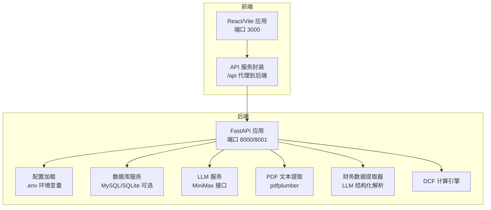
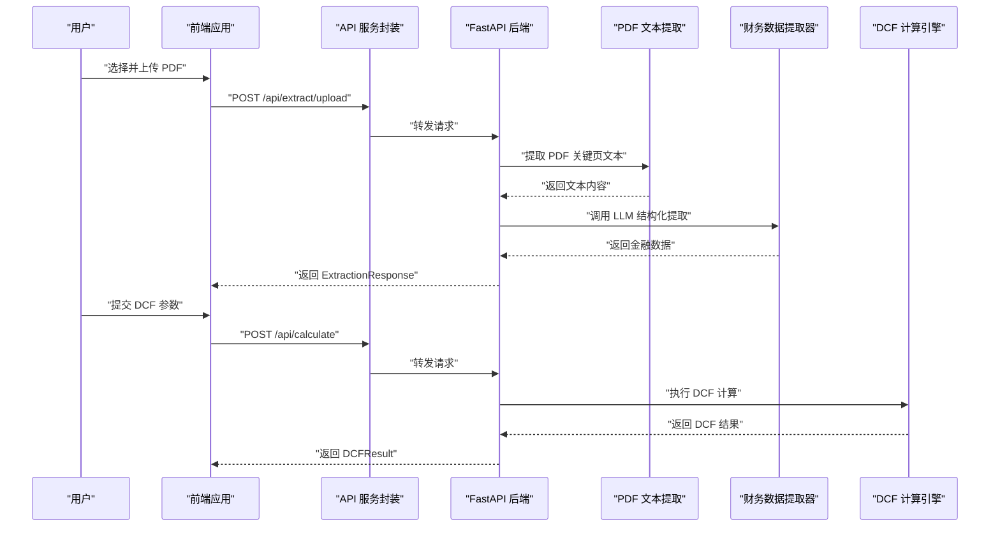
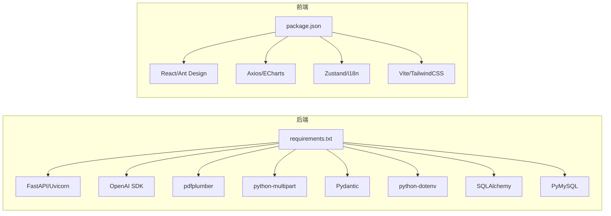

# 快速开始

<cite>
**本文引用的文件**
- [README.md](file://README.md)
- [backend/requirements.txt](file://backend/requirements.txt)
- [frontend/package.json](file://frontend/package.json)
- [backend/config.py](file://backend/config.py)
- [backend/main.py](file://backend/main.py)
- [backend/MYSQL_SETUP_GUIDE.md](file://backend/MYSQL_SETUP_GUIDE.md)
- [backend/DATABASE_QUICK_REFERENCE.md](file://backend/DATABASE_QUICK_REFERENCE.md)
- [backend/api/upload.py](file://backend/api/upload.py)
- [backend/api/analysis.py](file://backend/api/analysis.py)
- [frontend/src/services/api.ts](file://frontend/src/services/api.ts)
- [frontend/vite.config.ts](file://frontend/vite.config.ts)
- [backend/services/pdf_service.py](file://backend/services/pdf_service.py)
- [backend/services/extractor_service.py](file://backend/services/extractor_service.py)
- [backend/models/schemas.py](file://backend/models/schemas.py)
- [backend/examples/db_usage_example.py](file://backend/examples/db_usage_example.py)
</cite>

## 目录
1. [简介](#简介)
2. [项目结构](#项目结构)
3. [核心组件](#核心组件)
4. [架构总览](#架构总览)
5. [详细组件分析](#详细组件分析)
6. [依赖分析](#依赖分析)
7. [性能考虑](#性能考虑)
8. [故障排查指南](#故障排查指南)
9. [结论](#结论)
10. [附录](#附录)

## 简介
本指南面向首次接触 DCF 估值智能体项目的开发者，帮助你在本地快速完成环境准备、依赖安装、数据库初始化、前后端开发服务器启动，并演示从文件上传到结果展示的完整流程。项目采用 Python 后端（FastAPI）、TypeScript 前端（React/Vite），并通过 MiniMax 的 LLM 接口完成财务数据抽取与 DCF 计算。

## 项目结构
- 后端（Python）：FastAPI 应用、API 路由、服务层（LLM、PDF、提取器、DCF）、数据库服务与模型定义。
- 前端（TypeScript/React）：页面组件、UI 组件、状态管理、国际化、图表与 API 服务封装。
- 数据库：MySQL（可选 Docker 快速部署）；提供初始化脚本与使用示例。

**图表来源**
- [backend/main.py:18-39](file://backend/main.py#L18-L39)
- [frontend/vite.config.ts:12-20](file://frontend/vite.config.ts#L12-L20)
- [backend/config.py:10-21](file://backend/config.py#L10-L21)
- [backend/services/pdf_service.py:26-67](file://backend/services/pdf_service.py#L26-L67)
- [backend/services/extractor_service.py:27-66](file://backend/services/extractor_service.py#L27-L66)
- [backend/api/upload.py:16-54](file://backend/api/upload.py#L16-L54)
- [backend/api/analysis.py:18-44](file://backend/api/analysis.py#L18-L44)

**章节来源**
- [README.md:77-107](file://README.md#L77-L107)

## 核心组件
- 后端应用入口与路由挂载：FastAPI 应用在生命周期内确保上传目录存在，并注册上传、分析、报告相关路由。
- 配置模块：统一加载 .env 环境变量，提供 MiniMax API 配置与 MySQL 连接参数。
- 前端开发服务器：Vite 默认监听 3000 端口，并通过代理将 /api 请求转发至后端。
- 数据库：提供初始化脚本与使用示例，支持 MySQL 或可选 SQLite 方案。

**章节来源**
- [backend/main.py:12-39](file://backend/main.py#L12-L39)
- [backend/config.py:10-21](file://backend/config.py#L10-L21)
- [frontend/vite.config.ts:12-20](file://frontend/vite.config.ts#L12-L20)

## 架构总览
下图展示了从前端上传 PDF 到后端解析、LLM 提取、DCF 计算与结果返回的整体流程。

**图表来源**
- [frontend/src/services/api.ts:28-58](file://frontend/src/services/api.ts#L28-L58)
- [backend/api/upload.py:16-54](file://backend/api/upload.py#L16-L54)
- [backend/services/pdf_service.py:26-67](file://backend/services/pdf_service.py#L26-L67)
- [backend/services/extractor_service.py:27-66](file://backend/services/extractor_service.py#L27-L66)
- [backend/api/analysis.py:18-44](file://backend/api/analysis.py#L18-L44)

## 详细组件分析

### 后端 FastAPI 应用
- 生命周期钩子：在应用启动时创建上传目录，避免运行时报错。
- CORS：允许任意来源跨域访问，便于前端开发调试。
- 路由：统一前缀 /api，挂载上传与分析相关接口。

**章节来源**
- [backend/main.py:12-39](file://backend/main.py#L12-L39)

### 配置与环境变量
- MiniMax API：需设置 MINIMAX_API_KEY；基础 URL 与模型名在配置中固定。
- MySQL：支持通过环境变量配置主机、端口、用户名、密码、数据库名；上传目录路径在配置中定义。
- .env 示例：复制示例文件并在后端目录中填写 API Key。

**章节来源**
- [backend/config.py:10-21](file://backend/config.py#L10-L21)
- [README.md:36-46](file://README.md#L36-L46)

### 前端开发服务器与代理
- 端口：3000
- 代理：将 /api 请求转发至后端（默认 8001），便于前后端分离开发。
- 依赖：React、Ant Design、ECharts、Zustand、i18n 等。

**章节来源**
- [frontend/vite.config.ts:12-20](file://frontend/vite.config.ts#L12-L20)
- [frontend/package.json:6-35](file://frontend/package.json#L6-L35)

### PDF 文本提取与财务数据提取
- PDF 提取：按关键词匹配筛选关键财务页，限制最大文本长度，提升后续 LLM 处理效率。
- 财务数据提取：调用 LLM 将非结构化文本转为结构化 FinancialData，并进行数值安全转换。

**章节来源**
- [backend/services/pdf_service.py:26-67](file://backend/services/pdf_service.py#L26-L67)
- [backend/services/extractor_service.py:27-66](file://backend/services/extractor_service.py#L27-L66)

### DCF 计算与敏感性分析
- 接口：计算 DCF、生成敏感性矩阵、生成 AI 叙述。
- 参数：支持投影年限、营收增长率、终端增长率、税率、资本支出比率、折旧摊销比率、营运资本比率、WACC 等。

**章节来源**
- [backend/api/analysis.py:18-44](file://backend/api/analysis.py#L18-L44)
- [backend/models/schemas.py:32-42](file://backend/models/schemas.py#L32-L42)

### 数据库准备与使用
- 初始化：首次运行初始化脚本创建所需表。
- 连接测试：提供测试脚本验证连接。
- 快速参考：包含常用插入与查询示例，以及表结构说明。
- Docker 快速部署：一键启动 MySQL 容器并初始化数据库。

**章节来源**
- [backend/MYSQL_SETUP_GUIDE.md:134-156](file://backend/MYSQL_SETUP_GUIDE.md#L134-L156)
- [backend/DATABASE_QUICK_REFERENCE.md:5-20](file://backend/DATABASE_QUICK_REFERENCE.md#L5-L20)
- [backend/examples/db_usage_example.py:145-170](file://backend/examples/db_usage_example.py#L145-L170)

## 依赖分析
- 后端依赖：FastAPI、Uvicorn、OpenAI 兼容 SDK、HTTP 客户端、PDF 解析、表单上传、Pydantic、dotenv、MySQL 驱动、SQLAlchemy。
- 前端依赖：React、Ant Design、Axios、ECharts、Zustand、i18n、Vite、TailwindCSS 等。

**图表来源**
- [backend/requirements.txt:1-11](file://backend/requirements.txt#L1-L11)
- [frontend/package.json:11-35](file://frontend/package.json#L11-L35)

**章节来源**
- [backend/requirements.txt:1-11](file://backend/requirements.txt#L1-L11)
- [frontend/package.json:11-35](file://frontend/package.json#L11-L35)

## 性能考虑
- PDF 文本截断：默认限制最大提取字符数，避免 LLM 输入过长导致延迟与成本上升。
- 关键页筛选：根据财务关键词排序选取最相关页面，减少噪声。
- 上传目录清理：上传完成后删除临时文件，避免磁盘占用。
- 前端代理超时：API 调用设置合理超时，避免长时间阻塞。

**章节来源**
- [backend/services/pdf_service.py:44-58](file://backend/services/pdf_service.py#L44-L58)
- [backend/api/upload.py:40-43](file://backend/api/upload.py#L40-L43)

## 故障排查指南
- 健康检查：访问后端健康接口确认服务可用。
- 端口冲突：前端默认 3000，后端默认 8000/8001；如被占用请调整配置。
- CORS 问题：后端已开放任意来源，若仍跨域失败，检查代理配置。
- 数据库连接失败：参考 MySQL 设置指南，检查服务状态、端口、密码与权限。
- 权限不足：为 root 用户授予必要权限并刷新。
- 字符集问题：确保数据库使用 utf8mb4。
- Docker 快速启动：一键运行 MySQL 容器并初始化数据库。
- 连接测试与初始化：使用提供的测试脚本与初始化脚本验证环境。

**章节来源**
- [backend/main.py:37-39](file://backend/main.py#L37-L39)
- [frontend/vite.config.ts:12-20](file://frontend/vite.config.ts#L12-L20)
- [backend/MYSQL_SETUP_GUIDE.md:173-214](file://backend/MYSQL_SETUP_GUIDE.md#L173-L214)
- [backend/DATABASE_QUICK_REFERENCE.md:263-283](file://backend/DATABASE_QUICK_REFERENCE.md#L263-L283)

## 结论
通过本指南，你可以在本地快速完成环境准备、依赖安装与数据库初始化，并启动前后端开发服务器。随后即可体验从 PDF 上传到 DCF 结果展示的完整流程。遇到问题时，可依据故障排查章节逐步定位与解决。

## 附录

### 环境要求
- Python：3.11+
- Node.js：与项目中前端依赖兼容（详见 package.json）
- MySQL：可选，支持 Docker 快速部署；或可选 SQLite（需自行替换配置与服务）

**章节来源**
- [README.md:18-25](file://README.md#L18-L25)
- [backend/MYSQL_SETUP_GUIDE.md:109-133](file://backend/MYSQL_SETUP_GUIDE.md#L109-L133)

### 依赖安装步骤
- 后端 Python 包安装
  - 进入后端目录，安装依赖：[backend/requirements.txt:1-11](file://backend/requirements.txt#L1-L11)
- 前端 Node.js 包安装
  - 进入前端目录，安装依赖：[frontend/package.json:6-10](file://frontend/package.json#L6-L10)

**章节来源**
- [README.md:48-59](file://README.md#L48-L59)

### 环境变量配置指南
- 复制示例文件并填写 API Key：[README.md:36-46](file://README.md#L36-L46)
- 配置项
  - MiniMax API：MINIMAX_API_KEY
  - MySQL：MYSQL_HOST、MYSQL_USER、MYSQL_PASSWORD、MYSQL_PORT、MYSQL_DATABASE
  - 上传目录：由配置模块定义，应用启动时自动创建

**章节来源**
- [backend/config.py:10-21](file://backend/config.py#L10-L21)
- [README.md:36-46](file://README.md#L36-L46)

### 开发服务器启动流程
- 启动后端（FastAPI）
  - 在项目根目录运行：[README.md:61-73](file://README.md#L61-L73)
- 启动前端（Vite）
  - 在 frontend 目录运行：[README.md:69-73](file://README.md#L69-L73)
- 访问地址
  - 前端：http://localhost:3000

**章节来源**
- [README.md:61-75](file://README.md#L61-L75)
- [frontend/vite.config.ts:12-20](file://frontend/vite.config.ts#L12-L20)

### 基本使用示例（从上传到结果展示）
- 上传 PDF
  - 前端调用上传接口：[frontend/src/services/api.ts:28-40](file://frontend/src/services/api.ts#L28-L40)
  - 后端路由与逻辑：[backend/api/upload.py:16-43](file://backend/api/upload.py#L16-L43)
  - PDF 文本提取：[backend/services/pdf_service.py:26-67](file://backend/services/pdf_service.py#L26-L67)
- LLM 财务数据提取
  - 调用提取接口：[frontend/src/services/api.ts:42-49](file://frontend/src/services/api.ts#L42-L49)
  - 提取器实现：[backend/services/extractor_service.py:27-66](file://backend/services/extractor_service.py#L27-L66)
- 运行 DCF 计算
  - 前端调用计算接口：[frontend/src/services/api.ts:51-58](file://frontend/src/services/api.ts#L51-L58)
  - 后端路由与 DCF 引擎：[backend/api/analysis.py:18-23](file://backend/api/analysis.py#L18-L23)
- 敏感性分析与叙述生成
  - 敏感性分析：[frontend/src/services/api.ts:60-69](file://frontend/src/services/api.ts#L60-L69)
  - 叙述生成：[frontend/src/services/api.ts:71-80](file://frontend/src/services/api.ts#L71-L80)

**章节来源**
- [frontend/src/services/api.ts:28-80](file://frontend/src/services/api.ts#L28-L80)
- [backend/api/upload.py:16-54](file://backend/api/upload.py#L16-L54)
- [backend/services/pdf_service.py:26-67](file://backend/services/pdf_service.py#L26-L67)
- [backend/services/extractor_service.py:27-66](file://backend/services/extractor_service.py#L27-L66)
- [backend/api/analysis.py:18-44](file://backend/api/analysis.py#L18-L44)

### 常见问题排查与解决方案
- 健康检查失败
  - 访问后端健康接口确认服务状态：[backend/main.py:37-39](file://backend/main.py#L37-L39)
- 端口被占用
  - 前端：3000；后端：8000/8001；请调整配置或释放端口
- 数据库连接失败
  - 按指南检查服务状态、端口、密码与权限：[backend/MYSQL_SETUP_GUIDE.md:173-214](file://backend/MYSQL_SETUP_GUIDE.md#L173-L214)
- 初始化与示例
  - 初始化数据库与运行示例：[backend/DATABASE_QUICK_REFERENCE.md:5-20](file://backend/DATABASE_QUICK_REFERENCE.md#L5-L20)
  - 示例脚本：[backend/examples/db_usage_example.py:145-170](file://backend/examples/db_usage_example.py#L145-L170)

**章节来源**
- [backend/main.py:37-39](file://backend/main.py#L37-L39)
- [backend/MYSQL_SETUP_GUIDE.md:173-214](file://backend/MYSQL_SETUP_GUIDE.md#L173-L214)
- [backend/DATABASE_QUICK_REFERENCE.md:5-20](file://backend/DATABASE_QUICK_REFERENCE.md#L5-L20)
- [backend/examples/db_usage_example.py:145-170](file://backend/examples/db_usage_example.py#L145-L170)