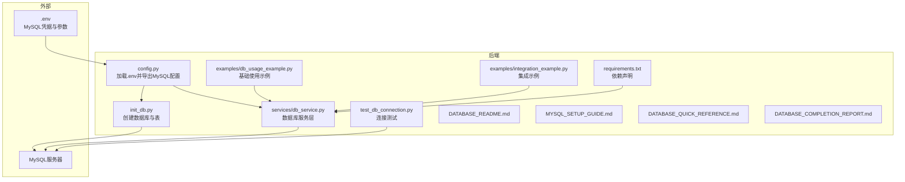
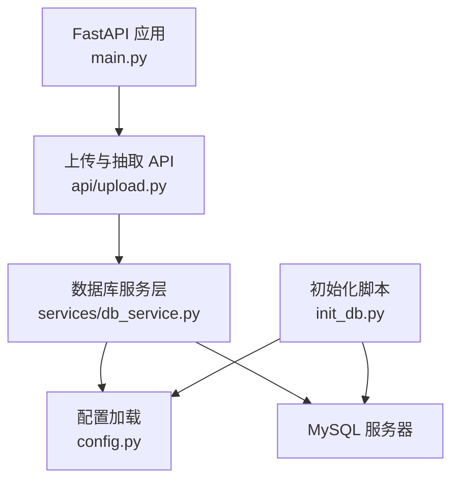
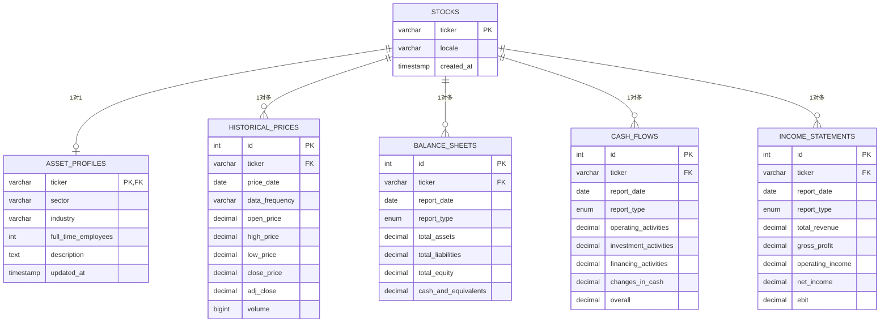
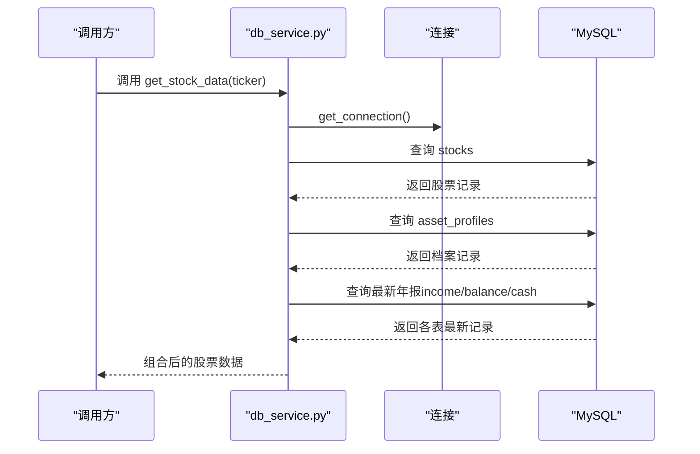
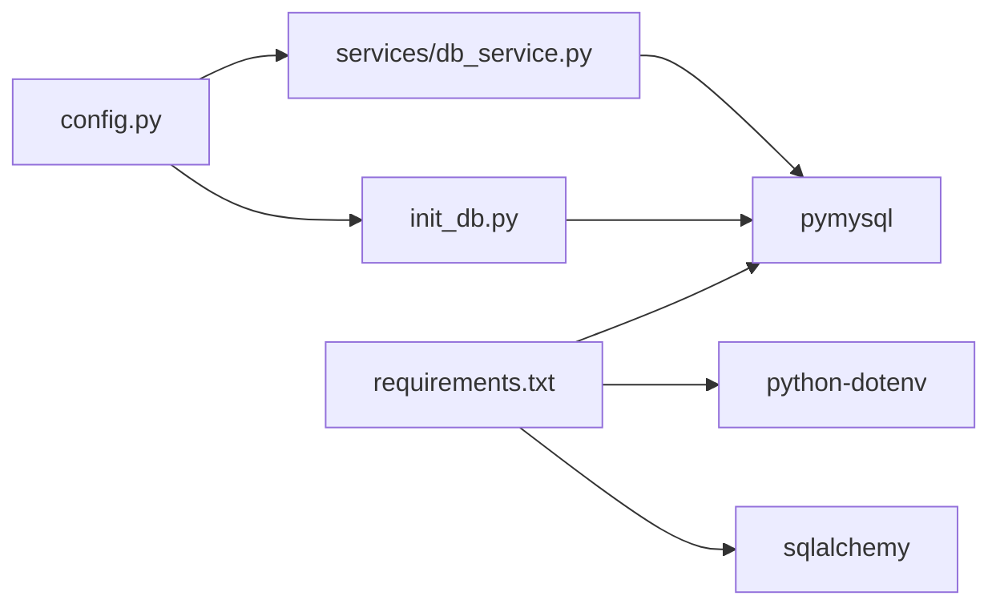

# 数据库设计

<cite>
**本文引用的文件**
- [DATABASE_README.md](file://backend/DATABASE_README.md)
- [MYSQL_SETUP_GUIDE.md](file://backend/MYSQL_SETUP_GUIDE.md)
- [DATABASE_QUICK_REFERENCE.md](file://backend/DATABASE_QUICK_REFERENCE.md)
- [DATABASE_COMPLETION_REPORT.md](file://backend/DATABASE_COMPLETION_REPORT.md)
- [config.py](file://backend/config.py)
- [init_db.py](file://backend/init_db.py)
- [db_service.py](file://backend/services/db_service.py)
- [test_db_connection.py](file://backend/test_db_connection.py)
- [db_usage_example.py](file://backend/examples/db_usage_example.py)
- [integration_example.py](file://backend/examples/integration_example.py)
- [requirements.txt](file://backend/requirements.txt)
- [schemas.py](file://backend/models/schemas.py)
- [main.py](file://backend/main.py)
- [upload.py](file://backend/api/upload.py)
</cite>

## 目录
1. [简介](#简介)
2. [项目结构](#项目结构)
3. [核心组件](#核心组件)
4. [架构总览](#架构总览)
5. [详细组件分析](#详细组件分析)
6. [依赖分析](#依赖分析)
7. [性能考虑](#性能考虑)
8. [故障排查指南](#故障排查指南)
9. [结论](#结论)
10. [附录](#附录)

## 简介
本文件面向DCF估值智能体项目的数据库设计，围绕MySQL数据库的配置与连接、表结构设计、查询优化、运维操作、安全与监控等方面进行全面说明。文档基于后端仓库中的数据库相关文件与示例，提供可落地的实施建议与最佳实践。

## 项目结构
后端数据库相关的核心文件组织如下：
- 配置与连接：config.py、.env（环境变量）
- 初始化与建库建表：init_db.py
- 数据库服务层：services/db_service.py
- 连接测试与示例：test_db_connection.py、examples/db_usage_example.py、examples/integration_example.py
- 文档与参考：DATABASE_README.md、MYSQL_SETUP_GUIDE.md、DATABASE_QUICK_REFERENCE.md、DATABASE_COMPLETION_REPORT.md
- 依赖声明：requirements.txt
- API与前端：main.py、api/upload.py（与数据库交互的API入口）

图表来源
- [config.py:1-22](file://backend/config.py#L1-L22)
- [init_db.py:1-219](file://backend/init_db.py#L1-L219)
- [db_service.py:1-345](file://backend/services/db_service.py#L1-L345)
- [test_db_connection.py:1-183](file://backend/test_db_connection.py#L1-L183)
- [db_usage_example.py:1-170](file://backend/examples/db_usage_example.py#L1-L170)
- [integration_example.py:1-346](file://backend/examples/integration_example.py#L1-L346)
- [requirements.txt:1-11](file://backend/requirements.txt#L1-L11)

章节来源
- [DATABASE_README.md:1-168](file://backend/DATABASE_README.md#L1-L168)
- [MYSQL_SETUP_GUIDE.md:1-214](file://backend/MYSQL_SETUP_GUIDE.md#L1-L214)
- [DATABASE_QUICK_REFERENCE.md:1-290](file://backend/DATABASE_QUICK_REFERENCE.md#L1-L290)
- [DATABASE_COMPLETION_REPORT.md:1-229](file://backend/DATABASE_COMPLETION_REPORT.md#L1-L229)

## 核心组件
- MySQL配置加载：config.py从.env读取主机、用户、密码、端口、数据库名等关键参数，并提供给其他模块使用。
- 初始化脚本：init_db.py负责创建数据库与6张核心表（stocks、asset_profiles、historical_prices、balance_sheets、cash_flows、income_statements），并设置外键与唯一约束。
- 数据库服务层：db_service.py封装连接、事务、CRUD与查询方法，提供统一的数据库访问接口。
- 连接测试：test_db_connection.py用于诊断连接与权限问题，验证数据库可用性。
- 示例与集成：db_usage_example.py展示基础数据存取；integration_example.py展示与DCF分析的集成流程与指标计算。

章节来源
- [config.py:14-21](file://backend/config.py#L14-L21)
- [init_db.py:68-161](file://backend/init_db.py#L68-L161)
- [db_service.py:24-345](file://backend/services/db_service.py#L24-L345)
- [test_db_connection.py:22-183](file://backend/test_db_connection.py#L22-L183)
- [db_usage_example.py:15-170](file://backend/examples/db_usage_example.py#L15-L170)
- [integration_example.py:16-346](file://backend/examples/integration_example.py#L16-L346)

## 架构总览
下图展示了数据库层在系统中的位置与交互关系：

图表来源
- [main.py:18-40](file://backend/main.py#L18-L40)
- [upload.py:16-55](file://backend/api/upload.py#L16-L55)
- [db_service.py:15-21](file://backend/services/db_service.py#L15-L21)
- [init_db.py:13-19](file://backend/init_db.py#L13-L19)
- [config.py:14-21](file://backend/config.py#L14-L21)

## 详细组件分析

### 数据库配置与连接
- 连接参数来源：config.py从.env读取MYSQL_HOST、MYSQL_USER、MYSQL_PASSWORD、MYSQL_PORT、MYSQL_DATABASE。
- 连接字符集：db_service.py与init_db.py均指定utf8mb4字符集，确保表情符号与多字节字符支持。
- 连接生命周期：db_service.py维护单连接实例，提供获取与关闭方法；test_db_connection.py用于连通性与权限验证。
- 依赖要求：requirements.txt包含pymysql与sqlalchemy，前者用于底层连接，后者可用于ORM扩展。

章节来源
- [config.py:14-21](file://backend/config.py#L14-L21)
- [db_service.py:30-46](file://backend/services/db_service.py#L30-L46)
- [init_db.py:22-65](file://backend/init_db.py#L22-L65)
- [test_db_connection.py:22-71](file://backend/test_db_connection.py#L22-L71)
- [requirements.txt:9-10](file://backend/requirements.txt#L9-L10)

### 数据库表结构设计
核心表与关键约束如下：
- stocks（股票基础表）：ticker为主键，locale默认值，created_at时间戳。
- asset_profiles（公司档案）：ticker外键，级联删除；updated_at自动更新。
- historical_prices（历史价格）：自增id主键；(ticker, price_date, data_frequency)唯一；支持1d/1wk/1mo频率。
- balance_sheets（资产负债表）：自增id主键；(ticker, report_date, report_type)唯一；report_type枚举annual/quarterly。
- cash_flows（现金流量表）：自增id主键；(ticker, report_date, report_type)唯一；report_type枚举annual/quarterly。
- income_statements（利润表）：自增id主键；(ticker, report_date, report_type)唯一；report_type枚举annual/quarterly。

图表来源
- [init_db.py:74-161](file://backend/init_db.py#L74-L161)
- [DATABASE_QUICK_REFERENCE.md:127-195](file://backend/DATABASE_QUICK_REFERENCE.md#L127-L195)

章节来源
- [init_db.py:68-161](file://backend/init_db.py#L68-L161)
- [DATABASE_QUICK_REFERENCE.md:125-195](file://backend/DATABASE_QUICK_REFERENCE.md#L125-L195)
- [DATABASE_README.md:60-88](file://backend/DATABASE_README.md#L60-L88)

### 数据查询与事务处理
- 事务与回滚：db_service.py在每个写操作中使用with上下文与commit/rollback，确保一致性。
- 查询接口：
  - get_stock_data：一次性聚合股票基础、档案与最新年报三类财务数据。
  - get_historical_prices：支持按日期范围与频率筛选。
  - get_financial_statements：按报告类型返回三表集合。
- 错误处理：捕获pymysql.Error并打印错误信息，返回布尔值或空列表，便于上层判断。

图表来源
- [db_service.py:234-273](file://backend/services/db_service.py#L234-L273)

章节来源
- [db_service.py:234-341](file://backend/services/db_service.py#L234-L341)

### 数据插入与去重策略
- 插入方法：insert_stock、insert_asset_profile、insert_historical_price、insert_balance_sheet、insert_cash_flow、insert_income_statement。
- 去重与更新：除stocks使用INSERT IGNORE外，其余财务表采用ON DUPLICATE KEY UPDATE，避免重复并更新字段。
- 唯一性约束：historical_prices与财务表均设置联合唯一键，防止重复数据。

章节来源
- [db_service.py:54-232](file://backend/services/db_service.py#L54-L232)
- [init_db.py:108-159](file://backend/init_db.py#L108-L159)

### 数据类型与精度
- DECIMAL(20,4)用于财务金额字段，保证高精度计算。
- ENUM('annual','quarterly')用于报告类型，确保数据一致性。
- TEXT用于长描述字段。
- DATE用于日期字段，UNIQUE索引配合联合键提升查询效率。

章节来源
- [DATABASE_QUICK_REFERENCE.md:158-195](file://backend/DATABASE_QUICK_REFERENCE.md#L158-L195)
- [init_db.py:113-149](file://backend/init_db.py#L113-L149)

### DCF集成与数据准备
- 数据准备：integration_example.py从数据库提取最新年报与历史数据，计算收入复合增长率与DCF输入参数。
- 指标来源：自由现金流（简化为经营活动现金流）、收入、EBIT、总负债、现金及等价物等。
- 历史趋势：通过get_financial_statements按年份排序，计算CAGR等指标。

章节来源
- [integration_example.py:194-251](file://backend/examples/integration_example.py#L194-L251)
- [db_service.py:301-341](file://backend/services/db_service.py#L301-L341)

## 依赖分析
- 内部耦合：
  - db_service.py依赖config.py提供的连接参数。
  - init_db.py同样依赖config.py，且在创建表时显式指定utf8mb4。
  - 示例脚本依赖db_service.py进行数据存取。
- 外部依赖：
  - pymysql用于数据库连接与事务。
  - python-dotenv用于加载.env。
  - SQLAlchemy可用于ORM扩展（可选）。

图表来源
- [config.py:14-21](file://backend/config.py#L14-L21)
- [db_service.py:15-21](file://backend/services/db_service.py#L15-L21)
- [init_db.py:13-19](file://backend/init_db.py#L13-L19)
- [requirements.txt:9-10](file://backend/requirements.txt#L9-L10)

章节来源
- [requirements.txt:1-11](file://backend/requirements.txt#L1-11)
- [config.py:14-21](file://backend/config.py#L14-L21)
- [db_service.py:15-21](file://backend/services/db_service.py#L15-L21)
- [init_db.py:13-19](file://backend/init_db.py#L13-L19)

## 性能考虑
- 索引策略：
  - 主键与唯一键自动建立索引，满足去重与快速查找。
  - 历史价格与财务表的联合唯一键可显著减少重复写入成本。
- 查询优化：
  - 按report_date降序与按price_date升序的查询路径明确，有利于趋势分析与滚动窗口计算。
  - 建议针对高频查询（如按ticker与report_date范围）评估是否增加复合索引。
- 连接与事务：
  - 单连接复用可降低握手开销；注意并发场景下的线程安全。
  - 事务粒度适中，写操作逐条提交，保证一致性与可观测性。
- 批量操作：
  - 对于大量历史数据，建议在业务层进行批处理与分页读取，避免单次超大数据传输。

章节来源
- [DATABASE_README.md:153-167](file://backend/DATABASE_README.md#L153-L167)
- [DATABASE_COMPLETION_REPORT.md:106-111](file://backend/DATABASE_COMPLETION_REPORT.md#L106-L111)

## 故障排查指南
- 连接失败：
  - 检查MySQL服务状态、端口占用、防火墙放行。
  - 使用test_db_connection.py进行连通性与权限诊断。
- 权限不足：
  - 确认用户具备CREATE/INSERT/SELECT等必要权限。
- 字符集问题：
  - 初始化脚本与服务层均使用utf8mb4，确保数据库与表字符集一致。
- 数据重复与类型错误：
  - 财务表使用唯一键与ON DUPLICATE KEY UPDATE，避免重复。
  - MySQL返回DECIMAL需转换为float进行计算。

章节来源
- [MYSQL_SETUP_GUIDE.md:173-214](file://backend/MYSQL_SETUP_GUIDE.md#L173-L214)
- [test_db_connection.py:22-183](file://backend/test_db_connection.py#L22-L183)
- [DATABASE_QUICK_REFERENCE.md:196-222](file://backend/DATABASE_QUICK_REFERENCE.md#L196-L222)

## 结论
该数据库设计方案围绕DCF估值需求，提供了清晰的表结构、完善的约束与事务处理、便捷的查询接口以及可运行的示例与测试脚本。通过utf8mb4字符集、唯一键与ON DUPLICATE KEY UPDATE策略，兼顾了数据一致性与性能。建议后续根据实际查询模式补充复合索引，并引入连接池与缓存以进一步提升吞吐与响应速度。

## 附录

### 数据库初始化脚本与使用流程
- 初始化数据库：python init_db.py
- 连接测试：python test_db_connection.py
- 基础示例：python examples/db_usage_example.py
- 集成示例：python examples/integration_example.py

章节来源
- [DATABASE_README.md:32-58](file://backend/DATABASE_README.md#L32-L58)
- [DATABASE_QUICK_REFERENCE.md:5-20](file://backend/DATABASE_QUICK_REFERENCE.md#L5-L20)
- [DATABASE_COMPLETION_REPORT.md:114-132](file://backend/DATABASE_COMPLETION_REPORT.md#L114-L132)

### 数据库安全与运维建议
- 安全配置：
  - .env中存放敏感信息，严禁纳入版本控制。
  - 限制数据库用户权限，遵循最小权限原则。
- 备份与恢复：
  - 建议定期使用mysqldump进行逻辑备份；生产环境可结合binlog与快照实现增量备份。
- 监控与审计：
  - 记录慢查询日志，识别热点SQL与索引缺失。
  - 监控连接数、锁等待与表扫描次数，及时发现性能瓶颈。

章节来源
- [DATABASE_COMPLETION_REPORT.md:189-196](file://backend/DATABASE_COMPLETION_REPORT.md#L189-L196)
- [MYSQL_SETUP_GUIDE.md:194-198](file://backend/MYSQL_SETUP_GUIDE.md#L194-L198)