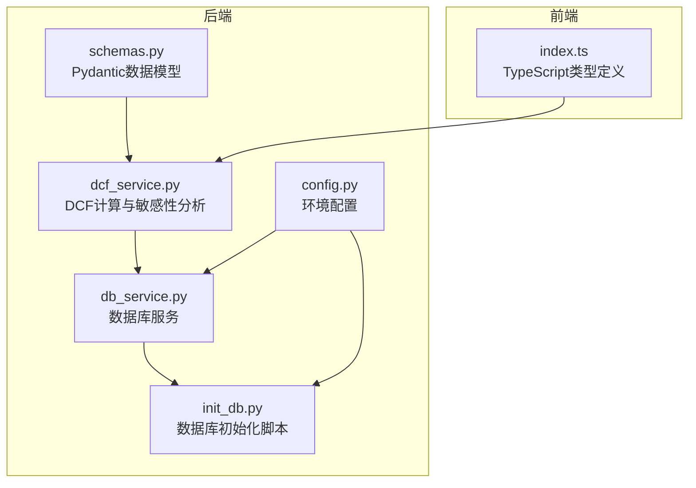
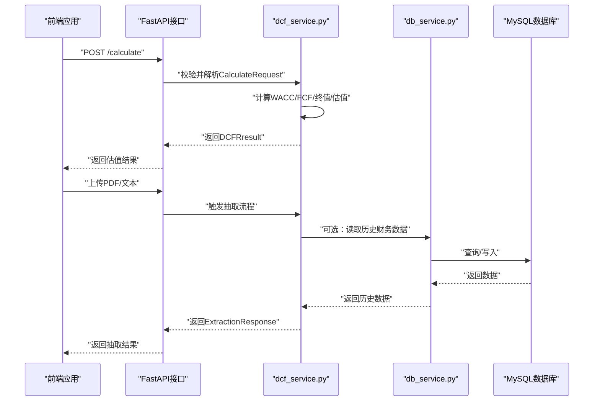
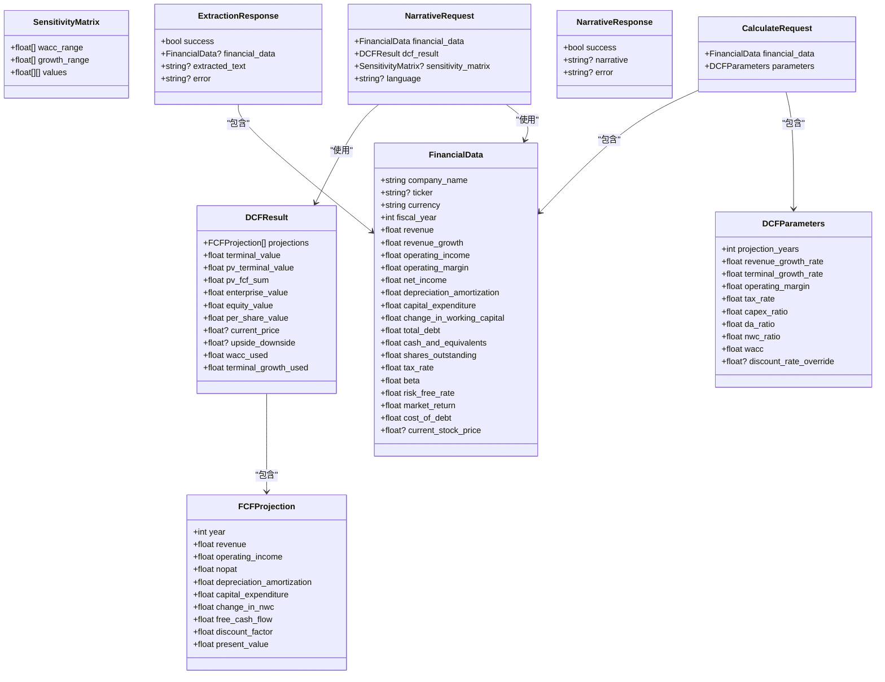
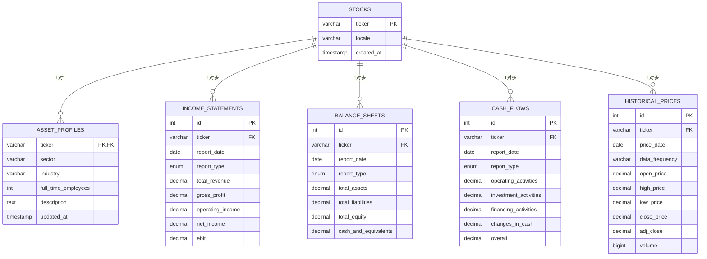
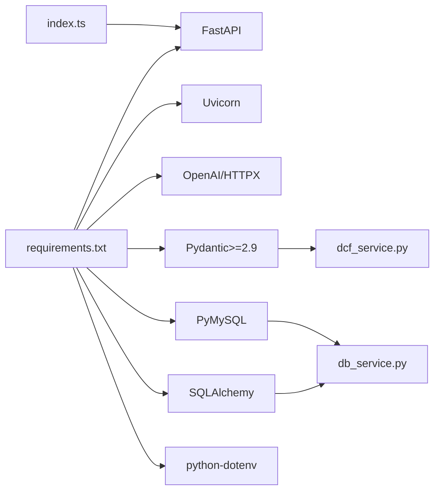

# 数据模型

<cite>
**本文引用的文件**
- [schemas.py](file://backend/models/schemas.py)
- [db_service.py](file://backend/services/db_service.py)
- [init_db.py](file://backend/init_db.py)
- [DATABASE_QUICK_REFERENCE.md](file://backend/DATABASE_QUICK_REFERENCE.md)
- [DATABASE_README.md](file://backend/DATABASE_README.md)
- [dcf_service.py](file://backend/services/dcf_service.py)
- [extractor_service.py](file://backend/services/extractor_service.py)
- [index.ts](file://frontend/src/types/index.ts)
- [config.py](file://backend/config.py)
- [requirements.txt](file://backend/requirements.txt)
</cite>

## 目录
1. [简介](#简介)
2. [项目结构](#项目结构)
3. [核心组件](#核心组件)
4. [架构总览](#架构总览)
5. [详细组件分析](#详细组件分析)
6. [依赖分析](#依赖分析)
7. [性能考量](#性能考量)
8. [故障排查指南](#故障排查指南)
9. [结论](#结论)
10. [附录](#附录)

## 简介
本文件系统化梳理DCF估值智能体项目的“数据模型”设计与实现，重点覆盖：
- Pydantic数据模型的定义与使用：FinancialData、DCFParameters、DCFResult、SensitivityMatrix、FCFProjection、ExtractionResponse、NarrativeRequest/NarrativeResponse、CalculateRequest 等。
- 实体关系、字段定义与数据类型，以及主键/外键、索引与约束的设计考虑。
- 数据验证规则与业务规则：完整性检查、格式验证、范围限制等。
- 数据库模式图与示例数据，展示存储结构与关系。
- 数据访问模式、缓存策略与性能考虑。
- 数据生命周期、保留策略与归档规则。
- 数据迁移路径与版本管理策略。

## 项目结构
后端采用“模型-服务-接口”的分层组织，数据模型集中在 backend/models/schemas.py；数据库初始化与访问在 backend/init_db.py 与 backend/services/db_service.py 中实现；前端类型定义位于 frontend/src/types/index.ts；DCF计算逻辑在 backend/services/dcf_service.py 中。

图表来源
- [schemas.py:1-101](file://backend/models/schemas.py#L1-L101)
- [dcf_service.py:1-163](file://backend/services/dcf_service.py#L1-L163)
- [db_service.py:1-345](file://backend/services/db_service.py#L1-L345)
- [init_db.py:1-219](file://backend/init_db.py#L1-L219)
- [config.py:1-22](file://backend/config.py#L1-L22)
- [index.ts:1-128](file://frontend/src/types/index.ts#L1-L128)

章节来源
- [schemas.py:1-101](file://backend/models/schemas.py#L1-L101)
- [db_service.py:1-345](file://backend/services/db_service.py#L1-L345)
- [init_db.py:1-219](file://backend/init_db.py#L1-L219)
- [DATABASE_QUICK_REFERENCE.md:1-290](file://backend/DATABASE_QUICK_REFERENCE.md#L1-L290)
- [DATABASE_README.md:1-168](file://backend/DATABASE_README.md#L1-L168)
- [index.ts:1-128](file://frontend/src/types/index.ts#L1-L128)
- [config.py:1-22](file://backend/config.py#L1-L22)

## 核心组件
本节聚焦Pydantic数据模型与数据库表结构，明确字段、类型、默认值、可空性与业务含义。

- FinancialData：企业财务基础数据，用于DCF建模输入。字段涵盖公司名称、股票代码、货币、财年、收入、增长率、利润、折旧摊销、资本支出、营运资金变动、债务、现金、股本、税率、贝塔、无风险利率、市场回报、债务成本、当前股价等。
- DCFParameters：DCF建模参数，包括预测期、收入增长率、终值增长率、运营利润率、税率、CAPEX/DA/NWC比率、WACC或折扣率覆盖。
- FCFProjection：自由现金流预测明细，包含年份、收入、运营利润、NOPAT、DA、CAPEX、NWC变动、FCF、贴现因子、现值。
- DCFResult：DCF估值结果，包含终值、终值现值、FCF现值合计、企业价值、股权价值、每股价值、当前股价、上/下空间、实际使用的WACC与终值增长率。
- SensitivityMatrix：敏感性分析矩阵，包含WACC与终值增长率的取值网格与对应的每股价值矩阵。
- ExtractionResponse：抽取响应，包含抽取成功标志、抽取到的FinancialData、原始文本片段、错误信息。
- NarrativeRequest/NarrativeResponse：叙事生成请求/响应，包含FinancialData、DCFResult、可选敏感性矩阵与语言。
- CalculateRequest：计算请求，包含FinancialData与DCFParameters。

章节来源
- [schemas.py:8-101](file://backend/models/schemas.py#L8-L101)

## 架构总览
下图展示数据模型在系统中的角色与交互：前端通过API提交CalculateRequest，后端使用Pydantic模型进行数据校验与类型转换；DCF计算模块基于模型进行估值与敏感性分析；数据库服务负责金融报表与历史价格的持久化与检索。

图表来源
- [dcf_service.py:85-121](file://backend/services/dcf_service.py#L85-L121)
- [db_service.py:234-341](file://backend/services/db_service.py#L234-L341)
- [schemas.py:98-101](file://backend/models/schemas.py#L98-L101)

## 详细组件分析

### Pydantic数据模型类图

图表来源
- [schemas.py:8-101](file://backend/models/schemas.py#L8-L101)

章节来源
- [schemas.py:8-101](file://backend/models/schemas.py#L8-L101)

### 数据验证与业务规则
- 默认值与可空性
  - 大多数数值字段提供合理默认值，如财务年份默认2025、运营利润率默认0.15、税率默认0.25、贝塔默认1.0、无风险/市场回报默认0.03/0.09、债务成本默认0.05、股本默认1.0等。
  - 可空字段如ticker、current_stock_price、discount_rate_override、language、error等，便于处理不完整或可选输入。
- 范围与合理性
  - WACC计算中对结果取最大值以避免非正值；当总资本为0时，设定权重默认值，保证计算稳定。
  - 终值计算要求WACC > 终值增长率，否则返回0，防止数学异常。
  - 分子/分母（如股本）若为0，使用1.0兜底，避免除零。
- 输入清洗与类型转换
  - 抽取服务对原始字段进行安全转换：字符串转浮点/整数，异常时回退到默认值，确保后续计算可用。
- 输出精度
  - 计算结果按需四舍五入，如FCF、PV、EV、EPS等保留两位小数，贴现因子保留六位小数，上/下空间保留四位小数。

章节来源
- [dcf_service.py:12-34](file://backend/services/dcf_service.py#L12-L34)
- [dcf_service.py:79-82](file://backend/services/dcf_service.py#L79-L82)
- [dcf_service.py:85-121](file://backend/services/dcf_service.py#L85-L121)
- [dcf_service.py:123-163](file://backend/services/dcf_service.py#L123-L163)
- [extractor_service.py:11-25](file://backend/services/extractor_service.py#L11-L25)
- [extractor_service.py:27-67](file://backend/services/extractor_service.py#L27-L67)

### 数据库模式与实体关系
数据库采用关系型设计，围绕“股票”为中心，扩展“公司档案”、“财务报表”、“历史价格”等维度。核心关系如下：
- stocks（股票基础表）：主键为ticker，记录地区与创建时间。
- asset_profiles（公司档案）：外键指向stocks，支持级联删除；包含行业板块、细分行业、员工数、描述等。
- income_statements/balance_sheets/cash_flows（三大报表）：每张表均包含ticker、report_date、report_type，并设置唯一索引避免重复；外键指向stocks并级联删除。
- historical_prices（历史价格）：按ticker/date/frequency唯一，支持1天/周/月频率，包含OHLCV与调整后收盘价。

图表来源
- [init_db.py:74-161](file://backend/init_db.py#L74-L161)
- [db_service.py:54-341](file://backend/services/db_service.py#L54-L341)

章节来源
- [init_db.py:68-161](file://backend/init_db.py#L68-L161)
- [DATABASE_QUICK_REFERENCE.md:125-195](file://backend/DATABASE_QUICK_REFERENCE.md#L125-L195)
- [DATABASE_README.md:60-88](file://backend/DATABASE_README.md#L60-L88)

### 示例数据与典型用法
- 插入股票与档案
  - 先插入股票，再插入公司档案；档案字段包含行业、员工数、描述等。
- 插入财务报表
  - 利润表、资产负债表、现金流量表分别插入，注意report_type为annual或quarterly，report_date唯一性由唯一索引保障。
- 插入历史价格
  - 指定price_date与data_frequency，支持1d/1wk/1mo；唯一索引避免重复。
- 查询与整合
  - 通过get_stock_data一次性获取股票基础、最新财报与公司档案；通过get_financial_statements批量获取年报/季报序列；通过get_historical_prices按日期范围与频率筛选。

章节来源
- [DATABASE_QUICK_REFERENCE.md:30-118](file://backend/DATABASE_QUICK_REFERENCE.md#L30-L118)
- [db_service.py:234-341](file://backend/services/db_service.py#L234-L341)

### 数据访问模式与缓存策略
- 访问模式
  - 单表写入：insert_stock、insert_asset_profile、insert_income_statement、insert_balance_sheet、insert_cash_flow、insert_historical_price。
  - 聚合查询：get_stock_data一次性聚合股票、档案与最新财报；get_financial_statements返回三类报表列表；get_historical_prices支持日期范围与频率过滤。
- 缓存策略建议
  - 对高频读取的历史价格与最新财报可引入本地缓存（如内存字典或Redis），结合ETag/Last-Modified做失效控制。
  - 对计算密集的敏感性矩阵可缓存中间结果，按输入参数哈希作为键。
  - 注意缓存一致性：写入新数据后主动失效相关缓存键。

章节来源
- [db_service.py:54-341](file://backend/services/db_service.py#L54-L341)
- [DATABASE_README.md:161-168](file://backend/DATABASE_README.md#L161-L168)

### 性能考量
- 数据类型与精度
  - 财务金额统一使用DECIMAL(20,4)，避免浮点误差；Python侧返回Decimal需显式转换为float参与计算。
- 唯一性约束与UPSERT
  - 历史价格与报表表均设置唯一索引，服务层使用ON DUPLICATE KEY UPDATE实现幂等写入。
- 外键与级联
  - 外键约束保证引用完整性；ON DELETE CASCADE清理关联数据，减少孤立记录。
- 连接与事务
  - 服务层封装连接与事务，异常时自动回滚；建议在高并发场景引入连接池提升吞吐。

章节来源
- [init_db.py:95-161](file://backend/init_db.py#L95-L161)
- [db_service.py:54-341](file://backend/services/db_service.py#L54-L341)
- [DATABASE_QUICK_REFERENCE.md:196-222](file://backend/DATABASE_QUICK_REFERENCE.md#L196-L222)

### 数据生命周期、保留策略与归档规则
- 生命周期
  - 股票基础信息长期保留；财务报表按年度/季度归档；历史价格按频率保留，短期高频数据可压缩或降采样。
- 保留策略
  - 历史价格：1d数据可保留3-5年，1wk/1mo数据长期归档；超过保留期的数据可标记为只读或移出热存储。
- 归档规则
  - 按report_date分区或按年/季度归档报表；历史价格按时间分桶归档，定期清理无效/重复记录。
- 清理与合规
  - 提供数据导出与删除接口，满足用户请求删除与合规要求；删除前先断开外键依赖或启用级联删除。

章节来源
- [DATABASE_README.md:114-122](file://backend/DATABASE_README.md#L114-L122)
- [DATABASE_README.md:161-168](file://backend/DATABASE_README.md#L161-L168)

### 数据迁移路径与版本管理策略
- 迁移路径
  - 新增字段：先在表结构添加列并设置默认值，再通过批处理补全历史数据；最后在服务层兼容旧数据。
  - 删除字段：保留字段但标记为废弃，服务层忽略；若干版本后彻底移除。
  - 结构变更：使用唯一索引保护数据一致性；对大表变更采用在线DDL或影子表方案。
- 版本管理
  - 服务层通过模型版本号或字段存在性检测兼容不同版本输入；数据库版本通过独立迁移脚本管理。
  - 前后端类型保持同步：前端index.ts与后端schemas.py字段名与类型保持一致，避免序列化差异。

章节来源
- [DATABASE_README.md:161-168](file://backend/DATABASE_README.md#L161-L168)
- [index.ts:4-128](file://frontend/src/types/index.ts#L4-L128)
- [schemas.py:8-101](file://backend/models/schemas.py#L8-L101)

## 依赖分析
- 后端依赖
  - FastAPI、Uvicorn：Web框架与ASGI服务器。
  - OpenAI/HTTPX：LLM服务调用与HTTP客户端。
  - Pydantic>=2.9：数据模型与验证。
  - PyMySQL/SQLAlchemy：数据库连接与ORM。
  - python-dotenv：环境变量加载。
- 前端类型
  - TypeScript类型与后端Pydantic模型一一对应，确保API契约一致。

图表来源
- [requirements.txt:1-11](file://backend/requirements.txt#L1-L11)
- [index.ts:1-128](file://frontend/src/types/index.ts#L1-L128)
- [dcf_service.py:1-10](file://backend/services/dcf_service.py#L1-L10)
- [db_service.py:5-21](file://backend/services/db_service.py#L5-L21)

章节来源
- [requirements.txt:1-11](file://backend/requirements.txt#L1-L11)
- [index.ts:1-128](file://frontend/src/types/index.ts#L1-L128)

## 性能考量
- 计算复杂度
  - FCF预测循环O(T)；敏感性分析O(W×G)；终值计算常数时间。
- I/O优化
  - 批量写入：insert_*系列方法支持多次调用；建议合并事务减少往返。
  - 查询优化：按ticker+日期+频率建立唯一索引；对常用查询添加合适索引。
- 内存与序列化
  - 大型敏感性矩阵建议分页或分块传输；前端Store按需渲染，避免一次性渲染超大数据集。

章节来源
- [dcf_service.py:37-77](file://backend/services/dcf_service.py#L37-L77)
- [dcf_service.py:123-163](file://backend/services/dcf_service.py#L123-L163)
- [db_service.py:275-299](file://backend/services/db_service.py#L275-L299)

## 故障排查指南
- 连接问题
  - 使用test_db_connection.py诊断连接、权限与数据库存在性；确认.env配置正确。
- 写入失败
  - 检查返回布尔值；查看错误日志；核对数据类型与唯一约束冲突。
- 类型转换
  - MySQL返回的DECIMAL需转换为float；确保日期对象传入date类型。
- 外键依赖
  - 必须先插入stocks记录，再插入相关财务数据；否则外键约束失败。

章节来源
- [test_db_connection.py:22-72](file://backend/test_db_connection.py#L22-L72)
- [DATABASE_QUICK_REFERENCE.md:196-222](file://backend/DATABASE_QUICK_REFERENCE.md#L196-L222)
- [db_service.py:54-341](file://backend/services/db_service.py#L54-L341)

## 结论
本项目通过Pydantic模型确保输入数据的强类型与默认值一致性，结合MySQL关系型数据库实现财务数据的结构化存储与高效查询。DCF计算模块严格遵循业务规则与数值边界，输出结果具备可解释性与稳健性。建议在生产环境中引入缓存、连接池与数据归档策略，持续完善数据迁移与版本管理机制，以支撑长期演进与高并发场景。

## 附录
- 快速参考与示例：参见 DATABASE_QUICK_REFERENCE.md 的常用代码片段与示例。
- 配置文件：后端通过config.py加载环境变量，包含MySQL连接参数与上传目录等。

章节来源
- [DATABASE_QUICK_REFERENCE.md:1-290](file://backend/DATABASE_QUICK_REFERENCE.md#L1-L290)
- [config.py:14-22](file://backend/config.py#L14-L22)