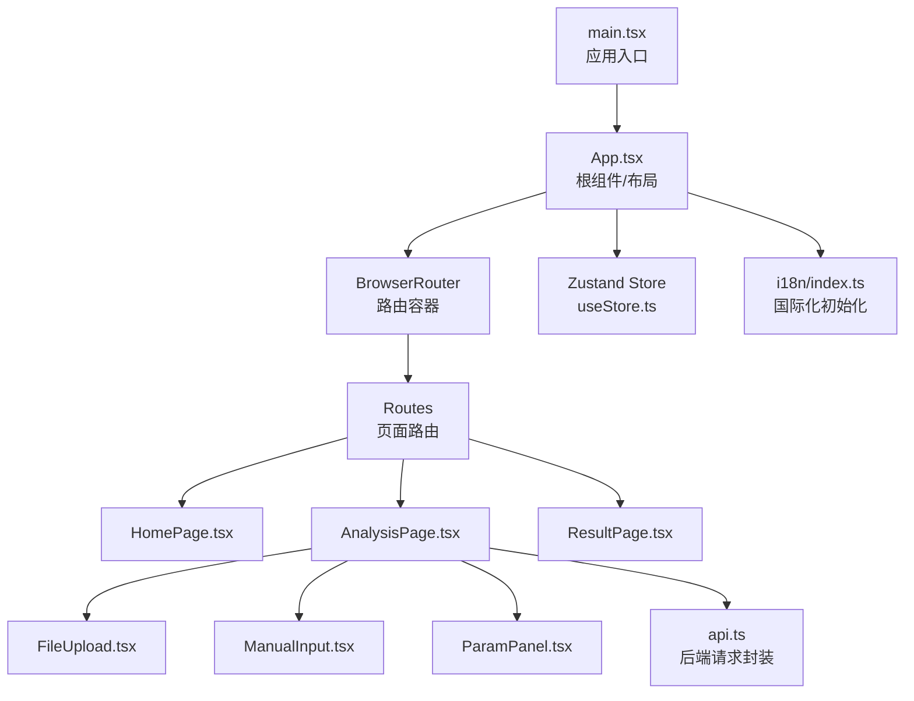
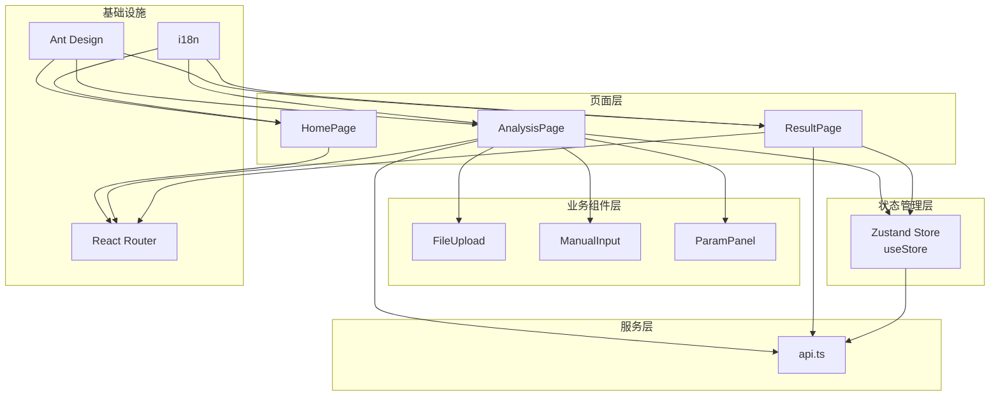
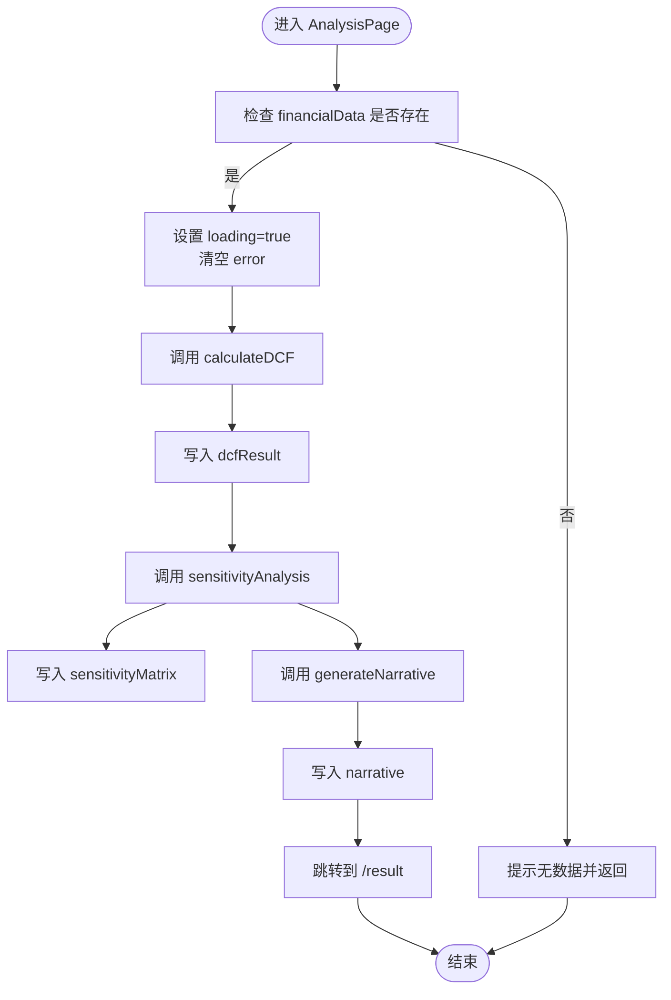
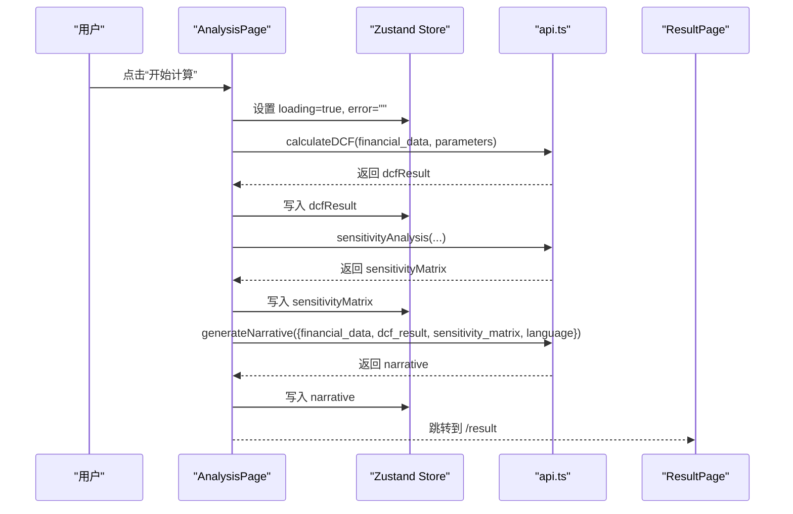
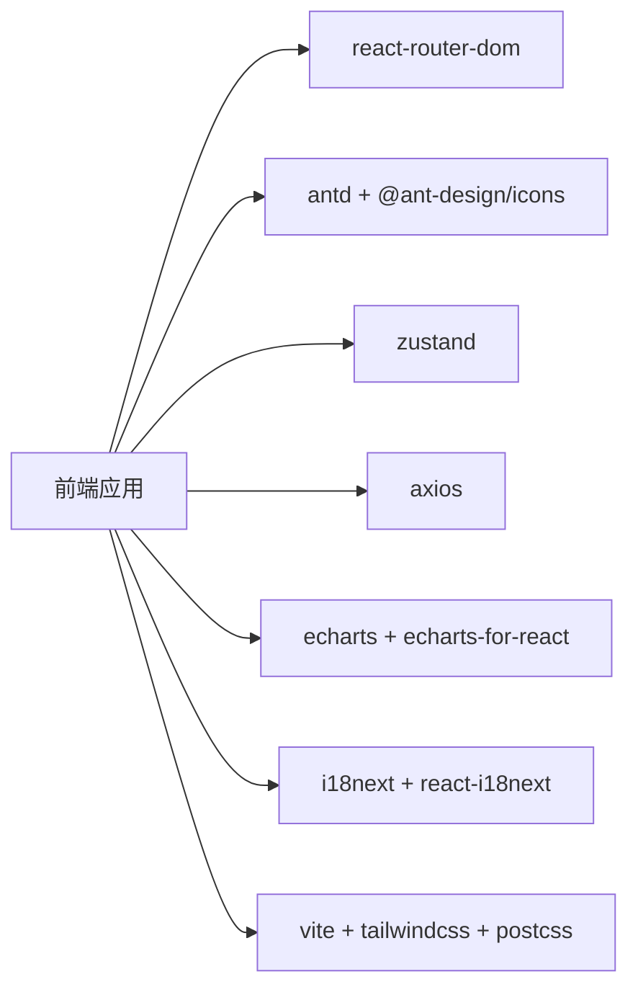

# 前端架构

<cite>
**本文引用的文件**
- [main.tsx](file://frontend/src/main.tsx)
- [App.tsx](file://frontend/src/App.tsx)
- [vite.config.ts](file://frontend/vite.config.ts)
- [package.json](file://frontend/package.json)
- [tsconfig.json](file://frontend/tsconfig.json)
- [useStore.ts](file://frontend/src/store/useStore.ts)
- [types/index.ts](file://frontend/src/types/index.ts)
- [HomePage.tsx](file://frontend/src/pages/HomePage.tsx)
- [AnalysisPage.tsx](file://frontend/src/pages/AnalysisPage.tsx)
- [ResultPage.tsx](file://frontend/src/pages/ResultPage.tsx)
- [api.ts](file://frontend/src/services/api.ts)
- [i18n/index.ts](file://frontend/src/i18n/index.ts)
- [FileUpload.tsx](file://frontend/src/components/FileUpload.tsx)
- [ManualInput.tsx](file://frontend/src/components/ManualInput.tsx)
- [ParamPanel.tsx](file://frontend/src/components/ParamPanel.tsx)
</cite>

## 目录
1. [引言](#引言)
2. [项目结构](#项目结构)
3. [核心组件](#核心组件)
4. [架构总览](#架构总览)
5. [详细组件分析](#详细组件分析)
6. [依赖分析](#依赖分析)
7. [性能考虑](#性能考虑)
8. [故障排查指南](#故障排查指南)
9. [结论](#结论)
10. [附录](#附录)

## 引言
本文件面向DCF估值智能体项目的前端团队与相关读者，系统性梳理基于React 18的前端架构设计，涵盖应用入口、组件树、路由配置、状态管理（Zustand）、类型系统（TypeScript）、构建与样式、国际化支持等。文档以“从上到下”的方式逐步展开：先给出整体视图，再深入到关键模块与数据流，最后总结最佳实践与常见问题。

## 项目结构
前端采用按功能域分层的目录组织方式：
- 入口与根组件：src/main.tsx、src/App.tsx
- 页面组件：src/pages 下的 HomePage、AnalysisPage、ResultPage
- 业务组件：src/components 下的 FileUpload、ManualInput、ParamPanel 等
- 状态管理：src/store/useStore.ts
- 类型系统：src/types/index.ts
- 服务层：src/services/api.ts
- 国际化：src/i18n/index.ts 及资源文件
- 构建与工具链：vite.config.ts、package.json、tsconfig.json 等

图表来源
- [main.tsx:1-12](file://frontend/src/main.tsx#L1-L12)
- [App.tsx:105-147](file://frontend/src/App.tsx#L105-L147)
- [HomePage.tsx:1-117](file://frontend/src/pages/HomePage.tsx#L1-L117)
- [AnalysisPage.tsx:1-217](file://frontend/src/pages/AnalysisPage.tsx#L1-L217)
- [ResultPage.tsx:1-216](file://frontend/src/pages/ResultPage.tsx#L1-L216)
- [useStore.ts:1-74](file://frontend/src/store/useStore.ts#L1-L74)
- [api.ts:1-81](file://frontend/src/services/api.ts#L1-L81)
- [i18n/index.ts:1-27](file://frontend/src/i18n/index.ts#L1-L27)

章节来源
- [main.tsx:1-12](file://frontend/src/main.tsx#L1-L12)
- [App.tsx:105-147](file://frontend/src/App.tsx#L105-L147)
- [vite.config.ts:1-22](file://frontend/vite.config.ts#L1-L22)
- [package.json:1-37](file://frontend/package.json#L1-L37)
- [tsconfig.json:1-26](file://frontend/tsconfig.json#L1-L26)

## 核心组件
- 应用入口与渲染
  - main.tsx 负责挂载根组件，并引入国际化与全局样式。
- 根组件与布局
  - App.tsx 提供 Ant Design 布局、导航菜单、主题切换、语言切换与路由容器。
- 页面组件
  - HomePage：引导页与特性展示
  - AnalysisPage：数据输入、参数调整、计算流程
  - ResultPage：结果汇总与可视化
- 业务组件
  - FileUpload：PDF上传与字段提取
  - ManualInput：手动录入财务数据
  - ParamPanel：DCF参数滑块面板
- 状态管理
  - useStore.ts 使用 Zustand 管理主题、语言、财务数据、参数、结果、敏感性矩阵、叙事文本、加载与错误状态
- 服务层
  - api.ts 封装 /api 前缀的后端请求，统一错误处理
- 国际化
  - i18n/index.ts 初始化 i18next，支持本地检测与缓存

章节来源
- [main.tsx:1-12](file://frontend/src/main.tsx#L1-L12)
- [App.tsx:105-147](file://frontend/src/App.tsx#L105-L147)
- [HomePage.tsx:1-117](file://frontend/src/pages/HomePage.tsx#L1-L117)
- [AnalysisPage.tsx:1-217](file://frontend/src/pages/AnalysisPage.tsx#L1-L217)
- [ResultPage.tsx:1-216](file://frontend/src/pages/ResultPage.tsx#L1-L216)
- [useStore.ts:1-74](file://frontend/src/store/useStore.ts#L1-L74)
- [api.ts:1-81](file://frontend/src/services/api.ts#L1-L81)
- [i18n/index.ts:1-27](file://frontend/src/i18n/index.ts#L1-L27)

## 架构总览
前端采用“页面-业务组件-UI组件”分层，结合Zustand集中式状态管理与Ant Design UI库，形成清晰的数据与控制流：

图表来源
- [App.tsx:124-133](file://frontend/src/App.tsx#L124-L133)
- [AnalysisPage.tsx:15-19](file://frontend/src/pages/AnalysisPage.tsx#L15-L19)
- [ResultPage.tsx:14-19](file://frontend/src/pages/ResultPage.tsx#L14-L19)
- [useStore.ts:23-73](file://frontend/src/store/useStore.ts#L23-L73)
- [api.ts:11-15](file://frontend/src/services/api.ts#L11-L15)
- [i18n/index.ts:7-24](file://frontend/src/i18n/index.ts#L7-L24)

## 详细组件分析

### 应用入口与根组件
- 入口
  - main.tsx 创建根节点并渲染 App，在 StrictMode 包裹下启动应用；同时引入国际化与全局样式。
- 根组件
  - App.tsx 使用 Ant Design Layout、ConfigProvider 进行主题注入；通过 BrowserRouter 提供路由上下文；在 Header 中集成导航菜单、语言切换与主题切换按钮；Content 区域承载 Routes；Footer 展示版权信息。
  - 主题切换通过 store 的 toggleTheme 实现，并同步设置 documentElement 的 dark 类名；Ant Design 主题算法随主题动态切换。

章节来源
- [main.tsx:1-12](file://frontend/src/main.tsx#L1-L12)
- [App.tsx:105-147](file://frontend/src/App.tsx#L105-L147)

### 路由配置
- 使用 React Router v6 的 Routes/Route 组件声明三类页面路由：
  - “/” 首页
  - “/analysis” 分析页
  - “/result” 结果页
- 菜单项与当前路径联动，选中态根据 location pathname 自动高亮。

章节来源
- [App.tsx:124-133](file://frontend/src/App.tsx#L124-L133)

### 状态管理（Zustand）
- Store 设计
  - 使用 create 创建 AppState，包含：
    - 视图状态：theme、language、loading、error
    - 数据状态：financialData、dcfParameters、dcfResult、sensitivityMatrix、narrative、extractedText
    - 动作函数：setFinancialData、setDCFParameters、setDCFResult、setSensitivityMatrix、setNarrative、setExtractedText、setLoading、setError、setLanguage、toggleTheme、resetAll
  - 默认参数集中于 defaultParameters，便于重置与初始化
- 更新机制
  - 多数动作使用 set 接受对象或函数式更新，确保局部更新与不可变性
  - toggleTheme 使用函数式更新实现双态切换
  - setDCFParameters 支持部分更新，合并新旧参数
- 与组件协作
  - 各页面与组件通过 useStore 订阅状态并触发动作
  - AnalysisPage 在计算流程中串行调用多个服务并写入 store，最终跳转至结果页

图表来源
- [AnalysisPage.tsx:58-99](file://frontend/src/pages/AnalysisPage.tsx#L58-L99)
- [useStore.ts:35-53](file://frontend/src/store/useStore.ts#L35-L53)

章节来源
- [useStore.ts:1-74](file://frontend/src/store/useStore.ts#L1-L74)
- [AnalysisPage.tsx:29-99](file://frontend/src/pages/AnalysisPage.tsx#L29-L99)

### 页面组件与数据流

#### 首页（HomePage）
- 展示品牌语句、副标题、描述与行动按钮；点击进入分析页
- 使用 Ant Design Typography 与图标；响应式网格展示特性卡片

章节来源
- [HomePage.tsx:1-117](file://frontend/src/pages/HomePage.tsx#L1-L117)

#### 分析页（AnalysisPage）
- 左侧：标签页切换“上传/手动录入”，右侧：参数面板
- 数据编辑：通过 Descriptions 与 Input/InputNumber 编辑 financialData
- 参数编辑：ParamPanel 提供滑块与数值输入，实时写入 dcfParameters
- 计算流程：依次调用 calculateDCF、sensitivityAnalysis、generateNarrative，成功后跳转结果页

图表来源
- [AnalysisPage.tsx:58-99](file://frontend/src/pages/AnalysisPage.tsx#L58-L99)
- [api.ts:51-80](file://frontend/src/services/api.ts#L51-L80)
- [useStore.ts:42-49](file://frontend/src/store/useStore.ts#L42-L49)

章节来源
- [AnalysisPage.tsx:1-217](file://frontend/src/pages/AnalysisPage.tsx#L1-L217)
- [ParamPanel.tsx:88-209](file://frontend/src/components/ParamPanel.tsx#L88-L209)
- [FileUpload.tsx:12-158](file://frontend/src/components/FileUpload.tsx#L12-L158)
- [ManualInput.tsx:98-177](file://frontend/src/components/ManualInput.tsx#L98-L177)

#### 结果页（ResultPage）
- 校验 dcfResult 存在性，不存在则回退到分析页
- 汇总卡片展示企业价值、股权价值、每股价值及相对当前股价的上/下行空间
- 图表区域：现金流趋势图、敏感性表格、价值桥瀑布图
- AI叙事：可折叠展示生成的分析报告

章节来源
- [ResultPage.tsx:1-216](file://frontend/src/pages/ResultPage.tsx#L1-L216)

### 业务组件

#### 文件上传（FileUpload）
- 使用 Ant Design Upload.Dragger 实现 PDF 拖拽上传
- 成功后写入 financialData 与 extractedText，并允许二次编辑
- 错误时统一通过 setError 与消息提示反馈

章节来源
- [FileUpload.tsx:12-158](file://frontend/src/components/FileUpload.tsx#L12-L158)

#### 手动录入（ManualInput）
- 按板块组织字段（公司信息、收入、资本结构、债务与权益、市场数据）
- 使用 Ant Design Form 与 Input/InputNumber，支持默认值与校验规则
- 与 store 同步，保存到 financialData

章节来源
- [ManualInput.tsx:98-177](file://frontend/src/components/ManualInput.tsx#L98-L177)

#### 参数面板（ParamPanel）
- 将 DCF 参数分为“比率/百分比/年份”四组，使用 Collapse 分组展示
- Slider 与 InputNumber 双向绑定，支持显示倍数转换与整数步进
- 当存在财务数据时，提供 CAPM 预览 WACC 的统计信息

章节来源
- [ParamPanel.tsx:88-209](file://frontend/src/components/ParamPanel.tsx#L88-L209)

### 类型系统（TypeScript）
- 类型定义集中在 types/index.ts，覆盖：
  - 主题与语言枚举
  - 财务数据结构（FinancialData）
  - DCF参数（DCFParameters）
  - 折现现金流预测（FCFProjection）
  - DCF结果（DCFResult）
  - 敏感性矩阵（SensitivityMatrix）与单元格（SensitivityCell）
  - 提取响应（ExtractionResponse）
  - 叙事请求/响应（NarrativeRequest/NarrativeResponse）
  - 计算请求（CalculateRequest）
  - 应用状态（AppState）及其动作签名
- 使用场景
  - 组件 props 与 hooks 返回值强类型约束
  - API 请求/响应的严格校验
  - Zustand actions 的参数与返回值类型安全

章节来源
- [types/index.ts:1-128](file://frontend/src/types/index.ts#L1-L128)

### 国际化（i18n）
- 初始化：i18next + react-i18next + browser-languagedetector
- 资源：zh.json 与 en.json
- 行为：优先从 localStorage/navigator 检测语言，回退到 en；支持运行时切换语言并持久化

章节来源
- [i18n/index.ts:1-27](file://frontend/src/i18n/index.ts#L1-L27)

### 构建与样式
- 构建工具：Vite
  - 插件：@vitejs/plugin-react
  - 别名：@ 指向 src
  - 本地开发服务器：端口 3000，代理 /api 到后端 8001
- 样式：Tailwind CSS + Ant Design CSS-in-JS
- TypeScript：严格模式、路径映射、ESNext 模块解析

章节来源
- [vite.config.ts:1-22](file://frontend/vite.config.ts#L1-L22)
- [package.json:1-37](file://frontend/package.json#L1-L37)
- [tsconfig.json:1-26](file://frontend/tsconfig.json#L1-L26)

## 依赖分析
- React 生态：React 18、react-router-dom、@ant-design/icons
- UI 框架：Ant Design 5，配合 @ant-design/cssinjs 实现主题与动态样式
- 状态管理：Zustand（轻量、函数式）
- 可视化：ECharts 与 echars-for-react
- 网络：Axios（统一超时与错误处理）
- 国际化：i18next + react-i18next + browser-languagedetector
- 构建与样式：Vite、Tailwind CSS、PostCSS/Autoprefixer

图表来源
- [package.json:11-25](file://frontend/package.json#L11-L25)
- [vite.config.ts:1-22](file://frontend/vite.config.ts#L1-L22)

章节来源
- [package.json:1-37](file://frontend/package.json#L1-L37)

## 性能考虑
- 组件拆分与懒加载
  - AnalysisPage 中对业务组件采用注释标记“lazy component imports”，建议后续落地为动态导入，减少首屏体积
- 状态粒度
  - 将大对象拆分为更细粒度的状态键，避免不必要的重渲染
- 渲染优化
  - 使用 React.memo、useMemo、useCallback 保护昂贵计算与子组件
- 图表性能
  - ECharts 渲染大量数据时，建议启用大数据优化选项与节流
- 网络请求
  - 对长耗时请求增加 Loading 状态与取消机制，避免重复提交
- 主题与国际化
  - Ant Design 主题切换与 i18n 切换均应避免全量重渲染，保持状态稳定

## 故障排查指南
- 路由跳转异常
  - 确认 Routes 正确注册且路径一致；检查 Link 与 useNavigate 的目标路径
- 计算失败
  - 查看 AnalysisPage 的错误收集与消息提示；确认后端 /api 端点可达与代理配置正确
- 状态未更新
  - 检查 useStore 的动作是否被调用；确认传参类型与默认值是否合理
- 图表不显示
  - 确认容器尺寸与数据格式；检查 ECharts 初始化时机
- 国际化不生效
  - 检查 i18n 初始化顺序与资源键是否存在；确认语言切换逻辑

章节来源
- [App.tsx:124-133](file://frontend/src/App.tsx#L124-L133)
- [AnalysisPage.tsx:58-99](file://frontend/src/pages/AnalysisPage.tsx#L58-L99)
- [api.ts:17-26](file://frontend/src/services/api.ts#L17-L26)
- [i18n/index.ts:7-24](file://frontend/src/i18n/index.ts#L7-L24)

## 结论
该前端架构以 React 18 为基础，结合 Ant Design 与 Zustand，实现了清晰的页面-组件-状态分层。通过 TypeScript 提供强类型保障，借助 Vite 与 Tailwind 快速迭代，配合 i18n 与 ECharts 完成国际化与可视化需求。建议后续在懒加载、状态拆分与图表优化方面持续改进，以进一步提升性能与可维护性。

## 附录
- 关键配置参考
  - Vite 别名与代理：vite.config.ts
  - TypeScript 严格模式与路径映射：tsconfig.json
  - 依赖版本与脚本：package.json
- 类型清单
  - 应用状态与动作：AppState
  - 财务与DCF模型：FinancialData、DCFParameters、FCFProjection、DCFResult
  - 敏感性与叙事：SensitivityMatrix、SensitivityCell、NarrativeRequest、NarrativeResponse
  - 请求/响应：CalculateRequest、ExtractionResponse