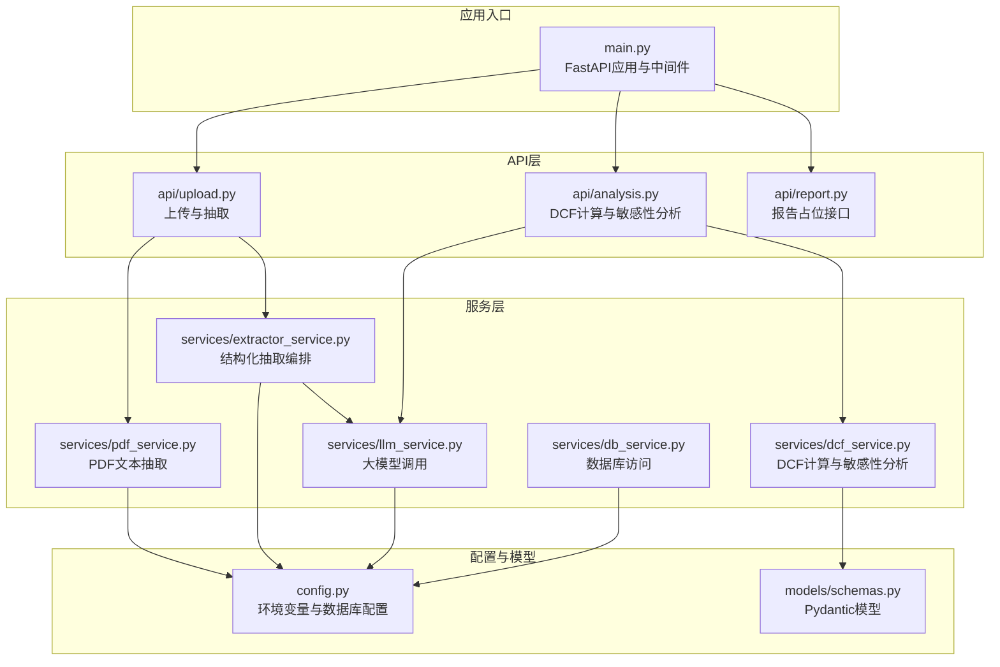
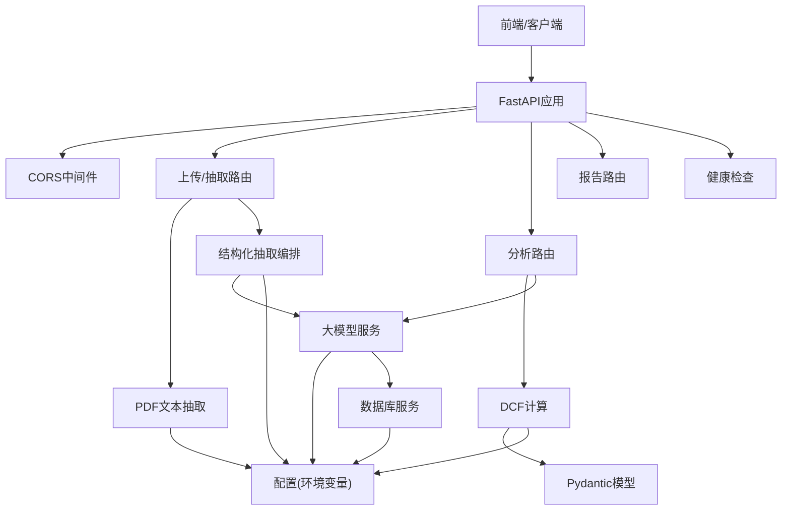
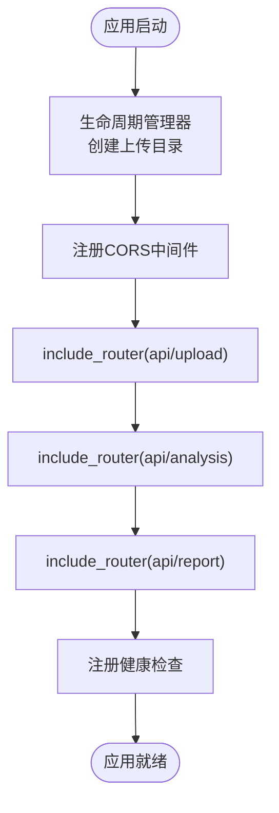
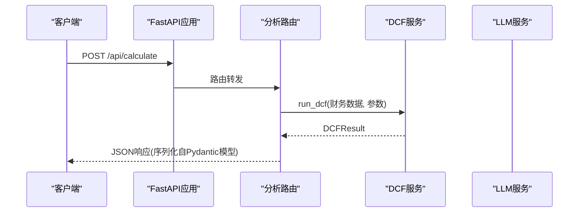
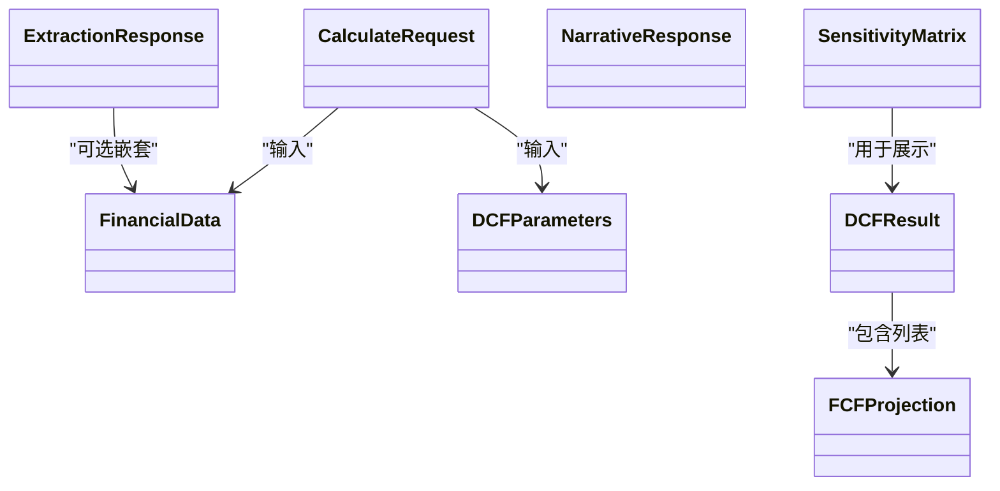
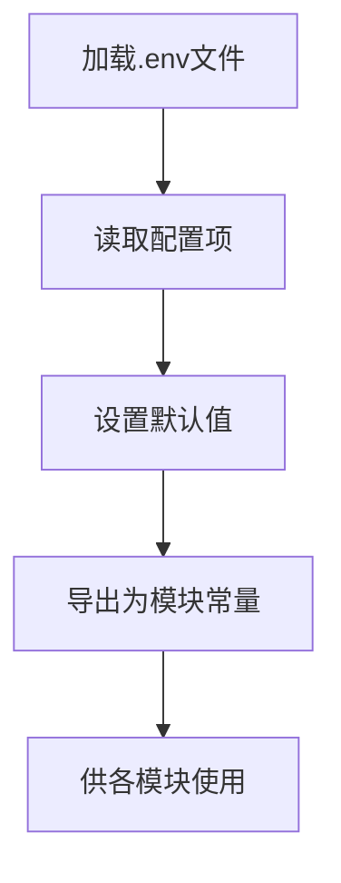
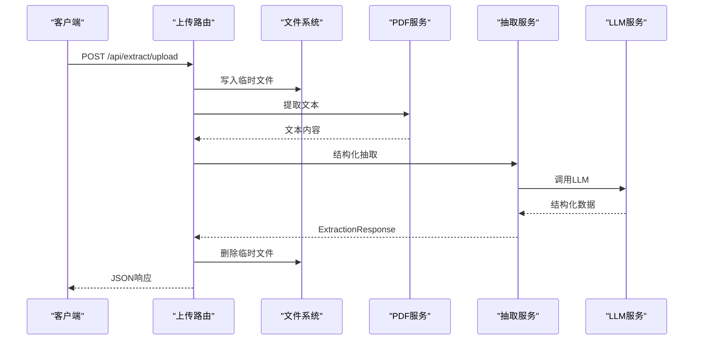
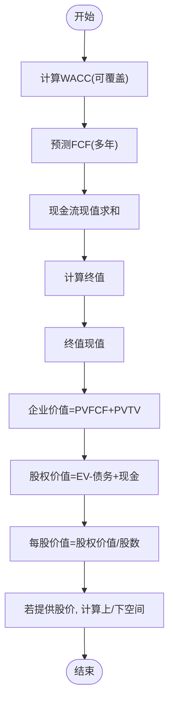
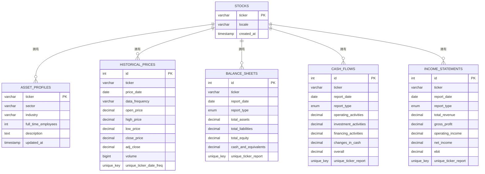
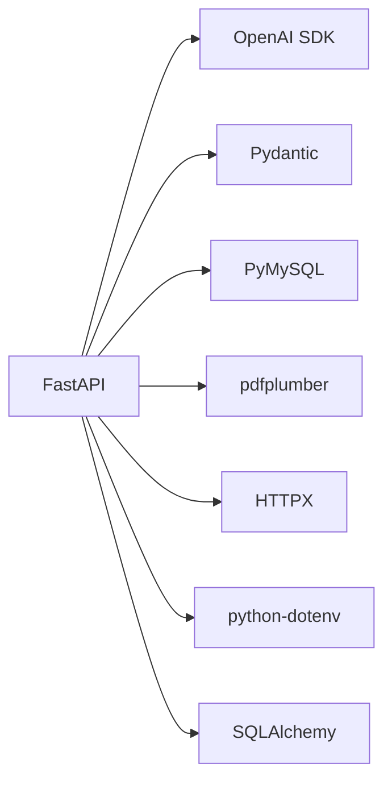

# 后端架构

<cite>
**本文引用的文件**
- [backend/main.py](file://backend/main.py)
- [backend/config.py](file://backend/config.py)
- [backend/models/schemas.py](file://backend/models/schemas.py)
- [backend/api/upload.py](file://backend/api/upload.py)
- [backend/api/analysis.py](file://backend/api/analysis.py)
- [backend/api/report.py](file://backend/api/report.py)
- [backend/services/db_service.py](file://backend/services/db_service.py)
- [backend/services/dcf_service.py](file://backend/services/dcf_service.py)
- [backend/services/pdf_service.py](file://backend/services/pdf_service.py)
- [backend/services/extractor_service.py](file://backend/services/extractor_service.py)
- [backend/services/llm_service.py](file://backend/services/llm_service.py)
- [backend/init_db.py](file://backend/init_db.py)
- [backend/test_db_connection.py](file://backend/test_db_connection.py)
- [backend/examples/db_usage_example.py](file://backend/examples/db_usage_example.py)
- [backend/examples/integration_example.py](file://backend/examples/integration_example.py)
- [backend/requirements.txt](file://backend/requirements.txt)
</cite>

## 目录
1. [引言](#引言)
2. [项目结构](#项目结构)
3. [核心组件](#核心组件)
4. [架构总览](#架构总览)
5. [详细组件分析](#详细组件分析)
6. [依赖分析](#依赖分析)
7. [性能考虑](#性能考虑)
8. [故障排查指南](#故障排查指南)
9. [结论](#结论)
10. [附录](#附录)

## 引言
本文件面向DCF估值智能体项目的后端架构，系统性阐述FastAPI应用的整体设计、生命周期管理、中间件与路由组织、数据模型与验证、配置管理、CORS与健康检查、错误处理策略，以及数据库初始化与集成示例。文档同时提供架构图与组件交互关系说明，帮助开发者快速理解并扩展系统。

## 项目结构
后端采用分层与按功能模块组织的结构：
- 应用入口与生命周期：backend/main.py
- 配置管理：backend/config.py
- 数据模型：backend/models/schemas.py
- API路由：backend/api/{upload, analysis, report}.py
- 业务服务：backend/services/{db_service, dcf_service, pdf_service, extractor_service, llm_service}.py
- 数据库初始化与诊断：backend/init_db.py、backend/test_db_connection.py
- 示例与集成：backend/examples/{db_usage_example, integration_example}.py
- 依赖声明：backend/requirements.txt

图表来源
- [backend/main.py:18-40](file://backend/main.py#L18-L40)
- [backend/api/upload.py:13-55](file://backend/api/upload.py#L13-L55)
- [backend/api/analysis.py:15-45](file://backend/api/analysis.py#L15-L45)
- [backend/api/report.py:5-12](file://backend/api/report.py#L5-L12)
- [backend/services/pdf_service.py:26-68](file://backend/services/pdf_service.py#L26-L68)
- [backend/services/extractor_service.py:27-67](file://backend/services/extractor_service.py#L27-L67)
- [backend/services/llm_service.py:70-155](file://backend/services/llm_service.py#L70-L155)
- [backend/services/dcf_service.py:85-163](file://backend/services/dcf_service.py#L85-L163)
- [backend/services/db_service.py:24-345](file://backend/services/db_service.py#L24-L345)
- [backend/config.py:10-22](file://backend/config.py#L10-L22)
- [backend/models/schemas.py:8-101](file://backend/models/schemas.py#L8-L101)

章节来源
- [backend/main.py:18-40](file://backend/main.py#L18-L40)
- [backend/config.py:10-22](file://backend/config.py#L10-L22)
- [backend/models/schemas.py:8-101](file://backend/models/schemas.py#L8-L101)

## 核心组件
- 应用入口与生命周期
  - 使用异步生命周期管理器确保上传目录在启动时创建。
  - 定义应用标题、版本与健康检查端点。
- 中间件
  - 全允许CORS，便于前后端联调。
- 路由组织
  - 三个API路由器分别挂载到/api前缀下，标签用于Swagger/OpenAPI分组。
- 配置管理
  - 环境变量加载与默认值设置；MySQL连接参数与上传目录路径。
- 数据模型
  - Pydantic模型覆盖财务数据、DCF参数、现金流预测、结果与敏感性矩阵等。
- 服务层
  - PDF文本抽取、结构化抽取编排、LLM调用、DCF计算、数据库访问。
- 数据库初始化与诊断
  - 自动创建数据库与表结构；连接与操作测试脚本。

章节来源
- [backend/main.py:12-40](file://backend/main.py#L12-L40)
- [backend/config.py:10-22](file://backend/config.py#L10-L22)
- [backend/models/schemas.py:8-101](file://backend/models/schemas.py#L8-L101)
- [backend/services/pdf_service.py:26-68](file://backend/services/pdf_service.py#L26-L68)
- [backend/services/extractor_service.py:27-67](file://backend/services/extractor_service.py#L27-L67)
- [backend/services/llm_service.py:70-155](file://backend/services/llm_service.py#L70-L155)
- [backend/services/dcf_service.py:85-163](file://backend/services/dcf_service.py#L85-L163)
- [backend/services/db_service.py:24-345](file://backend/services/db_service.py#L24-L345)
- [backend/init_db.py:68-170](file://backend/init_db.py#L68-L170)
- [backend/test_db_connection.py:22-144](file://backend/test_db_connection.py#L22-L144)

## 架构总览
后端采用“FastAPI应用 + 多层服务”的架构。API层负责请求路由与响应模型；服务层封装业务逻辑与外部依赖；配置与模型提供运行时参数与数据契约；数据库层持久化财务与历史数据。

图表来源
- [backend/main.py:18-40](file://backend/main.py#L18-L40)
- [backend/api/upload.py:16-55](file://backend/api/upload.py#L16-L55)
- [backend/api/analysis.py:18-45](file://backend/api/analysis.py#L18-L45)
- [backend/api/report.py:8-12](file://backend/api/report.py#L8-L12)
- [backend/services/pdf_service.py:26-68](file://backend/services/pdf_service.py#L26-L68)
- [backend/services/extractor_service.py:27-67](file://backend/services/extractor_service.py#L27-L67)
- [backend/services/llm_service.py:70-155](file://backend/services/llm_service.py#L70-L155)
- [backend/services/dcf_service.py:85-163](file://backend/services/dcf_service.py#L85-L163)
- [backend/services/db_service.py:24-345](file://backend/services/db_service.py#L24-L345)
- [backend/config.py:10-22](file://backend/config.py#L10-L22)
- [backend/models/schemas.py:8-101](file://backend/models/schemas.py#L8-L101)

## 详细组件分析

### 应用入口与生命周期
- 生命周期管理：启动时确保上传目录存在，避免运行期IO异常。
- 中间件：全局CORS允许任意源、方法与头，便于开发调试。
- 路由注册：将上传、分析、报告三个路由器挂载至/api前缀。
- 健康检查：提供轻量级状态查询接口。

图表来源
- [backend/main.py:12-40](file://backend/main.py#L12-L40)

章节来源
- [backend/main.py:12-40](file://backend/main.py#L12-L40)

### RESTful API路由设计
- 组织结构
  - 上传与抽取：/api/extract/upload、/api/extract/text
  - 分析：/api/calculate、/api/sensitivity、/api/narrative
  - 报告：/api/report/health（占位）
- URL前缀规范
  - 所有路由均以/api为前缀，便于统一管理与扩展。
- 请求响应处理
  - 使用Pydantic模型进行输入校验与序列化输出。
  - 异常统一捕获并映射为HTTP异常，便于前端处理。

图表来源
- [backend/api/analysis.py:18-24](file://backend/api/analysis.py#L18-L24)
- [backend/services/dcf_service.py:85-121](file://backend/services/dcf_service.py#L85-L121)

章节来源
- [backend/api/upload.py:16-55](file://backend/api/upload.py#L16-L55)
- [backend/api/analysis.py:18-45](file://backend/api/analysis.py#L18-L45)
- [backend/api/report.py:8-12](file://backend/api/report.py#L8-L12)

### 数据模型设计（Pydantic）
- 关键模型
  - FinancialData：财务报表与估值所需的核心字段集合。
  - DCFParameters：DCF建模参数（预测年数、增长率、税率、WACC等）。
  - FCFProjection：自由现金流分年明细。
  - DCFResult：DCF最终估值结果与派生指标。
  - SensitivityMatrix：敏感性分析矩阵。
  - ExtractionResponse/NarrativeResponse：抽取与叙事生成的统一响应模型。
  - CalculateRequest：计算请求载体。
- 验证与序列化
  - 字段类型约束、可选字段与默认值，自动序列化为JSON。
  - 前端可直接消费模型输出，减少重复转换。

图表来源
- [backend/models/schemas.py:8-101](file://backend/models/schemas.py#L8-L101)

章节来源
- [backend/models/schemas.py:8-101](file://backend/models/schemas.py#L8-L101)

### 配置管理系统
- 环境变量管理
  - 加载项目根与后端目录下的.env文件，支持多环境覆盖。
- API密钥与模型
  - MiniMax API密钥、基础URL与模型名称集中管理。
- 数据库连接
  - 主机、用户、密码、端口、数据库名通过环境变量注入。
- 上传目录
  - 运行时动态创建临时上传目录，避免硬编码。

图表来源
- [backend/config.py:6-22](file://backend/config.py#L6-L22)

章节来源
- [backend/config.py:6-22](file://backend/config.py#L6-L22)

### 上传与抽取流程
- PDF上传与文本抽取
  - 校验文件类型，生成安全文件名，保存至上传目录。
  - 使用PDFPlumber提取高相关度页面文本，限制最大字符数。
  - 删除临时文件，避免磁盘累积。
- 文本抽取
  - 将原始文本交由LLM进行结构化抽取，返回标准化财务数据。
  - 统一响应模型，包含成功标志、抽取文本与错误信息。

图表来源
- [backend/api/upload.py:16-43](file://backend/api/upload.py#L16-L43)
- [backend/services/pdf_service.py:26-68](file://backend/services/pdf_service.py#L26-L68)
- [backend/services/extractor_service.py:27-67](file://backend/services/extractor_service.py#L27-L67)
- [backend/services/llm_service.py:94-123](file://backend/services/llm_service.py#L94-L123)

章节来源
- [backend/api/upload.py:16-55](file://backend/api/upload.py#L16-L55)
- [backend/services/pdf_service.py:26-68](file://backend/services/pdf_service.py#L26-L68)
- [backend/services/extractor_service.py:27-67](file://backend/services/extractor_service.py#L27-L67)

### DCF计算与敏感性分析
- 计算流程
  - 计算WACC（可覆盖），预测自由现金流，贴现求和。
  - 计算终值与现值，得出企业价值、股权价值与每股价值。
  - 若提供当前股价，计算上/下空间。
- 敏感性分析
  - 围绕WACC与终端增长率构建二维矩阵，评估不同假设对目标价的影响。

图表来源
- [backend/services/dcf_service.py:12-121](file://backend/services/dcf_service.py#L12-L121)

章节来源
- [backend/services/dcf_service.py:12-163](file://backend/services/dcf_service.py#L12-L163)

### 数据库服务与初始化
- 数据库服务
  - 单例连接管理，提供插入与查询接口，涵盖股票、资产档案、财务报表、历史价格等。
  - 支持ON DUPLICATE KEY UPDATE，保证幂等写入。
- 初始化脚本
  - 创建数据库与表结构，包含唯一索引与外键约束。
- 连接诊断
  - 提供连接与基本操作测试，辅助定位权限与网络问题。

图表来源
- [backend/services/db_service.py:24-345](file://backend/services/db_service.py#L24-L345)
- [backend/init_db.py:68-170](file://backend/init_db.py#L68-L170)

章节来源
- [backend/services/db_service.py:24-345](file://backend/services/db_service.py#L24-L345)
- [backend/init_db.py:68-170](file://backend/init_db.py#L68-L170)
- [backend/test_db_connection.py:22-144](file://backend/test_db_connection.py#L22-L144)

### 错误处理策略
- API层
  - 对分析类接口捕获异常并抛出HTTP异常，返回统一错误信息。
- 上传与抽取
  - 文件类型校验失败返回400；抽取失败返回包含错误的响应模型。
- LLM服务
  - JSON解析失败与通用异常记录日志并抛出，便于上层捕获。
- 数据库
  - 连接失败、事务回滚与查询异常均有明确日志与返回值。

章节来源
- [backend/api/analysis.py:20-31](file://backend/api/analysis.py#L20-L31)
- [backend/api/upload.py:19-20](file://backend/api/upload.py#L19-L20)
- [backend/api/upload.py:38-39](file://backend/api/upload.py#L38-L39)
- [backend/services/llm_service.py:117-122](file://backend/services/llm_service.py#L117-L122)
- [backend/services/db_service.py:43-45](file://backend/services/db_service.py#L43-L45)

## 依赖分析
- 第三方依赖
  - FastAPI、Uvicorn、OpenAI SDK、HTTPX、PDF解析、多部分表单、Pydantic、dotenv、PyMySQL、SQLAlchemy。
- 模块耦合
  - API层仅依赖服务层与模型；服务层依赖配置与LLM；数据库服务依赖配置。
- 循环依赖
  - 未发现循环导入；服务层通过模块导入解耦。

图表来源
- [backend/requirements.txt:1-11](file://backend/requirements.txt#L1-L11)

章节来源
- [backend/requirements.txt:1-11](file://backend/requirements.txt#L1-L11)

## 性能考虑
- I/O优化
  - PDF文本抽取限制最大字符数，避免超长文本导致内存压力。
  - 上传文件完成后立即删除临时文件，降低磁盘占用。
- 计算复杂度
  - DCF计算为线性时间复杂度，与预测年数成正比；敏感性分析为二维网格遍历。
- 并发与异步
  - LLM调用采用异步客户端，提升并发吞吐。
- 数据库
  - 唯一索引与ON DUPLICATE KEY UPDATE减少重复写入开销；查询按主键与日期排序，建议在高频查询列建立合适索引。

## 故障排查指南
- 数据库连接
  - 使用连接诊断脚本逐项验证服务器可达性、数据库存在性与权限。
  - 初始化数据库与表结构，确认字符集与唯一键约束。
- LLM调用
  - 检查API密钥与基础URL是否正确；关注JSON解析失败的日志。
- 上传与抽取
  - 确认上传目录权限；检查PDF解析是否返回空文本。
- 健康检查
  - 通过/api/health与/api/report/health确认服务可用性。

章节来源
- [backend/test_db_connection.py:22-144](file://backend/test_db_connection.py#L22-L144)
- [backend/init_db.py:172-211](file://backend/init_db.py#L172-L211)
- [backend/main.py:37-40](file://backend/main.py#L37-L40)

## 结论
该后端以FastAPI为核心，结合Pydantic模型、LLM抽取与DCF计算服务，形成从数据抽取到估值分析的完整链路。通过清晰的路由组织、统一的配置管理与数据库初始化脚本，系统具备良好的可维护性与扩展性。建议后续完善错误码与日志分级、引入限流与鉴权中间件，并针对高频查询补充索引与缓存策略。

## 附录
- 示例与集成
  - 数据库存取示例与集成示例展示了如何将数据库服务与DCF分析结合，便于二次开发与扩展。
- 版本与依赖
  - 明确第三方依赖版本范围，确保兼容性与可重现性。

章节来源
- [backend/examples/db_usage_example.py:15-170](file://backend/examples/db_usage_example.py#L15-L170)
- [backend/examples/integration_example.py:16-346](file://backend/examples/integration_example.py#L16-L346)
- [backend/requirements.txt:1-11](file://backend/requirements.txt#L1-L11)