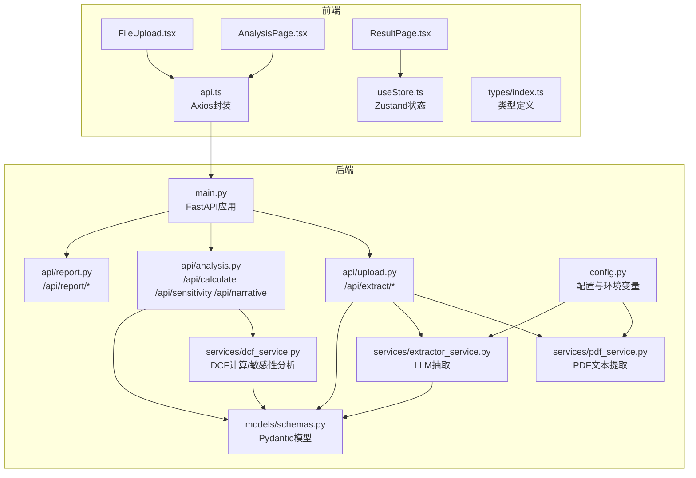
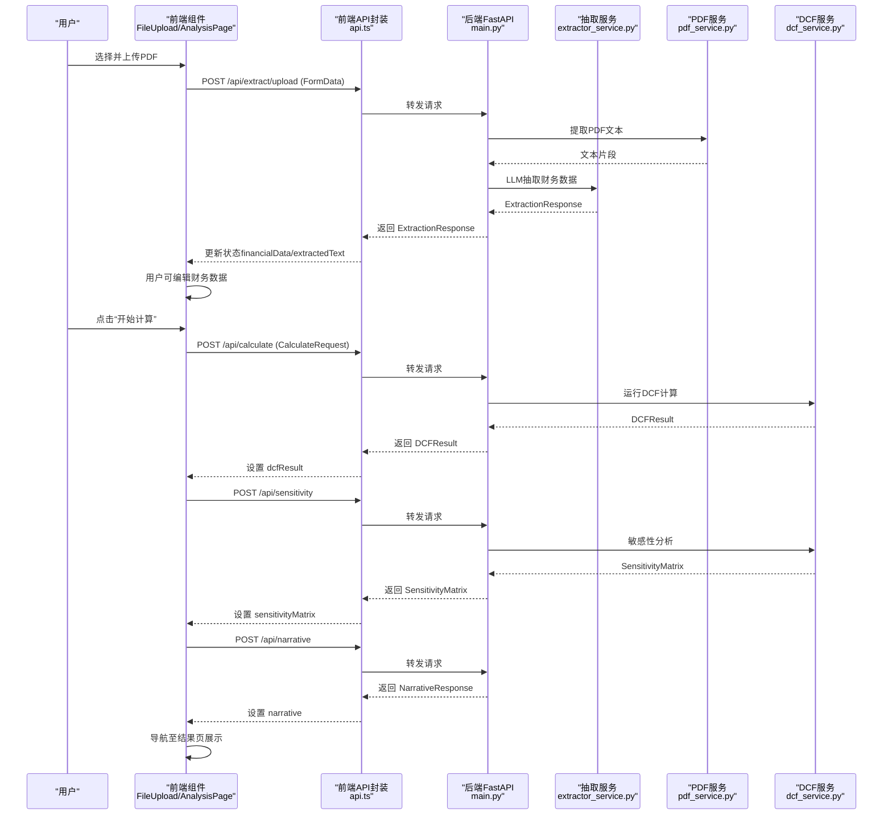
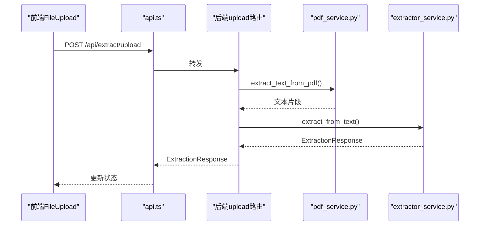
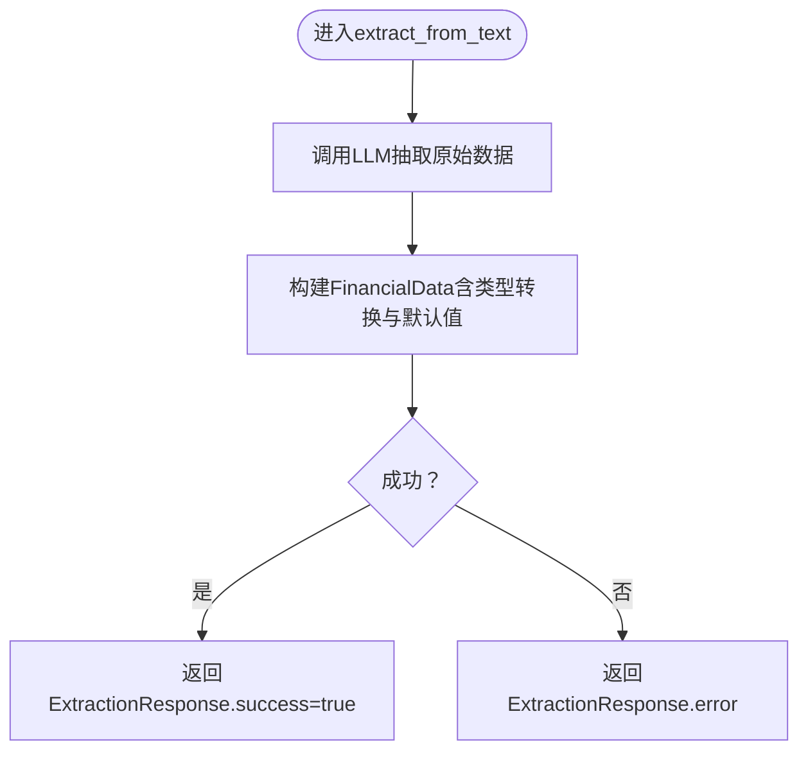
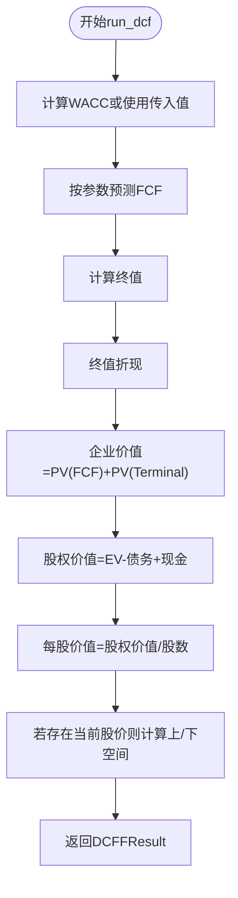
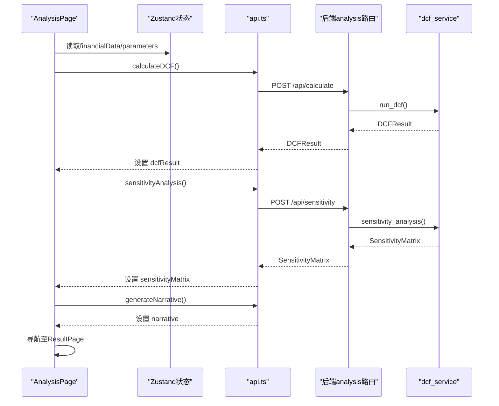
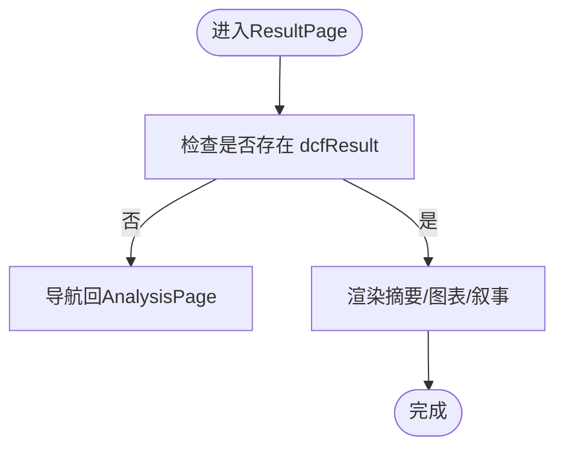
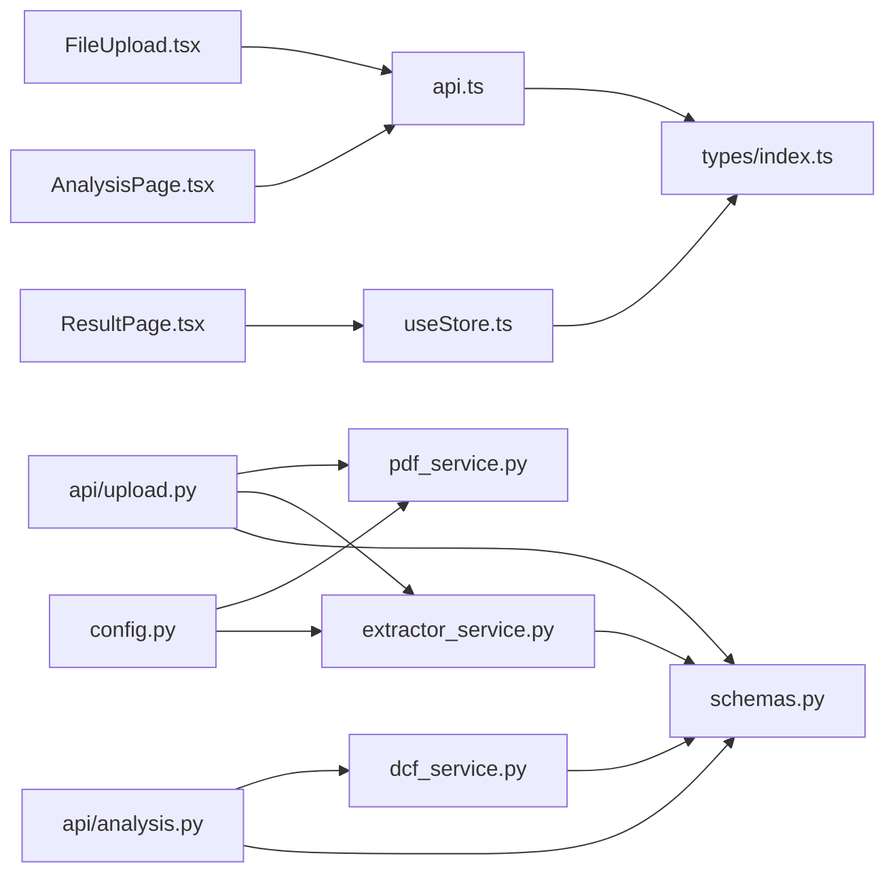
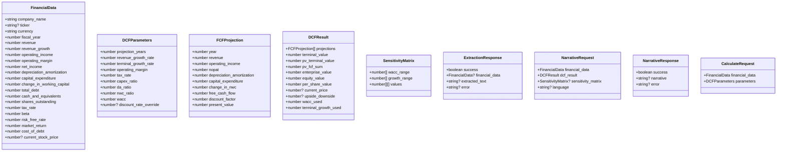

# 数据流设计

<cite>
**本文引用的文件**
- [backend/main.py](file://backend/main.py)
- [backend/api/upload.py](file://backend/api/upload.py)
- [backend/api/analysis.py](file://backend/api/analysis.py)
- [backend/api/report.py](file://backend/api/report.py)
- [backend/models/schemas.py](file://backend/models/schemas.py)
- [backend/services/pdf_service.py](file://backend/services/pdf_service.py)
- [backend/services/extractor_service.py](file://backend/services/extractor_service.py)
- [backend/services/dcf_service.py](file://backend/services/dcf_service.py)
- [backend/config.py](file://backend/config.py)
- [frontend/src/services/api.ts](file://frontend/src/services/api.ts)
- [frontend/src/store/useStore.ts](file://frontend/src/store/useStore.ts)
- [frontend/src/types/index.ts](file://frontend/src/types/index.ts)
- [frontend/src/components/FileUpload.tsx](file://frontend/src/components/FileUpload.tsx)
- [frontend/src/pages/AnalysisPage.tsx](file://frontend/src/pages/AnalysisPage.tsx)
- [frontend/src/pages/ResultPage.tsx](file://frontend/src/pages/ResultPage.tsx)
</cite>

## 目录
1. [引言](#引言)
2. [项目结构](#项目结构)
3. [核心组件](#核心组件)
4. [架构总览](#架构总览)
5. [详细组件分析](#详细组件分析)
6. [依赖分析](#依赖分析)
7. [性能考虑](#性能考虑)
8. [故障排查指南](#故障排查指南)
9. [结论](#结论)
10. [附录](#附录)

## 引言
本文件面向DCF估值智能体项目，提供从用户输入到最终结果输出的完整数据流设计文档。内容覆盖PDF上传与文本提取、AI金融数据解析、DCF计算、敏感性分析、叙事生成与结果展示等环节；同时阐明前后端数据交互模式（API调用、数据传输格式、错误处理）、状态管理中的数据流转（用户输入、中间状态、最终结果）、数据验证与转换机制（前端表单校验、后端Pydantic模型校验、类型转换），以及缓存策略、数据持久化与性能优化的设计考量。

## 项目结构
系统采用前后端分离架构：前端使用React + Ant Design + Zustand进行状态管理与UI交互；后端基于FastAPI提供REST接口，服务层负责PDF文本提取、LLM抽取、DCF计算与敏感性分析。

图表来源
- [backend/main.py:18-34](file://backend/main.py#L18-L34)
- [backend/api/upload.py:13-16](file://backend/api/upload.py#L13-L16)
- [backend/api/analysis.py:15-18](file://backend/api/analysis.py#L15-L18)
- [backend/api/report.py:5-11](file://backend/api/report.py#L5-L11)
- [backend/models/schemas.py:8-101](file://backend/models/schemas.py#L8-L101)
- [backend/services/pdf_service.py:26-67](file://backend/services/pdf_service.py#L26-L67)
- [backend/services/extractor_service.py:27-66](file://backend/services/extractor_service.py#L27-L66)
- [backend/services/dcf_service.py:85-162](file://backend/services/dcf_service.py#L85-L162)
- [backend/config.py:10-22](file://backend/config.py#L10-L22)
- [frontend/src/services/api.ts:28-80](file://frontend/src/services/api.ts#L28-L80)
- [frontend/src/store/useStore.ts:23-73](file://frontend/src/store/useStore.ts#L23-L73)
- [frontend/src/types/index.ts:4-127](file://frontend/src/types/index.ts#L4-L127)

章节来源
- [backend/main.py:18-34](file://backend/main.py#L18-L34)
- [frontend/src/services/api.ts:11-15](file://frontend/src/services/api.ts#L11-L15)

## 核心组件
- 前端服务层（Axios封装）：统一处理请求、超时、错误与响应数据类型映射。
- 状态管理层（Zustand）：集中管理用户输入、参数、计算结果、敏感性矩阵、叙事文本、加载与错误状态。
- 后端API层：提供上传与文本抽取、DCF计算、敏感性分析、叙事生成等接口。
- 服务层：PDF文本提取、LLM抽取、DCF与敏感性分析计算。
- 模型层（Pydantic）：定义输入/输出数据结构与默认值、字段约束与序列化。

章节来源
- [frontend/src/services/api.ts:28-80](file://frontend/src/services/api.ts#L28-L80)
- [frontend/src/store/useStore.ts:23-73](file://frontend/src/store/useStore.ts#L23-L73)
- [backend/api/upload.py:16-54](file://backend/api/upload.py#L16-L54)
- [backend/api/analysis.py:18-44](file://backend/api/analysis.py#L18-L44)
- [backend/models/schemas.py:8-101](file://backend/models/schemas.py#L8-L101)

## 架构总览
下图展示了从用户上传PDF到生成最终结果的端到端数据流，包括前后端交互、数据模型与服务层职责。

图表来源
- [backend/main.py:32-34](file://backend/main.py#L32-L34)
- [backend/api/upload.py:16-38](file://backend/api/upload.py#L16-L38)
- [backend/api/analysis.py:18-44](file://backend/api/analysis.py#L18-L44)
- [backend/services/pdf_service.py:26-67](file://backend/services/pdf_service.py#L26-L67)
- [backend/services/extractor_service.py:27-66](file://backend/services/extractor_service.py#L27-L66)
- [backend/services/dcf_service.py:85-162](file://backend/services/dcf_service.py#L85-L162)
- [frontend/src/services/api.ts:28-80](file://frontend/src/services/api.ts#L28-L80)
- [frontend/src/components/FileUpload.tsx:21-48](file://frontend/src/components/FileUpload.tsx#L21-L48)
- [frontend/src/pages/AnalysisPage.tsx:58-99](file://frontend/src/pages/AnalysisPage.tsx#L58-L99)
- [frontend/src/pages/ResultPage.tsx:35-215](file://frontend/src/pages/ResultPage.tsx#L35-L215)

## 详细组件分析

### 组件A：PDF上传与文本提取
- 前端通过拖拽上传PDF，构造FormData发送至后端。
- 后端接收文件，保存到临时目录，调用PDF服务提取关键财务页面文本，再交由抽取服务通过LLM解析为结构化财务数据。
- 成功时返回包含结构化财务数据与部分原文的响应；失败时返回错误信息。

图表来源
- [frontend/src/components/FileUpload.tsx:21-48](file://frontend/src/components/FileUpload.tsx#L21-L48)
- [frontend/src/services/api.ts:28-40](file://frontend/src/services/api.ts#L28-L40)
- [backend/api/upload.py:16-38](file://backend/api/upload.py#L16-L38)
- [backend/services/pdf_service.py:26-67](file://backend/services/pdf_service.py#L26-L67)
- [backend/services/extractor_service.py:27-66](file://backend/services/extractor_service.py#L27-L66)

章节来源
- [backend/api/upload.py:16-54](file://backend/api/upload.py#L16-L54)
- [backend/services/pdf_service.py:26-67](file://backend/services/pdf_service.py#L26-L67)
- [backend/services/extractor_service.py:27-66](file://backend/services/extractor_service.py#L27-L66)
- [frontend/src/components/FileUpload.tsx:21-48](file://frontend/src/components/FileUpload.tsx#L21-L48)

### 组件B：AI数据解析与结构化
- 抽取服务接收原始文本，调用LLM抽取财务字段，安全地将字符串转换为数值类型，并填充默认值。
- 输出结构化财务数据与部分原文，供后续DCF计算使用。

图表来源
- [backend/services/extractor_service.py:27-66](file://backend/services/extractor_service.py#L27-L66)
- [backend/models/schemas.py:8-30](file://backend/models/schemas.py#L8-L30)

章节来源
- [backend/services/extractor_service.py:11-25](file://backend/services/extractor_service.py#L11-L25)
- [backend/services/extractor_service.py:32-54](file://backend/services/extractor_service.py#L32-L54)
- [backend/models/schemas.py:8-30](file://backend/models/schemas.py#L8-L30)

### 组件C：DCF计算与敏感性分析
- DCF服务根据财务数据与参数计算WACC、自由现金流预测、终值与现值，生成DCF结果。
- 敏感性分析在WACC与终端增长率范围内网格搜索，得到股价敏感性矩阵。

图表来源
- [backend/services/dcf_service.py:85-121](file://backend/services/dcf_service.py#L85-L121)
- [backend/services/dcf_service.py:123-162](file://backend/services/dcf_service.py#L123-L162)

章节来源
- [backend/services/dcf_service.py:12-34](file://backend/services/dcf_service.py#L12-L34)
- [backend/services/dcf_service.py:37-76](file://backend/services/dcf_service.py#L37-L76)
- [backend/services/dcf_service.py:79-83](file://backend/services/dcf_service.py#L79-L83)
- [backend/services/dcf_service.py:85-121](file://backend/services/dcf_service.py#L85-L121)
- [backend/services/dcf_service.py:123-162](file://backend/services/dcf_service.py#L123-L162)

### 组件D：前后端数据交互与状态管理
- 前端通过api.ts封装的函数调用后端接口，统一处理错误与超时。
- 使用Zustand集中管理财务数据、参数、结果、敏感性矩阵、叙事文本、语言与主题等状态。
- AnalysisPage串联计算、敏感性分析与叙事生成三步流程，完成后跳转结果页。

图表来源
- [frontend/src/pages/AnalysisPage.tsx:58-99](file://frontend/src/pages/AnalysisPage.tsx#L58-L99)
- [frontend/src/services/api.ts:51-80](file://frontend/src/services/api.ts#L51-L80)
- [backend/api/analysis.py:18-44](file://backend/api/analysis.py#L18-L44)
- [backend/services/dcf_service.py:85-162](file://backend/services/dcf_service.py#L85-L162)
- [frontend/src/store/useStore.ts:23-73](file://frontend/src/store/useStore.ts#L23-L73)

章节来源
- [frontend/src/services/api.ts:11-26](file://frontend/src/services/api.ts#L11-L26)
- [frontend/src/store/useStore.ts:23-73](file://frontend/src/store/useStore.ts#L23-L73)
- [frontend/src/pages/AnalysisPage.tsx:58-99](file://frontend/src/pages/AnalysisPage.tsx#L58-L99)

### 组件E：结果展示与可视化
- ResultPage读取Zustand中的财务数据与DCF结果，渲染摘要卡片、现金流趋势图、敏感性热力图与水位图，并展示AI生成的叙事文本。
- 支持返回上一页与导出占位功能。

图表来源
- [frontend/src/pages/ResultPage.tsx:40-42](file://frontend/src/pages/ResultPage.tsx#L40-L42)
- [frontend/src/pages/ResultPage.tsx:91-215](file://frontend/src/pages/ResultPage.tsx#L91-L215)

章节来源
- [frontend/src/pages/ResultPage.tsx:35-215](file://frontend/src/pages/ResultPage.tsx#L35-L215)

## 依赖分析
- 前端依赖关系：组件依赖Zustand状态、api封装与类型定义；api封装依赖Axios与错误处理。
- 后端依赖关系：API路由依赖服务层；服务层依赖模型层与配置；PDF与抽取服务依赖外部LLM与第三方库。
- 关键耦合点：前端与后端通过统一的Pydantic模型定义的数据契约交互；后端内部服务层解耦，便于替换LLM或计算算法。

图表来源
- [frontend/src/services/api.ts:11-15](file://frontend/src/services/api.ts#L11-L15)
- [frontend/src/types/index.ts:4-127](file://frontend/src/types/index.ts#L4-L127)
- [frontend/src/store/useStore.ts:23-73](file://frontend/src/store/useStore.ts#L23-L73)
- [backend/api/upload.py:16-38](file://backend/api/upload.py#L16-L38)
- [backend/api/analysis.py:18-44](file://backend/api/analysis.py#L18-L44)
- [backend/models/schemas.py:8-101](file://backend/models/schemas.py#L8-L101)
- [backend/services/pdf_service.py:26-67](file://backend/services/pdf_service.py#L26-L67)
- [backend/services/extractor_service.py:27-66](file://backend/services/extractor_service.py#L27-L66)
- [backend/services/dcf_service.py:85-162](file://backend/services/dcf_service.py#L85-L162)
- [backend/config.py:10-22](file://backend/config.py#L10-L22)

章节来源
- [backend/models/schemas.py:8-101](file://backend/models/schemas.py#L8-L101)
- [backend/config.py:10-22](file://backend/config.py#L10-L22)

## 性能考虑
- PDF文本提取：按关键词相关度排序页面，限制最大字符数与页面数量，避免一次性处理全量内容导致内存与时间开销过大。
- LLM抽取：对原始文本截断与清洗，减少上下文长度，提高响应速度与稳定性。
- DCF计算：向量化与循环内计算尽量复用中间值，避免重复计算；敏感性分析采用网格遍历，建议在参数范围与粒度上做权衡。
- 前端交互：分步计算与加载提示，避免长时间阻塞；结果页图表懒加载与轻量渲染。
- 缓存策略：当前未见显式缓存实现，可在LLM抽取与敏感性分析结果层面引入短期缓存（如内存缓存）以降低重复请求成本。
- 数据持久化：数据库脚本与示例存在但未在运行时直接使用，建议在需要长期保存历史计算记录时启用持久化。

章节来源
- [backend/services/pdf_service.py:26-67](file://backend/services/pdf_service.py#L26-L67)
- [backend/services/extractor_service.py:27-66](file://backend/services/extractor_service.py#L27-L66)
- [backend/services/dcf_service.py:123-162](file://backend/services/dcf_service.py#L123-L162)
- [frontend/src/pages/AnalysisPage.tsx:58-99](file://frontend/src/pages/AnalysisPage.tsx#L58-L99)

## 故障排查指南
- 前端错误处理：api.ts统一捕获Axios错误，优先使用后端返回的detail，否则回退到message或网络错误。
- 后端错误处理：上传与抽取接口在异常时返回ExtractionResponse.error；分析接口在异常时抛出HTTP 500并携带错误详情。
- 常见问题定位：
  - PDF上传失败：检查文件类型、后端临时目录权限与磁盘空间。
  - 文本提取为空：确认PDF是否包含财务类页面，查看日志中相关统计信息。
  - LLM抽取失败：检查环境变量与模型配置，确认网络连通性。
  - 计算异常：核对财务数据与参数边界条件（如WACC需大于终端增长率）。

章节来源
- [frontend/src/services/api.ts:17-26](file://frontend/src/services/api.ts#L17-L26)
- [backend/api/upload.py:38-39](file://backend/api/upload.py#L38-L39)
- [backend/api/analysis.py:22-23](file://backend/api/analysis.py#L22-L23)
- [backend/config.py:10-22](file://backend/config.py#L10-L22)

## 结论
本项目通过清晰的前后端分层与统一的数据契约，实现了从PDF上传到DCF结果可视化的完整闭环。前端以Zustand集中管理状态，后端以服务层解耦业务逻辑，配合Pydantic模型确保数据一致性。未来可在LLM抽取与敏感性分析结果层面引入缓存、在需要时接入数据库持久化，并进一步优化大文件与长文本处理的性能与稳定性。

## 附录

### 数据模型与类型定义概览
- 前端类型与后端模型保持一致，确保跨端数据交换的强类型约束。
- 关键模型：FinancialData、DCFParameters、FCFProjection、DCFResult、SensitivityMatrix、ExtractionResponse、NarrativeRequest/NarrativeResponse、CalculateRequest。

图表来源
- [backend/models/schemas.py:8-101](file://backend/models/schemas.py#L8-L101)
- [frontend/src/types/index.ts:4-127](file://frontend/src/types/index.ts#L4-L127)