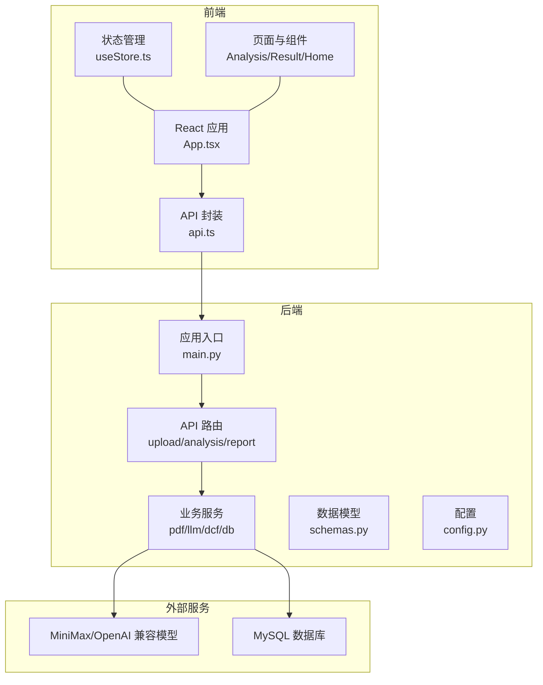
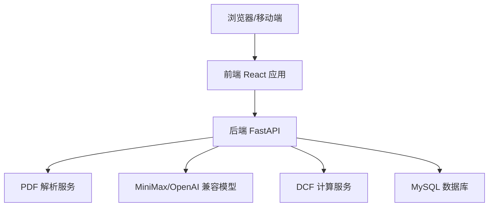
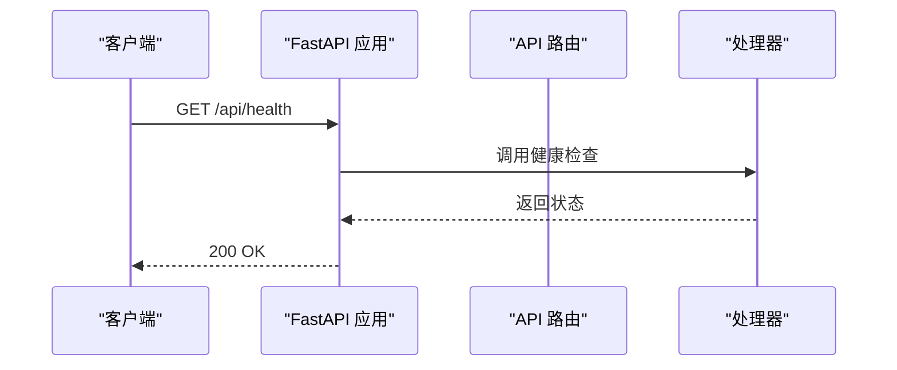
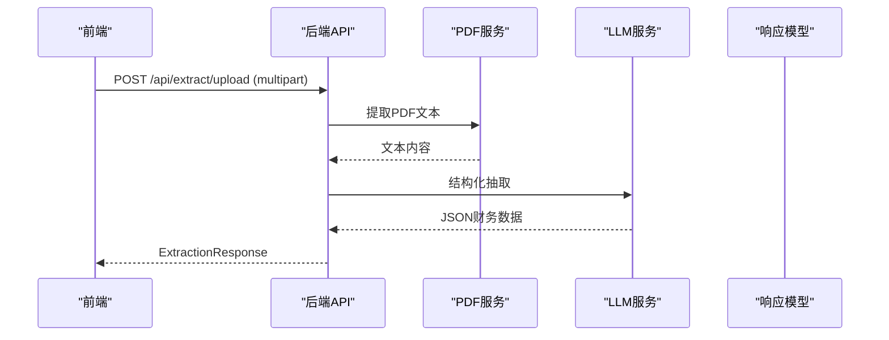
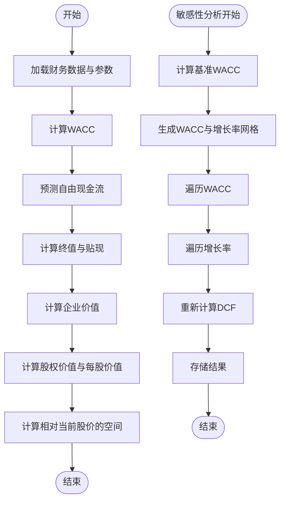
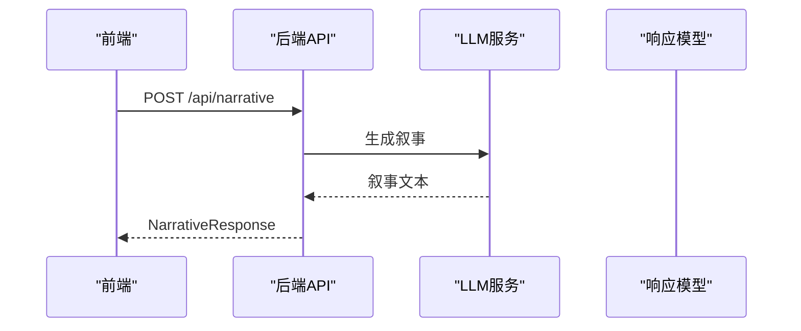
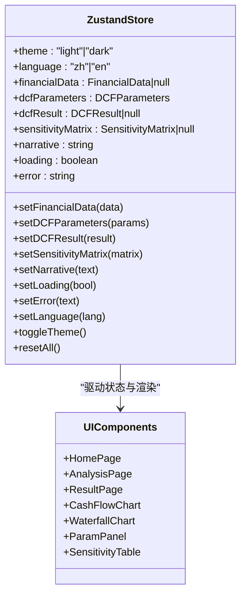
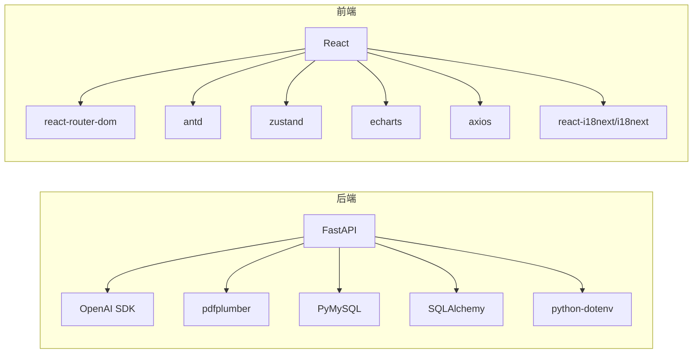
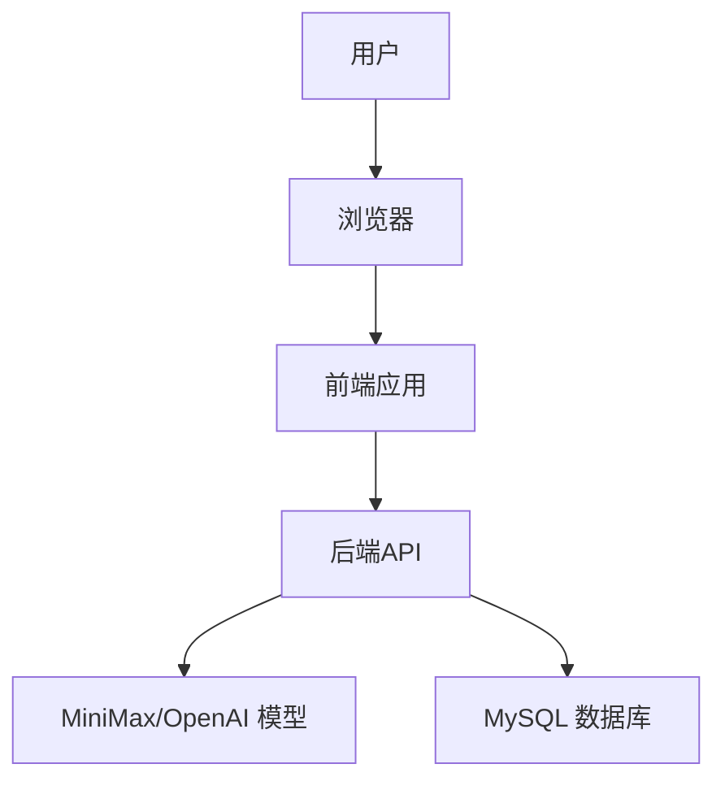
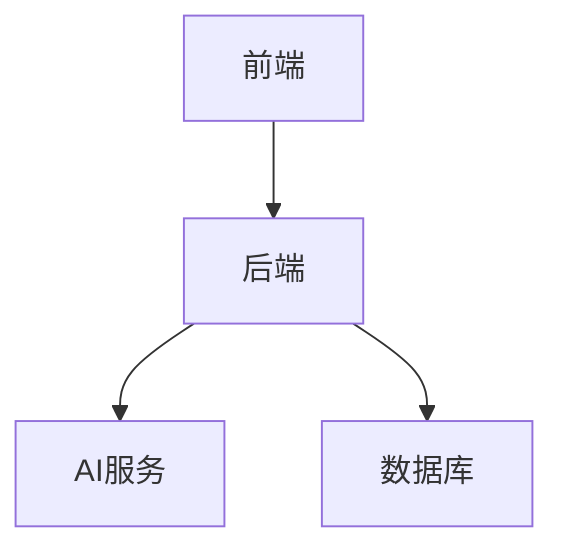

# 架构设计

<cite>
**本文引用的文件**
- [backend/main.py](file://backend/main.py)
- [backend/api/upload.py](file://backend/api/upload.py)
- [backend/api/analysis.py](file://backend/api/analysis.py)
- [backend/api/report.py](file://backend/api/report.py)
- [backend/models/schemas.py](file://backend/models/schemas.py)
- [backend/services/dcf_service.py](file://backend/services/dcf_service.py)
- [backend/services/pdf_service.py](file://backend/services/pdf_service.py)
- [backend/services/llm_service.py](file://backend/services/llm_service.py)
- [backend/services/db_service.py](file://backend/services/db_service.py)
- [backend/config.py](file://backend/config.py)
- [backend/requirements.txt](file://backend/requirements.txt)
- [frontend/src/App.tsx](file://frontend/src/App.tsx)
- [frontend/src/store/useStore.ts](file://frontend/src/store/useStore.ts)
- [frontend/src/services/api.ts](file://frontend/src/services/api.ts)
- [frontend/package.json](file://frontend/package.json)
</cite>

## 目录
1. [引言](#引言)
2. [项目结构](#项目结构)
3. [核心组件](#核心组件)
4. [架构总览](#架构总览)
5. [详细组件分析](#详细组件分析)
6. [依赖分析](#依赖分析)
7. [性能考量](#性能考量)
8. [故障排查指南](#故障排查指南)
9. [结论](#结论)
10. [附录](#附录)

## 引言
本项目为“DCF估值智能体”，目标是通过自然语言处理与财务建模，对财务报告进行结构化抽取、DCF估值计算、敏感性分析与叙事生成，并以可视化图表呈现结果。系统采用前后端分离的微服务架构：后端使用FastAPI提供RESTful API；前端使用React + TypeScript构建单页应用；AI服务通过MiniMax（OpenAI兼容）模型完成文本抽取与叙事生成；数据库采用MySQL存储结构化财务数据。

## 项目结构
- 后端（Python/FastAPI）
  - 应用入口与路由注册、CORS中间件、健康检查
  - API模块：上传与抽取、分析（DCF/敏感性/叙事）、报告占位
  - 服务层：PDF文本抽取、LLM抽取与叙事、DCF计算、数据库访问
  - 数据模型：Pydantic定义的请求/响应结构
  - 配置：环境变量读取（AI密钥、数据库连接、上传目录）
- 前端（React + TypeScript）
  - 页面与组件：首页、分析页、结果页与可视化图表组件
  - 状态管理：Zustand轻量状态容器
  - API封装：Axios客户端，统一错误处理
  - 国际化与主题：Ant Design + react-i18next + Zustand主题切换

**图示来源**
- [backend/main.py:18-39](file://backend/main.py#L18-L39)
- [backend/api/upload.py:13-54](file://backend/api/upload.py#L13-L54)
- [backend/api/analysis.py:15-44](file://backend/api/analysis.py#L15-L44)
- [backend/api/report.py:5-11](file://backend/api/report.py#L5-L11)
- [backend/services/pdf_service.py:26-67](file://backend/services/pdf_service.py#L26-L67)
- [backend/services/llm_service.py:70-155](file://backend/services/llm_service.py#L70-L155)
- [backend/services/db_service.py:24-345](file://backend/services/db_service.py#L24-L345)
- [backend/models/schemas.py:8-101](file://backend/models/schemas.py#L8-L101)
- [backend/config.py:10-22](file://backend/config.py#L10-L22)
- [frontend/src/App.tsx:105-147](file://frontend/src/App.tsx#L105-L147)
- [frontend/src/store/useStore.ts:23-73](file://frontend/src/store/useStore.ts#L23-L73)
- [frontend/src/services/api.ts:11-80](file://frontend/src/services/api.ts#L11-L80)

**章节来源**
- [backend/main.py:18-39](file://backend/main.py#L18-L39)
- [frontend/src/App.tsx:105-147](file://frontend/src/App.tsx#L105-L147)

## 核心组件
- 后端应用与路由
  - 应用生命周期：启动时确保上传目录存在
  - CORS策略：允许任意来源、方法与头
  - 路由前缀统一为/api，分别挂载上传/抽取、分析、报告模块
- API层
  - 上传与抽取：支持PDF上传与纯文本输入两种路径
  - 分析：DCF计算、敏感性分析、叙事生成
  - 报告：占位接口，预留导出能力
- 服务层
  - PDF解析：按关键词相关度选取关键页面，限制最大字符数
  - LLM抽取与叙事：MiniMax模型，抽取结构化财务数据与生成专业叙事
  - DCF计算：WACC计算、自由现金流预测、终值与企业/股权价值
  - 数据库：提供股票、财务报表、历史价格等数据的增删改查与查询聚合
- 前端
  - 路由与导航：Ant Design布局与菜单
  - 状态管理：Zustand集中管理主题、语言、财务数据、参数、结果、加载与错误
  - API调用：Axios封装，统一超时与错误处理
  - 可视化：ECharts图表组件用于现金流瀑布图与敏感性矩阵展示

**章节来源**
- [backend/main.py:12-39](file://backend/main.py#L12-L39)
- [backend/api/upload.py:16-54](file://backend/api/upload.py#L16-L54)
- [backend/api/analysis.py:18-44](file://backend/api/analysis.py#L18-L44)
- [backend/api/report.py:8-11](file://backend/api/report.py#L8-L11)
- [backend/services/pdf_service.py:26-67](file://backend/services/pdf_service.py#L26-L67)
- [backend/services/llm_service.py:70-155](file://backend/services/llm_service.py#L70-L155)
- [backend/services/dcf_service.py:85-162](file://backend/services/dcf_service.py#L85-L162)
- [backend/services/db_service.py:24-345](file://backend/services/db_service.py#L24-L345)
- [frontend/src/store/useStore.ts:23-73](file://frontend/src/store/useStore.ts#L23-L73)
- [frontend/src/services/api.ts:11-80](file://frontend/src/services/api.ts#L11-L80)

## 架构总览
系统采用前后端分离的微服务架构：
- 前端React应用负责用户界面、状态管理与API调用
- 后端FastAPI提供REST API，路由到各业务服务
- AI服务集成：通过MiniMax/OpenAI兼容接口完成结构化抽取与叙事生成
- 数据库层：MySQL存储财务与市场数据，供查询与持久化

**图示来源**
- [backend/main.py:32-34](file://backend/main.py#L32-L34)
- [backend/services/pdf_service.py:26-67](file://backend/services/pdf_service.py#L26-L67)
- [backend/services/llm_service.py:70-155](file://backend/services/llm_service.py#L70-L155)
- [backend/services/dcf_service.py:85-162](file://backend/services/dcf_service.py#L85-L162)
- [backend/services/db_service.py:24-345](file://backend/services/db_service.py#L24-L345)

## 详细组件分析

### 后端应用与路由
- 应用初始化：设置标题、版本、生命周期钩子，确保上传目录存在
- 中间件：启用CORS，允许任意来源与方法
- 路由注册：include_router挂载三个模块，统一前缀/api
- 健康检查：/api/health返回服务状态

**图示来源**
- [backend/main.py:37-39](file://backend/main.py#L37-L39)

**章节来源**
- [backend/main.py:18-39](file://backend/main.py#L18-L39)

### 上传与抽取流程
- 支持两种输入：
  - PDF上传：保存到临时目录，解析文本，调用抽取服务
  - 文本输入：直接调用抽取服务
- 抽取服务：将文本传入LLM，解析为结构化财务数据，返回统一响应模型

**图示来源**
- [backend/api/upload.py:16-54](file://backend/api/upload.py#L16-L54)
- [backend/services/pdf_service.py:26-67](file://backend/services/pdf_service.py#L26-L67)
- [backend/services/llm_service.py:94-122](file://backend/services/llm_service.py#L94-L122)
- [backend/models/schemas.py:78-82](file://backend/models/schemas.py#L78-L82)

**章节来源**
- [backend/api/upload.py:16-54](file://backend/api/upload.py#L16-L54)
- [backend/services/pdf_service.py:26-67](file://backend/services/pdf_service.py#L26-L67)
- [backend/services/llm_service.py:94-122](file://backend/services/llm_service.py#L94-L122)
- [backend/models/schemas.py:78-82](file://backend/models/schemas.py#L78-L82)

### DCF计算与敏感性分析
- DCF计算：根据财务数据与参数计算WACC、自由现金流、终值、企业价值与股权价值，并评估相对当前股价的上/下空间
- 敏感性分析：在WACC与终值增长率范围内进行网格扫描，输出股价敏感性矩阵

**图示来源**
- [backend/services/dcf_service.py:12-121](file://backend/services/dcf_service.py#L12-L121)
- [backend/services/dcf_service.py:123-162](file://backend/services/dcf_service.py#L123-L162)

**章节来源**
- [backend/services/dcf_service.py:85-162](file://backend/services/dcf_service.py#L85-L162)

### 叙事生成流程
- 输入：财务数据与DCF结果（可选敏感性矩阵）
- 处理：构造提示词，调用LLM生成专业分析文本
- 输出：叙事文本封装为响应模型

**图示来源**
- [backend/api/analysis.py:34-44](file://backend/api/analysis.py#L34-L44)
- [backend/services/llm_service.py:129-154](file://backend/services/llm_service.py#L129-L154)
- [backend/models/schemas.py:92-95](file://backend/models/schemas.py#L92-L95)

**章节来源**
- [backend/api/analysis.py:34-44](file://backend/api/analysis.py#L34-L44)
- [backend/services/llm_service.py:129-154](file://backend/services/llm_service.py#L129-L154)
- [backend/models/schemas.py:92-95](file://backend/models/schemas.py#L92-L95)

### 前端状态管理与UI
- 状态模型：主题、语言、财务数据、DCF参数、结果、敏感性矩阵、叙事、加载与错误
- 默认参数：投影年数、营收增长率、终值增长率、运营利润率、税率、CAPEX/折旧/NWC比率、WACC
- 主题切换：Zustand驱动Ant Design主题算法切换
- API封装：Axios实例，统一超时与错误处理

**图示来源**
- [frontend/src/store/useStore.ts:23-73](file://frontend/src/store/useStore.ts#L23-L73)
- [frontend/src/App.tsx:105-147](file://frontend/src/App.tsx#L105-L147)

**章节来源**
- [frontend/src/store/useStore.ts:11-73](file://frontend/src/store/useStore.ts#L11-L73)
- [frontend/src/App.tsx:21-103](file://frontend/src/App.tsx#L21-L103)
- [frontend/src/services/api.ts:11-80](file://frontend/src/services/api.ts#L11-L80)

## 依赖分析
- 后端依赖
  - Web框架：FastAPI + Uvicorn
  - AI/HTTP：OpenAI SDK（MiniMax兼容）、HTTPX
  - PDF：pdfplumber
  - 数据库：PyMySQL + SQLAlchemy（版本约束）
  - 配置：python-dotenv
- 前端依赖
  - React生态：react、react-router-dom、antd、@ant-design/icons
  - 状态：zustand
  - 图表：echarts、echarts-for-react
  - 国际化：react-i18next、i18next、语言检测
  - 网络：axios
  - 构建：Vite + TailwindCSS + TypeScript

**图示来源**
- [backend/requirements.txt:1-11](file://backend/requirements.txt#L1-L11)
- [frontend/package.json:11-35](file://frontend/package.json#L11-L35)

**章节来源**
- [backend/requirements.txt:1-11](file://backend/requirements.txt#L1-L11)
- [frontend/package.json:11-35](file://frontend/package.json#L11-L35)

## 性能考量
- API超时与并发
  - 前端Axios默认超时120秒，上传PDF场景提升至180秒
  - 后端Uvicorn标准启动，建议在生产环境结合反向代理与并发进程
- PDF解析与LLM调用
  - PDF解析限制最大字符数，避免大文本导致LLM输入超限
  - LLM温度与token上限控制输出稳定性与成本
- DCF计算复杂度
  - 年限与网格规模线性影响计算时间，建议在参数面板限制范围
- 数据库访问
  - 使用连接池与事务回滚，避免长事务与重复键冲突
- 前端渲染
  - 图表组件按需渲染，状态重置减少不必要更新

[本节为通用性能指导，无需特定文件来源]

## 故障排查指南
- 健康检查失败
  - 检查后端是否正常启动与CORS配置
- PDF上传失败
  - 确认文件类型为PDF，上传目录权限，解析异常日志
- LLM抽取失败
  - 检查MiniMax密钥与Base URL，查看日志中的JSON解析错误
- DCF计算异常
  - 参数校验：WACC与终值增长率需满足数学约束
- 数据库连接问题
  - 检查环境变量与主机连通性，确认表结构与索引

**章节来源**
- [backend/main.py:37-39](file://backend/main.py#L37-L39)
- [backend/api/upload.py:19-42](file://backend/api/upload.py#L19-L42)
- [backend/services/llm_service.py:117-122](file://backend/services/llm_service.py#L117-L122)
- [backend/services/dcf_service.py:80-82](file://backend/services/dcf_service.py#L80-L82)
- [backend/services/db_service.py:34-46](file://backend/services/db_service.py#L34-L46)

## 结论
本项目通过清晰的前后端分层、RESTful API设计与AI服务集成，实现了从财务报告到DCF估值与叙事生成的完整闭环。FastAPI提供了高性能与良好的类型安全，Zustand简化了前端状态管理，MiniMax模型保证了抽取与叙事质量，MySQL支撑了结构化数据的持久化与查询。后续可在可观测性、缓存与弹性扩展方面进一步增强。

[本节为总结性内容，无需特定文件来源]

## 附录

### 系统上下文图

[本图为概念性上下文图，无需图示来源]

### 组件分解图

[本图为概念性组件图，无需图示来源]

### 技术栈与版本兼容性
- 后端
  - Python 3.x（建议3.10+）
  - FastAPI 0.115.0
  - Uvicorn 0.30.6
  - OpenAI SDK 兼容MiniMax
  - pdfplumber 0.11.4
  - PyMySQL >=1.1.0
  - SQLAlchemy >=2.0.0
  - python-dotenv 1.0.1
- 前端
  - React 18.3.1
  - react-router-dom 6.26.0
  - Ant Design 5.20.0
  - zustand 4.5.0
  - echarts 5.5.0
  - axios 1.7.0
  - react-i18next 15.0.0
  - Vite 5.4.0
  - TailwindCSS 3.4.0
  - TypeScript 5.5.0

**章节来源**
- [backend/requirements.txt:1-11](file://backend/requirements.txt#L1-L11)
- [frontend/package.json:11-35](file://frontend/package.json#L11-L35)