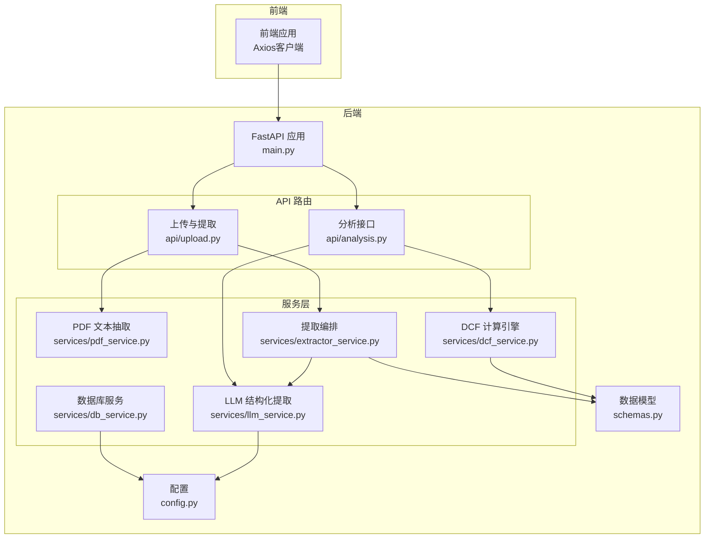
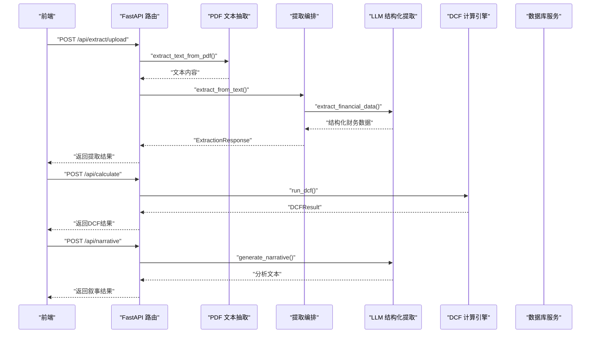
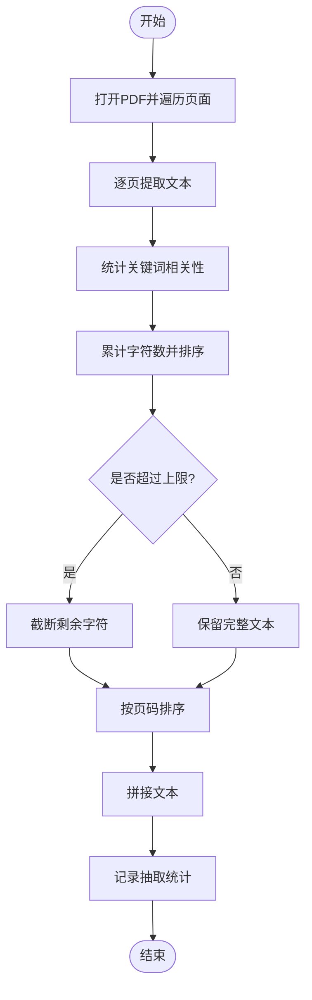
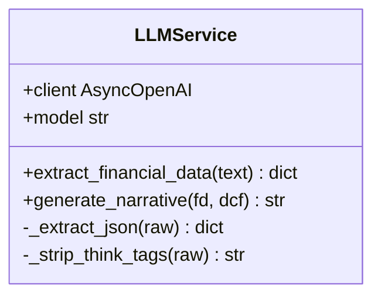
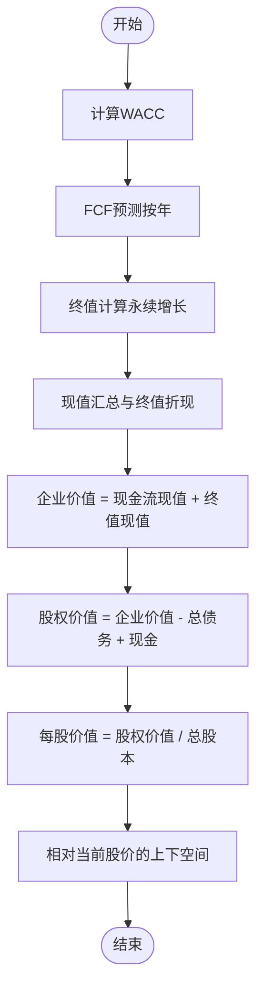
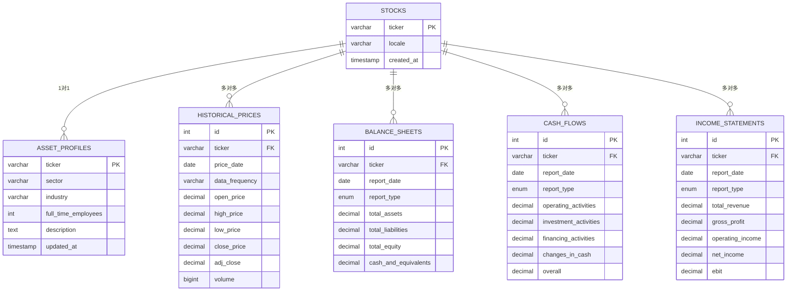
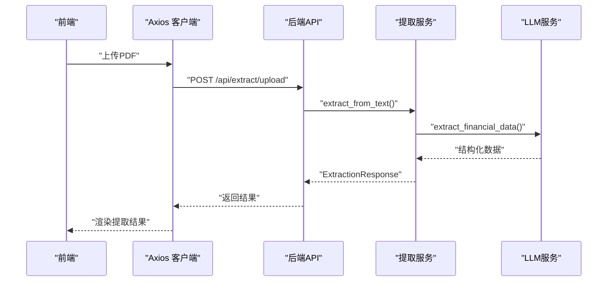
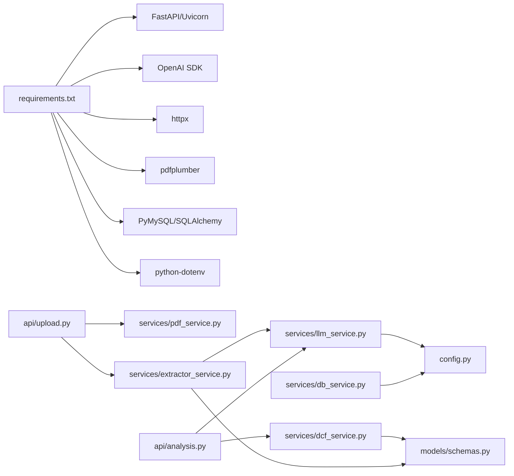

# 集成模式

<cite>
**本文引用的文件**
- [backend/main.py](file://backend/main.py)
- [backend/config.py](file://backend/config.py)
- [backend/models/schemas.py](file://backend/models/schemas.py)
- [backend/services/dcf_service.py](file://backend/services/dcf_service.py)
- [backend/services/llm_service.py](file://backend/services/llm_service.py)
- [backend/services/pdf_service.py](file://backend/services/pdf_service.py)
- [backend/services/extractor_service.py](file://backend/services/extractor_service.py)
- [backend/services/db_service.py](file://backend/services/db_service.py)
- [backend/api/upload.py](file://backend/api/upload.py)
- [backend/api/analysis.py](file://backend/api/analysis.py)
- [backend/examples/integration_example.py](file://backend/examples/integration_example.py)
- [backend/init_db.py](file://backend/init_db.py)
- [backend/DATABASE_README.md](file://backend/DATABASE_README.md)
- [backend/requirements.txt](file://backend/requirements.txt)
- [frontend/src/services/api.ts](file://frontend/src/services/api.ts)
</cite>

## 目录
1. [简介](#简介)
2. [项目结构](#项目结构)
3. [核心组件](#核心组件)
4. [架构总览](#架构总览)
5. [组件详细分析](#组件详细分析)
6. [依赖关系分析](#依赖关系分析)
7. [性能考量](#性能考量)
8. [故障排查指南](#故障排查指南)
9. [结论](#结论)
10. [附录](#附录)

## 简介
本文件面向DCF估值智能体项目的集成模式，系统性阐述后端FastAPI服务、AI服务（MiniMax LLM）、PDF处理服务、DCF计算引擎以及数据库服务的协作架构；明确微服务边界、服务间通信协议、依赖注入与配置管理；总结第三方服务集成（MiniMax、pdfplumber、MySQL）与分布式设计要点（服务发现、负载均衡、熔断与重试）。文档同时提供架构图与组件依赖关系说明，帮助开发者快速理解与扩展系统。

## 项目结构
后端采用分层与功能模块化组织：
- 应用入口与路由：FastAPI应用在入口文件中注册路由与中间件，并在生命周期内准备上传目录。
- API层：按功能拆分为上传与提取、分析（DCF计算、敏感性分析、叙事生成）两个路由器。
- 服务层：围绕业务能力拆分，包括PDF文本抽取、LLM结构化提取、DCF计算、数据库访问等。
- 数据模型：使用Pydantic模型定义请求/响应数据结构。
- 配置与环境：通过dotenv加载外部密钥与数据库参数。
- 示例与初始化：提供数据库初始化脚本与集成示例，展示如何将历史数据持久化与检索。

图表来源
- [backend/main.py:18-34](file://backend/main.py#L18-L34)
- [backend/api/upload.py:13-13](file://backend/api/upload.py#L13-L13)
- [backend/api/analysis.py:15-15](file://backend/api/analysis.py#L15-L15)
- [backend/services/pdf_service.py:26-67](file://backend/services/pdf_service.py#L26-L67)
- [backend/services/extractor_service.py:27-66](file://backend/services/extractor_service.py#L27-L66)
- [backend/services/llm_service.py:70-76](file://backend/services/llm_service.py#L70-L76)
- [backend/services/dcf_service.py:85-120](file://backend/services/dcf_service.py#L85-L120)
- [backend/services/db_service.py:24-46](file://backend/services/db_service.py#L24-L46)
- [backend/config.py:10-21](file://backend/config.py#L10-L21)
- [backend/models/schemas.py:8-101](file://backend/models/schemas.py#L8-L101)

章节来源
- [backend/main.py:18-40](file://backend/main.py#L18-L40)
- [backend/api/upload.py:13-55](file://backend/api/upload.py#L13-L55)
- [backend/api/analysis.py:15-45](file://backend/api/analysis.py#L15-L45)
- [backend/models/schemas.py:8-101](file://backend/models/schemas.py#L8-L101)
- [backend/config.py:10-21](file://backend/config.py#L10-L21)

## 核心组件
- FastAPI 应用与路由
  - 注册CORS中间件，开放跨域访问。
  - 在应用生命周期内确保上传目录存在。
  - 将上传/提取与分析路由挂载至统一前缀。
- 配置中心
  - 加载dotenv，读取MiniMax API密钥、基础URL、模型名与MySQL连接参数。
  - 统一管理上传目录路径。
- 数据模型
  - 定义财务数据、DCF参数、投影、结果、敏感性矩阵及API请求/响应模型。
- 服务编排
  - PDF文本抽取：按关键词匹配页面相关性，限制最大字符数并排序选取。
  - LLM结构化提取：统一系统提示词，解析JSON输出，支持叙事生成。
  - DCF计算引擎：WACC计算、自由现金流预测、终值与现值计算、敏感性分析。
  - 数据库服务：提供股票、公司档案、财务报表、历史价格的增删改查与事务回滚。
- API接口
  - 上传PDF并提取文本，再进行结构化提取。
  - 直接对文本进行结构化提取。
  - DCF计算、敏感性分析、叙事生成。

章节来源
- [backend/main.py:18-40](file://backend/main.py#L18-L40)
- [backend/config.py:10-21](file://backend/config.py#L10-L21)
- [backend/models/schemas.py:8-101](file://backend/models/schemas.py#L8-L101)
- [backend/services/pdf_service.py:26-67](file://backend/services/pdf_service.py#L26-L67)
- [backend/services/llm_service.py:70-155](file://backend/services/llm_service.py#L70-L155)
- [backend/services/dcf_service.py:12-163](file://backend/services/dcf_service.py#L12-L163)
- [backend/services/db_service.py:24-345](file://backend/services/db_service.py#L24-L345)
- [backend/api/upload.py:16-55](file://backend/api/upload.py#L16-L55)
- [backend/api/analysis.py:18-45](file://backend/api/analysis.py#L18-L45)

## 架构总览
系统采用“API网关 + 微服务”风格的单体后端实现，核心服务通过API路由解耦，内部通过服务层协作完成端到端流程。前端通过Axios调用后端REST接口，后端通过AsyncOpenAI与pdfplumber等外部依赖交互。

图表来源
- [backend/api/upload.py:16-43](file://backend/api/upload.py#L16-L43)
- [backend/api/analysis.py:18-44](file://backend/api/analysis.py#L18-L44)
- [backend/services/pdf_service.py:26-67](file://backend/services/pdf_service.py#L26-L67)
- [backend/services/extractor_service.py:27-66](file://backend/services/extractor_service.py#L27-L66)
- [backend/services/llm_service.py:94-123](file://backend/services/llm_service.py#L94-L123)
- [backend/services/dcf_service.py:85-120](file://backend/services/dcf_service.py#L85-L120)
- [backend/services/db_service.py:24-46](file://backend/services/db_service.py#L24-L46)

## 组件详细分析

### PDF处理服务
- 关键逻辑
  - 识别财务关键词，统计页面相关性得分。
  - 限制最大抽取字符数，优先选择高相关性页面。
  - 按页码顺序拼接文本，记录抽取统计信息。
- 复杂度与性能
  - 页面遍历O(N)，相关性计算O(K)（K为关键词数量），总体近似O(N·K)。
  - 字符数上限控制避免LLM输入过长。
- 错误处理
  - 单页解析异常时跳过该页，保证流程连续性。

图表来源
- [backend/services/pdf_service.py:26-67](file://backend/services/pdf_service.py#L26-L67)

章节来源
- [backend/services/pdf_service.py:26-67](file://backend/services/pdf_service.py#L26-L67)

### LLM服务（MiniMax）
- 集成模式
  - 使用AsyncOpenAI客户端，配置MiniMax基础URL与模型名。
  - 提供结构化提取与叙事生成两类能力。
  - JSON解析增强：去除思考标签与代码围栏，定位首个JSON对象。
- 错误处理
  - JSON解析失败抛出明确异常；其他异常记录日志并上抛。
- 参数与提示词
  - 提供财务提取系统提示词与叙事系统提示词，确保输出格式与语言一致性。

图表来源
- [backend/services/llm_service.py:70-155](file://backend/services/llm_service.py#L70-L155)

章节来源
- [backend/services/llm_service.py:70-155](file://backend/services/llm_service.py#L70-L155)
- [backend/config.py:10-12](file://backend/config.py#L10-L12)

### DCF计算引擎
- 核心算法
  - WACC计算：支持显式覆盖与基于CAPM的自动计算。
  - 自由现金流预测：按年份推进，计算NOPAT、DA、Capex、NWC变化与FCF。
  - 终值与现值：永续增长模型与贴现因子。
  - 敏感性分析：在WACC与终端增长率范围内网格扫描，输出二维矩阵。
- 数据结构
  - 使用Pydantic模型承载输入参数与输出结果，确保类型安全与序列化。

图表来源
- [backend/services/dcf_service.py:12-163](file://backend/services/dcf_service.py#L12-L163)
- [backend/models/schemas.py:32-101](file://backend/models/schemas.py#L32-L101)

章节来源
- [backend/services/dcf_service.py:12-163](file://backend/services/dcf_service.py#L12-L163)
- [backend/models/schemas.py:32-101](file://backend/models/schemas.py#L32-L101)

### 数据库服务（MySQL）
- 设计目标
  - 存储股票基本信息、公司档案、财务报表（资产负债表、现金流量表、利润表）、历史价格。
  - 支持唯一约束与外键级联，保障数据完整性。
- 能力范围
  - 插入/更新：股票、公司档案、财务报表、历史价格（支持去重更新）。
  - 查询：按股票聚合查询、历史趋势、最近报表、历史价格区间。
  - 事务：异常自动回滚，连接复用与关闭。
- 初始化与迁移
  - 提供初始化脚本创建数据库与表；README提供使用说明与最佳实践。

图表来源
- [backend/init_db.py:74-161](file://backend/init_db.py#L74-L161)
- [backend/services/db_service.py:54-341](file://backend/services/db_service.py#L54-L341)

章节来源
- [backend/init_db.py:74-161](file://backend/init_db.py#L74-L161)
- [backend/services/db_service.py:24-345](file://backend/services/db_service.py#L24-L345)
- [backend/DATABASE_README.md:60-168](file://backend/DATABASE_README.md#L60-L168)

### API与前端集成
- 后端API
  - 上传与提取：接收PDF文件，保存至临时目录，抽取文本并调用提取服务。
  - 分析接口：提供DCF计算、敏感性分析、叙事生成。
- 前端Axios客户端
  - 统一baseURL为/api，设置超时与内容类型。
  - 对错误进行标准化处理，提升用户体验。

图表来源
- [frontend/src/services/api.ts:28-40](file://frontend/src/services/api.ts#L28-L40)
- [backend/api/upload.py:16-43](file://backend/api/upload.py#L16-L43)
- [backend/services/extractor_service.py:27-66](file://backend/services/extractor_service.py#L27-L66)
- [backend/services/llm_service.py:94-123](file://backend/services/llm_service.py#L94-L123)

章节来源
- [frontend/src/services/api.ts:11-81](file://frontend/src/services/api.ts#L11-L81)
- [backend/api/upload.py:16-55](file://backend/api/upload.py#L16-L55)
- [backend/api/analysis.py:18-45](file://backend/api/analysis.py#L18-L45)

## 依赖关系分析
- 外部依赖
  - FastAPI与Uvicorn：Web框架与ASGI服务器。
  - OpenAI SDK：MiniMax兼容的异步客户端。
  - httpx：HTTP客户端（用于示例脚本）。
  - pdfplumber：PDF文本抽取。
  - PyMySQL与SQLAlchemy：MySQL连接与ORM支持。
  - python-dotenv：环境变量加载。
- 内部依赖
  - API层依赖服务层；服务层依赖配置与模型；数据库服务依赖配置。
  - LLM服务依赖配置中的密钥与URL；PDF服务依赖pdfplumber；DCF服务依赖模型Schema。

图表来源
- [backend/requirements.txt:1-11](file://backend/requirements.txt#L1-L11)
- [backend/api/upload.py:10-11](file://backend/api/upload.py#L10-L11)
- [backend/api/analysis.py:12-13](file://backend/api/analysis.py#L12-L13)
- [backend/services/extractor_service.py:5-6](file://backend/services/extractor_service.py#L5-L6)
- [backend/services/llm_service.py:8-10](file://backend/services/llm_service.py#L8-L10)
- [backend/services/pdf_service.py:4](file://backend/services/pdf_service.py#L4)
- [backend/services/db_service.py:5-21](file://backend/services/db_service.py#L5-L21)
- [backend/models/schemas.py:3-5](file://backend/models/schemas.py#L3-L5)
- [backend/config.py:4-8](file://backend/config.py#L4-L8)

章节来源
- [backend/requirements.txt:1-11](file://backend/requirements.txt#L1-L11)
- [backend/config.py:4-8](file://backend/config.py#L4-L8)

## 性能考量
- PDF文本抽取
  - 通过关键词相关性与字符数上限控制输入规模，避免LLM超限。
  - 页面排序与截断策略减少无效内容传输。
- LLM调用
  - 控制温度与最大token，降低随机性与成本。
  - JSON解析增强减少后处理开销。
- DCF计算
  - 年度循环与数值计算为线性复杂度，注意参数合理性与边界条件（如WACC<=g时终值为0）。
- 数据库
  - 唯一索引避免重复写入；外键约束保障一致性；建议后续引入连接池与热点数据缓存。

## 故障排查指南
- MiniMax集成
  - 确认环境变量已正确加载，检查API密钥与基础URL配置。
  - 观察JSON解析错误日志，定位LLM输出格式问题。
- PDF抽取
  - 若无法提取文本，检查pdfplumber版本与页面解析异常处理。
- 数据库
  - 使用初始化脚本与连接测试脚本验证连通性与权限。
  - 遇到唯一约束冲突或外键缺失，依据错误信息修正数据或先决条件。
- 前端调用
  - 统一错误处理可获得更清晰的错误消息；检查CORS配置与代理转发。

章节来源
- [backend/services/llm_service.py:117-122](file://backend/services/llm_service.py#L117-L122)
- [backend/test_db_connection.py:62-71](file://backend/test_db_connection.py#L62-L71)
- [frontend/src/services/api.ts:17-26](file://frontend/src/services/api.ts#L17-L26)

## 结论
本项目通过清晰的服务边界与API路由，实现了PDF抽取、LLM结构化提取、DCF计算与数据库存储的端到端集成。配置中心集中管理外部依赖参数，数据模型确保类型安全。未来可在数据库层引入连接池与缓存、在API层增加限流与熔断策略，并考虑将部分服务拆分为独立微服务以支持弹性扩展与独立演进。

## 附录
- 配置项清单
  - MiniMax相关：API密钥、基础URL、模型名。
  - MySQL相关：主机、用户、密码、端口、数据库名。
  - 上传目录：临时上传路径。
- 数据库初始化与使用
  - 运行初始化脚本创建数据库与表；使用示例脚本演示插入与查询；遵循README最佳实践。

章节来源
- [backend/config.py:10-21](file://backend/config.py#L10-L21)
- [backend/DATABASE_README.md:13-59](file://backend/DATABASE_README.md#L13-L59)
- [backend/init_db.py:172-219](file://backend/init_db.py#L172-L219)