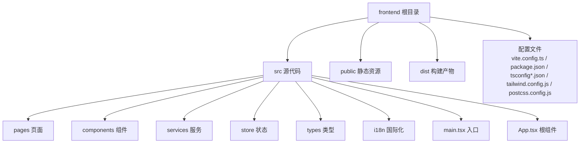
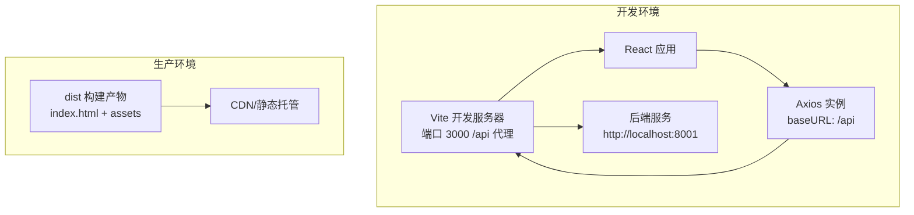
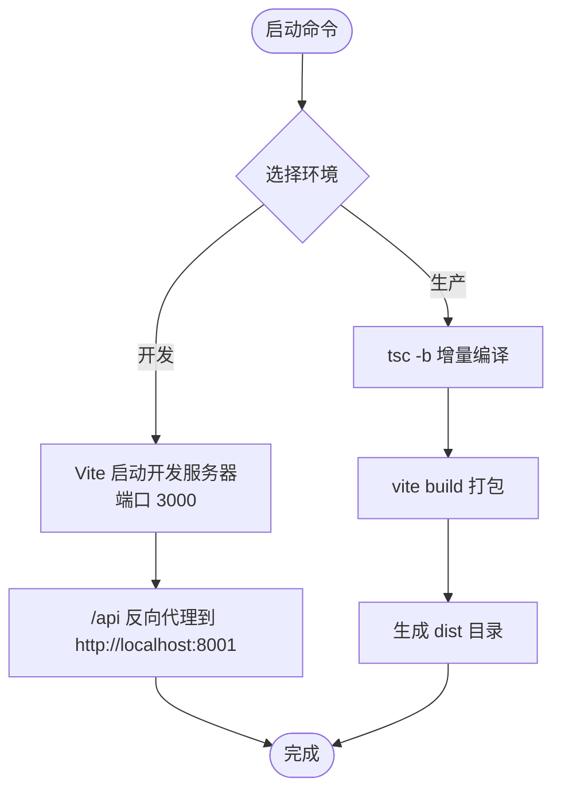
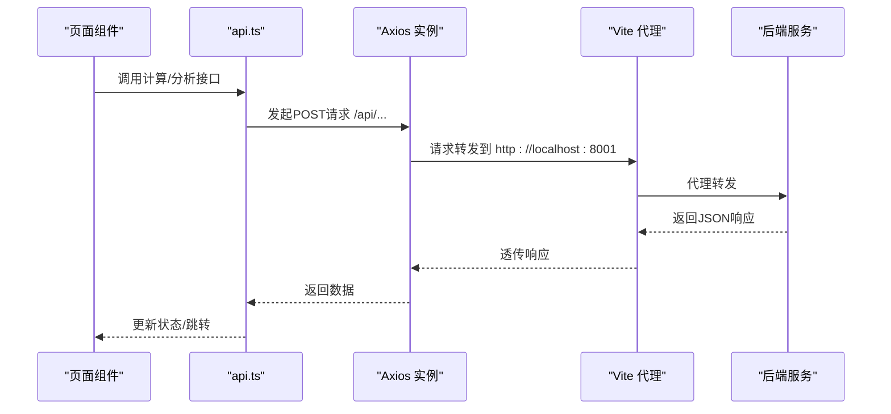
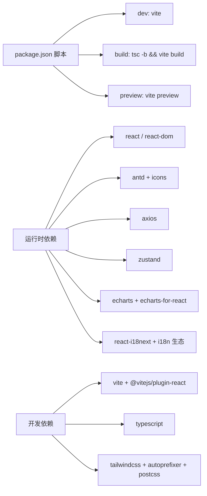

# 前端部署

<cite>
**本文引用的文件**
- [vite.config.ts](file://frontend/vite.config.ts)
- [package.json](file://frontend/package.json)
- [tsconfig.json](file://frontend/tsconfig.json)
- [tsconfig.node.json](file://frontend/tsconfig.node.json)
- [tailwind.config.js](file://frontend/tailwind.config.js)
- [postcss.config.js](file://frontend/postcss.config.js)
- [main.tsx](file://frontend/src/main.tsx)
- [App.tsx](file://frontend/src/App.tsx)
- [api.ts](file://frontend/src/services/api.ts)
- [useStore.ts](file://frontend/src/store/useStore.ts)
- [index.ts](file://frontend/src/types/index.ts)
- [HomePage.tsx](file://frontend/src/pages/HomePage.tsx)
- [AnalysisPage.tsx](file://frontend/src/pages/AnalysisPage.tsx)
- [ResultPage.tsx](file://frontend/src/pages/ResultPage.tsx)
- [FileUpload.tsx](file://frontend/src/components/FileUpload.tsx)
</cite>

## 目录
1. [简介](#简介)
2. [项目结构](#项目结构)
3. [核心组件](#核心组件)
4. [架构总览](#架构总览)
5. [详细组件分析](#详细组件分析)
6. [依赖分析](#依赖分析)
7. [性能考虑](#性能考虑)
8. [故障排查指南](#故障排查指南)
9. [结论](#结论)
10. [附录](#附录)

## 简介
本文件面向DCF估值智能体项目的前端部署，聚焦于Vite构建配置与优化、开发/生产差异、静态资源与CDN部署策略、环境变量与API端点、浏览器兼容与polyfill、性能优化（Bundle分析、懒加载、图片优化）、以及CI/CD集成与自动化部署流程。内容基于仓库中实际存在的前端配置与源码进行说明，确保可操作与可落地。

## 项目结构
前端采用Vite + React + TypeScript + TailwindCSS技术栈，目录组织遵循“按功能模块”划分：页面、组件、服务、状态管理、类型定义、国际化等。构建产物输出至dist目录，包含assets与index.html。

图表来源
- [package.json:1-37](file://frontend/package.json#L1-L37)
- [vite.config.ts:1-22](file://frontend/vite.config.ts#L1-L22)
- [tailwind.config.js:1-40](file://frontend/tailwind.config.js#L1-L40)

章节来源
- [package.json:1-37](file://frontend/package.json#L1-L37)
- [vite.config.ts:1-22](file://frontend/vite.config.ts#L1-L22)
- [tsconfig.json:1-26](file://frontend/tsconfig.json#L1-L26)
- [tsconfig.node.json:1-19](file://frontend/tsconfig.node.json#L1-L19)
- [tailwind.config.js:1-40](file://frontend/tailwind.config.js#L1-L40)
- [postcss.config.js:1-7](file://frontend/postcss.config.js#L1-L7)

## 核心组件
- Vite构建配置：定义插件、路径别名、开发服务器与代理、端口等。
- TypeScript编译配置：目标语言版本、模块解析策略、严格模式、路径映射等。
- TailwindCSS与PostCSS：内容扫描范围、主题扩展、自动前缀等。
- 应用入口与根组件：初始化国际化、样式、路由与主题。
- API服务层：统一Axios实例、基础URL、超时、错误处理。
- 状态管理：Zustand存储全局状态（主题、语言、参数、结果等）。
- 页面与组件：首页、分析页（含上传/手动输入、参数面板）、结果页（图表、敏感性分析、叙事生成）。

章节来源
- [vite.config.ts:5-21](file://frontend/vite.config.ts#L5-L21)
- [tsconfig.json:2-22](file://frontend/tsconfig.json#L2-L22)
- [tsconfig.node.json:2-16](file://frontend/tsconfig.node.json#L2-L16)
- [tailwind.config.js:1-40](file://frontend/tailwind.config.js#L1-L40)
- [postcss.config.js:1-7](file://frontend/postcss.config.js#L1-L7)
- [main.tsx:1-12](file://frontend/src/main.tsx#L1-L12)
- [App.tsx:1-148](file://frontend/src/App.tsx#L1-L148)
- [api.ts:11-26](file://frontend/src/services/api.ts#L11-L26)
- [useStore.ts:1-74](file://frontend/src/store/useStore.ts#L1-L74)
- [index.ts:1-128](file://frontend/src/types/index.ts#L1-L128)

## 架构总览
前端通过Vite在开发环境下提供热更新与反向代理；生产环境下打包输出静态资源。应用通过Axios访问后端API（/api前缀），由Vite开发服务器代理到后端地址。TailwindCSS负责样式体系，PostCSS完成自动前缀与按需构建。

图表来源
- [vite.config.ts:12-20](file://frontend/vite.config.ts#L12-L20)
- [api.ts:11-15](file://frontend/src/services/api.ts#L11-L15)
- [package.json:6-10](file://frontend/package.json#L6-L10)

## 详细组件分析

### Vite 构建与开发服务器
- 插件与别名：启用React插件与路径别名@指向src，便于统一导入。
- 开发服务器：端口3000，/api前缀代理到后端地址，便于前后联调。
- 构建脚本：先执行TypeScript增量编译，再执行Vite打包。

图表来源
- [vite.config.ts:5-21](file://frontend/vite.config.ts#L5-L21)
- [package.json:6-10](file://frontend/package.json#L6-L10)

章节来源
- [vite.config.ts:5-21](file://frontend/vite.config.ts#L5-L21)
- [package.json:6-10](file://frontend/package.json#L6-L10)

### TypeScript 编译配置
- 目标与库：ES2020目标、ESNext模块系统、DOM/DOM.Iterable库。
- 解析策略：bundler模块解析、强制模块检测、复合项目。
- 路径映射：@/* 映射到src/*，与Vite别名保持一致。
- 严格模式：开启严格检查与未使用项警告，提升代码质量。

章节来源
- [tsconfig.json:2-22](file://frontend/tsconfig.json#L2-L22)
- [tsconfig.node.json:2-16](file://frontend/tsconfig.node.json#L2-L16)

### TailwindCSS 与 PostCSS
- 内容扫描：扫描index.html与src下所有ts/tsx文件，实现按需清理。
- 主题扩展：自定义主色、强调色、金融主题色、字体族、阴影等。
- 插件链：TailwindCSS + Autoprefixer，自动添加厂商前缀。

章节来源
- [tailwind.config.js:1-40](file://frontend/tailwind.config.js#L1-L40)
- [postcss.config.js:1-7](file://frontend/postcss.config.js#L1-L7)

### 应用入口与根组件
- 入口：创建Root节点，挂载App，并引入国际化与全局样式。
- 根组件：Ant Design ConfigProvider包裹，支持暗/亮主题切换与算法切换；BrowserRouter提供路由；顶部导航菜单、语言切换、主题切换。

章节来源
- [main.tsx:1-12](file://frontend/src/main.tsx#L1-L12)
- [App.tsx:105-147](file://frontend/src/App.tsx#L105-L147)

### API 服务层
- Axios实例：baseURL为/api，统一超时时间与Content-Type。
- 错误处理：捕获AxiosError，提取后端错误信息或默认消息。
- 接口方法：上传PDF、文本抽取、DCF计算、敏感性分析、叙事生成。

图表来源
- [api.ts:11-26](file://frontend/src/services/api.ts#L11-L26)
- [vite.config.ts:14-19](file://frontend/vite.config.ts#L14-L19)

章节来源
- [api.ts:11-81](file://frontend/src/services/api.ts#L11-L81)
- [vite.config.ts:12-20](file://frontend/vite.config.ts#L12-L20)

### 状态管理（Zustand）
- 默认参数：包含预测年数、增长率、税率、WACC等DCF参数。
- 动作：设置/更新财务数据、参数、结果、敏感性矩阵、叙事、语言、主题、重置等。
- 使用：各页面通过hooks读取状态并触发动作。

章节来源
- [useStore.ts:11-74](file://frontend/src/store/useStore.ts#L11-L74)
- [index.ts:105-127](file://frontend/src/types/index.ts#L105-L127)

### 页面与组件
- 首页：特性卡片、引导按钮、动画背景。
- 分析页：上传/手动输入、参数面板、计算流程（DCF、敏感性、叙事）。
- 结果页：摘要卡片、现金流趋势图、敏感性表格、瀑布图、AI叙事折叠面板。
- 文件上传组件：拖拽上传PDF、抽取字段、二次编辑、保存。

章节来源
- [HomePage.tsx:1-117](file://frontend/src/pages/HomePage.tsx#L1-L117)
- [AnalysisPage.tsx:29-99](file://frontend/src/pages/AnalysisPage.tsx#L29-L99)
- [ResultPage.tsx:35-215](file://frontend/src/pages/ResultPage.tsx#L35-L215)
- [FileUpload.tsx:12-48](file://frontend/src/components/FileUpload.tsx#L12-L48)

## 依赖分析
- 运行时依赖：React、React DOM、Ant Design、图标、Axios、Zustand、ECharts、i18n生态、CSS-in-JS。
- 开发依赖：Vite、React插件、TypeScript、TailwindCSS、Autoprefixer、PostCSS。
- 构建脚本：dev、build、preview，分别对应开发、打包、预览。

图表来源
- [package.json:6-35](file://frontend/package.json#L6-L35)

章节来源
- [package.json:1-37](file://frontend/package.json#L1-L37)

## 性能考虑
- Bundle分析与体积控制
  - 使用Vite内置分析工具或第三方可视化工具对产物进行分析，识别大体积依赖与重复模块。
  - 对第三方库采用按需引入与Tree Shaking，确保仅打包使用到的部分。
- 代码分割与懒加载
  - 将大型图表组件与页面级组件进行动态导入，减少首屏包体。
  - 在路由层面结合React Suspense与动态import实现按需加载。
- 图片与静态资源优化
  - 将图片资源放入public目录，使用现代格式（WebP）与合适的尺寸，配合CDN压缩与缓存。
  - 对矢量图标与CSS背景图尽量复用，避免重复请求。
- 缓存策略
  - 静态资源采用强缓存（如immutable），HTML采用协商缓存。
  - 版本化文件名（Vite默认带哈希），确保变更后可刷新。
- 浏览器兼容与Polyfill
  - 目标环境为ES2020，若需兼容旧浏览器，可在Vite中配置polyfill与运行时注入。
  - 对Intl、Fetch、Promise等API缺失场景，引入相应polyfill。
- 开发与生产差异
  - 开发环境启用SourceMap与HMR；生产环境关闭调试信息，启用压缩与最小化。
  - 生产环境建议开启Gzip/Brotli压缩与HTTP/2多路复用。

## 故障排查指南
- 开发代理失败
  - 检查Vite代理配置是否正确指向后端地址；确认后端服务已启动且端口开放。
- API请求报错
  - 查看Axios错误处理逻辑，确认后端返回的错误信息是否包含detail字段；检查CORS与跨域配置。
- 样式异常
  - 确认Tailwind内容扫描路径包含当前页面文件；检查PostCSS插件顺序与版本。
- 构建失败
  - 检查TypeScript编译配置与模块解析策略；确保路径别名与tsconfig一致。
- 首屏过慢
  - 使用分析工具定位大依赖与未分割模块；对图表与国际化资源进行懒加载。

章节来源
- [vite.config.ts:12-20](file://frontend/vite.config.ts#L12-L20)
- [api.ts:17-26](file://frontend/src/services/api.ts#L17-L26)
- [tailwind.config.js:3-3](file://frontend/tailwind.config.js#L3-L3)
- [tsconfig.json:8-12](file://frontend/tsconfig.json#L8-L12)

## 结论
本项目前端以Vite为核心，结合React、TypeScript与TailwindCSS，具备清晰的模块化结构与良好的可维护性。通过合理的构建配置、懒加载与CDN策略，可在保证开发体验的同时获得优秀的生产性能。建议在CI/CD中加入构建产物分析与缓存校验，持续优化交付质量。

## 附录

### 部署与CDN配置建议
- 静态资源托管
  - 将dist目录部署至对象存储或CDN，开启全球加速与HTTPS。
  - 对index.html与assets分别设置缓存策略：HTML短缓存，assets强缓存+指纹。
- 版本控制
  - 使用Vite默认的文件指纹命名；在发布时记录版本号与构建时间，便于回滚。
- 缓存与回源
  - 配置边缘缓存命中率监控；对404/5xx错误进行回源与降级策略。
- 安全与合规
  - 启用CSP、Subresource Integrity（SRI）与HTTPS；定期扫描依赖漏洞。

### 环境变量与API端点
- 当前API基础URL为/api，开发服务器通过代理转发至后端地址。
- 若需在不同环境（本地、测试、生产）切换后端地址，可通过Vite环境变量注入方式在构建时替换（例如在Vite配置中读取环境变量并注入到客户端）。
- 功能开关：可在环境变量中增加功能开关键值，前端根据开关决定渲染或行为。

### CI/CD 集成与自动化部署
- 触发条件：push到主分支或打标签时触发流水线。
- 步骤建议：
  - 安装依赖与类型检查
  - 单元测试与构建
  - 产物分析与报告
  - 上传至CDN或静态站点
  - 健康检查与灰度发布
- 缓存策略：缓存node_modules与依赖锁文件，缩短构建时间。
- 回滚：保留最近N个版本，支持一键回滚。