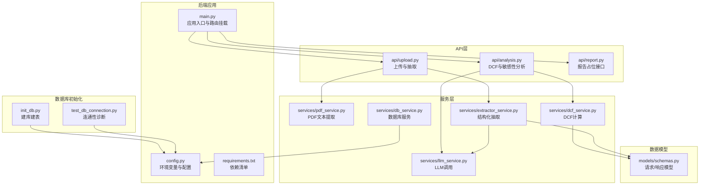
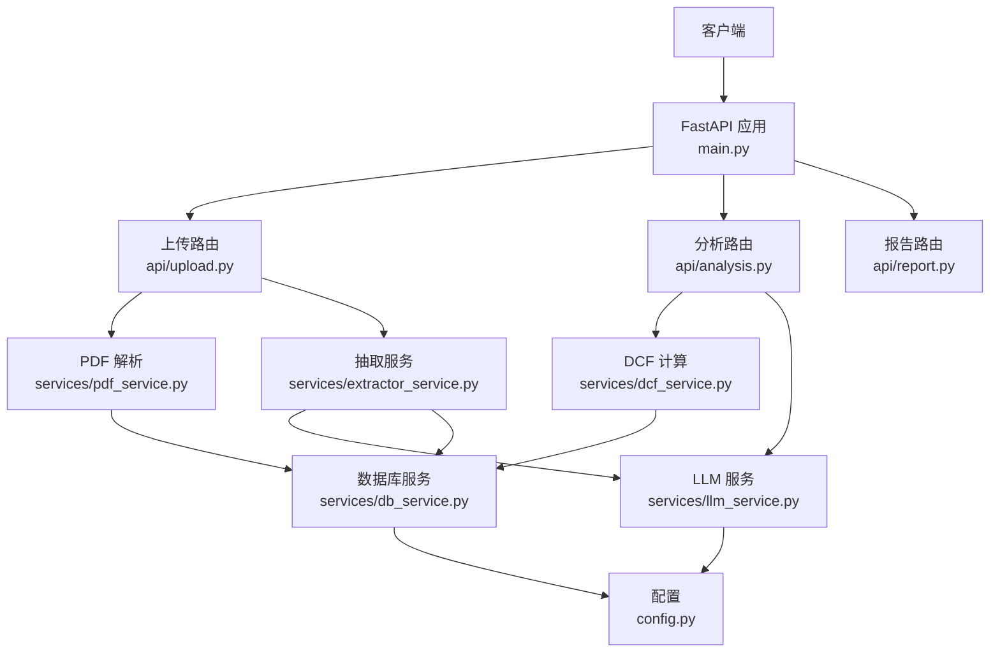
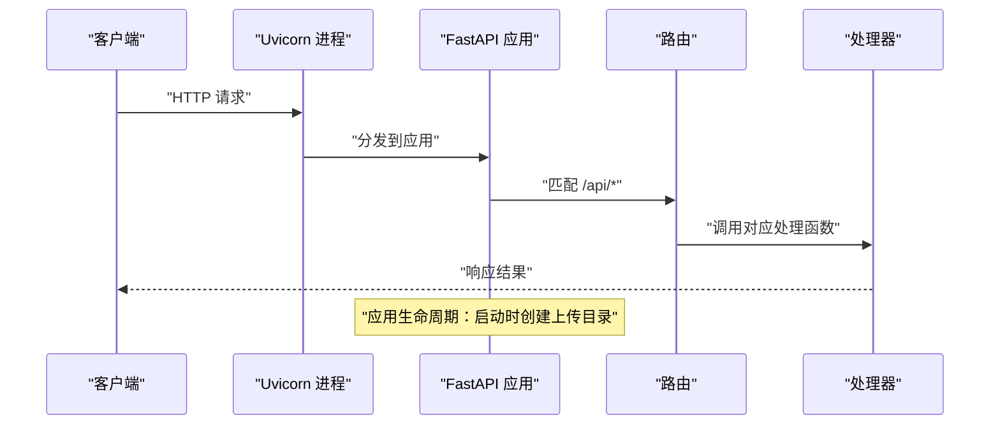
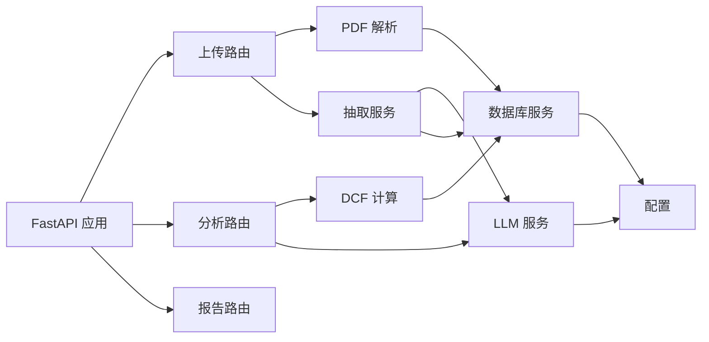

# 后端部署

<cite>
**本文引用的文件**
- [backend/main.py](file://backend/main.py)
- [backend/config.py](file://backend/config.py)
- [backend/requirements.txt](file://backend/requirements.txt)
- [backend/init_db.py](file://backend/init_db.py)
- [backend/test_db_connection.py](file://backend/test_db_connection.py)
- [backend/api/upload.py](file://backend/api/upload.py)
- [backend/api/analysis.py](file://backend/api/analysis.py)
- [backend/api/report.py](file://backend/api/report.py)
- [backend/models/schemas.py](file://backend/models/schemas.py)
- [backend/services/db_service.py](file://backend/services/db_service.py)
- [backend/services/dcf_service.py](file://backend/services/dcf_service.py)
- [backend/services/pdf_service.py](file://backend/services/pdf_service.py)
- [backend/services/extractor_service.py](file://backend/services/extractor_service.py)
- [backend/services/llm_service.py](file://backend/services/llm_service.py)
</cite>

## 目录
1. [简介](#简介)
2. [项目结构](#项目结构)
3. [核心组件](#核心组件)
4. [架构总览](#架构总览)
5. [详细组件分析](#详细组件分析)
6. [依赖分析](#依赖分析)
7. [性能考虑](#性能考虑)
8. [故障排查指南](#故障排查指南)
9. [结论](#结论)
10. [附录](#附录)

## 简介
本文件面向DCF估值智能体项目的后端部署，围绕FastAPI应用的部署流程、依赖安装、环境配置、进程管理、反向代理、环境变量、进程监控与健康检查、容器化与日志错误处理策略进行系统性说明。目标是帮助运维与开发团队快速、稳定地完成生产级部署。

## 项目结构
后端采用模块化组织方式，按功能划分为API路由层、业务服务层、数据模型与数据库服务层，以及外部能力集成（LLM、PDF解析）。核心入口为FastAPI应用，通过路由挂载实现对外接口；数据库初始化脚本负责创建数据库与表结构；服务层封装DCF计算、LLM抽取、PDF文本提取与数据库操作。

图表来源
- [backend/main.py:1-40](file://backend/main.py#L1-L40)
- [backend/config.py:1-22](file://backend/config.py#L1-L22)
- [backend/requirements.txt:1-11](file://backend/requirements.txt#L1-L11)
- [backend/api/upload.py:1-55](file://backend/api/upload.py#L1-L55)
- [backend/api/analysis.py:1-45](file://backend/api/analysis.py#L1-L45)
- [backend/api/report.py:1-12](file://backend/api/report.py#L1-L12)
- [backend/models/schemas.py:1-101](file://backend/models/schemas.py#L1-L101)
- [backend/services/pdf_service.py:1-68](file://backend/services/pdf_service.py#L1-L68)
- [backend/services/extractor_service.py:1-67](file://backend/services/extractor_service.py#L1-L67)
- [backend/services/dcf_service.py:1-163](file://backend/services/dcf_service.py#L1-L163)
- [backend/services/llm_service.py:1-155](file://backend/services/llm_service.py#L1-L155)
- [backend/services/db_service.py:1-345](file://backend/services/db_service.py#L1-L345)
- [backend/init_db.py:1-219](file://backend/init_db.py#L1-L219)
- [backend/test_db_connection.py:1-183](file://backend/test_db_connection.py#L1-L183)

章节来源
- [backend/main.py:1-40](file://backend/main.py#L1-L40)
- [backend/requirements.txt:1-11](file://backend/requirements.txt#L1-L11)

## 核心组件
- 应用入口与路由
  - 应用名称、版本、生命周期钩子用于确保上传目录存在；启用CORS跨域；挂载/api前缀下的上传、分析、报告路由；提供健康检查端点。
- 配置与环境变量
  - 加载dotenv，读取Minimax LLM相关参数与MySQL连接信息；定义上传目录路径。
- 数据库初始化与连通性诊断
  - 初始化脚本创建数据库与多张财务报表相关表；诊断脚本验证连接、权限与基本操作。
- 服务层
  - PDF文本提取：按关键词筛选高相关页面并限制最大字符数。
  - 结构化抽取：调用LLM抽取财务数据并映射到模型。
  - DCF计算：WACC计算、自由现金流预测、终值与现值计算、敏感性分析。
  - LLM服务：封装异步客户端、系统提示词、JSON提取与错误处理。
  - 数据库服务：连接池式管理、多表插入与查询封装。
- API层
  - 上传与文本抽取：支持PDF上传与纯文本输入，返回结构化结果。
  - 分析：DCF计算、敏感性分析、叙事生成。
  - 报告：预留报告导出能力。

章节来源
- [backend/main.py:18-40](file://backend/main.py#L18-L40)
- [backend/config.py:10-22](file://backend/config.py#L10-L22)
- [backend/init_db.py:172-219](file://backend/init_db.py#L172-L219)
- [backend/test_db_connection.py:22-183](file://backend/test_db_connection.py#L22-L183)
- [backend/services/pdf_service.py:26-68](file://backend/services/pdf_service.py#L26-L68)
- [backend/services/extractor_service.py:27-67](file://backend/services/extractor_service.py#L27-L67)
- [backend/services/dcf_service.py:12-163](file://backend/services/dcf_service.py#L12-L163)
- [backend/services/llm_service.py:70-155](file://backend/services/llm_service.py#L70-L155)
- [backend/services/db_service.py:24-345](file://backend/services/db_service.py#L24-L345)
- [backend/api/upload.py:16-55](file://backend/api/upload.py#L16-L55)
- [backend/api/analysis.py:18-45](file://backend/api/analysis.py#L18-L45)
- [backend/api/report.py:8-12](file://backend/api/report.py#L8-L12)

## 架构总览
下图展示后端整体架构与数据流：FastAPI作为入口，接收上传与分析请求；上传流程先保存临时文件，再调用PDF解析与LLM抽取；分析流程调用DCF计算与LLM叙事；数据库服务贯穿于各流程的数据持久化。

图表来源
- [backend/main.py:18-40](file://backend/main.py#L18-L40)
- [backend/api/upload.py:16-55](file://backend/api/upload.py#L16-L55)
- [backend/api/analysis.py:18-45](file://backend/api/analysis.py#L18-L45)
- [backend/api/report.py:8-12](file://backend/api/report.py#L8-L12)
- [backend/services/pdf_service.py:26-68](file://backend/services/pdf_service.py#L26-L68)
- [backend/services/extractor_service.py:27-67](file://backend/services/extractor_service.py#L27-L67)
- [backend/services/dcf_service.py:85-121](file://backend/services/dcf_service.py#L85-L121)
- [backend/services/llm_service.py:94-155](file://backend/services/llm_service.py#L94-L155)
- [backend/services/db_service.py:30-53](file://backend/services/db_service.py#L30-L53)
- [backend/config.py:10-22](file://backend/config.py#L10-L22)

## 详细组件分析

### FastAPI 应用与进程管理
- 进程启动
  - 使用uvicorn作为ASGI服务器，建议在生产中结合进程管理器（如systemd或Supervisor）运行多个工作进程。
  - 推荐命令行示例：uvicorn --host 0.0.0.0 --port 8000 backend.main:app
- 生命周期与资源准备
  - 应用启动时确保上传目录存在，避免运行期IO异常。
- CORS与路由
  - 允许任意源访问，便于前端联调；生产环境建议限定具体域名。
- 健康检查
  - 提供/api/health端点，可用于Kubernetes/负载均衡探针。

图表来源
- [backend/main.py:12-40](file://backend/main.py#L12-L40)

章节来源
- [backend/main.py:12-40](file://backend/main.py#L12-L40)

### Gunicorn/uWSGI 配置与使用
- 工作进程与线程
  - CPU密集型（PDF解析、LLM调用、DCF计算）建议使用多进程模式，进程数可参考CPU核数或略低；每个进程内可配置线程数以提升I/O并发。
  - 示例参数（概念性说明，不直接映射到具体文件）：
    - 进程数：2×CPU核数+1
    - 每进程线程数：4–8
    - 启动超时：60–120秒
    - 最大请求数：1000–2000（防止内存泄漏）
- 负载均衡
  - 多实例部署时由Nginx做反向代理，向上游转发请求。
- 进程管理
  - 建议使用systemd或Supervisor管理进程，自动重启失败实例，记录日志。

[本节为通用实践说明，不直接分析具体文件，故无章节来源]

### Nginx 反向代理配置要点
- 静态文件服务
  - 前端构建产物位于frontend/dist，可在Nginx中配置静态目录，交由后端统一走/api前缀。
- API转发
  - 将/api*请求转发至后端FastAPI服务（例如本地回环或容器网络）。
- SSL终止
  - 建议开启HTTPS，使用Let’s Encrypt证书；将证书与私钥放置安全位置，限制权限。
- 超时与缓冲
  - 合理设置proxy_connect_timeout、proxy_send_timeout、proxy_read_timeout；对大文件上传与长耗时LLM请求适当放宽。

[本节为通用实践说明，不直接分析具体文件，故无章节来源]

### 环境变量配置
- LLM接入
  - MINIMAX_API_KEY：LLM服务密钥
  - MINIMAX_BASE_URL：LLM服务地址
  - MINIMAX_MODEL：模型名
- 数据库连接
  - MYSQL_HOST/MYSQL_USER/MYSQL_PASSWORD/MYSQL_PORT/MYSQL_DATABASE：MySQL连接参数
- 上传目录
  - UPLOAD_DIR：后端临时上传目录（应用启动时会创建）

章节来源
- [backend/config.py:10-22](file://backend/config.py#L10-L22)

### 进程监控与健康检查
- 健康检查端点
  - /api/health 返回状态，可用于探活与滚动更新判断。
- 进程监控
  - 使用Prometheus+Grafana或云监控平台采集CPU、内存、请求延迟与错误率。
- 日志
  - 建议将应用日志输出到stdout/stderr，由容器编排系统收集；同时保留轮转文件以便问题定位。

章节来源
- [backend/main.py:37-40](file://backend/main.py#L37-L40)

### Docker 容器化部署方案
- Dockerfile（概念性说明）
  - 基础镜像：python:3.12-slim
  - 设置工作目录与环境变量
  - 安装系统依赖（如编译工具、字体库等，视pdfplumber需求而定）
  - 复制requirements.txt并pip安装
  - 复制后端源码
  - 暴露端口8000
  - 启动命令：gunicorn或uvicorn运行FastAPI应用
- 镜像构建
  - docker build -t dcf-backend .
- 容器编排
  - 使用docker-compose或Kubernetes部署；设置环境变量、卷挂载（如上传目录）、健康检查与探针。
  - Nginx作为边缘网关，反向代理到后端容器。

[本节为通用实践说明，不直接分析具体文件，故无章节来源]

### 日志配置与错误处理策略
- 日志
  - LLM服务与PDF服务均使用标准日志模块；建议统一输出到stdout，配合容器日志收集。
- 错误处理
  - API层对异常进行捕获并返回结构化错误；服务层对数据库与外部调用异常进行记录与回滚。
- 数据库错误
  - 连接失败、权限不足、SQL异常均有明确日志输出，便于快速定位。

章节来源
- [backend/services/llm_service.py:12-122](file://backend/services/llm_service.py#L12-L122)
- [backend/services/pdf_service.py:6-68](file://backend/services/pdf_service.py#L6-L68)
- [backend/api/upload.py:38-43](file://backend/api/upload.py#L38-L43)
- [backend/api/analysis.py:22-31](file://backend/api/analysis.py#L22-L31)

## 依赖分析
- Python依赖
  - FastAPI、uvicorn、OpenAI SDK、httpx、pdfplumber、python-multipart、pydantic、python-dotenv、PyMySQL、SQLAlchemy
- 组件耦合
  - API层仅依赖服务层接口，服务层依赖配置与模型；数据库服务独立于业务逻辑，便于替换实现。
- 外部依赖
  - LLM服务与MySQL服务需在生产环境中可用且具备足够配额与带宽。

图表来源
- [backend/requirements.txt:1-11](file://backend/requirements.txt#L1-L11)
- [backend/main.py:18-40](file://backend/main.py#L18-L40)
- [backend/api/upload.py:16-55](file://backend/api/upload.py#L16-L55)
- [backend/api/analysis.py:18-45](file://backend/api/analysis.py#L18-L45)
- [backend/api/report.py:8-12](file://backend/api/report.py#L8-L12)
- [backend/services/extractor_service.py:27-67](file://backend/services/extractor_service.py#L27-L67)
- [backend/services/dcf_service.py:85-121](file://backend/services/dcf_service.py#L85-L121)
- [backend/services/llm_service.py:94-155](file://backend/services/llm_service.py#L94-L155)
- [backend/services/pdf_service.py:26-68](file://backend/services/pdf_service.py#L26-L68)
- [backend/services/db_service.py:30-53](file://backend/services/db_service.py#L30-L53)
- [backend/config.py:10-22](file://backend/config.py#L10-L22)

章节来源
- [backend/requirements.txt:1-11](file://backend/requirements.txt#L1-L11)

## 性能考虑
- I/O密集优化
  - PDF解析与LLM调用为I/O瓶颈，建议使用异步客户端与连接池；控制单次最大文本长度，避免超长文本导致内存压力。
- 计算密集优化
  - DCF计算可缓存中间结果（如WACC），对相同输入重复使用；对敏感性分析可并行化不同参数组合。
- 并发与限流
  - 在Nginx或应用层设置请求速率限制，防止突发流量压垮后端。
- 存储与临时文件
  - 上传目录定期清理过期文件；磁盘空间与IO性能需满足PDF解析与大文件处理需求。

[本节为通用性能建议，不直接分析具体文件，故无章节来源]

## 故障排查指南
- 数据库连接问题
  - 使用诊断脚本逐项验证：服务器可达、用户权限、数据库存在性、基本增删查操作。
  - 初始化数据库：执行初始化脚本创建所需表结构。
- LLM调用失败
  - 检查API密钥与服务地址是否正确；查看日志中的JSON解析错误与异常堆栈。
- PDF解析异常
  - 关注日志中页面数量与字符统计，确认文本截断策略是否合理；必要时调整最大字符上限。
- 健康检查
  - 通过/api/health确认服务存活；结合进程管理器与监控平台定位异常。

章节来源
- [backend/test_db_connection.py:22-183](file://backend/test_db_connection.py#L22-L183)
- [backend/init_db.py:172-219](file://backend/init_db.py#L172-L219)
- [backend/services/llm_service.py:117-122](file://backend/services/llm_service.py#L117-L122)
- [backend/services/pdf_service.py:32-68](file://backend/services/pdf_service.py#L32-L68)
- [backend/main.py:37-40](file://backend/main.py#L37-L40)

## 结论
本部署文档提供了从依赖安装、环境配置、进程管理、反向代理、健康检查、容器化到日志与错误处理的完整方案。建议在生产环境中结合Nginx、Gunicorn/Uvicorn、数据库与LLM服务的稳定性保障措施，配合监控与告警体系，确保系统高可用与高性能。

## 附录
- 快速检查清单
  - 安装Python依赖
  - 配置.env文件（LLM与MySQL参数）
  - 初始化数据库与表
  - 启动后端服务并通过/api/health验证
  - 部署Nginx并配置/api转发与SSL
  - 部署容器并配置健康检查与日志收集

[本节为通用附录，不直接分析具体文件，故无章节来源]