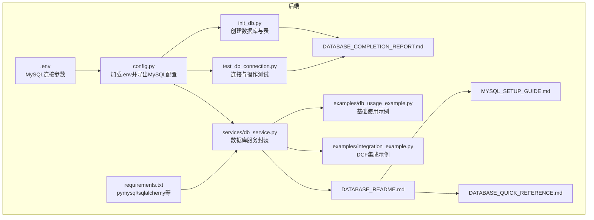
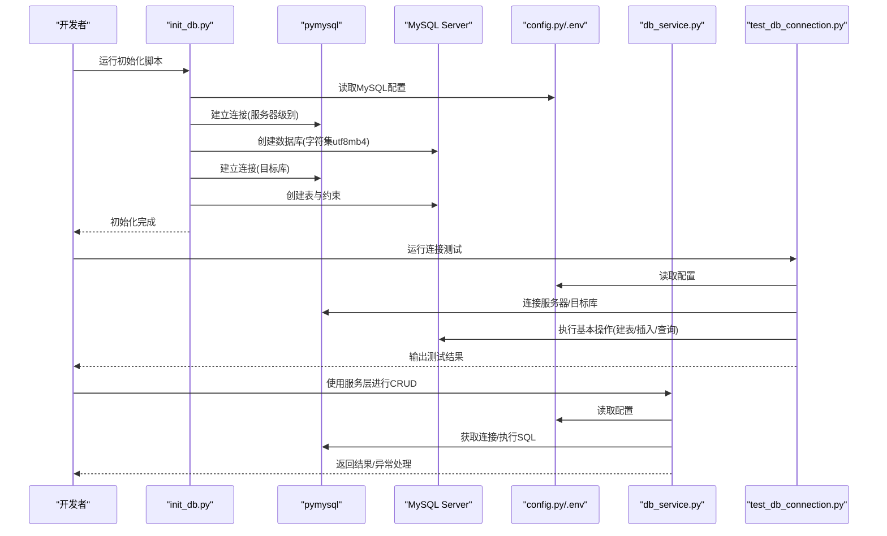
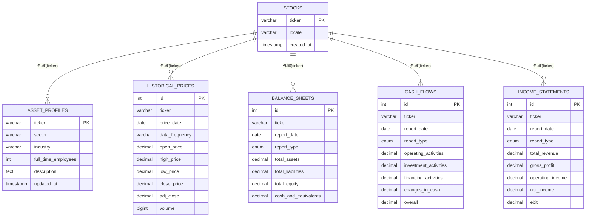
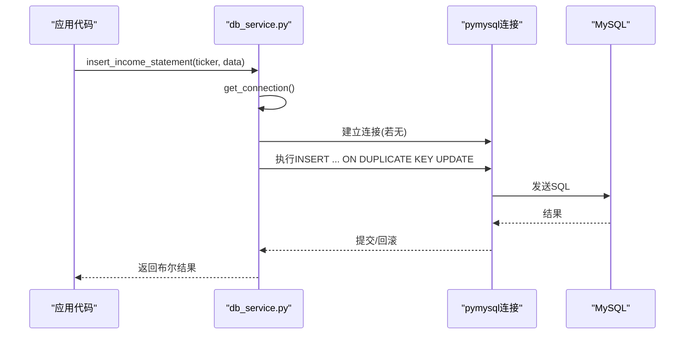
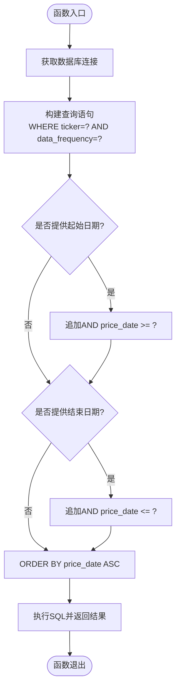
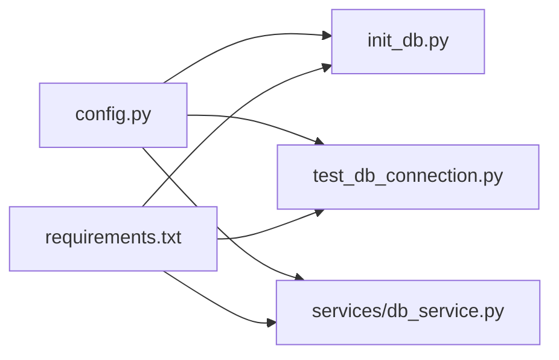

# 数据库部署

<cite>
**本文引用的文件**
- [DATABASE_README.md](file://backend/DATABASE_README.md)
- [MYSQL_SETUP_GUIDE.md](file://backend/MYSQL_SETUP_GUIDE.md)
- [DATABASE_QUICK_REFERENCE.md](file://backend/DATABASE_QUICK_REFERENCE.md)
- [DATABASE_COMPLETION_REPORT.md](file://backend/DATABASE_COMPLETION_REPORT.md)
- [init_db.py](file://backend/init_db.py)
- [config.py](file://backend/config.py)
- [test_db_connection.py](file://backend/test_db_connection.py)
- [requirements.txt](file://backend/requirements.txt)
- [db_service.py](file://backend/services/db_service.py)
- [db_usage_example.py](file://backend/examples/db_usage_example.py)
- [integration_example.py](file://backend/examples/integration_example.py)
</cite>

## 目录
1. [简介](#简介)
2. [项目结构](#项目结构)
3. [核心组件](#核心组件)
4. [架构总览](#架构总览)
5. [详细组件分析](#详细组件分析)
6. [依赖关系分析](#依赖关系分析)
7. [性能考量](#性能考量)
8. [故障排查指南](#故障排查指南)
9. [结论](#结论)
10. [附录](#附录)

## 简介
本文件面向DCF估值智能体项目的数据库部署与运维，聚焦于MySQL数据库的安装与配置、初始化流程、连接配置、迁移与版本管理策略、性能优化、监控与维护以及备份恢复与灾难恢复计划。文档基于仓库现有文件进行系统化整理，确保非技术读者也能理解关键步骤与最佳实践。

## 项目结构
后端数据库相关文件主要位于 backend 目录，包含：
- 配置与环境变量：config.py、.env（由项目文档说明）
- 初始化脚本：init_db.py
- 连接测试：test_db_connection.py
- 数据库服务封装：services/db_service.py
- 使用示例：examples/db_usage_example.py、examples/integration_example.py
- 文档：DATABASE_README.md、MYSQL_SETUP_GUIDE.md、DATABASE_QUICK_REFERENCE.md、DATABASE_COMPLETION_REPORT.md
- 依赖声明：requirements.txt

图表来源
- [config.py:1-22](file://backend/config.py#L1-L22)
- [init_db.py:1-219](file://backend/init_db.py#L1-L219)
- [test_db_connection.py:1-183](file://backend/test_db_connection.py#L1-L183)
- [db_service.py:1-345](file://backend/services/db_service.py#L1-L345)
- [requirements.txt:1-11](file://backend/requirements.txt#L1-L11)

章节来源
- [DATABASE_README.md:1-168](file://backend/DATABASE_README.md#L1-L168)
- [MYSQL_SETUP_GUIDE.md:1-214](file://backend/MYSQL_SETUP_GUIDE.md#L1-L214)
- [DATABASE_QUICK_REFERENCE.md:1-290](file://backend/DATABASE_QUICK_REFERENCE.md#L1-L290)
- [DATABASE_COMPLETION_REPORT.md:1-229](file://backend/DATABASE_COMPLETION_REPORT.md#L1-L229)

## 核心组件
- 配置加载：config.py 通过dotenv加载 .env 并导出 MYSQL_* 环境变量，供其他模块使用。
- 初始化脚本：init_db.py 负责创建数据库与6张核心表，并设置外键与唯一约束。
- 连接测试：test_db_connection.py 提供连接与基本操作的诊断能力。
- 数据库服务：db_service.py 封装连接、事务、CRUD与查询方法，提供统一入口。
- 示例与文档：examples 与多篇文档提供使用范式与故障排查要点。

章节来源
- [config.py:14-22](file://backend/config.py#L14-L22)
- [init_db.py:68-170](file://backend/init_db.py#L68-L170)
- [test_db_connection.py:22-144](file://backend/test_db_connection.py#L22-L144)
- [db_service.py:24-345](file://backend/services/db_service.py#L24-L345)

## 架构总览
下图展示数据库初始化、连接与服务层的整体交互。

图表来源
- [init_db.py:172-211](file://backend/init_db.py#L172-L211)
- [test_db_connection.py:22-144](file://backend/test_db_connection.py#L22-L144)
- [db_service.py:30-46](file://backend/services/db_service.py#L30-L46)
- [config.py:14-22](file://backend/config.py#L14-L22)

## 详细组件分析

### MySQL安装与配置
- 版本与安装方式：官方社区版、XAMPP/WAMP、Docker等；Docker容器示例已在文档中给出。
- 端口与权限：默认端口3306；若端口被占用需调整或更换实例；必要时授予root权限。
- 字符集：数据库创建时使用utf8mb4字符集，确保表情符号与多语言支持。
- .env配置：包含主机、用户、密码、端口、数据库名等关键参数。

章节来源
- [MYSQL_SETUP_GUIDE.md:84-108](file://backend/MYSQL_SETUP_GUIDE.md#L84-L108)
- [MYSQL_SETUP_GUIDE.md:174-198](file://backend/MYSQL_SETUP_GUIDE.md#L174-L198)
- [DATABASE_README.md:13-21](file://backend/DATABASE_README.md#L13-L21)
- [config.py:14-19](file://backend/config.py#L14-L19)

### 数据库初始化流程
- 创建数据库：使用utf8mb4字符集与校对规则。
- 创建表与约束：
  - stocks：主键(ticker)，默认locale与时间戳。
  - asset_profiles：外键(ticker)级联删除，唯一性约束。
  - historical_prices：唯一约束(ticker, price_date, data_frequency)，外键级联删除。
  - balance_sheets/cash_flows/income_statements：唯一约束(ticker, report_date, report_type)，外键级联删除。
- 初始化脚本具备幂等性，可重复执行。

章节来源
- [init_db.py:39-48](file://backend/init_db.py#L39-L48)
- [init_db.py:68-170](file://backend/init_db.py#L68-L170)
- [DATABASE_README.md:60-88](file://backend/DATABASE_README.md#L60-L88)

### 数据库连接配置
- 连接参数：主机、用户、密码、端口、数据库名、字符集utf8mb4、字典游标。
- 连接生命周期：服务层在连接不存在或关闭时重建连接；调用方应在完成后显式关闭。
- 事务与回滚：每个写操作在异常时自动回滚，保证一致性。
- 依赖：pymysql与sqlalchemy在requirements中声明。

章节来源
- [config.py:14-19](file://backend/config.py#L14-L19)
- [db_service.py:30-53](file://backend/services/db_service.py#L30-L53)
- [db_service.py:54-232](file://backend/services/db_service.py#L54-L232)
- [requirements.txt:9-11](file://backend/requirements.txt#L9-L11)

### 数据迁移与版本管理策略
- 当前现状：初始化脚本幂等，支持重复执行；未提供独立的迁移脚本与回滚机制。
- 建议策略（概念性）：
  - 引入迁移框架（如 Alembic），维护迁移版本号与变更记录。
  - 对DDL变更增加迁移脚本，对数据变更提供数据迁移脚本。
  - 回滚机制：保留前一版本快照，支持逆向迁移。
  - 变更前备份：生产变更前进行全库或表级备份。
- 与现有脚本的关系：init_db.py可作为初始版本的“零号迁移”。

章节来源
- [DATABASE_README.md:161-168](file://backend/DATABASE_README.md#L161-L168)
- [DATABASE_COMPLETION_REPORT.md:10-22](file://backend/DATABASE_COMPLETION_REPORT.md#L10-L22)

### 数据模型与索引
- 主键与唯一性：各表主键自动建立；财务报表与历史价格表通过联合唯一约束避免重复。
- 外键与级联：所有财务表均外键关联stocks，删除股票时级联清理财务数据。
- 查询模式：按ticker、report_date、data_frequency等字段进行过滤与排序。

图表来源
- [init_db.py:74-161](file://backend/init_db.py#L74-L161)
- [DATABASE_QUICK_REFERENCE.md:125-195](file://backend/DATABASE_QUICK_REFERENCE.md#L125-L195)

### API/服务组件调用流程
下图展示典型写入流程（以插入利润表为例）。

图表来源
- [db_service.py:200-232](file://backend/services/db_service.py#L200-L232)
- [init_db.py:146-161](file://backend/init_db.py#L146-L161)

### 复杂逻辑组件：查询与聚合
下图展示历史价格查询的条件拼接与参数绑定。

图表来源
- [db_service.py:275-299](file://backend/services/db_service.py#L275-L299)

## 依赖关系分析
- 组件耦合：db_service.py 依赖 config.py 的环境变量；init_db.py 与 test_db_connection.py 同样依赖 config.py。
- 外部依赖：pymysql用于连接与执行SQL；sqlalchemy在依赖列表中，可用于未来ORM或迁移框架。
- 循环依赖：当前文件间无循环导入迹象。

图表来源
- [config.py:14-22](file://backend/config.py#L14-L22)
- [requirements.txt:1-11](file://backend/requirements.txt#L1-11)

章节来源
- [requirements.txt:1-11](file://backend/requirements.txt#L1-L11)
- [config.py:14-22](file://backend/config.py#L14-L22)

## 性能考量
- 字段类型与精度：财务金额使用高精度DECIMAL，避免浮点误差。
- 索引策略：主键与唯一约束自动建立索引；建议根据常见查询模式（如按ticker、report_date、data_frequency）评估是否需要额外复合索引。
- 连接管理：服务层按需建立连接并在finally块中关闭；建议在上层业务中复用连接以减少握手开销。
- 批量操作：对于大量数据写入，建议采用批量插入或事务批处理以降低往返次数。
- 缓存策略：可引入Redis等缓存热点数据（如最新财报、常用查询结果），注意与数据库一致性。
- 分区策略：针对历史价格等大表，可按时间分区以提升查询与归档效率。

章节来源
- [DATABASE_COMPLETION_REPORT.md:100-111](file://backend/DATABASE_COMPLETION_REPORT.md#L100-L111)
- [DATABASE_QUICK_REFERENCE.md:196-222](file://backend/DATABASE_QUICK_REFERENCE.md#L196-L222)

## 故障排查指南
- 连接失败：
  - 检查MySQL服务状态与端口占用；确认密码与用户权限。
  - 使用命令行客户端先行验证连接。
- 权限不足：为root用户授予必要权限或创建专用数据库用户。
- 字符集问题：确保数据库与表使用utf8mb4。
- 初始化失败：查看错误日志，确认CREATE DATABASE权限；重复执行初始化脚本（幂等）。
- 数据插入失败：核对数据类型、外键存在性与唯一约束冲突。
- 连接泄漏：确保在finally块中调用关闭连接方法。

章节来源
- [MYSQL_SETUP_GUIDE.md:173-207](file://backend/MYSQL_SETUP_GUIDE.md#L173-L207)
- [DATABASE_README.md:130-159](file://backend/DATABASE_README.md#L130-L159)
- [test_db_connection.py:62-71](file://backend/test_db_connection.py#L62-L71)

## 结论
本项目已实现MySQL数据库的完整初始化与服务封装，具备良好的数据完整性与查询能力。建议在现有基础上引入正式的迁移与版本管理、连接池、缓存与分区策略，并完善监控与备份恢复体系，以支撑生产环境的长期稳定运行。

## 附录

### 快速开始步骤
- 安装依赖：在backend目录执行安装命令。
- 初始化数据库：运行初始化脚本创建数据库与表。
- 连接测试：运行连接测试脚本验证连通性与权限。
- 运行示例：执行基础与集成示例，验证数据读写与DCF输入准备。

章节来源
- [DATABASE_README.md:25-59](file://backend/DATABASE_README.md#L25-L59)
- [DATABASE_QUICK_REFERENCE.md:3-21](file://backend/DATABASE_QUICK_REFERENCE.md#L3-L21)
- [DATABASE_COMPLETION_REPORT.md:112-148](file://backend/DATABASE_COMPLETION_REPORT.md#L112-L148)

### 数据库服务使用要点
- 导入服务：从services.db_service导入db_service实例。
- 写入操作：insert_stock、insert_asset_profile、insert_income_statement、insert_balance_sheet、insert_cash_flow、insert_historical_price，均返回布尔值。
- 查询操作：get_stock_data、get_historical_prices、get_financial_statements。
- 关闭连接：使用完毕后调用close_connection。

章节来源
- [DATABASE_QUICK_REFERENCE.md:22-124](file://backend/DATABASE_QUICK_REFERENCE.md#L22-L124)
- [db_service.py:54-341](file://backend/services/db_service.py#L54-L341)