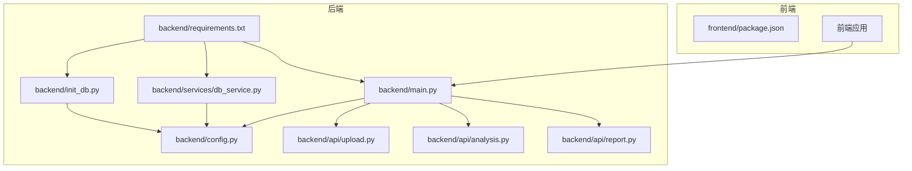
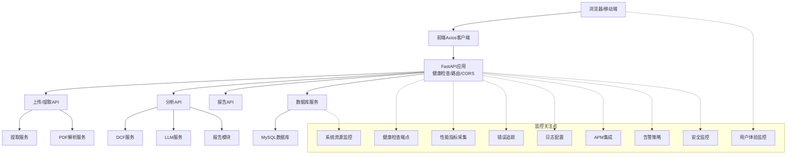
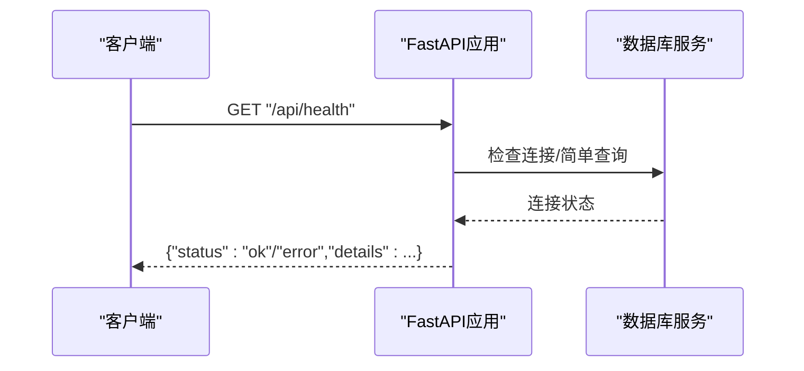
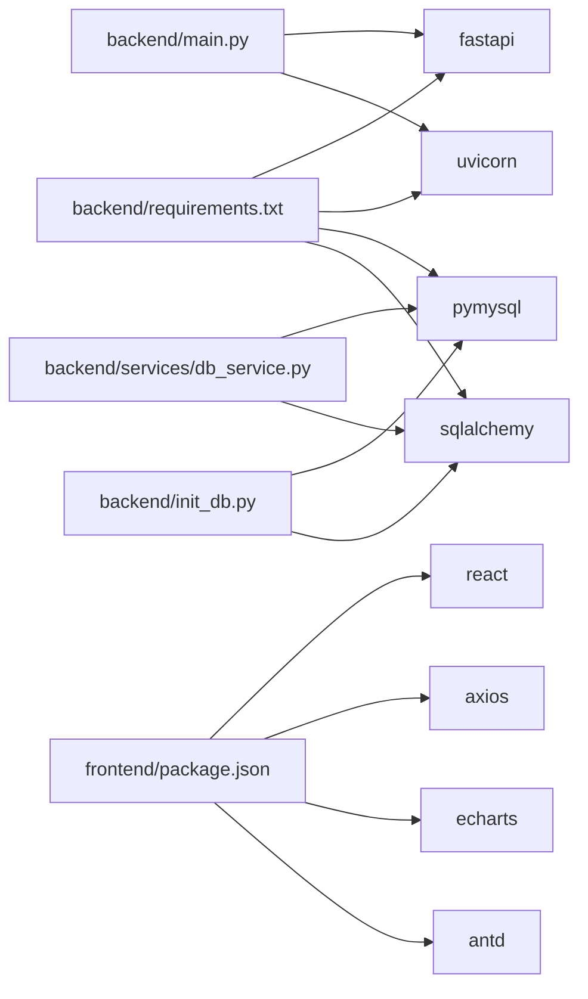

# 监控配置

<cite>
**本文引用的文件**
- [backend/main.py](file://backend/main.py)
- [backend/config.py](file://backend/config.py)
- [backend/requirements.txt](file://backend/requirements.txt)
- [backend/api/analysis.py](file://backend/api/analysis.py)
- [backend/api/report.py](file://backend/api/report.py)
- [backend/api/upload.py](file://backend/api/upload.py)
- [backend/services/db_service.py](file://backend/services/db_service.py)
- [backend/init_db.py](file://backend/init_db.py)
- [frontend/package.json](file://frontend/package.json)
</cite>

## 目录
1. [简介](#简介)
2. [项目结构](#项目结构)
3. [核心组件](#核心组件)
4. [架构总览](#架构总览)
5. [详细组件分析](#详细组件分析)
6. [依赖分析](#依赖分析)
7. [性能考虑](#性能考虑)
8. [故障排查指南](#故障排查指南)
9. [结论](#结论)
10. [附录](#附录)

## 简介
本文件面向DCF估值智能体项目，提供一套完整的监控配置方案，覆盖后端FastAPI服务的健康检查、性能指标、错误追踪、日志配置、APM集成、告警策略、系统资源监控、用户体验监控以及安全监控。由于当前仓库未包含任何监控相关实现，本文在不改变现有代码的前提下，给出可直接落地的配置建议与最佳实践。

## 项目结构
后端采用FastAPI框架，提供上传、提取、分析、报告等接口；前端基于React/Vite构建，通过Axios调用后端API。数据库初始化脚本负责创建MySQL表结构，数据库服务封装了连接与常用查询。

**图表来源**
- [backend/main.py:18-40](file://backend/main.py#L18-L40)
- [backend/config.py:10-22](file://backend/config.py#L10-L22)
- [backend/requirements.txt:1-11](file://backend/requirements.txt#L1-L11)
- [backend/api/upload.py:1-55](file://backend/api/upload.py#L1-L55)
- [backend/api/analysis.py:1-45](file://backend/api/analysis.py#L1-L45)
- [backend/api/report.py:1-12](file://backend/api/report.py#L1-L12)
- [backend/services/db_service.py:24-345](file://backend/services/db_service.py#L24-L345)
- [backend/init_db.py:22-219](file://backend/init_db.py#L22-L219)

**章节来源**
- [backend/main.py:18-40](file://backend/main.py#L18-L40)
- [backend/config.py:10-22](file://backend/config.py#L10-L22)
- [backend/requirements.txt:1-11](file://backend/requirements.txt#L1-L11)
- [frontend/package.json:1-37](file://frontend/package.json#L1-L37)

## 核心组件
- 应用入口与生命周期：定义应用标题、版本、CORS中间件、路由注册与健康检查端点。
- 配置管理：读取环境变量（如Minimax API配置、MySQL连接参数、上传目录）。
- 数据库服务：封装连接、事务、插入与查询逻辑，统一处理异常。
- API模块：上传PDF并提取文本、从文本提取财务数据、DCF计算、敏感性分析、叙事生成、报告模块占位。
- 前端依赖：React生态、Ant Design、Axios等，用于调用后端API。

**章节来源**
- [backend/main.py:18-40](file://backend/main.py#L18-L40)
- [backend/config.py:10-22](file://backend/config.py#L10-L22)
- [backend/api/upload.py:16-55](file://backend/api/upload.py#L16-L55)
- [backend/api/analysis.py:18-45](file://backend/api/analysis.py#L18-L45)
- [backend/api/report.py:8-12](file://backend/api/report.py#L8-L12)
- [backend/services/db_service.py:24-345](file://backend/services/db_service.py#L24-L345)
- [frontend/package.json:11-35](file://frontend/package.json#L11-L35)

## 架构总览
下图展示从浏览器到后端API再到数据库的整体链路，以及监控关注点的分布位置。

**图表来源**
- [backend/main.py:37-40](file://backend/main.py#L37-L40)
- [backend/api/upload.py:16-55](file://backend/api/upload.py#L16-L55)
- [backend/api/analysis.py:18-45](file://backend/api/analysis.py#L18-L45)
- [backend/api/report.py:8-12](file://backend/api/report.py#L8-L12)
- [backend/services/db_service.py:24-345](file://backend/services/db_service.py#L24-L345)

## 详细组件分析

### 健康检查端点
- 当前已存在基础健康检查端点，返回服务状态。
- 建议扩展：增加数据库连通性检查、外部服务可用性检查（如Minimax）、文件系统写入权限检查等。

**图表来源**
- [backend/main.py:37-40](file://backend/main.py#L37-L40)
- [backend/services/db_service.py:30-46](file://backend/services/db_service.py#L30-L46)

**章节来源**
- [backend/main.py:37-40](file://backend/main.py#L37-L40)

### 性能指标收集
- 建议使用OpenTelemetry或Prometheus+Pushgateway，对以下维度进行采集：
  - 请求延迟（按路径/方法分组）
  - 请求吞吐量（QPS）
  - 错误率（HTTP 5xx/业务异常）
  - 数据库查询耗时与慢查询
  - 外部服务调用耗时（LLM/Minimax）
- 在FastAPI中通过中间件或装饰器自动埋点，避免侵入业务代码。

[本节为通用实践说明，无需源码引用]

### 错误追踪
- 建议集成Sentry或类似平台，捕获：
  - 未处理异常栈信息
  - 请求上下文（URL、方法、Headers、Body摘要）
  - 用户标识（可选）
- 对数据库异常、PDF解析异常、LLM调用异常分别记录标签，便于定位。

[本节为通用实践说明，无需源码引用]

### 日志配置
- 日志级别：生产环境建议INFO以上，调试阶段可临时降为DEBUG。
- 日志轮转：按大小或时间滚动，保留最近N份备份。
- 结构化日志：统一字段（请求ID、时间、级别、模块、消息、上下文），便于检索与可视化。
- 建议在FastAPI应用层统一接入日志库，并对数据库与外部服务调用单独打点。

[本节为通用实践说明，无需源码引用]

### APM工具集成
- 性能监控：追踪端到端请求耗时、数据库与外部服务调用耗时、路由级指标。
- 错误监控：自动上报异常、统计错误趋势与影响面。
- 用户行为追踪：在前端埋点关键交互（点击、页面停留、API耗时），后端记录请求上下文与用户标识（如需）。
- 推荐方案：OpenTelemetry（自建或云厂商托管）、DataDog、NewRelic、Sentry（含性能面板）。

[本节为通用实践说明，无需源码引用]

### 告警配置
- 阈值设置：
  - 响应时间P95/P99 > N ms
  - 错误率 > M%
  - 数据库连接失败率 > K%
  - 外部服务超时率 > L%
- 通知渠道：邮件、即时通讯、电话（分级）
- 告警聚合：同类型告警在T分钟内去重合并，避免风暴

[本节为通用实践说明，无需源码引用]

### 系统资源监控
- CPU：进程CPU使用率、峰值与平均值
- 内存：RSS/堆内存、GC指标（如适用）
- 磁盘：inode与容量使用率、I/O等待
- 网络：连接数、带宽、连接复用率
- 建议使用Prometheus+Grafana或云监控平台，结合容器编排部署。

[本节为通用实践说明，无需源码引用]

### 用户体验监控
- 页面加载时间：首屏、白屏、资源加载
- API响应时间：按接口维度统计
- 用户操作追踪：关键动作（上传、计算、导出）耗时与成功率
- 前端埋点：在关键路由与组件生命周期打点，后端记录请求ID以便关联

[本节为通用实践说明，无需源码引用]

### 安全监控
- 访问日志：记录来源IP、User-Agent、请求路径、状态码、耗时
- 异常行为检测：异常频率（如短时间内大量4xx）、异常参数模式
- 安全事件告警：鉴权失败、SQL注入尝试、文件上传类型异常等
- 建议：WAF日志接入、SIEM平台、合规审计

[本节为通用实践说明，无需源码引用]

## 依赖分析
- 后端运行时依赖：FastAPI、Uvicorn、PyMySQL、SQLAlchemy、httpx、pdfplumber、dotenv等。
- 前端运行时依赖：React、Ant Design、Axios、ECharts等。
- 数据库初始化脚本与服务均依赖配置中的MySQL参数。

**图表来源**
- [backend/requirements.txt:1-11](file://backend/requirements.txt#L1-L11)
- [frontend/package.json:11-35](file://frontend/package.json#L11-L35)

**章节来源**
- [backend/requirements.txt:1-11](file://backend/requirements.txt#L1-L11)
- [frontend/package.json:11-35](file://frontend/package.json#L11-L35)

## 性能考虑
- 数据库连接池：在数据库服务中启用连接池，减少连接开销。
- 缓存策略：热点数据（如股票基本信息）可引入Redis缓存。
- 并发控制：对外部LLM调用增加限流与熔断，避免雪崩。
- I/O优化：上传文件解析与删除流程已在后端完成，确保异常清理逻辑健壮。
- 前端懒加载与CDN：提升页面加载速度，降低首屏时间。

[本节为通用实践说明，无需源码引用]

## 故障排查指南
- 健康检查失败
  - 检查数据库连接参数与可达性
  - 查看数据库服务是否正常
- 上传/提取失败
  - 确认上传目录权限与磁盘空间
  - 检查PDF解析依赖与文本提取结果
- 分析接口异常
  - 关注LLM服务可用性与超时
  - 核对输入参数格式与必填项
- 报告模块占位
  - 当前为占位接口，后续实现时需补充错误处理与进度反馈

**章节来源**
- [backend/main.py:37-40](file://backend/main.py#L37-L40)
- [backend/api/upload.py:16-55](file://backend/api/upload.py#L16-L55)
- [backend/api/analysis.py:18-45](file://backend/api/analysis.py#L18-L45)
- [backend/api/report.py:8-12](file://backend/api/report.py#L8-L12)
- [backend/services/db_service.py:24-345](file://backend/services/db_service.py#L24-L345)

## 结论
本监控配置文档在不修改现有代码的前提下，提供了从健康检查、性能指标、错误追踪、日志、APM、告警、系统资源、用户体验与安全监控的完整方案。建议优先落地健康检查与日志标准化，再逐步引入APM与告警，最终完善系统资源与用户体验监控，以保障DCF估值智能体的稳定性与可观测性。

## 附录
- 快速清单
  - 增加数据库连通性检查到健康端点
  - 统一结构化日志输出与轮转
  - 集成Sentry或OpenTelemetry
  - 设置Prometheus指标与Grafana仪表板
  - 配置告警规则与通知渠道
  - 前端埋点关键交互与API耗时
  - 安全日志与异常行为检测