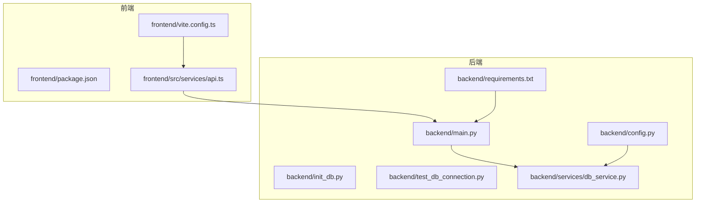
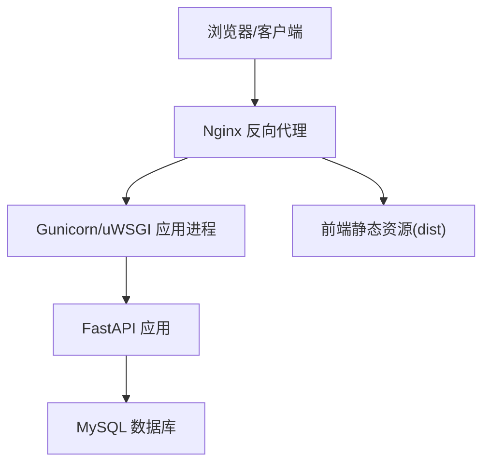
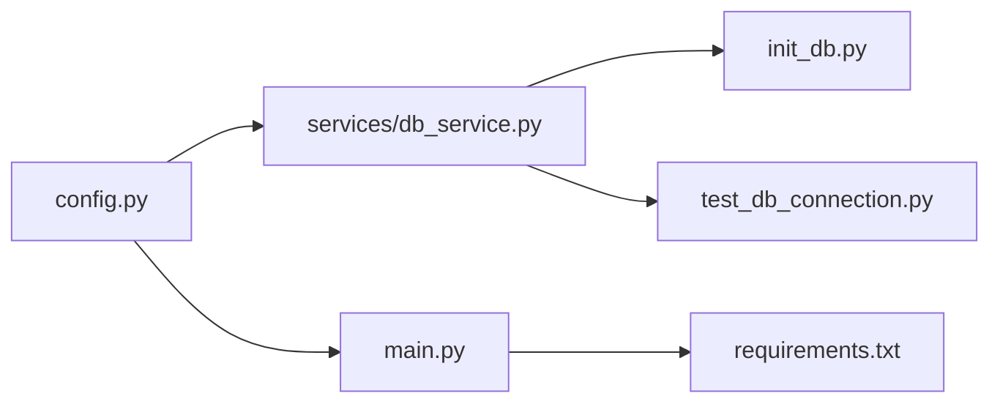

# 部署指南

<cite>
**本文引用的文件**
- [backend/main.py](file://backend/main.py)
- [backend/config.py](file://backend/config.py)
- [backend/requirements.txt](file://backend/requirements.txt)
- [backend/MYSQL_SETUP_GUIDE.md](file://backend/MYSQL_SETUP_GUIDE.md)
- [backend/DATABASE_README.md](file://backend/DATABASE_README.md)
- [backend/init_db.py](file://backend/init_db.py)
- [backend/test_db_connection.py](file://backend/test_db_connection.py)
- [backend/services/db_service.py](file://backend/services/db_service.py)
- [frontend/package.json](file://frontend/package.json)
- [frontend/vite.config.ts](file://frontend/vite.config.ts)
- [frontend/src/services/api.ts](file://frontend/src/services/api.ts)
</cite>

## 目录
1. [简介](#简介)
2. [项目结构](#项目结构)
3. [核心组件](#核心组件)
4. [架构总览](#架构总览)
5. [详细组件分析](#详细组件分析)
6. [依赖分析](#依赖分析)
7. [性能考虑](#性能考虑)
8. [故障排查指南](#故障排查指南)
9. [结论](#结论)
10. [附录](#附录)

## 简介
本指南面向DCF估值智能体项目的生产环境部署，覆盖服务器准备、环境配置、依赖安装、前后端构建与部署、数据库部署与配置、容器化方案、监控与日志、以及域名与CDN等网络配置。文档基于仓库现有代码与配置文件进行梳理，确保部署流程可操作、可追溯。

## 项目结构
项目采用前后端分离架构：
- 后端：基于FastAPI，提供分析、报告、上传等API接口，并通过CORS中间件支持跨域。
- 前端：基于React + Vite，使用TypeScript与Ant Design，通过Axios调用后端API。
- 数据库：默认使用MySQL，提供初始化脚本与连接测试工具；亦支持切换为SQLite（非生产推荐）。

**图表来源**
- [backend/main.py:1-40](file://backend/main.py#L1-L40)
- [backend/config.py:1-22](file://backend/config.py#L1-L22)
- [backend/requirements.txt:1-11](file://backend/requirements.txt#L1-L11)
- [backend/init_db.py:1-219](file://backend/init_db.py#L1-L219)
- [backend/test_db_connection.py:1-183](file://backend/test_db_connection.py#L1-L183)
- [backend/services/db_service.py:1-345](file://backend/services/db_service.py#L1-L345)
- [frontend/package.json:1-37](file://frontend/package.json#L1-L37)
- [frontend/vite.config.ts:1-22](file://frontend/vite.config.ts#L1-L22)
- [frontend/src/services/api.ts:1-81](file://frontend/src/services/api.ts#L1-L81)

**章节来源**
- [backend/main.py:1-40](file://backend/main.py#L1-L40)
- [backend/config.py:1-22](file://backend/config.py#L1-L22)
- [backend/requirements.txt:1-11](file://backend/requirements.txt#L1-L11)
- [frontend/package.json:1-37](file://frontend/package.json#L1-L37)
- [frontend/vite.config.ts:1-22](file://frontend/vite.config.ts#L1-L22)
- [frontend/src/services/api.ts:1-81](file://frontend/src/services/api.ts#L1-L81)

## 核心组件
- 后端应用入口与生命周期管理：定义FastAPI应用、CORS中间件、路由挂载与健康检查端点。
- 配置模块：加载环境变量，定义Minimax LLM接入参数与MySQL连接参数。
- 依赖清单：声明FastAPI、Uvicorn、OpenAI SDK、HTTP客户端、PDF解析、多部分表单、Pydantic、dotenv、SQLAlchemy与PyMySQL等依赖。
- 数据库服务：封装连接、事务、插入与查询等操作，提供股票与财务报表数据的增删改查能力。
- 前端构建与代理：Vite开发服务器、代理后端API、路径别名与构建脚本。

**章节来源**
- [backend/main.py:12-40](file://backend/main.py#L12-L40)
- [backend/config.py:10-22](file://backend/config.py#L10-L22)
- [backend/requirements.txt:1-11](file://backend/requirements.txt#L1-L11)
- [backend/services/db_service.py:24-345](file://backend/services/db_service.py#L24-L345)
- [frontend/vite.config.ts:5-22](file://frontend/vite.config.ts#L5-L22)

## 架构总览
生产部署建议采用“Nginx反向代理 + Gunicorn/uWSGI + FastAPI + MySQL”的组合，前端静态资源由Nginx提供，后端通过Unix Socket或本地端口提供API服务。

[此图为概念性架构示意，不直接映射具体源码文件，故不提供图表来源]

## 详细组件分析

### 后端部署策略（FastAPI + Gunicorn/uWSGI + Nginx）
- 应用入口与路由
  - 应用在生命周期内确保上传目录存在，注册CORS中间件，挂载上传、分析、报告三类路由，并提供健康检查端点。
  - 参考路径：[backend/main.py:12-40](file://backend/main.py#L12-L40)

- 环境变量与数据库配置
  - 通过dotenv加载后端根目录与项目根目录下的.env文件，读取Minimax与MySQL相关配置。
  - 参考路径：[backend/config.py:7-22](file://backend/config.py#L7-L22)

- 依赖安装
  - 使用pip安装requirements.txt中声明的依赖，确保Uvicorn、FastAPI、PyMySQL、SQLAlchemy等可用。
  - 参考路径：[backend/requirements.txt:1-11](file://backend/requirements.txt#L1-L11)

- Gunicorn/uWSGI配置要点
  - 绑定地址与进程数：建议监听本地回环或Unix Socket，避免暴露公网端口；根据CPU核数设置worker数量。
  - Worker类型：同步worker配合异步IO（如Uvicorn）或使用gevent等异步worker。
  - 并发模型：限制每个worker的并发请求数，防止内存溢出。
  - 日志：stdout/stderr统一收集，便于容器日志采集。
  - 参考路径：[backend/main.py:18-30](file://backend/main.py#L18-L30)

- Nginx反向代理
  - 将/api前缀转发至后端应用（Unix Socket或本地端口），静态资源指向前端dist目录。
  - 启用gzip压缩、缓存策略与安全头（如X-Frame-Options、X-Content-Type-Options）。
  - 参考路径：[frontend/vite.config.ts:14-20](file://frontend/vite.config.ts#L14-L20)

- 健康检查与重启策略
  - 使用后端健康检查端点进行存活探针，结合进程管理器实现自动重启。
  - 参考路径：[backend/main.py:37-40](file://backend/main.py#L37-L40)

**章节来源**
- [backend/main.py:12-40](file://backend/main.py#L12-L40)
- [backend/config.py:7-22](file://backend/config.py#L7-L22)
- [backend/requirements.txt:1-11](file://backend/requirements.txt#L1-L11)
- [frontend/vite.config.ts:14-20](file://frontend/vite.config.ts#L14-L20)

### 前端构建配置（Vite + React）
- 构建脚本与开发代理
  - 开发时通过Vite代理将/api请求转发至后端（默认本地8001端口），生产构建产物位于dist目录。
  - 参考路径：[frontend/package.json:6-10](file://frontend/package.json#L6-L10)，[frontend/vite.config.ts:12-20](file://frontend/vite.config.ts#L12-L20)

- 路径别名与TypeScript
  - @别名指向src目录，便于导入组件与类型；TypeScript与React生态完善。
  - 参考路径：[frontend/vite.config.ts:7-11](file://frontend/vite.config.ts#L7-L11)，[frontend/package.json:26-35](file://frontend/package.json#L26-L35)

- API调用封装
  - Axios实例以/baseURL="/api"统一前缀，超时时间与错误处理封装在函数中。
  - 参考路径：[frontend/src/services/api.ts:11-26](file://frontend/src/services/api.ts#L11-L26)

- 生产部署建议
  - 将dist目录交由Nginx提供静态资源；确保CORS与安全头配置正确。
  - 参考路径：[frontend/vite.config.ts:12-20](file://frontend/vite.config.ts#L12-L20)

**章节来源**
- [frontend/package.json:6-10](file://frontend/package.json#L6-L10)
- [frontend/vite.config.ts:7-20](file://frontend/vite.config.ts#L7-L20)
- [frontend/src/services/api.ts:11-26](file://frontend/src/services/api.ts#L11-L26)

### 数据库部署与配置（MySQL）
- 连接与认证
  - 从环境变量读取主机、端口、用户名、密码与数据库名；默认数据库名为dcf_estimation。
  - 参考路径：[backend/config.py:14-21](file://backend/config.py#L14-L21)

- 初始化与表结构
  - 初始化脚本创建数据库与六张核心表（stocks、asset_profiles、historical_prices、balance_sheets、cash_flows、income_statements），并设置唯一约束与外键。
  - 参考路径：[backend/init_db.py:68-161](file://backend/init_db.py#L68-L161)，[backend/DATABASE_README.md:44-49](file://backend/DATABASE_README.md#L44-L49)

- 连接测试与故障排查
  - 提供连接测试脚本，验证服务器连通性、数据库存在性与基本CRUD能力；包含常见问题诊断与修复建议。
  - 参考路径：[backend/test_db_connection.py:22-71](file://backend/test_db_connection.py#L22-L71)，[backend/MYSQL_SETUP_GUIDE.md:173-207](file://backend/MYSQL_SETUP_GUIDE.md#L173-L207)

- Docker快速部署（开发/演示）
  - 提供Docker运行MySQL容器的命令与验证步骤，便于快速搭建环境。
  - 参考路径：[backend/MYSQL_SETUP_GUIDE.md:100-107](file://backend/MYSQL_SETUP_GUIDE.md#L100-L107)，[backend/MYSQL_SETUP_GUIDE.md:134-156](file://backend/MYSQL_SETUP_GUIDE.md#L134-L156)

- 备份策略（建议）
  - 建议使用mysqldump定期导出数据库；对历史价格与财务报表表可按月/季度归档；生产环境建议开启binlog与主从复制。
  - [本小节为通用建议，不直接分析具体文件]

**章节来源**
- [backend/config.py:14-21](file://backend/config.py#L14-L21)
- [backend/init_db.py:68-161](file://backend/init_db.py#L68-L161)
- [backend/DATABASE_README.md:44-49](file://backend/DATABASE_README.md#L44-L49)
- [backend/test_db_connection.py:22-71](file://backend/test_db_connection.py#L22-L71)
- [backend/MYSQL_SETUP_GUIDE.md:100-107](file://backend/MYSQL_SETUP_GUIDE.md#L100-L107)
- [backend/MYSQL_SETUP_GUIDE.md:134-156](file://backend/MYSQL_SETUP_GUIDE.md#L134-L156)

### Docker容器化部署方案（建议）
- 后端镜像
  - 基于Python官方镜像，安装依赖并暴露应用端口；使用非root用户运行；挂载持久化卷存放上传目录与日志。
  - 参考路径：[backend/requirements.txt:1-11](file://backend/requirements.txt#L1-L11)

- 前端镜像
  - 基于Node构建产物，使用Nginx提供静态资源；启用gzip与缓存头。
  - 参考路径：[frontend/package.json:6-10](file://frontend/package.json#L6-L10)，[frontend/vite.config.ts:12-20](file://frontend/vite.config.ts#L12-L20)

- Compose编排（建议）
  - 使用docker-compose编排：nginx、gunicorn、fastapi、mysql；共享网络与卷；设置健康检查与重启策略。
  - [本小节为通用建议，不直接分析具体文件]

**章节来源**
- [backend/requirements.txt:1-11](file://backend/requirements.txt#L1-L11)
- [frontend/package.json:6-10](file://frontend/package.json#L6-L10)
- [frontend/vite.config.ts:12-20](file://frontend/vite.config.ts#L12-L20)

### 监控与日志配置（建议）
- 应用监控
  - 使用Gunicorn/uWSGI自带指标或第三方Prometheus Exporter；关注请求QPS、响应时间、错误率与Worker状态。
  - [本小节为通用建议，不直接分析具体文件]

- 错误追踪
  - 在后端捕获异常并记录结构化日志；在前端统一拦截Axios错误并上报。
  - 参考路径：[frontend/src/services/api.ts:17-26](file://frontend/src/services/api.ts#L17-L26)

- 性能分析
  - 对数据库查询建立索引与慢查询日志；对LLM调用增加超时与重试机制。
  - 参考路径：[backend/services/db_service.py:275-299](file://backend/services/db_service.py#L275-L299)

**章节来源**
- [frontend/src/services/api.ts:17-26](file://frontend/src/services/api.ts#L17-L26)
- [backend/services/db_service.py:275-299](file://backend/services/db_service.py#L275-L299)

### 域名配置、SSL证书与CDN加速（建议）
- 域名与DNS
  - 将域名A/AAAA记录指向服务器IP；配置子域api.example.com指向后端，静态资源指向Nginx。
  - [本小节为通用建议，不直接分析具体文件]

- SSL证书
  - 使用Let’s Encrypt免费证书；在Nginx启用HTTPS与安全套件；强制HTTP重定向至HTTPS。
  - [本小节为通用建议，不直接分析具体文件]

- CDN加速
  - 前端静态资源走CDN缓存；后端API保持直连或通过边缘网关；合理设置缓存头与压缩。
  - [本小节为通用建议，不直接分析具体文件]

## 依赖分析
后端依赖关系清晰，核心模块间耦合度低，便于独立部署与扩展。

**图表来源**
- [backend/config.py:10-22](file://backend/config.py#L10-L22)
- [backend/services/db_service.py:15-21](file://backend/services/db_service.py#L15-L21)
- [backend/main.py:8-34](file://backend/main.py#L8-L34)
- [backend/init_db.py:13-19](file://backend/init_db.py#L13-L19)
- [backend/test_db_connection.py:13-19](file://backend/test_db_connection.py#L13-L19)
- [backend/requirements.txt:1-11](file://backend/requirements.txt#L1-L11)

**章节来源**
- [backend/config.py:10-22](file://backend/config.py#L10-L22)
- [backend/services/db_service.py:15-21](file://backend/services/db_service.py#L15-L21)
- [backend/main.py:8-34](file://backend/main.py#L8-L34)
- [backend/init_db.py:13-19](file://backend/init_db.py#L13-L19)
- [backend/test_db_connection.py:13-19](file://backend/test_db_connection.py#L13-L19)
- [backend/requirements.txt:1-11](file://backend/requirements.txt#L1-L11)

## 性能考虑
- 数据库层
  - 为高频查询字段建立索引；对历史价格表按ticker、price_date、data_frequency建立复合索引。
  - 参考路径：[backend/init_db.py:95-111](file://backend/init_db.py#L95-L111)，[backend/services/db_service.py:275-299](file://backend/services/db_service.py#L275-L299)

- 应用层
  - 合理设置Gunicorn worker数量与并发；对长耗时任务（PDF解析、LLM调用）异步化或队列化。
  - [本小节为通用建议，不直接分析具体文件]

- 缓存层（建议）
  - 对热点财务报表与历史价格引入Redis缓存；设置过期策略与失效双写。
  - [本小节为通用建议，不直接分析具体文件]

**章节来源**
- [backend/init_db.py:95-111](file://backend/init_db.py#L95-L111)
- [backend/services/db_service.py:275-299](file://backend/services/db_service.py#L275-L299)

## 故障排查指南
- 数据库连接失败
  - 检查MySQL服务状态、端口占用与防火墙；核对.env中的主机、端口、用户名与密码；使用连接测试脚本定位问题。
  - 参考路径：[backend/MYSQL_SETUP_GUIDE.md:173-207](file://backend/MYSQL_SETUP_GUIDE.md#L173-L207)，[backend/test_db_connection.py:22-71](file://backend/test_db_connection.py#L22-L71)

- 表结构初始化失败
  - 确认具备CREATE DATABASE权限；查看错误日志；重复执行初始化脚本（幂等）。
  - 参考路径：[backend/DATABASE_README.md:139-144](file://backend/DATABASE_README.md#L139-L144)，[backend/init_db.py:167-170](file://backend/init_db.py#L167-L170)

- 前端无法访问后端API
  - 核对Vite代理配置与Nginx反代；确认/api前缀一致；检查CORS策略。
  - 参考路径：[frontend/vite.config.ts:14-20](file://frontend/vite.config.ts#L14-L20)，[backend/main.py:24-30](file://backend/main.py#L24-L30)

**章节来源**
- [backend/MYSQL_SETUP_GUIDE.md:173-207](file://backend/MYSQL_SETUP_GUIDE.md#L173-L207)
- [backend/test_db_connection.py:22-71](file://backend/test_db_connection.py#L22-L71)
- [backend/DATABASE_README.md:139-144](file://backend/DATABASE_README.md#L139-L144)
- [backend/init_db.py:167-170](file://backend/init_db.py#L167-L170)
- [frontend/vite.config.ts:14-20](file://frontend/vite.config.ts#L14-L20)
- [backend/main.py:24-30](file://backend/main.py#L24-L30)

## 结论
本部署指南基于仓库现有代码与配置文件，给出了生产环境的完整落地路径：后端采用Gunicorn/uWSGI + Nginx，前端静态资源由Nginx提供，数据库使用MySQL并提供初始化与测试工具。建议在生产环境中补充容器化、监控告警、SSL与CDN等能力，以满足高可用与高性能需求。

## 附录
- 关键文件路径参考
  - 后端入口与路由：[backend/main.py:12-40](file://backend/main.py#L12-L40)
  - 配置与依赖：[backend/config.py:7-22](file://backend/config.py#L7-L22)，[backend/requirements.txt:1-11](file://backend/requirements.txt#L1-L11)
  - 数据库初始化与测试：[backend/init_db.py:68-161](file://backend/init_db.py#L68-L161)，[backend/test_db_connection.py:22-71](file://backend/test_db_connection.py#L22-L71)
  - 前端构建与代理：[frontend/package.json:6-10](file://frontend/package.json#L6-L10)，[frontend/vite.config.ts:12-20](file://frontend/vite.config.ts#L12-L20)，[frontend/src/services/api.ts:11-26](file://frontend/src/services/api.ts#L11-L26)