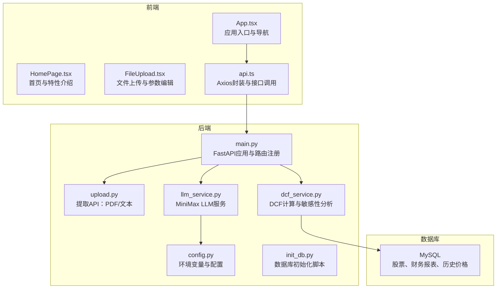
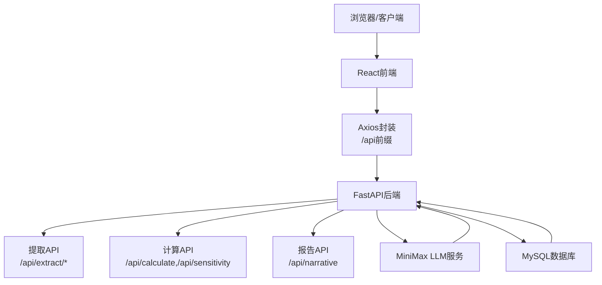
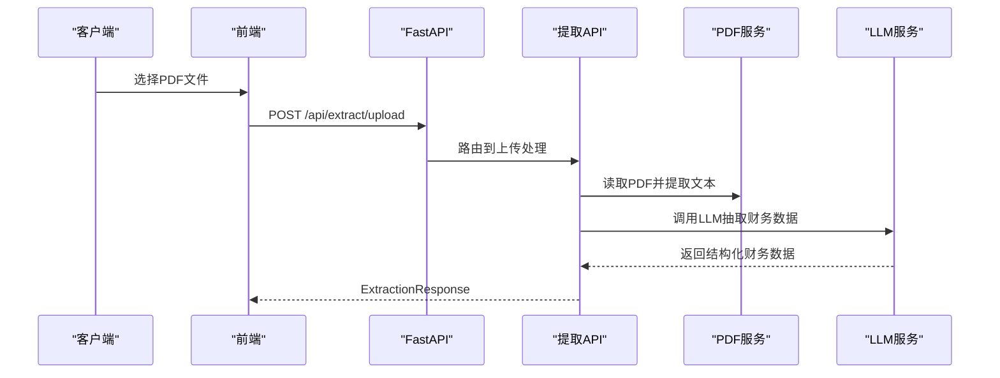
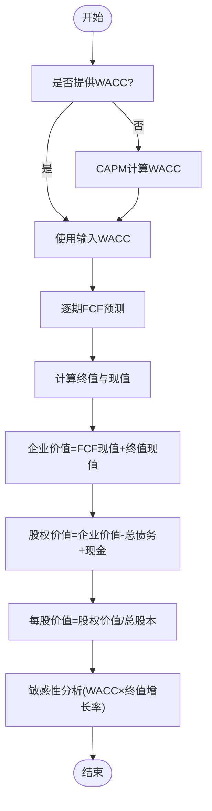
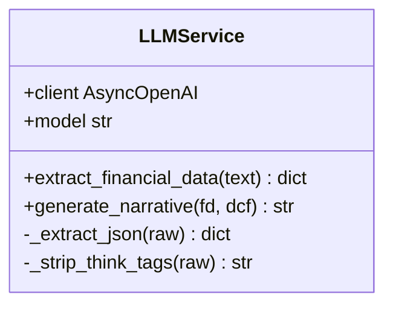
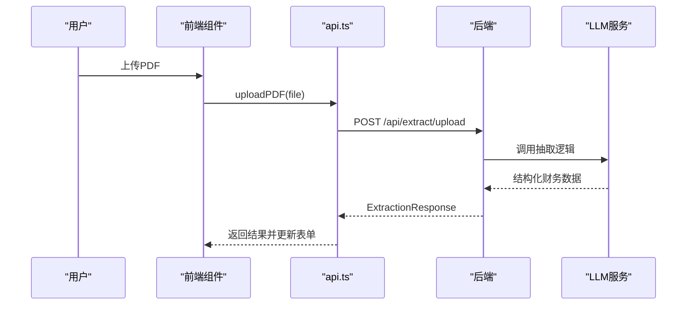
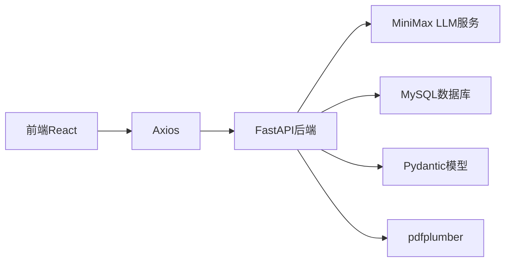

# 项目概述

<cite>
**本文档引用的文件**
- [backend/main.py](file://backend/main.py)
- [backend/config.py](file://backend/config.py)
- [backend/services/dcf_service.py](file://backend/services/dcf_service.py)
- [backend/services/llm_service.py](file://backend/services/llm_service.py)
- [backend/models/schemas.py](file://backend/models/schemas.py)
- [backend/api/upload.py](file://backend/api/upload.py)
- [backend/init_db.py](file://backend/init_db.py)
- [backend/DATABASE_README.md](file://backend/DATABASE_README.md)
- [backend/requirements.txt](file://backend/requirements.txt)
- [frontend/src/App.tsx](file://frontend/src/App.tsx)
- [frontend/src/pages/HomePage.tsx](file://frontend/src/pages/HomePage.tsx)
- [frontend/src/components/FileUpload.tsx](file://frontend/src/components/FileUpload.tsx)
- [frontend/src/services/api.ts](file://frontend/src/services/api.ts)
- [frontend/package.json](file://frontend/package.json)
</cite>

## 目录
1. [引言](#引言)
2. [项目结构](#项目结构)
3. [核心组件](#核心组件)
4. [架构总览](#架构总览)
5. [详细组件分析](#详细组件分析)
6. [依赖分析](#依赖分析)
7. [性能考虑](#性能考虑)
8. [故障排除指南](#故障排除指南)
9. [结论](#结论)
10. [附录](#附录)

## 引言
DCF估值智能体项目旨在通过自动化财务数据提取、专业DCF估值计算与AI驱动的分析报告生成，为用户提供高效、准确且可复现的估值流程。项目围绕三大核心价值展开：
- 自动化财务数据提取：支持从PDF财务报告中抽取结构化财务数据，减少人工录入误差与时间成本。
- 专业DCF估值计算：内置严谨的现金流折现模型，支持WACC计算、自由现金流预测、终值估计与敏感性分析。
- AI驱动分析报告：基于MiniMax大模型生成专业的估值分析与洞察，辅助用户理解估值结果与关键假设。

项目采用前后端分离的全栈架构，后端基于FastAPI提供高性能API，前端使用React构建交互式界面，AI服务集成MiniMax LLM，数据库采用MySQL存储历史财务与分析数据，形成完整的技术闭环。

## 项目结构
项目采用清晰的分层组织方式：
- 后端（Python/FastAPI）：负责API路由、业务逻辑、AI服务与数据库交互。
- 前端（React/Vite）：负责用户界面、表单交互、图表展示与状态管理。
- 数据库（MySQL）：持久化存储股票、财务报表与分析结果，支撑趋势分析与历史回溯。

**图示来源**
- [backend/main.py:18-34](file://backend/main.py#L18-L34)
- [backend/api/upload.py:13-13](file://backend/api/upload.py#L13-L13)
- [backend/services/dcf_service.py:85-121](file://backend/services/dcf_service.py#L85-L121)
- [backend/services/llm_service.py:70-76](file://backend/services/llm_service.py#L70-L76)
- [backend/init_db.py:68-161](file://backend/init_db.py#L68-L161)

**章节来源**
- [backend/main.py:18-40](file://backend/main.py#L18-L40)
- [frontend/src/App.tsx:105-147](file://frontend/src/App.tsx#L105-L147)

## 核心组件
- FastAPI后端服务：统一的API入口，注册上传、分析与报告相关路由，并启用CORS跨域支持。
- LLM服务（MiniMax）：负责从财务文本中抽取结构化数据与生成分析报告。
- DCF计算服务：实现WACC计算、FCF预测、终值估计与敏感性矩阵生成。
- 数据模型（Pydantic）：定义财务数据、DCF参数、结果与敏感性矩阵的数据结构。
- 数据库初始化：自动创建数据库与财务报表相关表，支持历史数据持久化。
- React前端：提供文件上传、参数编辑、图表展示与多语言切换等交互能力。

**章节来源**
- [backend/config.py:10-22](file://backend/config.py#L10-L22)
- [backend/models/schemas.py:8-101](file://backend/models/schemas.py#L8-L101)
- [backend/init_db.py:68-161](file://backend/init_db.py#L68-L161)
- [frontend/src/components/FileUpload.tsx:12-159](file://frontend/src/components/FileUpload.tsx#L12-L159)

## 架构总览
系统采用前后端分离架构，后端提供RESTful API，前端通过Axios调用后端接口；AI服务通过MiniMax API完成数据抽取与报告生成；数据库用于存储历史财务与分析数据，支撑趋势分析与复用。

**图示来源**
- [frontend/src/services/api.ts:11-15](file://frontend/src/services/api.ts#L11-L15)
- [backend/main.py:32-34](file://backend/main.py#L32-L34)
- [backend/services/llm_service.py:70-76](file://backend/services/llm_service.py#L70-L76)
- [backend/init_db.py:68-161](file://backend/init_db.py#L68-L161)

## 详细组件分析

### 后端API与路由
- 应用启动与生命周期：在应用启动时确保上传目录存在，提供健康检查端点。
- 路由注册：统一在主应用中注册上传、分析与报告相关路由，并设置CORS允许所有来源访问。
- 提取API：支持上传PDF与直接传入文本两种方式，先进行PDF文本提取，再调用LLM抽取结构化财务数据。

**图示来源**
- [backend/main.py:18-34](file://backend/main.py#L18-L34)
- [backend/api/upload.py:16-54](file://backend/api/upload.py#L16-L54)
- [backend/services/llm_service.py:94-123](file://backend/services/llm_service.py#L94-L123)

**章节来源**
- [backend/main.py:12-40](file://backend/main.py#L12-L40)
- [backend/api/upload.py:16-54](file://backend/api/upload.py#L16-L54)

### DCF估值计算服务
- WACC计算：支持手动覆盖或根据CAPM公式自动计算，结合权益与债务权重及税后成本。
- 自由现金流预测：按年份推进，基于收入增长率、运营利润率、折旧摊销、资本支出与营运资本变动计算FCF与折现因子。
- 终值估计：采用永续增长模型，当WACC不小于终值增长率时返回0。
- 整体估值：汇总FCF现值与终值现值得到企业价值，再调整债务与现金得到股权价值，计算每股价值与上/下空间。
- 敏感性分析：对WACC与终值增长率进行网格扫描，输出敏感性矩阵。

**图示来源**
- [backend/services/dcf_service.py:12-121](file://backend/services/dcf_service.py#L12-L121)
- [backend/services/dcf_service.py:123-163](file://backend/services/dcf_service.py#L123-L163)

**章节来源**
- [backend/services/dcf_service.py:12-163](file://backend/services/dcf_service.py#L12-L163)

### LLM服务与MiniMax集成
- 系统提示词：针对财务数据抽取与分析报告生成分别设计系统提示词，确保输出结构化与专业性。
- JSON解析：从LLM响应中提取JSON，去除思维标签与代码块标记，保证数据可用性。
- 错误处理：捕获JSON解析异常与通用异常，记录日志并向上抛出，便于前端展示与调试。

**图示来源**
- [backend/services/llm_service.py:70-155](file://backend/services/llm_service.py#L70-L155)

**章节来源**
- [backend/services/llm_service.py:70-155](file://backend/services/llm_service.py#L70-L155)

### 数据模型与类型定义
- FinancialData：涵盖公司名称、股票代码、财务指标、杠杆与贝塔等。
- DCFParameters：投影年限、收入增长率、终端增长率、各项比率与WACC等。
- DCFResult：包含各年度FCF明细、终值、企业与股权价值、每股价值与上/下空间。
- SensitivityMatrix：敏感性分析结果矩阵。
- 请求/响应模型：ExtractionResponse、NarrativeRequest、NarrativeResponse、CalculateRequest。

**章节来源**
- [backend/models/schemas.py:8-101](file://backend/models/schemas.py#L8-L101)

### 数据库设计与初始化
- 表结构：包含股票基础信息、资产档案、历史价格、资产负债表、现金流表与损益表等。
- 初始化脚本：自动创建数据库与表，具备幂等性与错误回滚机制。
- 集成建议：可用于存储历史DCF结果、财务报表与价格序列，支撑趋势分析与复用。

**章节来源**
- [backend/init_db.py:68-161](file://backend/init_db.py#L68-L161)
- [backend/DATABASE_README.md:60-168](file://backend/DATABASE_README.md#L60-L168)

### 前端组件与交互
- 应用入口：Ant Design主题与暗色模式切换、国际化菜单与路由导航。
- 首页：特性卡片与引导按钮，提升用户体验与功能认知。
- 文件上传：拖拽上传PDF，自动提取文本并调用后端提取接口，支持手动修正参数。
- API封装：统一的Axios实例，设置超时与错误处理，便于前端调用后端接口。

**图示来源**
- [frontend/src/components/FileUpload.tsx:21-48](file://frontend/src/components/FileUpload.tsx#L21-L48)
- [frontend/src/services/api.ts:28-40](file://frontend/src/services/api.ts#L28-L40)
- [backend/api/upload.py:16-38](file://backend/api/upload.py#L16-L38)

**章节来源**
- [frontend/src/App.tsx:105-147](file://frontend/src/App.tsx#L105-L147)
- [frontend/src/pages/HomePage.tsx:23-117](file://frontend/src/pages/HomePage.tsx#L23-L117)
- [frontend/src/components/FileUpload.tsx:12-159](file://frontend/src/components/FileUpload.tsx#L12-L159)
- [frontend/src/services/api.ts:11-81](file://frontend/src/services/api.ts#L11-L81)

## 依赖分析
- 后端依赖：FastAPI、Uvicorn、OpenAI SDK、HTTPX、pdfplumber、python-multipart、Pydantic、dotenv、PyMySQL、SQLAlchemy。
- 前端依赖：React、React Router、Ant Design、Axios、ECharts、Zustand、i18n等。
- 关键耦合点：后端通过LLM服务与MiniMax交互；通过数据库服务持久化财务与分析数据；前端通过Axios统一调用后端API。

**图示来源**
- [backend/requirements.txt:1-11](file://backend/requirements.txt#L1-L11)
- [frontend/package.json:11-37](file://frontend/package.json#L11-L37)

**章节来源**
- [backend/requirements.txt:1-11](file://backend/requirements.txt#L1-L11)
- [frontend/package.json:11-37](file://frontend/package.json#L11-L37)

## 性能考虑
- API超时与并发：后端使用异步上下文与标准ASGI服务器，前端Axios设置合理超时，适合高并发场景。
- LLM调用：温度与最大令牌数控制输出稳定性与长度，避免过长响应影响性能。
- 数据库连接：初始化脚本提供连接池与事务支持，建议在生产环境中启用连接池与索引优化。
- 前端渲染：图表组件按需加载，避免一次性渲染大量数据导致卡顿。

## 故障排除指南
- CORS跨域：确认后端已启用CORS中间件并允许所有来源访问。
- LLM响应解析：若出现JSON解析失败，检查系统提示词与响应格式，必要时增加重试与日志记录。
- 数据库连接：检查.env中的数据库凭据与权限，确保MySQL服务运行正常。
- 文件上传：确认上传目录可写，PDF文本提取成功后再进行LLM抽取。

**章节来源**
- [backend/main.py:24-30](file://backend/main.py#L24-L30)
- [backend/services/llm_service.py:117-122](file://backend/services/llm_service.py#L117-L122)
- [backend/DATABASE_README.md:130-151](file://backend/DATABASE_README.md#L130-L151)

## 结论
DCF估值智能体项目通过自动化数据提取、严谨的DCF计算与AI驱动的分析报告，显著提升了估值工作的效率与一致性。前后端分离架构与MiniMax集成使系统具备良好的扩展性与智能化水平，MySQL数据库为历史数据与趋势分析提供了坚实基础。未来可在数据库连接池、缓存层、迁移脚本与更多财务指标方面持续优化，进一步增强系统的性能与可维护性。

## 附录
- 技术栈概览
  - 后端：FastAPI、OpenAI SDK、pdfplumber、Pydantic、PyMySQL、SQLAlchemy
  - 前端：React、Ant Design、Axios、ECharts、Zustand、i18n
  - AI服务：MiniMax LLM
  - 数据库：MySQL
- 关键配置
  - 环境变量：MINIMAX_API_KEY、MINIMAX_BASE_URL、MINIMAX_MODEL、MySQL连接参数
  - 上传目录：后端临时上传路径
- 数据库初始化
  - 运行初始化脚本创建数据库与表，支持历史数据持久化与趋势分析

**章节来源**
- [backend/config.py:10-22](file://backend/config.py#L10-L22)
- [backend/init_db.py:172-211](file://backend/init_db.py#L172-L211)
- [backend/DATABASE_README.md:23-58](file://backend/DATABASE_README.md#L23-L58)